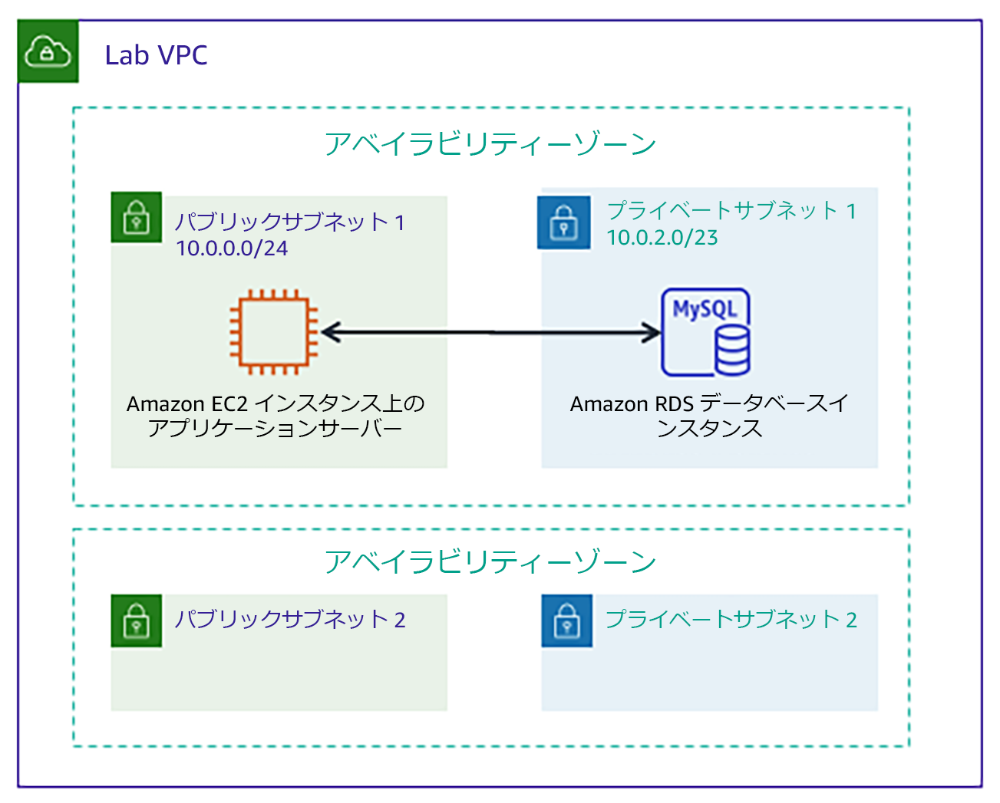

# モジュール 5 - ガイド付きラボ: Amazon RDS データベースを作成する

[//]: # "SKU: ILT-TF-200-ACACAD-2    Source Course: ILT-TF-100-ARCHIT-6 branch dev_65"

## ラボの概要と目標

従来、データベースの作成は、データベース管理者またはシステム管理者のいずれかを必要とする複雑なプロセスになる場合があります。クラウドでは、Amazon Relational Database Service (Amazon RDS) を使用して、このプロセスを簡素化できます。

このラボを完了すると、次のことができるようになります。

- **Amazon RDS** を使用してデータベースを起動する
- **データベースインスタンス**に接続できるようにウェブアプリケーションを設定する

ラボの**終了時**のアーキテクチャは次の例のようになります。

 

# 所要時間

このラボは、修了までに約 **20 分**かかります。

 

## AWS サービスの制限事項

このラボ環境では、AWS のサービスとサービスアクションへのアクセスが、ラボの手順を完了するために必要なものに制限される場合があります。他のサービスへのアクセスや、このラボで説明されているサービス以外のアクションを実行しようとすると、エラーが発生することがあります。

 

## AWS マネジメントコンソールにアクセスする

1. この手順の上部にある Start Lab をクリックし、ラボを起動します。

   [**Start Lab**] パネルが開き、ラボのステータスが表示されます。

   <i class="fas fa-info-circle"></i> **ヒント**: ラボの完了までにさらに時間が必要な場合は、Start Lab ボタンをもう一度選択して、この環境のタイマーを再開します。

2. \[**Start Lab**] パネルに **Lab status: ready** というメッセージが表示されたら [**X**] をクリックしてパネルを閉じます。

3. この手順の上部にある AWS をクリックします。

   このアクションにより、新しいブラウザタブで AWS マネジメントコンソールが開き、ユーザーは自動的にログインします。

   <i class="fas fa-exclamation-triangle"></i> **ヒント**: 新しいブラウザタブが開かない場合、通常、ブラウザによってサイトのポップアップウィンドウの表示がブロックされたというメッセージが表示されたバナーまたはアイコンがブラウザの上部に表示されます。バナーまたはアイコンを選択して [**ポップアップを許可**] を選択してください。

4. **AWS マネジメントコンソール**タブがこの手順と並べて表示されるようにします。両方のブラウザタブを同時に開いておくと、ラボのステップを実行しやすくなります。

   <i class="fas fa-exclamation-triangle"></i> **特に指示がない限り、リージョンを変更しないでください**。

 

## タスク 1: Amazon RDS データベースを作成する

このタスクでは、仮想プライベートクラウド（VPC）に MySQL データベースを作成します。MySQL は人気のあるオープンソースリレーショナルデータベース管理システム（RDBMS）であるため、ソフトウェアライセンス料金はありません。

<i class="fas fa-exclamation-triangle"></i> **Windows ユーザー:** このラボでは、Chrome または Firefox をウェブブラウザとして使用します。**Amazon RDS コンソールの違いにより、このラボの手順は、Internet Explorer では実行できません**。

5. サービス<i class="fas fa-angle-down"></i> で [**RDS**] をクリックします。

6. データベースの作成 をクリックします。

   <i class="fas fa-exclamation-triangle"></i>画面上部に **Switch to the new database creation flow** が表示された場合は、それをクリックします。

7. \[**エンジンのオプション**] で <i class="far fa-dot-circle"></i> **MySQL** をクリックします。

   このオプションには、エンタープライズクラスのデータベースから開発/テストシステムまで、いくつかのユースケースがあります。オプションに **Amazon Aurora** があることに気付くかもしれません。Aurora は、クラウド向けに再設計された MySQL 互換システムです。会社で大規模な MySQL または PostgreSQL データベースを使用している場合は、Aurora を使用してパフォーマンスを向上させることができます。

8. \[**テンプレート**] セクションで、<i class="far fa-dot-circle"></i> **開発/テスト** をクリックします。

   これで、ソフトウェアバージョン、インスタンスクラス、ストレージ、ログイン設定などのデータベース設定を選択できるようになりました。[**マルチ AZ 配置**] オプションを選択すると、2 番目のアベイラビリティーゾーンにデータベースのレプリカが自動的に作成され、高可用性を確保できます。ただし、このラボでは、単一のデータベースインスタンスを使用します。

9. \[**設定**] セクションで、以下のオプションを設定します。

   * **DB インスタンス識別子:** `inventory-db`

   * **マスターユーザー名:** `admin`

   * **マスターパスワード:** `lab-password`

   * **パスワードを確認:** `lab-password`

10. \[**DB インスタンスサイズ**] セクションで、以下のオプションを設定します。

    - <i class="far fa-dot-circle"></i> **バースト可能クラス (t クラスを含む)** をクリックします。

    - **db.t3.micro** を選択します。

11. \[**接続**] セクションで、[**Virtual Private Cloud (VPC)**] オプションを **Lab VPC** に設定します。

12. <i class="fas fa-caret-right"></i>[**追加の接続設定**] を展開し、以下のように設定します。

    - [**既存の VPC セキュリティグループ**] で [**DB-SG**] を選択します。このオプションが強調表示されます。

13. <i class="fas fa-caret-right"></i>[**追加設定**] を展開し、以下のように設定します。

    - **最初のデータベース名:** `inventory`
    - [**拡張モニタリングの有効化**] チェックボックスをオフ

    これは、アプリケーションによって使用されるデータベースの論理名です。

    <i class="fas fa-comment"></i> ページに表示される他の多くのオプションについては、確認して構いませんが、デフォルト値のままにしておいてください。オプションには、自動バックアップ、ログファイルのエクスポート機能、自動バージョンアップグレードなどがあります。チェックボックスを使ってこれらの機能を有効にできることは、自分でデータベースをインストール、バックアップ、メンテナンスする代わりに_フルマネージドデータベースソリューション_を使用することがいかに便利かを示しています。

14. （ページの最下部にある）データベースの作成 をクリックします。

    データベースインスタンスを作成しています というメッセージが表示されます。

    <i class="fas fa-exclamation-triangle"></i>**rds-monitoring-role** というエラーメッセージが表示される場合は、前の手順で **拡張モニタリング**のオプションをオフにしたことを確認してからやり直してください。

    次のタスクは、データベースインスタンスのステータスが**利用可能**になってから開始する必要があります。このプロセスには数分かかる場合があります。

 

## タスク 2: データベースインスタンスとのウェブアプリケーション通信を設定する

このラボでは、ウェブアプリケーションが実行されている Amazon Elastic Compute Cloud (Amazon EC2) インスタンスが自動的にデプロイされています。このアプリケーションに接続するには、インスタンスの IP アドレスを使用する必要があります。

15. サービス<i class="fas fa-angle-down"></i> で [**EC2**] をクリックします。

16. 左側のナビゲーションペインで [**インスタンス**] をクリックします。

    一覧に **App Server** という名前の実行中のインスタンスがあるはずです。

17. **App Server** インスタンスを選択します。

18. \[**詳細**] タブで [**パブリック IPv4 アドレス**] をクリップボードにコピーします。

    **ヒント:** IP アドレスにマウスカーソルを併せると、<i class="far fa-copy"></i> コピーアイコンが表示されます。表示された値をコピーするには、このアイコンをクリックします。

19. ウェブブラウザで新しいタブを開き、コピーした IP アドレスをアドレスバーに貼り付けて **Enter** キーを押します。

    ウェブアプリケーションが表示されます。アプリケーションがまだデータベースに接続されていないため、多くの情報は表示されません。

20. <i class="fas fa-cog" aria-hidden="true"></i>[**Settings**] をクリックします。

    これで、前に作成した RDS DB インスタンスを使用するようにアプリケーションを構成できます。まず、アプリケーションがデータベースへの接続方法を認識できるように、**データベースエンドポイント**を取得します。

21. **AWS マネジメントコンソール**に戻ります。ただし、アプリケーションタブは閉じないでください (すぐにこのタブに戻ります)。

22. サービス<i class="fas fa-angle-down"></i> で [**RDS**] をクリックします。

23. 左側のナビゲーションペインで [**データベース**] をクリックします。

24. inventory-db をクリックします。

25. \[**接続とセキュリティ**] セクションで [**エンドポイント**] をクリップボードにコピーします。

    この値は **inventory-db.crwxbgqad61a.rds.amazonaws.com** のようになります。

26. インベントリアプリケーションが表示されているブラウザタブに戻り、以下の値を入力します。

    * **Endpoint:** 先ほどコピーしたエンドポイントを貼り付けます。
    * **Database:** `inventory`
    * **Username:** `admin`
    * **Password:** `lab-password`
    * [**Save**] をクリックします。

    これで、アプリケーションはデータベースに接続し、初期データをロードして情報を表示できます。

27. ウェブアプリケーションを使用して、<i class="fas fa-plus"></i> インベントリの追加、<i class='fas fa-edit' style="color:#257ACF;"></i> 編集、<i class='fas fa-trash-alt' style='color:#d82323;'></i> インベントリ情報の削除を行います。

    インベントリ情報は、ラボの前半で作成した Amazon RDS MySQL データベースに保存されます。つまり、アプリケーションサーバーで障害が発生しても、データは失われ_ません_。また、複数のアプリケーションサーバーが同じデータにアクセスできます。

28. テーブルに新しいレコードを挿入します。作業内容を送信する前に、テーブルに 5 つ以上のインベントリレコードがあることを確認してください。

    <i class="fas fa-thumbs-up" style="color:green;"></i>アプリケーションが正常に起動し、データベースに接続されました。

    **オプション:** 保存したパラメータには、**Systems Manager** コンソールの [**パラメータストア**] からアクセスできます。

 

## 作業内容を送信する

29. この手順の上部にあるSubmit をクリックして進捗情報を記録し、プロンプトが表示されたら [**Yes**] をクリックします。

30. 数分経っても結果が表示されない場合は、この手順の上部に戻り、Grades をクリックします。

    **ヒント**: 作業内容は何度も送信できます。作業内容を変更したら、再度 [**Submit**] をクリックします。最終送信分がこのラボの作業内容として記録されます。

31. 作業に関する詳細なフィードバックを参照するには、Details ドロップダウンメニューから <i class="fas fa-caret-right"></i> **View Submission Report** を選択します。

 

## ラボの終了<i class="fas fa-graduation-cap"></i>

<i class="fas fa-flag-checkered"></i>お疲れ様でした。以上でラボは終了です。

32. ラボを終了するには、このページの上部にある End Lab をクリックし、Yes をクリックします。

    パネルに **DELETE has been initiated... You may close this message box now** というメッセージが表示されます。

33. 右上隅の [**X**] をクリックしてパネルを閉じます。

**©2020 Amazon Web Services, Inc. and its affiliates. All rights reserved. このトレーニング内容の全体または一部を複製または再配布することは、Amazon Web Services, Inc. の書面による事前の許可がある場合を除き、禁じられています。商業目的のコピー、貸与、または販売を禁止します。**
