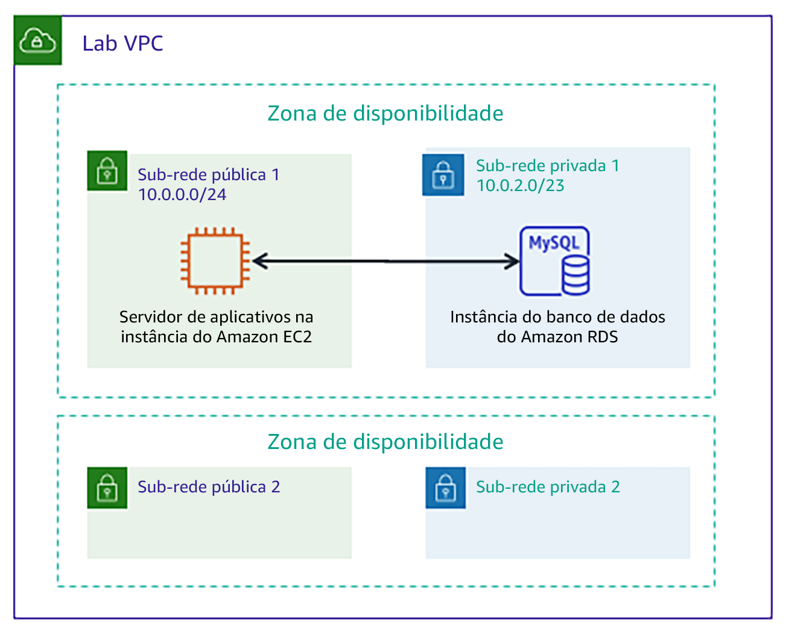

# Módulo 5 - Laboratório guiado: Criar um banco de dados do Amazon RDS

[//]: # "SKU: ILT-TF-200-ACACAD-2    Source Course: ILT-TF-100-ARCHIT-6 branch dev_65"

## Visão geral e objetivos do laboratório

Tradicionalmente, criar um banco de dados pode ser um processo complexo que requer um administrador de banco de dados ou um administrador de sistemas. Na nuvem, você pode simplificar esse processo usando o Amazon Relational Database Service (Amazon RDS).

Depois de concluir este laboratório, você deverá ser capaz de:

- Iniciar um banco de dados usando o **Amazon RDS**
- Configurar um aplicação Web para se conectar à **instância do banco de dados**

No **final** deste laboratório, sua arquitetura será semelhante ao seguinte exemplo:

 
## Duração

Este laboratório levará aproximadamente **20 minutos** para ser concluído.

 

## Restrições de serviço da AWS

Neste ambiente de laboratório, o acesso aos serviços e ações de serviço da AWS pode estar restrito àqueles necessários para concluir as instruções do laboratório. Você poderá encontrar erros se tentar acessar outros serviços ou executar ações além do que está descrito neste laboratório.

 

## Acessar o Console de Gerenciamento da AWS

1. Na parte superior destas instruções, escolha Start Lab (Iniciar laboratório) para iniciar o laboratório.

   Um painel **Start Lab** (Iniciar laboratório) é aberto com o status do laboratório.

   <i class="fas fa-info-circle"></i> **Dica**: se você precisar de mais tempo para concluir o laboratório, escolha novamente o botão Start Lab (Iniciar laboratório) para reiniciar o cronômetro do ambiente.

2. Aguarde até que o painel **Start Lab** (Iniciar laboratório) exiba a mensagem **Lab status: ready** (Status do laboratório: pronto) e, em seguida, escolha **X** para fechar o painel.

3. Na parte superior destas instruções, escolha AWS.

   Essa ação abrirá o Console de Gerenciamento da AWS em uma nova guia do navegador. O sistema fará seu login automaticamente.

   <i class="fas fa-exclamation-triangle"></i> **Dica**: se uma nova guia do navegador não for aberta, normalmente você verá uma faixa ou um ícone na parte superior do navegador com uma mensagem informando que o navegador está impedindo que o site abra janelas pop-up. Escolha a faixa ou o ícone e depois **Allow pop ups** (Permitir pop-ups).

4. Organize a guia do **Console de Gerenciamento da AWS** para que ela seja exibida com essas instruções. O ideal é ver as duas guias do navegador abertas ao mesmo tempo, para facilitar o acompanhamento das etapas do laboratório.

   <i class="fas fa-exclamation-triangle"></i> **Não altere a região, a menos que seja especificamente instruído a fazer isso**.

 

## Tarefa 1: criar um banco de dados do Amazon RDS

Nesta tarefa, você criará um banco de dados MySQL em sua virtual private cloud (VPC). MySQL é um sistema de gerenciamento de banco de dados relacional (RDBMS) de código aberto popular, portanto não há taxas de licenciamento de software.

<i class="fas fa-exclamation-triangle"></i> **Usuários do Windows:** use o Chrome ou o Firefox como seu navegador da Web para este laboratório. As instruções do laboratório **não são compatíveis com o _Internet Explorer_** devido a uma diferença no console do Amazon RDS.

5. No menu Services<i class="fas fa-angle-down"></i> (Serviços), escolha **RDS**.

6. Selecione Create database (Criar banco de dados)

   <i class="fas fa-exclamation-triangle"></i> Se a parte superior da tela mostrar **Switch to the new database creation flow** (Alternar para o novo fluxo de criação de banco de dados), escolha essa opção.

7. Em **Engine options** (Opções do mecanismo), selecione <i class="far fa-dot-circle"></i>**MySQL**.

   As opções incluem vários casos de uso, que vão desde bancos de dados de classe empresarial a sistemas Dev/Test. Nas opções, você pode notar o **Amazon Aurora**. O Aurora é um sistema compatível com MySQL que foi rearquitetado para a nuvem. Se sua empresa usa bancos de dados MySQL ou PostgreSQL em grande escala, o Aurora pode fornecer performance aprimorada.

8. Na seção **Templates** (Modelos), selecione <i class="far fa-dot-circle"></i> **Dev/Test** (Desenvolvimento/teste).

   Agora você pode selecionar uma configuração de banco de dados, incluindo versão do software, classe de instância, armazenamento e configurações de login. A opção de **implantação Multi-AZ** cria automaticamente uma réplica do banco de dados em uma segunda zona de disponibilidade para alta disponibilidade. Neste laboratório, no entanto, você usará uma única instância de banco de dados.

9. Sob a seção **Settings** (Configurações), configure estas opções:

   * **DB instance identifier** (Identificador de instância de Banco de Dados): `inventory-db`

   * **Username** (Nome de usuário): `admin`

   * **Password** (Senha): `lab-password`

   * **Confirm password** (Confirmar senha): `lab-password`

10. Na seção **DB instance size** (Tamanho da instância do banco de dados), configure estas opções:

    - Selecione <i class="far fa-dot-circle"></i>**Burstable classes (includes t classes)** (Classes com capacidade de intermitência (incluem classes t)).

    - Selecione **db.t2.micro**

11. Na seção **Connectivity** (Conectividade), configure esta opção:**Virtual Private Cloud** (VPC): _Lab VPC (VPC do laboratório)_

12. Expanda a **configuração <i class="fas fa-caret-right"></i>adicional da conectividade** e, em seguida, defina esta configuração:

    - Para **grupos de segurança VPC existentes:** escolha _DB-SG_. Será destacado.

13. Expanda <i class="fas fa-caret-right"></i>**Additional configuration** (Configuração adicional) e defina estas configurações:

    - **Initial database name** (Nome do banco de dados inicial): `inventory`
    - Desmarque (desative) a opção **Enable Enhanced monitoring** (Habilitar monitoramento aprimorado)

    Esse é o nome lógico do banco de dados que será usado pela aplicação.

    <i class="fas fa-comment"></i> Sinta-se livre para revisar as muitas outras opções exibidas na página, mas deixe-as definidas para seus valores padrão. As opções incluem backups automáticos, a capacidade de exportar arquivos de log e atualizações automáticas de versão. A capacidade de ativar esses recursos através de caixas de seleção demonstra o poder de usar uma _solução de banco de dados totalmente gerenciada_ em vez de instalar, fazer backup e manter o banco de dados você mesmo.

14. Escolha Create database (Criar banco de dados) (na parte inferior da página).

    Você deve receber esta mensagem: Your DB instance is being created (Sua instância de banco de dados está sendo criada).

    <i class="fas fa-exclamation-triangle"></i> Se você receber uma mensagem de erro que menciona _rds-monitoring-role_, confirme se você cancelou (desativou) a opção **Enhanced Monitoring** (Monitoramento aprimorado) na etapa anterior e tente novamente.

    Antes de continuar para a próxima tarefa, o status da instância de banco de dados deve estar *Available (Disponível)*. Este processo pode levar vários minutos.

 
## Tarefa 2: configurar a comunicação de aplicações Web com uma instância de banco de dados

Esse laboratório implantou automaticamente uma instância do Amazon Elastic Compute Cloud (Amazon EC2) com uma aplicação Web em execução. Você deve usar o endereço IP da instância para se conectar à aplicação.

15. No menu Services (Serviços)<i class="fas fa-angle-down"></i>, escolha **EC2**.

16. No painel de navegação à esquerda, escolha **Instances** (Instâncias).

    No painel central, deve haver uma instância em execução chamada **App Server**.

17. Selecione a instância do **App Server**.

18. Na guia **Description** (Descrição), copie o **IP público IPv4** para a área de transferência.

    **Dica:** se você passar o mouse sobre o endereço IP, um ícone de cópia <i class="far fa-copy"></i> será exibido. Para copiar o valor exibido, escolha o ícone.

19. Abra uma nova guia do navegador da Web, cole o endereço IP na barra de endereço e pressione ENTER.

    A aplicação Web deve ser exibida. Ela não exibe muitas informações porque ainda não está conectada ao banco de dados.

20. Escolha <i class="fas fa-cog" aria-hidden="true"></i>**Settings (Configurações)**.

    Agora você pode configurar a aplicação para usar a instância de banco de dados do RDS criada anteriormente. Primeiro, você recuperará o **endpoint do banco de dados** para que a aplicação saiba como se conectar a um banco de dados.

21. Volte para o **Console de Gerenciamento da AWS**, mas não feche a guia da aplicação. Você retornará a ela em breve.

22. No menu Services (Serviços)<i class="fas fa-angle-down"></i>, escolha **RDS**.

23. No painel de navegação à esquerda, escolha **Databases** (Bancos de dados).

24. Escolha inventory-db.

25. Role até a seção **Connectivity & Security** (Conectividade e segurança) e copie o **Endpoint** para sua área de transferência.

    Deve ser semelhante a: _inventory-db.crwxbgqad61a.rds.amazonaws.com_

26. Retorne à guia do navegador com a aplicação Inventário e insira estes valores:

    * **Endpoint:** cole o endpoint que você copiou anteriormente
    * **Database** (Banco de dados): `inventory`
    * **Username** (Nome de usuário): `admin`
    * **Password** (Senha): `lab-password`
    * Escolha **Save** (Salvar).

    A aplicação agora se conectará ao banco de dados, carregará alguns dados iniciais e exibirá informações.

27. <i class="fas fa-plus"></i> Adicione o inventário, <i class='fas fa-edit' style="color:#257ACF;"></i> edite e <i class='fas fa-trash-alt' style='color:#d82323;'></i>exclua informações de inventário usando a aplicação Web.

    As informações de inventário são armazenadas no banco de dados MySQL do Amazon RDS que você criou anteriormente no laboratório. Isso significa que qualquer falha no servidor de aplicações _não_ perderá nenhum dado. Isso também significa que vários servidores de aplicações podem acessar os mesmos dados.

28. Insira novos registros na tabela. Certifique-se de que a tabela tenha 5 ou mais registros de inventário antes de enviar seu trabalho.

    <i class="fas fa-thumbs-up" style="color:green;"></i> Agora você iniciou a aplicação com êxito e a conectou ao banco de dados!

    **Opcional:** você pode acessar os parâmetros salvos no console do **Systems Manager**, em **Parameter Store** (Repositório de parâmetros).

 

## Enviar o trabalho

29. Na parte superior destas instruções, escolha Submit (Enviar) para gravar o progresso e, quando solicitado, escolha **Yes** (Sim).

30. Se os resultados não forem exibidos após alguns minutos, volte ao topo destas instruções e escolha Grades (Notas).

**Dica**: você pode enviar seu trabalho várias vezes. Depois de alterar o trabalho, escolha **Submit** (Enviar) novamente. Seu último envio é o que será gravado para este laboratório.

31. Para ver o feedback detalhado do seu trabalho, escolha Details (Detalhes) e depois <i class="fas fa-caret-right"></i> **View Submission Report** (Visualizar relatório de envio).

 

## Laboratório concluído <i class="fas fa-graduation-cap"></i>

<i class="fas fa-flag-checkered"></i> Parabéns! Você concluiu o laboratório.

32. Escolha End Lab (Encerrar laboratório) na parte superior desta página e, em seguida, selecione Yes (Sim) para confirmar que você deseja encerrar o laboratório.

    Um painel será exibido com a mensagem: *DELETE has been initiated... You may close this message box now. (A EXCLUSÃO foi iniciada... Você pode fechar esta caixa de mensagem agora).*

33. Escolha o **X** no canto superior direito para fechar o painel.

*©2020, Amazon Web Services, Inc. e suas afiliadas. Todos os direitos reservados. Este trabalho não pode ser reproduzido ou redistribuído, no todo ou em parte, sem permissão prévia por escrito da Amazon Web Services, Inc. É proibido copiar, emprestar ou vender para fins comerciais.*

