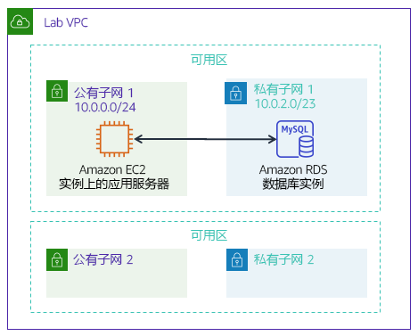

# 模块 5 – 指导实验：创建 Amazon RDS 数据库

[//]: # "SKU: ILT-TF-200-ACACAD-2    Source Course: ILT-TF-100-ARCHIT-6 branch dev_65"

## 实验概览和目标

传统上，创建数据库可能是一个复杂的过程，需要数据库管理员或系统管理员。在云中，您可以通过使用 Amazon Relational Database Service (Amazon RDS) 简化此过程。

完成本实验后，您应能够：

- 使用 **Amazon RDS** 启动一个数据库
- 配置 Web 应用程序以连接到**数据库实例**

在本实验**结束**时，您的架构将如下例所示：

 
## 持续时间

完成本实验大约需要 **20 分钟**。

 

## AWS 服务限制

在本实验环境中，对 AWS 服务和服务操作的访问可能仅限于完成实验说明所需的服务和服务操作。如果您尝试访问其他服务或执行本实验中所述之外的操作，可能会遇到错误。

 

## 访问 AWS 管理控制台

1. 在这些说明的顶部，选择 Start Lab（启动实验）即可启动您的实验。

   **Start Lab**（启动实验）面板随即会打开，其中显示了实验状态。

   <i class="fas fa-info-circle"></i> **提示**：如果您需要更多时间来完成实验，请再次选择 Start Lab（启动实验）按钮，重新启动环境计时器。

2. 请耐心等待，直到 **Start Lab**（启动实验）面板显示消息 **Lab status: ready**（实验状态：就绪），然后选择 **X** 关闭此面板。

3. 在这些说明的顶部，选择 AWS。

   此操作将在一个新的浏览器选项卡中打开 AWS 管理控制台。您将自动登录系统。

   <i class="fas fa-exclamation-triangle"></i> **提示**：如果未打开新的浏览器选项卡，您的浏览器顶部通常会出现一个横幅或图标，并显示一条消息，指明您的浏览器阻止该了网站打开弹出窗口。请选择横幅或图标，然后选择 **Allow pop-ups**（允许弹出窗口）。

4. 排列 **AWS 管理控制台**选项卡，使其与这些说明一起显示。理想情况下，您将同时打开两个浏览器选项卡，以便能够更轻松地执行实验步骤。

   <i class="fas fa-exclamation-triangle"></i> **除非特别要求，否则请勿更改区域**。

 

## 任务 1：创建 Amazon RDS 数据库

在此任务中，您将在 Virtual Private Cloud (VPC) 中创建 MySQL 数据库。MySQL 是一种流行的开源关系数据库管理系统 (RDBMS)，因此不需要支付软件许可费用。

<i class="fas fa-exclamation-triangle"></i> **Windows 用户：**使用 Chrome 或 Firefox 作为本实验的网络浏览器。由于 Amazon RDS 控制台的差异，实验说明**不兼容于 _Internet Explorer_**。

5. 在 Services <i class="fas fa-angle-down"></i>（服务）菜单上，选择 **RDS**。

6. 选择Create database（创建数据库）

   <i class="fas fa-exclamation-triangle"></i> 如果屏幕顶部显示 **Switch to the new database creation flow**（切换到新数据库创建流程），则选择它。

7. 在 **Engine options**（引擎选项）下，选择 <i class="far fa-dot-circle"></i>**MySQL**。

   这些选项包括多种使用案例，从企业级数据库到开发/测试系统。在选项中，您可能会注意到 **Amazon Aurora**。Aurora 是一款与 MySQL 兼容的系统，已针对云进行了重新设计。如果贵公司使用大规模 MySQL 或 PostgreSQL 数据库，Aurora 可以提供增强的性能。

8. 在 **Templates**（模板）部分下，选择 <i class="far fa-dot-circle"></i> **Dev/Test**（开发/测试）。

   您现在可以选择数据库配置，包括软件版本、实例类、存储和登录设置。**Multi-AZ deployment**（多可用区部署）选项会自动在第二个可用区中创建数据库副本以实现高可用性。但是，在本实验中，您将使用单个数据库实例。

9. 在 **Settings**（设置）部分下，配置以下选项：

   * **DB instance identifier**（数据库实例标识符）：`inventory-db`

   * **Username**（用户名）：`admin`

   * **Password**（主密码）：`lab-password`

   * **Confirm password**（确认密码）：`lab-password`

10. 在 **DB instance size**（数据库实例大小）部分下，配置以下选项：

    - 选择 <i class="far fa-dot-circle"></i> **Burstable classes** (includes t classes)（可突增类（包括 t 类））。

    - 选择 **db.t2.micro**

11. 在 **Connectivity**（连接）部分下，配置此选项：**Virtual Private Cloud (VPC)：**_Lab VPC_

12. 展开 <i class="fas fa-caret-right"></i> **Additional connectivity configuration**（其他连接配置），然后进行以下配置：

    - 对于**现有 VPC 安全组：**选择 _DB-SG_。它会突出显示。

13. 展开 <i class="fas fa-caret-right"></i> **Additional configuration**（其他配置），然后进行以下配置：

    - **Initial database name**（初始数据库名称）：`inventory`
    - 清除（关闭）**Enable Enhanced monitoring**（启用增强监测）选项

    这是应用程序将要使用的数据库的逻辑名称。

    <i class="fas fa-comment"></i> 随时查看页面上显示的其他许多选项，但将它们设置为默认值。选项包括自动备份、导出日志文件的能力和自动版本升级。通过复选框激活这些功能的能力展示了使用_完全托管的数据库解决方案_（而不是自己安装、备份和维护数据库）的强大功能。

14. 选择 Create database（创建数据库）（位于页面底部）。

    您应该会收到以下消息：Your DB instance is being created（正在创建您的数据库实例）。

    <i class="fas fa-exclamation-triangle"></i> 如果您收到一条错误消息，提及 _rds-monitoring-role_，请确认您已在上一步取消（关闭）**Enhanced Monitoring**（增强监控）选项，然后重试。

    在继续执行下一个任务之前，数据库实例的状态必须为 *Available*（可用）。此过程可能需要几分钟的时间。

 
## 任务 2：用数据库实例配置 Web 应用程序通信

本实验会自动使用正在运行的 Web 应用程序部署 Amazon Elastic Compute Cloud (Amazon EC2) 实例。您必须使用实例的 IP 地址才能连接到应用程序。

15. 在 Services <i class="fas fa-angle-down"></i>（服务）菜单上，选择 **EC2**。

16. 在左侧导航窗格中，选择 **Instances**（实例）。

    在中央窗格中，应该有一个名为 **App Server** 的正在运行的实例。

17. 选择 **App Server**（应用程序服务器）实例。

18. 将 **Description**（详细信息）选项卡中的 **IPv4 Public IP**（公有 IPv4 地址）复制到剪贴板。

    **提示：**如果将鼠标悬停在 IP 地址上，将显示一个复制 <i class="far fa-copy"></i> 图标。要复制显示的值，请选择该图标。

19. 打开一个新的 Web 浏览器标签页，将 IP 地址粘贴到地址栏中并按下 Enter 键。

    应该出现 Web 应用程序。它不会显示太多信息，因为应用程序尚未连接到数据库。

20. 选择 <i class="fas fa-cog" aria-hidden="true"></i> **Settings**（设置）。

    现在，您可以将应用程序配置为使用您之前创建的 RDS 数据库实例。您将首先检索 **Database Endpoint**（数据库终端节点），以便应用程序知道如何连接到数据库。

21. 返回 **AWS 管理控制台**，但不要关闭应用程序选项卡。（因为您很快还要返回。）

22. 在 Services <i class="fas fa-angle-down"></i>（服务）菜单上，选择 **RDS**。

23. 在左侧导航窗格中，选择 **Databases**（数据库）。

24. 点击 inventory-db。

25. 向下滚动至 **Connectivity & security**（连接和安全性）部分，并将**终端节点**复制到剪贴板。

    它的形式应当类似于：_inventory-db.crwxbgqad61a.rds.amazonaws.com_

26. 返回库存应用程序的浏览器标签页，然后输入以下值：

    * **Endpoint**（终端节点）：粘贴您之前复制的终端节点
    * **Database**（数据库）：`inventory`
    * **Username**（用户名）：`admin`
    * **Password**（密码）：`lab-password`
    * 选择 **Save**（保存）

    现在，应用程序将连接到数据库，加载一些初始数据并显示相关信息。

27. 使用 Web 应用程序 <i class="fas fa-plus"></i> 添加、<i class='fas fa-edit' style="color:#257ACF;"></i> 编辑和 <i class='fas fa-trash-alt' style='color:#d82323;'></i> 删除库存清单信息。

    库存清单信息存储在您之前在实验中创建的 Amazon RDS MySQL 数据库中。这意味着应用程序服务器中的任何故障都_不_会丢失任何数据。这还意味着多个应用程序服务器可以访问相同的数据。

28. 在表中插入新记录。在提交作业之前，请确保表格具有 5 个或更多库存记录。

    <i class="fas fa-thumbs-up" style="color:green;"></i> 现在，您已经成功地启动了应用程序并将其连接到数据库！

    **可选**：您可以在 **Systems Manager** 控制台中的 **Parameter Store**（参数仓库）下访问已保存的参数。

 

## 提交作业

29. 在这些说明的顶部，选择 Submit（提交）记录您的进度，在出现提示时，选择 **Yes**（是）。

30. 如果在几分钟后仍未显示结果，请返回到这些说明的顶部，并选择 Grades（成绩）

**提示**：您可以多次提交作业。更改作业后，再次选择 **Submit**（提交）即可。您最后一次提交的作业将记录为本实验的成绩。

31. 要查找有关您作业的详细反馈，请选择 Details（详细信息），然后选择 <i class="fas fa-caret-right"></i> **View Submission Report**（查看提交报告）。

 

## 实验完成 <i class="fas fa-graduation-cap"></i>

<i class="fas fa-flag-checkered"></i> 恭喜！您已完成实验。

32. 选择此页面顶部的 End Lab（结束实验），然后选择 Yes（是）确认您要结束实验。

    此时应显示一个面板，并显示消息：*DELETE has been initiated... You may close this message box now.*（删除操作已启动...您现在可以关闭此消息框。）   

33. 选择右上角的 **X** 以关闭面板。

*©2020 Amazon Web Services, Inc. 及其附属公司。保留所有权利。未经 Amazon Web Services, Inc. 事先书面许可，不得复制或转载本文的部分或全部内容。禁止商业性复制、出租或出售。*
