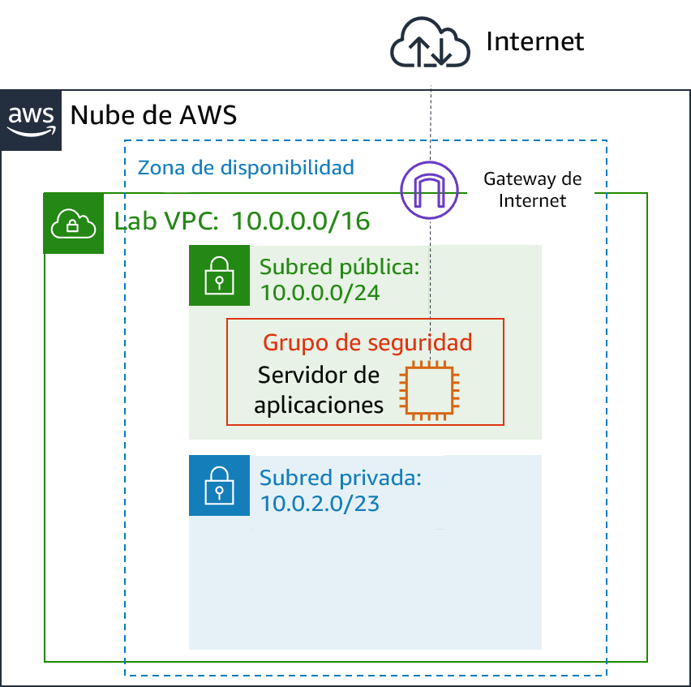
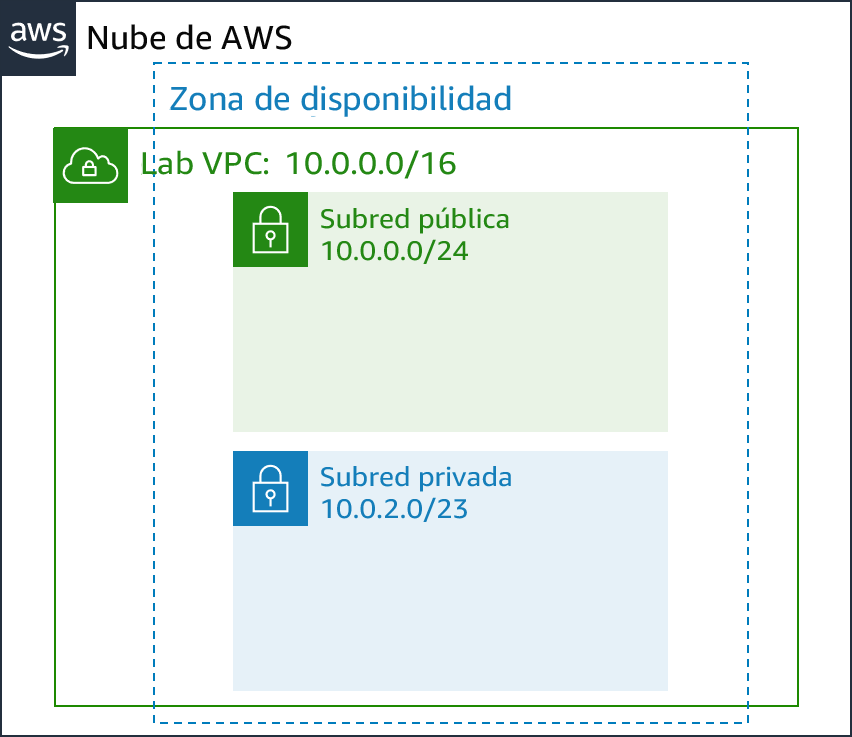

# Laboratorio guiado del módulo 6: Creación de una nube virtual privada

[//]: # "SKU: ILT-TF-200-ACACAD-2    Source Course: ILT-TF-100-ARCHIT-6 branch dev_65"

## Información general y objetivos del laboratorio

Las redes tradicionales presentan dificultades. Involucran equipo, cableado, configuraciones complejas y habilidades especializadas. Amazon Virtual Private Cloud (Amazon VPC) oculta la complejidad y facilita la implementación de redes privadas seguras.

Este laboratorio muestra cómo crear su propia nube virtual privada (VPC), implementar recursos y crear interconexiones privadas entre las VPC.

Después de completar este laboratorio, debería ser capaz de lo siguiente:

- implementar una VPC
- crear una gateway de Internet y asociarla a la VPC
- crear una subred pública
- crear subredes privadas
- crear un servidor de aplicaciones para probar la VPC


Cuando **termine** este laboratorio, la arquitectura se verá como en el siguiente ejemplo:




<br/>
## Duración

Para completar este laboratorio, se necesitan aproximadamente **30 minutos**.

<br/>

## Restricciones de los servicios de AWS

En este entorno de laboratorio, el acceso a los servicios y las acciones de los servicios de AWS puede restringirse a los que se necesiten para cumplir las instrucciones del laboratorio. Es posible que se produzcan errores si intenta acceder a otros servicios o hacer acciones que no sean las que se describen en este laboratorio.

<br/>

## Acceso a la consola de administración de AWS

1. En la parte superior de estas instrucciones, elija <span id="ssb_voc_grey">Start Lab</span> (Iniciar laboratorio) y comience a trabajar en él.

   Se abrirá el panel **Start Lab** (Iniciar laboratorio), donde se muestra el estado del laboratorio.

   <i class="fas fa-info-circle"></i> **Sugerencia**: Si necesita más tiempo para completar el laboratorio, vuelva a hacer clic en el botón <span id="ssb_voc_grey">Start Lab</span> (Iniciar laboratorio) para reiniciar el temporizador del entorno.

2. Espere hasta que el panel **Start Lab** (Iniciar laboratorio) muestre el mensaje *Lab Status: ready (Estado del laboratorio: listo)* y, luego, cierre el panel haciendo clic en la **X**.

3. En la parte superior de estas instrucciones, elija <span id="ssb_voc_grey">AWS</span>.

   Con esta acción, se abrirá la consola de administración de AWS en una nueva pestaña del navegador, y el sistema iniciará su sesión de forma automática.

   <i class="fas fa-exclamation-triangle"></i> **Sugerencia**: Si no se abre una nueva pestaña del navegador, por lo general habrá un aviso o un icono en la parte superior, el cual indicará que el navegador impide que el sitio abra ventanas emergentes. Haga clic en el aviso o el icono y elija **Allow pop ups** (Permitir ventanas emergentes).

4. Ubique la pestaña de la **consola de administración de AWS** de modo que aparezca junto con estas instrucciones. El método más óptimo sería tener ambas pestañas del navegador abiertas al mismo tiempo para que pueda seguir los pasos del laboratorio más fácilmente.

   <i class="fas fa-exclamation-triangle"></i> **No cambie la región a menos que se le indique expresamente que debe hacerlo**.

<br/>

## Tarea 1: Crear una VPC

Comenzará por utilizar Amazon VPC para crear una nueva **nube virtual privada o VPC**.

Una VPC es una red virtual dedicada a su cuenta de Amazon Web Services (AWS). Está aislada de manera lógica de otras redes virtuales en la nube de AWS. Puede lanzar recursos de AWS, como instancias de Amazon Elastic Compute Cloud (Amazon EC2), en la VPC. Puede configurar la VPC modificando su intervalo de direcciones IP y crear subredes. Además, puede configurar tablas de enrutamiento, gateways de red y ajustes de seguridad.

5. En la **consola de administración de AWS**, en el menú <span id="ssb_services">Services<i class="fas fa-angle-down"></i></span> (Servicios), elija **VPC**.

   La consola de VPC ofrece un asistente que puede crear de manera automática varias arquitecturas de VPC. Sin embargo, en este laboratorio, creará los componentes de la VPC de forma manual.

6. En el panel de navegación izquierdo, elija **Your VPCs** (Sus VPC).

   Se proporciona una VPC predeterminada para que pueda lanzar recursos en cuanto comience a utilizar AWS. También hay una **VPC compartida** que utilizará más tarde en el laboratorio. Sin embargo, ahora creará su propia _Lab VPC_.

   La VPC tendrá el intervalo de direccionamiento entre dominios sin clases (CIDR) **10.0.0.0/16**, que incluye todas las direcciones IP que comienzan con **10.0.x.x**. Contiene más de 65 000 direcciones. Posteriormente, repartirá las direcciones entre distintas _subredes_.

7. Elija <span id="ssb_blue">Create VPC</span> (Crear VPC) y configure los siguientes ajustes:

   - **Name tag** (Etiqueta de nombre): `Lab VPC`
   - **IPv4 CIDR block** (Bloque de CIDR IPv4): `10.0.0.0/16`
   - Elija <span id="ssb_blue">Create</span> (Crear) y, a continuación, <span id="ssb_blue">Close</span> (Cerrar).

   <i class="fas fa-comment"></i> Si estas opciones no aparecen, cancele la configuración. En el panel de navegación a la izquierda, asegúrese de que eligió **Your VPCs** (Sus VPC). A continuación, vuelva a seleccionar **Create VPC** (Crear VPC).

8. Seleccione <i class="far fa-check-square"></i>**Lab VPC** y asegúrese de que sea la única VPC seleccionada.

9. En la mitad inferior de la página, elija la pestaña **Tags** (Etiquetas).

   Las etiquetas son útiles para identificar recursos. Por ejemplo, puede utilizar una etiqueta para identificar centros de costos o entornos diferentes (como desarrollo, prueba o producción).

10. Elija <span id="ssb_grey">Actions (Acciones)<i class="fas fa-angle-down"></i></span> y seleccione **Edit DNS hostnames** (Editar nombres de alojamiento de DNS).

    Esta opción asigna un nombre del sistema de nombres de dominio (DNS) _fácil de recordar_ a las instancias EC2 en la VPC, como, por ejemplo:

    _ec2-52-42-133-255.us-west-2.compute.amazonaws.com_

11. Seleccione <i class="far fa-check-square"></i>**enable** (habilitar) y elija <span id="ssb_blue">Save</span> (Guardar), además de <span id="ssb_blue">Close</span> (Cerrar).

    Todas las instancias EC2 que se lancen en la VPC ahora recibirán de manera automática un nombre de alojamiento de DNS. También puede agregar un nombre de DNS más significativo (como _aplicación.ejemplo.com_) más adelante utilizando Amazon Route 53.


## Tarea 2: Crear subredes

Una subred es un subintervalo de direcciones IP en la VPC. Los recursos de AWS se pueden lanzar en una subred especificada. Utilice una _subred pública_ para los recursos que requieran conexión a Internet y una _subred privada_ para los que deban permanecer aislados de Internet.

En esta tarea, creará una subred pública y una privada:



<br/>
### Crear una subred pública

La subred pública se utilizará para los recursos expuestos a Internet.

12. En el panel de navegación izquierdo, elija **Subnets** (Subredes).

13. Elija <span id="ssb_blue">Create subnet</span> (Crear subred) y configure los siguientes ajustes:

    - **Name tag** (Etiqueta de nombre): `Public Subnet (Subred pública)`
    - **VPC:** _Lab VPC_
    - **Availability Zone** (Zona de disponibilidad): seleccione la _primera_ zona de disponibilidad de la lista (_No_ elija **No Preference** [Sin preferencia]).
    - **IPv4 CIDR block** (Bloque de CIDR IPv4): `10.0.0.0/24`
    - Elija <span id="ssb_blue">Create</span> (Crear) y, a continuación, <span id="ssb_blue">Close</span> (Cerrar).

    <i class="fas fa-comment"></i> La VPC tiene un bloque de CIDR *10.0.0.0/16*, que incluye todas las direcciones IP *10.0.x.x*. La subred que acaba de crear tiene un bloque de CIDR *10.0.0.0/24*, que incluye todas las direcciones IP *10.0.0.x*. Tienen aspecto similar, pero la subred es más pequeña que la VPC debido al _/24_ en el intervalo del CIDR.

    Ahora configurará la subred de manera que se asigne automáticamente una dirección IP pública a todas las instancias lanzadas dentro de ella.

14. Seleccione <i class="far fa-check-square"></i>**Public Subnet** (Subred pública).

15. Elija <span id="ssb_grey">Actions (Acciones) <i class="fas fa-angle-down"></i></span> y seleccione **Modify auto-assign IP settings** (Modificar configuración de asignación automática de IP). Luego, haga lo siguiente:

    - Seleccione <i class="far fa-check-square"></i>**Auto-assign IPv4** (Asignar automáticamente IPv4).
    - Elija <span id="ssb_blue">Save</span> (Guardar).

    <i class="fas fa-comment"></i> Aunque esta subred se denomina _Public Subnet (Subred pública)_, todavía no es pública. Una subred pública debe tener una gateway de Internet, la cual asociará en la siguiente tarea.

<br/>

### Crear una subred privada

La subred privada se utilizará para los recursos que deban permanecer aislados de Internet.

16. Utilice lo que acaba de aprender para crear otra subred con los siguientes ajustes:

    - **Name tag** (Etiqueta de nombre): `Private Subnet (Subred privada)`
    - **VPC:** _Lab VPC_
    - **Availability Zone** (Zona de disponibilidad): seleccione la _primera_ zona de disponibilidad de la lista (_No_ elija **No Preference** [Sin preferencia]).
    - **IPv4 CIDR block** (Bloque de CIDR IPv4): `10.0.2.0/23`

    El bloque de CIDR *10.0.2.0/23* incluye todas las direcciones IP que comienzan con *10.0.2.x* y *10.0.3.x*. Esto representa un tamaño el doble de grande en comparación con el de la subred pública, ya que la mayoría de los recursos deben mantenerse privados, a menos que deban ser accesibles en particular desde Internet.

    Su VPC ahora tiene dos subredes. Sin embargo, la subred pública está totalmente aislada y no puede comunicarse con recursos fuera de la VPC. A continuación, configurará la subred pública de manera que se conecte a Internet a través de una gateway de Internet.

<br/>

## Tarea 3: Crear una gateway de Internet

Una *gateway de Internet* es un componente de VPC al cual se aplica escalado horizontal, es redundante y tiene alta disponibilidad. Además, permite la comunicación entre las instancias en la VPC y el Internet. No implica riesgos de disponibilidad ni restricciones de ancho de banda para el tráfico de red.

Una gateway de Internet cumple dos propósitos:

- proporcionar un objetivo en las tablas de enrutamiento que se conecte a Internet
- realizar la conversión de direcciones de red (NAT) para las instancias a las que se les asignaron direcciones IPv4 públicas

En esta tarea, creará una gateway de Internet para que el tráfico de Internet pueda obtener acceso a la subred pública.

17. En el panel de navegación izquierdo, elija **Internet Gateways** (Gateways de Internet).

18. Elija <span id="ssb_blue">Create internet gateway</span> (Crear gateway de Internet) y configure los siguientes ajustes:

    - **Name tag** (Etiqueta de nombre): `Lab IGW (Gateway de Internet de laboratorio)`
    - Elija <span id="ssb_blue">Create</span> (Crear) y, a continuación, <span id="ssb_blue">Close</span> (Cerrar).

    Ahora puede asociar la gateway de Internet a su _Lab VPC_.

19. Seleccione <i class="far fa-check-square"></i> **Lab IGW** (Gateway de Internet de laboratorio) y asegúrese de que sea la única gateway seleccionada.

20. Elija <span id="ssb_grey">Actions (Acciones)<i class="fas fa-angle-down"></i></span> y, a continuación, **Attach to VPC** (Asociar a VPC) para luego configurar los siguientes ajustes:

    - **VPC:** en la lista, seleccione _Lab VPC_.
    - Elija <span id="ssb_blue">Attach</span> (Asociar).

    Esta acción asociará la gateway de Internet a su _Lab VPC_. Aunque haya creado una gateway de Internet y la haya asociado a su VPC, también debe configurar la _tabla de enrutamiento_ de la subred pública para que utilice la gateway de Internet.

<br/>
## Tarea 4: Configurar tablas de enrutamiento

Una *tabla de enrutamiento* contiene un conjunto de reglas, denominadas *rutas*, que se utilizan para determinar hacia dónde se dirige el tráfico de red. Cada subred de una VPC debe estar asociada a una tabla de enrutamiento porque la tabla controla el direccionamiento de la subred. Una subred solo se puede asociar a una tabla de enrutamiento a la vez, pero puede asociar varias subredes a la misma tabla de enrutamiento.

Para utilizar una gateway de Internet, la tabla de enrutamiento de una subred debe contener una ruta que dirija el tráfico con destino a Internet a la gateway de Internet. Si una subred está asociada a una tabla de enrutamiento que tiene una ruta hacia una gateway de Internet, se conoce como _subred pública_.

En esta tarea, realizará lo siguiente:

* crear una _tabla de enrutamiento pública_ para el tráfico con destino a Internet
* agregar una _ruta_ a la tabla de enrutamiento para dirigir el tráfico con destino a Internet hacia la gateway de Internet
* asociar la subred pública a la nueva tabla de enrutamiento

21. En el panel de navegación izquierdo, elija **Route Tables** (Tablas de enrutamiento).

    Se muestran varias tablas de enrutamiento, pero solo hay una tabla de enrutamiento asociada a *Lab VPC*. Esta tabla de enrutamiento dirige el tráfico a destinos locales, por lo que se denomina _tabla de enrutamiento privada_.

22. En la columna **VPC ID** (ID de VPC), seleccione <i class="far fa-check-square"></i> la tabla de enrutamiento que muestra **Lab VPC** (puede expandir la columna para ver los nombres).

23. En la columna **Name** (Nombre), elija <i class="fas fa-pencil-alt"></i>, escriba el nombre `Private Route Table (Tabla de enrutamiento privada)` y elija <i class="fas fa-check-circle"></i>.

24. En la mitad inferior de la página, elija la pestaña **Routes** (Rutas).

    Solo existe una ruta y esta muestra que todo el tráfico destinado a _10.0.0.0/16_ (que es el intervalo de la _Lab VPC_) se dirigirá _a destinos locales_. Esta ruta permite que todas las subredes de una VPC se comuniquen entre sí.

    Ahora, creará una nueva tabla de enrutamiento pública para enviar el tráfico público a la gateway de Internet.

25. Elija <span id="ssb_blue">Create route table</span> (Crear tabla de enrutamiento) y defina los siguientes ajustes:

    - **Name tag** (Etiqueta de nombre): `Public Route Table (Tabla de enrutamiento pública)`
    - **VPC:** _Lab VPC_
    - Elija <span id="ssb_blue">Create</span> (Crear) y, a continuación, <span id="ssb_blue">Close</span> (Cerrar).

26. Seleccione <i class="far fa-check-square"></i> **Public Route Table** (Tabla de enrutamiento pública) y asegúrese de que sea la única tabla de enrutamiento seleccionada.

27. En la pestaña **Routes** (Rutas), elija <span id="ssb_grey">Edit routes</span> (Editar rutas).

    Ahora, agregará una ruta para dirigir el tráfico con destino a Internet (_0.0.0.0/0_) hacia la gateway de Internet.

28. Elija <span id="ssb_grey">Add rule</span> (Agregar ruta) y, luego, configure los siguientes ajustes:

    * **Destination** (Destino): `0.0.0.0/0`
    * **Target** (Objetivo): seleccione _Internet Gateway (Gateway de Internet)_ y, a continuación, seleccione en la lista _Lab IGW (Gateway de Internet de laboratorio)_.
    * Elija <span id="ssb_blue">Save routes</span> (Guardar rutas) y, a continuación, <span id="ssb_blue">Close</span> (Cerrar).

    El último paso consiste en _asociar_ esta nueva tabla de enrutamiento a la subred pública.

29. Elija la pestaña **Subnet Associations** (Asociaciones de subredes).

30. Elija <span id="ssb_grey">Edit subnet associations</span> (Editar asociaciones de subredes).

31. Seleccione <i class="far fa-check-square"></i> la fila de **Public Subnet** (Subred pública).

32. Elija <span id="ssb_blue">Save</span> (Guardar).

    La subred pública ahora es _pública_ porque tiene una entrada de tabla de enrutamiento que envía tráfico a Internet a través de la gateway de Internet.

    Para resumir, puede crear una subred pública siguiendo los pasos que se indican a continuación:

    - crear un _gateway de Internet_

    - crear una _tabla de enrutamiento_

    - agregar una _ruta_ a la tabla de enrutamiento que dirija el tráfico de _0.0.0.0/0_ a la gateway de Internet

    - asociar la tabla de enrutamiento a una _subred_ que, en consecuencia, se convierte en una _subred pública_

<br/>

## Tarea 5: Crear un grupo de seguridad para el servidor de aplicaciones

Un *grupo de seguridad* actúa como un firewall virtual para que las instancias controlen el tráfico entrante y saliente. Los grupos de seguridad operan en el nivel de la _interfaz de red elástica de la instancia_, pero no en el nivel de la _subred_. Por lo tanto, cada instancia puede tener su propio firewall que controle el tráfico. Si no especifica un grupo de seguridad determinado en el momento del lanzamiento, la instancia se asigna automáticamente al _grupo de seguridad predeterminado_ de la VPC.

En esta tarea, creará un grupo de seguridad que permita a los usuarios acceder al servidor de aplicaciones a través de HTTP.

33. En el panel de navegación izquierdo, elija **Security Groups** (Grupos de seguridad).

34. Elija <span id="ssb_blue">Create security group</span> (Crear grupo de seguridad) y configure los siguientes ajustes:

    - **Security group name** (Nombre del grupo de seguridad): `App-SG (Grupo de seguridad de aplicación)`
    - **Description** (Descripción): `Allow HTTP traffic (Permitir tráfico HTTP)`
    - **VPC:** _Lab VPC_
    - Elija <span id="ssb_blue">Create</span> (Crear) y, a continuación, <span id="ssb_blue">Close</span> (Cerrar).

35. Seleccione <i class="far fa-check-square" aria-hidden="true"></i>**App-SG** (Grupo de seguridad de aplicación).

36. Elija la pestaña **Inbound Rules** (Reglas de entrada).

    La configuración de **Inbound Rules** (Reglas de entrada) determina qué tráfico puede llegar a la instancia. Lo configurará de manera que se permita el tráfico HTTP (puerto 80) proveniente de cualquier lugar de Internet (_0.0.0.0/0_).

37. Elija <span id="ssb_grey">Edit rules</span> (Editar reglas).

38. Elija <span id="ssb_grey">Add Rule</span> (Agregar regla) y, luego, configure los siguientes ajustes:

    - **Type** (Tipo): _HTTP_
    - **Source** (Origen): _Anywhere (Cualquiera)_
    - **Description** (Descripción): `Allow web access (Permitir acceso web)`
    - Elija <span id="ssb_blue">Save rules</span> (Guardar reglas) y, a continuación, <span id="ssb_blue">Close</span> (Cerrar).

    Utilizará _App-SG (Grupo de seguridad de aplicación)_ en la siguiente tarea.

<br/>
## Tarea 6: Lanzar un servidor de aplicaciones en la subred pública

Para probar que la VPC está configurada correctamente, lanzará ahora una instancia EC2 en la subred pública. Además, confirmará que puede acceder a la instancia EC2 desde Internet.

39. En el menú <span id="ssb_services">Services (Servicios),<i class="fas fa-angle-down"></i></span> elija **EC2**.

40. Elija <span id="ssb_orange">Launch Instance</span> (Lanzar instancia) y seleccione **Launch Instance** (Lanzar instancia) en la lista desplegable. Configure las siguientes opciones:

    - Paso 1 (elegir AMI):

       - **AMI:** _Amazon Linux 2_

    - Paso 2 (elegir el tipo de instancia):

       - **Instance type** (Tipo de instancia): _t2.micro_

    - Paso 3 (configurar los detalles de la instancia):
       - **Network** (Red): _Lab VPC_
       - **Subnet** (Subred): _Public Subnet (Subred pública)_
       - **IAM role** (Rol de IAM): _Inventory-App-Role_
       - **User Data** (Datos de usuario) (en <i class="fas fa-caret-right"></i> **Advanced Details** [Detalles avanzados]):

       ```bash
       #!/bin/bash
       # Install Apache Web Server and PHP
       yum install -y httpd mysql
       amazon-linux-extras install -y php7.2
       # Download Lab files
       wget https://aws-tc-largeobjects.s3-us-west-2.amazonaws.com/ILT-TF-200-ACACAD-20-EN/mod6-guided/scripts/inventory-app.zip
       unzip inventory-app.zip -d /var/www/html/
       # Download and install the AWS SDK for PHP
       wget https://github.com/aws/aws-sdk-php/releases/download/3.62.3/aws.zip
       unzip aws -d /var/www/html
       # Turn on web server
       chkconfig httpd on
       service httpd start
       ```

    - Paso 4 (agregar almacenamiento):

       - Utilice la configuración predeterminada (sin cambios).

    - Paso 5 (agregar etiquetas):
       - Elija <span id="ssb_grey">Add Tag</span> (Agregar etiqueta).
       - **Key** (Clave): `Name (Nombre)`
       - **Value** (Valor): `App Server (Servidor de aplicaciones)`

    - Paso 6 (configurar grupo de seguridad):

       - **Select an existing security group** (Seleccionar un grupo de seguridad existente): _App-SG (Grupo de seguridad de aplicación)_

       <i class="fas fa-comment"></i> Recibirá esta advertencia: _You will not be able to connect to the instance (No podrá conectarse a la instancia)_. Esta advertencia es aceptable porque no se conectará a la instancia. Toda la configuración se realiza a través del script de datos de usuario.

       - Haga clic en **Continue** (Continuar).

    - Paso 7 (revisar):

       - <span id="ssb_blue">Lanzar</span>

41. En la ventana **Select an existing key pair or create a new key pair** (Seleccionar un par de claves existente o crear un nuevo par de claves), realice lo siguiente:

* Seleccione **Proceed without a key pair** (Continuar sin un par de claves).
* Seleccione <i class="far fa-check-square"></i> **I acknowledge that… (Confirmo que…)**.
* Elija <span id="ssb_blue">Launch Instances</span> (Lanzar instancias).

Una página de estado le notificará que se están lanzando las instancias.

42. Elija <span id="ssb_blue">View Instances</span> (Ver instancias).

43. Espere a que el servidor de aplicaciones se lance completamente. Debe mostrar el siguiente estado:

- **Instance State** (Estado de instancia): <span style="color:green"><i class="fas fa-circle"></i></span> running (en ejecución)

<i class="fas fa-comment"></i> Puede elegir actualizar <i class="fas fa-sync" aria-hidden="true"></i> de manera ocasional para ver la pantalla más actualizada.

44. Seleccione <i class="far fa-check-square"></i> **App Server** (Servidor de aplicaciones).

45. Copie la dirección **IP pública IPv4** de la pestaña **Description** (Descripción).

46. Abra una nueva pestaña del navegador web con esa dirección IP.

Si ha configurado correctamente la VPC, debe aparecer la aplicación de inventario y este mensaje: _Please configure settings to connect to database (Configure los ajustes para conectarse a la base de datos)_. Todavía no ha configurado ningún ajuste de la base de datos, pero el aspecto de la aplicación de inventario demuestra que la subred pública se configuró correctamente.

<span style="color:red"><i class="fas fa-exclamation-triangle"></i></span> Si la aplicación de inventario no aparece, espere 60 segundos y actualice <i class="fas fa-sync"></i> la página para intentarlo de nuevo. La instancia EC2 puede tardar un par de minutos en arrancar y ejecutar el script que instala el software.


<br/>
## Envío de su trabajo

47. En la parte superior de estas instrucciones, elija <span id="ssb_blue">Submit</span> (Enviar) para registrar su progreso y, cuando se le indique, elija **Yes** (Sí).

48. Si los resultados no se muestran después de algunos minutos, vuelva a la parte superior de estas instrucciones y elija <span id="ssb_voc_grey">Grades</span> (Resultados).

    **Sugerencia**: Puede enviar su trabajo varias veces. Después de realizar las modificaciones pertinentes, vuelva a elegir **Submit** (Enviar). Su último envío es el que se registrará para este laboratorio.

49. Para encontrar comentarios detallados sobre su trabajo, elija <span id="ssb_voc_grey">Details</span> (Detalles) seguido de <i class="fas fa-caret-right"></i> **View Submission Report** (Ver informe de envío).

<br/>

## Fin del laboratorio <i class="fas fa-graduation-cap"></i>

<i class="fas fa-flag-checkered"></i> ¡Felicitaciones! Ha completado el laboratorio.

50. Elija <span id="ssb_voc_grey">End Lab</span> (Finalizar laboratorio) en la parte superior de esta página y, a continuación, seleccione <span id="ssb_blue">Yes</span> (Sí) para confirmar que desea finalizar el laboratorio.

    Un panel presentará el mensaje *DELETE has been initiated… You may close this message box now (Se ha iniciado la ELIMINACIÓN… Ya puede cerrar este cuadro de mensaje)*.

51. Seleccione la **X** de la esquina superior derecha para cerrar el panel.


*© 2020 Amazon Web Services, Inc. y sus empresas afiliadas. Todos los derechos reservados. Este contenido no puede reproducirse ni redistribuirse, total ni parcialmente, sin el permiso previo por escrito de Amazon Web Services, Inc. Queda prohibida la copia, el préstamo y la venta de carácter comercial.*