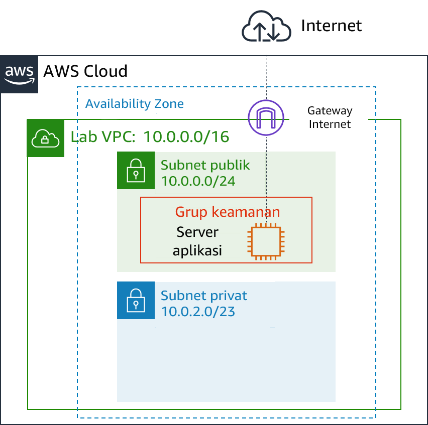
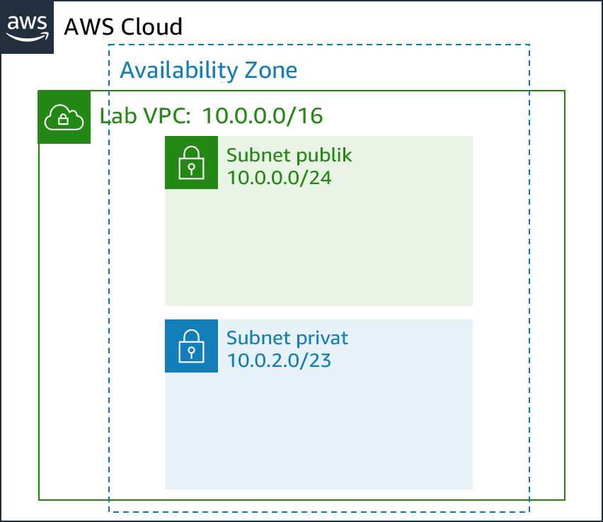

# Modul 6 - Lab Terpandu: Membuat Virtual Private Cloud

[//]: # "SKU: ILT-TF-200-ACACAD-2    Source Course: ILT-TF-100-ARCHIT-6 branch dev_65"

## Gambaran umum dan tujuan lab

Jaringan tradisional itu sulit. Jaringan tradisional melibatkan peralatan, kabel, konfigurasi yang kompleks, dan kemampuan khusus. Amazon Virtual Private Cloud (Amazon VPC) menyembunyikan kompleksitas, dan menyederhanakan deployment jaringan pribadi yang aman.

Lab ini menunjukkan kepada Anda cara membangun virtual private cloud (VPC) Anda sendiri, men-deploy sumber daya, dan membuat koneksi peering pribadi antar VPC.

Setelah menyelesaikan lab ini, Anda akan mampu:

- Men-deploy VPC
- Membuat gateway internet dan memasangnya ke VPC
- Membuat subnet publik
- Membuat subnet privat
- Membuat server aplikasi untuk menguji VPC.


Pada **akhir** lab ini, arsitektur Anda akan terlihat seperti contoh berikut:




<br/>
## Durasi

Diperlukan waktu sekitar **30 menit** untuk menyelesaikan lab ini.

<br/>

## Pembatasan layanan AWS

Dalam lingkungan lab ini, akses ke layanan AWS dan tindakan layanan mungkin dibatasi untuk orang-orang yang diperlukan untuk menyelesaikan instruksi lab. Anda mungkin akan mengalami error jika mencoba mengakses layanan lain atau melakukan tindakan di luar yang dijelaskan di lab ini.

<br/>

## Mengakses Konsol Manajemen AWS

1. Di bagian atas instruksi ini, pilih <span id="ssb_voc_grey">Start Lab</span> (Mulai Lab) untuk meluncurkan lab Anda.

   Panel **Start Lab** (Mulai Lab) terbuka dan menampilkan status lab.

   <i class="fas fa-info-circle"></i> **Tip**: Jika Anda memerlukan lebih banyak waktu untuk menyelesaikan lab, mulai ulang pengatur waktu untuk lingkungan dengan memilih tombol <span id="ssb_voc_grey">Start Lab</span> (Mulai Lab) lagi.

2. Tunggu hingga panel **Start Lab** (Mulai Lab) menampilkan pesan *Lab status: ready* (Status lab: siap), lalu tutup panel dengan memilih **X**.

3. Di bagian atas instruksi ini, pilih <span id="ssb_voc_grey">AWS</span>.

   Tindakan ini akan membuka Konsol Manajemen AWS di tab browser baru. Anda akan masuk ke sistem secara otomatis.

   <i class="fas fa-exclamation-triangle"></i> **Tip**: Jika tab browser baru tidak terbuka, banner atau ikon biasanya berada di bagian atas browser Anda dengan pesan bahwa browser Anda mencegah situs membuka jendela sembulan. Pilih banner atau ikon, lalu pilih **Allow pop-ups** (Izinkan sembulan).

4. Atur tab **AWS Management Console**(Konsol Manajemen AWS) agar ditampilkan bersama instruksi ini. Idealnya, Anda perlu membuka kedua tab browser secara bersamaan, sehingga Anda dapat mengikuti langkah-langkah lab dengan lebih mudah.

   <i class="fas fa-exclamation-triangle"></i> **Jangan mengubah Wilayah kecuali secara khusus diperintahkan untuk melakukannya**.

<br/>

## Tugas 1: Membuat VPC

Anda akan mulai dengan menggunakan Amazon VPC untuk membuat **virtual private cloud atau VPC** baru.

VPC adalah jaringan virtual yang didedikasikan untuk akun Amazon Web Services (AWS) Anda. Jaringan ini terisolasi secara logis dari jaringan virtual lain di AWS Cloud. Anda dapat meluncurkan sumber daya AWS, seperti instans Amazon Elastic Compute Cloud (Amazon EC2), ke dalam VPC. Anda dapat mengonfigurasi VPC dengan memodifikasi jangkauan alamat IP dan membuat subnet. Anda juga dapat mengonfigurasi tabel rute, gateway jaringan, dan pengaturan keamanan.

5. Di **AWS Management Console** (Konsol Manajemen AWS), pada menu <span id="ssb_services">Services<i class="fas fa-angle-down"></i></span> (Layanan), pilih **VPC**.

   Konsol VPC menawarkan wizard yang secara otomatis dapat membuat beberapa arsitektur VPC. Akan tetapi, di lab ini, Anda akan membuat komponen VPC secara manual.

6. Di panel navigasi kiri, pilih **Your VPCs** (VPC Anda).

   VPC default tersedia, sehingga Anda dapat meluncurkan sumber daya secara langsung ketika Anda mulai menggunakan AWS. Ada pula **VPC Bersama** yang akan Anda gunakan nanti di lab ini. Namun, sekarang Anda akan membuat _Lab VPC_ Anda sendiri.

   VPC akan memiliki jangkauan Classless Inter-Domain Routing (CIDR) **10.0.0.0/16**, yang mencakup seluruh alamat IP yang dimulai dengan **10.0.x.x**. Isinya lebih dari 65.000 alamat. Nantinya Anda akan membagi alamat-alamat ini ke _subnet_ terpisah.

7. Pilih <span id="ssb_blue">Create VPC</span> (Buat VPC) lalu konfigurasikan pengaturan berikut:

   - **Name tag** (Tanda nama): `Lab VPC`
   - **IPv4 CIDR block**: `10.0.0.0/16`
   - Pilih <span id="ssb_blue">Create</span> (Buat), kemudian pilih <span id="ssb_blue">Close</span> (Tutup)

   <i class="fas fa-comment"></i> Jika opsi ini tidak muncul, batalkan konfigurasi Anda. Di panel navigasi kiri, pastikan Anda memilih **Your VPCs** (VPC Anda). Kemudian, pilih **Create VPC** (Buat VPC) lagi.

8. Pilih <i class="far fa-check-square"></i>**Lab VPC**, dan pastikan bahwa itu adalah satu-satunya VPC yang Anda pilih.

9. Di bagian bawah halaman, pilih tab **Tags** (Tag).

   Tanda berguna untuk mengidentifikasi sumber daya. Misalnya, Anda dapat menggunakan tanda untuk mengidentifikasi pusat biaya atau lingkungan yang berbeda (seperti pengembangan, pengujian, atau produksi).

10. Pilih <span id="ssb_grey">Actions<i class="fas fa-angle-down"></i></span> (Tindakan) dan pilih **Edit DNS hostnames** (Edit nama host DNS).

   Opsi ini menetapkan nama Domain Name System (DNS) yang _ramah_ ke instans EC2 dalam VPC, seperti:

   _ec2-52-42-133-255.us-west-2.compute.amazonaws.com_

11. Pilih <i class="far fa-check-square"></i>**enable** (aktifkan), pilih <span id="ssb_blue">Save</span> (Simpan), lalu pilih <span id="ssb_blue">Close</span> (Tutup)

   Semua instans EC2 yang diluncurkan ke dalam VPC sekarang secara otomatis akan menerima nama host DNS. Anda nanti juga dapat menambahkan nama DNS yang lebih bermakna (seperti _app.example.com_) menggunakan Amazon Route 53.


## Tugas 2: Membuat subnet

Subnet adalah sub-jangkauan alamat IP dalam VPC. Sumber daya AWS dapat diluncurkan menjadi subnet tertentu. Gunakan _subnet_ publik__ untuk sumber daya yang harus disambungkan ke internet, dan gunakan _subnet_ privat__ untuk sumber daya yang harus tetap terisolasi dari internet.

Dalam tugas ini, Anda akan membuat subnet publik dan subnet privat:



<br/>
### Membuat subnet publik

Subnet publik akan digunakan untuk sumber daya yang terhubung ke internet.

12. Di panel navigasi kiri, pilih **Subnets** (Subnet).

13. Pilih <span id="ssb_blue">Create subnet</span> (Buat subnet) dan konfigurasikan pengaturan berikut ini:

   - **Name tag** (Tanda nama): `Public Subnet` (Subnet Publik)
   - **VPC:** _Lab VPC_
   - **Availability Zone:** Pilih Availability Zone _pertama_ dalam daftar (_Jangan_ memilih **No Preference** (Tidak Ada Pilihan))
   - **IPv4 CIDR block** (Blok CIDR IPv4): `10.0.0.0/24`
   - Pilih <span id="ssb_blue">Create</span> (Buat), kemudian pilih <span id="ssb_blue">Close</span> (Tutup)

   <i class="fas fa-comment"></i> VPC memiliki blok CIDR *10.0.0.0/16*, yang mencakup seluruh alamat IP *10.0.x.x*. Subnet yang baru saja Anda buat memiliki blok CIDR *10.0.0.0/24*, yang mencakup seluruh alamat IP *10.0.0.x*. Semuanya mungkin terlihat sama, tapi subnet lebih kecil daripada VPC dikarenakan _/24_ dalam jangkauan CIDR.

   Kini Anda akan mengonfigurasi subnet untuk menetapkan secara otomatis alamat IP publik untuk semua instans yang diluncurkan di dalamnya.

14. Pilih <i class="far fa-check-square"></i>**Public Subnet** (Subnet Publik).

15. Pilih <span id="ssb_grey">Actions<i class="fas fa-angle-down"></i></span> (Tindakan) dan pilih **Modify auto-assign IP settings** (Modifikasi pengaturan penetapan IP secara otomatis), lalu:

   - Pilih <i class="far fa-check-square"></i>**Auto-assign IPv4** (Tetapkan IPv4 secara otomatis)
   - Pilih <span id="ssb_blue">Save</span> (Simpan)

   <i class="fas fa-comment"></i>Meskipun bernama _Public Subnet_ (Subnet Publik), subnet ini belum bersifat publik. Subnet publik harus memiliki gateway internet, yang Anda pasang di tugas berikutnya.

<br/>

### Membuat subnet privat

Subnet privat akan digunakan untuk sumber daya yang tetap terisolasi dari internet.

16. Manfaatkan pengetahuan yang baru saja Anda pelajari untuk membuat subnet lain dengan pengaturan berikut:

   - **Name tag** (Tanda nama): `Private Subnet` (Subnet Privat)
   - **VPC:** _Lab VPC_
   - **Availability Zone:** Pilih Availability Zone _pertama_ dalam daftar (_Jangan_ memilih **No Preference** (Tidak Ada Pilihan))
   - **IPv4 CIDR block** (Blok CIDR IPv4): `10.0.2.0/23`

   Blok CIDR *10.0.2.0/23* mencakup seluruh alamat IP yang dimulai dengan *10.0.2.x* dan *10.0.3.x*. Blok ini dua kali lebih besar dari subnet publik karena sebagian besar sumber daya harus tetap privat, kecuali jika subnet secara khusus harus dapat diakses dari internet.

   Kini VPC Anda memiliki dua subnet. Namun, subnet publik ini sepenuhnya terisolasi dan tidak dapat berkomunikasi dengan sumber daya di luar VPC. Selanjutnya Anda akan mengonfigurasi subnet publik untuk terhubung ke internet melalui gateway internet.

<br/>

## Tugas 3: Membuat gateway internet

Suatu *gateway* internet** adalah komponen VPC cadangan yang diskalakan secara horizontal dan memiliki ketersediaan tinggi. Gateway ini memungkinkan komunikasi antara instans dalam VPC dan internet. Gateway internet tidak menimbulkan risiko ketersediaan atau batasan bandwidth pada lalu lintas jaringan.

Gateway internet memiliki dua tujuan:

- Menyediakan target dalam tabel rute yang terhubung ke internet
- Melakukan penerjemahan alamat jaringan (NAT) untuk instans yang telah mendapatkan alamat IPv4 publik

Dalam tugas ini, Anda akan membuat gateway internet, sehingga lalu lintas internet dapat mengakses subnet publik.

17. Di panel navigasi kiri, pilih **Internet Gateways** (Gateway Internet).

18. Pilih <span id="ssb_blue">Create internet gateway</span> (Buat gateway internet) dan konfigurasikan pengaturan ini:

   - **Name tag** (Tanda nama): `Lab IGW`
   - Pilih <span id="ssb_blue">Create</span> (Buat), kemudian pilih <span id="ssb_blue">Close</span> (Tutup)

   Sekarang Anda dapat memasang gateway internet ke _Lab VPC_ Anda.

19. Pilih <i class="far fa-check-square"></i> **Lab IGW**, dan pastikan bahwa itu adalah satu-satunya gateway yang Anda pilih.

20. Pilih <span id="ssb_grey">Actions<i class="fas fa-angle-down"></i></span> (Tindakan) lalu **Attach to VPC** (Pasang ke VPC), dan konfigurasikan pengaturan berikut:

   - **VPC:** Dari daftar, pilih _Lab VPC_
   - Pilih <span id="ssb_blue">Attach</span> (Pasang)

   Tindakan ini akan memasangkan gateway internet ke _Lab VPC_ Anda. Meskipun Anda telah membuat gateway internet dan memasangkannya ke VPC Anda, Anda juga harus mengonfigurasi _route table_ (tabel rute) subnet publik agar menggunakan gateway internet tersebut.

<br/>
## Tugas 4: Mengonfigurasi tabel rute

Suatu *route table* (tabel rute) berisi satu set aturan, yang disebut *route* (rute), yang digunakan untuk menentukan ke mana lalu lintas jaringan diarahkan. Setiap subnet di VPC harus dikaitkan dengan sebuah tabel rute karena tabel tersebut mengontrol perutean untuk subnet. Subnet hanya dapat dikaitkan dengan satu tabel rute dalam satu waktu, tetapi Anda dapat mengaitkan beberapa subnet dengan tabel rute yang sama.

Untuk menggunakan gateway internet, tabel rute subnet harus mengandung rute yang mengarahkan lalu lintas internet ke gateway internet. Jika dikaitkan dengan tabel rute yang memiliki rute ke gateway internet, subnet dikenal sebagai _subnet_ publik__.

Dalam tugas ini, Anda akan:

* Membuat _tabel rute publik_ untuk lalu lintas yang terikat internet
* Menambahkan _rute_ ke tabel rute untuk mengarahkan lalu lintas terikat internet ke gateway internet
* Mengaitkan subnet publik dengan tabel rute baru

21. Di panel navigasi kiri, pilih **Route Tables** (Tabel Rute).

   Beberapa tabel rute ditampilkan, tapi hanya ada satu tabel rute yang dikaitkan dengan *Lab VPC*. Tabel rute ini mengarahkan rute lalu lintas secara lokal, sehingga disebut _tabel rute pribadi_.

22. Pada kolom **VPC ID**, pilih <i class="far fa-check-square"></i> tabel rute yang menunjukkan **Lab VPC** (Anda dapat memperluas kolom untuk melihat nama-namanya).

23. Pada kolom **Name** (Nama), pilih <i class="fas fa-pencil-alt"></i> lalu masukkan nama `Tabel Rute Pribadi` dan pilih <i class="fas fa-check-circle"></i>.

24. Di bagian bawah halaman, pilih tab **Route** (Rute).

Hanya terdapat satu rute. Rute ini menunjukkan bahwa semua lalu lintas yang ditujukan untuk _10.0.0.0/16_ (yang merupakan jangkauan _Lab VPC_) akan dirutekan _secara lokal_. Rute ini memungkinkan semua subnet di dalam VPC untuk berkomunikasi satu sama lain.

Anda kini akan membuat tabel rute publik baru untuk mengirimkan lalu lintas publik ke gateway internet.

25. Pilih <span id="ssb_blue">Create route table</span> (Buat tabel rute) dan konfigurasikan pengaturan berikut:

   - **Name tag** (Tanda nama): `Public Route Table` (Tabel Rute Publik)
   - **VPC:** _Lab VPC_
   - Pilih <span id="ssb_blue">Create</span> (Buat), kemudian pilih <span id="ssb_blue">Close</span> (Tutup)

26. Pilih <i class="far fa-check-square"></i> **Public Route Table** (Tabel Rute Publik), dan pastikan bahwa itu adalah satu-satunya tabel rute yang Anda pilih.

27. Pada tab**Route** (Rute), pilih <span id="ssb_grey">Edit route</span> (Edit rute)

   Kini Anda akan menambahkan rute untuk mengarahkan lalu lintas yang terikat internet (_0.0.0.0/0_) ke gateway internet.

28. Pilih <span id="ssb_grey">Add route</span> (Tambahkan rute) lalu konfigurasikan pengaturan berikut:

   * **Destination** (Tujuan): `0.0.0.0/0`
   * **Target:** Pilih _Internet Gateway_ kemudian, dari daftar, pilih _Lab IGW_
   * Pilih <span id="ssb_blue">Save routes</span> (Simpan rute), lalu pilih <span id="ssb_blue">Close</span> (Tutup)

   Langkah terakhir adalah untuk _mengaitkan_ rute baru ini dengan subnet publik.

29. Pilih tab **Subnet Associations** (Kaitan Subnet).

30. Pilih <span id="ssb_grey">Edit subnet associations</span> (Edit kaitan subnet)

31. Pilih <i class="far fa-check-square"></i> baris dengan **Subnet** Publik****.

32. Pilih <span id="ssb_blue">Save</span> (Simpan)

   Sekarang subnet publik telah menjadi _publik_ karena memiliki entri tabel rute yang mengirimkan lalu lintas ke internet melalui gateway internet.

   Untuk meringkas, Anda dapat membuat subnet publik dengan mengikuti langkah-langkah berikut:

   - Buat _gateway_ internet__

   - Buat _tabel rute_

   - Tambahkan _rute_ ke tabel rute yang mengarahkan lalu lintas _0.0.0.0/0_ ke gateway internet

   - Kaitkan tabel rute dengan sebuah _subnet_, yang kemudian menjadi _subnet_ publik __

<br/>

## Tugas 5: Membuat grup keamanan untuk server aplikasi

*Grup keamanan* berperan sebagai firewall virtual bagi instans untuk mengendalikan lalu lintas masuk dan keluar. Grup keamanan beroperasi pada tingkat _antarmuka jaringan elastis untuk instans_. Grup keamanan tidak beroperasi pada tingkat _subnet_. Oleh karena itu, setiap instans dapat memiliki firewall sendiri yang mengontrol lalu lintas. Jika Anda tidak menentukan grup keamanan tertentu pada waktu peluncuran, instans akan otomatis ditetapkan pada _grup keamanan default_ untuk VPC tersebut.

Dalam tugas ini, Anda akan membuat grup keamanan yang memungkinkan pengguna untuk mengakses server aplikasi Anda melalui HTTP.

33. Di panel navigasi kiri, pilih **Security Groups** (Grup Keamanan).

34. Pilih <span id="ssb_blue">Create security group</span> (Buat grup keamanan) dan konfigurasikan pengaturan berikut:

   - **Security group name** (Nama grup keamanan): `App-SG`
   - **Description** (Deskripsi): `Allow HTTP traffic` (Izinkan lalu lintas HTTP)
   - **VPC:** _Lab VPC_
   - Pilih <span id="ssb_blue">Create</span> (Buat), kemudian pilih <span id="ssb_blue">Close</span> (Tutup)

35. Pilih <i class="far fa-check-square" aria-hidden="true"></i>**App-SG**.

36. Pilih tab **Inbound Rules** (Aturan Masuk).

   Pengaturan untuk **Aturan Masuk** menentukan lalu lintas apa yang diizinkan mencapai instans. Anda akan mengonfigurasikannya untuk mengizinkan lalu lintas HTTP (port 80) yang datang dari mana saja di internet (_0.0.0.0/0_).

37. Pilih <span id="ssb_grey">Edit rules</span> (Edit aturan)

38. Pilih <span id="ssb_grey">Add Rule</span> (Tambah Aturan) dan kemudian konfigurasikan pengaturan ini:

   - **Type** (Jenis):  _HTTP_
   - **Source** (Sumber): _Anywhere_ (Mana saja)
   - **Description** (Deskripsi): `Allow web access` (Izinkan akses web)
   - Pilih <span id="ssb_blue">Save rules</span> (Simpan aturan) kemudian pilih <span id="ssb_blue">Close</span> (Tutup)

   Anda menggunakan _App-SG_ ini dalam tugas selanjutnya.

<br/>
## Tugas 6: Meluncurkan server aplikasi dalam subnet publik

Untuk menguji bahwa VPC Anda dikonfigurasi dengan benar, luncurkan instans EC2 ke subnet publik. Anda juga perlu memastikan bahwa Anda dapat mengakses instans EC2 dari internet.

39. Pada menu <span id="ssb_services">Services<i class="fas fa-angle-down"></i></span> (Layanan), pilih **EC2**.

40. Pilih <span id="ssb_orange">Launch Instance</span> (Luncurkan Instans) dan pilih **Launch Instance** (Luncurkan Instans) dari daftar tarik-turun. Konfigurasikan opsi ini:

   - Langkah 1 (Pilih AMI):

      - **AMI:** _Amazon Linux 2_

   - Langkah 2 (Pilih Tipe Instans):

      - **Instance Type** (Tipe Instans): _t2.micro_

   - Langkah 3 (Konfigurasikan Detail Instans):
      - **Network** (Jaringan): _Lab VPC_
      - **Subnet:** _Public Subnet_ (Subnet Publik)
      - **IAM role:** _Inventory-App-Role_
      - **User Data** (Under <i class="fas fa-caret-right"></i> **Advanced Details** (Data Pengguna (Dalam Detail Lanjutan)):

      ```bash
      #!/bin/bash
      # Install Apache Web Server and PHP
      yum install -y httpd mysql
      amazon-linux-extras install -y php7.2
      # Download Lab files
      wget https://aws-tc-largeobjects.s3-us-west-2.amazonaws.com/ILT-TF-200-ACACAD-20-EN/mod6-guided/scripts/inventory-app.zip
      unzip inventory-app.zip -d /var/www/html/
      # Download and install the AWS SDK for PHP
      wget https://github.com/aws/aws-sdk-php/releases/download/3.62.3/aws.zip
      unzip aws -d /var/www/html
      # Turn on web server
      chkconfig httpd on
      service httpd start
      ```

    - Langkah 4 (Tambahkan Penyimpanan):
    
      - Gunakan pengaturan default (tidak ada perubahan)
    
    - Langkah 5 (Tambahkan Tag)
      - Pilih <span id="ssb_grey">Add Tag</span> (Tambahkan Tanda)
      - **Key (Kunci):** `Name`
      - **Value (Nilai):** `App Server`
    
    - Langkah 6 (Mengonfigurasi Grup Keamanan):
    
      - **Select an existing security group (Pilih grup keamanan yang tersedia):** _App-SG_
    
      <i class="fas fa-comment"></i> Anda akan menerima peringatan ini: _You will not be able to connect to the instance_ (Anda tidak akan dapat terhubung ke instans). Peringatan ini dapat diterima karena Anda tidak akan menghubungkan ke instans. Semua konfigurasi dilakukan melalui skrip data pengguna. 
      
      - Klik **Continue (Lanjutkan)**.
      
    - Langkah 7 (Tinjauan):
    
      - <span id="ssb_blue">Luncurkan</span>

41. Pada window **Select an existing key pair or create a new key pair** (Pilih pasangan kunci yang tersedia atau buat pasangan kunci baru):

* Pilih **Proceed without a key pair** (Lanjutkan tanpa pasangan kunci).
* Pilih <i class="far fa-check-square"></i> **I acknowledge that...** (Saya menyatakan bahwa...).
* Pilih <span id="ssb_blue">Launch Instances</span> (Luncurkan Instans)

Halaman status memberi tahu Anda bahwa instans sedang diluncurkan.

42. Pilih <span id="ssb_blue">View Instances</span> (Lihat Instans)

43. Tunggu server aplikasi untuk diluncurkan sepenuhnya Hasilnya seharusnya menampilkan status berikut:

- **Instance State** (Status Instans): <span style="color:green"><i class="fas fa-circle"></i></span> running (berjalan)

<i class="fas fa-comment"></i> Anda dapat memilih untuk menyegarkan <i class="fas fa-sync" aria-hidden="true"></i> sesekali untuk memperbarui tampilan.

44. Pilih <i class="far fa-check-square"></i> **App Server** (Server Aplikasi).

45. Salin alamat **IP Publik IPv4** dari tab **Description** (Deskripsi).

46. Buka tab browser web baru dengan alamat IP tersebut.

Jika Anda mengonfigurasi VPC dengan benar, aplikasi Inventory dan pesan ini akan muncul: _Please configure settings to connect to database_ (Konfigurasikan pengaturan untuk menghubungkan ke basis data). Anda belum mengonfigurasi pengaturan basis data apa pun, tetapi penampilan aplikasi Inventory menunjukkan bahwa subnet publik dikonfigurasi dengan benar.

<span style="color:red"><i class="fas fa-exclamation-triangle"></i></span> Jika aplikasi Inventory tidak muncul, tunggu 60 detik dan segarkan <i class="fas fa-sync"></i> halaman untuk mencoba kembali. Instans EC2 dapat memerlukan waktu beberapa menit untuk melakukan boot dan menjalankan skrip yang menginstal perangkat lunak.


<br/>
## Mengirimkan pekerjaan Anda

47. Di bagian atas instruksi ini, pilih <span id="ssb_blue">Submit</span> (Kirim) untuk merekam kemajuan Anda dan saat diminta, pilih **Yes** (Ya).

48. Jika hasilnya tidak muncul setelah beberapa menit, kembali ke bagian atas instruksi ini dan pilih <span id="ssb_voc_grey">Grades</span> (Nilai)

   **Tip**: Anda dapat mengirimkan pekerjaan Anda beberapa kali. Setelah Anda mengubah pekerjaan, pilih **Submit** (Kirim) lagi. Apa yang akan direkam untuk lab ini adalah pengiriman terakhir Anda.

49. Untuk menemukan detail umpan balik tentang pekerjaan Anda, pilih <span id="ssb_voc_grey">Details</span> (Detail) diikuti oleh <i class="fas fa-caret-right"></i> **View Submission Report** (Lihat Laporan Pengiriman).

<br/>

## Lab selesai <i class="fas fa-graduation-cap"></i>

<i class="fas fa-flag-checkered"></i> Selamat! Anda telah menyelesaikan lab.

50. Pilih <span id="ssb_voc_grey">End Lab</span> (Akhiri Lab) di bagian atas halaman ini, lalu pilih <span id="ssb_blue">Yes</span> (Ya) untuk mengonfirmasi bahwa Anda ingin mengakhiri lab.

   Sebuah panel menunjukkan bahwa *DELETE has been initiated... * (Penghapusan sudah dimulai...) *You may close this message box now.* (Anda dapat menutup kotak pesan ini sekarang.)

51. Pilih **X** di sudut kanan atas untuk menutup panel.


*©2020 Amazon Web Services, Inc. dan afiliasinya. Hak cipta dilindungi undang-undang. Karya ini tidak boleh direproduksi atau didistribusikan ulang, seluruhnya atau sebagian, tanpa izin tertulis sebelumnya dari Amazon Web Services, Inc. Dilarang menyalin, meminjamkan, atau menjual secara komersial.*