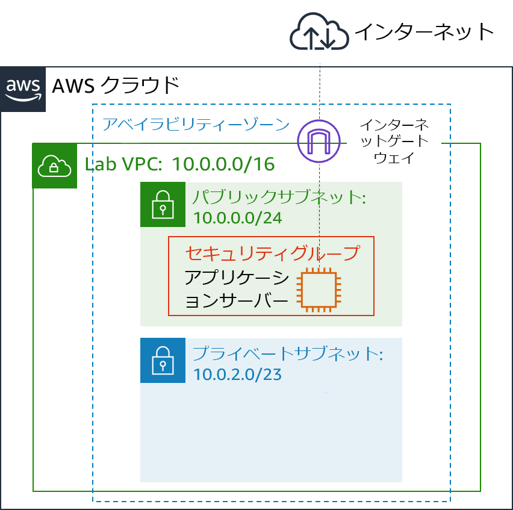
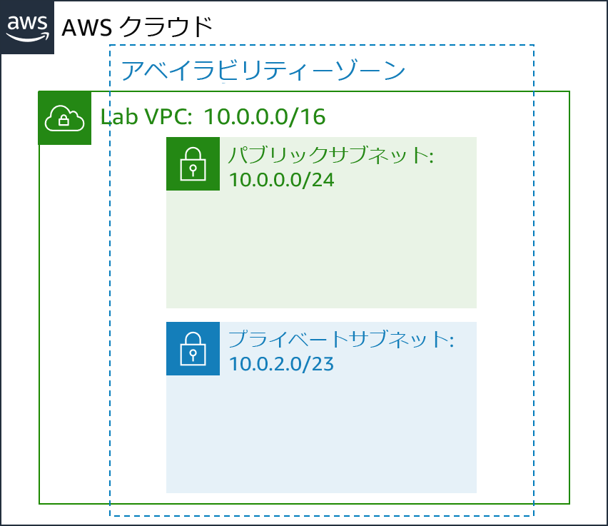

# モジュール 6 - ガイド付きラボ: 仮想プライベートクラウドを作成する

[//]: # "SKU: ILT-TF-200-ACACAD-2    Source Course: ILT-TF-100-ARCHIT-6 branch dev_65"

## ラボの概要と目標

従来のネットワーキングは、機器、配線、複雑な構成を伴い、専門的なスキルが求められる困難な作業です。Amazon Virtual Private Cloud (Amazon VPC) は、複雑さを隠し、安全なプライベートネットワークのデプロイを簡素化します。

このラボでは、独自の仮想プライベートクラウド（VPC）を構築し、リソースをデプロイし、VPC 間でプライベートピアリング接続を作成する方法を説明します。

このラボを完了すると、次のことができるようになります。

- VPC をデプロイする
- インターネットゲートウェイを作成して VPC にアタッチする
- パブリックサブネットを作成する
- プライベートサブネットを作成する
- VPC をテストするアプリケーションサーバーを作成する


ラボの**終了時**のアーキテクチャは次の例のようになります。




<br/>

## 所要時間

このラボの所要時間は約 **30 分**です。

<br/>

## AWS サービスの制限事項

このラボ環境では、AWS のサービスとサービスアクションへのアクセスが、ラボの手順を完了するために必要なものに制限される場合があります。他のサービスへのアクセスや、このラボで説明されているサービス以外のアクションを実行しようとすると、エラーが発生することがあります。

<br/>

## AWS マネジメントコンソールにアクセスする

1. この手順の上部にある <span id="ssb_voc_grey">Start Lab</span> をクリックし、ラボを起動します。

   [**Start Lab**] パネルが開き、ラボのステータスが表示されます。

   <i class="fas fa-info-circle"></i> **ヒント**: ラボの完了までにさらに時間が必要な場合は、<span id="ssb_voc_grey">Start Lab</span> ボタンをもう一度選択して、この環境のタイマーを再開します。

2. \[**Start Lab**] パネルに **Lab status: ready** というメッセージが表示されたら [**X**] をクリックしてパネルを閉じます。

3. この手順の上部にある <span id="ssb_voc_grey">AWS</span> をクリックします。

   このアクションにより、新しいブラウザタブで AWS マネジメントコンソールが開き、ユーザーは自動的にログインします。

   <i class="fas fa-exclamation-triangle"></i> **ヒント**: 新しいブラウザタブが開かない場合、通常、ブラウザによってサイトのポップアップウィンドウの表示がブロックされたというメッセージが表示されたバナーまたはアイコンがブラウザの上部に表示されます。バナーまたはアイコンを選択して [**ポップアップを許可**] を選択してください。

4. **AWS マネジメントコンソール**タブがこの手順と並べて表示されるようにします。両方のブラウザタブを同時に開いておくと、ラボのステップを実行しやすくなります。

   <i class="fas fa-exclamation-triangle"></i> **特に指示がない限り、リージョンを変更しないでください**。

<br/>

## タスク 1: VPC を作成する

まず、Amazon VPC を使用して新しい **仮想プライベートクラウド（VPC）** を作成します。

VPC は、アマゾン ウェブ サービス（AWS）アカウント専用の仮想ネットワークです。AWS クラウドの他の仮想ネットワークから論理的に分離されています。Amazon Elastic Compute Cloud (Amazon EC2) インスタンスなどの AWS リソースを VPC に起動できます。VPC の IP アドレス範囲を変更して VPC を設定し、サブネットを作成できます。また、ルートテーブル、ネットワークゲートウェイ、セキュリティ設定を構成することもできます。

5. **AWS マネジメントコンソール**の<span id="ssb_services">サービス<i class="fas fa-angle-down"></i></span> で [**VPC**] をクリックします。

   VPC コンソールには、複数の VPC アーキテクチャを自動的に作成できるウィザードが用意されています。ただし、このラボでは、VPC コンポーネントを手動で作成します。

6. 左側のナビゲーションペインで [**VPC**] をクリックします。

   AWS を利用し始めてすぐにリソースを起動できるように、デフォルトの VPC が用意されています。ラボの後半で使用する **Shared VPC** もあります。ただし、ここでは独自の **Lab VPC** を作成します。

   VPC には、**10.0.0.0/16** のクラスレスドメイン間ルーティング（CIDR）範囲があります。これには、**10.0.x.x** で始まるすべての IP アドレスが含まれ、65,000 以上のアドレスがあります。後でアドレスを別々の**サブネット**に分割します。

7. <span id="ssb_blue">VPC を作成</span> をクリックして以下のように設定します。

   - **名前タグ:** `Lab VPC`
   - **IPv4 CIDR ブロック:** `10.0.0.0/16`
   - <span id="ssb_blue">VPC を作成</span> をクリックします。

   <i class="fas fa-comment"></i> これらのオプションが表示されない場合は、設定をキャンセルしてください。左側のナビゲーションペインで、[**VPC**] が選択されていることを確認します。次に、[**VPC を作成**] をもう一度クリックします。

8. <i class="far fa-check-square"></i> [**Lab VPC**] を選択し、これが選択した唯一の VPC であることを確認します。

9. ページ下部の [**タグ**] タブをクリックします。

   タグはリソースを識別するのに便利です。例えば、タグを使用してコストセンターやさまざまな環境（開発、テスト、本番稼働など）を識別できます。

10. <span id="ssb_grey">アクション<i class="fas fa-angle-down"></i></span> ドロップダウンメニューから [**DNS ホスト名を編集**] を選択します。

    このオプションは、次のような**わかりやすい**ドメインネームシステム（DNS）名を VPC 内の EC2 インスタンスに割り当てます。

    **ec2-52-42-133-255.us-west-2.compute.amazonaws.com**

11. <i class="far fa-check-square"></i> **有効化** チェックボックスをオンにし <span id="ssb_blue">変更を保存</span>をクリックします。

    VPC に起動されたすべての EC2 インスタンスが自動的に DNS ホスト名を受け取ります。また、後で Amazon Route 53 を使用して、よりわかりやすい DNS名（**app.example.com** など）を追加することもできます。


## タスク 2: サブネットを作成する

サブネットは、VPC 内の IP アドレスの部分範囲です。AWS リソースは、指定したサブネットに起動できます。インターネットに接続する必要があるリソースには**パブリックサブネット**を使用し、インターネットから分離しておく必要があるリソースには**プライベートサブネット**を使用します。

このタスクでは、以下のようなパブリックサブネットとプライベートサブネットを作成します。



<br/>

### パブリックサブネットを作成する

パブリックサブネットは、インターネットに接続するリソースに使用されます。

12. 左側のナビゲーションペインで [**サブネット**] をクリックします。

13. <span id="ssb_blue">サブネットを作成</span> をクリックして次の設定を構成します。

    - **VPC ID:** **Lab VPC**
    - **サブネット名:** `Public Subnet`
    - **アベイラビリティーゾーン:** リストの**最初の**アベイラビリティーゾーンをクリックします（**指定なし** は選択**しないでください**）
    - **IPv4 CIDR ブロック:** `10.0.0.0/24`
    - <span id="ssb_blue">サブネットを作成</span> をクリックします。

    <i class="fas fa-comment"></i> VPC には **10.0.0.0/16** の CIDR ブロックがあり、これにはすべての **10.0.x.x** IP アドレスが含まれています。先ほど作成したサブネットには **10.0.0.0/24** の CIDR ブロックがあり、これにはすべての **10.0.0.x** IP アドレスが含まれます。これらは似ているかもしれませんが、CIDR 範囲の **/24** のため、サブネットは VPC よりも小さくなります。

    次に、サブネット内で起動されたすべてのインスタンスにパブリック IP アドレスを自動的に割り当てるようにサブネットを設定します。

14. <i class="far fa-check-square"></i> **Public Subnet** を選択します。

15. <span id="ssb_grey">アクション<i class="fas fa-angle-down"></i></span> ドロップダウンメニューから [**自動割り当て IP 設定の変更**] を選択します。

    - <i class="far fa-check-square"></i> **パブリック IPv4 アドレスの自動割り当てを有効にする** チェックボックスをオンにします。
    - <span id="ssb_blue">保存</span> をクリックします。

    <i class="fas fa-comment"></i>このサブネットは **Public Subnet**という名前ですが、まだパブリックではありません。パブリックサブネットにはインターネットゲートウェイが必要です。これは次のタスクでアタッチします。

<br/>

### プライベートサブネットを作成する

プライベートサブネットは、インターネットから分離しておく必要があるリソースに使用されます。

16. 先ほど学習した内容に従って、以下の設定でサブネットをもう 1 つ作成します。

    - **VPC ID:** **Lab VPC**
    - **サブネット名:** `Private Subnet`
    - **アベイラビリティーゾーン:** リストの**最初の**アベイラビリティーゾーンをクリックします（**指定なし** は選択**しないでください**)。
    - **IPv4 CIDR ブロック:** `10.0.2.0/23`

    **10.0.2.0/23** の CIDR ブロックには、**10.0.2.x** および **10.0.3.x** で始まるすべての IP アドレスが含まれます。これはパブリックサブネットの 2 倍の規模となります。ほとんどのリソースは、インターネットからアクセスする特別な必要がない限り、プライベートにしておく必要があるためです。

    現在、VPC には 2 つのサブネットがあります。ただし、パブリックサブネットは完全に分離されており、VPC 外のリソースと通信できません。次に、インターネットゲートウェイ経由でインターネットに接続するようにパブリックサブネットを設定します。

<br/>

## タスク 3: インターネットゲートウェイを作成する

**インターネットゲートウェイ**は、水平スケーリングが可能で、冗長性と高可用性を備えた VPC コンポーネントです。これにより、VPC 内のインスタンスとインターネット間の通信が可能になります。ネットワークトラフィックに可用性のリスクや帯域幅の制約が課されることはありません。

インターネットゲートウェイには以下の 2 つの目的があります。

- インターネットに接続するターゲットをルートテーブルに追加する
- パブリック IPv4 アドレスが割り当てられているインスタンスに対してネットワークアドレス変換（NAT）を実行する

このタスクでは、インターネットゲートウェイを作成して、インターネットトラフィックがパブリックサブネットにアクセスできるようにします。

17. 左側のナビゲーションペインで [**インターネットゲートウェイ**] をクリックします。

18. <span id="ssb_blue">インターネットゲートウェイの作成</span> をクリックして以下のように設定します。

    - **名前タグ:** `Lab IGW`
    - <span id="ssb_blue">インターネットゲートウェイの作成</span> をクリックします。

    これで、インターネットゲートウェイを **Lab VPC** にアタッチできるようになりました。

19. <i class="far fa-check-square"></i> **Lab IGW** を選択し、これが選択した唯一のゲートウェイであることを確認します。

20. <span id="ssb_grey">アクション<i class="fas fa-angle-down"></i></span> ドロップダウンメニューから [**VPC にアタッチ**] を選択し、以下のように設定します。

    - **使用可能な VPC:** ドロップダウンの一覧から **Lab VPC** をクリックします。
    - <span id="ssb_blue">インターネットゲートウェイのアタッチ</span> をクリックします。

    このアクションは、インターネットゲートウェイを **Lab VPC** にアタッチします。インターネットゲートウェイを作成して VPC にアタッチしましたが、パブリックサブネットのルートテーブルがインターネットゲートウェイを使用するようにパブリックサブネットの**ルートテーブル**を設定する必要もあります。

<br/>

## タスク 4: ルートテーブルを設定する

**ルートテーブル**には**ルート**と呼ばれる一連のルールがあります。このルールによってネットワークトラフィックの進む方向が決まります。ルートテーブルによってサブネットのルーティングが制御されるため、VPC 内の各サブネットとルートテーブルを関連付ける必要があります。サブネットは一度に 1 つのルートテーブルにのみ関連付けることができますが、複数のサブネットを同じルートテーブルに関連付けることができます。

インターネットゲートウェイを使用するには、インターネット向けのトラフィックをインターネットゲートウェイに誘導するルートが含まれている必要があります。サブネットがインターネットゲートウェイへのルートを持つルートテーブルに関連付けられている場合、そのサブネットは**パブリックサブネット**と呼ばれます。

このタスクでは以下の作業を行います。

* インターネット向けのトラフィックの**パブリックルートテーブル**を作成する
* ルートテーブルに**ルート**を追加し、インターネット向けのトラフィックをインターネットゲートウェイに送信する
* パブリックサブネットを新しいルートテーブルに関連付ける

21. 左側のナビゲーションペインで [**ルートテーブル**] をクリックします。

    複数のルートテーブルが表示されますが、**Lab VPC** に関連付けられているルートテーブルは 1 つのみです。このルートテーブルはトラフィックをローカルにルーティングするため、**プライベートルートテーブル**と呼ばれます。

22. \[**VPC ID**] 列に **Lab VPC** と表示されているルートテーブル <i class="far fa-check-square"></i> 選択します（列を展開して名前を表示できます）。

23. \[**Name**] 列で <i class="fas fa-pencil-alt"></i> アイコンをクリックし、`Private Route Table`と入力して <i class="fas fa-check-circle"></i> をクリックします。

24. ページ下部の [**ルート**] タブをクリックします。

ルートは 1 つしかありません。これは、**10.0.0.0/16**（**Lab VPC** の範囲）宛てのすべてのトラフィックが**ローカルに**ルーティングされることを示しています。このルートにより、VPC 内のすべてのサブネットが相互に通信できるようになります。

次に、パブリックトラフィックをインターネットゲートウェイに送信する新しいパブリックルートテーブルを作成します。

25. <span id="ssb_blue">ルートテーブルの作成</span> をクリックし、以下のように設定します。

    - **名前タグ:** `Public Route Table`
    - **VPC:** **Lab VPC**
    - <span id="ssb_blue">作成</span>、<span id="ssb_blue">閉じる</span> の順にクリックします。

26. <i class="far fa-check-square"></i> **Public Rout Table** を選択し、そのルートテーブルのみが選択されていることを確認します。

27. \[**ルート**] タブで <span id="ssb_grey">ルートの編集</span> をクリックします。

    インターネット向けのトラフィック（**0.0.0.0/0**）をインターネットゲートウェイに送信するルートを追加します。

28. <span id="ssb_grey">ルートの追加</span> をクリックし、以下のように設定します。

    * **送信先:** `0.0.0.0/0`
    * **ターゲット:** [**Internet Gateway**] を選択し、次にリストから [**Lab IGW**] を選択します。
    * <span id="ssb_blue">ルートの保存</span>、<span id="ssb_blue">閉じる</span> の順にクリックします。

    最後のステップでは、この新しいルートテーブルをパブリックサブネットと**関連付け**ます。

29. \[**サブネットの関連付け**] タブをクリックします。

30. <span id="ssb_grey">サブネットの関連付けの編集</span> をクリックします。

31. <i class="far fa-check-square"></i> **Public Subnet** の行を選択します。

32. <span id="ssb_blue">保存</span> をクリックします。

    これで、インターネットゲートウェイ経由でインターネットにトラフィックを送信するルートテーブルのエントリを設定できました。パブリックサブネットは**パブリック**になりました。

    要約すると、以下の手順に従ってパブリックサブネットを作成できます。

    - **インターネットゲートウェイ**を作成する

    - **ルートテーブル**を作成する

    - ルートテーブルに**ルート**を追加し、**0.0.0.0/0** のトラフィックをインターネットゲートウェイに送信する

    - **サブネット**にルートテーブルを関連付けて、**パブリックサブネット**にする

<br/>

## タスク 5: アプリケーションサーバーのセキュリティグループを作成する

**セキュリティグループ**は、インスタンスの仮想ファイアウォールとして機能し、インバウンドトラフィックとアウトバウンドトラフィックを制御します。セキュリティグループは、**インスタンスの Elastic Network Interface** のレベルで動作し、**サブネット**レベルでは動作しません。したがって、各インスタンスは、トラフィックを制御する独自のファイアウォールを持つことができます。起動時に特定のセキュリティグループを指定しない場合、インスタンスは VPC の**デフォルトセキュリティグループ**に自動的に割り当てられます 。

このタスクでは、HTTP 経由でユーザーがアプリケーションサーバーにアクセスすることを許可するセキュリティグループを作成します。

33. 左側のナビゲーションペインで [**セキュリティグループ**] をクリックします。

34. <span id="ssb_blue">セキュリティグループを作成</span> をクリックし、以下のように設定します。

    - **セキュリティグループ名:** `App-SG`
    - **説明:** `Allow HTTP traffic`
    - **VPC:** **Lab VPC**
    - <span id="ssb_blue">セキュリティグループを作成</span> をクリックします。

35. <i class="far fa-check-square" aria-hidden="true"></i>**App-SG** を選択します。

36. \[**インバウンドルール**] タブをクリックします。

    [**インバウンドのルール**] の設定により、インスタンスへの到達が許可されるトラフィックが決まります。インターネット上の任意の場所（**0.0.0.0/0**）からの HTTP（ポート 80）トラフィックを許可するように設定します。

37. <span id="ssb_grey">インバウンドルールを編集</span> をクリックします。

38. <span id="ssb_grey">ルールを追加</span> をクリックし、以下のように設定します。

    - **タイプ**: **HTTP**
    - **リソースタイプ**: **任意の場所**
    - **説明:** `Allow web access`
    - <span id="ssb_blue">ルールを保存</span> をクリックします。

    次のタスクでは、この **App-SG** を使用します。

<br/>

## タスク 6: パブリックサブネットでアプリケーションサーバーを起動する

VPC が正しく設定されていることをテストするため、パブリックサブネットに EC2 インスタンスを起動します。また、インターネットから EC2 インスタンスにアクセスできることも確認します。

39. <span id="ssb_services">サービス<i class="fas fa-angle-down"></i></span> で [**EC2**] をクリックします。

40. <span id="ssb_orange">インスタンスを起動</span> をクリックし、ドロップダウンの一覧から [**インスタンスを起動**] をクリックします。以下のオプションを設定します。

    - ステップ 1（AMI を選択する）

       - **AMI:** **Amazon Linux 2**

    - ステップ 2（インスタンスタイプを選択する）

       - **インスタンスタイプ:** **t2.micro**

    - ステップ 3（インスタンスの詳細を設定する）
       - **ネットワーク:** **Lab VPC**
       - **サブネット:** **Public Subnet**
       - **IAM ロール:** **-App-Role**
       - **ユーザーデータ**（<i class="fas fa-caret-right"></i> **高度な詳細** を展開）:

       ```bash
            #!/bin/bash
            # Install Apache Web Server and PHP
            yum install -y httpd mysql
            amazon-linux-extras install -y php7.2
            # Download Lab files
            wget https://aws-tc-largeobjects.s3-us-west-2.amazonaws.com/ILT-TF-200-ACACAD-20-EN/mod6-guided/scripts/inventory-app.zip
            unzip inventory-app.zip -d /var/www/html/
            # Download and install the AWS SDK for PHP
            wget https://github.com/aws/aws-sdk-php/releases/download/3.62.3/aws.zip
            unzip aws -d /var/www/html
            # Turn on web server
            chkconfig httpd on
            service httpd start
            ```

    - ステップ 4（ストレージを追加する）

       - デフォルト設定の使用（変更なし）

    - ステップ 5（タグを追加する）
       - <span id="ssb_grey">タグの追加</span> をクリックします。
       - **キー:** `Name`
       - **値:** `App Server`

    - ステップ 6（セキュリティグループを設定する）

       - **既存のセキュリティグループを選択する:** **App-SG

       <i class="fas fa-comment"></i> **インスタンスに接続できない**ことを示す警告が表示されますが、インスタンスには接続しないため、この警告は無視しても問題ありません。設定はすべてユーザデータスクリプトを介して行われます。

       - [**次へ**] をクリックします。

    - ステップ 7（確認する）

       - <span id="ssb_blue">起動</span>

41. \[**既存のキーペアを選択するか、新しいキーペアを作成します**] ウィンドウで以下の操作を行います。

    * [**キーペアなしで続行**] を選択します。
    * <i class="far fa-check-square"></i> **この AMI に組み込まれたパスワードがわからないと、このインスタンスに接続できないことを認識しています** チェックボックスをオンにします。
    * <span id="ssb_blue">インスタンスの作成</span> をクリックします。

    インスタンスが作成中であることがステータスページに示されます。

42. <span id="ssb_blue">インスタンスの表示</span> をクリックします。

43. アプリケーションサーバーが完全に起動するまで待ちます。次のステータスが表示されます。

    - **インスタンスの状態:** <span style="color:green"><i class="fas fa-circle"></i></span>実行中

    <i class="fas fa-comment"></i> <i class="fas fa-sync" aria-hidden="true"></i> **更新** をクリックして表示を更新できます。

44. <i class="far fa-check-square"></i> **App Server** を選択します。

45. \[**詳細**] タブで [**パブリック IPv4 アドレス**] のアドレスをコピーします。

46. コピーした IP アドレスで新しいウェブブラウザタブを開きます。

VPC を正しく設定した場合は、Inventory アプリケーションと **Please configure settings to connect to database** というメッセージが表示されます。データベース設定はまだ構成していませんが、インベントリアプリケーションの外観は、パブリックサブネットが正しく構成されていることを示しています。

<span style="color:red"><i class="fas fa-exclamation-triangle"></i></span> Inventory アプリケーションが表示されない場合は、60 秒待ってから <i class="fas fa-sync"></i> をクリックしてページを更新し、もう一度試してください。EC2 インスタンスでは、ソフトウェアをインストールするスクリプトが起動および実行されるまで数分かかることがあります。


<br/>

## 作業内容を送信する

47. この手順の上部にある <span id="ssb_blue">Submit</span> をクリックして進捗情報を記録し、プロンプトが表示されたら [**Yes**] をクリックします。

48. 数分経っても結果が表示されない場合は、この手順の上部に戻り、<span id="ssb_voc_grey">Grades</span> をクリックします。

    **ヒント**: 作業内容は何度も送信できます。作業内容を変更したら、再度 [**Submit**] をクリックします。最終送信分がこのラボの作業内容として記録されます。

49. 作業に関する詳細なフィードバックを参照するには、<span id="ssb_voc_grey">Details</span> ドロップダウンメニューから <i class="fas fa-caret-right"></i> **View Submission Report** を選択します。

<br/>

## ラボの終了<i class="fas fa-graduation-cap"></i>

<i class="fas fa-flag-checkered"></i>お疲れ様でした。以上でラボは終了です。

50. ラボを終了するには、このページの上部にある <span id="ssb_voc_grey">End Lab</span> をクリックし、<span id="ssb_blue">Yes</span> をクリックします。

    パネルに **DELETE has been initiated... You may close this message box now** というメッセージが表示されます。

51. 右上隅の [**X**] をクリックしてパネルを閉じます。


**©2020 Amazon Web Services, Inc. and its affiliates. All rights reserved. このトレーニング内容の全体または一部を複製または再配布することは、Amazon Web Services, Inc. の書面による事前の許可がある場合を除き、禁じられています。商業目的のコピー、貸与、または販売を禁止します。**
