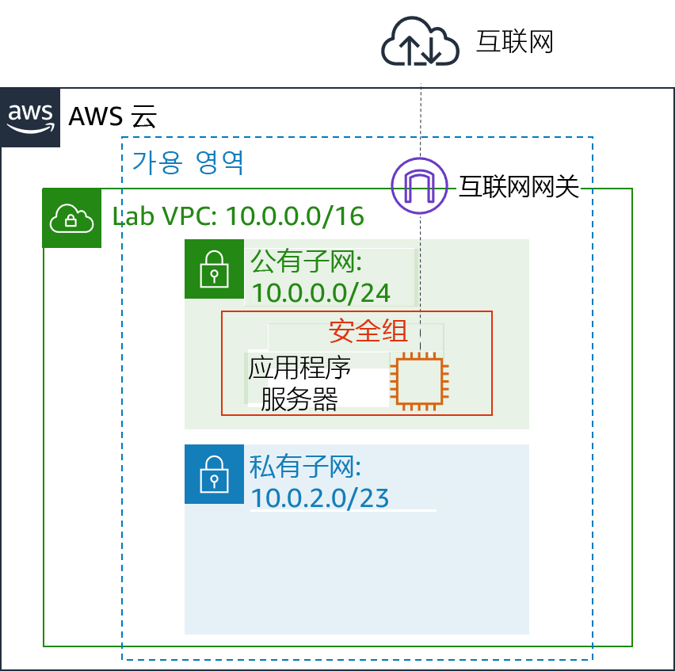
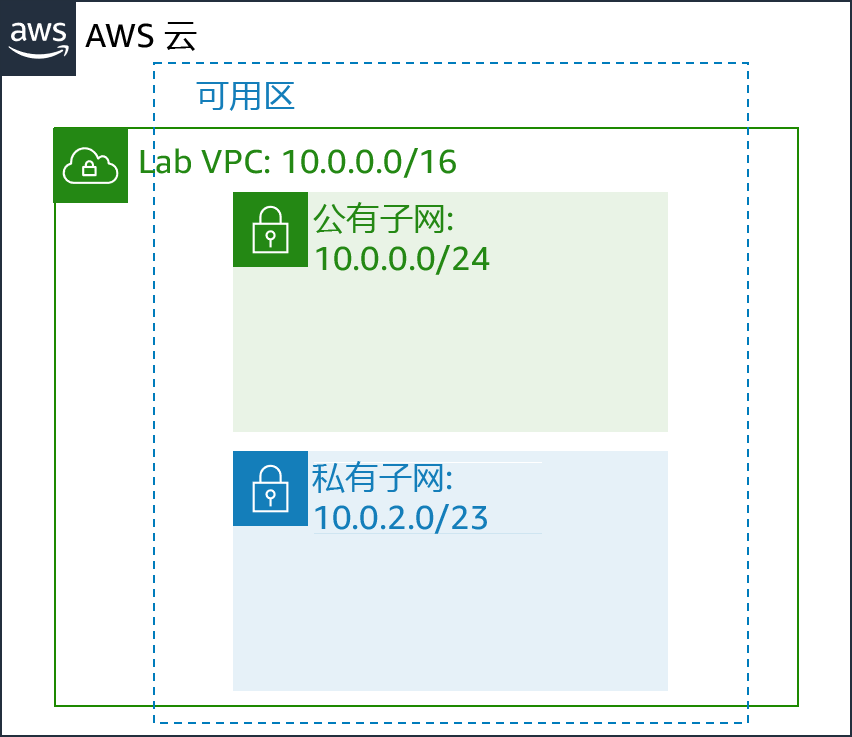

# 模块 6 – 指导实验：创建 Virtual Private Cloud

[//]: # "SKU: ILT-TF-200-ACACAD-2    Source Course: ILT-TF-100-ARCHIT-6 branch dev_65"

## 实验概览和目标

传统联网程序不容易，它涉及设备、布线、复杂的配置和专业技能。幸运的是，Amazon Virtual Private Cloud (Amazon VPC) 抛开了联网的复杂性，简化了安全私有网络的部署。

本实验将向您介绍如何构建自己的 Virtual Private Cloud (VPC)，如何部署资源，以及如何在 VPC 之间创建私有对等连接。

完成本实验后，您应能够：

- 部署 VPC
- 创建互联网网关并将其附加到 VPC
- 创建一个公有子网
- 创建私有子网
- 创建一个测试 VPC 的应用程序服务器


在本实验**结束**时，您的架构将如下例所示：




<br/>
## 持续时间

完成本实验大约需要 **30 分钟**。

<br/>

## AWS 服务限制

在本实验环境中，对 AWS 服务和服务操作的访问可能仅限于完成实验说明所需的服务和服务操作。如果您尝试访问其他服务或执行本实验中所述之外的操作，可能会遇到错误。

<br/>

## 访问 AWS 管理控制台

1. 在这些说明的顶部，选择 <span id="ssb_voc_grey">Start Lab</span>（启动实验）即可启动您的实验。

   **Start Lab**（启动实验）面板随即会打开，其中显示了实验状态。

   <i class="fas fa-info-circle"></i> **提示**：如果您需要更多时间来完成实验，请再次选择 <span id="ssb_voc_grey">Start Lab</span>（启动实验）按钮，重新启动环境计时器。

2. 请耐心等待，直到 **Start Lab**（启动实验）面板显示消息 *Lab status: ready*（实验状态：就绪），然后选择 **X** 关闭此面板。

3. 在这些说明的顶部，选择 <span id="ssb_voc_grey">AWS</span>。

   此操作将在一个新的浏览器选项卡中打开 AWS 管理控制台。您将自动登录系统。

   <i class="fas fa-exclamation-triangle"></i> **提示**：如果未打开新的浏览器选项卡，您的浏览器顶部通常会出现一个横幅或图标，并显示一条消息，指明您的浏览器阻止该了网站打开弹出窗口。请选择横幅或图标，然后选择 **Allow pop-ups**（允许弹出窗口）。

4. 排列 **AWS 管理控制台**选项卡，使其与这些说明一起显示。理想情况下，您将同时打开两个浏览器选项卡，以便能够更轻松地执行实验步骤。

   <i class="fas fa-exclamation-triangle"></i> **除非特别要求，否则请勿更改区域**。

<br/>

## 任务 1：创建 VPC

首先，您将使用 Amazon VPC 创建新的 **Virtual Private Cloud 或 VPC**。

VPC 是专用于您的 Amazon Web Services (AWS) 账户的虚拟网络。它在逻辑上与 AWS 云中的其他虚拟网络隔离。您可以在 VPC 中启动 AWS 资源，例如 Amazon Elastic Compute Cloud(Amazon EC2) 实例。您可以通过修改 VPC 的 IP 地址范围来配置 VPC，然后创建子网。您还可以配置路由表、网络网关和安全设置。

5. 在 **AWS 管理控制台**的 <span id="ssb_services">Services <i class="fas fa-angle-down"></i></span>（服务）菜单中，选择 **VPC**。

   VPC 控制台提供一个向导，可以自动创建多个 VPC 架构。但在本实验中，您将手动创建 VPC 组件。

6. 从左侧导航窗格中，选择 **Your VPCs**（您的 VPC）。

   本实验已提供默认 VPC，只要您开始使用 AWS，即可启动资源。还有一个**共享的 VPC**，稍后您将在实验中使用。但现在，您将创建自己的 _Lab VPC_。

   VPC 的无类域间路由 (CIDR) 范围为 **10.0.0.0/16**，包括以 **10.0.x.x** 开头的所有 IP 地址，地址数量超过 65,000 个。然后，您要将地址划分到不同的_子网_中。

7. 选择 <span id="ssb_blue">Create VPC</span>（创建 VPC）并配置以下设置：

   - **Name tag**（名称标签）：`Lab VPC`
   - **IPv4 CIDR block**（IPv4 CIDR 块）：`10.0.0.0/16`
   - 选择 <span id="ssb_blue">Create</span>（创建 VPC），然后选择 <span id="ssb_blue">Close</span>（关闭）

   <i class="fas fa-comment"> </i>如果这些选项未显示，请取消配置。在左侧导航窗格中，确保您选择了 **Your VPCs**（您的 VPC）。然后，再次选择 **Create VPC**（创建 VPC）。

8. 选择 <i class="far fa-check-square"></i>**Lab VPC**，然后确保它是您选择的唯一 VPC。

9. 选择页面下半部分中的 **Tags**（标签）选项卡。

   标签对于识别资源非常有用。例如，您可以使用标签来标识成本中心或不同的环境（例如开发、测试或生产环境）。

10. 选择 <span id="ssb_grey">Actions <i class="fas fa-angle-down"></i></span>（操作），然后选择 **Edit DNS hostnames**（编辑 DNS 主机名）。

   此选项会为 VPC 中的 EC2 实例分配_友好型_域名系统 (DNS) 名称，例如：

   _ec2-52-42-133-255.us-west-2.compute.amazonaws.com_

11. 选择 <i class="far fa-check-square"></i> **enable**（启用），选择 <span id="ssb_blue">Save</span>（保存更改），然后选择 <span id="ssb_blue">Close</span>（关闭）

   启动到 VPC 中的所有 EC2 实例现在都将自动收到一个 DNS 主机名。您也可以稍后使用 Amazon Route 53 添加意思更明确的 DNS 名称（例如 _app.example.com_）。


## 任务 2：创建子网

子网是 VPC 内的 IP 地址的子范围。AWS 资源可以启动到指定的子网中。对于必须连接互联网的资源，请使用_公有子网_；对于必须与互联网隔离的资源，请使用_私有子网_。

在此任务中，您将创建一个公有子网和一个私有子网：



<br/>
### 创建公有子网

公有子网将用于面向互联网的资源。

12. 在左侧导航窗格中，选择 **Subnets**（子网）。

13. 选择 <span id="ssb_blue">Create subnet</span>（创建子网）并配置以下设置：

    - **Name tag**（名称标签）：`Public Subnet`
    - **VPC**：_Lab VPC_
    - **Availability Zone**（可用区）：选择列表中的_第一个_可用区（_不要_选择 **No Preference**（无首选项））
    - **IPv4 CIDR block**（IPv4 CIDR 块）：`10.0.0.0/24`
    - 选择 <span id="ssb_blue">Create</span>（创建子网），然后选择 <span id="ssb_blue">Close</span>（关闭）

    <i class="fas fa-comment"></i> VPC 的 CIDR 块为 *10.0.0.0/16*，其中包括所有 *10.0.x.x* IP 地址。您刚刚创建的子网拥有 *10.0.0.0/24* 的 CIDR 块，包括所有 *10.0.0.x* IP 地址。它们看上去可能很相似，但因为子网的 CIDR 范围是 _/24_，所以比 VPC 小。

    现在，您将配置子网，以自动为在其中启动的所有实例分配公有 IP 地址。

14. 选择 <i class="far fa-check-square"></i> **Public Subnet**（公有子网）。

15. 选择 <span id="ssb_grey">Actions <i class="fas fa-angle-down"></i></span>（操作），然后选择 **Modify auto-assign IP settings**（修改自动分配 IP 设置），然后：

    - 选择 <i class="far fa-check-square"></i> **Auto-assign IPv4**（启用自动分配公有 IPv4 地址）
    - 选择 <span id="ssb_blue">Save</span>（保存）

    <i class="fas fa-comment"></i> 尽管此子网的名称为_公有子网_，但它并非公有。公有子网必须具有互联网网关，您将在下个任务中附加。

<br/>

### 创建私有子网

私有子网将针对必须保持与互联网隔离的资源使用。

16. 使用您刚才学到的知识创建另一个子网，配置如下：

    - **Name tag**（名称标签）：`Private Subnet`
    - **VPC**：_Lab VPC_
    - **Availability Zone**（可用区）：选择列表中的_第一个_可用区（_不要_选择 **No Preference**（无首选项））
    - **IPv4 CIDR block**（IPv4 CIDR 块）：`10.0.2.0/23`

    *10.0.2.0/23* 的 CIDR 块包括以 *10.0.2.x* 和 *10.0.3.x* 开头的所有 IP 地址。这是公有子网的两倍，因为大多数资源应该保持私有，除非它们必须具体可从互联网访问。

    您的 VPC 现在有两个子网。但是，公有子网是完全隔离的，不能与 VPC 外部的资源通信。接下来，您将配置公有子网，以通过互联网网关连接到互联网。

<br/>

## 任务 3：创建互联网网关

*互联网网关*是一种水平扩展且高度可用的冗余 VPC 组件，可允许 VPC 中的实例和互联网之间进行通信。它不会对网络流量造成可用性风险或带宽限制。

互联网网关有两种用途：

- 在路由表中提供连接到互联网的目标
- 为已分配公有 IPv4 地址的实例执行网络地址转换 (NAT)

在此任务中，您将创建一个互联网网关，以便互联网流量可以访问公有子网。

17. 在左侧导航窗格中，选择 **Internet Gateways**（互联网网关）。

18. 选择 <span id="ssb_blue">Create internet gateway</span>（创建互联网网关）并配置以下设置：

    - **Name tag**（名称标签）：`Lab IGW`
    - 选择 <span id="ssb_blue">Create</span>（创建互联网网关），然后选择 <span id="ssb_blue">Close</span>（关闭）

    现在，您可以将互联网网关挂载到 _Lab VPC_。

19. 选择 <i class="far fa-check-square"></i> **Lab IGW**，然后确保它是您选择的唯一网关。

20. 选择 <span id="ssb_grey">Actions <i class="fas fa-angle-down"></i></span>（操作），然后选择 **Attach to VPC**（附加到 VPC）并配置以下设置：

    - **VPC：**从列表中选择 _Lab VPC _
    - 选择 <span id="ssb_blue">Attach</span>（连接互联网网关）

    此操作会将互联网网关挂载到您的 _Lab VPC_。尽管您创建了互联网网关并将其连接到 VPC，但您还必须配置公有子网_路由表_，以使其使用互联网网关。

<br/>
## 任务 4：配置路由表

*路由表*包含一组称为*路由*的规则，用于确定网络流量的定向位置。VPC 中的每个子网都必须与路由表关联，因为该表控制子网的路由。一个子网一次只能与一个路由表关联，但是您可以将多个子网与同一个路由表相关联。

要使用互联网网关，子网的路由表必须包含将互联网绑定流量定向到互联网网关的路由。如果子网与路由表相关联，该路由表具有到互联网网关的路由，则称为_公有子网_。

在此任务中，您将：

* 针对流向互联网的流量创建一个_公有路由表_
* 将_路由_添加到路由表，以将流向互联网的流量引导到互联网网关
* 将公有子网与新路由表相关联

21. 在左侧导航窗格中，选择 **Route Table**（路由表）。

    系统将显示多个路由表，但与 *Lab VPC* 相关联的路由表只有一个。此路由表在本地路由流量，因此称为_私有路由表_。

22. 在 **VPC ID** 列中，选择 <i class="far fa-check-square"></i> 显示 **Lab VPC** 的路由表（您可以展开列以查看名称）。

23. 在 **Name**（名称）列中，选择 <i class="fas fa-pencil-alt"></i>，然后输入名称 `Private Route Table`，并选择 <i class="fas fa-check-circle"></i>。

24. 选择页面下半部分中的 **Route**（路由）选项卡。

只有一个路由。它显示流向 _10.0.0.0/16_（这是 _Lab VPC_ 的范围）的所有流量都将在_本地_路由。该路由可允许 VPC 中的所有子网相互通信。

现在，您将创建一个新的公有路由表，以将公有流量发送到互联网网关。

25. 选择 <span id="ssb_blue">Create route table</span>（创建路由表）并配置以下设置：

    - **Name tag**（名称标签）：`Public Route Table`
    - **VPC**：_Lab VPC_
    - 选择 <span id="ssb_blue">Create</span>（创建互联网网关），然后选择 <span id="ssb_blue">Close</span>（关闭）

26. 选择 <i class="far fa-check-square"></i> **Public Route Table**（公有路由表），同时确保它是唯一选中的路由表。

27. 在 **Routes**（路由）选项卡上，选择 <span id="ssb_grey">Edit routes</span>（编辑路由）

    现在，您将添加一个路由，将流向互联网的流量 (_0.0.0.0/0_) 引导至互联网网关。

28. 选择 <span id="ssb_grey">Add route</span>（添加路由），然后配置以下设置：

    * **Destination**（目标网段）：`0.0.0.0/0`
    * **Target**（目标）：选择 _Internet Gateway_（互联网网关），然后从列表中选择 _Lab IGW_
    * 选择 <span id="ssb_blue">Save routes</span>（保存路由），然后选择 <span id="ssb_blue">Close</span>（关闭）

    最后一步是将这个新的路由表与公有子网_相关联_。

29. 选择 **Subnet Associations**（子网关联）选项卡。

30. 选择 <span id="ssb_grey">Edit subnet associations</span>（编辑子网关联）

31. 选择 <i class="far fa-check-square"></i> **Public Subnet**（公有子网）的行。

32. 选择 <span id="ssb_blue">Save</span>（保存）

    公有子网现在已成为_公有_状态，因为它当前已拥有路由表条目，可将流量通过互联网网关发送至互联网。

    简而言之，您可以按以下步骤创建一个公有子网：

    - 创建一个_互联网网关_

    - 创建一个_路由表_

    - 向路由表中添加_路由_，将 _0.0.0.0/0_ 流量引导到互联网网关

    - 将该路由表与_子网_相关联，此子网即可成为_公有子网_

<br/>

## 任务 5：为应用程序服务器创建安全组

*安全组*充当实例的虚拟防火墙，以控制入站和出站流量。安全组在_实例的弹性网络接口_级别运行。安全组不在_子网_级别运行。因此，每个实例都可以有自己的防火墙来控制流量。如果您在启动时未指定特定安全组，则实例会自动分配给 VPC 的_默认安全组_。

在此任务中，您将创建一个安全组，允许用户通过 HTTP 访问您的应用程序服务器。

33. 在左侧导航窗格中，选择 **Security Groups**（安全组）。

34. 选择 <span id="ssb_blue">Create security group</span>（创建安全组）并配置以下设置：

    - **Security group name**（安全组名称）：`App-SG`
    - **Description**（描述）：`Allow HTTP traffic`
    - **VPC**：_Lab VPC_
    - 选择 <span id="ssb_blue">Create</span>（创建安全组），然后选择 <span id="ssb_blue">Close</span>（关闭）

35. 选择 <i class="far fa-check-square" aria-hidden="true"></i> **App-SG**。

36. 选择 **Inbound rules**（入站规则）选项卡。

    **入站规则**的设置决定了允许哪些流量到达实例。您将将其配置为允许来自互联网上任何位置的 HTTP（端口 80）流量（_0.0.0.0/0_）。

37. 选择 <span id="ssb_grey">Edit rules（编辑入站规则）</span>

38. 选择 <span id="ssb_grey">Add Rule</span>（添加规则），然后配置以下设置：

    - **Type**（类型）：_HTTP_
    - **Source**（源）：_任何位置_
    - **Description**（描述）：`Allow web access`
    - 选择 <span id="ssb_blue">Save rules</span>（保存规则），然后选择 <span id="ssb_blue">Close</span>（关闭）

    您在下个任务中使用此 _App-SG_。

<br/>
## 任务 6：在公有子网中启动应用程序服务器

为了测试您的 VPC 是否已正确配置，您现在将在公有子网中启动 EC2 实例。您还将确认您可以从互联网访问 EC2 实例。

39. 在 <span id="ssb_services">Services <i class="fas fa-angle-down"></i></span>（服务）菜单上，选择 **EC2**。

40. 选择 <span id="ssb_orange">Launch Instance</span>（启动实例），然后从下拉列表中选择 **Launch Instance**（启动实例）。配置这些选项：

    - 第 1 步（选择一个 Amazon 系统映像 (AMI)）：

       - **AMI：**_Amazon Linux 2_

    - 第 2 步（选择一个实例类型）：

       - **Instance Type**（实例类型）：_t2.micro_

    - 第 3 步（配置实例详细信息）：
       - **Network**（网络）：_Lab VPC_
       - **Subnet**（子网）：_Public Subnet_（公有子网）
       - **IAM role**（IAM 角色）：_Inventory-App-Role_
       - **User data**（用户数据）：（位于 <i class="fas fa-caret-right"></i> **Advanced Details**（高级详细信息）下）：

       ```bash
            #!/bin/bash
            # Install Apache Web Server and PHP
            yum install -y httpd mysql
            amazon-linux-extras install -y php7.2
            # Download Lab files
            wget https://aws-tc-largeobjects.s3-us-west-2.amazonaws.com/ILT-TF-200-ACACAD-20-EN/mod6-guided/scripts/inventory-app.zip
            unzip inventory-app.zip -d /var/www/html/
            # Download and install the AWS SDK for PHP
            wget https://github.com/aws/aws-sdk-php/releases/download/3.62.3/aws.zip
            unzip aws -d /var/www/html
            # Turn on web server
            chkconfig httpd on
            service httpd start
            ```

    - 第 4 步（添加存储）：

       - 使用默认设置（无更改操作）

    - 第 5 步（添加标签）：
       - 选择 <span id="ssb_grey">Add Tag</span>（添加标签）
       - **Key**（键）：`Name`
       - **Value**（值）：`App Server`

    - 第 6 步（配置安全组）：

       - **Select an existing security group**（选择一个现有的安全组）：_App-SG_

       <i class="fas fa-comment"> </i> 您将收到此警告：_您将无法连接到实例_。此警告是可以接受的，因为您将不会连接到实例。所有配置都通过用户数据脚本完成。

       - 单击 **Continue**（继续）。

    - 第 7 步（核查实例启动）：

       - <span id="ssb_blue">启动</span>

41. 在 **Select an existing key pair or create a new key pair**（选择现有密钥对或创建新密钥对）窗口中，执行以下操作：

* 选择 **Proceed without a key pair**（在没有密钥对的情况下继续）。
* 选择 <i class="far fa-check-square"></i> **I acknowledge that...**（我确认...）。
* 选择 <span id="ssb_blue">Launch Instances</span>（启动新实例）

状态页面将通知您实例正在启动。

42. 选择 <span id="ssb_blue">View Instances</span>（查看实例）

43. 等待应用程序服务器完全启动。它应该显示以下状态：

- **Instance State**（实例状态）：<span style="color:green"><i class="fas fa-circle"></i></span> 正在运行

<i class="fas fa-comment"></i> 您可以不时选择刷新 <i class="fas fa-sync" aria-hidden="true"></i> 以更新显示内容。

44. 选择 <i class="far fa-check-square"></i> **App Server**（应用程序服务器）。

45. 复制 **Description**（描述）选项卡中的 **IPv4 Public IP**（公有 IPv4 地址）。

46. 在新的 Web 浏览器标签页中打开该 IP 地址。

如果您正确配置了 VPC，则库存应用程序和此消息应该会显示：_请配置设置连接到数据库_。您尚未配置任何数据库设置，但库存应用程序的外观表明公有子网配置正确。

<span style="color:red"><i class="fas fa-exclamation-triangle"></i></span> 如果清单应用程序未显示，请等待 60 秒后刷新 <i class="fas fa-sync"></i>页面以重试。EC2 实例启动并运行安装软件的脚本可能需要几分钟的时间。


<br/>
## 提交作业

47. 在这些说明的顶部，选择 <span id="ssb_blue">Submit</span>（提交）记录您的进度，在出现提示时，选择 **Yes**（是）。

48. 如果在几分钟后仍未显示结果，请返回到这些说明的顶部，并选择 <span id="ssb_voc_grey">Grades</span>（成绩）

    **提示**：您可以多次提交作业。更改作业后，再次选择 **Submit**（提交）即可。您最后一次提交的作业将记录为本实验的成绩。

49. 要查找有关您作业的详细反馈，请选择 <span id="ssb_voc_grey">Details</span>（详细信息），然后选择 <i class="fas fa-caret-right"></i> **View Submission Report**（查看提交报告）。

<br/>

## 实验完成 <i class="fas fa-graduation-cap"></i>

<i class="fas fa-flag-checkered"></i> 恭喜！您已完成实验。

50. 选择此页面顶部的 <span id="ssb_voc_grey">End Lab</span>（结束实验），然后选择 <span id="ssb_blue">Yes</span>（是）确认您要结束实验。

    此时将显示一个面板，表明 *DELETE has been initiated... You may close this message box now.*（删除操作已启动...您现在可以关闭此消息框。）

51. 选择右上角的 **X** 以关闭面板。


*©2020 Amazon Web Services, Inc. 及其附属公司。保留所有权利。未经 Amazon Web Services, Inc. 事先书面许可，不得复制或转载本文的部分或全部内容。禁止商业性复制、出租或出售。*