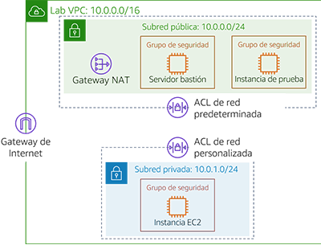
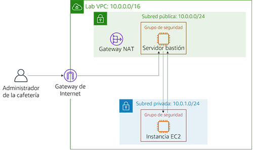
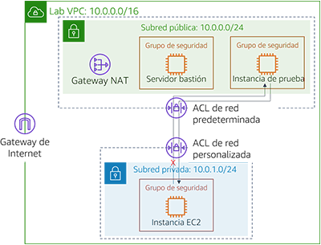

# Laboratorio de desafíos del módulo 6: Creación de un entorno de red de VPC para la cafetería

## Caso

Ahora, Sofía y Nikhil confían en su capacidad para crear una arquitectura de dos capas por su experiencia migrando los datos de la cafetería. Migraron correctamente de una base de datos MariaDB en una instancia de Amazon Elastic Compute Cloud (Amazon EC2) a una instancia de base de datos de Amazon Relational Database Service (Amazon RDS). Además, también trasladaron sus recursos de base de datos de una subred pública a una subred privada.


Cuando Mateo, un cliente regular de la cafetería que es administrador e ingeniero de sistemas de AWS, visita la cafetería, Sofía y Nikhil le informan sobre la migración de la base de datos. Mateo les dice que pueden mejorar la seguridad ejecutando el servidor de aplicaciones de la cafetería en otra subred privada que sea independiente de la instancia de base de datos. Así, podrían pasar por un servidor bastión (o salto) para obtener acceso administrativo al servidor de aplicaciones. El servidor de aplicaciones también debe ser capaz de descargar los parches necesarios.

Con el conocimiento de que [la nube facilita la experimentación](https://aws.amazon.com/blogs/enterprise-strategy/create-a-culture-of-experimentation-enabled-by-the-cloud/), Sofía y Nikhil están ansiosos por configurar un entorno de VPC que no sea de producción. Pueden utilizarlo para implementar la nueva arquitectura y probar diferentes capas de seguridad, sin interrumpir por accidente el entorno de producción de la cafetería.

<br/>
## Información general y objetivos del laboratorio

En este laboratorio, utiliza Amazon Virtual Private Cloud (Amazon VPC) para crear un entorno de red en AWS e implementar capas de seguridad que protejan sus recursos.

Después de completar este laboratorio, debería ser capaz de lo siguiente:

- crear un entorno de nube virtual privada (VPC) que le permita conectarse de forma segura a recursos privados
- permitir que sus recursos privados se conecten a Internet
- crear una capa adicional de seguridad en su VPC para controlar el tráfico hacia y desde los recursos privados

Cuando inicie el laboratorio, solo tendrá una VPC creada para usted en la cuenta de AWS.

Una vez que termine este laboratorio, la arquitectura debería verse como el siguiente ejemplo:



(En el diagrama, las flechas de comunicación se omitieron por motivos de simplificación).

**Nota**: En este laboratorio de desafíos, no se ofrecen instrucciones paso a paso para la mayoría de las tareas. Debe descubrir sin ayuda cómo completar las tareas.

<br/>
## Duración

Para completar este laboratorio, se necesitan aproximadamente **90 minutos**.

<br/>
## Restricciones de los servicios de AWS

En este entorno de laboratorio, el acceso a los servicios y las acciones de los servicios de AWS puede restringirse a los que se necesiten para cumplir las instrucciones del laboratorio. Es posible que se produzcan errores si intenta acceder a otros servicios o hacer acciones que no sean las que se describen en este laboratorio.

<br/>

## Acceso a la consola de administración de AWS

1. En la parte superior de estas instrucciones, elija <span id="ssb_voc_grey">Start Lab</span> (Iniciar laboratorio) y comience a trabajar en él.

   Se abrirá el panel **Start Lab** (Iniciar laboratorio), donde se muestra el estado del laboratorio.

   **Sugerencia**: Si necesita más tiempo para completar el laboratorio, vuelva a hacer clic en el botón “Start Lab (Iniciar laboratorio)” para reiniciar el temporizador del entorno.

2. Espere hasta que aparezca el mensaje *Lab status: ready (Estado del laboratorio: listo)* y, a continuación, haga clic en **X** para cerrar el panel **Start Lab** (Iniciar laboratorio).

3. En la parte superior de estas instrucciones, elija <span id="ssb_voc_grey">AWS</span>.

   Esto abrirá la consola de administración de AWS en una nueva pestaña del navegador y el sistema iniciará su sesión de forma automática.

   **Sugerencia**: Si no se abre una nueva pestaña del navegador, por lo general habrá un aviso o un icono en la parte superior con un mensaje que indicará que el navegador impide que el sitio abra ventanas emergentes. Haga clic en el aviso o el icono y elija **Allow pop ups** (Permitir ventanas emergentes).

4. Ubique la pestaña de la consola de administración de AWS de modo que aparezca junto con estas instrucciones. Idealmente, debería poder ver ambas pestañas del navegador al mismo tiempo para que pueda seguir los pasos del laboratorio fácilmente.

<br/>
## Solicitud empresarial para la cafetería: creación de una red de VPC que permita al personal de la cafetería administrar de forma remota y segura el servidor de aplicaciones web (Desafío n.° 1)


En este desafío, asumirá el papel de uno de los administradores del sistema de la cafetería. Creará y configurará una red de VPC para que pueda conectarse de forma segura desde un servidor bastión en una subred pública a una instancia EC2 en una subred privada. También creará una gateway NAT para permitir que la instancia EC2 de su subred privada acceda a Internet.

<br/>
### Tarea 1: Crear una subred pública

Su primera tarea en este laboratorio implica crear una subred pública en *Lab VPC*. Después de crear una subred pública, creará una gateway de Internet para permitir la comunicación desde la subred a Internet. Actualizará la tabla de enrutamiento que está asociada a la subred de modo que dirija el tráfico de red con destino a Internet a través de la gateway de Internet.

5. Abra la **consola de Amazon VPC**.

6. Tenga en cuenta que se creó una VPC llamada `Lab VPC` para usted.

7. Cree una subred pública que cumpla los siguientes criterios:
   - **Name tag** (Etiqueta de nombre): `Public Subnet (Subred pública)`
   - **VPC**: *Lab VPC*
   - **Availability Zone** (Zona de disponibilidad): elija la zona de disponibilidad **a** de su región (por ejemplo, si su región es *us-east-1*, entonces seleccione **us-east-1a**).
   - **IPv4 CIDR block** (Bloque de CIDR IPv4): `10.0.0.0/24`

8. Cree una nueva gateway de Internet y asóciela a la `Lab VPC`.

9. Edite la tabla de enrutamiento que se creó en la VPC. Agregue la ruta `0.0.0.0/0`. Como objetivo, seleccione la gateway de Internet que creó en el paso anterior.

   **Pista**: Para completar correctamente esta tarea, debe crear algunos recursos. Si no puede avanzar, consulte la [documentación de AWS](https://docs.aws.amazon.com/vpc/latest/userguide/VPC_Internet_Gateway.html).

<br/>
### Tarea 2: Crear un servidor bastión

En esta tarea, creará un servidor bastión en la *subred pública*. En tareas posteriores, creará una instancia EC2 en una subred privada y se conectará a ella desde este servidor bastión.

10. Desde la **consola de Amazon EC2**, cree una instancia EC2 en la `subred pública` de *Lab VPC* que cumpla los siguientes criterios:
    - **Amazon Machine Image (AMI)** (Imagen de Amazon Machine [AMI]): *Amazon Linux 2 AMI (HVM) (AMI de Amazon Linux 2 [HVM])*
    - **Instance type** (Tipo de instancia): *t2.micro*
    - **Auto-assign Public IP** (Asignación automática de IP pública): este ajuste debería estar desactivado.
    - **Name** (Nombre): `Bastion Host (Servidor bastión)`
    - Grupo de seguridad denominado `Bastion Host SG (Grupo de seguridad de servidor bastión)` que solo permite el siguiente tráfico:
       - **Type** (Tipo): *SSH*
       - **Port** (Puerto): `22`
       - **Source** (Origen): su dirección IP
    - Utiliza el par de claves **vockey**.


<br/>

> **Nota:** En la práctica, reforzar un servidor bastión implica más trabajo que simplemente restringir el tráfico de Secure Shell (SSH) de su dirección IP. Por lo general, un servidor bastión se coloca en una red cerrada a otras redes. A menudo, está protegido con autenticación multifactor (MFA) y monitoreado con herramientas de auditoría. La mayoría de las empresas requieren un seguimiento de acceso al servidor bastión que se pueda someter a auditoría.

<br/>
### Tarea 3: Asignar una dirección IP elástica al servidor bastión

En esta tarea, asignará una dirección IP elástica al servidor bastión.

El servidor bastión que acaba de crear no es accesible desde Internet. No tiene una dirección IPv4 pública o una dirección IP elástica asociada a su dirección IPv4 privada. Las direcciones IP elásticas están asociadas a instancias bastión y se permiten en los firewall de las instalaciones. Si se termina una instancia y se inicia una nueva en su lugar, la dirección IP elástica existente se vuelve a asociar a la nueva instancia. Con este comportamiento, la misma dirección IP elástica de confianza se utiliza en todo momento.

11. Asigne una dirección IP elástica y habilite su acceso desde Internet a través de IPv4 asociándola a su servidor bastión.

<br/>
### Tarea 4: Probar la conexión con el servidor bastión

En esta tarea, utilizará la clave SSH (archivo .pem o .ppk) para probar la conexión SSH con el servidor bastión. Esta clave fue creada para usted.

12. En la parte superior derecha de estas instrucciones, seleccione **Details** (Detalles).

13. Junto a **AWS**, elija **Show** (Mostrar).

14. Descargue la clave SSH. Tenga en cuenta que el archivo recibirá el nombre **labuser.\***.
    - **Usuarios de Microsoft Windows PuTTY**: *Download PPK (Descargar PPK)*
    - **Usuarios de macOS o Linux**: *Download PEM (Descargar PEM)*

15. Para cerrar la ventana, elija la **X**.

16. Conéctese a su servidor bastión mediante SSH.

17. Después de probar su conexión con el servidor bastión, puede cerrar el terminal o PuTTY.

    **Pista**: Si no puede avanzar, consulte la [documentación de AWS](https://docs.aws.amazon.com/quickstarts/latest/vmlaunch/step-2-connect-to-instance.html). Esta página proporciona instrucciones detalladas acerca de cómo utilizar SSH para conectarse a una instancia EC2.

<br/>

> **Nota para usuarios de Microsoft Windows**: Si no tiene PuTTY instalado, debe [descargarlo e instalarlo](https://the.earth.li/~sgtatham/putty/latest/w64/putty.exe). Recomendamos que configure PuTTY de manera que la conexión no caduque. Para mantener abierta la sesión de PuTTY durante más tiempo, establezca **Seconds between keepalives** (Segundos entre señales de conexión persistente) en `30`.

<br/>
### Tarea 5: Crear una subred privada

En esta tarea, creará una subred privada en la *Lab VPC*.

18. En la consola, cree una subred privada que cumpla los siguientes criterios:
    - **Name tag** (Etiqueta de nombre): `Private Subnet (Subred privada)`
    - **Availability Zone** (Zona de disponibilidad): igual que la *subred pública*
    - **IPv4 CIDR block** (Bloque de CIDR IPv4): `10.0.1.0/24`

<br/>
### Tarea 6: Crear una gateway NAT

En esta tarea, creará una gateway NAT que permita a los recursos de la *subred privada* conectarse a Internet.


19. Cree una gateway NAT que cumpla los siguientes criterios:

    - **Name** (Nombre): `Lab NAT Gateway (Gateway NAT de laboratorio)`
    - **Subnet** (Subred): *Public Subnet (Subred pública)*

    **Sugerencia**: Su gateway NAT necesita una dirección IP elástica.

20. Cree una tabla de enrutamiento nueva que cumpla los siguientes criterios:
    - **Name tag** (Etiqueta de nombre): `Private Subnet Route Table (Tabla de enrutamiento de subred privada)`
    - **Destination** (Destino): `0.0.0.0/0`
    - **Target** (Objetivo): *Gateway NAT*
21. Asocie esta tabla de enrutamiento a la *subred privada*, la cual creó anteriormente.

    **Pista**: Si no puede avanzar, consulte la [documentación de AWS](https://docs.aws.amazon.com/vpc/latest/userguide/vpc-nat-gateway.html#nat-gateway-creating).

<br/>
### Tarea 7: Crear una instancia EC2 en la subred privada

En esta tarea, creará una instancia EC2 en la *subred privada* y la configurará para permitir el tráfico SSH del servidor bastión. También creará un nuevo par de claves para acceder a esta instancia.

22. Cree un nuevo par de claves denominado `vockey2` y descargue el .ppk (Microsoft Windows) o .pem (macOS o Linux) adecuado.

23. Cree una instancia EC2 en la *subred privada* de la *Lab VPC* que cumpla los siguientes criterios.
    - **AMI**: *Amazon Linux 2 AMI (HVM) (AMI de Amazon Linux 2 [HVM])*
    - **Instance type** (Tipo de instancia): *t2.micro*
    - **Name** (Nombre): `Private Instance (Instancia privada)`
    - Solo permite el siguiente tráfico:
       - **Type** (Tipo): *SSH*
       - **Port** (Puerto): `22`
       - **Source** (Origen): Bastion host security group (Grupo de seguridad del servidor bastión) (**Pista**: Consulte la [documentación de AWS](https://docs.aws.amazon.com/AWSEC2/latest/UserGuide/ec2-security-groups.html))
    - Utiliza el par de claves **vockey2** que creó anteriormente.


<br/>
### Tarea 8: Configurar el cliente SSH para el acceso directo SSH

Dado que la instancia privada que acaba de crear utiliza un par de claves diferente del que emplea el servidor bastión, debe configurar su cliente SSH para que use el acceso directo SSH. Esta acción le permite utilizar un par de claves almacenado en el equipo para acceder a la instancia privada sin cargar el par de claves en el servidor bastión. Esta es una buena práctica de seguridad.

Para configurar su cliente, siga los pasos de Microsoft Windows o de macOS o Linux.


#### Usuarios de Microsoft Windows únicamente

Los usuarios de Windows deben completar los siguientes pasos.

24. Descargue e instale *Pageant*, que está disponible en la [página de descargas](http://www.chiark.greenend.org.uk/~sgtatham/putty/download.html) de PuTTY.

25. Después de instalar Pageant, ábralo. Pageant se ejecuta como un servicio de Windows.

26. Para importar la clave con formato PuTTY a Pageant, siga estos pasos.
    - En la bandeja del sistema Windows, haga doble clic en el ícono de **Pageant**. 
    - Elija **Add key** (Agregar clave).
    - Seleccione el archivo .ppk que descargó cuando creó el par de claves *vockey2*.

    La pantalla debería tener un aspecto similar al siguiente ejemplo.

    

27. Agregue el primer *vockey* que descargó anteriormente. El nombre del archivo era **labuser.\***.

    Ahora debería tener dos claves en la lista. Puede cerrar la ventana de Pageant.

28. En PuTTY, en **Connection** (Conexión) > **SSH** > **Auth** (Autenticación), seleccione **Allow agent forwarding** (Permitir reenvío del agente) y deje la casilla de **Private key file for authentication** (Archivo de clave privada para autenticación) vacía. Después de completar este paso, continúe con el paso 32 de la tarea 9. Proceda a conectarse al servidor bastión utilizando PuTTY como lo haría normalmente, pero no abra un archivo .ppk.


#### Usuarios de macOS o Linux únicamente

Para los usuarios de macOS, *ssh-agent* ya está instalado como parte del sistema operativo. Para agregar las claves, siga los pasos que se indican a continuación.

29. Agregue sus claves privadas a la aplicación de llaveros mediante el comando `ssh-add` con la opción `-K` y el archivo `.pem` de la clave. El comando debe ser similar al siguiente ejemplo.

    ```bash
    ssh-add -K vockey2.pem
    ```

30. Asegúrese de agregar las claves *vockey.pem* y *vockey2.pem* que descargó.

    Si agrega la clave al agente, puede usar SSH para conectarse a una instancia sin utilizar la opción `–i` <keyfile> cuando se conecte.

31. Si desea comprobar que las claves están disponibles para ssh-agent, utilice el comando `ssh-add` con la opción `-L`, como en el siguiente ejemplo.

    ```bash
    ssh-add –L
    ```
El agente debería mostrar las claves que almacenó.

Después de agregar la clave a su llavero, puede conectarse a la instancia del servidor bastión con SSH mediante la opción `–A`. Esta opción habilita el reenvío del agente SSH. También permite que el agente SSH local responda a un desafío de clave pública cuando utiliza SSH para conectarse desde el servidor bastión a una instancia de destino en la VPC.

Por ejemplo, para conectarse a una instancia de una subred privada, debe escribir el siguiente comando (este comando habilita el reenvío del agente SSH mediante la instancia del servidor bastión):

```bash
ssh –A ec2-user@<bastion-IP-address-or-DNS-entry>
```
Una vez conectado a la instancia del servidor bastión, puede utilizar SSH para conectarse a una instancia específica con un comando como el de este ejemplo.

  ```bash
  ssh user@<instance-IP-address-or-DNS-entry>
  ```

> **Nota**: ssh-agent no sabe qué clave debería usar para una conexión SSH dada. Por lo tanto, ssh-agent probará de manera secuencial todas las claves que se carguen en el agente. Dado que las instancias terminan la conexión después de cinco intentos fallidos de conexión, asegúrese de que el agente tenga cinco claves o menos. Como cada administrador debe tener una sola clave, esto no suele ser un problema para la mayoría de las implementaciones. Para obtener más información sobre cómo administrar las claves en ssh-agent, utilice el comando `man ssh-agent`.

<br/>
### Tarea 9: Probar la conexión SSH desde el servidor bastión

En esta tarea, probará la conexión SSH desde el servidor bastión con la instancia EC2 que se ejecuta en la *subred privada*.

32. Conéctese a la instancia del servidor bastión con SSH.

    **Sugerencia**: Utilice el método de conexión que se describe en la sección de acceso directo SSH.

33. Conéctese a la instancia privada con SSH y la dirección IP de la instancia privada.

    ```bash
    ssh ec2-user@<private-ip-address-of-instance-in-private-subnet>
    ```

34. Ahora que está conectado a la instancia EC2 en la *subred privada*, pruebe su conexión a Internet.

      ```bash
      ping 8.8.8.8
      ```

    **Sugerencia**: Presione CTRL+C para salir del comando.
   <br/>

Ya estableció la comunicación entre el *servidor bastión* en la *subred pública* y la instancia EC2 en la *subred privada*, como en el siguiente diagrama:
<br/>



<br/>
<br/>
**Práctica recomendada para la arquitectura**

En este primer desafío, implementó la práctica recomendada para la arquitectura de *permitir a las personas realizar acciones a distancia.*

<details>
	<summary>Expanda <b>aquí</b> para obtener más información.</summary>
	De acuerdo con <a href="https://docs.aws.amazon.com/wellarchitected/latest/framework/welcome.html">Well-Architected Framework</a>, los recursos informáticos requieren varias capas de defensa para protegerlos de las amenazas externas e internas. En la práctica, debe eliminar la capacidad de acceso interactivo para reducir el riesgo de que se produzcan errores humanos y el potencial de configuración o administración manuales. En Well-Architected Framework, se recomienda utilizar un flujo de trabajo de administración de cambios para implementar instancias EC2 mediante la infraestructura como código. A continuación, debe utilizar herramientas, como Amazon EC2 Systems Manager, para administrar instancias EC2 en lugar de permitir el acceso directo o puede utilizar un servidor bastión. Para obtener más información sobre cómo reemplazar un servidor bastión con Amazon EC2 Systems Manager, consulte esta <a href="https://aws.amazon.com/blogs/mt/replacing-a-bastion-host-with-amazon-ec2-systems-manager" />publicación del blog de seguridad de AWS.</a>
</details>

<br/>
## Nuevo requisito empresarial: mejora de la capa de seguridad para los recursos privados (Desafío n.° 2)

Sofía y Nikhil están orgullosos de los cambios que realizaron en la arquitectura de la aplicación de la cafetería. Están satisfechos con la seguridad adicional creada, además de encantados de tener un entorno de pruebas que puedan utilizar antes de implementar las actualizaciones en la instancia de producción. Comentan a Mateo sobre su nueva arquitectura de la aplicación y este se muestra impresionado. Para mejorar aún más la seguridad de sus aplicaciones, Mateo les aconseja crear una capa adicional de seguridad mediante el uso de listas de control de acceso a la red (ACL de red) personalizadas.

En este desafío, continuará asumiendo el papel de uno de los administradores del sistema de la cafetería. Ahora que ha establecido un acceso seguro desde el servidor bastión a la instancia EC2 en la subred privada, debe mejorar la capa de seguridad de la subred privada. Para llevar a cabo esta tarea, creará y configurará una ACL de red personalizada.

<br/>
### Tarea 10: Crear una ACL de red

En esta tarea, creará una ACL de red personalizada para controlar el tráfico hacia y desde la *subred privada*.

Puede utilizar las ACL de red para controlar el tráfico entre subredes. Se recomienda usar las ACL de red para implementar reglas similares a las de un grupo de seguridad. Las ACL de red brindan una capa adicional de protección.

Para este desafío, creará una instancia EC2 en la *subred pública*. Creará un grupo de seguridad que permita el tráfico con el protocolo de mensaje de control de Internet (ICMP) desde la red local. A continuación, creará y configurará su ACL de red personalizada para deniegan el tráfico ICMP entre la *subred privada* y esta instancia de prueba. La utilidad *ping* emplea ICMP.


35. Vaya a la **consola de Amazon VPC** e inspeccione la ACL de red predeterminada de *Lab VPC*.

    **Nota 1**: Las subredes que ha creado se asocian automáticamente a la ACL de red predeterminada.  
    **Nota 2**: Las reglas de entrada y salida de la ACL de red predeterminada *permiten* todo el tráfico.


36. Cree una ACL de red personalizada denominada `Lab Network ACL (ACL de red de laboratorio)` para *Lab VPC*.

    **Nota**: Las reglas predeterminadas de entrada y salida de la ACL de red personalizada *deniegan* todo el tráfico.


37. Configure su ACL de red personalizada de manera que *permita TODO el tráfico que entre y salga de* la *subred privada*.

    **Pista**: Si no puede avanzar, consulte la [documentación de AWS](https://docs.aws.amazon.com/vpc/latest/userguide/vpc-network-acls.html#CreateACL).

<br/>
### Tarea 11: Probar la ACL de red personalizada

38. Cree una instancia EC2 en la *subred pública* de *Lab VPC*. Debe cumplir los siguientes criterios.
    - AMI: *Amazon Linux 2 AMI (HVM) (AMI de Amazon Linux 2 [HVM])*
    - Instance Type (Tipo de instancia): *t2.micro*
    - Name (Nombre): `Test Instance (Instancia de prueba)`
    - Permite todo el tráfico entrante *All ICMP – IPv4* a la instancia a través del grupo de seguridad.


39. Registre la dirección IP privada de la *instancia de prueba*.

40. Compruebe que puede llegar a la dirección IP privada de la *instancia de prueba* desde la *instancia privada*. Desde la ventana del terminal de la *instancia privada*, ejecute el siguiente comando ping:

    ```bash
    ping <private-ip-address-of-test-instance>
    ```

41. Deje la utilidad *ping* en ejecución.

42. Modifique la ACL de red personalizada para *denegar todo el tráfico All ICMP – IPv4* a `<private-ip-address-of-test-instance>/32`.

    - Asegúrese de agregar `/32` al final de la dirección IP privada.

    - Asegúrese de que esta regla se evalúe ***primero***.

43. En la ventana del terminal de la *instancia privada*, el comando ping debería dejar de responder. Se ha bloqueado el tráfico a la *instancia de prueba*.

<br/>

Ahora ha denegado el tráfico de la *subred privada* hacia la *instancia de prueba*, como se muestra en el siguiente diagrama:

<br/>



<br/>
<br/>
**Práctica recomendada para la arquitectura**

En este segundo desafío, protegió los recursos de red mediante la implementación de la práctica recomendada para la arquitectura de *controlar el tráfico en todas las capas*.

<details>
	<summary>Expanda <b>aquí</b> para obtener más información.</summary>
	Según <a href="https://docs.aws.amazon.com/wellarchitected/latest/framework/welcome.html">Well-Architected Framework</a>, cualquier carga de trabajo que tenga algún tipo de conectividad de red, ya sea con Internet o una red privada, requiere varias capas de defensa para ayudar a protegerla de amenazas externas e internas que se encuentran en las redes. Cuando controla el tráfico en todas las capas, se aplican varias capas de controles de seguridad (lo que se conoce como un enfoque de <i>defensa en profundidad</i>) al tráfico entrante y saliente. Por ejemplo, puede aplicar este enfoque en Amazon VPC mediante grupos de seguridad, ACL de red y subredes.
</details>

<br/>
## Respuesta a las preguntas sobre el laboratorio

Las respuestas se registrarán cuando haga clic en el botón azul **Submit** (Enviar), que se encuentra al final del laboratorio.

44. Acceda a las preguntas de este laboratorio.
- Elija el menú <span id="ssb_voc_grey">Details (Detalles) <i class="fas fa-angle-down"></i></span>
   y después <span id="ssb_voc_grey">Show</span> (Mostrar).
- Elija el enlace **Access the multiple choice questions** (Acceder a las preguntas de múltiple opción) que aparece en la parte inferior de la página.

45. En la página que cargó, responda las siguientes preguntas:

    - **Pregunta 1**: ¿Qué función cumple la gateway de Internet en la subred pública?
    - **Pregunta 2**: ¿Qué permite que la instancia de la subred privada se conecte a Internet para que pueda descargar actualizaciones?
    - **Pregunta 3**: ¿Se puede acceder a la instancia de la subred privada directamente desde Internet?
    - **Pregunta 4**: ¿Por qué usa dos pares de claves diferentes para acceder a la instancia privada y el servidor bastión?
    - **Pregunta 5**: ¿Puede el servidor bastión usar ping y obtener una respuesta de la instancia en la subred privada?
    - **Pregunta 6**: ¿Qué reglas del grupo de seguridad permiten a la instancia EC2 privada recibir el tráfico de retorno cuando hace ping en la instancia de prueba?

<br/>

## Envío del trabajo

46. En la parte superior de estas instrucciones, elija <span id="ssb_blue">Submit</span> (Enviar) para registrar su progreso y, cuando se le indique, elija **Yes** (Sí).

47. Si los resultados no se muestran después de algunos minutos, vuelva a la parte superior de estas instrucciones y elija <span id="ssb_voc_grey">Grades</span> (Resultados).

    **Sugerencia**: Puede enviar su trabajo varias veces. Después de realizar las modificaciones pertinentes, vuelva a elegir **Submit** (Enviar). Su último envío es el que se registrará para este laboratorio.

48. Para encontrar comentarios detallados sobre su trabajo, elija <span id="ssb_voc_grey">Details</span> (Detalles) seguido de <i class="fas fa-caret-right"></i> **View Submission Report** (Ver informe de envío).

<br/>
## Fin del laboratorio

<i class="fas fa-flag-checkered"></i> ¡Felicitaciones! Ha completado el laboratorio.


49. Para confirmar que desea completar el laboratorio, haga clic en **<span id="ssb_voc_grey">End Lab</span>** (Finalizar laboratorio), en la parte superior de esta página, y, a continuación, haga clic en **<span id="ssb_blue">Yes</span>** (Sí).

    Debería aparecer un panel con el siguiente mensaje: *DELETE has been initiated… You may close this message box now (Se ha iniciado la ELIMINACIÓN… Ya puede cerrar este cuadro de mensaje).*


50. Para cerrar el panel, haga clic en la **X** de la esquina superior derecha.


<br/>
*© 2020 Amazon Web Services, Inc. y sus empresas afiliadas. Todos los derechos reservados. Este contenido no puede reproducirse ni redistribuirse, total ni parcialmente, sin el permiso previo por escrito de Amazon Web Services, Inc. Queda prohibida la copia, el préstamo y la venta de carácter comercial.*
