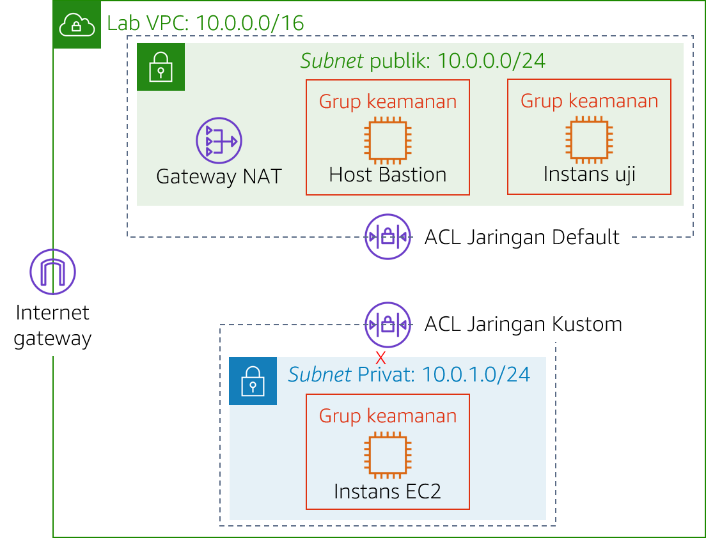
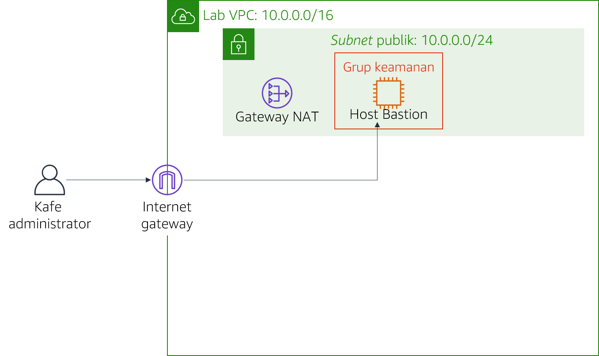

# Modul 6 - Lab Tantangan: Membuat Lingkungan Jaringan VPC untuk Kafe

<!--Note: the step-by-step solutions to the challenge sections of this lab can be found in the instructor guide (source document at https://awsu-coursebuild.s3-us-west-2.amazonaws.com/sourcefiles/CUR-TF-200-ACACAD-20-EN/IG/AcademyCloudArchitecting-IG-Module-06.docx)-->

## Skenario

Sofía dan Nikhil kini yakin akan kemampuan mereka untuk membuat arsitektur dua tingkat berkat pengalaman mereka memigrasikan data kafe. Mereka berhasil pindah dari basis data MariaDB pada instans Amazon Elastic Compute Cloud (Amazon EC2) ke instans basis data Amazon Relational Database Service (Amazon RDS). Selain itu, mereka juga memindahkan sumber daya basis data mereka dari subnet publik ke subnet privat.


Ketika Mateo—seorang langganan kafe dan administrator sistem serta teknisi AWS—mengunjungi kafe, Sofía dan Nikhil menceritakan tentang migrasi basis data yang dilakukan. Mateo memberitahu bahwa mereka dapat meningkatkan keamanan dengan menjalankan server aplikasi kafe di subnet privat lain yang terpisah dari instans basis data. Mereka kemudian dapat melalui host bastion (atau jump box) untuk mendapatkan akses administratif ke server aplikasi. Server aplikasi juga harus dapat mengunduh patch yang diperlukan.

Mengetahui bahwa [cloud](https://aws.amazon.com/blogs/enterprise-strategy/create-a-culture-of-experimentation-enabled-by-the-cloud/) membuat eksperimen lebih mudah[](https://aws.amazon.com/blogs/enterprise-strategy/create-a-culture-of-experimentation-enabled-by-the-cloud/), Sofía dan Nikhil sangat ingin membuat lingkungan VPC nonproduksi. Mereka dapat menggunakannya untuk menerapkan arsitektur baru dan menguji lapisan keamanan yang berbeda, tanpa mengganggu lingkungan produksi kafe secara tidak sengaja.

<br/>
## Gambaran umum dan tujuan lab

Di lab ini, Anda menggunakan Amazon Virtual Private Cloud (Amazon VPC) untuk menciptakan lingkungan jaringan pada AWS dan menerapkan lapisan keamanan untuk melindungi sumber daya Anda.

Setelah menyelesaikan lab ini, Anda akan mampu:

- Membuat lingkungan virtual private cloud (VPC) yang memungkinkan Anda terhubung ke sumber daya pribadi dengan aman
- Mengaktifkan sumber daya pribadi Anda untuk terhubung ke internet
- Membuat lapisan keamanan tambahan di VPC Anda untuk mengontrol lalu lintas ke dan dari sumber daya pribadi

Ketika Anda memulai lab, Anda hanya akan memiliki sebuah VPC yang dibuat untuk Anda di akun AWS.

Pada akhir lab ini, arsitektur Anda seharusnya terlihat seperti contoh berikut:



(Dalam diagram, panah komunikasi dihilangkan untuk menyederhanakan.)

**Catatan**: di lab tantangan ini, instruksi langkah demi langkah tidak disediakan untuk sebagian besar tugas. Anda harus memikirkan cara untuk menyelesaikan tugas Anda sendiri.

<br/>
## Durasi

Diperlukan waktu sekitar **90 menit** untuk menyelesaikan lab ini.

<br/>
## Pembatasan layanan AWS

Dalam lingkungan lab ini, akses ke layanan AWS dan tindakan layanan mungkin dibatasi untuk orang-orang yang diperlukan untuk menyelesaikan instruksi lab. Anda mungkin akan mengalami error jika mencoba mengakses layanan lain atau melakukan tindakan di luar yang dijelaskan di lab ini.

<br/>

## Mengakses Konsol Manajemen AWS

1. Di bagian atas instruksi ini, pilih <span id="ssb_voc_grey">Start Lab</span> (Mulai Lab) untuk meluncurkan lab Anda.

   Panel **Start Lab** (Mulai Lab) terbuka dan menampilkan status lab.

   **Tip**: Jika Anda memerlukan lebih banyak waktu untuk menyelesaikan lab, pilih tombol Start Lab (Mulai Lab) lagi untuk memulai ulang pengatur waktu untuk lingkungan.

2. Tunggu hingga Anda melihat pesan *Lab status: ready* (Status lab: siap), lalu tutup panel **Start Lab** (Mulai Lab) dengan memilih **X**.

3. Di bagian atas instruksi ini, pilih <span id="ssb_voc_grey">AWS</span>

   Tindakan ini akan membuka Konsol Manajemen AWS di tab browser baru. Anda akan login ke sistem secara otomatis.

   **Tip**: Jika tab browser baru tidak terbuka, banner atau ikon biasanya berada di bagian atas browser Anda dengan pesan bahwa browser Anda mencegah situs web membuka jendela sembulan. Pilih banner atau ikon lalu pilih **Allow pop-ups** (Izinkan sembulan).

4. Atur tab AWS Management Console (Konsol Manajemen AWS) agar ditampilkan bersama instruksi ini. Idealnya, Anda akan dapat melihat kedua tab browser sekaligus, sehingga Anda dapat mengikuti langkah-langkah lab dengan mudah.

<br/>
## Permintaan bisnis untuk kafe: Membuat jaringan VPC yang memungkinkan staf kafe untuk mengelola server aplikasi web secara jarak jauh dan aman (Tantangan #1)


Dalam tantangan ini, Anda akan berperan sebagai salah satu administrator sistem kafe. Anda akan membuat dan mengonfigurasi jaringan VPC, sehingga Anda dapat terhubung dengan aman dari host bastion di subnet publik ke sebuah instans EC2 di subnet privat. Anda juga akan membuat gateway NAT untuk mengaktifkan instans EC2 di subnet privat Anda untuk mengakses internet.

<br/>
### Tugas 1: Membuat subnet privat

Tugas pertama Anda di lab ini adalah membuat subnet publik di *Lab VPC*. Setelah Anda membuat subnet publik, Anda akan membuat gateway internet untuk memungkinkan komunikasi dari subnet ke internet. Anda akan memperbarui tabel perutean yang melekat pada subnet untuk mengarahkan lalu lintas jaringan internet melalui gateway internet.

5. Buka **konsol Amazon VPC**.

6. Perhatikan bahwa VPC bernama `Lab VPC` telah dibuat untuk Anda.

7. Buat subnet publik yang memenuhi kriteria berikut:
   - **Name tag** (Tanda nama): `Public Subnet` (Subnet Publik)
   - **VPC**: *Lab VPC*
   - **Availability Zone**: Pilih Availability Zone **a** pada Wilayah Anda (misalnya, jika Wilayah Anda adalah *us-east-1*, maka pilihlah **us-east-1a**)
   - **IPv4 CIDR block** (Blok CIDR IPv4): `10.0.0.0/24`

8. Buat gateway internet baru dan pasang ke `Lab VPC`.

9. Edit tabel rute yang dibuat di VPC Anda. Tambahkan rute `0.0.0.0/0`. Untuk target, pilih gateway internet yang Anda buat pada langkah sebelumnya

   **Petunjuk**: Agar berhasil menyelesaikan tugas ini, Anda harus membuat beberapa sumber daya. Jika Anda kehabisan ide, lihat [Dokumentasi AWS](https://docs.aws.amazon.com/vpc/latest/userguide/VPC_Internet_Gateway.html).

<br/>
### Tugas 2: Membuat host bastion

Dalam tugas ini, Anda akan membuat host bastion di *Subnet* Publik**. Pada tugas-tugas berikutnya, Anda akan membuat instans EC2 di subnet privat dan menghubungkannya dari host bastion ini.

10. Dari **konsol Amazon EC2**, buat instans EC2 di `Subnet` publik`` dari *Lab VPC* yang memenuhi kriteria berikut:
   - **Amazon Machine Image (AMI)**: *Amazon Linux 2 AMI (HVM)*
   - **Instance type** (Tipe instans): *t2.micro*
   - **Auto-assign Public IP** (Tetapkan otomatis IP Publik): Pengaturan ini sebaiknya dinonaktifkan
   - **Name** (Nama): `Bastion Host` (Host Bastion)
   - Grup keamanan bernama `Bastion Host SG` yang hanya mengizinkan traffic berikut ini:
      - **Type** (Jenis): *SSH*
      - **Port:** `22`
      - **Source** (Sumber): Your IP address (Alamat IP Anda)
   - Menggunakan pasangan kunci **vockey**


<br/>

> **Catatan:** Dalam praktiknya, pengerasan host bastion melibatkan lebih banyak pekerjaan daripada hanya membatasi lalu lintas Secure Shell (SSH) dari alamat IP Anda. Host bastion biasanya ditempatkan dalam jaringan yang tertutup dari jaringan lain. Host ini sering dilindungi dengan autentikasi multi-faktor (MFA) dan dipantau dengan alat audit. Sebagian besar perusahaan memerlukan jalur akses yang dapat diaudit ke host bastion.

<br/>
### Tugas 3: Mengalokasikan alamat IP Elastis untuk host bastion

Dalam tugas ini, Anda akan menetapkan alamat IP Elastis ke host bastion.

Host bastion yang baru saja Anda buat tidak dapat dijangkau dari internet. Host ini tidak memiliki alamat IPv4 publik atau alamat IP Elastis yang dikaitkan dengan alamat IPv4 pribadi. Alamat IP Elastis dikaitkan dengan instans bastion dan diizinkan melewati firewall on-premise. Jika sebuah instans dihentikan dan instans baru diluncurkan untuk menggantikannya, alamat IP Elastis yang ada dikaitkan kembali dengan instans baru tersebut. Dengan perilaku ini, alamat IP Elastis tepercaya yang sama akan selalu digunakan.

11. Alokasikan alamat IP Elastis, dan jadikan terjangkau dari internet melalui IPv4 dengan mengaitkannya dengan host bastion Anda.

<br/>
### Tugas 4: Menguji koneksi ke host bastion

Dalam tugas ini, Anda akan menggunakan kunci SSH (file .pem atau file .ppk) untuk menguji koneksi SSH ke host bastion Anda. Kunci ini dibuat untuk Anda.

12. Di area kanan atas instruksi ini, pilih **Details** (Detail).

13. Di samping **AWS**, pilih **Show** (Tampilkan).

14. Unduh kunci SSH. Ingatlah bahwa file akan diberi nama **labuser.\***.
   - **Pengguna Microsoft Windows PuTTY**: *Unduh PPK*
   - **Pengguna macOS atau Linux**: *Unduh PEM*

15. Untuk menutup jendela, pilih **X**.

16. Lakukan koneksi ke host bastion Anda dengan menggunakan SSH.

17. Setelah Anda menguji koneksi Anda ke host bastion, Anda dapat menutup terminal atau PuTTY.

   **Petunjuk**: Jika Anda kehabisan ide, lihat [Dokumentasi AWS](https://docs.aws.amazon.com/quickstarts/latest/vmlaunch/step-2-connect-to-instance.html). Halaman ini memberikan instruksi detail tentang cara menggunakan SSH untuk terhubung ke instans EC2.

<br/>

> **Penting bagi pengguna Microsoft Windows**: Jika Anda tidak menginstal PuTTY, Anda harus [mengunduh dan menginstal PuTTY](https://the.earth.li/~sgtatham/putty/latest/w64/putty.exe). Kami menyarankan Anda untuk mengonfigurasi PuTTY, sehingga koneksi Anda tidak kedaluwarsa. Agar sesi PuTTY berlangsung lebih lama, atur **Detik antara keepalives** ke `30`.

<br/>
### Tugas 5: Membuat subnet privat

Dalam tugas ini, Anda akan membuat subnet privat di *Lab VPC*.

18. Pada konsol, buat subnet privat yang memenuhi kriteria berikut:
   - **Name tag** (Tanda nama): `Private Subnet` (Subnet Privat)
   - **Availability Zone**: Sama seperti *Subnet* Publik**
   - **IPv4 CIDR block** (Blok CIDR IPv4): `10.0.1.0/24`

<br/>
### Tugas 6: Membuat gateway NAT

Dalam tugas ini, Anda akan membuat gateway NAT, yang memungkinkan sumber daya di *Subnet* Privat** untuk terhubung ke internet.


19. Buat gateway NAT yang memenuhi kriteria berikut:

   - **Name** (Nama): `Lab NAT Gateway`
   - **Subnet**: *Public Subnet* (Subnet Publik)

**Tip**: Gateway NAT Anda membutuhkan alamat IP Elastis.

20. Buat tabel rute baru yang memenuhi kriteria berikut:
   - **Name tag** (Tanda nama): `Private Subnet Route Table` (Tabel Rute Subnet Privat)
   - **Destination** (Tujuan): `0.0.0.0/0`
   - **Target**: *NAT Gateway*
21. Pasang tabel rute ini ke *Subnet* Privat**, yang Anda buat sebelumnya.

    **Petunjuk**: Jika Anda kehabisan ide, lihat [Dokumentasi AWS](https://docs.aws.amazon.com/vpc/latest/userguide/vpc-nat-gateway.html#nat-gateway-creating).

<br/>
### Tugas 7: Membuat instans EC2 di subnet privat

Dalam tugas ini, Anda akan membuat instans EC2 di *Subnet* Privat**, dan Anda akan mengonfigurasinya untuk mengizinkan lalu lintas SSH dari host bastion. Anda juga akan membuat pasangan kunci baru untuk mengakses instans ini.

22. Buat pasangan kunci baru bernama `vockey2`, dan unduh .ppk (Microsoft Windows) atau .pem (macOS atau Linux) yang sesuai.

23. Buat instans EC2 di *Subnet* Privat** dari *Lab VPC* yang memenuhi kriteria berikut.
   - **AMI**: *Amazon Linux 2 AMI (HVM)*
   - **Instance type** (Tipe instans): *t2.micro*
   - **Name** (Nama): `Private Instance` (Instans Pribadi)
   - Hanya mengizinkan lalu lintas berikut:
      - **Type** (Jenis): *SSH*
      - **Port:** `22`
      - **Source** (Sumber): Grup keamanan host bastion (**Petunjuk**: Lihat [Dokumentasi AWS](https://docs.aws.amazon.com/AWSEC2/latest/UserGuide/ec2-security-groups.html))
   - Menggunakan pasangan kunci **vockey2** yang Anda buat sebelumnya


<br/>
### Tugas 8: Mengonfigurasi klien SSH Anda untuk passthrough SSH

Karena instans pribadi yang baru saja Anda buat menggunakan pasangan kunci yang berbeda dari host bastion, Anda harus mengonfigurasi klien SSH Anda untuk menggunakan passthrough SSH. Tindakan ini memungkinkan Anda untuk menggunakan pasangan kunci yang disimpan di komputer Anda untuk mengakses instans pribadi tanpa mengunggah pasangan kunci ke host bastion. Ini adalah praktik keamanan yang baik.

Untuk menetapkan klien Anda, ikuti langkah-langkah Microsoft Windows, atau macOS atau Linux.


#### Hanya bagi pengguna Microsoft Windows

Pengguna Windows harus menyelesaikan langkah-langkah berikut.

24. Unduh dan instal *Pageant*, yang tersedia di [halaman unduh](http://www.chiark.greenend.org.uk/~sgtatham/putty/download.html) PuTTY.

25. Buka Pageant setelah Anda menginstalnya. Pageant berjalan sebagai layanan Windows.

26. Untuk mengimpor kunci dengan format PuTTY ke dalam Pageant, ikuti langkah-langkah berikut.
   - Di tray sistem Windows, klik ikon **Pageant** dua kali. 
   - Pilih **Add Key** (Tambahkan Kunci).
   - Pilih file .ppk yang diunduh saat Anda membuat pasangan kunci *vockey2*.

   Layar Anda akan terlihat seperti tampilan berikut ini:

   

27. Tambahkan *vockey* pertama yang Anda unduh sebelumnya. Nama file-nya adalah **labuser.\***.

   Anda sekarang seharusnya memiliki dua kunci terdaftar. Anda dapat menutup jendela Pageant.

28. Di PuTTY, pada **Connection (Koneksi) > SSH > Auth**, pilih **Allow agent forwarding** (Izinkan penerusan agen) dan biarkan kotak **Private key file for authentication ** (File kunci pribadi untuk autentikasi) kosong. Setelah Anda menyelesaikan langkah ini, lanjutkan ke Tugas 9, langkah 32. Lanjutkan dengan menghubungkan ke host bastion menggunakan PuTTY seperti yang biasa Anda lakukan, tetapi jangan membuka file .ppk.


#### hanya bagi pengguna macOS atau Linux

Bagi pengguna macOS, *ssh-agent* telah terpasang sebagai bagian dari OS. Untuk menambahkan kunci Anda, selesaikan langkah-langkah berikut.

29. Tambahkan kunci pribadi Anda ke aplikasi KeyChain dengan menggunakan perintah `ssh-add`, dengan opsi `-K` dan file `.pem` untuk kunci tersebut. Perintah yang digunakan akan terlihat seperti contoh berikut.

    ```bash
    ssh-add -K vockey2.pem
    ```

30. Pastikan bahwa Anda menambahkan kedua kunci *vockey.pem* dan *vockey2.pem* yang telah Anda unduh.

   Dengan menambahkan kunci ke agen, Anda dapat menggunakan SSH untuk terhubung ke sebuah instans tanpa menggunakan opsi `—i` <keyfile> saat Anda menghubungkan.

31. Untuk memastikan bahwa kunci tersedia bagi ssh-agent, gunakan perintah `ssh-add` dengan opsi `-L`, seperti contoh berikut.

    ```bash
    ssh-add –L
    ```
Agen akan menampilkan kunci yang disimpannya.

Setelah kunci ditambahkan ke Keychain, Anda dapat terhubung ke instans host bastion dengan SSH dengan menggunakan opsi `–A`. Opsi ini mengaktifkan penerusan agen SSH. Hal ini juga memungkinkan agen SSH lokal untuk merespons tantangan kunci publik ketika Anda menggunakan SSH untuk melakukan koneksi dari host bastion ke instans target di VPC Anda.

Misalnya, untuk melakukan koneksi ke instans di subnet privat, Anda akan memasukkan perintah berikut (perintah ini mengaktifkan penerusan agen SSH dengan menggunakan instans host bastion):

```bash
ssh –A ec2-user@<bastion-IP-address-or-DNS-entry>
```
Setelah Anda terhubung ke instans host bastion, Anda dapat menggunakan SSH untuk terhubung ke instans tertentu dengan memasukkan perintah seperti contoh berikut ini.

  ```bash
  ssh user@<instance-IP-address-or-DNS-entry>
  ```

> **Catatan**: ssh-agent tidak mengetahui kunci mana yang harus digunakan untuk koneksi SSH yang diberikan. Oleh karena itu, ssh-agent secara berurutan akan mencoba semua kunci yang dimuat dalam agen. Karena instans mengakhiri koneksi setelah lima upaya koneksi yang gagal, pastikan bahwa agen memiliki lima kunci atau kurang. Karena setiap administrator sebaiknya hanya memiliki satu kunci tunggal, hal ini biasanya tidak menjadi masalah untuk sebagian besar deployment. Untuk detail mengenai cara mengelola kunci di ssh-agen, gunakan perintah `man ssh-agent`.

<br/>
### Tugas 9: Menguji koneksi SSH dari host bastion

Dalam tugas ini, Anda akan menguji koneksi SSH dari host bastion untuk instans EC2 yang berjalan di *Subnet* Privat**.

32. Hubungkan ke instans host bastion dengan menggunakan SSH.

   **Tip**: Gunakan metode koneksi yang dijelaskan di bagian passthrough SSH.

33. Buat koneksi ke instans pribadi dengan menggunakan SSH dan alamat IP untuk instans pribadi tersebut.

    ```bash
    ssh ec2-user@<private-ip-address-of-instance-in-private-subnet>
    ```

34. Karena Anda telah terhubung ke instans EC2 di *Subnet* Privat**, sekarang uji koneksinya ke internet.

      ```bash
      ping 8.8.8.8
      ```

    **Tip**: Tekan CTRL+C untuk keluar dari perintah
    <br/>

Anda sekarang telah membangun komunikasi antara *Host* Bastion** di *Subnet* Publik** dan instans EC2 di *Subnet* Privat**, seperti dalam diagram berikut:
<br/>



<br/>
<br/>
**Praktik terbaik arsitektur**

Dalam tantangan pertama ini, Anda telah menerapkan praktik terbaik perancangan, yaitu *memungkinkan orang untuk melakukan tindakan dari jarak jauh. *

<details>
	<summary>Perluas <b>di sini</b> untuk mempelajarinya lebih lanjut.</summary>
	Menurut <a href="https://docs.aws.amazon.com/wellarchitected/latest/framework/welcome.html">Well-Architected Framework</a>, sumber daya komputasi memerlukan beberapa lapisan pertahanan untuk membantu melindungi mereka dari ancaman eksternal dan internal. Dalam praktiknya, Anda harus menghapus kemampuan akses interaktif untuk mengurangi risiko kesalahan manusia dan potensi konfigurasi atau manajemen manual. Well-Architected Framework merekomendasikan Anda untuk menggunakan alur kerja manajemen perubahan untuk men-deploy instans EC2 dengan menggunakan infrastruktur sebagai kode (IaC). Kemudian, alih-alih mengizinkan akses langsung atau host bastion, Anda harus menggunakan alat-alat, seperti Amazon EC2 Systems Manager, untuk mengelola instans EC2. Untuk informasi lebih lanjut tentang penggantian host bastion dengan Amazon EC2 Systems Manager, lihat <a href="https://aws.amazon.com/blogs/mt/replacing-a-bastion-host-with-amazon-ec2-systems-manager" />posting AWS Security Blog</a>
</details>

<br/>
## Kebutuhan bisnis baru: Meningkatkan lapisan keamanan untuk sumber daya pribadi (Tantangan #2)

Sofía dan Nikhil bangga dengan perubahan yang mereka buat pada arsitektur aplikasi kafe. Mereka senang dengan keamanan tambahan yang dibangun, dan mereka juga senang memiliki lingkungan pengujian yang dapat digunakan sebelum mereka men-deploy pembaruan untuk instans produksi. Mereka memberitahu Mateo tentang arsitektur aplikasi baru itu, dan Mateo pun terkesan! Untuk lebih meningkatkan keamanan aplikasi mereka, Mateo menyarankan mereka untuk membangun lapisan keamanan tambahan dengan menggunakan access control list jaringan (ACL jaringan) kustom.

Dalam tantangan ini, Anda akan terus berperan sebagai salah satu administrator sistem kafe. Karena telah membuat akses aman dari host bastion untuk instans EC2 di subnet privat, Anda harus meningkatkan lapisan keamanan subnet privat. Untuk menyelesaikan tugas ini, Anda akan membuat dan mengonfigurasi ACL jaringan kustom.

<br/>
### Tugas 10: Membuat ACL jaringan

Dalam tugas ini, Anda akan membuat ACL jaringan kustom untuk mengontrol lalu lintas ke dan dari *Subnet* Privat**.

Anda dapat menggunakan ACL jaringan untuk mengontrol lalu lintas di antara subnet. Menggunakan ACL jaringan untuk menerapkan aturan yang mirip dengan aturan grup keamanan Anda adalah praktik yang baik. ACL jaringan menyediakan lapisan perlindungan tambahan.

Untuk tantangan ini, Anda akan membuat instans EC2 di *Subnet* Publik**. Anda akan membuat grup keamanan yang memungkinkan lalu lintas Internet Control Message Protocol (ICMP) dari jaringan lokal. Selanjutnya, Anda akan membuat dan mengonfigurasi ACL jaringan kustom Anda untuk menolak lalu lintas ICMP antara *Subnet *Privat** dan instans pengujian ini. ICMP digunakan oleh utilitas *ping*.


35. Buka **konsol Amazon VPC**, dan periksa ACL jaringan default *Lab VPC*.

   **Catatan 1**: Subnet yang Anda buat secara otomatis dikaitkan dengan ACL jaringan default.   
   **Catatan 2**: Aturan masuk dan keluar dari ACL jaringan default *mengizinkan* semua lalu lintas.


36. Buat ACL jaringan kustom yang disebut `ACL Jaringan Web` untuk *Lab VPC*.

   **Catatan**: Aturan masuk dan keluar default dari ACL jaringan kustom *menolak* semua lalu lintas.


37. Konfigurasi ACL jaringan kustom Anda untuk *mengizinkan SEMUA lalu lintas yang masuk dan keluar * dari *Subnet* Privat**.

   **Petunjuk**: Jika Anda kehabisan ide, lihat [Dokumentasi AWS](https://docs.aws.amazon.com/vpc/latest/userguide/vpc-network-acls.html#CreateACL).

<br/>
### Tugas 11: Menguji ACL jaringan kustom Anda

38. Buat instans EC2 di *Subnet* Publik** dari *Lab VPC*. Instans tersebut harus memenuhi kriteria berikut ini.
   - AMI: *Amazon Linux 2 AMI (HVM)*
   - Tipe instans: *t2.micro*
   - Nama: `Instans Pengujian`
   - Mengizinkan semua lalu lintas masuk *ICMP – IPv4* ke instans melalui grup keamanan


39. Catat alamat IP pribadi *Instans Pengujian*.

40. Uji apakah Anda dapat mencapai alamat IP pribadi *Instans Pengujian* dari *instans pribadi*. Dari jendela terminal *Instans Pribadi*, jalankan perintah ping berikut:

    ```bash
    ping <private-ip-address-of-test-instance>
    ```

41. Biarkan utilitas *ping* berjalan.

42. Ubah semua ACL jaringan kustom Anda untuk *menolak semua lalu lintas ICMP – IPv4 * ke `<private-ip-address-of-test-instance>/32`

   - Pastikan Anda menambahkan `/32` ke akhir alamat IP privadi.

   - Pastikan bahwa aturan ini dievaluasi ***terlebih dahulu***.

43. Di jendela terminal *Instans Pribadi*, perintah ping harus berhenti merespons. Lalu lintas ke *Instans Pengujian* telah diblokir.

<br/>

Anda sekarang telah menolak lalu lintas dari *Subnet* Privat** ke *Instans Pengujian*, seperti yang ditunjukkan dalam diagram berikut:

<br/>


<br/>
<br/>
**Praktik terbaik arsitektur**

Dalam tantangan kedua ini, Anda telah melindungi sumber daya jaringan Anda dengan menerapkan praktik terbaik arsitektur yaitu *mengendalikan lalu lintas di semua lapisan*.

<details>
	<summary>Perluas <b>di sini</b> untuk mempelajarinya lebih lanjut.</summary>
	Menurut <a href="https://docs.aws.amazon.com/wellarchitected/latest/framework/welcome.html">Kerangka Well-Architected</a>, setiap beban kerja yang memiliki beberapa bentuk konektivitas jaringan, baik itu internet atau jaringan pribadi, memerlukan beberapa lapisan pertahanan untuk membantu melindunginya dari ancaman berbasis jaringan eksternal dan internal. Ketika Anda mengontrol lalu lintas di semua lapisan, Anda menerapkan beberapa lapisan kontrol keamanan (dikenal dengan pendekatan <i>pertahanan mendalam</i>) baik untuk lalu lintas masuk maupun keluar. Misalnya, Anda melakukan ini di Amazon VPC dengan menggunakan grup keamanan, ACL jaringan, dan subnet.
</details>

<br/>
## Menjawab pertanyaan tentang lab

Jawaban akan direkam saat Anda memilih tombol **Submit** (Kirim) biru di bagian akhir lab.

44. Akses pertanyaan di lab ini.
- Pilih menu <span id="ssb_voc_grey">Details <i class="fas fa-angle-down"></i></span> (Detail)
   dan pilih <span id="ssb_voc_grey">Show</span> (Tampilkan).
- Pilih tautan **Access the multiple choice questions** (Akses pertanyaan pilihan ganda) yang muncul di bagian bawah halaman.

45. Pada halaman yang Anda muat, jawab pertanyaan-pertanyaan berikut:

   - **Pertanyaan 1**: Apa tujuan dari gateway internet di subnet publik?
   - **Pertanyaan 2**: Apa yang mengizinkan instans di subnet privat untuk terhubung ke internet, sehingga dapat mengunduh pembaruan?
   - **Pertanyaan 3**: Dapatkah instans di subnet privat diakses langsung dari internet?
   - **Pertanyaan 4**: Mengapa Anda menggunakan dua pasangan kunci yang berbeda untuk mengakses instans pribadi dan host bastion?
   - **Pertanyaan 5**: Dapatkah host bastion menggunakan ping dan mendapatkan balasan dari instans di subnet privat?
   - **Pertanyaan 6**: Aturan grup keamanan mana yang memungkinkan instans EC2 pribadi untuk menerima lalu lintas masuk ketika mengirim ping ke instans pengujian?

<br/>

## Mengirimkan pekerjaan Anda

46. Di bagian atas instruksi ini, pilih <span id="ssb_blue">Submit</span> (Kirim) untuk merekam kemajuan Anda dan saat diminta, pilih **Yes** (Ya).

47. Jika hasilnya tidak muncul setelah beberapa menit, kembali ke bagian atas instruksi ini dan pilih <span id="ssb_voc_grey">Grades</span> (Nilai)

   **Tip**: Anda dapat mengirimkan pekerjaan Anda beberapa kali. Setelah Anda mengubah pekerjaan, pilih **Submit** (Kirim) lagi. Apa yang akan direkam untuk lab ini adalah pengiriman terakhir Anda.

48. Untuk menemukan detail umpan balik tentang pekerjaan Anda, pilih <span id="ssb_voc_grey">Details</span> (Detail) diikuti oleh <i class="fas fa-caret-right"></i> **View Submission Report** (Lihat Laporan Pengiriman).

<br/>
## Lab selesai

<i class="fas fa-flag-checkered"></i> Selamat! Anda telah menyelesaikan lab.


49. Untuk mengonfirmasi bahwa Anda ingin mengakhiri lab, di bagian atas halaman ini, pilih **<span id="ssb_voc_grey">End Lab</span>** (Akhiri Lab), lalu pilih **<span id="ssb_blue">Yes</span>** (Ya)

   Sebuah panel dengan pesan ini akan muncul: *DELETE has been initiated*...** (PENGHAPUSAN telah dimulai)... *You may close this message box now.* (Anda dapat menutup kotak pesan ini sekarang.)


50. Untuk menutup panel, pilih **X** di sudut kanan atas.


<br/>
*©2020 Amazon Web Services, Inc. dan afiliasinya. Hak cipta dilindungi undang-undang. Karya ini tidak boleh direproduksi atau didistribusikan ulang, seluruhnya atau sebagian, tanpa izin tertulis sebelumnya dari Amazon Web Services, Inc. Dilarang menyalin, meminjamkan, atau menjual secara komersial.*
