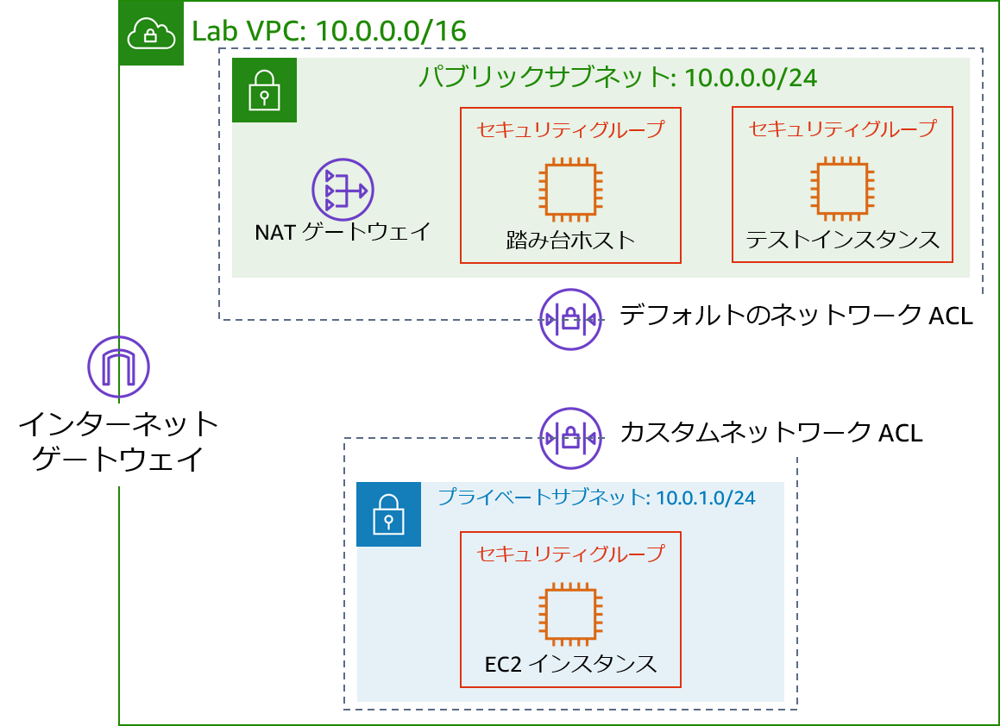
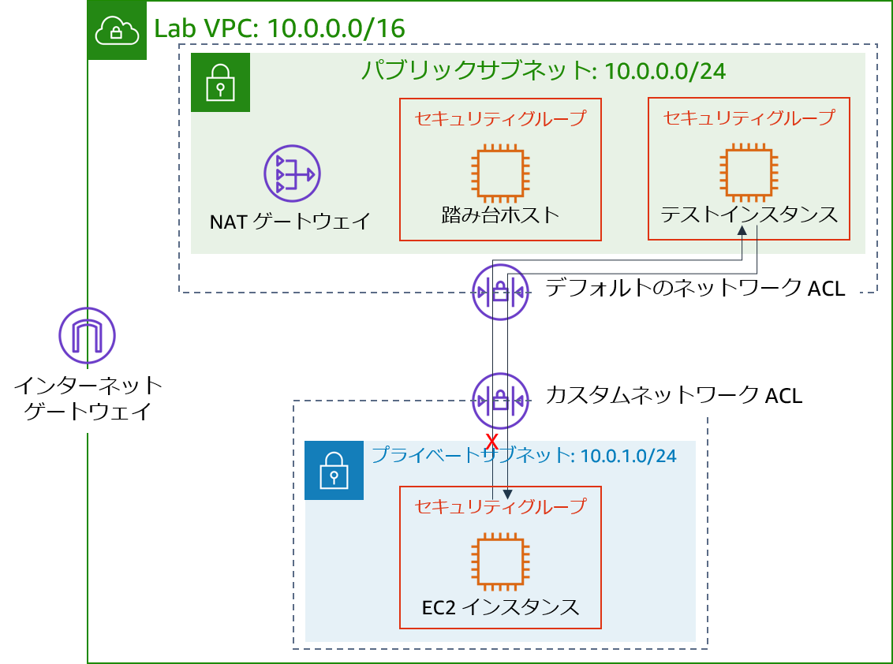

# モジュール 6 - 課題ラボ: カフェの VPC ネットワーク環境を作成する

## シナリオ

Sofía と Nikhil は、カフェのデータを移行した経験から、2 層アーキテクチャを構築する能力に自信を持っています。2 人は、Amazon Elastic Compute Cloud (Amazon EC2) インスタンスの MariaDB データベースから、Amazon Relational Database Service (Amazon RDS) データベースインスタンスへの移行を成功させました。さらに、データベースリソースをパブリックサブネットからプライベートサブネットに移行させました。


カフェの常連で、AWS システムの管理者およびエンジニアでもある Mateo がカフェを訪れたとき、Sofía と Nikhil はデータベースの移行について相談しました。Mateo は、カフェのアプリケーションサーバーを、データベースインスタンスとは別のプライベートサブネットで実行することで、セキュリティを強化できることを教えてくれました。その場合、踏み台ホスト（またはジャンプホスト）を経由して、アプリケーションサーバーへの管理者アクセスを可能にする必要があります。また、アプリケーションサーバーは、必要なパッチをダウンロードできる必要があります。

[クラウドを使えば無理なく試行を行える](https://aws.amazon.com/blogs/enterprise-strategy/create-a-culture-of-experimentation-enabled-by-the-cloud/)ため、Sofía と Nikhil は、本番環境ではない VPC 環境のセットアップを望んでいます。VPC 環境を使って新しいアーキテクチャを実装することで、カフェの本番環境を不用意に中断することなく、さまざまなセキュリティレイヤーをテストできます。

<br/>

## ラボの概要と目標

このラボでは、Amazon Virtual Private Cloud (Amazon VPC) を使用して AWS 上にネットワーク環境を構築し、セキュリティレイヤーを実装してリソースを保護します。

このラボを完了すると、次のことができるようになります。

- プライベートリソースに安全に接続できる Virtual Private Cloud (VPC) 環境を構築する
- プライベートリソースをインターネットに接続できるようにする
- VPC 内にセキュリティの追加レイヤーを作成して、プライベートリソースとのトラフィックを制御する

ラボを開始すると、AWS アカウント内に利用者用の VPC のみが作成されます。

ラボの終了時のアーキテクチャは次の例のようになります。



（図では、通信の矢印を省略して簡素化しています）

**注意**: この課題ラボでは、ほとんどのタスクにステップバイステップの手順は示されていません。タスクを完了させる方法を自分で考えてください。

<br/>

## 所要時間

このラボは、修了までに約 **90 分**かかります。

<br/>

## AWS サービスの制限事項

このラボ環境では、AWS のサービスとサービスアクションへのアクセスが、ラボの手順を完了するために必要なものに制限されています。他のサービスへのアクセスや、このラボで説明されているサービス以外のアクションを実行しようとすると、エラーが発生することがあります。

<br/>

## AWS マネジメントコンソールにアクセスする

1. この手順の上部にある <span id="ssb_voc_grey">Start Lab</span> をクリックし、ラボを起動します。

   [**Start Lab**] パネルが開き、ラボのステータスが表示されます。

   <i class="fas fa-info-circle"></i> **ヒント**: ラボの完了までにさらに時間が必要な場合は、<span id="ssb_voc_grey">Start Lab</span> ボタンをもう一度選択して、この環境のタイマーを再開します。

2. \[**Start Lab**] パネルに **Lab status: ready** というメッセージが表示されたら [**X**] をクリックしてパネルを閉じます。

3. この手順の上部にある <span id="ssb_voc_grey">AWS</span> をクリックします。

   このアクションにより、新しいブラウザタブで AWS マネジメントコンソールが開き、ユーザーは自動的にログインします。

   <i class="fas fa-exclamation-triangle"></i> **ヒント**: 新しいブラウザタブが開かない場合、通常、ブラウザによってサイトのポップアップウィンドウの表示がブロックされたというメッセージが表示されたバナーまたはアイコンがブラウザの上部に表示されます。バナーまたはアイコンを選択して [**ポップアップを許可**] を選択してください。

4. **AWS マネジメントコンソール**タブがこの手順と並べて表示されるようにします。両方のブラウザタブを同時に開いておくと、ラボのステップを実行しやすくなります。

   <i class="fas fa-exclamation-triangle"></i> **特に指示がない限り、リージョンを変更しないでください**。

<br/>

## カフェのビジネス要件: カフェのスタッフが、ウェブアプリケーションサーバーをリモートで安全に管理できる VPC ネットワークを構築する (課題 1)


この課題では、カフェのシステム管理者の役割を担います。VPC ネットワークを作成および設定して、パブリックサブネットの踏み台ホストからプライベートサブネットの EC2 インスタンスに安全に接続できるようにします。また、NAT ゲートウェイを作成して、プライベートサブネットの EC2 インスタンスがインターネットにアクセスできるようにします。

<br/>

### タスク 1: パブリックサブネットを作成する

このラボの最初のタスクは、**Lab VPC** にパブリックサブネットを作成することです。パブリックサブネットを作成したら、サブネットからインターネットへの通信を可能にするインターネットゲートウェイを作成します。サブネットに接続されているルートテーブルを更新して、インターネットに接続されたネットワークトラフィックをインターネットゲートウェイを経由してルーティングします。

5. **Amazon VPC コンソール**を開きます。

6. `Lab VPC` という名前の利用者用の VPC が作成されたことに注意してください。

7. 次の条件を満たすパブリックサブネットを作成します。
   - **名前タグ**: `Public Subnet`
   - **VPC**: **Lab VPC**
   - **アベイラビリティーゾーン**: 該当するリージョンのアベイラビリティーゾーン **a** をクリックします（例: 該当するリージョンが **us-east-1** の場合、**us-east-1a** を選択）
   - **IPv4 CIDR ブロック**: `10.0.0.0/24`

8. 新しいインターネットゲートウェイを作成して `Lab VPC` にアタッチします。

9. VPC で作成されたルートテーブルを編集します。ルート `0.0.0.0/0` を追加します。ターゲットには、前のステップで作成したインターネットゲートウェイをクリックします

   **ヒント**: このタスクを正常に完了するには、いくつかのリソースを作成する必要があります。不明な点は、[AWS のドキュメント](https://docs.aws.amazon.com/vpc/latest/userguide/VPC_Internet_Gateway.html)を参照してください。

<br/>

### タスク 2: 踏み台ホストを作成する

このタスクでは、**Public Subnet** に踏み台ホストを作成します。後のタスクでは、プライベートサブネットに EC2 インスタンスを作成し、この踏み台ホストから接続します。

10. **Amazon EC2 コンソール**から、次の基準を満たす **Lab VPC** の`Public Subnet`に EC2 インスタンスを作成します。
    - **Amazon マシンイメージ (AMI)**: **Amazon Linux 2 AMI (HVM)**
    - **インスタンスタイプ**: **t2.micro**
    - **自動割り当てパブリック IP**: この設定は無効にする必要があります
    - **名前**: `Bastion Host`
    - `Bastion Host SG` という名前のセキュリティグループで、次のトラフィックのみを許可します。
       - **タイプ**: **SSH**
       - **ポート:** `22`
       - **ソース**: マイ IP
    - **vockey** キーペアを使用します


<br/>

> **注意:** 実際には、踏み台ホストを強化するためには IP アドレスからの Secure Shell (SSH) トラフィックを制限するだけではなく、他の作業も必要です。通常、踏み台ホストは他のネットワークから遮断されたネットワークに置かれます。多くの場合、多要素認証 (MFA) で保護され、監査ツールで監視されます。ほとんどの企業では、踏み台ホストへの監査可能なアクセス証跡が必要です。

<br/>

### タスク3: 踏み台ホストに Elastic IP アドレスを割り当てる

このタスクでは、踏み台ホストに Elastic IP アドレスを割り当てます。

作成した踏み台ホストは、インターネットからはアクセスできません。プライベート IPv4 アドレスに関連付けられたパブリック IPv4 アドレスまたは Elastic IP アドレスが、作成した踏み台ホストにはありません。Elastic IP アドレスは踏み台インスタンスに関連付けられており、オンプレミスのファイアウォールから許可されています。インスタンスが終了して新しいインスタンスが起動されると、既存の Elastic IP アドレスは新しいインスタンスに再び関連付けられます。この動作では、信頼された同じ Elastic IP アドレスが常に使用されます。

11. ElasticのIP アドレスを割り当て、踏み台ホストと関連付けることで、IPv4 経由でインターネットにアクセスできるようになります。

<br/>

### タスク 4: 踏み台ホストへの接続をテストする

このタスクでは、SSH キー（.pem ファイルまたは .ppk ファイル）を使って踏み台ホストへの SSH 接続をテストします。このキーは利用者用に作成されました。

12. 手順の右上のエリアで、[**Details**] をクリックします。

13. **AWS** の横にある [**Show**] をクリックします。

14. SSH キーをダウンロードします。ファイルの名前は **labuser.\*** になります。
    - **Microsoft Windows PuTTY のユーザー**: *PPK をダウンロード*
    - **macOS または Linux のユーザー**: *PEM をダウンロード*

15. ウィンドウを閉じるには、[**X**] をクリックします。

16. SSH を使用して踏み台ホストに接続します。

17. 踏み台ホストへの接続をテストしたら、ターミナルまたは PuTTY を閉じることができます。

    **ヒント**: 不明な点は、[AWS ドキュメント](https://docs.aws.amazon.com/quickstarts/latest/vmlaunch/step-2-connect-to-instance.html)を参照してください。このページでは、SSH を使用して EC2 インスタンスに接続する方法が詳しく説明されています。

<br/>

> **Microsoft Windows ユーザーへの注意事項**: PuTTY がインストールされていない場合は、[PuTTY をダウンロードおよびインストール](https://the.earth.li/~sgtatham/putty/latest/w64/putty.exe)する必要があります。接続が失効しないように PuTTY を設定することをお勧めします。PuTTY セッションを長く開いたままにするには、[**Seconds between keepalives**] を `30` に設定してください。

<br/>

### タスク 5: プライベートサブネットを作成する

このタスクでは、**Lab VPC** にプライベートサブネットを作成します。

18. コンソールで、以下の条件を満たすプライベートサブネットを作成します。
    - **名前タグ**: `Private Subnet`
    - **アベイラビリティーゾーン**: **Public Subnet** と同じ
    - **IPv4 CIDR ブロック**: `10.0.1.0/24`

<br/>

### タスク 6: NAT ゲートウェイを作成する

このタスクでは、**Private Subnet** のリソースがインターネットに接続できるようにするための NAT ゲートウェイを作成します。


19. 次の条件を満たす NAT ゲートウェイを作成します。

    - **名前**: `Lab NAT Gateway`
    - **サブネット**: **Public Subnet**

    **ヒント**: NAT ゲートウェイには Elastic IP アドレスが必要です。

20. 次の条件を満たす新しいルートテーブルを作成します。
    - **名前タグ**: `Private Subnet Route Table`
    - **送信先**: `0.0.0.0/0`
    - **ターゲット**: **NAT ゲートウェイ**
21. このルートテーブルを、先ほど作成した **Private Subnet** に関連付けます。

    **ヒント**: 不明な点は、[AWS ドキュメント](https://docs.aws.amazon.com/vpc/latest/userguide/vpc-nat-gateway.html#nat-gateway-creating) を参照してください。

<br/>

### タスク 7: プライベートサブネットに EC2 インスタンスを作成する

このタスクでは、**Private Subnet** に EC2 インスタンスを作成し、踏み台ホストからの SSH トラフィックを許可するように設定します。また、このインスタンスにアクセスするための新しいキーペアを作成します。

22. `vockey2` という名前の新しいキーペアを作成し、適切な .ppk (Microsoft Windows) または .pem (macOS または Linux) をダウンロードします。

23. 次の基準を満たす **Lab VPC** の **Private Subnet** に EC2 インスタンスを作成します。
    - **AMI**: **Amazon Linux 2 AMI (HVM)**
    - **インスタンスタイプ**: **t2.micro**
    - **名前**: `Private Instance`
    - 次のトラフィックのみを許可します。
       - **タイプ**: **SSH**
       - **ポート:** `22`
       - **ソース **: 踏み台ホストセキュリティグループ（**ヒント**: [AWS ドキュメントを参照 ](https://docs.aws.amazon.com/AWSEC2/latest/UserGuide/ec2-security-groups.html)）
    - 先ほど作成した **vockey2** キーペアを使用します


<br/>

### タスク 8: SSH パススルー向けの SSH クライアントを設定する

作成した専用インスタンスは踏み台ホストとは異なるキーペアを使用するため、SSH パススルーを使用するように SSH クライアントを設定する必要があります。このアクションにより、コンピュータに保存されているキーペアを使って専用インスタンスにアクセスできるため、そのキーペアを踏み台ホストにアップロードする必要はありません。これはよいセキュリティプラクティスです。

クライアントをセットアップするには、「Microsoft Windows」、または「macOS または Linux」のいずれかの手順に従います。


#### Microsoft Windows ユーザーの場合

Windows ユーザーは、次の手順を完了してください。

24. PuTTY の[ダウンロードページ](http://www.chiark.greenend.org.uk/~sgtatham/putty/download.html)から、**Pageant** をダウンロードしてインストールします。

25. インストールした Pageant を開きます。Pageant は Windows サービスとして実行されます。

26. Pageant に PuTTY 形式のキーをインポートするには、次の手順を実行します。
    - Windows のシステムトレイで、[**Pageant**] アイコンをダブルクリックします。
    - [**キーの追加**] をクリックします。
    - **vockey2** キーペアの作成時にダウンロードした.ppk ファイルをクリックします。

    画面は、次の例のようになります。

    

27. 先ほどダウンロードした最初の **vockey** を追加します。ファイル名は **labuser.\*** です。

    これで、2 つのキーがリストされているはずです。Pageant ウィンドウを閉じることができます。

28. PuTTY の [**Connection**] > [**SSH**] > [**Auth**] の順に選択し、[**Allow agent forwarding**] チェックボックスをオンにして、[**Private key file for authentication**] ボックスを空のままにします。このステップが完了したら、タスク 9、ステップ 32 に進みます。通常どおりに PuTTY を使用して踏み台ホストに接続しますが、.ppk ファイルは開かないでください。


#### macOS または Linux ユーザーの場合

macOS ユーザーの場合、**ssh-agent** は OS の一部として既にインストールされています。キーを追加するには、次の手順を実行します。

29. `ssh-add` コマンドを使い、`-K` オプションとキーの `.pem` ファイルを使用して、プライベートキーをキーチェーンアプリケーションに追加します。コマンドは次のように表示されるはずです。

    ```bash
        ssh-add -K vockey2.pem
        ```

30. ダウンロードした **vockey.pem** キーと **vockey2.pem** キーの両方を必ず追加してください。

    エージェントにキーを追加することで、インスタンスに接続する際に `-i` オプションを使わずに <keyfile>SSH で接続できるようになります。

31. ssh-agent でキーが使用できることを確認するには、次の例のように `ssh-add` コマンドを `-L` オプションとともに使用します。

    ```bash
        ssh-add –L
        ```
エージェントに、保存されているキーが表示されている必要があります。

キーチェーンにキーを追加したら、`-A` オプションを使用して SSH で踏み台ホストインスタンスに接続できます。このオプションを使用すると、SSH エージェントの転送が可能になります。また、SSH を使用して踏み台ホストから VPC 内のターゲットインスタンスに接続するときに、ローカル SSH エージェントはパブリックキーのチャレンジに応答できます。

例えば、プライベートサブネットのインスタンスに接続するには、次のコマンドを入力します（このコマンドは、踏み台ホストインスタンスを使用して SSH エージェントの転送を有効にします）。

```bash
ssh –A ec2-user@<bastion-IP-address-or-DNS-entry>
```
踏み台ホストインスタンスに接続したら、この例のようなコマンドを入力することで、SSH を使用して特定のインスタンスに接続できます。

```bash
  ssh user@<instance-IP-address-or-DNS-entry>
  ```

> **注意**: ssh-agent は、特定の SSH 接続にどのキーを使うべきかを知りません。したがって、ssh-agent は、エージェントにロードされているすべてのキーを順番に試していきます。インスタンスは 5 回の接続試行に失敗すると接続を終了してしまうので、エージェントのキーが 5 個以下であることを確認してください。各管理者はキーを 1 つしか持たないはずであるため、このことは通常ほとんどのデプロイでは問題になりません。ssh-agent でキーを管理する方法の詳細については、`man ssh-agent` コマンドを使用します。

<br/>

### タスク 9: 踏み台ホストからの SSH 接続をテストする

このタスクでは、**Private Subnet** で実行されている EC2 インスタンスへの踏み台ホストからの SSH 接続をテストします。

32. SSH を使用して、踏み台ホストインスタンスに接続します。

   **ヒント**: SSH パススルーのセクションで説明した接続方法を使用してください。

33. SSH と専用インスタンスの IP アドレスを使用して、専用インスタンスに接続します。

    ```bash
        ssh ec2-user@<private-ip-address-of-instance-in-private-subnet>
        ```

34. **Private Subnet** の EC2 インスタンスに接続されたので、インターネットへの接続をテストします。

    ```bash
          ping 8.8.8.8
          ```

    **ヒント**: **Ctrl + C** キーを押してコマンドを終了します
   <br/>

これで、次の図のように、**Public Subnet** の**踏み台ホスト**と **Private Subnet** の EC2 インスタンス間の通信が確立されました。
<br/>


<br/>

<br/>

**アーキテクチャのベストプラクティス**

この最初の課題では、**ユーザーが離れた場所でアクションを実行できるようにする**アーキテクチャのベストプラクティスを実装しました。

<details>
	<summary>詳細については、<b>こちら</b> を展開してください。</summary>
	<a href="https://docs.aws.amazon.com/wellarchitected/latest/framework/welcome.html">Well-Architected フレームワーク</a>によると、コンピューティングリソースは、外部および内部の脅威から保護するために、複数の防御レイヤーを必要とします。実際には、ヒューマンエラーのリスクや手動による設定や管理の可能性を減らすために、インタラクティブなアクセスの機能を排除する必要があります。Well-Architected フレームワークでは、変更管理ワークフローを使い、インフラストラクチャをコードとして使用して EC2 インスタンスをデプロイすることを推奨しています。そして、直接アクセスや踏み台ホストを許可するのではなく、Amazon EC2 Systems Manager などのツールを使って EC2 インスタンスを管理してください。踏み台ホストを Amazon EC2 Systems Manager に置き換える方法については、こちらの <a href="https://aws.amazon.com/blogs/mt/replacing-a-bastion-host-with-amazon-ec2-systems-manager" />AWS セキュリティブログの記事</a> を参照してください。
</details>

<br/>

## 新しいビジネス要件: プライベートリソースのセキュリティレイヤーを強化する（課題 2）

Sofía と Nikhil は、カフェのアプリケーションアーキテクチャに加えた変更に自信を持っています。2 人は追加のセキュリティを構築したことに満足しており、本番環境に更新をデプロイする前に使用できるテスト環境があることも申し分ないと考えています。2 人から新しいアプリケーションアーキテクチャについて聞いた Mateo は感銘を受けました。アプリケーションのセキュリティをさらに向上させるために、カスタムネットワークアクセスコントロールリスト（ネットワーク ACL）を使用して、セキュリティの追加レイヤーを構築するように Mateo は 2 人に助言しました。

この課題では、カフェのシステム管理者の役割を継続します。プライベートサブネットの EC2 インスタンスへの踏み台ホストからの安全なアクセスを確立したので、プライベートサブネットのセキュリティレイヤーを強化する必要があります。このタスクを達成するために、カスタムネットワーク ACL を作成して設定します。

<br/>

### タスク 10: ネットワーク ACL を作成する

このタスクでは、**Private Subnet** との間のトラフィックを制御するためのカスタムネットワーク ACL を作成します。

ネットワーク ACL を使用して、サブネット間のトラフィックを制御できます。ネットワーク ACL を使用して、セキュリティグループのルールと似たルールを実装することはよい対処法です。ネットワーク ACL は、保護の追加レイヤーを提供します。

この課題では、**Public Subnet** に EC2 インスタンスを作成します。ローカルネットワークからの Internet Control Message Protocol (ICMP) トラフィックを許可するセキュリティグループを作成します。次に、**Private Subnet** とこのテストインスタンス間の ICMP トラフィックを拒否するカスタムネットワーク ACL を作成および設定します。ICMP は **ping** ユーティリティで使用されます。


35. **Amazon VPC コンソール**に移動し、**Lab VPC** のデフォルトのネットワーク ACL を調べます。

    **注意 1**: 作成したサブネットは、デフォルトのネットワーク ACL に自動的に関連付けられます。  
    **注意 2**: デフォルトのネットワーク ACL のインバウンドおよびアウトバウンドルールでは、**すべてのトラフィックを許可します**。


36. **Lab VPC** に `Lab Network ACL` というカスタムネットワーク ACL を作成します。

    **注意**: カスタムネットワーク ACL のデフォルトのインバウンドおよびアウトバウンドルールでは、すべてのトラフィックを**拒否**します。


37. カスタムネットワーク ACL を設定して、**Private Subnet**に出入りするすべてのトラフィックを許可します。

    **ヒント**: 不明な点は、[AWS ドキュメント](https://docs.aws.amazon.com/vpc/latest/userguide/vpc-network-acls.html#CreateACL)を参照してください。

<br/>

### タスク 11: カスタムネットワーク ACL をテストする

38. **Lab VPC** の **Public Subnet** に EC2 インスタンスを作成します。次の基準を満たしてください。
    - AMI: **Amazon Linux 2 AMI (HVM)**
    - インスタンスタイプ: **t2.micro**
    - 名前: `Test Instance`
    - セキュリティグループを介したインスタンスへの**すべての ICMP - IPv4** インバウンドトラフィックを許可


39. **Test Instance** のプライベート IP アドレスに注意してください。

40. **Private Instance** から **Test Instance** のプライベート IP アドレスに到達できることをテストします。**Private Instance** のターミナルウィンドウで、次の ping コマンドを実行します。

    ```bash
        ping <private-ip-address-of-test-instance>
        ```

41. **ping** ユーティリティを実行したままにしておきます。

42. カスタムネットワーク ACL を変更して、`<private-ip-address-of-test-instance>/32` への**すべての ICMP - IPv4 トラフィックを拒否**します

    - プライベート IP アドレスの末尾には必ず `/32` を追加してください。

    - このルールが必ず**最初**に評価されるようにしてください。

43. **Private Instance** のターミナルウィンドウで、ping コマンドが応答を停止します。**Test Instance** へのトラフィックがブロックされました。

<br/>

次の図に示すように、**Private Subnet** から **Test Instance** へのトラフィックが拒否されました。

<br/>



<br/>

<br/>

**アーキテクチャのベストプラクティス**

この 2 番目の課題では、**すべてのレイヤーでトラフィックを制御する**アーキテクチャのベストプラクティスを実装することで、ネットワークリソースを保護しました。

<details>
	<summary>詳細については、<b>こちら</b> を展開してください。</summary>
	<a href="https://docs.aws.amazon.com/wellarchitected/latest/framework/welcome.html">Well-Architected フレームワーク</a>によると、インターネットでもプライベートネットワークでも、何らかの形でネットワークに接続するワークロードには、外部および内部のネットワークベースの脅威から保護するための複数の防御レイヤーが必要になります。すべてのレイヤーでトラフィックを制御する場合、インバウンドとアウトバウンドの両方のトラフィックに対して、複数のレイヤーのセキュリティ制御（<i>多層防御</i>アプローチとして知られている）を適用します。例えば、Amazon VPCでは、セキュリティグループ、ネットワーク ACL、サブネットを使用してこれを行います。
</details>

<br/>

## ラボに関する問題に解答する

ラボの最後に、青色の [**Submit**] ボタンをクリックすると、解答が記録されます。

44. このラボの問題にアクセスします。
    - <span id="ssb_voc_grey">Details <i class="fas fa-angle-down"></i></span> ドロップダウンメニューから <span id="ssb_voc_grey">Show</span> を選択します。
    - ページ下部に表示される、[**Access the multiple choice questions**] をクリックします。

45. 読み込んだページで、次の問題に解答します。

    - **問題 1**: パブリックサブネットにおけるインターネットゲートウェイの目的は何ですか?（Question 1: What is the purpose of the internet gateway in the public subnet?）
    - **問題 2**: プライベートサブネットのインスタンスをインターネットに接続して更新をダウンロードできるようにするものは何ですか?（Question 2: What allows the instance in the private subnet to connect to the internet so that it can download updates?）
    - **問題 3**: プライベートサブネットのインスタンスは、インターネットから直接アクセスできますか?（Question 3: Can the instance in the private subnet be accessed directly from the internet?）
    - **問題 4**: 専用インスタンスと踏み台ホストにアクセスするために、2 つの異なるキーペアを使用するのはなぜですか?（Question 4: Why do you use two different key pairs to access the private instance and the bastion host?）
    - **問題 5**: 踏み台ホストは、ping を使用してプライベートサブネットのインスタンスから応答を得ることができますか?（Question 5: Can the bastion host use ping and get a reply from the instance in the private subnet?）
    - **問題 6**: プライベート EC2 インスタンスがテストインスタンスに ping を実行したときに、リターントラフィックを受信できるセキュリティグループのルールはどれですか?（Question 6: Which security group rules allow the private EC2 instance to receive the return traffic when it pings the test instance?）

<br/>

## 作業内容を送信する

46. この手順の上部にある <span id="ssb_blue">Submit</span> をクリックして進捗情報を記録し、プロンプトが表示されたら [**Yes**] をクリックします。

47. 数分経っても結果が表示されない場合は、この手順の上部に戻り、<span id="ssb_voc_grey">Grades</span> をクリックします。

    **ヒント**: 作業内容は何度も送信できます。作業内容を変更したら、再度 [**Submit**] をクリックします。最終送信分がこのラボの作業内容として記録されます。

48. 作業に関する詳細なフィードバックを参照するには、<span id="ssb_voc_grey">Details</span> ドロップダウンメニューから <i class="fas fa-caret-right"></i> [**View Submission Report**] を選択します。

<br/>

## ラボの終了

<i class="fas fa-flag-checkered"></i>お疲れ様でした。以上でラボは終了です。


49. ラボを終了するには、このページの上部にある <span id="ssb_voc_grey">End Lab</span> をクリックし、<span id="ssb_blue">Yes</span> をクリックします。

    パネルに **DELETE has been initiated... You may close this message box now** というメッセージが表示されます。

50. 右上隅の [**X**] をクリックしてパネルを閉じます。


**©2020 Amazon Web Services, Inc. and its affiliates. All rights reserved. このトレーニング内容の全体または一部を複製または再配布することは、Amazon Web Services, Inc. の書面による事前の許可がある場合を除き、禁じられています。商業目的のコピー、貸与、または販売を禁止します。**
