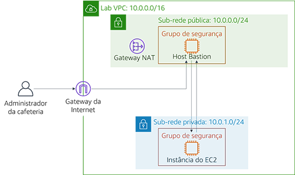

# Começar Módulo 6 – Laboratório de desafio: Criação de um ambiente de rede da VPC para a cafeteria

## Cenário

Sofía e Nikhil estão agora confiantes em sua capacidade de criar uma arquitetura de dois níveis por causa de sua experiência em migrar os dados da cafeteria. Eles foram movidos com êxito de um banco de dados MariaDB em uma instância do Amazon Elastic Compute Cloud (Amazon EC2) para uma instância de banco de dados do Amazon Relational Database Service (Amazon RDS). Além disso, eles também moveram seus recursos de banco de dados de uma sub-rede pública para uma sub-rede privada.


Quando o Mateo, um cliente regular da cafeteria e um administrador e engenheiro de sistemas da AWS, visita a cafeteria, Sofía e Nikhil falam sobre a migração do banco de dados. Mateo diz que eles podem melhorar a segurança executando o servidor de aplicações do café em outra sub-rede privada separada da instância do banco de dados. Eles poderiam, então, passar por um host bastion (ou caixa de salto) para obter acesso administrativo ao servidor de aplicações. O servidor de aplicações também deve ser capaz de baixar os patches necessários.

Sabendo que [a nuvem facilita a experimentação](https://aws.amazon.com/blogs/enterprise-strategy/create-a-culture-of-experimentation-enabled-by-the-cloud/), Sofía e Nikhil estão ansiosos para configurar um ambiente VPC que não seja de produção. Eles podem usá-lo implementar a nova arquitetura e testar diferentes camadas de segurança, sem interromper acidentalmente o ambiente de produção da cafeteria.

<br/>
## Visão geral e objetivos do laboratório

Neste laboratório, você usa o Amazon Virtual Private Cloud (Amazon VPC) para criar um ambiente de rede na AWS e implementar camadas de segurança para proteger seus recursos.

Depois de concluir este laboratório, você deverá ser capaz de:

- Crie um ambiente de virtual private cloud (VPC) que permita que você se conecte com segurança a recursos privados
- Permita que seus recursos privados se conectem à Internet
- Crie uma camada adicional de segurança em sua VPC para controlar o tráfego de e para recursos privados

Quando você iniciar o laboratório, você só terá uma VPC criada para você na conta da AWS.

No fim deste laboratório, sua arquitetura será parecida com o seguinte exemplo:


(No diagrama, as setas de comunicação foram omitidas por simplicidade.)

**Nota**: neste laboratório de desafio, instruções passo a passo não são fornecidas para a maioria das tarefas. Você deve descobrir como completar as tarefas por conta própria.

<br/>
## Duração

Este laboratório levará aproximadamente **90 minutos** para ser concluído.

<br/>
## Restrições de serviço da AWS

Neste ambiente de laboratório, o acesso aos serviços e ações de serviço da AWS pode estar restrito àqueles necessários para concluir as instruções do laboratório. Você poderá encontrar erros se tentar acessar outros serviços ou executar ações além do que está descrito neste laboratório.

<br/>

## Acessar o Console de gerenciamento da AWS

1. Na parte superior destas instruções, escolha <span id="ssb_voc_grey">Start Lab</span> (Iniciar laboratório) para iniciar o laboratório.

   Um painel **Start Lab** (Iniciar laboratório) é aberto com o status do laboratório.

   **Dica**:se você precisar de mais tempo para concluir o laboratório, escolha novamente o botão Start Lab (Iniciar laboratório) para reiniciar o cronômetro do ambiente.

2. Aguarde até que a mensagem *Lab status: ready (Status do laboratório: pronto)* seja exibida e feche o painel **Start Lab** (Iniciar laboratório) escolhendo **X**.

3. Na parte superior destas instruções, escolha <span id="ssb_voc_grey">AWS</span>

   O Console de Gerenciamento da AWS será aberto em uma nova guia do navegador. O sistema fará o seu login automaticamente.

   **Dica**: se uma nova guia do navegador não for aberta, normalmente você verá uma faixa ou um ícone na parte superior do navegador com uma mensagem informando que o navegador está impedindo que o site abra janelas pop-up. Escolha a faixa ou o ícone e escolha **Allow pop ups** (Permitir pop-ups).

4. Organize a guia do Console de Gerenciamento da AWS para que ela seja exibida com essas instruções. O ideal é ver as duas guias do navegador ao mesmo tempo, para facilitar o acompanhamento das etapas do laboratório.

<br/>
## Uma solicitação de negócios para a cafeteria: criar uma rede VPC que permita que a equipe da cafeteria administre remotamente e de forma segura o servidor de aplicações Web (Desafio nº 1)


Neste desafio, você assumirá o papel de um dos administradores do sistema da cafeteria. Você criará e configurará uma rede VPC para que você possa se conectar com segurança de um host bastion em uma sub-rede pública a uma instância do EC2 em uma sub-rede privada. Você também criará um gateway NAT para permitir que a instância do EC2 em sua sub-rede privada acesse a Internet.

<br/>
### Tarefa 1: criar uma sub-rede pública

Sua primeira tarefa neste laboratório é criar uma sub-rede pública no *Lab VPC*. Depois de criar uma sub-rede pública, você criará um gateway da Internet para permitir a comunicação da sub-rede para a Internet. Você atualizará a tabela de roteamento associada à sub-rede para rotear o tráfego de rede vinculado à Internet por meio do gateway de Internet.

5. Abra o **console da Amazon VPC**.

6. Observe que uma VPC chamada `Lab VPC` foi criada para você.

7. Crie uma sub-rede pública que atenda aos seguintes critérios:
   - **Name tag** (Tag de nome): `Public Subnet (Sub-rede pública)`
   - **VPC**: *Lab VPC*
   - **Zona de disponibilidade**: escolha Zona **de** disponibilidade a da sua Região (por exemplo, se sua Região for *us-east-1*e selecione **us-east-1a**)
   - **IPv4 CIDR block** (Bloco CIDR IPv4): `10.0.0.0/24`

8. Crie um novo gateway da Internet e anexe-o ao `Lab VPC`.

9. Edite a tabela de rotas que foi criada em sua VPC. Adicione a rota `0.0.0.0/0`. Para o destino, selecione o gateway da Internet que você criou na etapa anterior

   **Dica**: para concluir esta tarefa com êxito, você deve criar alguns recursos. Se você ficar preso, consulte a [Documentação da AWS](https://docs.aws.amazon.com/vpc/latest/userguide/VPC_Internet_Gateway.html).

<br/>
### Tarefa 2: criar um host bastion

Nesta tarefa, você criará um host bastion na *sub-rede pública*. Em tarefas posteriores, você criará uma instância do EC2 em uma sub-rede privada e se conectará a ela a partir desse host bastion.

10. No **console do Amazon EC2**, crie uma instância do EC2 na `sub-rede pública` da *Lab VPC* que atenda aos seguintes critérios:
    - **Imagem de máquina da Amazon (AMI)**: *AMI do Amazon Linux 2 (HVM)*
    - **Instance Type** (Tipo de instância): *t2.micro*
    - **Atribuir IP público automaticamente**: Esta configuração deve ser desabilitada
    - **Name** (Nome): `Bastion Host`
    - Grupo de segurança chamado `Bastion Host SG` que permite somente o seguinte tráfego:
       - **Type** (Tipo): *SSH*
       - **Port** (Porta): `22`
       - **Source** (Origem): seu endereço IP
    - Usa o par de chaves **vockey**


<br/>

> **Observação:** na prática, fortalecer um host bastion envolve mais trabalho do que restringir somente o tráfego do Secure Shell (SSH) de seu endereço IP de Um ou Mais Servidores Cisco ICM NT. Normalmente, um host bastion é colocado em uma rede fechada de outras redes. Muitas vezes, é protegido com autenticação multifator (MFA) e monitorado com ferramentas de auditoria. A maioria das empresas requer uma trilha de acesso auditável para o host bastião.

<br/>
### Tarefa 3: alocar um endereço IP elástico para o host bastion

Nesta tarefa, você atribuirá um endereço IP elástico ao host bastion.

O host bastion que você acabou de criar não pode ser alcançado a partir da Internet. Ele não tem um endereço IPv4 público ou um endereço IP elástico associado ao seu endereço IPv4 privado. Os endereços IP elásticos são associados a instâncias de bastion e são permitidos a partir de firewalls on-premises. Se uma instância for encerrada e uma nova instância for executada em seu lugar, o endereço IP elástico existente será associado novamente à nova instância. Com esse comportamento, o mesmo endereço IP elástico confiável é usado o tempo todo.

11. Alocar um endereço IP elástico e torná-lo acessível a partir da Internet através do IPv4 associando-o ao seu host bastion.

<br/>
### Tarefa 4: testar a conexão com o host bastion

Nesta tarefa, você usará a chave SSH (arquivo.pem ou arquivo.ppk) para testar a conexão SSH com seu host bastion. Esta chave foi criada para você.

12. Na área superior direita dessas instruções, selecione **Detalhes**.

13. Ao lado **da AWS**, escolha **Mostrar**.

14. Faça download da chave SSH. Observe que o arquivo será nomeado **labuser.\***.
    - **Usuários do Microsoft Windows PuTTY**: *fazer download do PPK*
    - **Usuários do macOS ou Linux**: *fazer download do PEM*

15. Para fechar a janela, escolha **Cancel** (Cancelar).

16. Conecte-se ao seu host bastion usando SSH.

17. Depois de ter testado sua conexão com o host bastion, você pode fechar o terminal ou PuTTY.

    **Dica**: se você ficar em dúvida sobre o que fazer, consulte a [Documentação da AWS](https://docs.aws.amazon.com/quickstarts/latest/vmlaunch/step-2-connect-to-instance.html). Essa página fornece instruções detalhadas sobre como usar o SSH para se conectar a uma instância do EC2.

<br/>

> **Observação para usuários do Microsoft Windows**: Se você não tiver o PuTTY instalado, você deve [baixar e instalar o PuTTY](https://the.earth.li/~sgtatham/putty/latest/w64/putty.exe). Recomendamos que você configure o PuTTY para que sua conexão não expire. Para manter a sessão PuTTY aberta por mais tempo, defina **Segundos entre keepalives** como `30`.

<br/>
### Tarefa 5: criar uma sub-rede privada

Nesta tarefa, você criará uma sub-rede privada no *Lab VPC*.

18. No console, crie uma sub-rede privada que atenda aos seguintes critérios:
    - **Name tag** (Tag de nome): `Private Subnet (Sub-rede privada)`
    - **Availability Zone** (Zona de disponibilidade): o mesmo que a *sub-rede pública*
    - **IPv4 CIDR block** (Bloco CIDR IPv4): `10.0.1.0/24`

<br/>
### Tarefa 6: criar um gateway NAT

Nesta tarefa, você criará um gateway NAT, que permite que os recursos na *sub-rede privada* se conectem à Internet.


19. Crie um gateway NAT que atenda aos seguintes critérios:

    - **Name** (Nome): `Lab NAT Gateway`
    - **Subnet** (Sub-rede): *Public Subnet 2 (Sub-rede pública 2)*

    **Dica**: o gateway NAT precisa de um endereço IP elástico.

20. Crie uma nova tabela de rotas que atenda aos seguintes critérios:
    - **Name tag** (Tag de nome): `Tabela de rota de sub-rede privada`
    - **Destination** (Destino): `0.0.0.0/0`
    - **Target** (Alvo): *NAT Gateway*
21. Anexe esta tabela de rotas à *sub-rede privada*, que você criou anteriormente.

    **Dica**: se você ficar em dúvida sobre o que fazer, consulte a [Documentação da AWS] (https://docs.aws.amazon.com/vpc/latest/userguide/vpc-nat-gateway.html#nat-gateway-creating).

<br/>
### Tarefa 7: criar uma instância do EC2 na sub-rede privada

Nesta tarefa, você criará uma instância do EC2 na *sub-rede privada*e a configurará para permitir o tráfego SSH do host bastion. Você também criará um novo par de chaves para acessar essa instância.

22. Crie um novo par de chaves chamado `vockey2`e faça download do .ppk (Microsoft Windows) ou .pem (macOS ou Linux) apropriado.

23. Crie uma instância do EC2 na *sub-rede privada* da *Lab VPC* que atenda aos seguintes critérios.
    - **AMI**: *Amazon Linux 2 AMI (HVM)*
    - **Instance Type** (Tipo de instância): *t2.micro*
    - **Nome**: `Instância privada`
    - Permite apenas o seguinte tráfego:
       - **Type** (Tipo): *SSH*
       - **Port** (Porta): `22`
       - **Fonte**: Grupo de segurança do host Bastion (**Dica**: consulte a [documentação da AWS](https://docs.aws.amazon.com/AWSEC2/latest/UserGuide/ec2-security-groups.html))
    - Usa o par de chaves **vockey2** que você criou anteriormente


<br/>
### Tarefa 8: configurar o cliente SSH para passagem SSH

Como a instância privada que você acabou de criar usa um par de chaves diferente do host bastion, você deve configurar seu cliente SSH para usar a passagem SSH. Essa ação permite que você use um par de chaves armazenado no computador para acessar a instância privada sem carregar o par de chaves para o host de bastião. Esta é uma boa prática de segurança.

Para configurar seu cliente, siga as etapas do Microsoft Windows ou do macOS ou Linux.


#### Somente usuários do Microsoft Windows

Os usuários do Windows devem concluir as seguintes etapas.

24. Faça download e instale o *Pageant*, que está disponível na [página de download](http://www.chiark.greenend.org.uk/~sgtatham/putty/download.html)PuTTY.

25. Depois de instalar o Pageant, abra-o. O Pageant é executado como um serviço do Windows.

26. Para importar a chave formatada em PuTTY para o Pageant, siga as etapas a seguir.
    - Na bandeja do sistema do Windows, clique duas vezes no ícone **Pageant**. 
    - Escolha **Add key** (Adicionar chave).
    - Selecione o arquivo.ppk que você baixou quando criou o par de chaves *vockey2*.

    Sua tela deve ser semelhante ao exemplo a seguir:

    

27. Adicione o primeiro *vockey* que você baixou anteriormente. O nome do arquivo era **labuser.\ ***.

    Agora você deve ter duas chaves listadas. Você pode fechar a janela do Pageant.

28. Na massa de vidraceiro, em **Conexão > SSH > Auth**, selecione **Permitir encaminhamento de agente** e deixe o **arquivo de chave privada para a caixa de autenticação** vazio. Depois de concluir esta etapa, continue para a Tarefa 9, etapa 32. Prossiga para se conectar ao host bastion usando PuTTY como faria normalmente, mas não abra um arquivo.ppk.


#### Apenas usuários do macOS ou Linux

Para usuários do macOS, o *ssh-agent* já está instalado como parte do sistema operacional. Para adicionar suas chaves, conclua as seguintes etapas.

29. Adicione suas chaves privadas à aplicação keychain usando o comando `ssh-add`, com a opção `-K` e o `arquivo.pem` para a chave. O comando deve ser parecido com o exemplo a seguir.

    ```bash
    ssh-add -K vockey2.pem
    ```

30. Certifique-se de que você adiciona as *chaves vockey.pem* e *vockey2.pem* que você baixou.

    Ao adicionar a chave ao agente, você pode usar SSH para se conectar a uma instância sem usar a opção `–i`<keyfile> ao se conectar.

31. Para verificar se as chaves estão disponíveis para ssh-agent, use o comando `ssh-add` com a opção `-L`, como o exemplo a seguir.

    ```bash
    ssh-add –L
    ```
O agente deve exibir as chaves armazenadas.

Depois que a chave for adicionada ao seu chaveiro, você poderá se conectar à instância do host bastion com SSH usando a opção `–A`. Essa opção habilita o encaminhamento de agente SSH. Ele também permite que o agente SSH local responda a um desafio de chave pública quando você usa o SSH para se conectar do host bastion a uma instância de destino em sua VPC.

Por exemplo, para se conectar a uma instância em uma sub-rede privada, você inseriria o seguinte comando (esse comando habilita o encaminhamento do agente SSH usando a instância do host bastion):

```bash
ssh –A ec2-user@<bastion-IP-address-or-DNS-entry>
```
Depois de se conectar à instância do host bastion, você pode usar o SSH para se conectar a uma instância específica inserindo um comando como este exemplo.

  ```bash
  ssh user@<instance-IP-address-or-DNS-entry>
  ```

> **Observação**: o ssh-agent não sabe qual chave deve usar para uma determinada conexão SSH. Portanto, o ssh-agent tentará sequencialmente todas as chaves carregadas no agente. Como as instâncias encerram a conexão após cinco tentativas de conexão com falha, verifique se o agente tem cinco ou menos chaves. Como cada administrador deve ter apenas uma única chave, isso geralmente não é um problema para a maioria das implantações. Para obter detalhes sobre como gerenciar as chaves no ssh-agent, use o comando `man ssh-agent`.

<br/>
### Tarefa 9: testar a conexão SSH do host bastion

Nesta tarefa, você testará a conexão SSH do host bastion para a instância do EC2 que está sendo *executada na sub-rede privada*.

32. Conecte-se à instância do host bastion usando SSH.

    **Dica**: Use o método de conexão descrito na seção de passagem SSH.

33. Conecte-se à instância privada usando SSH e o endereço IP da instância privada.

    ```bash
    ssh ec2-user@<private-ip-address-of-instance-in-private-subnet>
    ```

34. Agora que você está conectado à instância do EC2 na *sub-rede privada*, teste sua conexão com a Internet.

      ```bash
      ping 8.8.8.8
      ```

    **Dica**: Pressione CTRL+C para sair do comando
<br/>

Agora você estabeleceu uma comunicação entre o *Host Bastion* na *sub-rede pública* e a instância do EC2 na *sub-rede privada*, como no diagrama a seguir:
<br/>



<br/>
<br/>
**Melhores práticas de arquitetura**

Neste primeiro desafio, você implementou a melhor prática arquitetônica de *permitir que as pessoas realizem ações à distância.*

<details>
	<summary>Expanda <b>aqui</b> para saber mais sobre isso.</summary>
	De acordo com o <a href="https://docs.aws.amazon.com/wellarchitected/latest/framework/welcome.html">Well-Architected Framework</a>, os recursos de computação exigem várias camadas de defesa para ajudar a protegê-los de ameaças externas e internas. Na prática, você deve remover a capacidade de acesso interativo para reduzir o risco de erro humano e o potencial de configuração ou gerenciamento manual. O Well-Architected Framework recomenda que você use um fluxo de trabalho de gerenciamento de alterações para implantar instâncias do EC2 usando a infraestrutura como código. Em seguida, você deve usar ferramentas, como o Amazon EC2 Systems Manager, para gerenciar instâncias do EC2 em vez de permitir acesso direto ou um host bastion. Para obter mais informações sobre como substituir um host bastion pelo Amazon EC2 Systems Manager, consulte esta publicação do blog de segurança <a href="https://aws.amazon.com/blogs/mt/replacing-a-bastion-host-with-amazon-ec2-systems-manager" />da AWS</a>
</details>

<br/>
## Novo requisito de negócios: Aprimorando a camada de segurança para recursos privados (Desafio #2)

Sofía e Nikhil estão orgulhosos das mudanças que fizeram na arquitetura de aplicações da cafeteria. Eles ficam satisfeitos com a segurança adicional que construíram e também estão felizes em ter um ambiente de teste que podem usar antes de implantar atualizações na instância de produção. Eles contam ao Mateo sobre sua nova arquitetura de aplicações e ele fica impressionado! Para melhorar ainda mais a segurança de seus aplicações, Mateo aconselha a criar uma camada adicional de segurança usando listas de controle de acesso à rede personalizadas (Network ACLs).

Neste desafio, você continuará a assumir o papel de um dos administradores de sistemas da cafeteria. Agora que você estabeleceu acesso seguro do host bastion para a instância do EC2 na sub-rede privada, você deve aprimorar a camada de segurança da sub-rede privada. Para realizar essa tarefa, você criará e configurará uma Network ACL personalizada.

<br/>
### Tarefa 10: criar uma Network ACL

Nesta tarefa, você criará uma rede personalizada ACL para controlar o tráfego de e para a *sub-rede privada*.

Você pode usar Network ACLs para controlar o tráfego entre sub-redes. É uma boa prática usar Network ACLs para implementar regras semelhantes às regras do grupo de segurança. As Network ACLs fornecem uma camada adicional de proteção.

Para este desafio, você criará uma instância do EC2 na *sub-rede pública*. Você criará um grupo de segurança que permita o tráfego do Internet Control Message Protocol (ICMP) da rede local. Em seguida, criará e configurará sua rede personalizada ACL para negar o tráfego ICMP entre a *sub-rede privada* e esta instância de teste. O ICMP é usado pelo utilitário *ping*.


35. Acesse o **console da Amazon VPC**e inspecione a Network ACL padrão do *Lab VPC*.

    **Nota 1**: As sub-redes que você criou são associadas automaticamente à rede padrão ACL.  
    **Nota 2**: As regras de entrada e de saída da rede padrão ACL *permitem* todo o tráfego.


36. Crie uma Network ACL personalizada chamada `Lab Network ACL` para o *Lab VPC*.

    **Nota**: As regras de entrada e de saída padrão da rede feita sob encomenda ACL *negam* todo o tráfego.


37. Configure sua rede personalizada ACL para *permitir TODO o tráfego que entra e sai da* *sub-rede privada*.

    **Dica**: se você não souber como fazer isso, consulte os exemplos na [Documentação da AWS](https://docs.aws.amazon.com/vpc/latest/userguide/vpc-network-acls.html#CreateACL).

<br/>
### Tarefa 11: testar a Network ACL personalizada

38. Crie uma instância do EC2 na *sub-rede pública* da *Lab VPC*. Ela deve atender aos seguintes critérios.
    - AMI: *Amazon Linux 2 AMI (HVM)*
    - Instance Type (Tipo de instância): *t2.micro*
    - Nome: `Instância de teste`
    - Permite *todo tráfego de entrada ICMP – IPv4* para a instância por meio do grupo de segurança


39. Observe o endereço IP privado da *instância de teste*.

40. Teste que você pode alcançar o endereço IP privado da Instância de *teste a partir da Instância* *Privada*. Na janela de terminal *Instância Privada*, execute o seguinte comando ping:

    ```bash
    ping <private-ip-address-of-test-instance>
    ```

41. Deixe o utilitário *ping* em execução.

42. Modifique sua rede personalizada ACL para *negar todo o tráfego ICMP — IPv4 ao* `/32`<private-ip-address-of-test-instance>

    - Certifique-se de adicionar `/32` ao final do endereço IP privado.

    - Certifique-se de que esta regra seja avaliada ***primeiro***.

43. Na janela do terminal da *instância privada*, o comando ping deve parar de responder. O tráfego para a *instância de teste* foi bloqueado.

<br/>

Agora você negou o tráfego da *sub-rede privada* para a *instância de teste*, conforme mostrado no diagrama a seguir:

<br/>


<br/>
<br/>
**Melhores práticas de arquitetura**

Neste segundo desafio, você protegeu seus recursos de rede implementando a melhor prática arquitetônica de *controlar o tráfego em todas as camadas*.

<details>
	<summary>Expanda <b>aqui</b> para saber mais sobre isso.</summary>
	De acordo com o <a href="https://docs.aws.amazon.com/wellarchitected/latest/framework/welcome.html">Well-Architected Framework</a>, qualquer carga de trabalho que tenha alguma forma de conectividade de rede, seja a Internet ou uma rede privada, requer várias camadas de defesa para ajudar a protegê-lo contra ameaças externas e internas baseadas em rede. Quando você controla o tráfego em todas as camadas, você aplica várias camadas de controles de segurança (conhecidas como uma abordagem de <i>defesa em profundidade</i>) para tráfego de entrada e saída. Por exemplo, você faz isso na Amazon VPC usando grupos de segurança, Network ACLs e sub-redes.
</details>

<br/>
## Responder às perguntas sobre o laboratório

As respostas serão gravadas quando você escolher o botão azul **Submit** (Enviar) acima no fim do laboratório.

44. Acesse as perguntas deste laboratório.
- Escolha o menu <span id="ssb_voc_grey">Details (Detalhes) <i class="fas fa-angle-down"></i></span>
   e escolha <span id="ssb_voc_grey">Show</span> (Mostrar).
- Escolha o link **Access the multiple choice questions** (Acessar as perguntas de múltipla escolha) que aparece na parte inferior da página.

45. Na página que você carregou, responda às seguintes perguntas:

    - **Pergunta 1**: Qual é o propósito do gateway da Internet na sub-rede pública?
    - **Pergunta 2**: O que permite que a instância na sub-rede privada se conecte à Internet para que ela possa baixar atualizações?
    - **Pergunta 3**: A instância na sub-rede privada pode ser acessada diretamente da Internet?
    - **Pergunta 4**: Por que você usa dois pares de chaves diferentes para acessar a instância privada e o host bastion?
    - **Pergunta 5**: O host bastion pode usar ping e obter uma resposta da instância na sub-rede privada?
    - **Pergunta 6**: Quais regras de grupo de segurança permitem que a instância do EC2 privada receba o tráfego de retorno depois de fazer ping da instância de teste?

<br/>

## Enviar o trabalho

46. Na parte superior destas instruções, escolha <span id="ssb_blue">Submit</span> (Enviar) para gravar o progresso e, quando solicitado, escolha **Yes** (Sim).

47. Se os resultados não forem exibidos após alguns minutos, volte ao topo destas instruções e escolha <span id="ssb_voc_grey">Grades</span> (Notas).

    **Dica**: você pode enviar seu trabalho várias vezes. Depois de alterar o trabalho, escolha **Submit** (Enviar) novamente. Seu último envio é o que será gravado para este laboratório.

48. Para ver o feedback detalhado do seu trabalho, escolha <span id="ssb_voc_grey">Details</span> (Detalhes) e depois <i class="fas fa-caret-right"></i> **View Submission Report** (Visualizar relatório de envio).

<br/>
## Laboratório concluído

<i class="fas fa-flag-checkered"></i> Parabéns! Você concluiu o laboratório.


49. Para confirmar que você deseja encerrar o laboratório, escolha **<span id="ssb_voc_grey">End Lab</span>** (Encerrar laboratório) na parte superior desta página e escolha **<span id="ssb_blue">Yes</span>** (Sim).

    Será exibido um painel com a mensagem: *DELETE has been initiated... You may close this message box now. (A EXCLUSÃO foi iniciada... Você pode fechar esta caixa de mensagem agora).*


50. Escolha o **X** no canto superior direito para fechar o painel.


<br/>
*©2020 Amazon Web Services, Inc. e suas afiliadas. Todos os direitos reservados. Este trabalho não pode ser reproduzido ou redistribuído, no todo ou em parte, sem permissão prévia por escrito da Amazon Web Services, Inc. É proibido copiar, emprestar ou vender para fins comerciais.*
