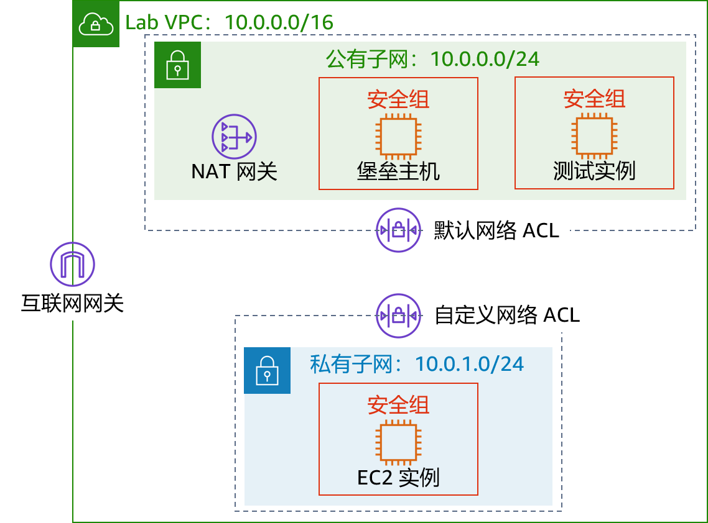
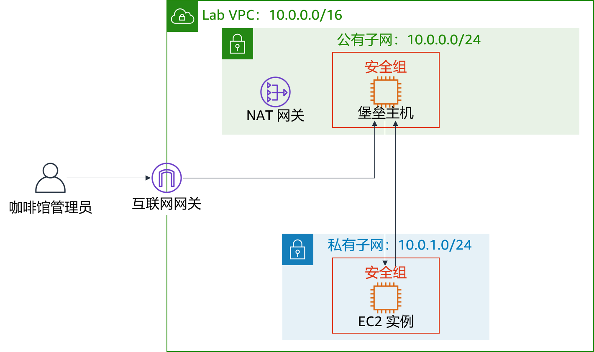

# 模块 6 – 挑战性实验：为咖啡馆创建 VPC 联网环境

## 场景

Sofía 和 Nikhil 现在对自己创建两层架构的能力充满信心，因为他们在迁移咖啡馆数据方面获得的经验。他们成功地从 Amazon Elastic Compute Cloud (Amazon EC2) 实例上的 MariaDB 数据库迁移到 Amazon Relational Database Service (Amazon RDS) 数据库实例。此外，他们还将数据库资源从公有子网移动到私有子网。


Mateo 是咖啡馆的常客，也是 AWS 系统管理员和工程师。当他来到咖啡馆时，Sofía 和 Nikhil 告诉他有关数据库迁移的情况。Mateo 告诉他们，可以通过在与数据库实例独立的另一个私有子网中运行咖啡馆应用程序服务器，以此增强安全性。然后，他们可以通过堡垒主机（或跳板机）来获得对应用程序服务器的管理访问权限。应用程序服务器还必须能够下载所需的补丁。

Sofía 和 Nikhil 知道[云使实验变得更容易](https://aws.amazon.com/blogs/enterprise-strategy/create-a-culture-of-experimentation-enabled-by-the-cloud/)，因此他们渴望建立非生产 VPC 环境。他们可以使用它实施新架构和测试不同的安全层，而不会意外中断咖啡馆的生产环境。

<br/>
## 实验概览和目标

在本实验中，您将使用 Amazon Virtual Private Cloud (Amazon VPC) 在 AWS 上创建网络环境并实施安全层来保护您的资源。

完成本实验后，您应能够：

- 创建 Virtual Private Cloud (VPC) 环境，使您能够安全地连接到私有资源
- 让您的私有资源连接到互联网
- 在您的 VPC 中创建额外的安全层，以控制进出私有资源的流量

开始本实验前，您只能在 AWS 账户中为自己创建 VPC。

在本实验结束时，您的架构应如下例所示：



（在此图中，为简单起见，省略了通信箭头。）

**注意**：在本挑战实验中，大部分任务都没有提供分步说明。您必须自己弄清楚如何完成这些任务。

<br/>
## 持续时间

完成本实验大约需要 **90 分钟**。

<br/>
## AWS 服务限制

在本实验环境中，对 AWS 服务和服务操作的访问可能仅限于完成实验说明所需的服务和服务操作。如果您尝试访问其他服务或执行本实验中所述之外的操作，可能会遇到错误。

<br/>

## 访问 AWS 管理控制台

1. 在这些说明的顶部，选择 <span id="ssb_voc_grey">Start Lab</span>（启动实验）即可启动您的实验。

   **Start Lab**（启动实验）面板随即会打开，其中显示了实验状态。

   **提示**：如果您需要更多时间来完成实验，请再次选择 Start Lab（启动实验）按钮，重新启动环境计时器。

2. 请耐心等待，直到您看到消息 *Lab status: ready*（实验状态：就绪），然后选择 **X** 关闭 **Start Lab**（启动实验）面板。

3. 在这些说明的顶部，选择 <span id="ssb_voc_grey">AWS</span>

   AWS 管理控制台将会在一个新的浏览器选项卡中打开。您将自动登录系统。

   **提示**：如果未打开新的浏览器选项卡，则您的浏览器顶部通常会出现一个横幅或图标，并显示一条消息，指明您的浏览器阻止了该网站打开弹出窗口。请选择横幅或图标，然后选择 **Allow pop ups**（允许弹出窗口）。

4. 排列 AWS 管理控制台选项卡，使其与这些说明一起显示。理想情况下，您将能够同时看到这两个浏览器选项卡，从而更轻松地执行实验步骤。

<br/>
## 咖啡厅的业务请求：创建一个 VPC 网络，让咖啡馆员工能够远程安全地管理 Web 应用程序服务器（挑战 1）


在本挑战中，您将担任该咖啡馆的系统管理员之一。您将创建和配置 VPC 网络，以便从公有子网中的堡垒主机安全地连接到私有子网中的 EC2 实例。您还将创建一个 NAT 网关，使私有子网中的 EC2 实例能够访问互联网。

<br/>
### 任务 1：创建公有子网

本实验中的第一项任务是在 *Lab VPC* 中创建公有子网。创建公有子网后，您将创建互联网网关以允许从子网到互联网的通信。您将更新附加到子网的路由表，以通过互联网网关路由流向互联网的流量。

5. 打开 **Amazon VPC 控制台**。

6. 请注意，已为您创建了一个名为 `Lab VPC` 的 VPC。

7. 创建符合以下条件的公有子网：
   - **Name tag**（名称标签）：`Public Subnet`
   - **VPC**：*Lab VPC*
   - **Availability Zone**（可用区）：选择您所在区域的可用区 **a**（例如，如果您的区域为 *us-east-1*，则选择 **us-east-1a**）
   - **IPv4 CIDR block**（IPv4 CIDR 块）：`10.0.0.0/24`

8. 创建一个新的互联网网关并将其附加到 `Lab VPC`。

9. 编辑在 VPC 中创建的路由表。添加路由 `0.0.0.0/0`。目标请选择您在上一步中创建的互联网网关

   **提示**：要成功完成此任务，必须创建一些资源。如果您遇到困难，请参阅 [AWS 文档](https://docs.aws.amazon.com/vpc/latest/userguide/VPC_Internet_Gateway.html)。

<br/>
### 任务 2：创建堡垒主机

在此任务中，您将在*公有子网*中创建堡垒主机。在以后的任务中，您将在私有子网中创建 EC2 实例，然后从此堡垒主机连接到该实例。

10. 在 **Amazon EC2 控制台**中，在 *Lab VPC* 的`公有子网`中创建一个满足以下条件的 EC2 实例：
    - **Amazon Machine Image** (AMI)（Amazon 系统映像 (AMI)）：*Amazon Linux 2 AMI (HVM)*
    - **Instance type**（实例类型）：*t2.micro*
    - **自动分配公共 IP**：应禁用此设置
    - **Name**（名称）：`Bastion Host`（堡垒主机）
    - 名为 `Bastion Host SG` 的安全组仅允许以下流量：
       - **Type**（类型）：*SSH*
       - **Port**（端口）：`22`
       - **Source**（来源）：您的 IP 地址
    - 使用 **vockey** 密钥对


<br/>

> **注意：**实际上，强化堡垒主机所涉及的工作不仅仅是限制来自 IP 地址的 Secure Shell (SSH) 流量。堡垒主机通常位于与其他网络隔绝的网络中。它通常受到 Multi-Factor Authentication (MFA) 的保护，并使用审计工具进行监控。大多数企业都需要对堡垒主机进行可审核的访问跟踪。

<br/>
### 任务 3：为堡垒主机分配弹性 IP 地址

在此任务中，您将为堡垒主机分配弹性 IP 地址。

您刚创建的堡垒主机无法通过互联网访问。它没有公有 IPv4 地址或与其私有 IPv4 地址关联的弹性 IP 地址。弹性 IP 地址与堡垒实例关联，且被本地防火墙所允许。如果实例被终止并在其位置启动了新实例，则现有弹性 IP 地址将与新实例重新关联。通过这种操作，始终使用相同的受信任的弹性 IP 地址。

11. 分配弹性 IP 地址，通过将弹性 IP 地址与堡垒主机关联，使其可以通过 IPv4 从互联网访问。

<br/>
### 任务 4：测试与堡垒主机的连接

在此任务中，您将使用 SSH 密钥（.pem 文件或 .ppk 文件）来测试与堡垒主机的 SSH 连接。这是为您创建的密钥。

12. 在这些说明的右上角区域，选择 **Details**（详细信息）。

13. 在 **AWS** 旁边，选择 **Show**（显示）。

14. 下载 SSH 密钥。请注意，该文件将被命名为 **labuser.\***。
    - **Microsoft Windows PuTTY 用户**：*下载 PPK*
    - **macOS 或 Linux 用户**：*下载 PEM*

15. 要关闭窗口，请选择 **X**。

16. 使用 SSH 连接到堡垒主机。

17. 您可以在测试了与堡垒主机的连接后，关闭终端或 PuTTY。

    **提示**：如果您遇到困难，请参阅 [AWS 文档](https://docs.aws.amazon.com/quickstarts/latest/vmlaunch/step-2-connect-to-instance.html)。本页提供了有关如何使用 SSH 连接到 EC2 实例的详细说明。

<br/>

> **Microsoft Windows 用户注意事项**：如果您没有安装 PuTTY，则必须[下载并安装 PuTTY](https://the.earth.li/~sgtatham/putty/latest/w64/putty.exe)。我们建议您配置 PuTTY，这样连接不会过期。要使 PuTTY 会话保持更长的打开时间，请将 **Seconds between keepalives**（保持连接之间的秒数）设置为 `30`。

<br/>
### 任务 5：创建私有子网

在此任务中，您将在 *Lab VPC* 中创建私有子网。

18. 在控制台中，创建符合以下条件的私有子网：
    - **Name tag**（名称标签）：`Private Subnet`
    - **Availability Zone**（可用区）：与*公有子网*相同
    - **IPv4 CIDR block**（IPv4 CIDR 块）：`10.0.1.0/24`

<br/>
### 任务 6：创建 NAT 网关

在此任务中，您将创建 NAT 网关，使*私有子网*中的资源能够连接到互联网。


19. 创建符合以下条件的 NAT 网关：

    - **Name**（名称）：`Lab NAT Gateway`（NAT 网关）
    - **Subnet**（子网）：*Public Subnet*（公有子网）

    **提示**：您的 NAT 网关需要弹性 IP 地址。

20. 创建符合以下条件的新路由表：
    - **Name tag**（名称标签）：`Private Subnet Route Table`（私有子网路由表）
    - **Destination**（目标网段）：`0.0.0.0/0`
    - **Target**（目标）：*NAT Gateway*（NAT 网关）
21. 将此路由表附加到您之前创建的*私有子网*。

    **提示**：如果您遇到困难，请参阅 [AWS 文档] (https://docs.aws.amazon.com/vpc/latest/userguide/vpc-nat-gateway.html#nat-gateway-creating)。

<br/>
### 任务 7：在私有子网中创建 EC2 实例

在此任务中，您将在*私有子网*中创建 EC2 实例，然后将其配置为允许来自堡垒主机的 SSH 流量。您还将创建一个新的密钥对来访问此实例。

22. 创建名为 `vockey2` 的新密钥对，然后下载相应的 .ppk (Microsoft Windows) 或 .pem (macOS or Linux)。

23. 在 *Lab VPC* 的*私有子网*中创建符合以下条件的 EC2 实例。
    - **AMI**：*Amazon Linux 2 AMI (HVM)*
    - **Instance type**（实例类型）：*t2.micro*
    - **Name**（名称）：`Private Instance`（私有实例）
    - 只允许以下流量：
       - **Type**（类型）：*SSH*
       - **Port**（端口）：`22`
       - **Source**（来源）：堡垒主机安全组（**提示**：请参阅 [AWS 文档](https://docs.aws.amazon.com/AWSEC2/latest/UserGuide/ec2-security-groups.html)）
    - 使用您之前创建的 **vockey2** 密钥对


<br/>
### 任务 8：为 SSH 传递配置 SSH 客户端

由于您刚创建的私有实例使用的密钥对与堡垒主机不同，因此您必须将 SSH 客户端配置为使用 SSH 传递。此操作允许您使用存储在您的计算机上的密钥对访问私有实例，而无需将密钥对上传到堡垒主机。这是一个很好的安全实践。

要设置客户端，请按照 Microsoft Windows 或 macOS 或 Linux 的步骤操作。


#### 仅限 Microsoft Windows 用户

Windows 用户应完成以下步骤。

24. 下载并安装 *Pageant*，该软件可从 PuTTY [下载页面](http://www.chiark.greenend.org.uk/~sgtatham/putty/download.html)获得。

25. 安装 Pageant 后，请将其打开。Pageant 作为 Windows 服务运行。

26. 要将 PuTTY 格式的密钥导入 Pageant 中，请按照以下步骤操作。
    - 在 Windows 系统托盘中，双击 **Pageant** 图标。
    - 选择 **Add Key**（添加密钥）。
    - 选择您在创建 *vockey2* 密钥对时下载的 .ppk 文件。

    您的屏幕应显示类似于以下示例的内容。

    

27. 添加您之前下载的第一个 *vockey*。文件名是 **labuser.\***。

    您现在应该看到列出了两个密钥。您可以关闭 Pageant 窗口。

28. 在 PuTTY 中，在 **Connection > SSH > Auth**（连接 > SSH > 身份验证）下，选择 **Allow agent forwarding**（允许代理转发），然后将 **Private key file for authentication**（用于身份验证的私有密钥文件）框留空。完成此步骤后，继续执行任务 9 的第 32 步。像平常一样继续使用 PuTTY 连接到堡垒主机，但不要打开 .ppk 文件。


#### 仅限 macOS 或 Linux 用户

对于 macOS 用户，*ssh-agent* 已安装在操作系统中。要添加密钥，请完成以下步骤。

29. 通过使用 `ssh-add` 命令以及 `-K` 选项和该密钥的 `.pem` 文件，将私有密钥添加到密钥链应用程序。该命令应该类似于以下示例。

    ```bash
       ssh-add -K vockey2.pem
       ```

30. 确保您同时添加了下载的 *vockey.pem* 和 *vockey2.pem* 这两个密钥。

    通过向代理添加密钥，您可以在不使用 `–i` 选项连接的情况下 <keyfile> 使用 SSH 连接到实例。

31. 要验证密钥是否可用于 ssh-agent，请使用带 `-L` 选项的 `ssh-add` 命令，如以下示例所示。

    ```bash
       ssh-add –L
       ```
代理应显示其存储的密钥。

将密钥添加到密钥链后，您可以使用 `–A` 选项通过 SSH 连接到堡垒主机实例。此选项启用 SSH 代理转发。当您使用 SSH 从堡垒主机连接到 VPC 中的目标实例时，它还允许本地 SSH 代理响应公有密钥质询。

例如，要连接到私有子网中的实例，您需要输入以下命令（此命令通过使用堡垒主机实例来实现 SSH 代理转发）：

```bash
ssh –A ec2-user@<bastion-IP-address-or-DNS-entry>
```
连接到堡垒主机实例后，您可以通过输入类似本示例的命令来使用 SSH 连接到特定实例。

```bash
  ssh user@<instance-IP-address-or-DNS-entry>
  ```

> **注意**：ssh-agent 不知道应该为给定的 SSH 连接使用哪个密钥，因此，ssh-agent 将按顺序尝试代理中加载的所有密钥。由于实例会在 5 次连接尝试失败后终止连接，因此请确保代理中加载的密钥不超过 5 个。由于每个管理员只应该有一个密钥，因此对于大多数部署来说，这通常不是问题。有关如何在 ssh-agent 中管理密钥的详细信息，请使用 `man ssh-agent` 命令。

<br/>
### 任务 9：测试与堡垒主机的 SSH 连接

在此任务中，测试堡垒主机与*私有子网*中运行的 EC2 实例的 SSH 连接。

32. 使用 SSH 连接到堡垒主机实例。

    **提示**：使用 SSH 传递部分中描述的连接方法。

33. 使用 SSH 和私有实例的 IP 地址连接到私有实例。

    ```bash
       ssh ec2-user@<private-ip-address-of-instance-in-private-subnet>
       ```

34. 既然您已连接到*私有子网*中的 EC2 实例，请测试其与互联网的连接。

    ```bash
         ping 8.8.8.8
         ```

    **提示**：按 CTRL+C 退出命令
   <br/>

您现在已在*公有子网*中的*堡垒主机*与*私有子网*中的 EC2 实例之间建立了通信，如下图所示：
<br/>



<br/>
<br/>
**架构最佳实践**

在第一个挑战中，您实施了*使用户能够远距离执行操作*的架构最佳实践。

<details>
	<summary>展开<b>此处</b>以了解更多信息。</summary>
	根据<a href="https://docs.aws.amazon.com/wellarchitected/latest/framework/welcome.html">架构完善的框架</a>，计算资源需要多层防御，以帮助保护它们免受外部和内部威胁。实际上，您应该删除交互式访问的功能，以降低人为错误的风险和手动配置或管理的可能性。架构完善的框架建议您使用变更管理工作流程，通过使用基础设施即代码来部署 EC2 实例。然后，您应该使用 Amazon EC2 Systems Manager 等工具来管理 EC2 实例，而不是允许直接访问堡垒主机。有关用 Amazon EC2 Systems Manager 替换堡垒主机的更多信息，请参阅此 <a href="https://aws.amazon.com/blogs/mt/replacing-a-bastion-host-with-amazon-ec2-systems-manager" />AWS 安全博客文章</a>。
</details>

<br/>
## 新的业务要求：增强私有资源的安全层（挑战 2）

Sofía 和 Nikhil 为他们对咖啡馆的应用程序架构所做的更改感到自豪。他们对自己构建的额外安全性感到满意，他们也很高兴能够在将更新部署到生产实例之前能够拥有可以使用的测试环境。他们向 Mateo 介绍了他们新的应用程序架构，让他留下了深刻的印象！为了进一步提高应用程序的安全性，Mateo 建议他们使用自定义网络访问控制列表（网络 ACL）来构建额外的安全层。

在这个挑战中，您将继续担任该咖啡馆的系统管理员之一。由于您已建立了从堡垒主机到私有子网中 EC2 实例的安全访问，则必须增强私有子网的安全层。为完成此任务，您需要创建和配置一个自定义网络 ACL。

<br/>
### 任务 10：创建网络 ACL

在此任务中，您将创建自定义网络 ACL 来控制进出*私有子网*的流量。

您可以使用网络 ACL 来控制子网之间的流量。使用网络 ACL 实施与安全组规则类似的规则是一个很好的做法。网络 ACL 提供了额外的保护层。

对于此挑战，您将在*公有子网*中创建 EC2 实例。您将创建一个允许来自本地网络的互联网控制消息协议 (ICMP) 流量的安全组。接下来，您将创建和配置自定义网络 ACL，以拒绝*私有子网*与此测试实例之间的 ICMP 流量。实用程序 *ping* 使用 ICMP。


35. 转到 **Amazon VPC 控制台**，然后检查*Lab VPC* 的默认网络 ACL。

    **注 1**：您创建的子网会自动与默认网络 ACL 关联。  
    **注 2**：默认网络 ACL 的入站和出站规则*允许*所有流量。


36. 为 *Lab VPC* 创建名为 `Lab Network ACL` 的自定义网络 ACL。

    **注意**：自定义网络 ACL 的默认入站和出站规则*拒绝*所有流量。


37. 配置自定义网络 ACL 以*允许进出*私有子网*的所有流量*。

    **提示**：如果您遇到困难，请参阅 [AWS 文档](https://docs.aws.amazon.com/vpc/latest/userguide/vpc-network-acls.html#CreateACL)。

<br/>
### 任务 11：测试自定义网络 ACL

38. 在 *Lab VPC* 的*公有子网*中创建 EC2 实例。它应符合以下条件。
    - AMI：*Amazon Linux 2 AMI (HVM)*
    - Instance type（实例类型）：*t2.micro*
    - Name（名称）：`Test Instance`（测试实例）
    - 允许通过安全组进入实例的*所有 ICMP – IPv4* 流量


39. 记下 *Test Instance* 的私有 IP 地址。

40. 测试您能否从*私有实例*访问 *Test Instance* 的私有 IP 地址。在*私有实例*终端窗口中，运行以下 ping 命令：

    ```bash
       ping <private-ip-address-of-test-instance>
       ```

41. 使实用程序 *ping* 保持运行状态。

42. 修改自定义网络 ACL 以*拒绝*进入 `<private-ip-address-of-test-instance>/32` 的所有 ICMP    – IPv4 流量

       - 务必在私有 IP 地址的末尾添加 `/32`。

       - 请确保***首先***评估此规则。

43. 在*私有实例*终端窗口中，ping 命令应停止响应。进入 *Test Instance* 的流量已被阻止。

<br/>

您现在拒绝了从*私有子网*到 *Test Instance* 的流量，如下图所示：

<br/>


<br/>
<br/>
**架构最佳实践**

在第二个挑战中，您通过实施*在所有层上控制流量*的架构最佳实践，保护您的网络资源。

<details>
	<summary>展开<b>此处</b>以了解更多信息。</summary>
	根据<a href="https://docs.aws.amazon.com/wellarchitected/latest/framework/welcome.html">架构完善的框架</a>，任何通过某种网络（无论是互联网还是私有网络）连接的工作负载都需要多层防御，来帮助保护其免受外部和内部网络威胁。当您在所有层上控制流量时，您可以对入站和出站流量应用多层安全控制（称为<i>深度防御</i>方法）。例如，您可以使用安全组、网络 ACL 和子网在 Amazon VPC 中执行此操作。
</details>

<br/>
## 回答有关实验的问题

完成实验后，选择蓝色的 **Submit**（提交）按钮，将会记录答案。

44. 查看本实验中的问题。
- 选择 <span id="ssb_voc_grey">Details<i class="fas fa-angle-down"></i></span>（详细信息）
   菜单，然后选择 <span id="ssb_voc_grey">Show</span>（显示）。
- 选择页面底部的 **Access the multiple choice questions**（查看多项选择题）链接。

45. 在加载的页面中，回答以下问题：

    - **问题 1**：互联网网关在公有子网中的用途是什么？
    - **问题 2**：是什么允许私有子网中的实例连接到互联网，以便它能下载更新？
    - **问题 3**：私有子网中的实例可以直接通过互联网访问吗？
    - **问题 4**：为什么您使用两个不同的密钥对来访问私有实例和堡垒主机？
    - **问题 5**：堡垒主机能否使用 ping 并从私有子网中的实例获得响应？
    - **问题 6**：哪些安全组规则允许私有 EC2 实例在使用 ping 测试实例时接收返回流量？

<br/>

## 提交作业

46. 在这些说明的顶部，选择 <span id="ssb_blue">Submit</span>（提交）记录您的进度，在出现提示时，选择 **Yes**（是）。

47. 如果在几分钟后仍未显示结果，请返回到这些说明的顶部，并选择 <span id="ssb_voc_grey">Grades</span>（成绩）

    **提示**：您可以多次提交作业。更改作业后，再次选择 **Submit**（提交）即可。您最后一次提交的作业将记录为本实验的成绩。

48. 要查找有关您作业的详细反馈，请选择 <span id="ssb_voc_grey">Details</span>（详细信息），然后选择 <i class="fas fa-caret-right"></i> **View Submission Report**（查看提交报告）。

<br/>
## 实验完成

<i class="fas fa-flag-checkered"></i> 恭喜！您已完成实验。


49. 若要确认您想结束实验，请选择此页面顶部的 <span id="ssb_voc_grey">End Lab</span>（结束实验），然后选择 <span id="ssb_blue">Yes</span>（是）

    此时应显示一个面板，并显示消息：*DELETE has been initiated... You may close this message box now.*（删除操作已启动...您现在可以关闭此消息框。）


50. 选择右上角的 **X** 关闭面板。


<br/>
*©2020 Amazon Web Services, Inc. 及其附属公司。保留所有权利。未经 Amazon Web Services, Inc. 事先书面许可，不得复制或转载本文的部分或全部内容。禁止商业目的复制、出借或出售本文。*
