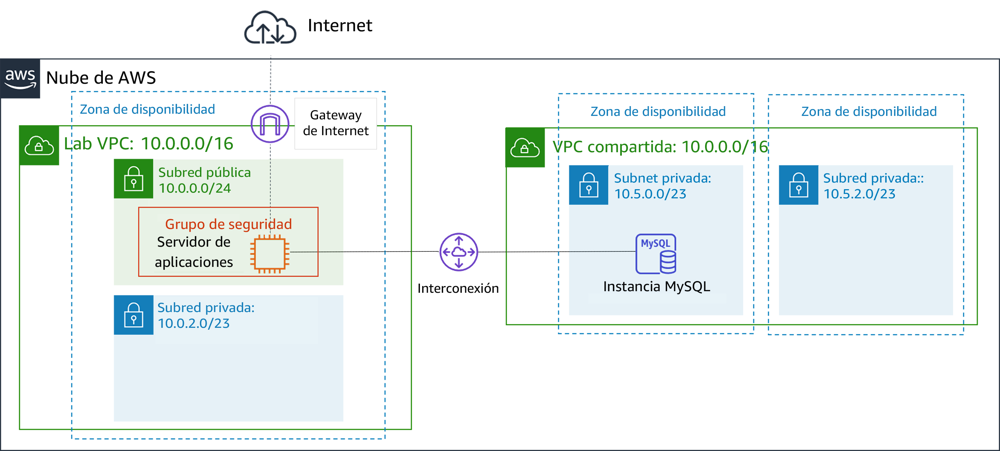
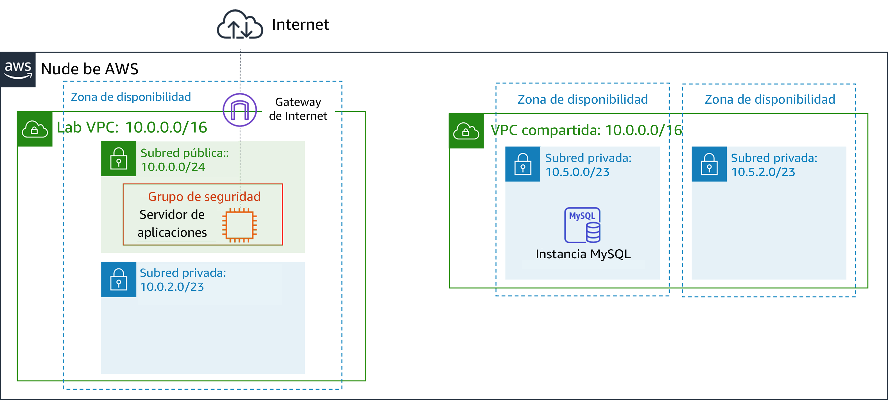
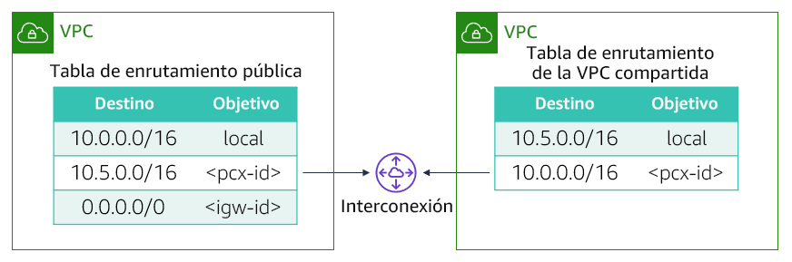

# Laboratorio guiado del módulo 7: Creación de una interconexión de VPC
[//]: # "SKU: ILT-TF-200-ACACAD-2    Source Course: ILT-TF-100-ARCHIT-6 branch dev_65"

## Información general y objetivos del laboratorio

Es posible que desee conectar las nubes virtuales privadas (VPC) cuando deba transferir datos entre ellas. En este laboratorio, se muestra cómo crear una interconexión de VPC privada entre dos VPC.

Después de completar este laboratorio, debería ser capaz de lo siguiente:

- crear una interconexión de VPC
- configurar tablas de enrutamiento de modo que utilicen la interconexión de VPC

Cuando **termine** este laboratorio, la arquitectura se verá como en el siguiente ejemplo:

 
## Duración
Para completar este laboratorio, se necesitan aproximadamente **20 minutos**.

 

## Restricciones de los servicios de AWS

En este entorno de laboratorio, el acceso a los servicios y las acciones de los servicios de AWS puede restringirse a los que se necesiten para cumplir las instrucciones del laboratorio. Es posible que se produzcan errores si intenta acceder a otros servicios o hacer acciones que no sean las que se describen en este laboratorio.

 

## Acceso a la consola de administración de AWS

1. En la parte superior de estas instrucciones, elija Start Lab (Iniciar laboratorio) y comience a trabajar en él.

   Se abrirá el panel **Start Lab** (Iniciar laboratorio), donde se muestra el estado del laboratorio.

   <i class="fas fa-info-circle"></i> **Sugerencia**: Si necesita más tiempo para completar el laboratorio, vuelva a hacer clic en el botón Start Lab (Iniciar laboratorio) para reiniciar el temporizador del entorno.

2. Espere hasta que el panel **Start Lab** (Iniciar laboratorio) muestre el mensaje *Lab Status: ready (Estado del laboratorio: listo)* y, luego, cierre el panel haciendo clic en la **X**.

3. En la parte superior de estas instrucciones, elija AWS.

   Con esta acción, se abrirá la consola de administración de AWS en una nueva pestaña del navegador, y el sistema iniciará su sesión de forma automática.

   <i class="fas fa-exclamation-triangle"></i> **Sugerencia**: Si no se abre una nueva pestaña del navegador, por lo general habrá un aviso o un icono en la parte superior, el cual indicará que el navegador impide que el sitio abra ventanas emergentes. Haga clic en el aviso o el icono y elija **Allow pop ups** (Permitir ventanas emergentes).

4. Ubique la pestaña de la **consola de administración de AWS** de modo que aparezca junto con estas instrucciones. El método más óptimo sería tener ambas pestañas del navegador abiertas al mismo tiempo para que pueda seguir los pasos del laboratorio más fácilmente.

   <i class="fas fa-exclamation-triangle"></i> **No cambie la región a menos que se le indique expresamente que debe hacerlo**.

 

## Tarea 1: Crear una interconexión de VPC

<i class="fas fa-comment"></i>Su tarea consiste en crear una interconexión de VPC entre dos VPC.

Una *interconexión de VPC* es una conexión de red directa entre dos VPC que le permite dirigir el tráfico entre ellas de forma privada. Las instancias de cualquiera de las VPC pueden comunicarse entre sí como si estuvieran en la misma red. Puede crear una interconexión de VPC entre sus propias VPC, con una VPC de otra cuenta de AWS o con una VPC en una región de AWS diferente.

Se proporcionan dos VPC como parte de este laboratorio: *Lab VPC* y *VPC compartida*. La *Lab VPC* tiene una aplicación de inventario que se ejecuta en una instancia Amazon Elastic Compute Cloud (Amazon EC2) en una subred pública. La *VPC compartida* tiene una instancia de base de datos que se ejecuta en una subred privada.

5. En la **consola de administración de AWS**, en el menú Services (Servicios),<i class="fas fa-angle-down"></i> elija **VPC**.

6. En el panel de navegación izquierdo, elija**Peering Connections** (Interconexiones).

7. Elija Create Peering Connection (Crear interconexión) y establezca la siguiente configuración:

   - **Peering connection name tag** (Etiqueta de nombre de interconexión): `Lab-Peer`

   - **VPC (Requester)** (VPC [solicitante]): *Lab VPC*

   - **VPC (Accepter)** (VPC [receptora]): *VPC compartida*

   - Elija Create Peering Connection (Crear interconexión) y, a continuación, OK (Aceptar).

   Cuando se crea una interconexión de VPC, la VPC de destino debe aceptar la solicitud de conexión. La VPC de destino debe aceptar la solicitud porque podría pertenecer a una cuenta diferente. También es posible que el usuario que crea la interconexión no tenga permiso para aceptar la solicitud de conexión para la VPC de destino. Sin embargo, en este laboratorio, usted mismo aceptará la conexión.

8. Seleccione <i class="far fa-check-square"></i> **Lab-Peer**.

9. Elija Actions (Acciones)<i class="fas fa-angle-down"></i> y, luego, seleccione **Accept Request** (Aceptar solicitud), seguido de Yes, Accept (Sí, aceptar) para aceptar la solicitud.

10. En el cuadro emergente, elija Close (Cerrar).

 

## Tarea 2: Configurar tablas de enrutamiento

Ahora, actualizará las tablas de enrutamiento de ambas VPC para enviar tráfico desde la *Lab VPC* hacia la interconexión con la *VPC compartida*.

11. En el panel de navegación izquierdo, elija **Route Tables** (Tablas de enrutamiento).

12. Seleccione <i class="far fa-check-square"></i> **Lab Public Route Table** (Tabla de enrutamiento pública de laboratorio) (para *Lab VPC*).

    Configurará la *tabla de enrutamiento pública* asociada a la *Lab VPC*. Si la dirección IP de destino se encuentra dentro del intervalo de la *VPC compartida*, la *tabla de enrutamiento pública* enviará tráfico a la interconexión.

13. En la pestaña **Routes** (Rutas), elija Edit routes (Editar rutas) y, luego, configure los siguientes ajustes:

    - Elija Add route (Agregar ruta).
    - **Destination** (Destino): `10.5.0.0/16` (El ajuste es el intervalo del bloque de direccionamiento entre dominios sin clases, o CIDR, correspondiente a la *VPC compartida*).
    * **Target** (Objetivo): seleccione **Peering Connection** (Interconexión) y, luego, *Lab-Peer* de la lista.
    - Elija Save routes (Guardar rutas) y, a continuación, Close (Cerrar).

    Ahora, configurará el flujo inverso para el tráfico que llega de la *VPC compartida* y se dirige a la *Lab VPC*.

14. Seleccione <i class="far fa-check-square"></i> **Shared-VPC Route Table** (Tabla de enrutamiento de la VPC compartida). Si hay casillas de verificación de cualquier otra tabla de enrutamiento seleccionadas, anúlelas.

    Esta tabla de enrutamiento es para la *VPC compartida*. Ahora, la configurará de modo que se envíe tráfico a la interconexión si la dirección IP de destino se encuentra dentro del intervalo de la *Lab VPC*.

15. En la pestaña **Routes** (Rutas), elija Edit routes (Editar rutas) y, luego, configure los siguientes ajustes:

    - Elija Add route (Agregar ruta).
    - **Destination** (Destino): `10.0.0.0/16` (Este ajuste es el intervalo del bloque de CIDR correspondiente a la *Lab VPC*).
    * **Target** (Objetivo): seleccione *Peering Connection (Interconexión)* y, luego, *Lab-Peer* de la lista.
    - Elija Save routes (Guardar rutas) y, a continuación, Close (Cerrar).

    Las tablas de enrutamiento ya están configuradas de modo que se envíe tráfico a través de la interconexión cuando el tráfico tenga como destino la otra VPC.

 

## Tarea 3: Probar la interconexión de VPC

Ahora que configuró la interconexión de VPC, la pondrá a prueba. Realizará la prueba mediante la configuración de la aplicación de inventario para acceder a la base de datos a través de la interconexión.

16. En el menú Services<i class="fas fa-angle-down"></i> (Servicios), elija **EC2**.

17. En el panel de navegación izquierdo, elija**Instances** (Instancias).

18. Copie la dirección **IP pública IPv4** que aparece en la pestaña **Description** (Descripción).

19. Abra una nueva pestaña del navegador web con esa dirección IP.

    Debería ver la aplicación de inventario y el siguiente mensaje: *“Please configure settings to connect to database (Configure los ajustes de modo que se conecte a la base de datos)”.*

20. Elija <i class="fas fa-cog" aria-hidden="true"></i> **Settings** (Configuración) y establezca la siguiente configuración:

    - **Endpoint** (Punto de enlace): pegue el punto de enlace de la base de datos. Para encontrarlo, seleccione *Details (Detalles)*. Junto a *AWS*, elija *Show (Mostrar)*. A continuación, copie el *punto de enlace*.
    - **Database** (Base de datos): `inventory (inventario)`
    - **Username** (Nombre de usuario): `admin`
    - **Password** (Contraseña): `lab-password`
    - Elija Save (Guardar).

    La aplicación ahora debería mostrar datos de la base de datos.

    Este paso confirma que se estableció la interconexión de VPC porque la *VPC compartida* no tiene una gateway de Internet. La única forma en que se puede acceder a la base de datos es a través de la interconexión de VPC.

 

## Envío del trabajo

21. En la parte superior de estas instrucciones, elija Submit (Enviar) para registrar su progreso y, cuando se le indique, elija **Yes** (Sí).

22. Si los resultados no se muestran después de algunos minutos, vuelva a la parte superior de estas instrucciones y elija Grades (Resultados).

    **Sugerencia**: Puede enviar su trabajo varias veces. Después de realizar las modificaciones pertinentes, vuelva a elegir **Submit** (Enviar). Su último envío es el que se registrará para este laboratorio.

23. Para encontrar comentarios detallados sobre su trabajo, elija Details (Detalles) seguido de <i class="fas fa-caret-right"></i> **View Submission Report** (Ver informe de envío).

 

## Fin del laboratorio <i class="fas fa-graduation-cap"></i>

<i class="fas fa-flag-checkered"></i> ¡Felicitaciones! Ha completado el laboratorio.

24. Elija End Lab (Finalizar laboratorio) en la parte superior de esta página y, a continuación, seleccione Yes (Sí) para confirmar que desea finalizar el laboratorio.

    Un panel presentará el mensaje *DELETE has been initiated… You may close this message box now (Se ha iniciado la ELIMINACIÓN… Ya puede cerrar este cuadro de mensaje)*.

25. Seleccione la **X** de la esquina superior derecha para cerrar el panel.

*© 2020 Amazon Web Services, Inc. y sus empresas afiliadas. Todos los derechos reservados. Este contenido no puede reproducirse ni redistribuirse, total ni parcialmente, sin el permiso previo por escrito de Amazon Web Services, Inc. Queda prohibida la copia, el préstamo y la venta de carácter comercial.*
