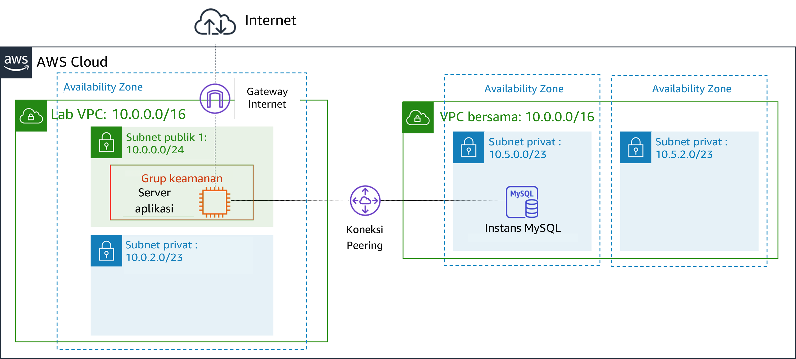
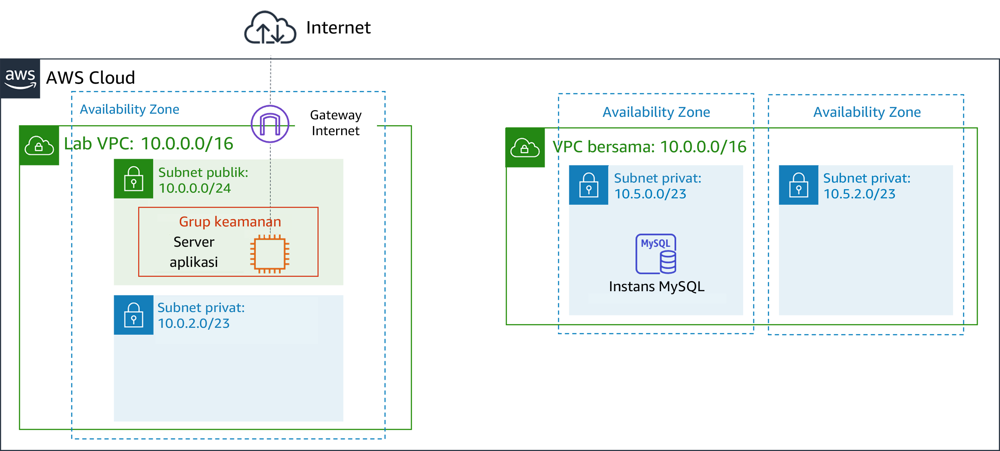
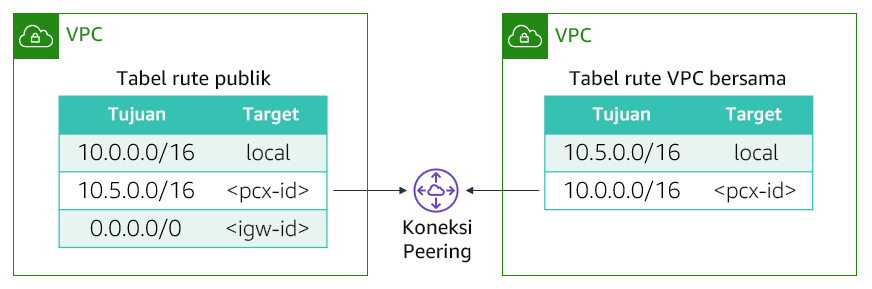

# Modul 7 - Lab Terpandu: Membuat Koneksi Peering VPC
[//]: # "SKU: ILT-TF-200-ACACAD-2    Source Course: ILT-TF-100-ARCHIT-6 branch dev_65"

## Gambaran umum dan tujuan lab

Anda mungkin ingin menghubungkan virtual private cloud (VPC) Anda ketika harus mentransfer data di antara keduanya. Lab ini menunjukkan cara membuat koneksi peering VPC pribadi antara dua VPC.

Setelah menyelesaikan lab ini, Anda akan mampu:

- Membuat koneksi peering VPC
- Mengonfigurasi tabel rute untuk menggunakan koneksi peering VPC

Pada **akhir** lab ini, arsitektur Anda akan terlihat seperti contoh berikut:

 
## Durasi
Diperlukan waktu sekitar **20 menit** untuk menyelesaikan lab ini.

 

## Pembatasan layanan AWS

Dalam lingkungan lab ini, akses ke layanan AWS dan tindakan layanan mungkin dibatasi untuk orang-orang yang diperlukan untuk menyelesaikan instruksi lab. Anda mungkin akan mengalami error jika mencoba mengakses layanan lain atau melakukan tindakan di luar yang dijelaskan di lab ini.

 

## Mengakses Konsol Manajemen AWS

1. Di bagian atas instruksi ini, pilih Start Lab (Mulai Lab) untuk meluncurkan lab Anda.

   Panel **Start Lab** (Mulai Lab) terbuka dan menampilkan status lab.

   <i class="fas fa-info-circle"></i> **Tip**: Jika Anda memerlukan lebih banyak waktu untuk menyelesaikan lab, mulai ulang pengatur waktu untuk lingkungan dengan memilih tombol Start Lab (Mulai Lab) lagi.

2. Tunggu hingga panel **Start Lab** (Mulai Lab) menampilkan pesan *Lab status: ready* (Status lab: siap), lalu tutup panel dengan memilih **X**.

3. Di bagian atas instruksi ini, pilih AWS.

   Tindakan ini akan membuka Konsol Manajemen AWS di tab browser baru. Anda akan masuk ke sistem secara otomatis.

   <i class="fas fa-exclamation-triangle"></i> **Tip**: Jika tab browser baru tidak terbuka, banner atau ikon biasanya berada di bagian atas browser Anda dengan pesan bahwa browser Anda mencegah situs membuka jendela sembulan. Pilih banner atau ikon, lalu pilih **Allow pop-ups** (Izinkan sembulan).

4. Atur tab **AWS Management Console**(Konsol Manajemen AWS) agar ditampilkan bersama instruksi ini. Idealnya, Anda perlu membuka kedua tab browser secara bersamaan, sehingga Anda dapat mengikuti langkah-langkah lab dengan lebih mudah.

   <i class="fas fa-exclamation-triangle"></i> **Jangan mengubah Wilayah kecuali secara khusus diperintahkan untuk melakukannya**.

 

## Tugas 1: Membuat koneksi peering VPC

<i class="fas fa-comment"></i>Tugas Anda adalah untuk membuat koneksi peering VPC antara dua VPC.

*Koneksi peering* VPC** adalah koneksi jaringan satu lawan satu antara dua VPC yang memungkinkan Anda mengarahkan rute lalu lintas di antara keduanya secara pribadi. Instans di masing-masing VPC dapat saling berkomunikasi seakan-akan berada dalam jaringan yang sama. Anda dapat membuat koneksi peering VPC di antara VPC Anda sendiri, dalam suatu VPC di akun AWS yang lain, atau dengan VPC di Wilayah AWS yang berbeda.

Dua VPC disediakan sebagai bagian dari lab ini: *Lab VPC* dan *VPC Bersama*. *Lab VPC* memiliki aplikasi Inventory yang berjalan pada instans Amazon Elastic Compute Cloud (Amazon EC2) di subnet publik. *VPC Bersama* memiliki basis data instans yang berjalan di subnet privat.

5. Di **AWS Management Console** (Konsol Manajemen AWS), pada menu Services<i class="fas fa-angle-down"></i> (Layanan), pilih **VPC**.

6. Di panel navigasi kiri, pilih **Peering Connections** (Koneksi Peering).

7. Pilih Create Peering Connection (Buat Koneksi Peering) dan konfigurasikan:

   - **Peering connection name tag** (Tanda nama koneksi peering): `Lab-Peer`

   - **VPC (Requester)** (VPC (Pemohon)): *Lab VPC*

   - **VPC (Accepter)** (VPC (Penerima)): *VPC Bersama*

   - Pilih Create Peering Connection (Buat Koneksi Peering), lalu pilih OK

   Ketika koneksi peering VPC dibuat, VPC target harus menerima permintaan sambungan. VPC target harus menerima permintaan karena mungkin dimiliki oleh akun yang berbeda. Atau, pengguna yang membuat koneksi peering mungkin tidak memiliki izin untuk menerima permintaan koneksi untuk VPC target. Akan tetapi, dalam lab ini, Anda sendiri yang akan menerima koneksi tersebut.

8. Pilih <i class="far fa-check-square"></i> **Lab-Peer**.

9. Pilih Actions<i class="fas fa-angle-down"></i> (Tindakan) lalu pilih **Accept Request** (Terima Permintaan), dan pilih Yes, Accept (Ya, Terima) untuk menerima permintaan.

10. Di kotak sembulan, pilih Close (Tutup).

 

## Tugas 2: Mengonfigurasi tabel rute

Anda kini akan memperbarui tabel rute di kedua VPC untuk mengirimkan lalu lintas dari *Lab VPC* ke koneksi peering untuk *Shared VPC*.

11. Di panel navigasi kiri, pilih **Route Tables** (Tabel Rute).

12. Pilih <i class="far fa-check-square"></i> **Lab Public Route Table** (untuk *Lab VPC*) (Tabel Rute Publik Lab (untuk lab VPC)).

   Anda akan mengonfigurasi *Public Route Table* (Tabel Rute Publik) yang dikaitkan dengan *Lab VPC*.  Jika alamat IP tujuan berada dalam jangkauan *VPC Bersama*, *Tabel Rute Publik* akan mengirim lalu lintas ke koneksi peering.

13. Di tab **Routes** (Rute), pilih Edit routes (Edit rute) lalu konfigurasikan pengaturan berikut:

   - Pilih Add route(Tambah rute)
   - **Destination** (Tujuan): `10.5.0.0/16` (Pengaturan ini adalah Classless Inter-Domain Route, atau CIDR, jangkauan blok *VPC Bersama*.)
   * **Target:** Pilih **Peering Connection** (Koneksi Peering), kemudian pilih *Lab-Peer* dari daftar.
   - Pilih Save routes (Simpan rute) lalu pilih Close (Tutup).

   Sekarang Anda akan mengonfigurasi arus balik untuk lalu lintas yang datang dari *VPC Bersama* menuju *Lab VPC*.

14. Pilih <i class="far fa-check-square"></i> **Shared-VPC Route Table** (Tabel Rute VPC Bersama). Jika ada tabel rute lain telah yang tercentang, hapus centang tersebut.

   Tabel rute ini adalah untuk *VPC Bersama*. Anda akan mengonfigurasinya untuk mengirimkan lalu lintas ke koneksi peering jika alamat IP tujuan berada di dalam jangkauan *Lab VPC*.

15. Di tab **Routes** (Rute), pilih Edit routes (Edit rute) lalu konfigurasikan pengaturan berikut:

   - Pilih Add route(Tambah rute)
   - **Destination** (Tujuan): `10.0.0.0/16` (Pengaturan ini adalah jangkauan blok CIDR dari *Lab VPC*.)
   * **Target:** Pilih *Peering Connection* (Koneksi Peering), kemudian pilih *Lab-Peer* dari daftar.
   - PilihSave route (Simpan rute), lalu pilih Close (Tutup).

   Tabel rute kini telah dikonfigurasi untuk mengirimkan lalu lintas melalui koneksi peering ketika lalu lintas tersebut ditujukan untuk VPC lainnya.

 

## Tugas 3: Menguji koneksi peering VPC

Karena telah mengonfigurasi peering VPC, kini Anda akan menguji koneksi peering VPC. Anda akan melakukan pengujian ini dengan mengonfigurasi aplikasi Inventory untuk mengakses basis data di koneksi peering.

16. Pada menu Services<i class="fas fa-angle-down"></i> (Layanan), pilih **EC2**.

17. Di panel navigasi kiri, pilih **Instances** (Instans).

18. Salin alamat **IP Publik IPv4** yang ditampilkan di tab **Description** (Deskripsi).

19. Buka tab browser web baru dengan alamat IP tersebut.

   Anda akan melihat aplikasi Inventory dan pesan berikut: *“Please configure settings to connect to database”* (Konfigurasi pengaturan untuk menghubungkan ke basis data)

20. Pilih <i class="fas fa-cog" aria-hidden="true"></i> **Settings** (Pengaturan) dan konfigurasi:

   - **Endpoint:** Salin endpoint basis data. Untuk menemukan endpoint ini, pilih *Details* (Detail). Di samping *AWS*, pilih *Show* (Tampilkan). Kemudian, salin *Endpoint*.
   - **Database** (Basis Data): `inventory` (inventaris)
   - **Username** (Nama pengguna): `admin`
   - **Password** (Kata sandi): `lab-password`
   - Pilih Save (Simpan)

   Kini aplikasi tersebut seharusnya menampilkan data dari basis data.

   Langkah ini mengonfirmasi bahwa koneksi peering VPC sudah dibuat karena *VPC Bersama* tidak memiliki gateway internet. Satu-satunya cara untuk mengakses basis data adalah melalui koneksi peering VPC ini.

 

## Mengirimkan pekerjaan Anda

21. Di bagian atas instruksi ini, pilih Submit (Kirim) untuk merekam kemajuan Anda dan saat diminta, pilih **Yes** (Ya).

22. Jika hasilnya tidak muncul setelah beberapa menit, kembali ke bagian atas instruksi ini dan pilih Grades (Nilai)

   **Tip**: Anda dapat mengirimkan pekerjaan Anda beberapa kali. Setelah Anda mengubah pekerjaan, pilih **Submit** (Kirim) lagi. Apa yang akan direkam untuk lab ini adalah pengiriman terakhir Anda.

23. Untuk menemukan detail umpan balik tentang pekerjaan Anda, pilih Details (Detail) diikuti oleh <i class="fas fa-caret-right"></i> **View Submission Report** (Lihat Laporan Pengiriman).

 

## Lab selesai <i class="fas fa-graduation-cap"></i>

<i class="fas fa-flag-checkered"></i> Selamat! Anda telah menyelesaikan lab.

24. Pilih End Lab (Akhiri Lab) di bagian atas halaman ini, lalu pilih Yes (Ya) untuk mengonfirmasi bahwa Anda ingin mengakhiri lab.

   Sebuah panel menunjukkan bahwa *DELETE has been initiated... * (Penghapusan sudah dimulai...) *You may close this message box now.* (Anda dapat menutup kotak pesan ini sekarang.)

25. Pilih **X** di sudut kanan atas untuk menutup panel.

*©2020 Amazon Web Services, Inc. dan afiliasinya. Hak cipta dilindungi undang-undang. Karya ini tidak boleh direproduksi atau didistribusikan ulang, seluruhnya atau sebagian, tanpa izin tertulis sebelumnya dari Amazon Web Services, Inc. Dilarang menyalin, meminjamkan, atau menjual secara komersial.*
