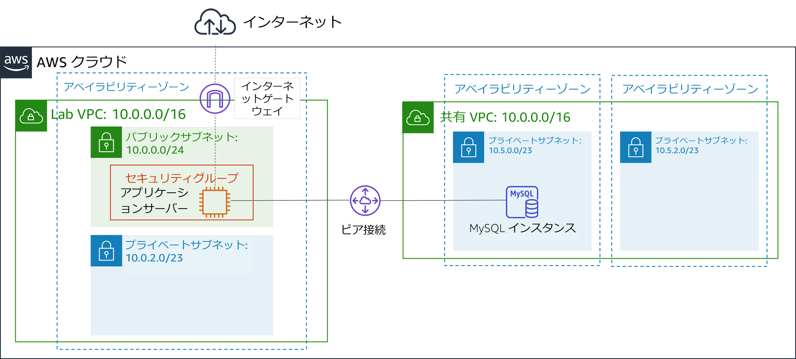
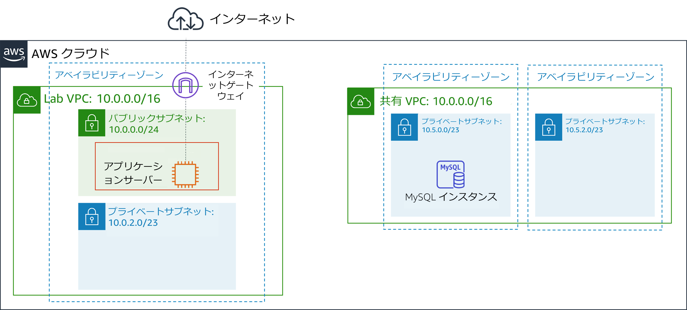
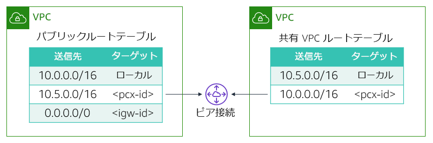

# モジュール 7-ガイド付きラボ: VPC ピアリング接続を作成する
[//]: # "SKU: ILT-TF-200-ACACAD-2    Source Course: ILT-TF-100-ARCHIT-6 branch dev_65"

## ラボの概要と目標

Virtual Private Cloud (VPC) 間でデータを転送する必要がある場合、その VPC 間を接続することができます。このラボでは、2つの VPC 間にプライベート VPC ピアリング接続を作成する方法を説明します。

このラボを完了すると、次のことができるようになります。

- VPC ピアリング接続を作成する
- ルートテーブルを設定して VPC ピアリング接続を使用する

ラボの**終了時**のアーキテクチャは次の例のようになります。

 

## 所要時間

このラボは、修了までに約 **20 分**かかります。

 

## AWS サービスの制限事項

このラボ環境では、AWS のサービスとサービスアクションへのアクセスが、ラボの手順を完了するために必要なものに制限されています。他のサービスへのアクセスや、このラボで説明されているサービス以外のアクションを実行しようとすると、エラーが発生することがあります。

 

## AWS マネジメントコンソールにアクセスする

1. この手順の上部にある Start Lab をクリックし、ラボを起動します。

   [**Start Lab**] パネルが開き、ラボのステータスが表示されます。

   <i class="fas fa-info-circle"></i> **ヒント**: ラボの完了までにさらに時間が必要な場合は、Start Lab ボタンをもう一度選択して、この環境のタイマーを再開します。

2. \[**Start Lab**] パネルに **Lab status: ready** というメッセージが表示されたら [**X**] をクリックしてパネルを閉じます。

3. この手順の上部にある AWS をクリックします。

   このアクションにより、新しいブラウザタブで AWS マネジメントコンソールが開き、ユーザーは自動的にログインします。

   <i class="fas fa-exclamation-triangle"></i> **ヒント**: 新しいブラウザタブが開かない場合、通常、ブラウザによってサイトのポップアップウィンドウの表示がブロックされたというメッセージが表示されたバナーまたはアイコンがブラウザの上部に表示されます。バナーまたはアイコンを選択して [**ポップアップを許可**] を選択してください。

4. **AWS マネジメントコンソール**タブがこの手順と並べて表示されるようにします。両方のブラウザタブを同時に開いておくと、ラボのステップを実行しやすくなります。

   <i class="fas fa-exclamation-triangle"></i> **特に指示がない限り、リージョンを変更しないでください**。

 

## タスク 1: VPC ピアリング接続を作成する

<i class="fas fa-comment"></i>タスクは、2 つの VPC 間に VPC ピアリング接続を作成することです。

**VPC ピアリング接続**は 2 つの VPC 間の 1 対 1 のネットワーク接続であり、トラフィックをプライベートにルーティングできます。どちらの VPC のインスタンスも、同じネットワーク内にあるように相互に通信できます。VPC ピアリング接続は、独自の VPC間、別の AWS アカウントの VPC 間、または別の AWS リージョンの VPC 間で作成できます。

このラボでは、2 つの VPC が提供されます。**Lab VPC** と ***Shared VPC*** です。**Lab VPC** には、パブリックサブネットの Amazon Elastic Compute Cloud (Amazon EC2) インスタンス上で動作するインベントリアプリケーションがあります。**Shared VPC** には、プライベートサブネットで動作するデータベースインスタンスがあります。

5. **AWS マネジメントコンソール**のサービス <i class="fas fa-angle-down"></i> で [**VPC**] をクリックします。

6. 左側のナビゲーションペインで [**ピアリング接続**] をクリックします。

7. ピアリング接続の作成 をクリックし、次のように設定します。

   - **ピアリング接続ネームタグ:** `Lab-Peer`

   - **VPC (リクエスタ):** **Lab VPC**

   - **VPC (アクセプタ):** **Shared VPC**

   - ピアリング接続の作成 をクリックしてから、OK をクリックします

   VPC ピアリング接続が作成されると、ターゲット VPC は接続リクエストを承諾する必要があります。リクエストを承諾する必要があるのは、ターゲット VPC が別のアカウントによって所有されている可能性があるためです。また、ピアリング接続を作成したユーザーが、ターゲット VPC の接続リクエストを承諾する権限を持っていない場合もあります。ただし、このラボでは自分で接続を承諾します。

8. <i class="far fa-check-square"></i> **Lab-Peer** を選択します。

9. アクション <i class="fas fa-angle-down"></i> ドロップダウンメニューから [**リクエストの承諾**] を選択し、はい、承諾する をクリックしてリクエストを承諾します。

10. ポップアップボックスで、閉じる をクリックします。

 

## タスク 2: ルートテーブルを設定する

ここで、両方の VPC のルートテーブルを更新して、**Lab VPC** から **Shared VPC** のピアリング接続にトラフィックを送信します。

11. 左側のナビゲーションペインで [**ルートテーブル**] をクリックします。

12. <i class="far fa-check-square"></i> **Lab Public Route Table** を選択します（**Lab VPC**用）。

    **Lab VPC** に関連付けられた **パブリックルートテーブル**を設定します。送信先 IP アドレスが **Shared VPC** の範囲内にある場合、**パブリックルートテーブル**はピアリング接続にトラフィックを送信します。

13. \[**ルート**] タブで ルートの編集 をクリックし、次を設定します。

    - ルートの追加 をクリックします。
    - **送信先:** `10.5.0.0/16`（この設定はクラスレスドメイン間ルート、または CIDR、**Shared VPC** のブロック範囲）
    * **ターゲット:** **Peering Connection** を選択し、リストから **Lab-Peer** を選択します。
    - ルートの保存 をクリックし、閉じる をクリックします。

	同様に、**Shared VPC** から **Lab VPC** へのトラフィックのリバースフローを設定します。

14. <i class="far fa-check-square"></i> **Shared-VPC Route Table** を選択します。他のルートテーブルが選択されている場合は、選択をクリアします。

   このルートテーブルは、**Shared VPC** 用です。送信先 IP アドレスが **Lab VPC** の範囲内にある場合に、トラフィックをピアリング接続に送信するように設定します。

15. \[**ルート**] タブで、ルートの編集 をクリックし、次を設定します。

    - ルートの追加 をクリックします。
    - **送信先:** `10.0.0.0/16`（この設定は **Lab VPC** の CIDR ブロック範囲）
    * **ターゲット:** **Peering Conncection**を選択し、リストから **Lab-Peer** を選択します。
    - ルートの保存 をクリックし、閉じる をクリックします。

    これで、トラフィックの送信先が他の VPC である場合に、ピアリング接続経由でトラフィックを送るようにルートテーブルを設定できました。

 

## タスク 3: VPC ピアリング接続をテストする

VPCピアリングを設定したので、VPC ピアリング接続をテストします。テストを実行するには、インベントリアプリケーションを設定して、ピアリング接続を介してデータベースにアクセスします。

16. サービス <i class="fas fa-angle-down"></i> で [**EC2**] をクリックします。

17. 左側のナビゲーションペインで [**インスタンス**] をクリックします。

18. \[**詳細**] タブに表示されている [**パブリック IPv4 アドレス**] アドレスをコピーします。

19. コピーした IP アドレスで新しいウェブブラウザタブを開きます。

    Inventory アプリケーションと **Please configure settings to connect to database**というメッセージが表示されます。

20. <i class="fas fa-cog" aria-hidden="true"></i> **Settings** をクリックし、次を設定します。

    - **Endpoint:** データベースのエンドポイントを貼り付けます。このエンドポイントを見つけるには、[**AWS**] の横にある [**Details**] ドロップダウンメニューから [**Show**] を選択し、[**Endpoint**]をコピーします。
    - **Database:** `inventory`
    - **Username:** `admin`
    - **Password:** `lab-password`
    - Save をクリックします。

    アプリケーションに、データベースのデータが表示されるようになりました。

    **Shared VPC** にはインターネットゲートウェイがないため、このステップで VPC ピアリング接続が確立されたことを確認します。VPC ピアリング接続を使用することでのみ、データベースにアクセスできます。

 

## 作業内容を送信する

21. この手順の上部にあるSubmit をクリックして進捗情報を記録し、プロンプトが表示されたら [**Yes**] をクリックします。

22. 数分経っても結果が表示されない場合は、この手順の上部に戻り、Grades をクリックします。

    **ヒント**: 作業内容は何度も送信できます。作業内容を変更したら、再度 [**Submit**] をクリックします。最終送信分がこのラボの作業内容として記録されます。

23. 作業に関する詳細なフィードバックを参照するには、Details ドロップダウンメニューから <i class="fas fa-caret-right"></i> [**View Submission Report**] を選択します。

 

## ラボの終了<i class="fas fa-graduation-cap"></i>

<i class="fas fa-flag-checkered"></i>お疲れ様でした。以上でラボは終了です。

24. ラボを終了するには、このページの上部にある End Lab をクリックし、Yes をクリックします。

    パネルに **DELETE has been initiated... You may close this message box now** というメッセージが表示されます。

25. 右上隅の [**X**] をクリックしてパネルを閉じます。

**©2020 Amazon Web Services, Inc. and its affiliates. All rights reserved. このトレーニング内容の全体または一部を複製または再配布することは、Amazon Web Services, Inc. の書面による事前の許可がある場合を除き、禁じられています。商業目的のコピー、貸与、または販売を禁止します。**
