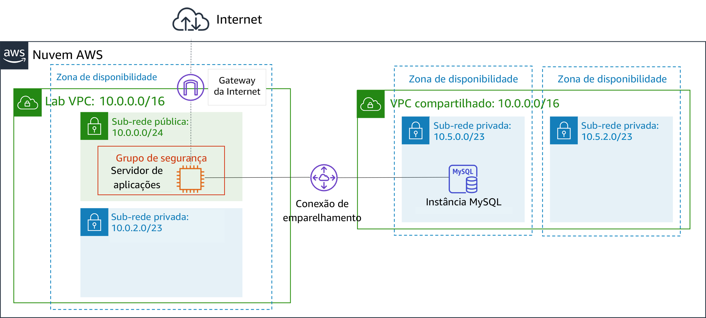
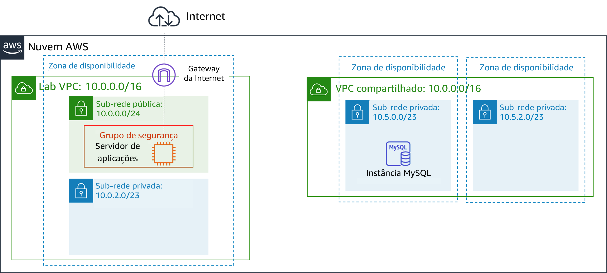
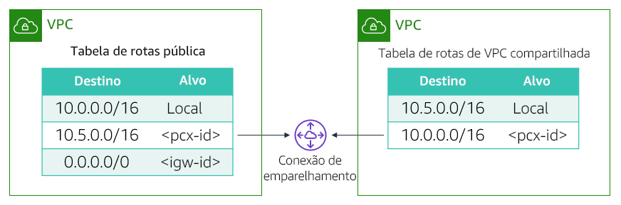

# Módulo 7 – Laboratório guiado: Criar uma conexão de emparelhamento de VPC
[//]: # "SKU: ILT-TF-200-ACACAD-2    Source Course: ILT-TF-100-ARCHIT-6 branch dev_65"

## Visão geral e objetivos do laboratório

Talvez você queira conectar suas VPCs (Virtual Private Clouds, nuvens privadas virtuais) quando for necessário transferir dados entre elas. Este laboratório mostra como criar uma conexão privada de emparelhamento de VPC entre duas VPCs.

Depois de concluir este laboratório, você deverá ser capaz de:

- Criar uma conexão de emparelhamento de VPC
- Configurar tabelas de rotas para usar a conexão de emparelhamento de VPC

No **final** deste laboratório, sua arquitetura será semelhante ao seguinte exemplo:

 
## Duração
Este laboratório levará aproximadamente **20 minutos** para ser concluído.

 

## Restrições de serviço da AWS

Neste ambiente de laboratório, o acesso aos serviços e ações de serviço da AWS pode estar restrito àqueles necessários para concluir as instruções do laboratório. Você poderá encontrar erros se tentar acessar outros serviços ou executar ações além do que está descrito neste laboratório.

 

## Acessar o Console de Gerenciamento da AWS

1. Na parte superior destas instruções, escolha Start Lab (Iniciar laboratório) para iniciar o laboratório.

   Um painel **Start Lab** (Iniciar laboratório) é aberto com o status do laboratório.

   <i class="fas fa-info-circle"></i> **Dica**: se você precisar de mais tempo para concluir o laboratório, escolha novamente o botão Start Lab (Iniciar laboratório) para reiniciar o cronômetro do ambiente.

2. Aguarde até que o painel **Start Lab** (Iniciar laboratório) exiba a mensagem *Lab status: ready (Status do laboratório: pronto)* e, em seguida, escolha **X** para fechar o painel.

3. Na parte superior destas instruções, escolha AWS.

   Essa ação abrirá o Console de Gerenciamento da AWS em uma nova guia do navegador. O sistema fará seu login automaticamente.

   <i class="fas fa-exclamation-triangle"></i> **Dica**: se uma nova guia do navegador não for aberta, normalmente você verá uma faixa ou um ícone na parte superior do navegador com uma mensagem informando que o navegador está impedindo que o site abra janelas pop-up. Escolha a faixa ou o ícone e depois **Allow pop ups** (Permitir pop-ups).

4. Organize a guia do **Console de Gerenciamento da AWS** para que ela seja exibida com essas instruções. O ideal é ver as duas guias do navegador abertas ao mesmo tempo, para facilitar o acompanhamento das etapas do laboratório.

   <i class="fas fa-exclamation-triangle"></i> **Não altere a região, a menos que seja especificamente instruído a fazer isso**.

 

## Tarefa 1: criar uma conexão de emparelhamento de VPC

<i class="fas fa-comment"></i>Sua tarefa é criar uma conexão de emparelhamento de VPC entre duas VPCs.

Uma *conexão de emparelhamento de VPC* é uma conexão de rede um para um entre duas VPCs que permite rotear o tráfego entre elas de forma privada. Ela permite que as instâncias de qualquer VPC possam se comunicar entre si como se estivessem na mesma rede. Você pode criar uma conexão de emparelhamento de VPC entre suas próprias VPCs, em uma VPC em outra conta da AWS ou com uma VPC em outra região da AWS.

Duas VPCs são fornecidas como parte deste laboratório: a *Lab VPC* e a *VPC compartilhada*. A *Lab VPC* tem uma aplicação de inventário que é executada em uma instância do Amazon Elastic Compute Cloud (Amazon EC2) em uma sub-rede pública. A *VPC compartilhada* tem uma instância de banco de dados executada em uma sub-rede privada.

5. No **Console de Gerenciamento da AWS**, no menu Services (Serviços)<i class="fas fa-angle-down"></i>, escolha **VPC**.

6. No painel de navegação à esquerda, escolha **Peering Connections** (Conexões de emparelhamento).

7. Escolha Create Peering Connection (Criar conexão de emparelhamento) e configure:

   - **Tag de nome da conexão de emparelhamento:** `Lab-Peer`

   - **VPC** (solicitante): *Lab VPC*

   - **VPC** (aceitante): *VPC compartilhada*

   - Escolha Create Peering Connection (Criar conexão de emparelhamento) e, em seguida, OK

   Quando uma conexão de emparelhamento de VPC é criada, a VPC de destino precisa aceitar a solicitação de conexão, porque ela pode ser de propriedade de uma conta diferente. Por outro lado, o usuário que cria a conexão de emparelhamento pode não ter permissão para aceitar a solicitação de conexão para a VPC de destino. Neste laboratório, você aceitará a conexão você mesmo.

8. Selecione <i class="far fa-check-square"></i> **Lab-Peer**.

9. Escolha Actions<i class="fas fa-angle-down"></i> (Ações), depois **Accept Request** (Aceitar solicitação) e Yes, Accept (Sim, aceitar) para aceitar a solicitação.

10. Na caixa pop-up, escolha Close (Fechar).

 

## Tarefa 2: configurar tabelas de rotas

Agora você atualizará as tabelas de rotas em ambas as VPCs para enviar tráfego da *Lab VPC* para a conexão de emparelhamento com a *VPC compartilhada*.

11. No painel de navegação à esquerda, escolha **Route Tables** (Tabelas de rotas).

12. Selecione <i class="far fa-check-square"></i> **Tabela de rotas pública do laboratório** (para a *Lab VPC*).

    Você configurará a *tabela de rotas pública* associada à *Lab VPC*. Se o endereço IP de destino estiver no intervalo da *VPC compartilhada*, a *tabela de rotas pública* enviará tráfego para a conexão de emparelhamento.

13. Na guia **Routes** (Rotas), escolha Edit routes (Editar rotas) e ajuste estas configurações:

    - Escolha Add route (Adicionar rota)
    - **Destino:** `10.5.0.0/16`, a configuração é o intervalo de blocos CIDR (Classless Inter-Domain Route, rota interdomínio sem classe) da *VPC compartilhada*.
    * **Destino:** selecione **Peering Connection** (Conexão de emparelhamento) e, na lista, selecione *Lab-Peer*.
    - Escolha Save routes (Salvar rotas) e Close (Fechar).

    Agora você configurará o fluxo reverso para o tráfego que vem da *VPC compartilhada* e vai para a *Lab VPC*.

14. Selecione <i class="far fa-check-square"></i> **Tabela de rotas da VPC compartilhada**. Se as caixas de seleção de quaisquer outras tabelas de rotas estiverem marcadas, desmarque-as.

    A tabela de rotas se refere à *VPC compartilhada*. Agora você a configurará para enviar tráfego para a conexão de emparelhamento caso o endereço IP de destino esteja no intervalo da *Lab VPC*.

15. Na guia **Routes** (Rotas), escolha Edit routes (Editar rotas) e ajuste estas configurações:

    - Escolha Add route (Adicionar rota)
    - **Destino:** `10.0.0.0/16` (essa configuração é o intervalo de blocos CIDR da *Lab VPC*.)
    * **Destino:** selecione *Peering Connection (Conexão de emparelhamento)* e, na lista, selecione *Lab-Peer*.
    - Escolha Save routes (Salvar rotas) e Close (Fechar).

    Agora as tabelas de rotas estão configuradas para enviar tráfego pela conexão de emparelhamento quando o tráfego for destinado à outra VPC.

 

## Tarefa 3: testar a conexão de emparelhamento de VPC

Agora que configurou o emparelhamento de VPC, você testará a conexão de emparelhamento de VPC. O teste será executado configurando a aplicação de inventário para acessar o banco de dados pela conexão de emparelhamento.

16. No menu Services<i class="fas fa-angle-down"></i> (Serviços), escolha **EC2**.

17. No painel de navegação à esquerda, escolha **Instances** (Instâncias).

18. Copie o endereço **IP público IPv4** mostrado na guia **Descrição**.

19. Abra uma nova guia do navegador da Web com esse endereço IP.

    Você deve ver a aplicação de inventário e a seguinte mensagem: *“Por favor, defina as configurações para se conectar ao banco de dados”*

20. Escolha <i class="fas fa-cog" aria-hidden="true"></i> **Configurações** e ajuste:

    - **Endpoint:** cole o endpoint do banco de dados. Para localizar esse endpoint, selecione *Details (Detalhes)*. Ao lado de *AWS*, escolha *Show (Mostrar)*. Em seguida, copie o *Endpoint*.
    - **Database** (Banco de dados): `inventory`
    - **Username** (Nome de usuário): `admin`
    - **Password** (Senha): `lab-password`
    - Escolha Save (Salvar)

    A aplicação agora deve mostrar dados do banco de dados.

    Esta etapa confirma que a conexão de emparelhamento de VPC foi estabelecida porque a *VPC compartilhada* não tem um gateway da Internet. A única maneira de acessar o banco de dados é pela conexão de emparelhamento de VPC.

 

## Enviar o trabalho

21. Na parte superior destas instruções, escolha Submit (Enviar) para gravar o progresso e, quando solicitado, escolha **Yes** (Sim).

22. Se os resultados não forem exibidos após alguns minutos, volte ao topo destas instruções e escolha Grades (Notas).

    **Dica**: você pode enviar seu trabalho várias vezes. Depois de alterar o trabalho, escolha **Submit** (Enviar) novamente. Seu último envio é o que será gravado para este laboratório.

23. Para ver o feedback detalhado do seu trabalho, escolha Details (Detalhes) e depois <i class="fas fa-caret-right"></i> **View Submission Report** (Visualizar relatório de envio).

 

## Laboratório concluído <i class="fas fa-graduation-cap"></i>

<i class="fas fa-flag-checkered"></i> Parabéns! Você concluiu o laboratório.

24. Escolha End Lab (Encerrar laboratório) na parte superior desta página e, em seguida, selecione Yes (Sim) para confirmar que você deseja encerrar o laboratório.

    Um painel indica que *DELETE has been initiated... You may close this message box now (A EXCLUSÃO foi iniciada... Você pode fechar esta caixa de mensagem agora)*.

25. Escolha o **X** no canto superior direito para fechar o painel.

*©2020, Amazon Web Services, Inc. e suas afiliadas. Todos os direitos reservados. Este trabalho não pode ser reproduzido ou redistribuído, no todo ou em parte, sem permissão prévia por escrito da Amazon Web Services, Inc. É proibido copiar, emprestar ou vender para fins comerciais.*
