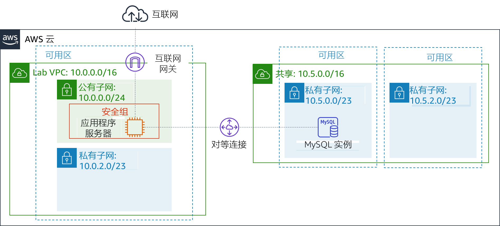
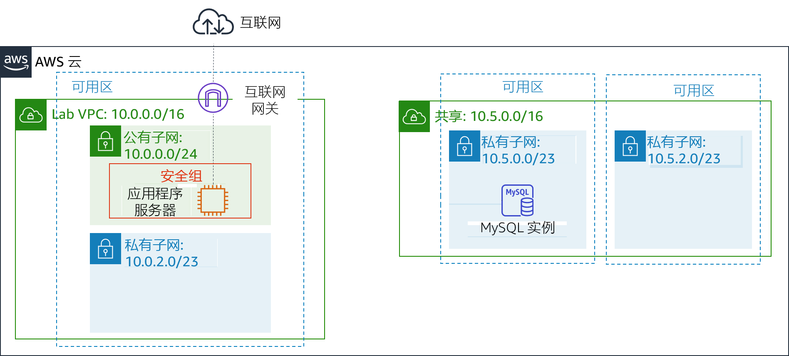
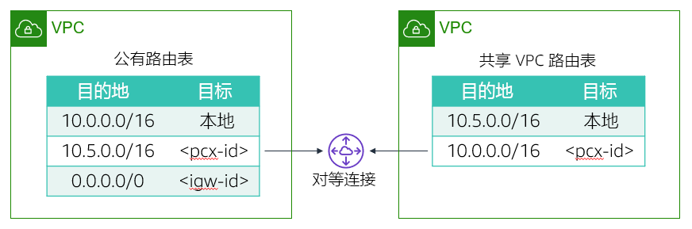

# 模块 7 – 指导实验：创建 VPC 对等连接
[//]: # "SKU: ILT-TF-200-ACACAD-2    Source Course: ILT-TF-100-ARCHIT-6 branch dev_65"

## 实验概览和目标

当必须在 Virtual Private Cloud (VPC) 之间传输数据时，您可能希望连接各个 VPC。本实验将向您展示如何在两个 VPC 之间创建私有 VPC 对等连接。

完成本实验后，您应能够：

- 创建 VPC 对等连接
- 配置路由表以使用 VPC 对等连接

在本实验**结束**时，您的架构将如下例所示：

 
##持续时间
完成本实验大约需要 **20 分钟**。

 

## AWS 服务限制

在本实验环境中，对 AWS 服务和服务操作的访问可能仅限于完成实验说明所需的服务和服务操作。如果您尝试访问其他服务或执行本实验中所述之外的操作，可能会遇到错误。

 

## 访问 AWS 管理控制台

1. 在这些说明的顶部，选择 Start Lab（启动实验）即可启动您的实验。

   **Start Lab**（启动实验）面板随即会打开，其中显示了实验状态。

   <i class="fas fa-info-circle"></i> **提示**：如果您需要更多时间来完成实验，请再次选择 Start Lab（启动实验）按钮，重新启动环境计时器。

2. 请耐心等待，直到 **Start Lab**（启动实验）面板显示消息 *Lab status: ready*（实验状态：就绪），然后选择 **X** 关闭此面板。

3. 在这些说明的顶部，选择 AWS。

   此操作将在一个新的浏览器选项卡中打开 AWS 管理控制台。您将自动登录系统。

   <i class="fas fa-exclamation-triangle"></i> **提示**：如果未打开新的浏览器选项卡，您的浏览器顶部通常会出现一个横幅或图标，并显示一条消息，指明您的浏览器阻止该了网站打开弹出窗口。请选择横幅或图标，然后选择 **Allow pop-ups**（允许弹出窗口）。

4. 排列 **AWS 管理控制台**选项卡，使其与这些说明一起显示。理想情况下，您将同时打开两个浏览器选项卡，以便能够更轻松地执行实验步骤。

   <i class="fas fa-exclamation-triangle"></i> **除非特别要求，否则请勿更改区域**。

 

## 任务 1：创建 VPC 对等连接

<i class="fas fa-comment"></i> 您的任务是在两个 VPC 之间创建 VPC 对等连接。

*VPC 对等连接*是两个 VPC 之间的一对一网络连接，使您能够以私密方式路由它们之间的流量。任何一个 VPC 中的实例都可以像在同一网络中一样彼此通信。您可以在自己的 VPC 之间、在另一 AWS 账户的 VPC 中或与不同 AWS 区域中的 VPC 之间创建 VPC 对等连接。

本实验提供了两个 VPC：*Lab VPC* 和*共享 VPC*。*Lab VPC* 有一个库存应用程序，在公有子网中的 Amazon Elastic Compute Cloud (Amazon EC2) 实例上运行。*共享 VPC* 有一个在私有子网中运行的数据库实例。

5. 在 **AWS 管理控制台**的 Services <i class="fas fa-angle-down"></i>（服务）菜单中，选择 **VPC**。

6. 在左侧导航窗格中，选择 **Peering Connections**（对等连接）。

7. 单击 Create Peering Connection（创建对等连接），然后进行以下配置：

   - **Peering connection name tag**（对等连接名称标签）：`Lab-Peer`

   - **VPC** (Requester)（VPC 请求方）：*Lab VPC*

   - **VPC** (Accepter)（VPC 接受方）：*Shared VPC*（共享 VPC）

   - 选择 Create Peering Connection（创建对等连接），然后选择 OK（确定）

   创建 VPC 对等连接后，目标 VPC 必须接受连接请求。目标 VPC 之所以必须接受请求，是因为它可能由其他账户所有。或者，创建对等连接的用户可能没有权限接受目标 VPC 的连接请求。但是，在本实验中，您将自己接受连接。

8. 选择 <i class="far fa-check-square"></i> **Lab-Peer**。

9. 依次选择 Actions <i class="fas fa-angle-down"></i>（操作）、**Accept Request**（接受请求），然后选择 Yes, Accept（是，接受）以接受该请求。

10. 在弹出框中，选择 Close（关闭）。

 

## 任务 2：配置路由表

现在，您将更新两个 VPC 中的路由表，以便将来自 *Lab VPC* 的流量发送到*共享 VPC* 的对等连接。

11. 在左侧导航窗格中，选择 **Route Table**（路由表）。

12. 选择 <i class="far fa-check-square"></i> **Lab Public Route Table**（实验公有路由表）（适用于 *Lab VPC*）。

    您将配置与 *Lab VPC* 关联的*公有路由表*。如果目标 IP 地址在*共享 VPC* 的范围内，则*公有路由表*会将流量发送到对等连接。

13. 在 **Routes**（路由）选项卡中，选择 Edit routes（编辑路由），然后配置以下设置：

    - 选择 Add route（添加路由）
    - **Destination**（目标网段）：`10.5.0.0/16`（设置为*共享 VPC* 的无类域间路由或 CIDR 块范围）。
    * **Target**（目标）：选择 **Peering Connection**（对等连接），然后从列表中选择 *Lab-Peer*。
    - 选择 Save routes（保存路由），然后选择 Close（关闭）。

    现在，您将为来自*共享 VPC* 进入 *Lab VPC* 的流量配置反向流。

14. 选择 <i class="far fa-check-square"></i> **Shared-VPC Route Table**（共享 VPC 路由表）。如果选中了任何其他路由表的复选框，请清除它们。

    此路由表适用于 *共享 VPC*。现在，如果目的地 IP 地址在 *Lab VPC* 的范围内，您会将此路由表配置为将流量发送到对等连接。

15. 在 **Routes**（路由）选项卡中，选择 Edit routes（编辑路由），然后配置以下设置：

    - 选择 Add route（添加路由）
    - **Destination**（目标网段）：`10.0.0.0/16`（此设置是 *Lab VPC* 的 CIDR 块范围）。
    * **Target**（目标）：选择 *Peering Connection*（对等连接），然后从列表中选择 *Lab-Peer*。
    - 选择 Save routes（保存路由），然后选择 Close（关闭）。

    路由表现已配置为在流量发往另一个 VPC 时通过对等连接发送流量。

 

## 任务 3：测试 VPC 对等连接

您已配置 VPC 对等连接，现在您将测试 VPC 对等连接。您将通过将 Inventory 应用程序配置为通过对等连接访问数据库来进行此测试。

16. 在 Services <i class="fas fa-angle-down"></i>（服务）菜单上，选择 **EC2**。

17. 在左侧导航窗格中，选择 **Instances**（实例）。

18. 复制 **Description**（详细信息）选项卡中显示的 **IPv4 Public IP**（公有 IPv4 地址）。

19. 在新的 Web 浏览器标签页中打开该 IP 地址。

    您应该看到库存应用程序和以下消息：*Please configure settings to connect to database*（请配置设置以连接到数据库）

20. 选择 <i class="fas fa-cog" aria-hidden="true"></i> **Settings**（设置），然后进行以下配置：

    - **Endpoint**（终端节点）：粘贴数据库终端节点。要查找此终端节点，请选择 *Details*（详细信息）。在 *AWS* 旁边，选择 *Show*（显示）。然后，复制 *Endpoint*（终端节点）。
    - **Database**（数据库）：`inventory`
    - **Username**（用户名）：`admin`
    - **Password**（密码）：`lab-password`
    - 选择 Save（保存）

    此应用程序现在应显示数据库中的数据。

    此步骤确认 VPC 对等连接已建立，因为*共享 VPC* 没有互联网网关。访问数据库的唯一方法是通过 VPC 对等连接。

 

## 提交作业

21. 在这些说明的顶部，选择 Submit（提交）记录您的进度，在出现提示时，选择 **Yes**（是）。

22. 如果在几分钟后仍未显示结果，请返回到这些说明的顶部，并选择 Grades（成绩）

    **提示**：您可以多次提交作业。更改作业后，再次选择 **Submit**（提交）即可。您最后一次提交的作业将记录为本实验的成绩。

23. 要查找有关您作业的详细反馈，请选择 Details（详细信息），然后选择 <i class="fas fa-caret-right"></i> **View Submission Report**（查看提交报告）。

 

## 实验完成 <i class="fas fa-graduation-cap"></i>

<i class="fas fa-flag-checkered"></i> 恭喜！您已完成实验。

24. 选择此页面顶部的 End Lab（结束实验），然后选择 Yes（是）确认您要结束实验。

    此时将显示一个面板，表明 *DELETE has been initiated... You may close this message box now.*（删除操作已启动...您现在可以关闭此消息框。）

25. 选择右上角的 **X** 以关闭面板。

*©2020 Amazon Web Services, Inc. 及其附属公司。保留所有权利。未经 Amazon Web Services, Inc. 事先书面许可，不得复制或转载本文的部分或全部内容。禁止商业性复制、出租或出售。*
