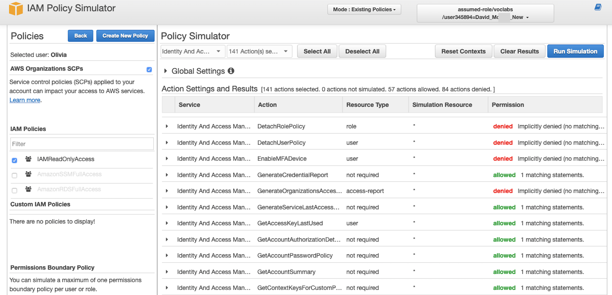
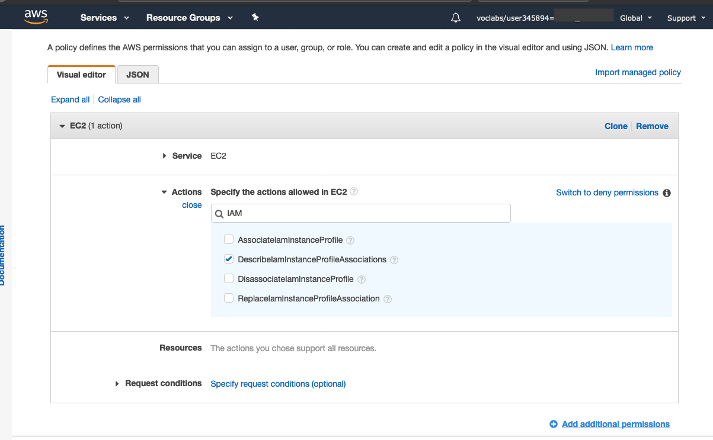
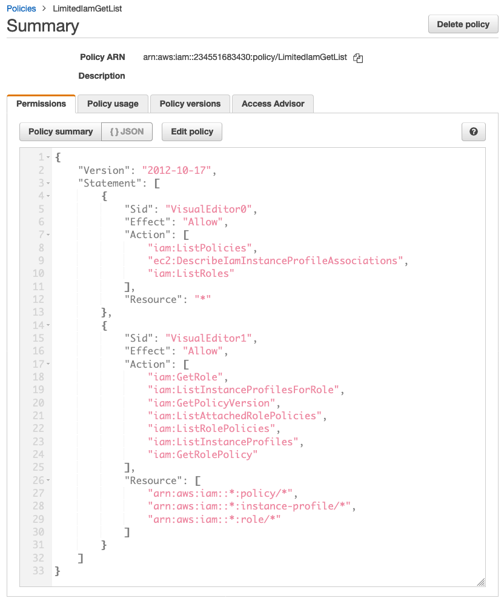

# モジュール 8 - 課題ラボ: IAM を使用した AWS アカウントアクセスの制御

## シナリオ

カフェの AWS インフラストラクチャについて Mateo と話をした後、Sofía はカフェのスタッフによる AWS アカウントの使用方法に関する、基本的なセキュリティ上の懸念のいくつかに対応しなければならないことに気が付きました。

カフェは現在 AWS でのアプリケーションの構築、保守、アクセスを行うチームメンバーを、ロール（デベロッパー、データベース管理者など）ごとに分けられるほどの規模となっています。これまで、各ユーザーに付与するアクセスレベルについて、役割と責任に基づいて明確に定義することは行ってきませんでした。

Sofía は時間をかけて、各スタッフがアカウントで、特に AWS Cloud9、Amazon Elastic Compute Cloud (Amazon EC2)、Amazon Relational Database Service (Amazon RDS) において、何ができる必要があるかについて考えました。いくつかのことを決めたうえで、次の表を作成しました。この表は AWS アカウントでのアクセス権の定義方法を示しています。

| IAM グループ | IAM ユーザー | AWS サービスへのアクセス | 理由 |
| ---------------- | -------- | ------------------------------------------------------------ | ------------------------------------------------------------ |
| AppDevelopers | Nikhil | Amazon EC2 開発環境への **AWS Cloud9** のアクセス。<br />また、**Amazon EC2** への読み取り専用アクセス。 | Nikhil はたいていの場合、アプリケーションデベロッパーとして業務を行っています。カフェのウェブアプリケーションの開発環境用の AWS Cloud9 環境にアクセスできる必要があります。ただし、本番環境にはアクセスできないようにする必要があります。また、すべての Amazon EC2 リソースと設定の詳細は表示できても、変更はできないようにする必要があります。 |
| DBAdministrators | Olivia | **Amazon RDS** へのフルアクセス。<br />また、**AWS Systems Manager** へのフルアクセス。 | Olivia は契約社員のデータベース管理者として雇われ、カフェのウェブアプリケーションが使用するデータベース管理のサポートをしています。したがって、Amazon RDS へのフルアクセス権限が必要です。また、データベース接続情報が保存されている AWS Systems Manager へのアクセスも必要です。しかし、これら 2 つのサービスへのアクセス以上に、Olivia が AWS のリソースへのアクセスを必要とする理由を Sofía は思い付きませんでした。 |

Sofía はユーザーに直接アクセス許可を割り当てる代わりに、**IAM グループ**を定義することにし、これらのグループへのアクセスを許可する IAM ポリシーをアタッチするつもりです。そして、ユーザーを適切なグループに割り当てる予定です。カフェでさらにデベロッパーとデータベース管理者を雇う場合は、新しいユーザーとしてグループに追加していきます。新しいユーザーは、AWS アカウントインフラストラクチャの開発と保守のロールでの適切なアクセス許可を継承します。このアプローチはカフェの規模拡大に伴ってスケールできます。

これで Sofía はどのユーザーにどのアクセス権を割り当てるか整理できたため、早速開始できます。


## ラボの概要と目標
このラボでは、AWS Identity and Access Management (IAM) を使用して、異なるユーザーごとに異なるアクセス権を定義し、アクセスをテストして、調整します。また、IAM ユーザーが AWS アカウントリソースで実行できるアクションに対して、付与したアクセス権がどのような影響を及ぼすかについても確認します。

このラボを完了すると、次のことができるようになります。

- IAM ユーザーと IAM グループを作成し、IAM ポリシーを IAM グループに関連付ける
- 制限されたアクセス権が IAM ユーザーがアクセスできるリソースと、実行できるアクションに対して及ぼす影響を説明する
- AWS マネージド IAM ポリシーを使用して、ユーザーのアクセス権を変更し、結果を確認する
- IAM Policy Simulator を使用して、異なるポリシーごとに付与されたアクセスの範囲を確認する
- IAM アクセスアドバイザーにアクセスして、異なるユーザーが利用しているアクセス権を確認する
- ビジュアルエディタを使用してカスタム IAM ポリシーを作成する


ラボを**開始**すると、AWS のアカウントに次のリソースがすでに作成されています。


このラボの**終了時**には、アーキテクチャに次のリソースと設定が含まれるようになります。


## 所要時間
このラボの所要時間は約 **80 分**です。


## AWS サービスの制限事項
このラボ環境では、AWS のサービスとサービスアクションへのアクセスが、ラボの手順を完了するために必要なものに制限されています。他のサービスへのアクセスや、このラボで説明されているサービス以外のアクションを実行しようとすると、エラーが発生することがあります。


## AWS マネジメントコンソールにアクセスする

1. この手順の上部にある <span id="ssb_voc_grey">Start Lab</span> をクリックし、ラボを起動します。

   [**Start Lab**] パネルが開き、ラボのステータスが表示されます。

   <i class="fas fa-info-circle"></i> **ヒント**: ラボの完了までにさらに時間が必要な場合は、<span id="ssb_voc_grey">Start Lab</span> ボタンをもう一度選択して、この環境のタイマーを再開します。

2. \[**Start Lab**] パネルに **Lab status: ready** というメッセージが表示されたら [**X**] をクリックしてパネルを閉じます。

3. この手順の上部にある <span id="ssb_voc_grey">AWS</span> をクリックします。

   このアクションにより、新しいブラウザタブで AWS マネジメントコンソールが開き、ユーザーは自動的にログインします。

   <i class="fas fa-exclamation-triangle"></i> **ヒント**: 新しいブラウザタブが開かない場合、通常、ブラウザによってサイトのポップアップウィンドウの表示がブロックされたというメッセージが表示されたバナーまたはアイコンがブラウザの上部に表示されます。バナーまたはアイコンを選択して [**ポップアップを許可**] を選択してください。

4. **AWS マネジメントコンソール**タブがこの手順と並べて表示されるようにします。両方のブラウザタブを同時に開いておくと、ラボのステップを実行しやすくなります。

   <i class="fas fa-exclamation-triangle"></i> **特に指示がない限り、リージョンを変更しないでください**。

   **注意**: 画面上部の [**Terminal**] の横にあるチェックボックスをオフにして、表示しないようにすることもできます。


## ビジネス要件: アプリケーションデベロッパー用に AWS アカウントのアクセスを設定する（課題 #1）

カフェではアプリケーションデベロッパーに適したアクセス許可を設定したいと考えています。Sofía の役になって、アクセス権を設定します。その後、Nikhil の役になり、アプリケーションデベロッパーのアクセスをテストします。


### タスク 1: ポリシーと IAM ユーザーを持つ IAM グループを設定する

ラボの最初のタスクでは、AWS アカウント管理者である Sofía として作業を行います。

Sofía として、IAM グループを作成し、AWS マネージドポリシーをグループに割り当てます。次に、新しい IAM ユーザーを作成し、そのユーザーをグループのメンバーとして追加します。その後、開発バージョンのカフェのウェブアプリケーションを実行する既存の EC2 インスタンスに AWS Cloud9 環境を作成します。最後に、新しいユーザーと開発環境を共有します。

**注意**: **どのユーザーとしてログインしているかは、ウェブページの右上部分に表示されます**。現在、**voclabs** ユーザーとしてログインしていると表示されているはずです。このラボでは **voclabs** ユーザーが Sofía です。


5. コンソールで、IAM サービスページを開きます。


6. `AppDevelopers` という名前の **IAM グループ**を作成し、次の IAM ポリシーを添付します。

   - **AmazonEC2ReadOnlyAccess**

   - **AWSCloud9EnvironmentMember**


7. **IAM ユーザー**を作成し、そのユーザーを **AppDevelopers** グループに追加します。

   - **ユーザー名**: `Nikhil`

   - **アクセスの種類**: **AWS マネジメントコンソールへのアクセス**

   - **カスタムパスワード**: `@ppD3veloper2020!`

   - **パスワードのリセットが必要**: このチェックボックスはオフ

   - **AppDevelopers** グループに Nikhil を追加します

   - **注意**: タグを追加する必要はありません

   - [**成功**] 画面において、**任意で** [**.csv のダウンロード**] をクリックし、ファイルをコンピュータに保存できます

   - [**閉じる**] をクリックします


8. **voclabs** ユーザー（Sofía）としてログインしたまま、AWS Cloud9 IDE に接続し、カフェのウェブアプリケーションを設定します。

   - **AWS Cloud9** のサービスページを開き、[**DevCafeServer**] の下にある [**Open IDE**] をクリックします。

      EC2 インスタンスで実行される AWS Cloud9 IDE が表示されます。

   - 画面下の Bash ターミナルウィンドウで、次の 3 つのコマンドを貼り付けて実行します。

      ```bash
            wget https://aws-tc-largeobjects.s3-us-west-2.amazonaws.com/ILT-TF-200-ACACAD-20-EN/mod8-challenge/install-cafe-app.sh
            chmod +x install-cafe-app.sh
            ./install-cafe-app.sh
            ```

      <i class="fas fa-info-circle"></i> **注意**: スクリプトの実行が完了するまで待つ必要は**ありません**。待たずに次の手順に進みます。


9. AWS Cloud9 環境を **Nikhil** ユーザーと共有します。

   - AWS Cloud9 IDE の右上の隅にある [**Share**] をクリックします。

   - [**Share this environment**] パネルの [**Invite Members**] の下に、`Nikhil` と入力し [**Invite**] をクリックします。

   - [**OK**] をクリックし、再度 [**OK**] をクリックします。そして、[**Done**] をクリックします。

      <i class="fas fa-exclamation-triangle"></i> **重要**: AWS Cloud9 IDE ブラウザタブは閉じます。ただし、**voclabs** ユーザー（Sofía）として AWS マネジメントコンソールにログインしているブラウザタブは、少なくとも 1 つは開いたままにしておきます。


### タスク 2: Nikhil としてログインし、アクセスをテストする

このタスクでは、Nikhil として作業を行い、Sofía が設定したアクセス許可をテストします。

<i class="fas fa-info-circle"></i> **ヒント**: シークレットタブまたはプライベートブラウザタブを開き、**Nikhil** としてログインすることをお勧めします。

- 例えば、**Chrome** を使用している場合は、[**ファイル**] > [**新規シークレットウィンドウ**] の順にクリックします。**Firefox** を使用している場合は、[**ファイル**] > [**新規プライベートウィンドウ**] の順にクリックします。

- または、別のブラウザを使用します（例えば、Chrome を使用してタスク 1 を完了した場合は、タスク 2 に Firefox、Edge、Safari を使用します）。

**注意**: シークレットセッション、プライベートセッション、別のブラウザの使用は便利です。**voclabs** ユーザーと別のユーザー（**Nikhil** など）両方に同時にログインした状態を維持できます。それにより、ログアウトとログインを繰り返すことなく、これら 2 つのユーザーアクセスレベルを切り替えられます。異なるブラウザタブの認証されたセッション情報は、互いに独立しています。


10. **Nikhil** として、AWS マネジメントコンソールにログインします。

    - **voclabs** ユーザー（Sofía）としてログインしているブラウザタブで、**IAM** コンソールを開き、ナビゲーションペインの [**ユーザー**] をクリックして **Nikhil** をクリックします。

    - [**認証情報**] タブをクリックし、[**サインイン認証情報**] セクションで [**コンソールのサインインリンク**] をコピーします。

    - リンクをシークレットタブまたはプライベートブラウザタブ（または先ほどのヒントで説明した他のブラウザ）に貼り付けます。

    - [**IAM ユーザーとしてサインイン**] 画面で、Nikhil の認証情報を入力し、[**サインイン**] をクリックします。
       - **ユーザー名**: `Nikhil`

       - **パスワード**: `@ppD3veloper2020!`


11. **Amazon EC2** コンソールを開き、ブラウザタブでカフェのウェブアプリケーションをロードします。

    - 正しい**リージョン**（**バージニア北部**など）になっていることを確認します。必要に応じて正しいリージョンに切り替えます。

    - EC2 インスタンスのすべての詳細が表示されるようになります。

    - **aws-cloud9-DEVCafeServer** インスタンスの **IPv4 パブリック IP アドレス**を見つけ、コピーします。

    - 新しいブラウザタブで、`http://<dev-public-ip-address>/cafe` をロードします。&lt;**dev-public-ip-address**&gt; はコピーをした IP アドレスです。

      カフェのウェブサイトが表示されます。このブラウザタブは、ラボの後半で使用できるように開いたままにしておきます。


12. ウェブサーバーを再起動し、Amazon EC2 アクセスをさらにテストします。

    - **aws-cloud9-DEVCafeServer** インスタンスを再起動してみます。

       <i class="fas fa-info-circle"></i> **ヒント**: [**再起動**] オプションを見つけるには、インスタンスを選択し [**アクション**] ドロップダウンメニューを確認します。


#### Nikhil の Amazon EC2 アクセスに関する質問に解答する

ラボの最後に、青色の [**Submit**] をクリックすると、解答が採点されます。


13. このラボの問題にアクセスします。

    - 手順の上にある<span id="ssb_voc_grey">Details <i class="fas fa-angle-down"></i></span> ドロップダウンメニューから <span id="ssb_voc_grey">Show</span> を選択します。

    - ページ下に表示される [**Access the multiple choice questions**] のリンクをクリックします。

       質問が新しいブラウザタブにロードされます。


14. 今開いたウェブページで、最初の 2 つの質問に答えます。

    - **質問 1**: Nikhil が EC2 インスタンスを再起動しようとしたとき、何が起こりましたか?（Question 1: What happened when Nikhil tried to reboot the EC2 instance?）
    - **質問 2**: Nikhil の AWS Cloud9 環境へのアクセスを許可している IAM ポリシーはどれですか?（Question 2: Which IAM policy allowed Nikhil to access the AWS Cloud9 environment?）

       **注意**: 質問のウェブページはブラウザタブで開いたままにしておいてください。このラボの後半で再度このウェブページに戻ります。


#### Nikhil として開発サーバーにアクセスする

15. **Nikhil** として AWS マネジメントコンソールにログインしているブラウザタブに戻ります。

    **ヒント**: ブラウザインターフェイスの右上の部分で、現在使用しているユーザーが確認できます。


16. **AWS Cloud9** コンソールを参照し、**DevCafeServer** EC2 インスタンスで AWS Cloud9 IDE に接続します。

    - [**サービス**] で [**AWS Cloud9**] をクリックします。

    - 左側の <i class="fas fa-bars"></i> メニューアイコン を展開し、[**Shared with you**] をクリック **DevCafeServer** 環境が使用可能であることを確認します。

    - [**Open IDE**] をクリックします。

       <i class="fas fa-info-circle"></i> **注意**: **aws-cloud9-DEVCafeServer** EC2 インスタンスのゲスト OS にたった今接続しました。先ほど Amazon EC2 コンソールでこのインスタンスを確認しました。IDE を使用して、ウェブサーバー上のファイルを参照し編集できます。また、IDE はインスタンス上で実行される Bash ターミナルも提供します。


17. カフェのウェブサイトの開発インスタンスで、ウェブページのメインの見出しを変更します。

    - エディタでメインのウェブページを開くには、ファイルブラウザで `DEVCafeServer/www/html/cafe` ディレクトリに移動し、**index.php** をダブルクリックします。

    - **13 行目**を以下のように変更します。

      ```html
            <div class="center">Caf&eacute; DEV Site</div>
            ```

    - 変更を保存するには、[**File**] > [**Save**] の順に選択し、ブラウザで `http://dev-public-ip-address/cafe/` ウェブページを更新します。

       Nikhil として作業している際に、開発環境でウェブページのメインの見出しを変更したことに注目してください。


18. ウェブアプリケーションのデータベースの接続をテストします。

    - カフェのウェブサイトで [**Menu**] をクリックします。

    - どのようなメッセージが表示されますか?


19. このラボの複数選択式の質問が表示されているブラウザタブに戻り、次の質問に答えます。

    - **質問 3**: カフェのウェブサイトの開発インスタンスの [**メニュー**] ページにはどのようなメッセージが表示されましたか?（Question 3: Which message was displayed on the Menu page of the cafe website's development instance?）

       <i class="fas fa-comment"></i>Nikhil はデータベース接続パラメータが、AWS Systems Manager Parameter Store に保存されていることを思い出します。


20. **Nikhil** として、Systems Manager パラメータストアを開きます。
    - コンソールで [**Systems Manager**] サービスを開きます。

    - 左側のメニューから [**アプリケーション管理**] の下の [**パラメータストア**] をクリックします。

    - どのようなメッセージが表示されますか?


21. このラボの複数選択式の質問が表示されているブラウザタブに戻り、次の質問に答えます。

    - **質問 4**: Nikhil がコンソールで [**Systems Manager パラメータストア**] ページを開いたとき、どのようなメッセージが表示されましたか?（Question 4: Which message was displayed when Nikhil opened the Systems Manager Parameter Store page in the console?）

    Nikhil は開発サーバーに問題があるため、カフェのウェブアプリケーションを改善できないことを Sofía に伝えます。Sofía はその問題を懸念し、Nikhil に**本番**バージョンのウェブサイトでも同じ問題が発生しているかを確認するよう依頼しました。


22. **Nikhil** として、本番稼働中のカフェのウェブアプリケーションが正常に機能しているかどうかを確認します。

    - **Amazon EC2** コンソールを開き、**PRODCafeServer** インスタンスの [**パブリック IPv4 アドレス**] をコピーします。

    - 新しいブラウザウィンドウで、`http://prod-public-ip-address/cafe/menu.php` をロードします。

    - ウェブページは正しく表示されており、注文ができますか?


## 新しいビジネス要件: データベース管理者用に AWS アカウントアクセスを設定する（課題 #2）

Nikhil が Sofia にテスト結果を報告します。Sofia は本稼働サイトが今も適切に機能していると知り、安心しましたが、開発現場の問題は修正したいと考えています。

Sofia は Olivia に問題解決を依頼しようと決めます。ただし Sofia はまずデータベース管理者の AWS アカウントアクセス権を定義する必要があります。そしてそのアカウントに Olivia がログインできるように、続いて IAM ユーザーリソースを作成する必要もあります。


### タスク 3: データベース管理者のユーザーアクセス用に IAM を設定する

このタスクでは、**Sofia** として作業し、Olivia の AWS アクセスを有効にします。


23. **voclabs** ユーザー（Sofia）としてログインしたブラウザに戻り、**IAM グループ**を `DBAdministrators` という名前で作成し、次の権限を付与します。

    - **AmazonRDSReadOnlyAccess**
    - **AmazonSSMFullAccess**

    **注意**: 実際の状況では、Sofia はデータベース管理者に RDS への読み取り専用アクセス以外の権限も許可する必要があります。ただし、このラボ環境のアクセス許可では、AmazonRDSFullAccess ポリシーをアタッチできません。むしろこのラボでは代わりにAmazonrdsReadOnlyAccess ポリシーを使用する必要があります。


24. `Olivia`という名前で **AWS マネジメントコンソール**へのアクセス権を持つ IAM ユーザーを作成します。

    - カスタムパスワードを `Db@dministrat0r2020!` と設定する

    - パスワードをリセットする要件をクリアする


25. Olivia を **DBAdministrators** グループに追加します。


### タスク 4: データベース管理者としてログインし、データベース接続の問題を解決する

このタスクでは **Olivia** として作業し、Nikhi が特定したデータベースの問題を解決します。また、**Sofía** として Olivia がいくつかの問題を解決するのをサポートします。


26. **Olivia** として AWS マネジメントコンソールにログインします。

    <i class="fas fa-info-circle"></i> **ヒント**: シークレットセッション、プライベートセッションなど、Nikhi としてログインするとき使用したブラウザタイプを使用します。方法:

    - コンソール右上の **Nikhil @ &lt;**アカウント番号**&gt;** を選択し、[**サインアウト**] をクリックします。

    - 次に [**もう一度ログインする**] をクリックします。

       [**IAM ユーザーとしてサインイン**] 画面が表示されます。[**アカウント ID**] は事前入力済みです。

       <i class="fas fa-info-circle"></i> **注意**: ログイン画面にアカウント ID が表示されていない場合は、**voclabs** ユーザー（Sofía）としてログインしているブラウザタブまで戻ります。IAM コンソールで [**ユーザー**] をクリックして **Olivia** をクリックします。[**認証情報**] タブをクリックします。[**サインイン認証情報**] セクションで**コンソールへのサインインリンク**をコピーします。

    - 以下の Olivia の認証情報を使用してサインインします。
       - **ユーザー名**: `Olivia`

       - **パスワード**: `Db@dministrat0r2020!`


27. RDS データベースが実行中であることを確認します。

    - **Amazon RDS** コンソールを開き [**データベース**] をクリックします。

    - このデータベースインスタンスの [**ステータス**] が [**使用可能**] であることを確認します。

    Olivia はデータベースが実行中であることを確認します。

    Olivia は開発環境が Systems Manager パラメータストアに格納されているパラメータを使用してデータベースに接続することを思い出します。**DevCafeServer** EC2 インスタンスにはパラメータストアからパラメータを読み取るアクセス許可があるかもしれないと Olivia は思いました。


28. **Amazon EC2** コンソールを開き [**実行中のインスタンス**] をクリックします。


29. このラボの複数選択式の質問が表示されているブラウザタブに戻り、次の質問に答えます。

    - **質問 5**: Olivia が EC2 インスタンスの詳細にアクセスできない理由は何ですか?（Question 5: Why can't Olivia access the EC2 instance details?）

    Olivia は、自分が EC2 インスタンスにアクセスできないことを Sofia に伝え、Sofía はこの問題のトラブルシューティングを行うためにコンソールに戻ります。

    今度は **Sofia** として、AWS のリソースに対して Olivia が持つアクセス許可をレビューし、更新します。


30. **voclabs** ユーザー（Sofía）としてログインしているブラウザタグまで戻ります。


31. **DBAdministrators** グループを開き、次のポリシーを添付します。
    - **AmazonEC2ReadOnlyAccess**
    - **IAMReadOnlyAccess**

    **注意**: EC2 インスタンスに添付された IAM ロールの詳細にアクセスする必要がある場合、Olivia には IAM アクセス許可が必要であることを Sofia は理解します。


32. 引き続き **voclabs** ユーザー（Sofía）として、Olivia が使用したサービスと機能を確認します。

    - IAM コンソールでユーザー **Olivia** を開き [**アクセスアドバイザー**] タブをクリックします。
    - Olivia が利用したサービス分野が表示されていることに注目してください。最近のサービスアクティビティは通常、4 時間以内に表示されます（アクセスアドバイダーの詳細に記されているとおり）。Olivia が**最後にアクセスしたデータ**はまだ表示されていない可能性があります。

       <i class="fas fa-info-circle"></i>このビューを使用して、ユーザーのアクセス権限が必要以上に大きいかどうかを知ることができます。この情報に基づき、より厳密に[最小権限の原則](https://docs.aws.amazon.com/IAM/latest/UserGuide/best-practices.html#grant-least-privilege)に準拠するようアクセス権を調整できます。

       Sofia は、Olivia に自分の Amazon EC2 アクセスを確認するよう依頼します。


33. **Olivia** として、ユーザー Olivia がログインしているブラウザタブに戻り、**Amazon EC2** コンソールのインスタンスページを更新します。

    - 今度は Olivia でも、実行中の両方の EC2 インスタンスにアクセスできます。

    - **aws-cloud9-DEVCafeServer** インスタンスを選択します。

    - [**詳細**] タブで [**IAM ロール**] を見つけ、**CafeRole** をクリックします。

    - [**アクセス権限**] タブで **AmazonSSMManagedInstanceCore** ポリシーを展開し、[**JSON**] 表示オプションをクリックします。

    - ポリシーのアクセス許可をレビューします。


34. このラボに関する選択式の質問が表示されたブラウザタブに戻り、次の質問に答えます。

    - **質問 6**: ポリシー内で、このインスタンスのカフェウェブアプリケーションにパラメータストアのデータベース認証情報へのアクセスを許可する 2 つのアクションを具体的に指摘してください。（Question 6: Name two specific actions in the policy that allow the cafe's web application on this instance to access the database credentials in the Parameter Store.）

    Olivia は今では開発用 EC2 インスタンスがパラメータストアにアクセスできると確信しています。問題は何か別の部分にあると思われます。Olivia は問題について Sofía と話し合います。

    Sofia はしばらく会話した後で、以前は開発環境がローカルデータベースを使用していたこと、ところが今では Amazon RDS を使用していることを思い出します。ローカルデータベースには、Web アプリケーションがデータベースに接続できる別のユーザー名がありました。Amazon RDS のデータベースに接続するには、別のデータベースユーザー名が必要です。これこそが問題に違いありません。

    Sofía は Olivia に、データベースのユーザー名が問題になっているかどうかを確認し、データベースのユーザー名を更新するよう依頼します。


35. **Olivia** として、Systems Manager パラメータストアで **dbUser** の値を更新します。


36. 開発カフェサーバーのウェブアプリケーションで、[**Menu**] ページを更新します。

    - このウェブページがまだ開いていない場合は、ブラウザで`http://<dev-public-ip-address>/cafe/menu.php` を開きます (&lt;**dev-public-ip-address**&gt; には **aws-cloud9-DEVCafeServer** インスタンスに実際に割り当てられた IPv4 パブリック IP アドレスを代入します)。

    - コンテンツページ全体が正しく表示されるようになりましたか? 注文を正常に送信できますか?

    おめでとうございます! **DBAdministrators** グループのメンバーとして行動し、ウェブサイトの問題を解決しました。Olivia は問題を解決したことについて Nikhi から礼の言葉を受け、Sofia にも問題が解決したことを連絡します。


## 新しいビジネス要件: IAM ユーザーアクセスの調整（課題 #3）

Frank と Martha は、Sofía とチームが AWS アカウントのセキュリティを向上させたことを喜びます。一方 Sofía は、アプリケーションデベロッパーとデータベース管理者に異なるアクセス許可を設定できたことに満足しています。Sofia は、ロールごとに別のアクセス許可を割り当てることで、各チームメンバーが自分のコアコンピテンシー分野、割り当てられた責任の範囲で開発の遂行と問題のトラブルシューティングに向けて取り組み、チームメンバー間で連携できる点を評価しています。

Sofía は友人たちと一息入れていますが、すでに、自分がさまざまなユーザーに割り当てたセキュリティ設定のさらなるカスタマイズについて考えています。一部のアクセス許可はまだ緩やか過ぎ、完全には最小権限の原則に準拠していません。このラボでの最終課題は、Sofía の立場で操作します。データベース管理者グループのメンバーに許可される IAM アクションの数を減らす、カスタム IAM ポリシーを定義するために取り組みます。ただし、同時に各自の責任を果たすうえで十分な IAM アクセスを各メンバーに付与する必要があります。


### タスク 5: IAM Policy Simulator を使用し、ビジュアルエディタでカスタム IAM ポリシーを作成する

37. **voclabs** ユーザー（Sofía）としてログインしているブラウザウィンドウに戻り、ブラウザの新しいタブでこの URL (https://policysim.aws.amazon.com/) をロードします。

    IAM Policy Simulator ページが開きます。


38. ユーザー **Olivia** をクリックします。


39. \[**IAM ポリシー**] リストで **IAMReadOnlyAccess** ポリシーが選択されていることを確認します。また一方で別のポリシーの選択を**クリア**します。


40. \[**Policy Simulator**] セクションで [**Select service**] をクリックします。[**Filter**] ボックスに `Ident` と入力し、[**Identity and Access Management**] を選択します。


41. \[**Select All**] オプション（[**Select actions**] メニューの右）をクリックしてから、[**Run Simulation**] をクリックします。

    - [**Action Settings and Results**] パネルにアクションリストが表示されます。

    - [**Permissions**] 列には各アクションに対する Olivia のアクセス許可が表示されています。**IAMReadOnlyAccess** ポリシーでは、Olivia がアクションを**追加**または**作成**するアクセス許可が拒否されています。とりあえずスクロールして、Olivia の実行**できる**アクションを確認します。

    - 概要（リスト上部）を見ると、Olivia に現在 **57 種類の IAM アクション**が許可されていることがわかります。




Sofía は自分が Olivia に **IAMReadOnlyAccess** ポリシーによるアクセス許可を付与した唯一の理由を思い出します。Olivia に特定のポリシーの詳細を確認するアクセス許可を付与するためでした。これらのポリシーは、2 つのカフェサーバーインスタンスに添付されています。Sofía は **DBAdministrators** のメンバーのために、より制限の大きい IAM ポリシーを新しく作成することにします。

次の手順では、Sofía としてこの新しいポリシーを作成します。


42. **voclabs** ユーザー（Sofía）としてログインしているブラウザタグまで戻ります。


43. **IAM** コンソールのナビゲーションペインで [**ポリシー**] をクリックしてから [**ポリシーの作成**] をクリックします


44. \[**ビジュアルエディタ**] タブで次の設定値を設定します。

    - [**サービスの選択**] をクリックします。**EC2** を検索してクリックします。

       - [**アクション**] ボックスで **IAM** を検索し [**DescribeIamInstanceProfileAssoci**] チェックボックスをオンにします。

       

    - 画面下部で [**さらにアクセス許可を追加する**] をクリックします。

    - [**サービスの選択**] をクリックします。**IAM** を検索してクリックします。

       - [**アクション**] ボックスで **Get** を検索し、次のアクションのチェックボックスをオンにします。
          - **GetPolicyVersion**
          - **GetRole**
          - **GetRolePolicy**
       - 検索ボックスに戻って **List** を検索し、次のアクションのチェックボックスをオンにします。
          - **ListAttachedRolePolicies**
          - **ListInstanceProfiles**
          - **ListInstanceProfilesForRole**
          - **ListPolicies**
          - **ListRolePolicies**
          - **ListRoles**

    - [**リソース**] セクションを展開し、3 つのリソースタイプ（**instance-profile**、**policy**、**role**) すべてで [**このアカウント内のいずれか**] チェックボックスをオンにします。

    - 画面上部に戻り、[**JSON**] タブをクリックします

       このビューには、ビジュアルエディタを使用して作成したばかりのJSON ドキュメントが表示されます。

    - ポリシードキュメントの詳細が、次の例に示す内容と一致することを確認します。




残念ながら、このラボ環境では、IAM ポリシーを作成するアクセス許可を付与できません。[**ポリシーの確認**] ページでポリシー名を指定してから [**ポリシーの作成**] をクリックすると、アクセス許可エラーが発生します。

ただし、ポリシー例と完全に一致するポリシーは、このラボを開始したときに作成されています。以上でビジュアルエディタの使用を経験しました。また、JSON ポリシードキュメントを最初から作成しなくても、きめ細かなポリシーを作成する方法も経験しました。


45. \[**キャンセル**] をクリック [**ポリシーの作成**] ウィザードを終了します。


46. \[**ポリシーのフィルタ**] 検索ボックスで `LimitedIamPolicy` を検索します。

    前の画面キャプチャに示されているとおり、ポリシーの詳細が、ビルドしようとしてきたとおりであることを確認します。

    **注意**: ポリシー内の **SID** 要素は任意です。またポリシードキュメント内で **Effect**、**Action**、[**Resource** が出現する順番は、ポリシーの動作に影響しません。


47. **DBAdministrators** IAM グループを編集します。

    - **LimitedIamPolicy** ポリシーを**アタッチ**する
    - **IAMReadOnlyAccess** ポリシーを**デタッチ**する

    Sofía は、今回 Olivia に割り当てられた、より制限が強い IAM アクセス権でも、Olivia が IAM ロール **CafeRole** の詳細にアクセスできることを確認するよう Olivia に依頼します。


48. **Olivia** としてログインしたブラウザ タブに戻り、今でも **CafeRole** の詳細アクセスできることを確認します。

    - **IAM** コンソールで [**IAM ロール**] の [**CafeRole**] をクリックします。
    - **AmazonSSMManagedInstanceCore** ポリシーを展開し、今でも JSON ドキュメントの詳細を表示できることを確認します。


49. **（任意）** ブラウザで **voclabs**ユーザー（Sofía）としてログインしている [**IAM Policy Simulator**] タブに戻ります。再度シミュレーションを実行します（Olivia の実行できる IAM アクションについて）。
    - <i class="fas fa-info-circle"></i> **ヒント**: Olivia に適用される新しい IAM ポリシーを表示するには、ブラウザページを更新します。
    - **DBAdministrators** IAM グループの変更以前は、Olivia には IAM サービスに関連する 57 種類のアクションの実行が許可されていました。ところが変更後は、IAM サービスへのアクセスがはるかに制限されています。
    - 新しいポリシーでは付与される IAM アクセス許可が少なくなっています。ただし Olivia は自分の職能を果たすために依然としてアクセス権を必要としています。


## カフェの近況


Sofía は自分が AWS アカウントへのユーザーアクセス管理を上手にできるようになってきていると考えています。

**AWS マネージド IAM ポリシー**を使用してアクセスをコントロールする方法を知っています。また別のポリシーが付与するアクセス許可の範囲についても、**IAM Policy Simulator** を使用して確認する方法を知っています。**IAM Access Analyzer** にアクセスして、ユーザーごとにそれぞれの使用しているアクセス権を確認する方法がわかります。そして最後に、IAM ポリシーのビジュアルエディタを使用した**カスタム IAM ポリシー**の作成も練習しました。


## 作業内容を送信する
50. この手順の上部にある <span id="ssb_blue">Submit</span> をクリックして進捗情報を記録し、プロンプトが表示されたら [**Yes**] をクリックします。


51. 数分経っても結果が表示されない場合は、この手順の上部に戻り、<span id="ssb_voc_grey">Grades</span> をクリックします。

    **ヒント**: 作業内容は何度も送信できます。作業内容を変更したら、再度 [**Submit**] をクリックします。最終送信分がこのラボの作業内容として記録されます。


52. 作業に関する詳細なフィードバックを参照するには、<span id="ssb_voc_grey">Details</span> ドロップダウンメニューから <i class="fas fa-caret-right"></i> [**View Submission Report**] を選択します。


## ラボの終了

<i class="icon-flag-checkered"></i>お疲れ様でした。以上でラボは終了です。

53. ラボを終了するには、このページの上部にある <span id="ssb_voc_grey">End Lab</span> をクリックし、<span id="ssb_blue">Yes</span> をクリックします。

    パネルに **DELETE has been initiated... You may close this message box now** というメッセージが表示されます。

54. 右上隅の [**X**] をクリックしてパネルを閉じます。


**©2020 Amazon Web Services, Inc. and its affiliates. All rights reserved. このトレーニング内容の全体または一部を複製または再配布することは、Amazon Web Services, Inc. の書面による事前の許可がある場合を除き、禁じられています。商業目的のコピー、貸与、または販売を禁止します。**
