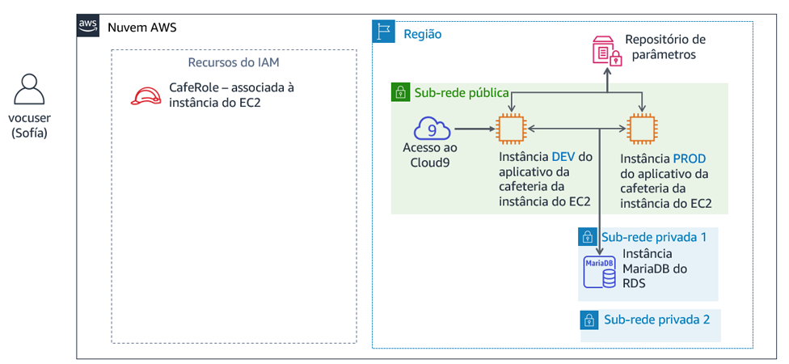
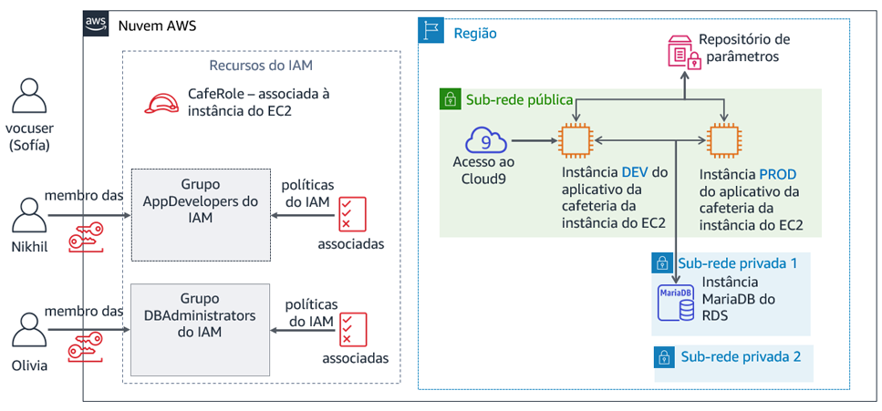

# Módulo 8 – Laboratório de desafio: Controlar o acesso à conta da AWS usando o IAM

## Cenário

Depois de falar com Mateo sobre a infraestrutura da AWS da cafeteria, Sofía percebeu que ela precisa abordar algumas questões básicas de segurança sobre a maneira como a equipe da cafeteria tem usado a conta da AWS.

A cafeteria agora é grande o suficiente para que os membros da equipe que criam, mantêm ou acessam aplicações na AWS se especializem em funções (como desenvolvedor ou administrador de banco de dados). Até agora, eles não fizeram um esforço para definir claramente o nível de acesso que cada usuário deveria ter com base em suas respectivas funções e responsabilidades.

Sofía passou algum tempo pensando sobre o que cada pessoa deve ser capaz de fazer na conta, especialmente no que se refere ao AWS Cloud9, Amazon Elastic Compute Cloud (Amazon EC2) e Amazon Relational Database Service (Amazon RDS). Ela tomou algumas decisões e criou este gráfico, que descreve como ela definiria os direitos de acesso na conta da AWS:

| Grupo do IAM | Usuário do IAM | Acesso ao serviço da AWS | Motivo |
| ---------------- | -------- | ------------------------------------------------------------ | ------------------------------------------------------------ |
| AppDevelopers | Nikhil | Acesso do **AWS Cloud9** ao ambiente de desenvolvimento do Amazon EC2. <br />Além disso, acesso somente leitura ao **Amazon EC2**. | Nikhil muitas vezes trabalha como desenvolvedor de aplicações. Ele precisa ter acesso ao ambiente do AWS Cloud9 para ver o ambiente de desenvolvimento da aplicação Web da cafeteria. No entanto, ele não deveria ter acesso ao ambiente de produção. Ele também precisa ver todos os recursos do Amazon EC2 e detalhes da configuração, mas sem poder modificá-los. |
| DBAdministrators | Olivia | Acesso total ao **Amazon RDS**. <br />Além disso, acesso total ao **AWS Systems Manager**. | Olivia foi contratada como administradora de banco de dados para ajudar a gerenciar o banco de dados usado pela aplicação Web da cafeteria. Portanto, ela precisar ter todos os direitos de acesso ao Amazon RDS. Ela também precisará de acesso ao AWS Systems Manager, onde são armazenadas as informações de conexão do banco de dados. No entanto, além do acesso a esses dois serviços, Sofía não consegue pensar em nenhuma razão pela qual Olivia precisaria de mais acesso aos recursos da AWS. |

Observe que, em vez de atribuir permissões diretamente aos usuários, Sofía decidiu definir *grupos do IAM*. Em seguida, ela associará as políticas do IAM que concedem acesso a esses grupos. Em seguida, ela planeja alocar usuários aos grupos apropriados. Se a cafeteria contratar mais desenvolvedores ou administradores de banco de dados, ela poderá adicioná-los a esses grupos como novos usuários. Esses novos usuários herdarão as permissões corretas para sua função no desenvolvimento e manutenção da infraestrutura de contas da AWS. Essa abordagem será dimensionada de acordo com o crescimento da cafeteria.

Agora que Sofía sabe quais direitos de acesso ela quer atribuir a quais usuários, ela está pronta para começar!


## Visão geral e objetivos do laboratório
Neste laboratório, você usará o AWS Identity and Access Management (IAM) para definir diferentes direitos de acesso para usuários distintos. Você testará e ajustará o acesso, além de observar como os direitos concedidos afetam as ações que os usuários do IAM podem executar nos recursos da conta da AWS.

Depois de concluir este laboratório, você deverá ser capaz de:

- Criar usuários e grupos do IAM e associar políticas do IAM a esses grupos
- Indicar como direitos de acesso limitados afetam os recursos que os usuários do IAM podem acessar e as ações que podem realizar
- Usar políticas do IAM gerenciadas pela AWS para modificar os direitos de acesso do usuário e observar os resultados
- Usar o simulador de políticas do IAM para observar o escopo de acesso concedido por diferentes políticas
- Acessar o consultor de acesso do IAM para observar quais direitos de acesso os usuários utilizam
- Criar políticas personalizadas do IAM usando o editor visual


Quando você *inicia* o laboratório, os seguintes recursos já estarão na conta da AWS:



No *final* deste laboratório, sua arquitetura incluirá os seguintes recursos e configurações:




## Duração
Este laboratório levará aproximadamente **80 minutos** para ser concluído.


## Restrições de serviço da AWS
Neste ambiente de laboratório, o acesso aos serviços e ações de serviço da AWS pode estar restrito àqueles necessários para concluir as instruções do laboratório. Você poderá encontrar erros se tentar acessar outros serviços ou executar ações além do que está descrito neste laboratório.


## Acessar o Console de Gerenciamento da AWS

1. Na parte superior destas instruções, escolha <span id="ssb_voc_grey">Start Lab</span> (Iniciar laboratório) para iniciar o laboratório.

   Um painel **Start Lab** (Iniciar laboratório) é aberto com o status do laboratório.

   <i class="fas fa-info-circle"></i> **Dica**: se você precisar de mais tempo para concluir o laboratório do que o exibido no cronômetro, escolha o botão <span id="ssb_voc_grey">Start Lab</span> (Iniciar laboratório) novamente para reiniciar o cronômetro do ambiente. Isso não excluirá os recursos que você criou.

    

2. Aguarde até que a mensagem *Lab status: ready (Status do laboratório: pronto)* seja exibida e feche o painel **Start Lab** (Iniciar laboratório) escolhendo **X**.
    

3. Na parte superior destas instruções, escolha <span id="ssb_voc_grey">AWS</span>.

   O Console de Gerenciamento da AWS será aberto em uma nova guia do navegador. O sistema fará o seu login automaticamente.

   **Dica**: se uma nova guia do navegador não for aberta, normalmente você verá uma faixa ou um ícone na parte superior do navegador com uma mensagem informando que o navegador está impedindo que o site abra janelas pop-up. Escolha a faixa ou o ícone e depois **Allow pop ups** (Permitir pop-ups).

4. Organize a guia do Console de Gerenciamento da AWS para que ela seja exibida com essas instruções. O ideal é ver as duas guias do navegador abertas ao mesmo tempo, para facilitar o acompanhamento das etapas do laboratório.

   **Observação**: você também pode desmarcar a caixa ao lado de Terminal na parte superior da tela para ocultá-la.


## Uma exigência de negócios: Configurar o acesso à conta da AWS para desenvolvedores de aplicações (Desafio nº 1)

A cafeteria quer configurar as permissões de acesso apropriadas para desenvolvedores de aplicações. Você assumirá o papel de Sofía para configurar o acesso. Em seguida, assumirá o papel de Nikhil e testará o acesso para desenvolvedores de aplicações.


### Tarefa 1: configurar um grupo do IAM com políticas e um usuário do IAM

Nesta primeira tarefa no laboratório, você trabalhará como Sofía, a administradora de contas da AWS.

Como Sofía, você criará um grupo do IAM e atribuirá a ele políticas gerenciadas da AWS. Em seguida, você criará um novo usuário do IAM e o adicionará como membro do grupo. Em seguida, você criará um ambiente do AWS Cloud9 na instância do EC2 existente em que a versão de desenvolvimento da aplicação Web da cafeteria é executada. Finalmente, você compartilhará o ambiente de desenvolvimento com o novo usuário.

**Observação**: *o usuário usado no login é mostrado na área superior direita da página da Web*. No momento, você deve estar logado como um usuário *voclabs*. Neste laboratório, imagine que o usuário *voclabs* é Sofía.


5. No console, abra a página de serviço do IAM.

   


6. Crie um **grupo do IAM** chamado `AppDevelopers` e associe as seguintes políticas do IAM a ele:

    - **AmazonEC2ReadOnlyAccess**

    - **AWSCloud9EnvironmentMember**
    
      


7. Crie um **usuário do IAM** e adicione o usuário ao grupo *AppDevelopers*.

   - **Nome de usuário**: `Nikhil`

   - **Tipo de acesso**: *acesso ao Console de Gerenciamento da AWS*

   - **Senha personalizada**: `@ppD3veloper2020!`

   - **Exigir redefinição de senha**: desmarque esta caixa

   - Adicione Nikhil ao grupo *AppDevelopers*

   - **Observação**: você não precisa adicionar tags.

   - Na tela **Success** (Sucesso), você pode *opcionalmente* escolher **Download .csv (Fazer download do .csv)** e salvar o arquivo no computador

   - Escolha **Close** (Fechar)

     

8. Enquanto ainda estiver usando o login de usuário *voclabs* (Sofía), conecte-se ao AWS Cloud9 IDE e configure a aplicação Web da cafeteria.

   - Abra a página do serviço **AWS Cloud9** e, em **DEVCafeServer**, escolha **Open IDE** (Abrir IDE).

      O IDE do AWS Cloud9 que é executado em uma instância do EC2 deve ser exibido.

   - Na janela do terminal do Bash, na parte inferior da tela, cole e execute estes três comandos:

      ```bash
      wget https://aws-tc-largeobjects.s3-us-west-2.amazonaws.com/ILT-TF-200-ACACAD-20-EN/mod8-challenge/install-cafe-app.sh
      chmod +x install-cafe-app.sh
      ./install-cafe-app.sh
      ```

      <i class="fas fa-info-circle"></i> **Observação**: você *não* precisa esperar que o script termine a execução. Em vez disso, vá para a próxima etapa.
      
      

9. Compartilhe o ambiente do AWS Cloud9 com o usuário *Nikhil*.

   - No canto superior direito do IDE do AWS Cloud9, escolha **Share** (Compartilhar).

   - No painel **Share this environment** (Compartilhar este ambiente), em **Invite Members** (Convidar membros), insira `Nikhil` e escolha **Convidar**.

   - Escolha **OK** e **OK** novamente. Depois, **Done** (Concluído).

      <i class="fas fa-exclamation-triangle"></i> **Importante**: feche a guia do navegador do IDE do AWS Cloud9, mas deixe aberta pelo menos uma outra guia do navegador em que você esteja conectado ao Console de Gerenciamento da AWS como o usuário *voclabs* (Sofía).


### Tarefa 2: fazer login como Nikhil e testar o acesso

Nesta tarefa, você trabalhará como Nikhil para testar as permissões de acesso que a Sofía configurou.

<i class="fas fa-info-circle"></i> **Dica**: recomendamos abrir uma guia de navegação anônima ou privada para fazer login como *Nikhil*.

- Por exemplo, se você estiver usando o *Chrome*, escolha **File** (Arquivo) > **New Incognito Window (Nova janela anônima)**. Se você estiver usando o *Firefox*, escolha **File** (Arquivo) > **New Private Window** (Nova janela privada).

- Você também pode usar um navegador diferente (por exemplo, se usou o Chrome para concluir a Tarefa 1, use o Firefox, Edge ou Safari para a Tarefa 2).

**Observação**: é conveniente usar uma sessão anônima, uma sessão privada ou um navegador diferente. Você pode manter o login de usuário *voclabs* e também de outro usuário (como *Nikhil*) simultaneamente. Assim, é possível alternar entre esses dois níveis de acesso sem precisar fazer logout ou fazer login repetidamente. As informações da sessão autenticada nas diferentes guias do navegador serão isoladas umas das outras.


10. Faça login no Console de gerenciamento da AWS como *Nikhil*.

    - Na guia do navegador onde você está conectado como o usuário *voclabs* (Sofía), abra o console do **IAM** e escolha **Users** (Usuários) e **Nikhil**.

    - Abra a guia **Security credentials (Credenciais de segurança)** e, na seção **Sign-in credentials** (Credenciais de login), copie o **Console sign-in link** (link de login do console).

    - Cole o link em uma guia de navegação anônima ou privada (ou outro navegador, conforme explicado na dica anterior).

    - Na tela **Sign in as IAM user** (Fazer login como usuário do IAM), insira as credenciais de Nikhil e escolha **Sign in** (Fazer login).
       - **Nome de usuário do IAM**: `Nikhil`

       - **Senha**: `@ppD3veloper2020!`
      
        

11. Abra o console do **Amazon EC2** e, em uma guia do navegador, carregue a aplicação Web da cafeteria.

    - Verifique se você está na **região** correta (por exemplo, *Norte da Virgínia*) e mude para ela, se necessário.

    - Você deve ser capaz de visualizar todos os detalhes das instâncias do EC2.

    - Localize e copie o **endereço IP público IPv4** da instância **aws-cloud9-DEVCafeServer**.

    - Em uma nova guia do navegador, carregue `http://<dev-public-ip-address>/cafe`, em que &lt;*dev-public-ip-address*&gt; é o endereço IP copiado.

       O site da cafeteria deve ser exibido. Mantenha essa guia do navegador aberta para consultá-la posteriormente no laboratório.
      
      


12. Reinicie o servidor da Web para testar ainda mais o acesso ao Amazon EC2.

    - Tente reiniciar a instância *aws-cloud9-DEVCafeServer*

       <i class="fas fa-info-circle"></i> **Dica**: para localizar a opção **Reboot** (Reiniciar), selecione a instância e procure no menu **Actions** (Ações).


#### Responder a perguntas sobre o acesso ao Amazon EC2 de Nikhil

As respostas serão verificadas quando você escolher o botão azul **Submit** (Enviar) no final do laboratório.


13. Acesse as perguntas deste laboratório.

    - Acima dessas instruções, escolha o menu <span id="ssb_voc_grey">Details<i class="fas fa-angle-down"></i></span> (Detalhes) e <span id="ssb_voc_grey">Show</span> (Mostrar).

    - Escolha o link **Access the multiple choice questions** (Acessar as perguntas de múltipla escolha) na parte inferior da página.

      As perguntas devem ser carregadas em uma nova guia do navegador.


14. Na página que você acabou de abrir, responda às duas primeiras perguntas:

    - **Pergunta 1**: O que aconteceu quando Nikhil tentou reiniciar a instância do EC2?
    - **Pergunta 2**: Qual política do IAM permitiu que Nikhil acessasse o ambiente  AWS Cloud9?

       **Observação**: deixe a página da Web de perguntas abertas na guia do navegador, pois você a consultará de novo mais adiante neste laboratório.


#### Acessar o servidor de desenvolvimento como Nikhil

15. Retorne à guia do navegador em que você está conectado ao Console de Gerenciamento da AWS como *Nikhil*.

    **Dica**: lembre-se de que é possível ver qual usuário você está usando na área superior direita da interface do navegador.


16. Navegue até o console do **AWS Cloud9** e conecte-se ao IDE do AWS Cloud9 na instância *DEVCafeServer* do EC2.

    - No menu **Services** (Serviços), escolha **AWS Cloud9**.

    - À esquerda, use o ícone <i class="fas fa-bars"></i> (menu) para expandir o menu e escolha **Shared with you** (Compartilhado com você). Verifique se o ambiente **DEVCafeServer** está disponível.

    - Escolha **Open IDE** (Abrir IDE).

       <i class="fas fa-info-circle"></i> **Observação**: você acabou de se conectar ao SO convidado da instância *aws-cloud9-DEVCafeServer* do EC2. Você observou essa instância no console do Amazon EC2 pouco tempo atrás. Você pode usar o IDE para navegar e editar arquivos no servidor Web. Ele também fornece um terminal Bash que é executado na instância.


17. Na instância de desenvolvimento do site da cafeteria, modifique o cabeçalho principal da página da Web.

    - Abra a página principal no editor acessando o navegador de arquivos, navegando para o diretório `DEVCafeServer/www/html/cafe` e clicando duas vezes em **index.php**.

    - Modifique a **linha 13** conforme mostrado abaixo:

    ```html
    <div class="center">Caf&eacute; DEV Site</div>
    ```

    - Para salvar a alteração, escolha **File (Arquivo) > Save (Salvar)** e, no navegador, atualize a página da Web `http://dev-public-ip-address/cafe/`.

       Observe que, enquanto atuava como Nikhil, você alterou o cabeçalho principal da página da Web no ambiente de desenvolvimento.


18. Teste a conectividade do banco de dados de aplicações Web.

    - No site da cafeteria, escolha **Menu**.

    - Que mensagem é exibida?


19. Retorne à guia do navegador com as perguntas de múltipla escolha deste laboratório e responda à seguinte pergunta:

    - **Pergunta 3**: Qual mensagem foi exibida na página **Menu** da instância de desenvolvimento do site da cafeteria?

       <i class="fas fa-comment"></i> Nikhil lembra que os parâmetros de conexão de banco de dados são armazenados no AWS Systems Manager Parameter Store.


20. Como *Nikhil*, abra o repositório de parâmetros do Systems Manager.
    - No console, abra o serviço **Systems Manager**.

    - No menu à esquerda, escolha **Application Management** (Gerenciamento de aplicações) > **Parameter Store** (Repositório de parâmetros).

   - Que mensagem é exibida?


21. Retorne à guia do navegador com as perguntas de múltipla escolha deste laboratório e responda à seguinte pergunta:

    - **Pergunta 4**: Qual mensagem foi exibida quando Nikhil abriu a página do repositório de parâmetros do Systems Manager no console?

    Nikhil alerta Sofía sobre o problema no servidor de desenvolvimento que o impede de aprimorar a aplicação Web da cafeteria. Sofía está preocupada. Ela pede a Nikhil para verificar se a versão de *produção* do site está tendo o mesmo problema.


22. Como *Nikhil*, verifique se a aplicação Web de produção da cafeteria está funcionando corretamente.

    - Abra o console do **Amazon EC2** e copie o **endereço IP público IPv4** da instância **PRODCafeServer**.

    - Em uma nova janela do navegador, carregue `http://prod-public-ip-address/cafe/menu.php`.

    - A página da Web é exibida corretamente e você consegue fazer pedidos?


## Nova exigência de negócios: Configurar o acesso à conta da AWS para administradores de banco de dados (Desafio nº 2)

Nikhil relata os resultados do teste para Sofía. Ela está feliz em saber que o espaço de produção ainda está funcionando bem. No entanto, Sofía quer corrigir o problema no espaço de desenvolvimento.

Sofía decide pedir para Olivia corrigir o problema. No entanto, a Sofía deve primeiro definir os direitos de acesso à conta da AWS para administradores de banco de dados. Ela deve então criar um recurso de usuário do IAM para que a Olivia possa fazer login na conta.


### Tarefa 3: configurar o IAM para acesso de usuário administrador do banco de dados

Nesta tarefa, você trabalhará como *Sofía* para permitir que Olivia acesse a AWS.


23. De volta ao navegador onde você está usando o login de usuário *voclabs* (Sofía), crie um **grupo IAM** chamado `DBAdministrators`, com as seguintes permissões:

    - **AmazonRDSReadOnlyAccess**
    - **AmazonSSMFullAccess**

    **Observação**: em uma situação real, Sofía precisaria conceder mais do que acesso somente leitura ao RDS para seus administradores de banco de dados. No entanto, as permissões deste ambiente de laboratório não permitem associar a política AmazonRDSFullAccess. Em vez disso, para este laboratório, você precisa usar a política AmazonRDSReadOnlyAccess como substituta.

    

24. Crie um usuário do IAM chamado `Olivia` com acesso ao **Console de Gerenciamento da AWS**.

    - Defina uma senha personalizada: `Db@dministrat0r2020!`

    - Desmarque a exigência de redefinição da senha


25. Adicione Olivia ao grupo **DBAdministrators**.


### Tarefa 4: fazer login como administrador do banco de dados e resolver o problema de conectividade de banco de dados

Nesta tarefa, você trabalhará como *Olivia* para resolver o problema do banco de dados que Nikhil identificou. Você também trabalhará como *Sofía* para ajudar Olivia a resolver alguns problemas.


26. Faça login no Console de gerenciamento da AWS como *Olivia*.

    <i class="fas fa-info-circle"></i> **Dica**: use a sessão anônima, sessão privada ou um navegador diferente do que você usou para fazer login como Nikhil. Para isso:

    - Escolha **Nikhil @ &lt;*account-number*&gt;** na área superior do console e **Sign Out** (Sair).

    - Em seguida, escolha **Log back in** (Fazer login novamente).

       A tela **Fazer login como usuário do IAM** deve ser exibida com o *ID da conta* pré-preenchido.

       <i class="fas fa-info-circle"></i> **Observação**: se a tela de login não exibir o ID da conta, volte para a guia do navegador em que você ainda está conectado como o usuário *voclabs* (Sofía). No console do IAM, escolha **Users** (Usuários) e **Olivia**. Escolha a guia **Security credentials (Credenciais de segurança)**. Na seção **Sign-in credentials** (Credenciais de login), copie o **Console sign-in link** (link de login do console).

    - Faça login com as credenciais de Olivia:
       - **Nome de usuário do IAM**: `Olivia`

       - **Senha**: `Db@dministrat0r2020!`
        
          


27. Verifique se o banco de dados do RDS está em execução.

    - Abra a página do **Amazon RDS** e escolha **Databases** (Bancos de dados).

    - Verifique se o **Status** da instância do banco de dados é *Disponível*.

    Olivia observa que o banco de dados está em execução.

    Ela lembra que o ambiente de desenvolvimento se conecta ao banco de dados usando parâmetros armazenados no repositório de parâmetros do Systems Manager. Olivia se pergunta se a instância *DEVCafeServer* do EC2 tem permissão para ler os parâmetros fora do repositório.

    

28. Abra o console do **Amazon EC2** e escolha **Running Instances** (Instâncias em execução).

    


29. Retorne à guia do navegador com as perguntas de múltipla escolha deste laboratório e responda à seguinte pergunta:

    - **Pergunta 5**: Por que Olivia não pode acessar os detalhes da instância do EC2?

    Olivia diz à Sofía que ela não consegue acessar as instâncias do EC2 e Sofía volta ao console para resolver esse problema.

    Agora você trabalhará como *Sofía* para revisar e atualizar o acesso de Olivia aos recursos da AWS.


30. Retorne à guia do navegador em que você faz login como o usuário *voclabs* (Sofía).

    


31. Abra o grupo **DBAdministrators** e associe estas políticas:
    - **AmazonEC2ReadOnlyAccess**
    - **IAMReadOnlyAccess**

    **Observação**: Sofía percebe que Olivia precisa de algumas permissões do IAM caso precise acessar os detalhes da função do IAM associada à instância do EC2.

    
    
32. Ainda como o usuário *voclabs* (Sofía), verifique quais serviços e recursos Olivia usou.

    - No console do IAM, abra o usuário **Olivia** e escolha a guia **Access Advisor** (Consultor de acesso)
    - Observe que você pode ver quais áreas do serviço Olivia acessou. A atividade geralmente é exibida em até 4 horas (conforme indicado nos detalhes do consultor de acesso). Talvez você ainda não veja os **Últimos dados acessados** por Olivia.

       <i class="fas fa-info-circle"></i> Você pode usar essa exibição para obter informações sobre se as permissões de um usuário são mais amplas do que deveriam. Essas informações permitem que você aproxime os direitos de acesso ao [princípio do privilégio mínimo](https://docs.aws.amazon.com/IAM/latest/UserGuide/best-practices.html#grant-least-privilege).

       Sofía pede à Olivia para verificar seu acesso ao Amazon EC2.
    
    
    
33. Como *Olivia*, volte para a guia do navegador em que o usuário da Olivia está conectado e atualize a página de instâncias do console do **Amazon EC2**.

    - Olivia agora deve ser capaz de acessar ambas as instâncias do EC2 em execução.

    - Selecione a instância **aws-cloud9-DEVCafeServer**.

    - Na guia **Description** (Descrição), encontre **IAM role** (função do IAM) e escolha **CafeRole**.

    - Na guia **Permissions** (Permissões), expanda a política **AmazonSSMManagedInstanceCore** e escolha a opção de exibição **JSON**.

    - Revise as permissões da política.

      


34. Retorne à guia do navegador com as perguntas de múltipla escolha deste laboratório e responda à seguinte pergunta:

    - **Pergunta 6**: Nomeie duas ações específicas na política que permitem à aplicação Web da cafeteria nesta instância acessar as credenciais do banco de dados no repositório de parâmetros.

    Olivia agora está convencida de que a aplicação Web na instância de desenvolvimento do EC2 pode acessar o repositório de parâmetros. Talvez o problema seja outra coisa. Olivia discute a questão com Sofía.

    Depois de conversar um pouco, Sofía lembra que, antes, o ambiente de desenvolvimento usava um banco de dados local, mas agora usa o Amazon RDS. O banco de dados local tinha um nome de usuário diferente que permitia que a aplicação Web se conectasse ao banco de dados. A conexão com o banco de dados no Amazon RDS exige um nome de usuário de banco de dados diferente. Esse deve ser o problema!

    Sofía pede à Olivia para atualizar o nome de usuário do banco de dados e verificar se essa é a fonte do problema.

    

35. Como *Olivia*, atualize o valor **dbUser** no repositório de parâmetros do Systems Manager.


36. Na aplicação Web do servidor de desenvolvimento da cafeteria, atualize a página **Menu**.

    - Se esta página não estiver aberta, carregue `http://<dev-public-ip-address>/cafe/menu.php` em um navegador (em que &lt;*dev-public-ip-address*&gt; é o endereço IP público IPv4 real da instância **aws-cloud9-DEVCafeServer**).

    - Será que todo o conteúdo da página é exibido corretamente agora? Você consegue enviar um pedido?

    Parabéns! Você agiu como membro do grupo *DBAdministrators* e corrigiu o site. Nikhil agradece a Olivia por resolver o problema, e Olivia também informa Sofía que o problema foi resolvido.


## Nova exigência de negócios: Refinar o acesso do usuário do IAM (Desafio nº 3)

Frank e Martha estão felizes que Sofía e a equipe melhoraram a segurança da conta da AWS. Sofía também está feliz porque conseguiu configurar diferentes permissões para seus desenvolvedores de aplicações e administradores de banco de dados. Ela gosta que atribuir permissões separadas a cada função faz com que os membros da equipe colaborem no desenvolvimento e na resolução de problemas, cada um dentro da sua principal área de competência e com as responsabilidades atribuídas.

Sofía resolve relaxar com seus amigos por um tempo. No entanto, ela já está pensando em personalizar ainda mais as configurações de segurança que atribuiu aos diferentes usuários. Algumas das permissões ainda são amplas demais e não seguem totalmente o princípio do privilégio mínimo. Neste desafio final no laboratório, você assumirá o papel de Sofía e trabalhará para definir uma política do IAM personalizada que reduza o número de ações permitidas do IAM concedidas aos membros do grupo de administradores de banco de dados. No entanto, você também deve conceder acesso suficiente ao IAM para que eles cumpram suas responsabilidades de trabalho.


### Tarefa 5: usar o simulador de políticas do IAM e criar uma política personalizada do IAM com o editor visual

37. Retorne à janela do navegador em que você está usando o login do usuário *voclabs* (Sofía) e carregue este URL em uma nova guia do navegador: https://policysim.aws.amazon.com/

    A página IAM Policy Simulator (Simulador de políticas do IAM) deve abrir.

    

38. Escolha o usuário **Olivia**.

    

39. Na lista **IAM Policies** (Políticas do IAM), certifique-se de que a política **IAMReadOnlyAccess** esteja marcada. No entanto, *desmarque* as caixas das outras políticas.

    


40. Na seção **Policy Simulator** (Simulador de política), escolha **Select service** (Selecionar serviço). Na caixa de pesquisa **Filter** (Filtrar), insira `Ident` e selecione **Identity and Access Management**.

    

41. Escolha a opção **Select All** (Selecionar tudo) (à direita do menu **Select actions** (Selecionar ações)) e **Run Simulation** (Executar simulação).

    - No painel **Configurações e resultados da ação**, deve ser exibida uma lista de ações.

    - A coluna **Permissão** exibe as permissões de Olivia para cada ação. A política *IAMReadOnlyAccess* não permite que Olivia execute as ações **Adicionar** ou **Criar**. No entanto, role para encontrar as ações que ela *pode* executar.

    - O resumo (no topo da lista) mostra que Olivia está autorizada a executar *57 ações do IAM*.


Sofía lembra que só concedeu à Olivia as permissões da política *IAMReadOnlyAccess* para que ela pudesse observar os detalhes de certas políticas. Essas políticas são associadas à função do IAM por sua vez é associada a duas instâncias do servidor da cafeteria. Por isso, Sofía decide criar uma nova política do IAM mais restritiva para membros do grupo *DBAdministrators*.

Nas próximas etapas, você trabalhará como Sofía para criar essa nova política.


42. Retorne à guia do navegador em que você faz login como o usuário **voclabs** (Sofía).

    


43. No console do **IAM**, escolha **Policies** (Políticas) e **Create policy** (Criar política).

    


44. Na guia **Visual editor** (Editor visual), defina as configurações a seguir.

    - Clique em **Choose a service** (Escolher um serviço). Pesquise e escolha **EC2**.

       - Na caixa de pesquisa **Actions** (Ações), procure **IAM** e selecione **DescribeIamInstanceProfileAssociations**.

       

    - Na parte inferior da tela, escolha **Add additional permissions** (Adicionar permissões).

    - Clique em **Choose a service** (Escolher um serviço). Procure e escolha **IAM**.

      - Na caixa de pesquisa **Actions** (Ações), pesquise **Get** e selecione as seguintes ações:
         - **GetPolicyVersion**
         - **GetRole**
         - **GetRolePolicy**
      - De volta à caixa de pesquisa, pesquise **List** e selecione as seguintes ações:
         - **ListAttachedRolePolicies**
         - **ListInstanceProfiles**
         - **ListInstanceProfilesForRole**
         - **ListPolicies**
         - **ListRolePolicies**
         - **ListRoles**

    - Expanda a seção **Resources** (Recursos) e, para os três tipos de recursos (*instance-profile*, *policy* e *role*), selecione **Any in this account** (Qualquer nesta conta).

    - De volta à parte superior da tela, escolha a guia **JSON**

      Isso exibe o documento JSON que você acabou de compor usando o editor visual.

    - Verifique se os detalhes do documento da política correspondem ao que é mostrado no exemplo a seguir:


Infelizmente, neste ambiente de laboratório não é possível conceder as permissões para criar uma política do IAM. Se você selecionar **Review policy** (Revisar política), dar um nome à política e escolher **Create policy** (Criar política), ocorrerá um erro de permissão.

No entanto, uma política que corresponde exatamente à política de exemplo foi criada para você quando você iniciou este laboratório, e agora você já tem experiência em usar o editor visual. Você também viu como ele permite criar políticas refinadas sem a necessidade de criar um documento de política JSON do zero.


45. Saia do assistente **Criar política** selecionando **Cancelar**.

    


46. Na caixa de pesquisa **Políticas**, pesquise `LimitedIamPolicy`.

    Observe que os detalhes da política correspondem aos que você criou, conforme indicado na captura de tela anterior.

    **Observação**: os elementos *Sid* em uma política são opcionais. Além disso, a ordem em que *Efeito*, *Ação*e *Recurso* aparecem no documento da política não afeta seu funcionamento.


47. Edite o grupo **DBAdministrators** IAM.

    - **Associe** a política **LimitedIamPolicy**
    - **Desassocie** a política **IAMReadOnlyAccess**

    Sofía pede para Olivia confirmar se ainda pode acessar os detalhes da função *CafeRole* do IAM, mesmo com os direitos de acesso mais limitados do IAM que acabaram de ser concedidos a ela.


48. Volte para a guia do navegador em que você está com o login de *Olivia* e verifique que ainda pode acessar os detalhes da função *CafeRole*.
    - No console do **Amazon EC2**, selecione a instância **aws-cloud9-DEVCafeServer**.

    - Na guia **Description (Descrição)**, escolha **IAM role (Função do IAM) > CafeRole**.

    - Expanda a política **AmazonSSMManagedInstanceCore** e verifique se você ainda pode ver os detalhes do documento JSON.

      


49. **(Opcional)** Retorne à guia do navegador do **IAM Policy Simulator** em que você fez login como o usuário *voclabs* (Sofía). Execute a simulação novamente (para ver quais ações do IAM Olivia pode realizar).
    - <i class="fas fa-info-circle"></i> **Dica**: para exibir as novas políticas do IAM que se aplicam a Olivia, atualize a página do navegador.
    - Antes da alteração no grupo *DBAdministrators* do IAM, Olivia tinha permissão para executar 57 ações relacionadas ao serviço IAM. No entanto, após a mudança, o acesso ao serviço do IAM agora é muito mais limitado.
    - A nova política concede menos permissões do IAM. No entanto, Olivia ainda tem o acesso que precisa para desempenhar suas funções de trabalho.


## Novidades da cafeteria


Sofía acredita que está ficando boa em gerenciar o acesso de usuários à conta da AWS!

Ela sabe como usar *políticas do IAM gerenciadas pela AWS* para controlar o acesso e também como usar o *IAM Policy Simulator* para observar o escopo das permissões concedidas por diferentes políticas. Ela sabe como acessar o *IAM Access Analyzer* para observar quais direitos de acesso diferentes usuários estão usando. E, finalmente, ela também praticou como usar a política do editor visual do IAM para criar *políticas personalizadas do IAM*.


## Enviar o trabalho
50. Na parte superior destas instruções, escolha <span id="ssb_blue">Submit</span> (Enviar) para gravar o progresso e, quando solicitado, escolha **Yes** (Sim).

    

51. Se os resultados não forem exibidos após alguns minutos, volte ao topo destas instruções e escolha <span id="ssb_voc_grey">Grades</span> (Notas).

    **Dica**: você pode enviar seu trabalho várias vezes. Depois de alterar o trabalho, escolha **Submit** (Enviar) novamente. Seu último envio é o que será gravado para este laboratório.

    

52. Para ver o feedback detalhado do seu trabalho, escolha <span id="ssb_voc_grey">Details</span> (Detalhes) e depois <i class="fas fa-caret-right"></i> **View Submission Report** (Visualizar relatório de envio).


## Laboratório concluído

<i class="icon-flag-checkered"></i> Parabéns! Você concluiu o laboratório.

53. Para confirmar que você deseja encerrar o laboratório, escolha **<span id="ssb_voc_grey">End Lab</span>** (Encerrar laboratório),na parte superior desta página e escolha **<span id="ssb_blue">Yes</span>** (Sim).

    Será exibido um painel com a mensagem: *DELETE has been initiated... You may close this message box now. (A EXCLUSÃO foi iniciada... Você pode fechar esta caixa de mensagem agora).*

    

54. Escolha o **X** no canto superior direito para fechar o painel.

    


*©2020, Amazon Web Services, Inc. e suas afiliadas. Todos os direitos reservados. Este trabalho não pode ser reproduzido ou redistribuído, no todo ou em parte, sem permissão prévia por escrito da Amazon Web Services, Inc. É proibido copiar, emprestar ou vender para fins comerciais.*
