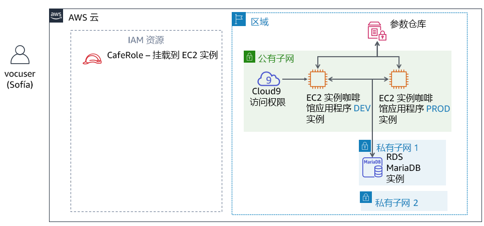
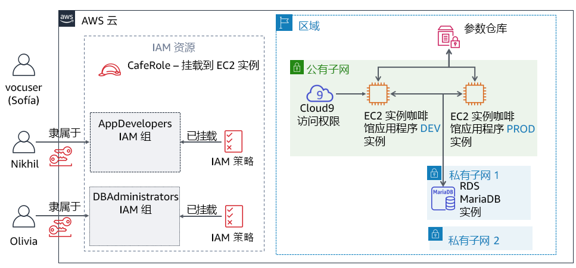

# 模块 8 – 挑战实验：使用 IAM 控制 AWS 账户访问

## 场景

在与 Mateo 讨论咖啡馆的 AWS 基础设施后，Sofía 意识到，她必须解决有关咖啡馆员工使用 AWS 账户方式的一些基本安全问题。

现在，咖啡馆规模很大，负责在 AWS 上构建、维护或访问应用程序的团队成员可以专注于具体的角色（例如开发人员或数据库管理员）。到目前为止，他们还没有开始根据每个用户的角色和责任明确定义他们应具有的访问权限级别。

Sofía 花了一些时间思考每个人应该能够在账户中执行什么操作，尤其是使用 AWS Cloud9、Amazon Elastic Compute Cloud (Amazon EC2) 和 Amazon Relational Database Service (Amazon RDS)。她做了一些决策并创建了该图表，其中描述了她希望如何定义 AWS 账户中的访问权限：

| IAM 组 | IAM 用户 | AWS 服务访问权限 | 原因 |
| ---------------- | -------- | ------------------------------------------------------------ | ------------------------------------------------------------ |
| AppDevelopers | Nikhil | **AWS Cloud9** 对 Amazon EC2 开发环境的访问权限。<br />以及，对 **Amazon EC2** 的只读访问权限。 | Nikhil 经常以应用程序开发人员的身份工作。他应该能够访问咖啡馆 Web 应用程序的开发环境 AWS Cloud9 环境。但是，他应该不能访问生产环境。他还应该能够查看所有 Amazon EC2 资源和配置详细信息，但他不应该能够修改它们。 |
| DBAdministrators | Olivia | 对 **Amazon RDS** 的完全访问权限。<br />以及，对 **AWS Systems Manager** 的完全访问权限。 | Olivia 被聘为合同制数据库管理员，帮助管理咖啡馆 Web 应用程序使用的数据库。因此，她应该拥有完全的 Amazon RDS 访问权限。她还需要访问存储数据库连接信息的 AWS Systems Manager。但是，除了访问这两项服务之外，Sofía 无法想出 Olivia 需要访问更多 AWS 资源的理由。 |

请注意，Soofía 已决定要定义 *IAM 组*，而不是直接向用户分配权限。接下来，她将附加授予这些组访问权限的 IAM 策略。然后，她计划将用户分配给相应的组。如果咖啡馆聘请了更多的开发人员或数据库管理员，她可以将他们作为新用户添加到组。这些新用户将继承他们的角色在开发和维护 AWS 账户基础设施方面的正确权限。这种方法将随着咖啡馆的扩张而不断扩展。

现在 Sofía 知道她想要向哪些用户分配哪些访问权限，她已准备好开始使用了！


## 实验概览和目标
在本实验中，您将使用 AWS Identity and Access Management (IAM) 为不同用户定义不同的访问权限。您将测试并调整访问权限。您还将观察您授予的访问权限如何影响 IAM 用户可以对 AWS 账户资源执行哪些操作。

完成本实验后，您应能够：

- 创建 IAM 用户和 IAM 组，并将 IAM 策略与 IAM 组关联
- 指明受限的访问权限如何影响 IAM 用户可以访问哪些资源，以及他们可以执行哪些操作
- 使用 AWS 托管的 IAM 策略修改用户访问权限并观察结果
- 使用 IAM 策略模拟器观察不同策略授予的访问权限范围
- 访问 IAM Access Advisor，观察不同用户正在利用哪些访问权限
- 使用可视化编辑器创建自定义 IAM 策略


当您*启动*实验时，以下资源已经在 AWS 账户中为您创建好了：



在本实验*结束*时，您的架构将包括以下资源和配置：




## 持续时间
完成本实验大约需要 **80 分钟**。


## AWS 服务限制
在本实验环境中，对 AWS 服务和服务操作的访问可能仅限于完成实验说明所需的服务和服务操作。如果您尝试访问其他服务或执行本实验中所述之外的操作，可能会遇到错误。


## 访问 AWS 管理控制台

1. 在这些说明的顶部，选择 <span id="ssb_voc_grey">Start Lab</span>（启动实验）即可启动您的实验。

   **Start Lab**（启动实验）面板随即会打开，其中显示了实验状态。

   <i class="fas fa-info-circle"></i> **提示**：如果您需要延长计时器上显示的实验完成时间，请再次选择 <span id="ssb_voc_grey">Start Lab</span>（启动实验）按钮，以重新启动环境计时器。这一操作不会删除您已创建的资源。


2. 请耐心等待，直到您看到消息 *Lab status: ready*（实验状态：就绪），然后选择 **X** 关闭 **Start Lab**（启动实验）面板。


3. 在这些说明的顶部，选择 <span id="ssb_voc_grey">AWS</span>。

   AWS 管理控制台将会在一个新的浏览器选项卡中打开。您将自动登录系统。

   **提示**：如果未打开新的浏览器选项卡，您的浏览器顶部通常会出现一个横幅或图标，并显示一条消息，指明您的浏览器阻止该了网站打开弹出窗口。请选择横幅或图标，然后选择 **Allow pop-ups**（允许弹出窗口）。

4. 排列 AWS 管理控制台选项卡，使其与这些说明一起显示。理想情况下，您将同时打开两个浏览器选项卡，以便能够更轻松地执行实验步骤。

   **注意**：您也可以取消选中屏幕顶部 Terminal（终端）旁边的复选框，将其从视图中隐藏。


## 业务请求：为应用程序开发人员配置 AWS 账户访问权限（挑战 1）

咖啡馆想要配置适合应用程序开发人员的访问权限。您将担任 Sofía 的角色来配置访问权限。然后，您将担任 Nikhil 的角色并测试应用程序开发人员的访问权限。


### 任务 1：使用策略和 IAM 用户配置 IAM 组

在实验的第一项任务中，您将以 AWS 账户管理员 Sofía 的身份工作。

作为 Sofía，您将创建一个 IAM 组并将 AWS 托管策略分配给该组。然后，您将创建一个新的 IAM 用户，并将该用户添加为该组的成员。接下来，您将在运行咖啡馆 Web 应用程序开发版本的现有 EC2 实例上创建 AWS Cloud9 环境。最后，您将与新用户共享开发环境。

**注意**：*您登录的用户将显示在网页的右上角区域*。它当前应该显示您的登录身份为 *voclabs* 用户。在本实验中，将 *voclabs* 用户想成 Sofía。


5. 在控制台中，打开 IAM 服务页面。


6. 创建一个名为 `AppDevelopers` 的 **IAM 组**，然后将以下 IAM 策略附加到该组：

   - **AmazonEC2ReadOnlyAccess**

   - **AWSCloud9EnvironmentMember**


7. 创建 **IAM 用户**并将该用户添加到 *AppDevelopers* 群组。

   - **User name**（用户名）：`Nikhil`

   - **Access type**（访问类型）：*AWS Management Console access*（AWS 管理控制台访问）

   - **Custom password**（自定义密码）：`@ppD3veloper2020!`

   - **Require password reset**（需要重置密码）：清除此复选框

   - 将 Nikhil 添加到 *AppDevelopers* 组

   - **注意**：您不需要添加任何标签

   - 在 **Success**（成功）屏幕中，您可以*根据需要*选择 **Download .csv**（下载 .csv）并将该文件保存到计算机

   - 选择 **Close**（关闭）。


8. 在仍以 *voclabs* 用户 (Sofía) 身份登录的情况下，连接到 AWS Cloud9 IDE 并设置咖啡馆 Web 应用程序。

   - 打开 **AWS Cloud9** 服务页面，然后在 **DEVCafeServer** 下，选择 **Open IDE**（打开 IDE）。

      系统现在应显示在 EC2 实例上运行的 AWS Cloud9 IDE。

   - 在屏幕底部的 Bash 终端窗口中，粘贴并运行以下三个命令：

      ```bash
            wget https://aws-tc-largeobjects.s3-us-west-2.amazonaws.com/ILT-TF-200-ACACAD-20-EN/mod8-challenge/install-cafe-app.sh
            chmod +x install-cafe-app.sh
            ./install-cafe-app.sh
            ```

      <i class="fas fa-info-circle"></i> **注意**：您*不*需要等到脚本完成运行。请直接进入下一步。


9. 与 *Nikhil* 用户共享 AWS Cloud9 环境。

   - 在 AWS Cloud9 IDE 的右上角，选择 **Share**（共享）。

   - 在 **Share this environment**（共享此环境）面板的 **Invite Members**（邀请成员）下，输入 `Nikhil` 并选择 **Invite**（邀请）。

   - 选择 **OK**（确定），再次选择 **OK**，然后选择 **Done**（完成）。

      <i class="fas fa-exclamation-triangle"></i> **重要提示**：关闭 AWS Cloud9 IDE 浏览器选项卡，但将您以 *voclabs* 用户 (Sofía) 的身份登录到 AWS 管理控制台的至少一个浏览器选项卡保持打开状态。


### 任务 2：以 Nikhil 的身份登录并测试访问

在此任务中，您将以 Nikhil 的身份来测试 Sofía 配置的访问权限。

<i class="fas fa-info-circle"></i> **提示**：我们建议您打开无痕或隐私浏览器选项卡，以 *Nikhil* 身份登录。

- 例如，如果您使用的是 *Chrome*，请选择 **File**（文件）> **New Incognito Window**（打开新的无痕窗口）。如果您使用 *Firefox*，请选择 **File**（文件）> **New Private Window**（新建隐私窗口）。

- 或者，使用不同的浏览器（例如，如果您使用 Chrome 完成任务 1，可使用 Firefox、Edge 或 Safari 执行任务 2）。

**注意**：使用无痕会话、隐私会话或不同的浏览器非常方便。您可以同时以 *voclabs* 用户和其他用户（例如 *Nikhil*）的身份保持登录状态。因此，您可以在这两个用户访问级别之间切换，而无需重复注销或登录。不同浏览器选项卡中经过身份验证的会话信息彼此隔离。


10. 以 *Nikhil* 身份登录 AWS 管理控制台。

    - 在您以 *voclabs* 用户 (Sofía) 身份登录的浏览器选项卡中，打开 **IAM** 控制台，选择 **Users**（用户），然后选择 **Nikhil**。

    - 选择 **Security credentials**（安全证书）选项卡，然后在 **Sign-in credentials**（登录证书）区域中复制 **Console sign-in link**（控制台登录链接）。

    - 将链接粘贴到无痕或隐私浏览器选项卡（或上述提示中提到的其他浏览器）中。

    - 在 **Sign in as IAM user**（以 IAM 用户身份登录）屏幕中，输入 Nikhil 的凭证，然后选择 **Sign in**（登录）。
       - **IAM user name**（IAM 用户名）：`Nikhil`

       - **Password**（密码）：`@ppD3veloper2020!`


11. 打开 **Amazon EC2** 控制台，然后在浏览器选项卡中加载咖啡馆 Web 应用程序。

    - 确认您位于正确的 **Region**（区域）（例如，*弗吉尼亚北部*），如果没有，则切换到正确的区域。

    - 您应该能够查看 EC2 实例的所有详细信息。

    - 找到并复制 **aws-cloud9-DEVCafeServer** 实例的 **IPv4 公有 IP 地址**。

    - 在新的浏览器选项卡中，加载 `http://<dev-public-ip-address>/cafe`，其中 &lt;*dev-public-ip-address*&gt; 是您复制的 IP 地址。

       此时，浏览器中应该会显示咖啡馆网站。将此浏览器选项卡保持打开状态，以便稍后用于实验。


12. 尝试重新启动 Web 服务器，进一步测试您的 Amazon EC2 访问权限。

    - 尝试重启 *aws-cloud9-DEVCafeServer* 实例

       <i class="fas fa-info-circle"></i> **提示**：要找到 **Reboot**（重启）选项，请选择实例并在 **Actions**（操作）菜单中查看。


#### 回答有关 Nikhil 的 Amazon EC2 访问权限的问题

完成实验后点击蓝色的 **Submit**（提交）按钮，即可检查答案。


13. 查看本实验中的问题。

    - 在这些说明上方，选择 <span id="ssb_voc_grey">Details <i class="fas fa-angle-down"></i></span>（详细信息）菜单，然后选择 <span id="ssb_voc_grey">Show</span>（显示）。

    - 选择页面底部的 **Access the multiple choice questions**（查看多项选择题）链接。

       这些问题会在新的浏览器选项卡中加载。


14. 在刚刚打开的网页中，回答前两个问题：

    - **问题 1**：Nikhil 尝试重新启动 EC2 实例时发生了什么情况？
    - **问题 2**：哪项 IAM 策略允许 Nikhil 访问 AWS Cloud9 环境？

       **注意**：请将浏览器选项卡中的问题页面保持打开状态，以便稍后在实验中返回查看。


#### 以 Nikhil 身份访问开发服务器

15. 返回您以 *Nikhil* 身份登录到 AWS 管理控制台的浏览器选项卡。

    **提示**：请记住，您可以在浏览器界面的右上角区域查看您当前登录所使用的用户身份。


16. 浏览到 **AWS Cloud9** 控制台，然后连接到 *DEVCafeServer* EC2 实例上的 AWS Cloud9 IDE。

    - 从 **Services**（服务）菜单中，选择 **AWS Cloud9**。

    - 在左侧，通过选择 <i class="fas fa-bars"></i>（菜单图标）展开菜单，选择 **Shared with you**（与您共享），然后确认 **DEVCafeServer** 环境是否可用。

    - 选择 **Open IDE**（打开 IDE）。

       <i class="fas fa-info-circle"></i> **注意**：您刚连接到 *aws-cloud9-DEVCafeServer* EC2 实例的来宾操作系统。您刚才在 Amazon EC2 控制台中观察到了此实例。您可以使用 IDE 浏览和编辑 Web 服务器上的文件。它还提供了在实例上运行的 Bash 终端。


17. 在咖啡馆网站的开发实例中，修改网页的主标题。

    - 在编辑器中打开主网页，方法是前往文件浏览器，浏览到 `DEVCafeServer/www/html/cafe` 目录，然后双击 **index.php**。

    - 修改**第 13 行**，将其更改为：

    ```html
    <div class="center">Caf&eacute; DEV Site</div>
    ```

    - 要保存更改，请选择 **File > Save**（文件 > 保存），然后在浏览器中刷新 `http://dev-public-ip-address/cafe/` 网页。

       请注意，在担任 Nikhil 身份时，您在开发环境中更改了网页的主要标题。


18. 测试 Web 应用程序数据库的连接性。

    - 在咖啡馆网站中，选择 **Menu**（菜单）。

    - 显示了什么消息？


19. 返回显示本实验多项选择题的浏览器选项卡，并回答以下问题。

    - **问题 3**：咖啡厅网站开发实例的 **Menu**（菜单）页面上显示了哪条消息？

       <i class="fas fa-comment"></i> Nikhil 回顾说，数据库连接参数存储在 AWS Systems Manager Parameter Store 中。


20. 以 *Nikhil* 身份打开 Systems Manager Parameter Store。
    - 在控制台中，打开 **Systems Manager** 服务。

    - 从左侧的菜单中，选择 **Application Management > Parameter Store**（应用程序管理 > 参数仓库）。

    - 显示了什么消息？


21. 返回显示本实验多项选择题的浏览器选项卡，并回答以下问题。

    - **问题 4**：Nikhil 在控制台中打开 Systems Manager Parameter Store 页面时显示了哪条消息？

    Nikhil 提醒 Sofía 注意开发服务器上的问题，该问题导致他无法改进咖啡馆 Web 应用程序。Sofía 很担心。她让 Nikhil 检查该网站的*生产*版本是否遇到同样的问题。


22. 以 *Nikhil* 身份验证咖啡馆生产版本 Web 应用程序是否正常工作。

    - 打开 **Amazon EC2** 控制台并复制 **PRODCafeServer** 实例的 **IPv4 公有 IP 地址**。

    - 在新的浏览器窗口中，加载 `http://prod-public-ip-address/cafe/menu.php`。

    - 网页显示正确吗？您能下订单吗？


## 新的业务要求：为数据库管理员配置 AWS 账户访问权限（挑战 2）

Nikhil 向 Sofía 报告了测试结果。知道生产网站仍然运行良好，这让她很高兴。但是，Sofía 希望在开发网站上纠正这个问题。

Sofía 决定她将要求 Olivia 解决这个问题。但是，Sofía 必须首先为数据库管理员定义 AWS 账户访问权限。然后，她必须创建 IAM 用户资源，这样 Olivia 才能登录到该账户。


### 任务 3：为数据库管理员配置用户访问 IAM

在此任务中，您将以 *Sofía* 身份工作，为 Olivia 启用 AWS 访问权限。


23. 回到您以 *voclabs* 用户 (Sofía) 身份登录的浏览器中，创建一个名为 `DBAdministrators` 的 **IAM 组**，该组具有以下权限：

    - **AmazonRDSReadOnlyAccess**
    - **AmazonSSMFullAccess**

    **注意**：在实际情况中，Sofía 需要向其数据库管理员授予的不仅仅是只读的 RDS 访问权限。但是，此实验环境中的权限不允许您附加 AmazonRDSFullAccess 策略。对于本实验，您应改用 AmazonRDSReadOnlyAccess 策略。


24. 创建一个名为 `Olivia` 的 IAM 用户，该用户可以访问 **AWS 管理控制台**。

    - 设置自定义密码：`Db@dministrat0r2020!`

    - 清除重置密码的要求


25. 将 Olivia 添加到 **DBAdministrators** 组。


### 任务 4：以数据库管理员的身份登录并解决数据库连接问题

在此任务中，您将以 *Olivia* 身份解决 Nikhil 确定的数据库问题。您还将以 *Sofía* 身份协助 Olivia 解决一些问题。


26. 以 *Olivia* 身份登录到 AWS 管理控制台。

    <i class="fas fa-info-circle"></i> **提示**：以 Nikhil 身份登录并使用无痕会话、隐私会话或其他浏览器类型。为此：

    - 在控制台右上角区域中选择 **Nikhil @ &lt;*account-number*&gt;**，然后选择 **Sign Out**（注销）。

    - 然后，选择 **Log back in**（重新登录）。

       此时应显示 **Sign in as IAM user**（以 IAM 用户身份登录）屏幕，且 *Account ID*（账户 ID）已预先填充。

       <i class="fas fa-info-circle"></i> **注意**：如果登录屏幕未显示账户 ID，请返回到您仍以 *voclabs* 用户 (Sofía) 身份登录的浏览器选项卡。在 IAM 控制台中，选择 **Users**（用户），然后选择 **Olivia**。选择 **Security credentials**（安全证书）选项卡。在 **Sign-in credentials**（登录证书）区域中复制 **Console sign-in link**（控制台登录链接）。

    - 使用 Olivia 的凭证登录：
       - **IAM user name**（IAM 用户名）：`Olivia`

       - **Password**（密码）：`Db@dministrat0r2020!`


27. 确认 RDS 数据库是否正在运行。

    - 打开 **Amazon RDS** 服务页面，然后选择 **Databases**（数据库）。

    - 确认数据库实例的 **Status**（状态）为 *Available*（可用）。

    Olivia 观察到数据库正在运行。

    她回顾说，开发环境使用存储在 Systems Manager Parameter Store 中的参数连接到数据库。Olivia 想知道 *DEVCafeServer* EC2 实例是否有权限从该 Parameter Store 中读取参数。


28. 打开 **Amazon EC2** 控制台，然后选择 **Running Instances**（正在运行的实例）。


29. 返回显示本实验多项选择题的浏览器选项卡，并回答以下问题。

    - **问题 5**：为什么 Olivia 无法访问 EC2 实例的详细信息？

    Olivia 告诉 Sofía，她无法访问 EC2 实例，于是 Sofía 返回控制台排查此问题。

    您现在将以 *Sofía* 身份，检查和更新 Olivia 对 AWS 资源的访问权限。


30. 返回到您以 *voclabs* 用户 (Sofía) 身份登录的浏览器选项卡。


31. 打开 **DBAdministrators** 组，然后附加以下策略：
    - **AmazonEC2ReadOnlyAccess**
    - **IAMReadOnlyAccess**

    **注意**：Sofía 意识到，如果 Olivia 必须访问附加到 EC2 实例的 IAM 角色的详细信息，则 Olivia 需要一些 IAM 权限。


32. 仍以 *voclabs* 用户 (Sofía) 身份，检查 Olivia 使用了哪些服务和功能。

    - 在 IAM 控制台中，打开 **Olivia** 用户，然后选择 **Access Advisor** 选项卡
    - 请注意，您可以看到 Olivia 访问了哪些服务区。系统通常会显示最近 4 小时内的服务活动（如 Access Advisor 详细信息中所述）。您可能还没有看到 Olivia 的任何 **Last accessed data**（上次访问的数据）。

       <i class="fas fa-info-circle"></i> 使用此视图，您可以深入了解用户的权限开放程度如何比其应有的程度更高。此信息使您能够更紧密地将访问权限与[最小特权原则](https://docs.aws.amazon.com/IAM/latest/UserGuide/best-practices.html#grant-least-privilege)保持一致。

       Sofía 要求 Olivia 检查她的 Amazon EC2 访问权限。


33. 以 *Olivia* 身份返回 Olivia 用户登录的浏览器选项卡，然后刷新 **Amazon EC2** 控制台的实例页面。

    - Olivia 现在应该能够访问两个正在运行的 EC2 实例。

    - 选择 **aws-cloud9-DEVCafeServer** 实例。

    - 在 **Description**（描述）选项卡中，找到 **IAM role**（IAM 角色），然后选择 **CafeRole**。

    - 在 **Permissions**（权限）选项卡中，展开 **AmazonSSMManagedInstanceCore** 策略，然后选择 **JSON** 视图选项。

    - 查看策略权限。


34. 返回显示本实验多项选择题的浏览器选项卡，并回答以下问题。

    - **问题 6**：指出策略中允许此实例上的咖啡馆 Web 应用程序访问参数仓库中数据库凭证的两个特定操作。

    Olivia 现在确信开发 EC2 实例上的 Web 应用程序可以访问 Parameter Store。问题可能不在这里。Olivia 与 Sofía 讨论了这个问题。

    经过讨论后，Sofía 记得开发环境之前使用本地数据库，但它现在使用 Amazon RDS。本地数据库具有不同的用户名，允许 Web 应用程序连接到数据库。连接到 Amazon RDS 上的数据库需要不同的数据库用户名。那肯定正是问题所在！

    Sofía 让 Olivia 检查数据库用户名是否是问题的根源并更新它。


35. 以 *Olivia* 的身份更新 Systems Manager Parameter Store 中的 **dbUser** 值。


36. 在咖啡馆开发服务器上的 Web 应用程序中，刷新 **Menu**（菜单）页面。

    - 如果此网页尚未打开，请在浏览器中加载 `http://<dev-public-ip-address>/cafe/menu.php`（其中 &lt;*dev-public-ip-address*&gt; 是**aws-cloud9-DEVCafeServer** 实例的实际 IPv4 公有 IP 地址）。

    - 整页内容现在是否全部显示正确？您能成功提交订单吗？

    恭喜！您以 *DBAdministrators* 组成员的身份成功修复了网站。Nikhil 感谢 Olivia 解决了这个问题，Olivia 还通知 Sofía 这个问题已经解决了。


## 新的业务要求：完善 IAM 用户访问权限（挑战 3）

Frank 和 Martha 很高兴 Sofía 和团队提高了 AWS 账户的安全性。同时，Sofía 很高兴她能够为其应用程序开发人员和数据库管理员配置不同的权限。她喜欢为每个角色分配单独的权限，这样每个团队成员可以在其核心能力和分配的职责范围内处理专门的工作，最终实现团队整体同心协力开发和解决问题。

Sofía 花一分钟时间来和她的朋友一起放松身心。但是，她已经在考虑进一步自定义分配给不同用户的安全设置了。某些权限仍然过于开放，没有完全遵循最小特权原则。在实验的最后一个挑战中，您将扮演 Sofía 的角色。您将努力定义自定义 IAM 策略，以减少允许授予数据库管理员组成员的 IAM 操作的数量。但是，您还必须授予他们足够的 IAM 访问权限来完成其工作职责。


### 任务 5：使用 IAM 策略模拟器并使用可视化编辑器创建自定义 IAM 策略

37. 返回到您以 *voclabs* 用户 (Sofía) 身份登录的浏览器窗口，然后在新的浏览器选项卡中加载此 URL：https://policysim.aws.amazon.com/

    此时 IAM 策略模拟器页面应打开。


38. 选择 **Olivia** 用户。


39. 在 **IAM Policies**（IAM 策略）列表中，确保选择了 **IAMReadOnlyAccess** 策略。但是，请*清除*其他策略的复选框。


40. 在 **Policy Simulator**（策略模拟器）部分中，选择 **Select service**（选择服务）。在 **Filter**（筛选条件）搜索框中，输入 `Ident`，然后选择 **Identity and Access Management**。


41. 选择 **Select All**（全选）选项（位于 **Select actions**（选择操作）菜单的右侧），然后选择 **Run Simulation**（运行模拟）。

    - 在 **Action Settings and Results**（操作设置和结果）面板中，应显示操作列表。

    - **Permission**（权限）列显示 Olivia 对每个操作的权限。*IAMReadOnlyAccess* 策略拒绝 Olivia 执行 **Add**（添加）或 **Create**（创建）操作的权限。但是，请滚动页面以查找她*可以*执行的操作。

    - 摘要（位于列表顶部）显示，目前允许 Olivia 采取 *57 项 IAM 操作*。


索菲亚想起了她授予 Olivia *IAMReadOnlyAccess* 策略权限的唯一原因。她想授予 Olivia 观察某些策略详细信息的权限。这些策略附加到 IAM 角色，而此角色附加到两个咖啡馆服务器实例。Sofía 决定为 *DBAdministrators* 组的成员编写新的、更严格的 IAM 策略。

在接下来的步骤中，您将以 Sofía 身份创建这项新策略。


42. 返回到您以 **voclabs** 用户 (Sofía) 身份登录的浏览器选项卡。


43. 在 **IAM** 控制台中，选择 **Policies**（策略），然后选择 **Create policy**（创建策略）。


44. 在 **Visual editor**（可视化编辑器）选项卡中，配置以下设置。

    - 单击 **Choose a service**（选择服务）。搜索并选择 **EC2**。

       - 在 **Actions**（操作）搜索框中，搜索 **IAM**，然后选择 **DescribeIamInstanceProfileAssociations**。

       

    - 在屏幕底部，选择 **Add additional permissions**（添加其他权限）。

    - 单击 **Choose a service**（选择服务）。搜索并选择 **IAM**。

       - 在 **Actions**（操作）搜索框中，搜索 **Get** 并选择以下操作：
          - **GetPolicyVersion**
          - **GetRole**
          - **GetRolePolicy**
       - 回到搜索框中，搜索 **List** 并选择以下操作：
          - **ListAttachedRolePolicies**
          - **ListInstanceProfiles**
          - **ListInstanceProfilesForRole**
          - **ListPolicies**
          - **ListRolePolicies**
          - **ListRoles**

    - 展开 **Resources**（资源）部分，然后对于所有三种资源类型（*实例配置文件*、*策略*和*角色*），选择 **Any in this account**（此账户中的任何一个）。

    - 回到屏幕顶部，选择 **JSON** 选项卡

       此视图显示了您刚使用可视化编辑器编写的 JSON 文档。

    - 确认策略文档的详细信息是否与以下示例中显示的内容匹配：


遗憾的是，在此实验环境中，我们无法授予您创建 IAM 策略的权限。如果选择 **Review policy**（查看策略），为策略指定名称，然后选择 **Create policy**（创建策略），则会出现权限错误。

但是，在您开始本实验时，我们已为您创建了一个与示例策略完全匹配的策略，而且现在您已经获得了使用可视化编辑器的经验。您还体验了它如何提供一种创建精细策略而无需从头开始编写 JSON 策略文档的方法。


45. 通过选择 **Cancel**（取消）退出 **Create policy**（创建策略）向导。


46. 在 **Policies**（策略）搜索框中，搜索 `LimitedIamPolicy`。

    观察该策略详细信息是否与您构建的策略的详细信息匹配，如上一屏幕截图所示。

    **注意**：策略中的 *Sid* 元素是可选的。此外，*Effect*（效果）、*Action*（操作）和 *Resource*（资源）在策略文档中的显示顺序不会影响策略的工作方式。


47. 编辑 **DBAdministrators** IAM 组。

    - **附加 LimitedIamPolicy** 策略
    - **分离 IAMReadOnlyAccess** 策略

    Sofía 让 Olivia 确认，即使现在授予她的 IAM 访问权限更加有限，但她仍然可以访问 *CafeRole* IAM 角色的详细信息。


48. 返回您以 *Olivia* 身份登录的浏览器选项卡，然后确认您仍然可以访问 *CafeRole* 的详细信息。
    - 在 **Amazon EC2** 控制台中，选择 **aws-cloud9-DEVCafeServer** 实例。

    - 在 **Description**（描述）选项卡中，选择 **IAM role > CafeRole**（IAM 角色 > CafeRole）。

    - 展开 **AmazonSSMManagedInstanceCore** 策略，并确认您仍能看到 JSON 文档的详细信息。


49. **（可选）**返回您以 *voclabs* 用户 (Sofía) 身份登录的 **IAM 策略模拟器**浏览器选项卡。再次运行模拟（针对 Olivia 可以执行的 IAM 操作）。
    - <i class="fas fa-info-circle"></i> **提示**：要显示适用于 Olivia 的新 IAM 策略，请刷新浏览器页面。
    - 在更改为 *DBAdministrators* IAM 组之前，Olivia 被允许执行 57 项与 IAM 服务相关的操作。但是，在更改之后，她对 IAM 服务的访问权限现在更加有限了。
    - 新策略授予的 IAM 权限较少，但 Olivia 仍然拥有履行工作职能所需的访问权限。


## 咖啡馆更新


Sofía 认为她现在越来越擅长管理用户对 AWS 账户的访问权限！

她知道如何使用 *AWS 托管的 IAM 策略*来控制访问，还知道如何使用 *IAM 策略模拟器*来观察不同策略授予的权限范围。她知道如何使用 *IAM Access Analyzer* 来观察不同用户正在使用哪些访问权限。最后，她还练习了使用 IAM 策略可视化编辑器创建*自定义 IAM 策略*。


## 提交作业
50. 在这些说明的顶部，选择 <span id="ssb_blue">Submit</span>（提交）记录您的进度，在出现提示时，选择 **Yes**（是）。


51. 如果在几分钟后仍未显示结果，请返回到这些说明的顶部，并选择 <span id="ssb_voc_grey">Grades</span>（成绩）

    **提示**：您可以多次提交作业。更改作业后，再次选择 **Submit**（提交）即可。您最后一次提交的作业将记录为本实验的成绩。


52. 要查找有关您作业的详细反馈，请选择 <span id="ssb_voc_grey">Details</span>（详细信息），然后选择 <i class="fas fa-caret-right"></i> **View Submission Report**（查看提交报告）。


## 实验完成

<i class="icon-flag-checkered"></i> 恭喜！您已完成实验。

53. 若要确认您想结束实验，请选择此页面顶部的 <span id="ssb_voc_grey">End Lab</span>（结束实验），然后选择 <span id="ssb_blue">Yes</span>（是）。

    此时应显示一个面板，并显示消息：*DELETE has been initiated... You may close this message box now.*（删除操作已启动...您现在可以关闭此消息框。）


54. 选择右上角的 **X** 关闭面板。


*©2020 Amazon Web Services, Inc. 及其附属公司。保留所有权利。未经 Amazon Web Services, Inc. 事先书面许可，不得复制或转载本文的部分或全部内容。禁止商业性复制、出租或出售。*
