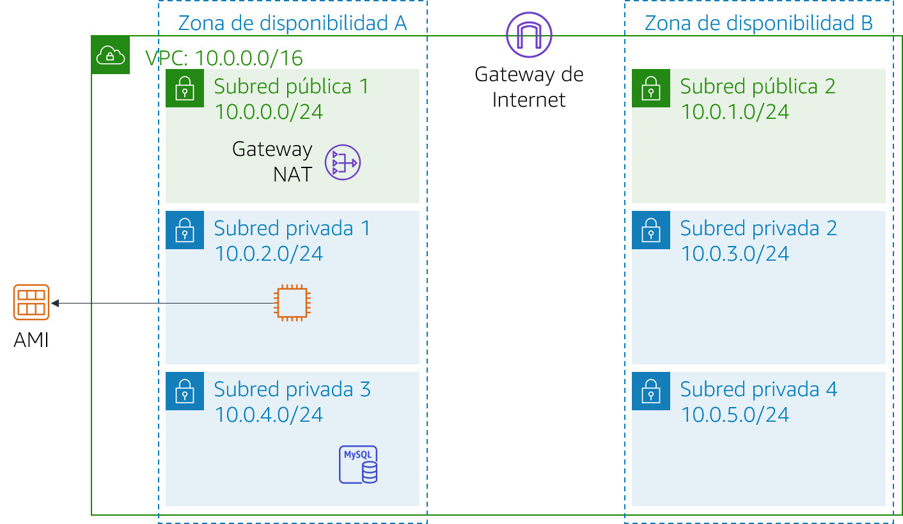
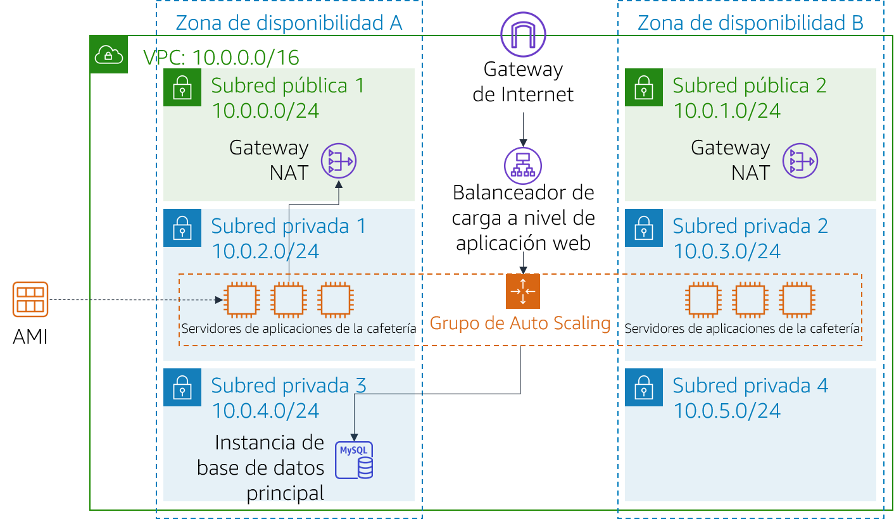

# Módulo 9 - Laboratorio de desafíos: Creación de un entorno escalable y de alta disponibilidad para la cafetería

## Caso

La cafetería pronto aparecerá en un famoso programa televisivo sobre comidas. Respecto de la emisión, Sofía y Nikhil anticipan que el servidor web de la cafetería experimentará un pico temporal en la cantidad de usuarios: tal vez hasta decenas de miles de usuarios más. Actualmente, el servidor web de la cafetería está implementado en una sola zona de disponibilidad, y tienen miedo de que no pueda manejar el aumento de tráfico previsto. Quieren hacer lo necesario para que sus clientes gocen de una experiencia excelente cuando visiten el sitio web y para que no experimenten ningún tipo de problemas, como retrasos o retardos cuando hagan pedidos.

Para garantizar la experiencia que desean, el sitio web debe tener capacidad de respuesta, debe tener disponibilidad alta y debe poder hacer un escalado ascendente y descendente para satisfacer la demanda fluctuante de los clientes. Para poder manejar el aumento de la demanda, en lugar de sobrecargar un único servidor, la arquitectura debe distribuir las solicitudes de pedidos de los clientes entre varios servidores de aplicaciones.

En este laboratorio, asumirá el rol de Sofía e implementará una arquitectura escalable y de disponibilidad alta para la aplicación web de la cafetería.

<br/>
## Información general y objetivos del laboratorio

En este laboratorio, utilizará Elastic Load Balancing y Amazon EC2 Auto Scaling para crear un entorno escalable y de disponibilidad alta en AWS.

Después de completar este laboratorio, debería ser capaz de lo siguiente:

- Inspeccionar una VPC
- Actualizar una red para que funcione en varias zonas de disponibilidad
- Crear un balanceador de carga de aplicaciones
- Crear una plantilla de lanzamiento
- Crear un grupo de Auto Scaling
- Probar el balanceo de carga y el escalado automático

<br/>

Cuando comience el laboratorio, la arquitectura se verá como el siguiente ejemplo:

<br/>



<br/>

Una vez que termine este laboratorio, la arquitectura debería verse como el siguiente ejemplo:

<br/>



<br/>

Nota: En este laboratorio de desafíos, no se dan instrucciones paso a paso para la mayoría de las tareas. Debe darse cuenta sin ayuda cómo llevar a cabo las tareas.

<br/>
## Duración

Para completar este laboratorio, se necesitan aproximadamente **90 minutos**.

<br/>
## Restricciones de los servicios de AWS

En este entorno de laboratorio, el acceso a los servicios y las acciones de los servicios de AWS puede restringirse a los que se necesiten para cumplir las instrucciones del laboratorio. Es posible que se produzcan errores si intenta acceder a otros servicios o hacer acciones que no sean las que se describen en este laboratorio.

<br/>
## Acceso a la consola de administración de AWS

1. En la parte superior de estas instrucciones, elija <span id="ssb_voc_grey">Start Lab</span> (Iniciar laboratorio) y comience a trabajar en él.

   Se abrirá el panel **Start Lab (Iniciar laboratorio),** donde se muestra el estado del laboratorio.

   > **Sugerencia**: Si necesita más tiempo para completar el laboratorio, vuelva a hacer clic en el botón “Start Lab (Iniciar laboratorio)” para reiniciar el temporizador del entorno.

2. Espere hasta que aparezca el mensaje *Lab status: ready (Estado del laboratorio: listo)* y, a continuación, haga clic en **X** para cerrar el panel **Start Lab** (Iniciar laboratorio).

   > **Nota**: El tiempo estimado para hacer este laboratorio es de 15 minutos.

3. En la parte superior de estas instrucciones, elija <span id="ssb_voc_grey">AWS</span>.

   Esto abrirá la consola de administración de AWS en una nueva pestaña del navegador y el sistema iniciará su sesión de forma automática.

   > **Sugerencia**: Si no se abre una nueva pestaña del navegador, por lo general habrá un aviso o un icono en la parte superior con un mensaje que indicará que el navegador impide que el sitio abra ventanas emergentes. Haga clic en el aviso o el icono y elija **Allow pop ups** (Permitir ventanas emergentes).

4. Ubique la pestaña de la consola de administración de AWS de modo que aparezca junto con estas instrucciones. Idealmente, debería poder ver ambas pestañas del navegador al mismo tiempo para que pueda seguir los pasos del laboratorio fácilmente.

<br/>
## Una solicitud de negocio para la cafetería: implementar un entorno escalable y de disponibilidad alta (Desafío)

Sofía entiende que debe llevar a cabo algunas tareas para que en la aplicación web de la cafetería se implementen la disponibilidad alta y la escalabilidad. Sin embargo, debe analizar el estado actual de la arquitectura de la aplicación de la cafetería antes de cambiarla.

En las siguientes tareas, asumirá el rol de *Sofía* y trabajará para crear y configurar los recursos necesarios para implementar una aplicación escalable y de disponibilidad alta.

### Tarea 1: Inspeccionar el entorno

En esta tarea, analizará el estado actual del entorno del laboratorio.

5. Explore el entorno del laboratorio, incluido el modo en que se configura la red.

> **Sugerencia**: Quizá le convenga comenzar en la **consola de Amazon VPC**.

Como ayuda para su exploración, pase a la sección siguiente y responda las preguntas sobre este laboratorio.

<br/>

#### Responder las preguntas sobre el laboratorio

Las respuestas se registrarán cuando haga clic en el botón azul **Submit** (Enviar), que se encuentra al final del laboratorio.

6. Acceda a las preguntas de este laboratorio.
   - Elija el menú <span id="ssb_voc_grey">Details (Detalles) <i class="fas fa-angle-down"></i></span>
      y después <span id="ssb_voc_grey">Show</span> (Mostrar).
   - Elija el enlace **Access the multiple choice questions** (Acceder a las preguntas de múltiple opción) que aparece en la parte inferior de la página.

7. En la página que cargó, responda las siguientes preguntas:

   - **Pregunta 1**: ¿Qué puertos están abiertos en el grupo de seguridad de *CafeSG*?
   - **Pregunta 2**: ¿Puede conectarse desde Internet a instancias de la *Subred pública 1*?
   - **Pregunta 3**: ¿Debería una instancia de la *Subred privada 1* tener acceso a Internet?
   - **Pregunta 4**: ¿Debería una instancia de la *Subred privada 2* tener acceso a Internet?
   - **Pregunta 5**: ¿Puede conectarse a la instancia *CafeWebAppServer* desde Internet?
   - **Pregunta 6**: ¿Cuál es el nombre de la imagen de Amazon Machine (AMI)?

<br/>

### Tarea 2: Crear una gateway NAT para la segunda zona de disponibilidad

Para lograr una disponibilidad alta, la arquitectura debe incluir al menos dos zonas de disponibilidad. Sin embargo, antes de lanzar instancias Amazon Elastic Compute Cloud (Amazon EC2) para los servidores de aplicaciones web en la segunda zona de disponibilidad, debe crear una gateway NAT para ellas. Una gateway NAT permitirá que las instancias que no tengan una dirección IP pública accedan a Internet.

8. Cree una gateway NAT en la *subred pública* de la segunda zona de disponibilidad.
9. Configure la red para enviar el tráfico vinculado a Internet desde instancias de la *Subred privada 2* a la gateway NAT que acaba de crear.

<br/>
### Tarea 3: Crear una instancia de servidor bastión en una subred pública

En esta tarea, creará un servidor bastión en una subred pública. En tareas posteriores, creará una instancia EC2 en una subred privada y se conectará a ella desde este servidor bastión.

10. Desde la **consola de Amazon EC2**, cree una instancia EC2 en una de las subredes públicas de *Lab VPC*. Debe cumplir los siguientes criterios:
    - **Imagen de Amazon Machine** (AMI): *AMI de Amazon Linux 2 (HVM)*
    - **Tipo de instancia**: *t2.micro*
    - **Asignación automática de IP pública**: este parámetro debe estar habilitado
    - **Nombre**: `Bastion Host`
    - Solo permite el siguiente tráfico:
       - **Tipo**: *SSH*
       - **Port** (Puerto): `22`
       - **Origen**: su dirección IP
    - Utiliza el par de claves **vockey**

<br/>
### Tarea 4: Crear una plantilla de lanzamiento

Durante la configuración del laboratorio, se creó una Imagen de Amazon Machine (AMI) a partir de la instancia *CafeWebAppServer*. En esta tarea, creará una plantilla de lanzamiento utilizando esta AMI.

11. Cree una plantilla de lanzamiento mediante la AMI que se creó durante la configuración del laboratorio. Debe cumplir los siguientes criterios.
    - **AMI**: `Cafe WebServer Image`   
       **Sugerencia**: Para localizar la AMI, diríjase al menú desplegable **AMI** y escriba: `Cafe`
    - **Tipo de instancia**: *t2.micro*  
       **Sugerencia**: Para localizar el tipo de instancia, diríjase al menú desplegable **Instance Type** (Tipo de instancia) y escriba: `t2`
    - **Par de claves** (inicio de sesión): utiliza un *nuevo par de claves*
       **Sugerencia**: Cree un nuevo par de claves y selecciónelo. No se olvide de descargar el par de claves en el equipo local.
    - **Grupos de seguridad**: `CafeSG`  
       **Sugerencia**: Para localizar el grupo de seguridad, diríjase al menú desplegable **Security groups** (Grupos de seguridad) y escriba: `CafeSG`
    - **Etiquetas de recursos**:
       - **Key** (Clave): `Name (Nombre)`
       - **Value** (Valor): `webserver`
       - **Resource Types** (Tipos de recursos): *Instances (Instancias)*
    - **IAM Instance Profile** (Perfil de instancia de IAM): `CafeRole`  
       **Sugerencia**: Busque este parámetro en **Advanced Details** (Detalles avanzados).

<br/>
### Tarea 5: Crear un grupo de Auto Scaling

Ahora que la plantilla de lanzamiento está definida, creará un grupo de Auto Scaling para las instancias. En esta tarea, *no* cree un balanceador de carga cuando cree el grupo de Auto Scaling. (Creará un balanceador de carga en la tarea siguiente).

12. Cree un nuevo grupo de Auto Scaling que cumpla los siguientes criterios:
    - **Plantilla de lanzamiento**: se utiliza la plantilla de lanzamiento que creó en la tarea anterior
    - **VPC**: se utiliza la VPC que se estableció para este laboratorio
    - **Subredes**: se utiliza `Private Subnet 1` y `Private Subnet 2`
    - Omite *todas* las opciones avanzadas
    - El **tamaño de grupo** está configurado de la siguiente forma:
       - **Desired capacity** (Capacidad deseada): `2`
       - **Minimum capacity** (Capacidad mínima): `2`
       - **Maximum capacity** (Capacidad máxima): `6`
    - Habilita la **política de escalado de seguimiento de valores objetivo** configurada de la siguiente forma:
       - **Metric type (Tipo de métrica)**: *Average CPU Utilization (Utilización media de la CPU)*
       - **Valor objetivo**: `25`
       - **Las instancias necesitan**: `60`

13. Para confirmar que ha creado el grupo de Auto Scaling correctamente, diríjase a la **consola de Amazon EC2**. Debería tener dos instancias: ambas con el nombre que estableció como *etiquetas de recurso* en la tarea anterior.

<br/>
### Tarea 6: Crear un balanceador de carga

Ahora que las instancias del servidor de aplicaciones web están implementadas en subredes privadas, necesita una forma para que el mundo exterior se conecte a ellas. En esta tarea, creará un balanceador de carga para distribuir el tráfico entre las instancias privadas.

14. Cree un balanceador de carga de aplicaciones HTTP que cumpla los siguientes criterios:
    - **VPC**: se utiliza la VPC que se estableció para este laboratorio
    - **Subredes**: se utilizan las dos *subredes públicas*
    - Omite la configuración de la seguridad HTTPS
    - **Grupo de seguridad**: se crea un *nuevo grupo de seguridad* que permite el tráfico HTTP desde cualquier lugar
    - **Grupo de destino**: se crea un *nuevo grupo de destino*
    - Omite el registro de objetivos

    **Nota**: *Espere* a que el balanceador de carga esté activo.

15. Modifique el grupo de Auto Scaling que creó en la tarea anterior agregando este nuevo balanceador de carga.

    > **Pista**: Agregue el *grupo de objetivos* que creó en la configuración del balanceador de carga.

<br/>

Sofía ya ha creado y configurado los recursos que la aplicación web necesita para ser escalable y tener disponibilidad alta. Sin embargo, sabe que todavía tiene trabajo por hacer. Para llevar a cabo el proceso de actualización de la arquitectura de la aplicación, Sofía debe probar la aplicación web de la cafetería para asegurarse de que funciona como se espera.

En las tareas siguientes, seguirá con el rol de Sofía y comprobará si la aplicación web de la cafetería escala automáticamente bajo carga.

<br/>
### Tarea 7: Probar la aplicación web

En esta tarea, probará la aplicación web de la cafetería.

16. Para probar la aplicación web de la cafetería, visite el nombre del sistema de nombres de dominio (DNS) del balanceador de carga y agregue `/cafe` a la URL.

La aplicación de la cafetería debería cargarse.

Si no lo hace, vuelva a las tareas del laboratorio y compruebe el trabajo que ha hecho. Preste atención a los siguientes recursos:

- *Configuración de la red*: ¿ha agregado correctamente la gateway NAT?
- *Tablas de enrutamiento*: ¿actualizó las tablas de enrutamiento con la gateway NAT?
- *Plantilla de lanzamiento*: ¿con la instancia se especifica un rol de IAM?
- *Balanceador de carga*: ¿el balanceador de carga está en las subredes públicas?
- *Instancias*: ¿las instancias están implementadas desde el grupo de Auto Scaling que está en las subredes correctas?
- *Grupos de seguridad*: ¿los grupos de seguridad permiten el tráfico HTTP desde Internet?

<br/>
### Tarea 8: Probar el escalado automático bajo carga

En esta tarea, probará si la aplicación de la cafetería puede hacer un *escalado ascendente* automáticamente.

17. Mediante el *acceso directo a través de Secure Shell (SSH), a través de la instancia del servidor bastión*, utilice SSH para conectarse a una de las instancias del servidor web en ejecución.

> Sugerencia: Deberá modificar el grupo de seguridad de *CafeSG* para permitir el tráfico SSH a través del puerto 22 desde el servidor bastión.

18. Desde la instancia del servidor web, utilice los siguientes comandos para comenzar una prueba de estrés. Esta prueba aumenta la carga de la CPU del servidor web:

    ```bash
    sudo yum install https://dl.fedoraproject.org/pub/epel/epel-release-latest-7.noarch.rpm
    sudo yum install stress -y
    stress --cpu 1 --timeout 600
    ```

19. Confirme que el grupo de Auto Scaling implementa nuevas instancias.
    - Continúe observando la consola de Amazon EC2.
    - Durante la prueba, debería constatar que se implementan más instancias del servidor web.

<br/>
## Noticias de la cafetería

Después de que termina de probar el rendimiento de la aplicación web de la cafetería, Sofía cuenta a los padres los cambios: cuando aumenta el tráfico, la aplicación de la cafetería ya logra hacer un escalado ascendente según lo previsto. Frank y Martha están impresionados con que Sofía haya implementado una arquitectura escalable y de disponibilidad alta para la aplicación.

Mientras tanto, todo el equipo de la cafetería está emocionado. Están ocupados preparándose para el aumento del volumen de pedidos que anticipan después de la aparición en el programa de televisión. Al tiempo que trabajan en los preparativos, saben que pueden contar con el escalado automático como ayuda para tomar pedidos y deleitar a los clientes nuevos.

<br/>
## Envío de su trabajo

20. En la parte superior de estas instrucciones, elija <span id="ssb_blue">Submit</span> (Enviar) para registrar su progreso y, cuando se le indique, elija **Yes** (Sí).

21. Si los resultados no se muestran después de algunos minutos, vuelva a la parte superior de estas instrucciones y elija <span id="ssb_voc_grey">Grades</span> (Resultados).

    **Sugerencia**: Puede enviar su trabajo varias veces. Después de realizar las modificaciones pertinentes, vuelva a elegir **Submit** (Enviar). Su último envío es el que se registrará para este laboratorio.

22. Para encontrar comentarios detallados sobre su trabajo, elija <span id="ssb_voc_grey">Details</span> (Detalles) seguido de <i class="fas fa-caret-right"></i> **View Submission Report** (Ver informe de envío).

<br/>

## Fin del laboratorio

<i class="fas fa-flag-checkered"></i> ¡Felicitaciones! Ha completado el laboratorio.

23. Para confirmar que desea completar el laboratorio, haga clic en **<span id="ssb_voc_grey">End Lab</span> (Finalizar laboratorio)**, en la parte superior de esta página, y, a continuación, haga clic en **<span id="ssb_blue">Yes</span> (Sí)**.

    Debería aparecer un panel con el siguiente mensaje: *DELETE has been initiated… You may close this message box now (Se ha iniciado la ELIMINACIÓN… Ya puede cerrar este cuadro de mensaje).*

24. Para cerrar el panel, haga clic en la **X** de la esquina superior derecha.


*© 2020 Amazon Web Services, Inc. y sus empresas afiliadas. Todos los derechos reservados. Este contenido no puede reproducirse ni redistribuirse, total ni parcialmente, sin el permiso previo por escrito de Amazon Web Services, Inc. Queda prohibida la copia, el préstamo y la venta de carácter comercial.*
