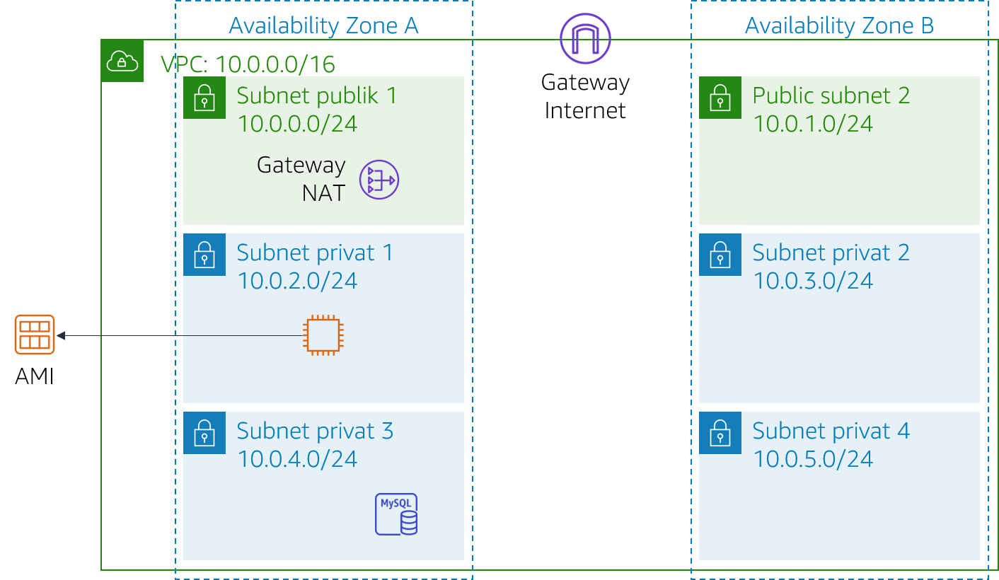

# Modul 9 - Lab Tantangan: Menciptakan Lingkungan yang Dapat Diskalakan dan dengan Ketersediaan Tinggi untuk Kafe

<!--Note: the step-by-step solutions to the challenge sections of this lab can be found in the instructor guide (source document at https://awsu-coursebuild.s3-us-west-2.amazonaws.com/sourcefiles/CUR-TF-200-ACACAD-20-EN/IG/AcademyCloudArchitecting-IG-Module-09.docx)-->

## Skenario

Kafe ini akan segera ditayangkan di acara kuliner TV yang terkenal. Ketika acara itu disiarkan, Sofia dan Nikhil memperkirakan bahwa server web kafe tersebut akan mengalami lonjakan sementara jumlah pengguna—bahkan mungkin hingga puluhan ribu pengguna. Saat ini, server web kafe ini di-deploy dalam satu Availability Zone, dan mereka khawatir hal tersebut tidak akan dapat menangani kemungkinan lonjakan lalu lintas. Mereka ingin memastikan pelanggan mereka memiliki pengalaman yang baik ketika mengunjungi situs web tersebut, dan mereka tidak mengalami masalah apa pun, seperti kelambatan atau penundaan dalam membuat pesanan.

Untuk memastikan hal itu, situs web harus responsif, mampu meningkatkan dan menurunkan skala untuk memenuhi permintaan pelanggan yang fluktuatif, serta memiliki ketersediaan yang tinggi. Alih-alih memuat secara berlebihan pada satu server, arsitekturnya harus mendistribusikan permintaan pesanan pelanggan di beberapa server aplikasi sehingga dapat menangani lonjakan permintaan.

Di lab ini, Anda akan berperan sebagai Sofia yang akan menerapkan arsitektur yang dapat diskalakan dan memiliki ketersediaan tinggi untuk aplikasi web kafe tersebut.

<br/>
## Gambaran umum dan tujuan lab

Di lab ini, Anda menggunakan Elastic Load Balancing dan Amazon EC2 Auto Scaling untuk menciptakan lingkungan yang dapat diskalakan dan memiliki ketersediaan tinggi di AWS.

Setelah menyelesaikan lab ini, Anda akan mampu:

- Memeriksa VPC
- Memperbarui jaringan untuk bekerja di beberapa Availability Zone
- Membuat Application Load Balancer
- Membuat templat peluncuran
- Membuat grup Auto Scaling
- Menguji pengimbangan beban dan penskalaan otomatis

<br/>

Ketika Anda memulai lab, arsitektur Anda akan terlihat seperti contoh berikut:

<br/>



<br/>

Pada akhir lab ini, arsitektur Anda seharusnya terlihat seperti contoh berikut:

<br/>


<br/>

Catatan: Di lab tantangan ini, instruksi langkah demi langkah tidak disediakan untuk sebagian besar tugas. Anda harus memikirkan cara untuk menyelesaikan tugas Anda sendiri.

<br/>
## Durasi

Diperlukan waktu sekitar **90 menit** untuk menyelesaikan lab ini.

<br/>
## Pembatasan layanan AWS

Dalam lingkungan lab ini, akses ke layanan AWS dan tindakan layanan mungkin dibatasi untuk orang-orang yang diperlukan untuk menyelesaikan instruksi lab. Anda mungkin akan mengalami error jika mencoba mengakses layanan lain atau melakukan tindakan di luar yang dijelaskan di lab ini.

<br/>
## Mengakses Konsol Manajemen AWS

1. Di bagian atas instruksi ini, pilih <span id="ssb_voc_grey">Start Lab</span> (Mulai Lab) untuk meluncurkan lab Anda.

   Panel **Start Lab** (Mulai Lab) terbuka dan menampilkan status lab.

   > **Tip**: Jika Anda memerlukan lebih banyak waktu untuk menyelesaikan lab, pilih tombol Start Lab (Mulai Lab) lagi untuk memulai ulang pengatur waktu untuk lingkungan.

2. Tunggu hingga Anda melihat pesan *Lab status: ready* (Status lab: siap), lalu tutup panel **Start Lab** (Mulai Lab) dengan memilih **X**.

   > **Catatan**: Diperlukan waktu sekitar 15 menit untuk memulai lab ini.

3. Di bagian atas instruksi ini, pilih <span id="ssb_voc_grey">AWS</span>.

   Tindakan ini akan membuka Konsol Manajemen AWS di tab browser baru. Anda akan login ke sistem secara otomatis.

   > **Tip**: Jika tab browser baru tidak terbuka, banner atau ikon biasanya berada di bagian atas browser Anda dengan pesan bahwa browser Anda mencegah situs web membuka jendela sembulan. Pilih banner atau ikon lalu pilih **Allow pop-ups** (Izinkan sembulan).

4. Atur tab AWS Management Console (Konsol Manajemen AWS) agar ditampilkan bersama instruksi ini. Idealnya, Anda akan dapat melihat kedua tab browser sekaligus, sehingga Anda dapat mengikuti langkah-langkah lab dengan mudah.

<br/>
## Permintaan bisnis untuk kafe: Menerapkan lingkungan yang dapat diskalakan dan memiliki ketersediaan tinggi (Tantangan)

Sofía memahami bahwa ia harus menyelesaikan beberapa tugas untuk menerapkan ketersediaan tinggi dan skalabilitas untuk aplikasi web kafe. Namun, sebelum mengubah arsitektur aplikasi kafe, Sofía harus mengevaluasi keadaan saat ini.

Dalam beberapa tugas berikutnya, Anda akan bekerja sebagai *Sofía* untuk membuat dan mengonfigurasi sumber daya yang Anda butuhkan untuk menerapkan aplikasi yang dapat diskalakan dan memiliki ketersediaan tinggi.

### Tugas 1: Memeriksa lingkungan Anda

Dalam tugas ini, Anda akan mengevaluasi kondisi lingkungan lab Anda saat ini.

5. Eksplorasi lingkungan lab, termasuk bagaimana jaringannya diatur.

> **Tip**: Anda mungkin ingin memulai di **konsol Amazon VPC**.

Untuk membantu Anda mengeksplorasi, lanjutkan ke bagian berikutnya dan jawab pertanyaan tentang lab ini.

<br/>

#### Menjawab pertanyaan tentang lab

Jawaban akan direkam saat Anda memilih tombol **Submit** (Kirim) biru di bagian akhir lab.

6. Akses pertanyaan di lab ini.
   - Pilih menu <span id="ssb_voc_grey">Details <i class="fas fa-angle-down"></i></span> (Detail)
      dan pilih <span id="ssb_voc_grey">Show</span> (Tampilkan).
   - Pilih tautan **Access the multiple choice questions** (Akses pertanyaan pilihan ganda) yang muncul di bagian bawah halaman.

7. Pada halaman yang Anda muat, jawab pertanyaan:

   - **Pertanyaan 1**: Port mana yang terbuka di grup keamanan *CafeSG*?
   - **Pertanyaan 2**: Dapatkah Anda terhubung dari internet ke instans di *Public Subnet 1* (Subnet Publik 1)?
   - **Pertanyaan 3**: Apakah sebuah instans di *Private Subnet 1* (Subnet Privat 1) harus dapat menjangkau internet?
   - **Pertanyaan 4**: Apakah sebuah instans di *Private Subnet 2* (Subnet Privat 2) harus dapat menjangkau internet?
   - **Pertanyaan 5**: Dapatkah Anda terhubung ke instans *CafeWebAppServer* dari internet?
   - **Pertanyaan 6**: Apa nama Amazon Machine Image (AMI)-nya?

<br/>

### Tugas 2: Membuat gateway NAT untuk Availability Zone kedua

Untuk mencapai ketersediaan tinggi, arsitektur harus mencakup setidaknya dua Availability Zone. Namun, sebelum Anda meluncurkan instans Amazon Elastic Compute Cloud (Amazon EC2) untuk server aplikasi web Anda di Availability Zone kedua, Anda harus membuat gateway NAT untuk instans tersebut. Gateway NAT akan memungkinkan instans yang tidak memiliki alamat IP publik untuk mengakses internet.

8. Buat gateway NAT di *Public Subnet* (Subnet Publik) di Availability Zone kedua.
9. Konfigurasi jaringan untuk mengirim lalu lintas terikat-internet dari instans di *Private Subnet 2* (Subnet Privat 2) ke gateway NAT yang baru saja Anda buat.

<br/>
### Tugas 3: Membuat instans bastion host di subnet publik

Dalam tugas ini, Anda akan membuat bastion host di subnet publik. Pada tugas-tugas berikutnya, Anda akan membuat instans EC2 di subnet privat dan menghubungkannya dari host bastion ini.

10. Dari **konsol Amazon EC2**, buat instans EC2 di salah satu subnet publik *Lab VPC*. Kriteria-kriteria berikut ini harus terpenuhi:
   - **Amazon Machine Image (AMI)**: *Amazon Linux 2 AMI (HVM)*
   - **Instance type** (Tipe instans): *t2.micro*
   - **Auto-assign Public IP** (Tetapkan Otomatis IP Publik): Pengaturan ini harus diaktifkan
   - **Name** (Nama): `Bastion Host` (Host Bastion)
   - Hanya mengizinkan lalu lintas berikut:
      - **Type** (Jenis): *SSH*
      - **Port:** `22`
      - **Source** (Sumber): Your IP address (Alamat IP Anda)
   - Menggunakan pasangan kunci **vockey**

<br/>
### Tugas 4: Membuat templat peluncuran

Pada saat penataan lab, Amazon Machine Image (AMI) dibuat dari instans *CafeWebAppServer*. Dalam tugas ini, Anda akan membuat templat peluncuran dengan menggunakan AMI ini.

11. Buat templat peluncuran dengan menggunakan AMI yang dibuat pada saat penataan lab. Kriteria-kriteria berikut ini harus terpenuhi.
   - **AMI**: `Cafe WebServer Image`   
      **Tip**: Untuk menemukan AMI, masuk ke menu tarik turun **AMI** dan masukkan: `Cafe` (Kafe)
   - **Instance type** (Tipe instans): *t2.micro*  
      **Tip**: Untuk menemukan jenis instans, masuk ke menu tarik turun **Instance Type** (Tipe Instans) dan masukkan: `t2`
   - **Key pair (login)**: Menggunakan *new key pair* (pasangan kunci baru)
      **Tip**: Buat pasangan kunci baru dan pilih. Pastikan bahwa Anda mengunduh pasangan kunci tersebut ke komputer lokal Anda.
   - **Security groups** (Grup keamanan): `CafeSG`  
      **Tip**: Untuk menemukan grup keamanan, masuk ke menu tarik turun **Security groups** (Grup keamanan) dan masukkan: `CafeSG`
   - **Resource tags** (Tanda sumber daya):
      - **Key** (Kunci): `Name` (Nama)
      - **Value** (Nilai): `webserver`
      - **Resource types** (Tipe sumber daya): *Instans*
   - **IAM Instance Profile** (Profil Instans IAM): `CafeRole`  
      **Tip**: Lihat di **Advanced Details** (Detail Lanjutan) untuk pengaturan ini.

<br/>
### Tugas 5: Membuat grup Auto Scaling

Sekarang setelah templat peluncuran ditentukan, Anda akan membuat grup Auto Scaling untuk instans tersebut. Dalam tugas ini, *jangan* membuat penyeimbang beban ketika Anda membuat grup Auto Scaling. (Anda akan membuat penyeimbang beban pada tugas berikutnya.)

12. Buat grup Auto Scaling baru yang memenuhi kriteria berikut:
   - **Templat peluncuran**: Menggunakan templat peluncuran yang Anda buat di tugas sebelumnya
   - **VPC**: Menggunakan VPC yang telah dikonfigurasi untuk lab ini
   - **Subnet**: Menggunakan `Subnet Privat 1` dan `Subnet Privat 2`
   - Lewati *semua* pilihan lanjutan
   - Konfigurasi **Group size** (Ukuran grup):
      - **Desired capacity** (Kapasitas yang dikehendaki): `2`
      - **Minimum capacity** (Kapasitas minimum): `2`
      - **Maximum capacity** (Kapasitas maksimum): `6`
   - Memungkinkan **Kepatuhan penskalaan pelacakan target** yang dikonfigurasi sebagai berikut:
      - **Metric type:** (Tipe metrik:) *Average CPU utilization* (Penggunaan CPU rata-rata)
      - **Target value** (Nilai target): `25`
      - **Instances need** (Kebutuhan instans): `60`

13. Untuk memverifikasi bahwa Anda membuat grup Auto Scaling dengan benar, masuk ke **konsol Amazon EC2**. Anda harus memiliki dua instans, yang keduanya dengan nama yang Anda dikonfigurasi sebagai *tanda sumber daya* pada tugas sebelumnya.

<br/>
### Tugas 6: Membuat penyeimbang beban

Sekarang instans server web aplikasi Anda telah di-deploy di subnet privat, Anda memerlukan cara agar dunia luar dapat terhubung ke instans tersebut. Dalam tugas ini, Anda akan membuat penyeimbang beban untuk mendistribusikan lalu lintas di seluruh instans privat Anda.

14. Buat Application Load Balancer HTTP yang memenuhi kriteria berikut:
   - **VPC**: Menggunakan VPC yang dikonfigurasi untuk lab ini
   - **Subnet**: Menggunakan dua *subnet publik*
   - Melewati pengaturan konfigurasi keamanan HTTPS
   - **Security group** (Grup keamanan): Membuat *grup keamanan baru* yang memungkinkan lalu lintas HTTP dari mana saja
   - **Target grup**: Membuat *grup target baru*
   - Melewati target pendaftaran

**Catatan**: *Tunggu* hingga penyeimbang beban aktif.

15. Modifikasi grup Auto Scaling yang Anda buat pada tugas sebelumnya dengan menambahkan penyeimbang beban baru ini.

   > **Petunjuk**: Tambahkan *grup target* yang Anda buat pada konfigurasi Penyeimbang Beban.

<br/>

Sofía sekarang telah membuat dan mengonfigurasi sumber daya yang diperlukan oleh aplikasi web tersebut agar memiliki ketersediaan tinggi dan dapat diskalakan. Namun, Sofía tahu bahwa ia masih memiliki banyak pekerjaan yang harus dilakukan. Untuk menyelesaikan proses pembaruan arsitektur aplikasi, Sofía harus menguji aplikasi web kafe tersebut untuk memastikan bahwa aplikasi tersebut berjalan seperti yang diharapkan.

Pada tugas selanjutnya, Anda akan terus bekerja memerankan Sofía dan menguji apakah aplikasi web kafe itu secara otomatis diskalakan berdasarkan beban.

<br/>
### Tugas 7: Menguji aplikasi web

Dalam tugas ini, Anda akan menguji aplikasi web kafe.

16. Untuk menguji aplikasi web kafe, kunjungi nama Domain Name System (DNS) dari penyeimbang beban Anda dan tambahkan `/cafe` ke URL.

Aplikasi kafe semestinya akan dimuat.

Jika tidak, teliti kembali tugas lab dan periksa pekerjaan Anda. Perhatikan sumber daya berikut ini:

- *Network configuration* (Konfigurasi jaringan): Apakah Anda menambahkan gateway NAT dengan benar?
- *Route tables* (Tabel rute): Apakah Anda memperbarui tabel rute dengan gateway NAT?
- *Launch template* (Templat peluncuran): Apakah instans menentukan IAM role?
- *Load balancer* (Penyeimbang beban): Apakah penyeimbang beban berada di subnet publik?
- *Instances* (Instans): Apakah instans yang di-deploy dari grup Auto Scaling berada di subnet yang benar?
- *Security groups* (Grup keamanan): Apakah grup keamanan mengizinkan lalu lintas HTTP dari internet?

<br/>
### Tugas 8: Menguji Auto Scaling menurut beban

Dalam tugas ini, Anda akan menguji apakah aplikasi kafe *naik skalanya* secara otomatis.

17. Dengan menggunakan *passthrough *Secure Shell (SSH) melalui instans bastion host**, gunakan SSH untuk terhubung ke salah satu instans server web yang sedang berjalan.

> Tip: Anda akan perlu memodifikasi grup keamanan *CafeSG* untuk memungkinkan lalu lintas SSH melalui port 22 dari bastion host.

18. Dari instans web server, gunakan perintah berikut untuk memulai uji daya tahan. Tes ini meningkatkan beban pada server web CPU:

    ```bash
    sudo yum install https://dl.fedoraproject.org/pub/epel/epel-release-latest-7.noarch.rpm
    sudo yum install stress -y
    stress --cpu 1 --timeout 600
    ```

19. Verifikasi bahwa grup Auto Scaling men-deploy instans baru.
   - Terus amati konsol Amazon EC2.
   - Selama tes, Anda akan melihat lebih banyak instans web server yang di-deploy.

<br/>
## Kabar terbaru dari kafe

Setelah Sofía selesai menguji kinerja aplikasi web kafe, ia memberi tahu orang tuanya tentang perubahannya—ketika lalu lintas meningkat, skala aplikasi kafe sekarang berhasil ditingkatkan. Frank dan Martha terkesan karena Sofía telah menerapkan arsitektur yang memiliki ketersediaan tinggi dan dapat diskalakan untuk aplikasi ini.

Sementara itu, seluruh tim kafe sangat bersemangat! Mereka sibuk menyiapkan peningkatan volume pesanan yang mereka antisipasi dari liputan kafe mereka di acara TV. Saat mereka mengerjakan persiapan mereka, mereka tahu bahwa mereka dapat mengandalkan penskalaan otomatis untuk membantu mereka menerima pesanan dan mengambil hati pelanggan baru.

<br/>
## Mengirimkan pekerjaan Anda

20. Di bagian atas instruksi ini, pilih <span id="ssb_blue">Submit</span> (Kirim) untuk merekam kemajuan Anda dan saat diminta, pilih **Yes** (Ya).

21. Jika hasilnya tidak muncul setelah beberapa menit, kembali ke bagian atas instruksi ini dan pilih <span id="ssb_voc_grey">Grades</span> (Nilai)

   **Tip**: Anda dapat mengirimkan pekerjaan Anda beberapa kali. Setelah Anda mengubah pekerjaan, pilih **Submit** (Kirim) lagi. Apa yang akan direkam untuk lab ini adalah pengiriman terakhir Anda.

22. Untuk menemukan detail umpan balik tentang pekerjaan Anda, pilih <span id="ssb_voc_grey">Details</span> (Detail) diikuti oleh <i class="fas fa-caret-right"></i> **View Submission Report** (Lihat Laporan Pengiriman).

<br/>

## Lab selesai

<i class="fas fa-flag-checkered"></i> Selamat! Anda telah menyelesaikan lab.

23. Untuk mengonfirmasi bahwa Anda ingin mengakhiri lab, di bagian atas halaman ini, pilih **<span id="ssb_voc_grey">End Lab</span>** (Akhiri Lab), lalu pilih **<span id="ssb_blue">Yes</span>** (Ya)

   Sebuah panel dengan pesan ini akan muncul: *DELETE has been initiated*...** (PENGHAPUSAN telah dimulai)... *You may close this message box now.* (Anda dapat menutup kotak pesan ini sekarang.)

24. Untuk menutup panel, pilih **X** di sudut kanan atas.


*©2020 Amazon Web Services, Inc. dan afiliasinya. Hak cipta dilindungi undang-undang. Karya ini tidak boleh direproduksi atau didistribusikan ulang, seluruhnya atau sebagian, tanpa izin tertulis sebelumnya dari Amazon Web Services, Inc. Dilarang menyalin, meminjamkan, atau menjual secara komersial.*
