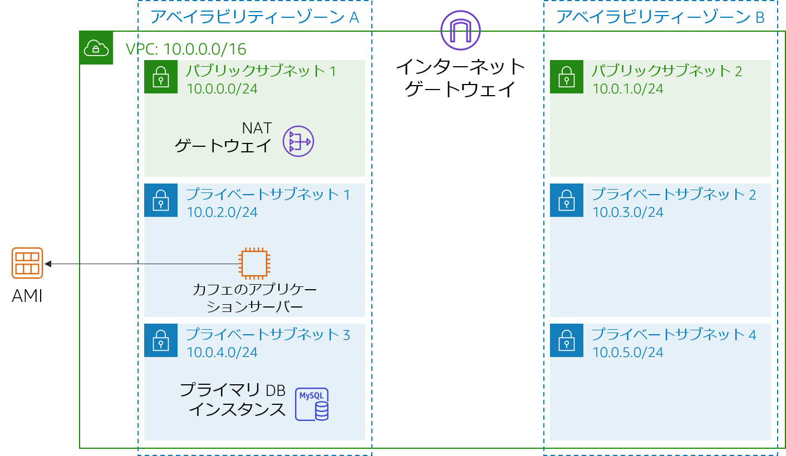
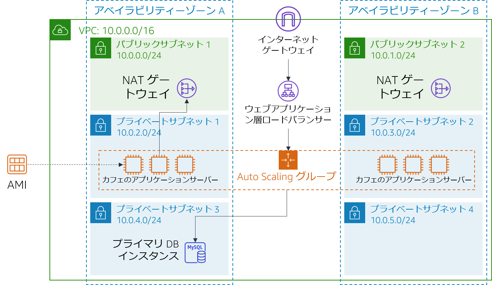

# モジュール 9 - 課題ラボ: カフェ用のスケーラブルで可用性の高い環境の構築

## シナリオ

カフェが有名な料理番組で紹介されることになりました。Sofía と Nikhil は、放送後にカフェのウェブサーバーでアクセス数が一時的に増加し、場合によっては数万人規模に達するかもしれないと考えています。現在、カフェのウェブサーバーは 1 つのアベイラビリティーゾーンにデプロイされていて、予想されるトラフィックの急増に対応できなくなることが懸念されます。2 人の要望は、訪れたユーザーがウェブサイトを快適に利用できるようにすること、注文時のタイムラグや遅延などの問題発生を防ぐことです。

このような環境を実現するには、ウェブサイトが応答性に優れ、変動する利用者の需要に合わせてスケールアップとスケールダウンの両方が可能で、可用性が高いことが必要になります。1 つのサーバーに負荷をかけずに需要の増加に対応できるよう、複数のアプリケーションサーバー間で利用者の注文リクエストを分散するアーキテクチャも必要です。

このラボでは、Sofía に代わってカフェのウェブアプリケーション用にスケーラブルで可用性の高いアーキテクチャを実装します。

<br/>

## ラボの概要と目標

このラボでは、Elastic Load Balancing と Amazon EC2 Auto Scaling を利用してスケーラブルで可用性の高い環境を AWS で構築します。

このラボを完了すると、次のことができるようになります。

- VPC を調査する
- 複数のアベイラビリティーゾーンにわたって機能するようネットワークを更新する
- Application Load Balancer を作成する
- 起動テンプレートを作成する
- Auto Scaling グループを作成する
- 負荷分散と自動スケーリングをテストする

<br/>

ラボ開始時のアーキテクチャは次の例のようになります。

<br/>



<br/>

ラボの終了時のアーキテクチャは次の例のようになります。

<br/>



<br/>

注意: この課題ラボでは、ほとんどのタスクにステップバイステップの手順は示されていません。タスクを完了させる方法を自分で考えてください。

<br/>

## 所要時間

このラボは、修了までに約 **90 分**かかります。

<br/>

## AWS サービスの制限事項

このラボ環境では、AWS のサービスとサービスアクションへのアクセスが、ラボの手順を完了するために必要なものに制限されています。他のサービスへのアクセスや、このラボで説明されているサービス以外のアクションを実行しようとすると、エラーが発生することがあります。

<br/>

## AWS マネジメントコンソールにアクセスする

1. この手順の上部にある <span id="ssb_voc_grey">Start Lab</span> をクリックし、ラボを起動します。

   [**Start Lab**] パネルが開き、ラボのステータスが表示されます。

   <i class="fas fa-info-circle"></i> **ヒント**: ラボの完了までにさらに時間が必要な場合は、<span id="ssb_voc_grey">Start Lab</span> ボタンをもう一度選択して、この環境のタイマーを再開します。

2. \[**Start Lab**] パネルに **Lab status: ready** というメッセージが表示されたら [**X**] をクリックしてパネルを閉じます。

3. この手順の上部にある <span id="ssb_voc_grey">AWS</span> をクリックします。

   このアクションにより、新しいブラウザタブで AWS マネジメントコンソールが開き、ユーザーは自動的にログインします。

   <i class="fas fa-exclamation-triangle"></i> **ヒント**: 新しいブラウザタブが開かない場合、通常、ブラウザによってサイトのポップアップウィンドウの表示がブロックされたというメッセージが表示されたバナーまたはアイコンがブラウザの上部に表示されます。バナーまたはアイコンを選択して [**ポップアップを許可**] を選択してください。

4. **AWS マネジメントコンソール**タブがこの手順と並べて表示されるようにします。両方のブラウザタブを同時に開いておくと、ラボのステップを実行しやすくなります。

   <i class="fas fa-exclamation-triangle"></i> **特に指示がない限り、リージョンを変更しないでください**。
<br/>

## カフェに対するビジネス要件: スケーラブルで可用性が高い環境を実装する (課題)

カフェのウェブアプリケーションに高い可用性とスケーラビリティを実装するには、いくつかの課題をこなす必要があることを Sofía は理解しています。しかし、カフェ用アプリケーションのアーキテクチャを変更する前に、まず現在の状態を評価しなければなりません。

次の各タスクでは **Sofía** の立場で、スケーラブルで可用性の高いアプリケーションの実装に必要なリソースの作成と設定を行います。

### タスク 1: 環境を調査する

このタスクでは現在の状態を評価するため、

5. ネットワークの設定状況などのラボ環境を調べます。

> **ヒント**: **Amazon VPC コンソール**から始めるとよいでしょう。

次のセクションに進んでこのラボに関する質問に回答すると調査がスムーズです。

<br/>

#### ラボに関する質問に回答する

ラボの最後に、青色の [**Submit**] をクリックすると、解答が採点されます。

6. このラボの問題にアクセスします。
   - 手順の上にある<span id="ssb_voc_grey">Details <i class="fas fa-angle-down"></i></span> ドロップダウンメニューから <span id="ssb_voc_grey">Show</span> を選択します。

   - ページ下に表示される [**Access the multiple choice questions**] のリンクをクリックします。

      質問が新しいブラウザタブにロードされます。

   - **質問 1**: **CafeSG** のセキュリティグループではどのポートが開いていますか?
   - **質問 2**: インターネットから **パブリックサブネット 1** のインスタンスに接続できますか?
   - **質問 3**: **プライベートサブネット 1** のインスタンスからインターネットにアクセスできるようにする必要がありますか?
   - **質問 4**: **プライベートサブネット 2** のインスタンスからインターネットにアクセスできるようにする必要がありますか?
   - **質問 5**: インターネットから **CafeWebAppServer** インスタンスに接続できますか?
   - **質問 6**: Amazon マシンイメージ (AMI) の名前は何といいますか?

<br/>

### タスク 2: 2 番目のアベイラビリティーゾーンに NAT ゲートウェイを作成する

高可用性を実現するには、アーキテクチャが 2 つ以上のアベイラビリティーゾーンにまたがっていなければなりません。ただし、2 番目のアベイラビリティーゾーンでウェブアプリケーションサーバーの Amazon Elastic Compute Cloud (Amazon EC2) インスタンスを起動する前に、それらの NAT ゲートウェイを作成する必要があります。NAT ゲートウェイでは、パブリック IP アドレスを持たないインスタンスがインターネットにアクセスできるようになります。

8. この 2 番目のアベイラビリティーゾーンにある**パブリックサブネット**に NAT ゲートウェイを作成します。
9. **Private Subnet 2** のインスタンスから、先ほど作成した NAT ゲートウェイにインターネット宛てのトラフィックが送信されるようにネットワークを設定します。

<br/>

### タスク3: パブリックサブネットで踏み台ホストのインスタンスを作成する

このタスクでは、パブリックサブネットに踏み台ホストを作成します。後のタスクでは、プライベートサブネットに EC2 インスタンスを作成し、この踏み台ホストから接続します。

10. **Amazon EC2 コンソール**から、いずれかの **Lab VPC**  パブリックサブネットに EC2 インスタンスを作成します。これは次の基準を満たす必要があります。
    - **Amazon マシンイメージ (AMI)**: **Amazon Linux 2 AMI (HVM)**
    - **インスタンスタイプ**: **t2.micro**
    - **自動割り当てパブリック IP**: この設定は有効にする必要があります
    - **名前**: `Bastion Host`
    - 次のトラフィックのみを許可します。
       - **タイプ**: **SSH**
       - **ポート**: `22`
       - **ソース**: IP アドレス
    - **vockey** キーペアを使用します

<br/>

### タスク 4: 起動テンプレートの作成

ラボのセットアップ中に、**CafeWebAppServer** インスタンスから Amazon マシンイメージ (AMI) が作成されました。このタスクでは、この AMI を使用して起動テンプレートを作成します。

11. ラボのセットアップ中に作成された AMI を使用して起動テンプレートを作成します。これは次の基準を満たす必要があります。
    - **AMI**: `カフェのウェブサーバーのイメージ`   
       **ヒント**: AMI を検索するには、[**AMI**] ドロップダウンの一覧に `Cafe` と入力します
    - **インスタンスタイプ**: **t2.micro**  
       **ヒント**: インスタンスタイプを検索するには、[**インスタンスタイプ**] ドロップダウンの一覧に `t2` と入力します
    - **キーペア (ログイン)**: **新しいキーペアを使用**
       **ヒント**: 新しいキーペアを作成してクリックします。キーペアは必ずローカルコンピュータにダウンロードしてください。
    - **セキュリティグループ**: `CafeSG`  
       **ヒント**: セキュリティグループを検索するには、[**セキュリティグループ**] ドロップダウンの一覧に `CafeSG` と入力します
    - **リソースタグ**:
       - **キー**: `Name`
       - **値**: `webserver`
       - **リソースタイプ**: **インスタンス**
    - **IAM インスタンスプロファイル**: `CafeRole`  
       **ヒント**: この設定については [**高度な詳細**] を参照してください。

<br/>

### タスク 5: Auto Scaling グループを作成する

起動テンプレートを定義したところで、インスタンスの Auto Scaling グループを作成します。このタスクでは、Auto Scaling グループの作成時にロードバランサーを作成**しないでください**（次のタスクで作成します）。

12. 次の条件を満たす新規の Auto Scaling グループを作成します。
    - **起動テンプレート**: 前のタスクで作成した起動テンプレートを使用します
    - **VPC**: このラボ用に設定された VPC を使用します
    - **サブネット**: `Private Subnet 1` と `Private Subnet 2` を使用します
    - **すべての**詳細オプションをスキップします
    - **グループサイズ**は次のように構成されています。
       - **必要なキャパシティー**: `2`
       - **最小キャパシティー**: `2`
       - **最大キャパシティー**: `6`
    - **ターゲット追跡スケーリングポリシー**を有効にして次のように設定します。
       - **メトリクスタイプ**: **CPU の平均使用率**
       - **ターゲット値**: `25`
       - **メトリクスに含める前にウォームアップする秒数**: `60`

13. Auto Scaling グループが正しく作成されたことを確認するには、**Amazon EC2 コンソール**に移動します。前のタスクで**リソースタグ**として構成した名前のインスタンスが 2 つあるはずです。

<br/>

### タスク 6: ロードバランサーを作成する

ウェブアプリケーションサーバーのインスタンスをプライベートサブネットにデプロイしたら、外部から接続する手段が必要です。このタスクでは、プライベートインスタンス間でトラフィックを分散するロードバランサーを作成します。

14. 次の基準を満たす HTTP Application Load Balancer を作成します。
    - **VPC**: このラボ用に設定された VPC を使用します
    - **サブネット**: 2 つの**パブリックサブネット**を使用します
    - HTTPS のセキュリティ構成設定をスキップします
    - **セキュリティグループ**: 任意の送信元からの HTTP トラフィックを許可する**新しいセキュリティグループ**を作成します
    - **ターゲットグループ**: **新しいターゲットグループ**を作成します
    - ターゲットの登録をスキップします

    **注**: ロードバランサーがアクティブになるまで**待機**します

15. この新しいロードバランサーを追加して、前のタスクで作成した Auto Scaling グループを変更します。

    > **ヒント**: ロードバランサーの設定で作成した**ターゲットグループ**を追加します。

<br/>

Sofía はウェブアプリケーションの高い可用性とスケーラビリティが求められるリソースの作成と設定を完了しましたが、まだやるべきことはたくさんあります。アプリケーションアーキテクチャの更新プロセスを完了するには、カフェのウェブアプリケーションをテストし、期待どおりに動作することを確かめる必要があります。

次のタスクでは Sofía の役割で作業を続け、カフェのウェブアプリケーションが負荷に応じて自動的にスケールするかをテストします。

<br/>

### タスク 7: ウェブアプリケーションをテストする

このタスクでは、カフェのウェブアプリケーションをテストします。

16. カフェのウェブアプリケーションをテストするには、ロードバランサーのドメインネームシステム（DNS）名にアクセスして URL に `/cafe` を付け足します。

    カフェのアプリケーションがロードされます。

    ロードされない場合はラボのタスクに戻って作業を確認します。その際、次のリソースに注意してください。

    - **ネットワーク構成**: NAT ゲートウェイを正しく追加しましたか。
    - **ルートテーブル**: NAT ゲートウェイでルートテーブルを更新しましたか。
    - **起動テンプレート**: インスタンスで IAM ロールが指定されていますか。
    - **ロードバランサー**: サブネット内にロードバランサーがありますか。
    - **インスタンス**: 正しいサブネット内のAuto Scaling グループからインスタンスがデプロイされていますか。
    - **セキュリティグループ**: セキュリティグループでインターネットからの HTTP トラフィックが許可されていますか。

<br/>

### タスク 8: 負荷時の自動スケーリングをテストする

このタスクでは、カフェのアプリケーションが自動的に**スケールアウト**するかをテストします。

17. **踏み台ホストのインスタンスを経由する Secure Shell (SSH) パススルー**を使用し、実行中のウェブサーバーインスタンスのいずれかに SSH を使用して接続します。

    > ヒント: 踏み台ホストから ポート 22 を経由する SSH トラフィックが許可されるよう、**CafeSG** セキュリティグループを変更する必要があります。

18. ストレステストを開始するには、ウェブサーバーインスタンスで次のコマンドを使用します。このテストではウェブサーバーの CPU にかかる負荷が増加します。

    ```bash
       sudo yum install https://dl.fedoraproject.org/pub/epel/epel-release-latest-7.noarch.rpm
       sudo yum install stress -y
       stress --cpu 1 --timeout 600
       ```

19. Auto Scaling グループが新しいインスタンスをデプロイすることを確認します。
    - Amazon EC2 コンソールを注意して観察してください。
    - テスト中に、デプロイされるウェブサーバーインスタンスが増えていることを確認できるはずです。

<br/>

## カフェの近況

Sofía は、カフェのウェブアプリケーションのパフォーマンステストを完了した後、変更内容を両親に伝えました。トラフィックが増加すると、カフェのアプリケーションは正常にスケールアウトします。Frank と Martha は、アプリケーションに可用性が高くスケーラブルなアーキテクチャを実装した Sofía に感心しています。

一方、期待に沸き立つカフェチームでは、テレビで紹介された後に予想される注文増加への対応準備に余念がありません。自動スケーリングで受注がスムーズに行われ、新規のお客様に満足してもらえることがわかっているので、チームは安心して準備に取り組むことができます。

<br/>

## 作業内容を送信する

20. この手順の上部にある <span id="ssb_blue">Submit</span> をクリックして進捗情報を記録し、プロンプトが表示されたら [**Yes**] をクリックします。


21. 数分経っても結果が表示されない場合は、この手順の上部に戻り、<span id="ssb_voc_grey">Grades</span> をクリックします。

    **ヒント**: 作業内容は何度も送信できます。作業内容を変更したら、再度 [**Submit**] をクリックします。最終送信分がこのラボの作業内容として記録されます。


22. 作業に関する詳細なフィードバックを参照するには、<span id="ssb_voc_grey">Details</span> ドロップダウンメニューから <i class="fas fa-caret-right"></i> [**View Submission Report**] を選択します。

<br/>

## ラボの終了

<i class="fas fa-flag-checkered"></i>お疲れ様でした。以上でラボは終了です。

23. ラボを終了するには、このページの上部にある <span id="ssb_voc_grey">End Lab</span> をクリックし、<span id="ssb_blue">Yes</span> をクリックします。

    パネルに **DELETE has been initiated... You may close this message box now** というメッセージが表示されます。

24. 右上隅の [**X**] をクリックしてパネルを閉じます。


**©2020 Amazon Web Services, Inc. and its affiliates. All rights reserved. このトレーニング内容の全体または一部を複製または再配布することは、Amazon Web Services, Inc. の書面による事前の許可がある場合を除き、禁じられています。商業目的のコピー、貸与、または販売を禁止します。**
