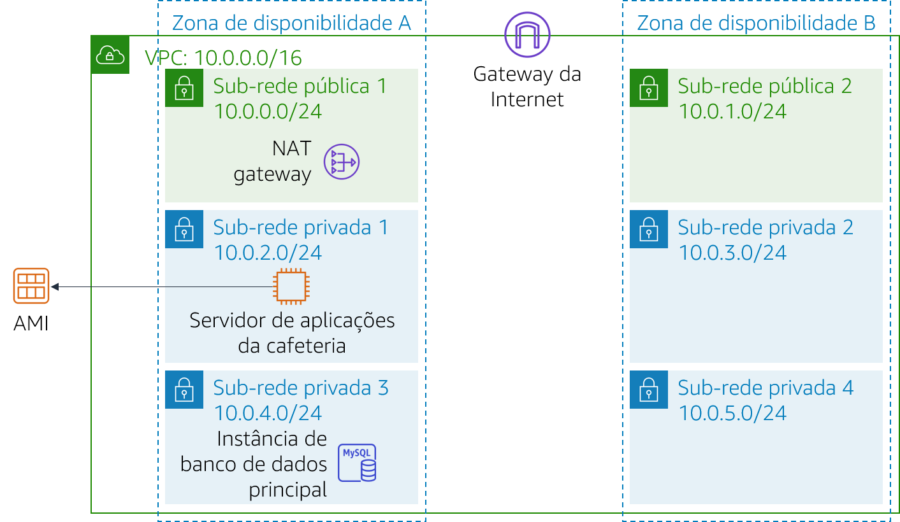

# Módulo 9 – Laboratório de desafio: Criar um ambiente escalável e altamente disponível para a cafeteria

## Cenário

Em breve, a cafeteria aparecerá em um famoso programa de culinária na TV. Quando ele for ao ar, Sofía e Nikhil antecipam que o servidor web da cafeteria terá um pico temporário no número de usuários, podendo chegar a até dezenas de milhares de usuários. Atualmente, o servidor Web da cafeteria está implantado em uma zona de disponibilidade, então eles estão preocupados que ele não seja capaz de lidar com o aumento esperado no tráfego. Eles querem garantir que os clientes tenham uma ótima experiência quando visitarem o site, sem quaisquer problemas como lag ou atrasos para fazer pedidos.

Para garantir essa experiência, o site precisa ser responsivo, capaz de expandir ou reduzir para atender à demanda flutuante dos clientes e estar altamente disponível. Em vez de sobrecarregar um único servidor, a arquitetura precisa distribuir solicitações de pedidos de clientes em vários servidores de aplicações para que ela possa lidar com o aumento da demanda.

Neste laboratório, você assumirá o papel de Sofía para implementar uma arquitetura escalável e altamente disponível para a aplicação Web da cafeteria.

<br/>
## Visão geral e objetivos do laboratório

Neste laboratório, você usa o Elastic Load Balancing e o Amazon EC2 Auto Scaling para criar um ambiente escalável e altamente disponível na AWS.

Depois de concluir este laboratório, você deverá ser capaz de:

- Inspecionar uma VPC
- Atualizar uma rede para funcionar em várias zonas de disponibilidade
- Criar um Application Load Balancer
- Criar um modelo de inicialização
- Criar um grupo de Auto Scaling
- Testar o balanceamento de carga e o dimensionamento automático

<br/>

Quando você iniciar o laboratório, sua arquitetura será semelhante ao seguinte exemplo:

<br/>



<br/>

No fim deste laboratório, sua arquitetura será semelhante ao seguinte exemplo:

<br/>


<br/>

Observação: neste laboratório de desafio, não são fornecidas instruções passo a passo para a maioria das tarefas. Você precisa descobrir como completar as tarefas por conta própria.

<br/>
## Duração

Este laboratório levará aproximadamente **90 minutos** para ser concluído.

<br/>
## Restrições de serviço da AWS

Neste ambiente de laboratório, o acesso aos serviços e ações de serviço da AWS pode estar restrito àqueles necessários para concluir as instruções do laboratório. Você poderá encontrar erros se tentar acessar outros serviços ou executar ações além do que está descrito neste laboratório.

<br/>
## Acessar o Console de Gerenciamento da AWS

1. Na parte superior destas instruções, escolha <span id="ssb_voc_grey">Start Lab</span> (Iniciar laboratório) para iniciar o laboratório.

   Um painel **Start Lab** (Iniciar laboratório) é aberto com o status do laboratório.

   > **Dica**: se você precisar de mais tempo para concluir o laboratório, escolha novamente o botão Start Lab (Iniciar laboratório) para reiniciar o cronômetro do ambiente.

2. Aguarde até que a mensagem *Lab status: ready (Status do laboratório: pronto)* seja exibida e feche o painel **Start Lab** (Iniciar laboratório) escolhendo **X**.

   > **Nota**: este laboratório levará aproximadamente 15 minutos para começar.

3. Na parte superior destas instruções, escolha <span id="ssb_voc_grey">AWS</span>.

   O Console de Gerenciamento da AWS será aberto em uma nova guia do navegador. O sistema fará o seu login automaticamente.

   > **Dica**:se uma nova guia do navegador não for aberta, normalmente você verá uma faixa ou um ícone na parte superior do navegador com uma mensagem informando que o navegador está impedindo que o site abra janelas pop-up. Escolha a faixa ou o ícone e escolha **Allow pop ups** (Permitir pop-ups).

4. Organize a guia do Console de Gerenciamento da AWS para que ela seja exibida com essas instruções. O ideal é ver as duas guias do navegador ao mesmo tempo, para facilitar o acompanhamento das etapas do laboratório.

<br/>
## Uma solicitação de negócios para a cafeteria: implementar um ambiente escalável e altamente disponível (Desafio)

Sofía entende que precisa completar algumas tarefas para implementar alta disponibilidade e escalabilidade na aplicação Web da cafeteria. No entanto, antes de mudar a arquitetura de aplicações da cafeteria, Sofía precisa avaliar o estado atual.

Nas próximas tarefas, você trabalhará como *Sofía* para criar e configurar os recursos necessários para implementar uma aplicação escalável e altamente disponível.

### Tarefa 1: inspecionar o ambiente

Nesta tarefa, você avaliará o estado atual do ambiente do laboratório.

5. Explore o ambiente do laboratório, incluindo a configuração da rede.

> **Dica**: pode ser útil começar pelo **console do Amazon VPC**.

Para ajudá-lo a explorar, continue para a próxima seção e responda às perguntas sobre este laboratório.

<br/>

#### Responder às perguntas sobre o laboratório

As respostas serão gravadas quando você escolher o botão azul **Submit** (Enviar) no final do laboratório.

6. Acesse as perguntas deste laboratório.
   - Escolha o menu <span id="ssb_voc_grey">Details (Detalhes) <i class="fas fa-angle-down"></i></span>
      e escolha <span id="ssb_voc_grey">Show</span> (Mostrar).
   - Escolha o link **Access the multiple choice questions** (Acessar as perguntas de múltipla escolha) que aparece na parte inferior da página.

7. Na página que você carregou, responda às perguntas:

   - **Pergunta 1**: Quais portas estão abertas no grupo de segurança *CafeSG*?
   - **Pergunta 2**: É possível se conectar da Internet a instâncias na *Sub-rede pública 1*?
   - **Pergunta 3**: Uma instância na *Sub-rede privada 1* deve ser capaz de se conectar à Internet?
   - **Pergunta 4**: Uma instância na *Sub-rede privada 2* deve ser capaz de se conectar à Internet?
   - **Pergunta 5**: É possível se conectar à instância do *CafeWebAppServer* pela Internet?
   - **Pergunta 6**: Qual é o nome da Amazon Machine Image (AMI)?

<br/>

### Tarefa 2: criar um gateway NAT para a segunda zona de disponibilidade

Para ter alta disponibilidade, a arquitetura precisa abranger pelo menos duas zonas de disponibilidade. No entanto, antes de iniciar instâncias do Amazon Elastic Compute Cloud (Amazon EC2) para seus servidores de aplicações Web na segunda zona de disponibilidade, você precisa criar um gateway NAT para elas. Um gateway NAT permitirá que instâncias sem endereço IP público acessem a Internet.

8. Crie um gateway NAT na *sub-rede pública* na segunda zona de disponibilidade.
9. Configure a rede para enviar tráfego vinculado à Internet de instâncias na *Sub-rede privada 2* para o gateway NAT que você acabou de criar.

<br/>
### Tarefa 3: criar uma instância de host bastion em uma sub-rede pública

Nesta tarefa, você criará um host bastion em uma sub-rede pública. Em tarefas posteriores, você criará uma instância do EC2 em uma sub-rede privada e se conectará a ela a partir desse host bastion.

10. No **console do Amazon EC2**, crie uma instância do EC2 em uma das sub-redes públicas da *Lab VPC*. Ela precisa atender aos seguintes critérios:
    - **Imagem de máquina da Amazon (AMI)**: *AMI do Amazon Linux 2 (HVM)*
    - **Instance Type** (Tipo de instância): *t2.micro*
    - **Atribuir IP público automaticamente**: essa configuração deve ser ativada
    - **Name** (Nome): `Bastion Host`
    - Permite apenas o seguinte tráfego:
       - **Type** (Tipo): *SSH*
       - **Port** (Porta): `22`
       - **Source** (Origem): seu endereço IP
    - Usa o par de chaves **vockey**

<br/>
### Tarefa 4: criar um modelo de inicialização

Durante a configuração do laboratório, uma Amazon Machine Image (AMI) foi criada a partir da instância do *CafeWebAppServer*. Nesta tarefa, você usará essa AMI para criar um modelo de inicialização.

11. Crie um modelo de inicialização usando a AMI criada durante a configuração do laboratório. Ele precisa atender aos seguintes critérios.
    - **AMI**: `imagem do servidor Web da cafeteria`   
      **Dica**: para localizar a AMI, acesse o menu suspenso **AMI** e digite: `Cafe`
    - **Instance type** (Tipo de instância): *t2.micro*  
      **Dica**: para localizar o tipo de instância, acesse o menu suspenso **Instance Type** (Tipo de instância) e digite: `t2`
    - **Par de chaves** (login): usa um *novo par de chaves*
      **Dica**: crie um novo par de chaves e selecione-o. Certifique-se de fazer download do par de chaves no seu computador local.
    - **Grupos de segurança**: `CafeSG`  
      **Dica**: para localizar o grupo de segurança, acesse o menu suspenso **Grupos de segurança** e digite: `CafeSG`
    - **Tags de recursos**:
       - **Key** (Chave): `Name (Nome)`
       - **Valor**: `servidor Web`
       - **Tipos de recursos**: *instâncias*
    - **Perfil de instância do IAM**: `CafeRole`  
      **Dica**: procure esta configuração em **Detalhes avançados**.

<br/>
### Tarefa 5: criar um grupo de Auto Scaling

Agora que o modelo de inicialização está definido, você criará um grupo de Auto Scaling para as instâncias. Nesta tarefa, você *não* deve criar um balanceador de carga quando criar o grupo de Auto Scaling. (O balanceador de carga será criado na próxima tarefa.)

12. Crie um novo grupo de Auto Scaling que atenda aos seguintes critérios:
    - **Modelo de inicialização**: usa o modelo de execução que você criou na tarefa anterior
    - **VPC**: a VPC configurada para este laboratório
    - **Sub-redes**: a `Sub-rede privada 1` e a `Sub-rede privada 2`
    - Ignora *todas as* opções avançadas
    - **Tamanho de grupo** configurado como:
       - **Desired capacity** (Capacidade desejada): `2`
       - **Capacidade mínima**: `2`
       - **Capacidade máxima**: `6`
    - Habilita a **Política de dimensionabilidade de rastreamento de destino** configurada como:
       - **Metric type (Tipo de métrica)**: *utilização média de CPU*
       - **Valor de destino**: `25`
       - **Instâncias necessárias**: `60`

13. Para verificar se você criou o grupo de Auto Scaling corretamente, acesse o **console do Amazon EC2**. Você deve ter duas instâncias, ambas com o nome que você configurou como *tags de recurso* na tarefa anterior.

<br/>
### Tarefa 6: criar um balanceador de carga

Agora que as instâncias do servidor de aplicações Web estão implantadas em sub-redes privadas, você precisa de uma maneira de conectá-las ao mundo exterior. Nesta tarefa, você criará um balanceador de carga para distribuir o tráfego em suas instâncias privadas.

14. Crie um Application Load Balancer HTTP que atenda aos seguintes critérios:
    - **VPC**: a VPC configurada para este laboratório
    - **Sub-redes**: as duas *sub-redes públicas*
    - Ignora as configurações de segurança HTTPS
    - **Grupo de segurança**: um *novo grupo de segurança* que permite tráfego HTTP de qualquer lugar
    - **Grupo de destino**: um *novo grupo de destino*
    - Pula o registro de destinos

    **Observação**: *aguarde* até que o balanceador de carga esteja ativo.

15. Modifique o grupo de Auto Scaling que você criou na tarefa anterior adicionando esse novo balanceador de carga.

    > **Dica**: adicione o *grupo de destino* criado na configuração do Load Balancer.

<br/>

A Sofía criou e configurou os recursos que a aplicação Web precisa para ser altamente disponível e escalável. No entanto, Sofía sabe que ainda tem mais trabalho a fazer. Para completar o processo de atualização da arquitetura da aplicação, Sofía precisa testar a aplicação Web da cafeteria para garantir que a execução ocorre conforme esperado.

Nas próximas tarefas, você continuará trabalhando como Sofía e testará se a aplicação Web da cafeteria é dimensionada automaticamente dependendo da carga.

<br/>
### Tarefa 7: testar a aplicação Web

Nesta tarefa, você testará a aplicação Web da cafeteria.

16. Para testar a aplicação Web da cafeteria, acesse o nome do Domain Name System (DNS) do balanceador de carga e inclua `/cafe` ao URL.

    A aplicação da cafeteria deve ser carregada.

    Se isso não acontecer, volte para as tarefas do laboratório e verifique seu trabalho. Preste atenção aos seguintes recursos:

    - *Configuração de rede*: você adicionou o gateway NAT corretamente?
    - *Tabelas de rota*: você atualizou as tabelas de rota com o gateway NAT?
    - *Modelo de inicialização*: a instância especifica uma função do IAM?
    - *Balanceador de carga*: o balanceador de carga está nas sub-redes públicas?
    - *Instâncias*: as instâncias foram implantadas a partir do grupo de Auto Scaling que está nas sub-redes corretas?
    - *Grupos de segurança*: os grupos de segurança permitem o tráfego HTTP da Internet?

<br/>
### Tarefa 8: testar a escalabilidade automática sob carga

Nesta tarefa, você testará se a aplicação da cafeteria é *dimensionada* automaticamente.

17. Usando a *passagem do Secure Shell (SSH) pela instância do host bastion*, use o SSH para se conectar a uma das instâncias do servidor Web em execução.

    > Dica: você precisará modificar o grupo de segurança *CafeSG* para permitir o tráfego SSH na porta 22 do host bastion.

18. Na instância do servidor Web, use os comandos a seguir para iniciar um teste de estresse. Esse teste aumenta a carga na CPU do servidor Web:

    ```bash
    sudo yum install https://dl.fedoraproject.org/pub/epel/epel-release-latest-7.noarch.rpm
    sudo yum install stress -y
    stress --cpu 1 --timeout 600
    ```

19. Verifique se o grupo de Auto Scaling implanta novas instâncias.
    - Continue observando o console do Amazon EC2.
    - Durante o teste, você deve notar que mais instâncias do servidor Web estão sendo implantadas.

<br/>
## Novidades da cafeteria

Depois que Sofía terminou de testar a performance da aplicação Web da cafeteria, ela contou aos pais sobre as mudanças: quando o tráfego aumenta, a aplicação da cafeteria agora aumenta com êxito. Frank e Martha estão impressionados que Sofía implementou uma arquitetura altamente disponível e escalável para a aplicação.

Enquanto isso, toda a equipe do café está animada! Eles estão ocupados se preparando para o aumento no volume de pedidos esperado após a apresentação no programa de TV. À medida que se preparam, eles sabem que podem confiar no dimensionamento automático para ajudá-los a receber pedidos e encantar novos clientes.

<br/>
## Enviar o trabalho

20. Na parte superior destas instruções, escolha <span id="ssb_blue">Submit</span> (Enviar) para gravar seu progresso e, quando solicitado, escolha **Yes** (Sim).

21. Se os resultados não forem exibidos após alguns minutos, volte ao topo destas instruções e escolha <span id="ssb_voc_grey">Grades</span> (Notas).

    **Dica**: você pode enviar seu trabalho várias vezes. Depois de alterar o trabalho, escolha **Submit** (Enviar) novamente. Seu último envio é o que será gravado para este laboratório.

22. Para ver o feedback detalhado do seu trabalho, escolha <span id="ssb_voc_grey">Details</span> (Detalhes) e depois <i class="fas fa-caret-right"></i> **View Submission Report** (Visualizar relatório de envio).

<br/>

## Laboratório concluído

<i class="fas fa-flag-checkered"></i> Parabéns! Você concluiu o laboratório.

23. Para confirmar que você deseja encerrar o laboratório, escolha **<span id="ssb_voc_grey">End Lab</span>** (Encerrar laboratório) na parte superior desta página e selecione **<span id="ssb_blue">Yes</span>** (Sim).

    Será exibido um painel com a mensagem: *DELETE has been initiated... You may close this message box now. (A EXCLUSÃO foi iniciada... Você pode fechar esta caixa de mensagem agora).*

24. Escolha o **X** no canto superior direito para fechar o painel.


*©2020, Amazon Web Services, Inc. e suas afiliadas. Todos os direitos reservados. Este trabalho não pode ser reproduzido ou redistribuído, no todo ou em parte, sem permissão prévia por escrito da Amazon Web Services, Inc. É proibido copiar, emprestar ou vender para fins comerciais.*
