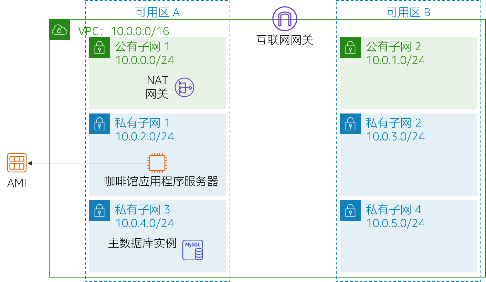
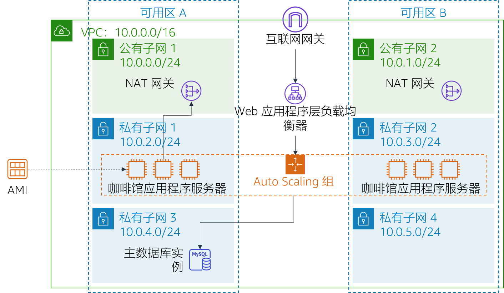

# 模块 9 – 挑战实验：为咖啡馆创建可扩展且高度可用的环境

## 场景

咖啡馆很快将在著名的电视美食节目中亮相。该节目播出时，Sofía 和 Nikhil 预计咖啡馆 Web 服务器用户数将临时飙升，甚至可能有数万位用户。目前，咖啡馆的 Web 服务器部署在一个可用区中，他们担心它无法应对预期的流量增长。他们希望确保客户在访问网站时获得出色的体验，而不会遇到任何问题，例如下单延迟。

为确保这种体验，网站必须响应迅速，能够扩展和缩减来满足波动的客户需求，并且具有高可用性。该架构必须跨多个应用程序服务器分发客户订单请求来应对需求的增加，而不是让单个服务器过载。

在本实验中，您将扮演 Sofía 角色，为咖啡馆的 Web 应用程序实施可扩展且高度可用的架构。

<br/>
## 实验概览和目标

在本实验中，您可以使用 Elastic Load Balancing 和 Amazon EC2 Auto Scaling 在 AWS 上创建可扩展且高度可用的环境。

完成本实验后，您应能够：

- 检查 VPC
- 更新网络以跨多个可用区工作
- 创建 Application Load Balancer
- 创建启动模板
- 创建 Auto Scaling 组
- 测试负载均衡和自动扩展

<br/>

启动本实验后，您的架构将如下例所示：

<br/>



<br/>

在本实验结束时，您的架构应如下例所示：

<br/>



<br/>

注意：在本挑战实验中，大部分任务都没有提供分步说明。您必须自己弄清楚如何完成这些任务。

<br/>
## 持续时间

完成本实验大约需要 **90 分钟**。

<br/>
## AWS 服务限制

在本实验环境中，对 AWS 服务和服务操作的访问可能仅限于完成实验说明所需的服务和服务操作。如果您尝试访问其他服务或执行本实验中所述之外的操作，可能会遇到错误。

<br/>
## 访问 AWS 管理控制台

1. 在这些说明的顶部，选择 <span id="ssb_voc_grey">Start Lab</span>（启动实验）即可启动您的实验。

   **Start Lab**（启动实验）面板随即会打开，其中显示了实验状态。

   > **提示**：如果您需要更多时间来完成实验，请再次选择 Start Lab（启动实验）按钮，重新启动环境计时器。

2. 请耐心等待，直到您看到消息 *Lab status: ready*（实验状态：就绪），然后选择 **X** 关闭 **Start Lab**（启动实验）面板。

   > **注意**：启动本实验需要大约 15 分钟。

3. 在这些说明的顶部，选择 <span id="ssb_voc_grey">AWS</span>。

   AWS 管理控制台将会在一个新的浏览器选项卡中打开。您将自动登录系统。

   > **提示**：如果未打开新的浏览器选项卡，则您的浏览器顶部通常会出现一个横幅或图标，并显示一条消息，指明您的浏览器阻止了该网站打开弹出窗口。请选择横幅或图标，然后选择 **Allow pop ups**（允许弹出窗口）。

4. 排列 AWS 管理控制台选项卡，使其与这些说明一起显示。理想情况下，您将能够同时看到这两个浏览器选项卡，从而更轻松地执行实验步骤。

<br/>
## 咖啡厅的业务请求：实施可扩展且高度可用的环境（挑战）

Sofía 知道她必须完成一些任务才能为咖啡馆的 Web 应用程序实施高可用性和可扩展性。但是，在改变咖啡馆的应用程序架构之前，Sofía 必须评估其当前状态。

在接下来的几项任务中，您将以 *Sofía* 身份创建和配置实施可扩展且高度可用应用程序所需的资源。

### 任务 1：检查您的环境

在此任务中，您将评估实验环境的当前状态。

5. 了解实验环境，包括网络的设置方式。

> **提示**：您可能希望在 **Amazon VPC 控制台**中启动。

为了帮助您了解，请继续下一节并回答有关本实验的问题。

<br/>

#### 回答有关实验的问题

完成实验后，选择蓝色的 **Submit**（提交）按钮，将会记录答案。

6. 查看本实验中的问题。
   - 选择 <span id="ssb_voc_grey">Details<i class="fas fa-angle-down"></i></span>（详细信息）
      菜单，然后选择 <span id="ssb_voc_grey">Show</span>（显示）。
   - 选择页面底部的 **Access the multiple choice questions**（查看多项选择题）链接。

7. 在您加载的页面中，回答以下问题：

   - **问题 1**：*CafeSG* 安全组中哪些端口处于开放状态？
   - **问题 2**：您能否从互联网连接到*公有子网 1* 中的实例？
   - **问题 3**：*私有子网 1* 中的实例应该能够访问互联网吗？
   - **问题 4**：*私有子网 2* 中的实例应该能够访问互联网吗？
   - **问题 5**：您能从互联网连接到 *CafeWebAppServer* 实例吗？
   - **问题 6**：Amazon 系统映像 (AMI) 的名称是什么？

<br/>

### 任务 2：为第二个可用区创建 NAT 网关

为了实现高可用性，架构必须至少跨两个可用区。但是，在为第二个可用区中的 Web 应用程序服务器启动 Amazon Elastic Compute Cloud (Amazon EC2) 实例之前，您必须为这些实例创建 NAT 网关。NAT 网关将允许没有公有 IP 地址的实例访问互联网。

8. 在第二个可用区的*公有子网*中创建 NAT 网关。
9. 将网络配置为将流向互联网的流量从*私有子网 2* 中的实例发送到刚创建的 NAT 网关。

<br/>
### 任务 3：在公有子网中创建堡垒主机实例

在此任务中，您将在公有子网中创建堡垒主机。在滞后的任务中，您将在私有子网中创建 EC2 实例，然后从此堡垒主机连接到该实例。

10. 在 **Amazon EC2 控制台**中，在 *Lab VPC* 的其中一个公有子网中创建 EC2 实例。它必须符合以下条件：
    - **Amazon Machine Image** (AMI)（Amazon 系统映像 (AMI)）：*Amazon Linux 2 AMI (HVM)*
    - **Instance type**（实例类型）：*t2.micro*
    - **Auto-assign Public IP**（自动分配公有 IP）：应禁用此设置
    - **Name**（名称）：`Bastion Host`（堡垒主机）
    - 只允许以下流量：
       - **Type**（类型）：*SSH*
       - **Port**（端口）：`22`
       - **Source**（来源）：您的 IP 地址
    - 使用 **vockey** 密钥对

<br/>
### 任务 4：创建启动模板

在实验设置期间，从 *CafeWebAppServer* 实例创建了一个 Amazon 系统映像 (AMI)。在此任务中，您将使用此 AMI 创建一个启动模板。

11. 使用在实验设置期间创建的 AMI 来创建启动模板。它必须符合以下条件：
    - **AMI**：`Cafe WebServer Image`   （咖啡馆 WebServer 映像）
       **提示**：要找到 AMI，请转到 **AMI** 下拉菜单并输入：`Cafe`
    - **Instance type**（实例类型）：*t2.micro*  
       **提示**：要找到实例类型，请转到 **Instance Type**（实例类型）下拉菜单并输入：`t2`
    - **Key pair** (login)（密钥对（登录））：使用*新的密钥对*
       **提示**：创建一个新的密钥对并将其选中。确保将密钥对下载到本地计算机。
    - **Security groups**（安全组）：`CafeSG`  
       **提示**：要找到安全组，请转到 **Security groups**（安全组）下拉菜单并输入：`CafeSG`
    - **资源标签**:
       - **Key**（键）：`Name`
       - **Value**（值）：`webserver`
       - **Resource types**（资源类型）：*Instances*（实例）
    - **IAM Instance Profile**（IAM 实例配置文件）：`CafeRole`  
       **提示**：在 **Advanced Details**（高级详细信息）中查看此设置。

<br/>
### 任务 5：创建 Auto Scaling 组

现在已定义启动模板，您将为实例创建一个 Auto Scaling 组。在此任务中，请*不要*在创建 Auto Scaling 组时创建负载均衡器。（您将在下一个任务中创建负载均衡器。）

12. 创建符合以下条件的新 Auto Scaling 组：
    - **Launch template**（启动模板）：使用您在上一任务中创建的启动模板
    - **VPC**：使用为本实验配置的 VPC
    - **Subnets**（子网）：使用`Private Subnet 1`（私有子网 1）和 `Private Subnet 2`（私有子网 2）
    - 跳过*所有*高级选项
    - **Group size**（组大小）配置为：
       - **Desired capacity**（所需容量）：`2`
       - **Minimum capacity**（最小容量）：`2`
       - **Maximum capacity**（最大容量）：`6`
    - 启用具有以下配置的 **Target tracking scaling policy**（目标跟踪扩展策略）：
       - **Metric type**（指标类型）：*Average CPU Utilization*（平均 CPU 利用率）
       - **Target Value**（目标值）：`25`
       - **Instances need**（实例需要）：`60`

13. 要确认您是否正确创建了 Auto Scaling 组，请转到 **Amazon EC2 控制台**。您应该有两个实例，两个实例的名称都是您在上一个任务中配置为*资源标签*的名称。

<br/>
### 任务 6：创建负载均衡器

现在，您的 Web 应用程序服务器实例已部署在私有子网中，您需要一种方法能从外部连接到它们。在此任务中，您将创建一个负载均衡器，以便在私有实例之间分配流量。

14. 创建符合以下条件的 HTTP Application Load Balancer：
    - **VPC**：使用为本实验配置的 VPC
    - **Subnets**（子网）：使用两个 *公有子网*
    - 跳过 HTTPS 安全配置设置
    - **Security group**（安全组）：创建一个允许来自任何地方的 HTTP 流量的*新安全组*
    - **Target group**（目标组）：创建*新的目标组*
    - 跳过注册目标

    **注意**：*请耐心等候*，直到负载均衡器激活。

15. 通过添加这个新的负载均衡器来修改您在上一个任务中创建的 Auto Scaling 组。

    > **提示**：添加您在负载均衡器配置中创建的*目标组*。

<br/>

Sofía 现在创建并配置了 Web 应用程序实现高可用性和可扩展性所需要的资源。但是，Sofía 知道她还有更多的工作要做。要完成应用程序架构的更新过程，Sofía 必须测试咖啡馆的 Web 应用程序，确保其按预期运行。

在接下来的任务中，您将继续担任 Sofía 的角色，测试咖啡馆 Web 应用程序是否随负载自动扩缩。

<br/>
### 任务 7：测试 Web 应用程序

在此任务中，您将测试咖啡馆 Web 应用程序。

16. 要测试咖啡馆 Web 应用程序，请访问负载均衡器的域名系统 (DNS) 名称，然后将 `/cafe` 添加到 URL。

此时应该会加载咖啡馆应用程序。

如果没有，请返回实验任务并检查您的工作。请注意以下资源：

- *Network configuration*（网络配置）：是否正确添加了 NAT 网关？
- *Route tables*（路由表）：您是否使用 NAT 网关更新了路由表？
- *Launch template*（启动模板）：实例是否指定了 IAM 角色？
- *Load balancer*（负载均衡器）：负载均衡器是否位于公有子网中？
- *Instances*（实例）：实例是否从位于正确的子网中的 Auto Scaling 组中部署？
- *Security groups*（安全组）：安全组是否允许来自互联网的 HTTP 流量？

<br/>
### 任务 8：测试负载下的自动扩缩

在此任务中，您将测试咖啡馆应用程序是否自动*扩展*。

17. 通过使用*安全外壳 (SSH) 通过堡垒主机实例*的方式，使用 SSH 连接到正在运行的一个 Web 服务器实例。

> 提示：您需要修改 *CafeSG* 安全组，以允许来自堡垒主机的 SSH 流量通过端口 22。

18. 在 Web 服务器实例中，使用以下命令启动压力测试。此测试会增加 Web 服务器 CPU 的负载：

    ```bash
       sudo yum install https://dl.fedoraproject.org/pub/epel/epel-release-latest-7.noarch.rpm
       sudo yum install stress -y
       stress --cpu 1 --timeout 600
       ```

19. 确认 Auto Scaling 组是否部署了新实例。
    - 继续观察 Amazon EC2 控制台。
    - 在测试期间，您应该注意到部署了更多的 Web 服务器实例。

<br/>
## 咖啡馆更新

Sofía 完成咖啡馆 Web 应用程序的性能测试之后，她将变化告诉父母，当流量增加时，咖啡馆应用程序现在能成功扩展。令 Frank 和 Martha 印象深刻的是，Sofía 为该应用程序实施了高度可用且可扩展的架构。

同时，整个咖啡馆团队都很兴奋！他们正忙于为电视节目播出之后预计增加的订单量做准备。在准备过程中，他们知道可以依靠 Automatic Scaling 来帮助他们接受订单并让新客户满意。

<br/>
## 提交作业

20. 在这些说明的顶部，选择 <span id="ssb_blue">Submit</span>（提交）记录您的进度，在出现提示时，选择 **Yes**（是）。

21. 如果在几分钟后仍未显示结果，请返回到这些说明的顶部，并选择 <span id="ssb_voc_grey">Grades</span>（成绩）

    **提示**：您可以多次提交作业。更改作业后，再次选择 **Submit**（提交）即可。您最后一次提交的作业将记录为本实验的成绩。

22. 要查找有关您作业的详细反馈，请选择 <span id="ssb_voc_grey">Details</span>（详细信息），然后选择 <i class="fas fa-caret-right"></i> **View Submission Report**（查看提交报告）。

<br/>

## 实验完成

<i class="fas fa-flag-checkered"></i> 恭喜！您已完成实验。

23. 若要确认您想结束实验，请选择此页面顶部的 <span id="ssb_voc_grey">End Lab</span>（结束实验），然后选择 <span id="ssb_blue">Yes</span>（是）

    此时应显示一个面板，并显示消息：*DELETE has been initiated... You may close this message box now.*（删除操作已启动...您现在可以关闭此消息框。）

24. 选择右上角的 **X** 关闭面板。


*©2020 Amazon Web Services, Inc. 及其附属公司。保留所有权利。未经 Amazon Web Services, Inc. 事先书面许可，不得复制或转载本文的部分或全部内容。禁止商业性复制、出租或出售。*
