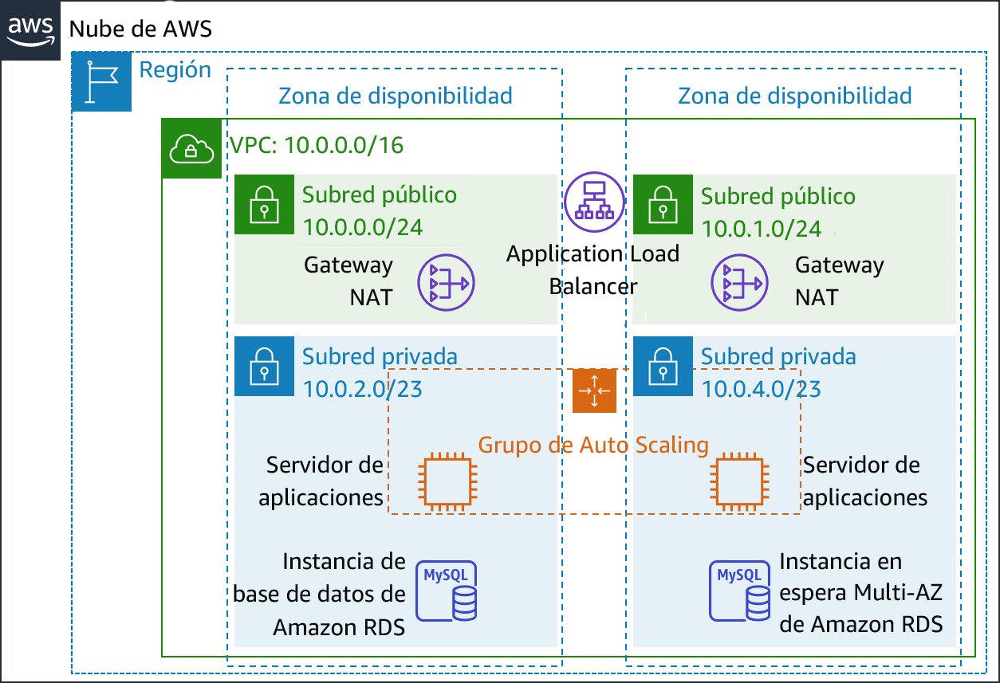
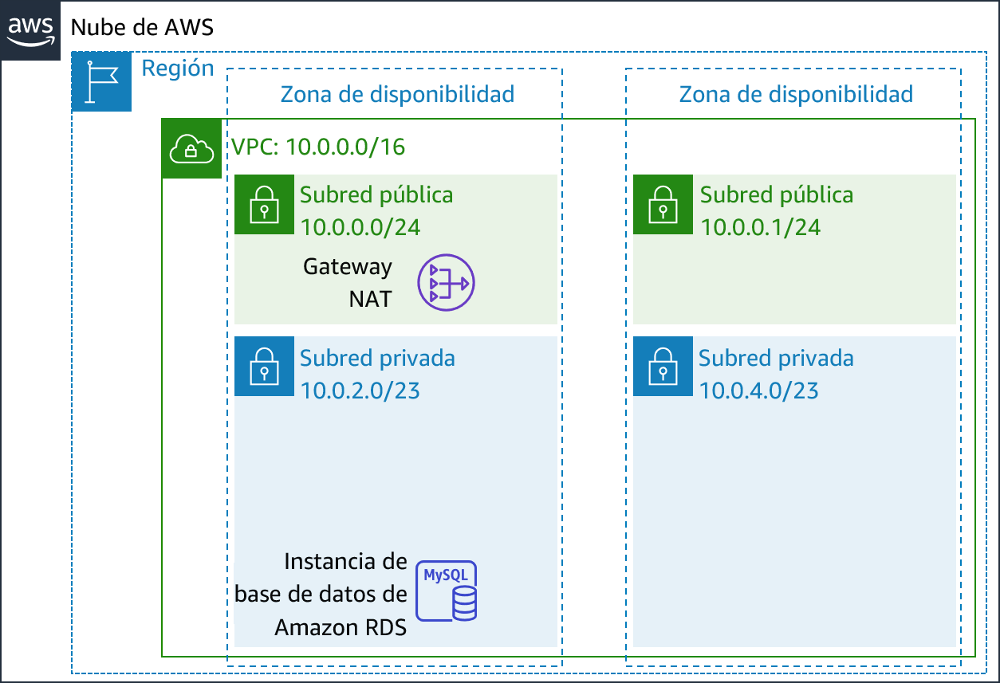
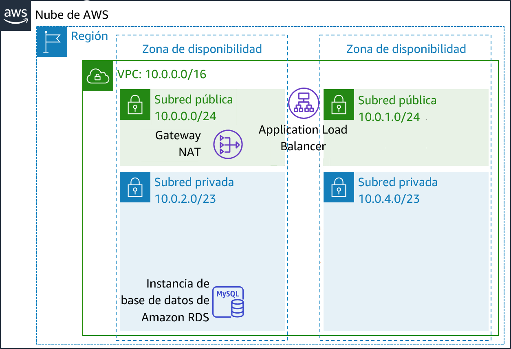
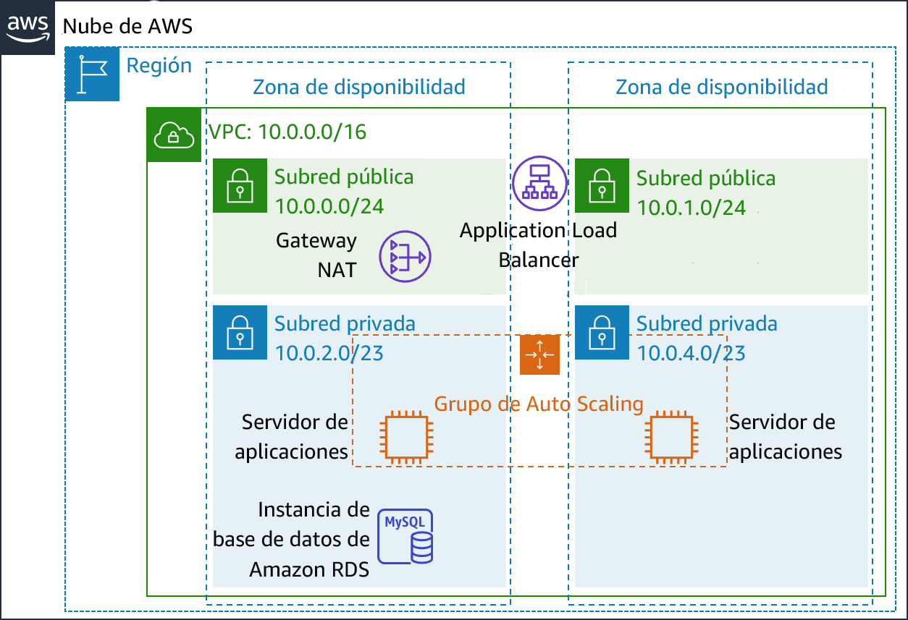
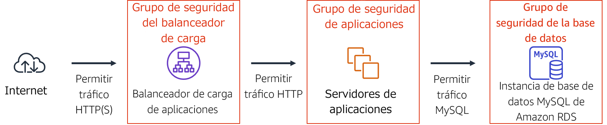
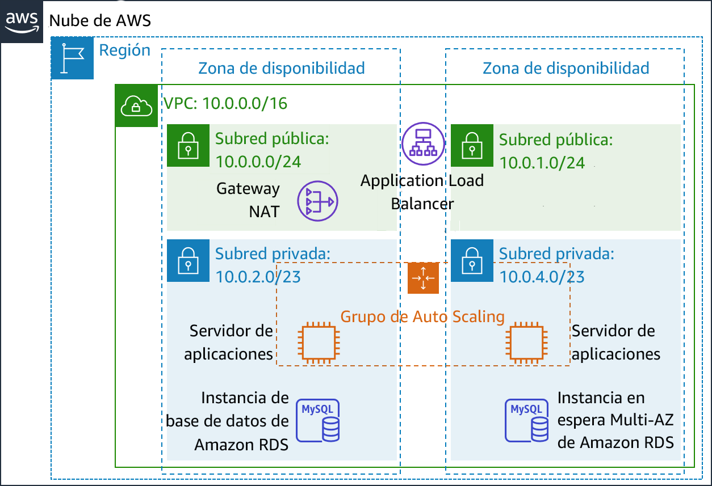
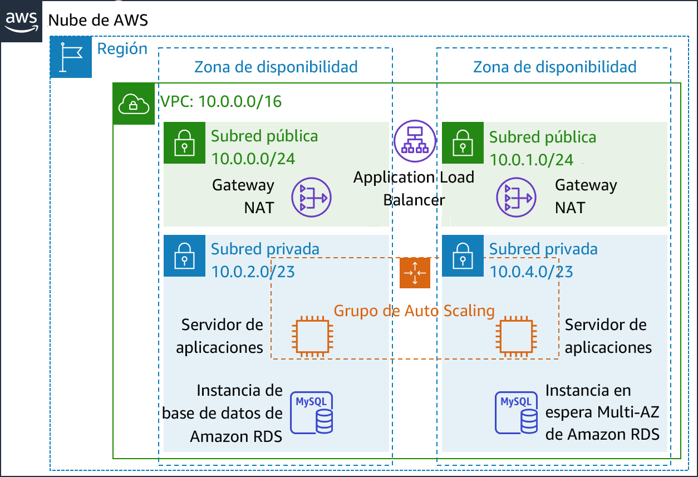

# Módulo 9 - Laboratorio guiado: Creación de un entorno de alta disponibilidad
[//]: # "SKU: ILT-TF-200-ACACAD-2    Source Course: ILT-TF-100-ARCHIT-6 branch dev_65"

## Información general y objetivos del laboratorio

Los sistemas empresariales cruciales deben implementarse como *aplicaciones de disponibilidad alta*, es decir, aplicaciones que permanecen operativas incluso si algunos componentes fallan. Para lograr una disponibilidad alta en Amazon Web Services (AWS), recomendamos que los servicios *se ejecuten en varias zonas de disponibilidad*.

Muchos servicios de AWS cuentan con disponibilidad alta intrínseca, como los balanceadores de carga. Muchos servicios de AWS se pueden configurar también para que tengan disponibilidad alta, por ejemplo, a través de la implementación de instancias Amazon Elastic Compute Cloud (Amazon EC2) en varias zonas de disponibilidad.

En este laboratorio, comenzará con una aplicación que se ejecuta en una única instancia de Amazon EC2 y, a continuación, deberá hacerla tener disponibilidad alta.

Después de completar este laboratorio, debería ser capaz de lo siguiente:

- Inspeccionar una nube virtual privada (VPC)
- Crear un balanceador de carga de aplicaciones
- Crear un grupo de Auto Scaling
- Probar la aplicación para ver si tiene _disponibilidad alta_


Cuando **termine** este laboratorio, la arquitectura se verá como en el siguiente ejemplo:



<br/>
## Duración

El tiempo estimado para completar el laboratorio es de **40 minutos**.


<br/>

## Restricciones de los servicios de AWS

En este entorno de laboratorio, el acceso a los servicios y las acciones de los servicios de AWS puede restringirse a los que se necesiten para cumplir las instrucciones del laboratorio. Es posible que se produzcan errores si intenta acceder a otros servicios o hacer acciones que no sean las que se describen en este laboratorio.

<br/>

## Acceso a la consola de administración de AWS

1. En la parte superior de estas instrucciones, elija <span id="ssb_voc_grey">Start Lab</span> (Iniciar laboratorio) y comience a trabajar en él.

   Se abrirá el panel **Start Lab** (Iniciar laboratorio), donde se muestra el estado del laboratorio.

   <i class="fas fa-info-circle"></i> **Sugerencia**: Si necesita más tiempo para completar el laboratorio, vuelva a hacer clic en el botón <span id="ssb_voc_grey">Start Lab</span> (Iniciar laboratorio) para reiniciar el temporizador del entorno.

2. Espere hasta que en el panel **Start Lab** (Iniciar Laboratorio) se muestre el mensaje *Lab Status: ready (Estado del laboratorio: listo)* y, luego, cierre el panel haciendo clic en la **X**.

3. En la parte superior de estas instrucciones, elija <span id="ssb_voc_grey">AWS</span>.

   Con esta acción, se abrirá la consola de administración de AWS en una nueva pestaña del navegador, y el sistema iniciará su sesión de forma automática.

   <i class="fas fa-exclamation-triangle"></i> **Sugerencia**: Si no se abre una nueva pestaña del navegador, por lo general habrá un aviso o un icono en la parte superior, el cual indicará que el navegador impide que el sitio abra ventanas emergentes. Haga clic en el aviso o el icono y elija **Allow pop ups** (Permitir ventanas emergentes).

4. Ubique la pestaña de la **consola de administración de AWS** de modo que aparezca junto con estas instrucciones. El método más óptimo sería tener ambas pestañas del navegador abiertas al mismo tiempo para que pueda seguir los pasos del laboratorio más fácilmente.

   <i class="fas fa-exclamation-triangle"></i> **No cambie la región a menos que se le indique expresamente que debe hacerlo**.

<br/>

## Tarea 1: Inspeccionar la VPC

Este laboratorio comienza con un entorno ya implementado mediante AWS CloudFormation, incluidos los siguientes elementos:

- Una VPC
- Subredes públicas y privadas en dos zonas de disponibilidad
- Una gateway de Internet (no se muestra) vinculada con las subredes públicas
- Una gateway de traducción de dirección de red (NAT) en una de las subredes públicas
- Una instancia de base de datos de Amazon Relational Database Service (Amazon RDS) en una de las subredes privadas



En esta tarea, analizará la configuración de la VPC que se creó para este laboratorio.

5. En la **consola de administración de AWS**, en el menú <span id="ssb_services">Services<i class="fas fa-angle-down"></i></span> (Servicios), elija **VPC**.

6. En el panel de navegación izquierdo, en **Filter by VPC** (Filtrar por VPC), haga clic en el recuadro <i class="fas fa-search"></i> **Select a VPC** (Seleccionar una VPC) y seleccione **Lab VPC**.

   Esta configuración limita la consola a mostrar solo los recursos vinculados con la _Lab VPC_.

7. En el panel de navegación izquierdo, elija **Your VPCs** (Sus VPC).

   Aquí podrá acceder a la información sobre la **Lab VPC** que se creó para usted.

   La columna **CIDR** tiene un valor de *10.0.0.0/16*, lo que significa que en esta VPC se incluyen todas las direcciones IP que comienzan con *10.0.x.x*.

8. En el panel de navegación izquierdo, elija **Subnets** (Subredes).

   Aquí podrá acceder a la información sobre **Public Subnet 1** (Subred pública 1):

   - En la columna **VPC**, se muestra que esta subred existe dentro de *Lab VPC*.
   - La columna **CIDR IPv4** tiene un valor de *10.0.0.0/24*, lo que significa que en esta subred se incluyen las 256 direcciones IP que hay entre _10.0.0.0_ y _10.0.0.255_. Cinco de estas direcciones están reservadas y son inutilizables.
   - En la columna **Availability Zone** (Zona de disponibilidad), figura la zona de disponibilidad en la que está esta subred.

9. Para ver más detalles en la parte inferior de la página, seleccione <i class="far fa-check-square"></i> **Public Subnet 1** (Subred pública 1).

   **Sugerencia:** Para ajustar el tamaño del panel de ventana inferior, puede arrastrar el divisor.

10. En la mitad inferior de la página, haga clic en la pestaña **Route Table** (Tabla de enrutamiento).

    Allí podrá ver información sobre el direccionamiento de esta subred:

    — Con la primera entrada se especifica que el tráfico destinado dentro del rango de direccionamiento entre dominios sin clases (CIDR) para la VPC (*10.0.0.0/16*) se direcciona dentro de la VPC (*local*).

    — Con la segunda entrada se especifica que el tráfico destinado a Internet (*0.0.0.0/0*) se direcciona a la gateway de Internet (*igw-*). Con esta configuración la subred se convierte en una *subred pública*.

11. Haga clic en la pestaña **Network ACL** (ACL de red).

    En esta pestaña, hay información sobre la lista de control de acceso de red (ACL de red) que está vinculada a la subred. Actualmente, las reglas permiten que *todo el tráfico* entre y salga de la subred, pero las reglas pueden restringirse aún más mediante el uso de grupos de seguridad.

12. En el panel de navegación izquierdo, elija **Internet Gateways** (Gateways de Internet).

Observe que ya hay una gateway de Internet vinculada con la **Lab VPC**.

13. En el panel de navegación izquierdo, elija **Security Groups** (Grupos de seguridad).

14. Seleccione <i class="far fa-check-square"></i> **Inventory DB** (Base de datos del inventario).

Con este grupo de seguridad, se controla el tráfico que entra a la base de datos.

15. En la mitad inferior de la página, elija la pestaña **Inbound rules** (Reglas de entrada).

    Con estas reglas, se permite el tráfico entrante de MySQL o Aurora (puerto 3306) desde cualquier parte de la VPC (_10.0.0.0/16_). Más tarde, modificará esta configuración para que solo se acepte el tráfico de los servidores de aplicaciones.

16. Elija la pestaña **Outbound Rules** (Reglas de salida).

    De forma predeterminada, los grupos de seguridad permiten todo el tráfico saliente. Sin embargo, esta configuración se puede modificar según sea necesario.

<br/>
## Tarea 2: Crear un balanceador de carga de aplicaciones

Para crear una aplicación de disponibilidad alta, una práctica recomendada es lanzar recursos en *varias zonas de disponibilidad*. Las zonas de disponibilidad son centros de datos (o grupos de centros de datos) físicamente separados en la misma región. Si ejecuta las aplicaciones en varias zonas de disponibilidad, puede proporcionar más *disponibilidad* si un centro de datos experimentara un error.

Debido a que la aplicación se ejecuta en varios servidores de aplicaciones, necesitará una forma de distribuir el tráfico entre los servidores. Puede lograr esta meta mediante el uso de un*balanceador de carga*. Con este balanceador de carga también se llevarán a cabo comprobaciones de estado de las instancias y solo se enviarán solicitudes a las instancias que estén en buen estado.



17. En el menú <span id="ssb_services">Services<i class="fas fa-angle-down"></i></span> (Servicios), elija **EC2**.

18. En el panel de navegación izquierdo, elija **Load Balancers** (Balanceadores de carga). Es posible que deba desplazarse hacia abajo para encontrarlo.

19. Elija <span id="ssb_blue">Create load balancer</span> (Crear balanceador de carga).

A continuación, se muestran varios tipos de balanceadores de carga. Lea las descripciones de cada tipo para comprender sus capacidades.

20. Para **Application Load Balancer** (Balanceador de carga de aplicaciones), elija <span id="ssb_blue">Create</span> (Crear).

21. En **Name** (Nombre), escriba `Inventory-LB`.

22. Desplácese hasta la sección **Availability Zones** (Zonas de disponibilidad) y en **VPC** seleccione **Lab VPC**.

    A continuación, especificará qué _subredes_ debe utilizar el balanceador de carga. Será un balanceador de carga público, así que seleccionará subredes públicas en ambos casos.

23. Elija la **primera** zona de disponibilidad y, a continuación, elija la **subred pública** que se muestra.

24. Elija la **segunda** zona de disponibilidad y, a continuación, elija la **subred pública** que se muestra.

    Debería haber dos subredes seleccionadas: **Public Subnet 1** (Subred pública 1) y **Public Subnet 2 (Subred pública 2)**. (Si no es el caso, regrese e intente hacer la configuración otra vez).

25. Elija <span id="ssb_grey">Next: Configure Security Settings</span> (Siguiente: Definir la configuración de seguridad).

    Se muestra una advertencia en que se recomienda utilizar HTTP segura (HTTPS) para más seguridad. Es un buen consejo, pero no es necesario para este laboratorio.

26. Elija <span id="ssb_grey">Next: Configure Security Groups</span> (Siguiente: Configurar grupos de seguridad).

    A continuación, creará un grupo de seguridad que acepte todo el tráfico _HTTP_ y _HTTPS_ entrante.

27. Seleccione <i class="far fa-dot-circle"></i> **Create a _new_ security group** (Crear un nuevo grupo de seguridad) y configure lo siguiente:

    - **Security group name** (Nombre del grupo de seguridad): `Inventory-LB`
    - **Description** (Descripción): `Enable web access to load balancer (Habilitar el acceso web al balanceador de carga)`

28. Configure la regla que ya existe (que ya está en la página) de la siguiente manera:

    - **Type** (Tipo): _HTTP_
    - **Source** (Origen): _Anywhere (Cualquiera)_

29. Elija <span id="ssb_grey">Add rule</span> (Agregar regla) y configure lo siguiente:

    - **Type** (Tipo): _HTTPS_
    - **Source** (Origen): _Anywhere (Cualquiera)_

    Con esta configuración se aceptarán todas las solicitudes HTTP y HTTPS entrantes.

30. Elija <span id="ssb_grey">Next: Configure Routing</span> (Siguiente: Configurar el direccionamiento).

    Con los _grupos de objetivos_, se define dónde *enviar* el tráfico que entra en el balanceador de carga. El balanceador de carga de aplicaciones puede enviar tráfico a varios grupos de destino en función de la URL de la solicitud entrante: por ejemplo, enviar las solicitudes de aplicaciones móviles a un conjunto de servidores diferente de al que se envían otros tipos de solicitudes. La aplicación web utilizará solo un grupo de objetivos.

31. En **Name** (Nombre), escriba: `Inventory-App`.

32. Amplíe <i class="fas fa-caret-right"></i> **Advanced health check settings** (Configuración avanzada de la comprobación de estado).

    Con el balanceador de carga de aplicaciones se hacen _comprobaciones de estado_ de manera automática en todas las instancias para velar por que respondan a las solicitudes. Se recomienda utilizar la configuración predeterminada, pero la acelerará un poco para utilizarla en este laboratorio.

33. Configure los siguientes valores:

    - **Healthy threshold** (Umbral en buen estado): `2`
    - **Interval** (Intervalo): `10`

    Esta configuración implica que se hará una comprobación de estado cada 10 segundos y, si la instancia responde correctamente dos veces seguidas, se considerará que está en buen estado.

34. Elija <span id="ssb_grey">Next: Register Targets</span> (Siguiente: Registrar objetivos).

   Los_objetivos_ son las instancias individuales que responden a las solicitudes del balanceador de carga. Todavía no tiene instancias de aplicación web, así que puede omitir este paso.

35. Elija <span id="ssb_grey">Next: Review</span> (Siguiente: Revisión).

36. Revise la configuración y, a continuación, elija <span id="ssb_blue">Create</span> (Crear) y después <span id="ssb_blue">Close</span> (Cerrar).

    A continuación, el balanceador de carga se aprovisionará en segundo plano. No es necesario que espere mientras.

<br/>
## Tarea 3: Crear un grupo de Auto Scaling

*Amazon EC2 Auto Scaling* es un servicio diseñado para _lanzar_ o _terminar_ las instancias de Amazon EC2 automáticamente según políticas, programas y comprobaciones de estado definidos por el usuario. También *distribuye automáticamente instancias a través de varias zonas de disponibilidad* para hacer que las aplicaciones tengan *disponibilidad alta*.

En esta tarea, creará un grupo de Auto Scaling que implementa instancias EC2 en las *subredes privadas*, lo cual es una práctica recomendada de seguridad para la implementación de aplicaciones. No se puede acceder a las instancias de una subred privada desde Internet. En vez de eso, los usuarios envían solicitudes al balanceador de carga, que reenvía las solicitudes a instancias EC2 en las subredes privadas.




<br/>
### Crear una AMI para Auto Scaling

Creará una Imagen de Amazon Machine (AMI) del _servidor web 1_ que ya existe. Hacerlo le permitirá guardar el contenido del disco de arranque para que se puedan lanzar instancias nuevas con contenido idéntico.

37. En la **consola de administración de AWS**, en el menú <span id="ssb_services">Services<i class="fas fa-angle-down"></i></span> (Servicios), haga clic en **EC2**.

38. En el panel de navegación izquierdo, haga clic en **Instances** (Instancias).

    En primer lugar, confirmará que la instancia se está ejecutando.

39. Espere hasta que en **Status Checks** (Comprobaciones de estado) del **servidor web 1** se muestre el mensaje *2/2 checks passed (2/2 comprobaciones aprobadas)*. Haga clic en Refresh (Actualizar) <i class="fas fa-sync"></i> para actualizar.

    A continuación, creará una AMI basada en esta instancia.

40. Seleccione <i class="far fa-check-square"></i> **Web Server 1** (Servidor web 1).

41. En el menú <span id="ssb_grey">Actions<i class="fas fa-angle-down"></i></span> (Acciones), haga clic en **Image** (Imagen) y en **Create Image** (Crear imagen) y, a continuación, configure lo siguiente:

    - **Image name** (Nombre de la imagen): `Web Server AMI (AMI del servidor web)`
    - **Image description** (Descripción de la imagen): `Lab AMI for Web Server (AMI de laboratorio para servidor web)`

42. Haga clic en <span id="ssb_orange">Create Image</span> (Crear imagen).

    En la pantalla de confirmación, se muestra la **AMI ID** (ID de la AMI) de la AMI nueva.

43. Haga clic en <span id="ssb_blue">Close</span> (Cerrar).

    Utilizará esta AMI cuando más adelante lance el grupo de Auto Scaling en el laboratorio.

<br/>

### Crear una configuración de lanzamiento y un grupo de Auto Scaling

En primer lugar, creará una *configuración de lanzamiento*, con la cual se define el tipo de instancias que Amazon EC2 Auto Scaling debería lanzar. La interfaz es similar a cuando se lanza una instancia EC2. Sin embargo, en lugar de lanzarse una instancia, se _almacena_ la configuración para su uso posterior.

44. En el panel de navegación izquierdo, elija **Launch Configurations** (Configuraciones de lanzamiento).

45. Elija <span id="ssb_orange">Create launch configuration</span> (Crear configuración de lanzamiento).

46. Configure lo siguiente:

    - **Launch configuration name** (Nombre de la configuración de lanzamiento): `Inventory-LC`

    - **Amazon Machine image (AMI)** (Imagen de Amazon Machine [AMI]): elija *Web Server AMI (AMI del servidor web)*

    - **Instance type** (Tipo de instancia):

       - Elija <span id="ssb_white">Choose instance type</span> (Elegir un tipo de instancia)
       - Seleccione *t3.micro*
       - Seleccione <span id="ssb_orange">Choose</span> (Elegir)

       **Nota:** Si lanzó el laboratorio en la región us-east-1, seleccione el tipo de instancia **t2.micro**. Para encontrar la región, busque en la esquina superior derecha de la consola de Amazon EC2.

       **Nota:** Si recibe el mensaje de error “Something went wrong. Please refresh and try again.” (Algo salió mal. Actualícelo e inténtelo de nuevo.), puede ignorarlo y continuar con el ejercicio.

    - **Configuración adicional**

       - **IAM instance profile** (Perfil de instancia de IAM): seleccione _Inventory-App-Role_.
    - **Monitoring** (Monitoreo): </i> seleccione <i class="far fa-check-square"></i> *Enable EC2 instance detailed monitoring within CloudWatch (Habilitar monitoreo detallado de instancia EC2 dentro de CloudWatch)*

       Ello permite que Auto Scaling reaccione rápidamente a los cambios en la utilización.

47. Amplíe <i class="fas fa-caret-right"></i> **Advanced details** (Detalles avanzados). En **User data** (Datos de usuario), copie y pegue este script:

```bash
#!/bin/bash
# Install Apache Web Server and PHP
yum install -y httpd mysql
amazon-linux-extras install -y php7.2
# Download Lab files
wget https://aws-tc-largeobjects.s3-us-west-2.amazonaws.com/ILT-TF-200-ACACAD-20-EN/mod9-guided/scripts/inventory-app.zip
unzip inventory-app.zip -d /var/www/html/
# Download and install the AWS SDK for PHP
wget https://github.com/aws/aws-sdk-php/releases/download/3.62.3/aws.zip
unzip aws -d /var/www/html
# Turn on web server
chkconfig httpd on
service httpd start
```

48. En **Security groups** (Grupos de seguridad)

- **Select an existing security group** (Seleccionar un grupo de seguridad que ya existe): _Inventory-App_.

<i class="fas fa-comment"></i> Recibirá esta advertencia: _You will not be able to connect to the instance (No podrá conectarse a la instancia)_. Puede ignorarla, pues no se conectará a la instancia. Toda la configuración se hace a través del script de datos de usuario.

49. En **Key pair (log in) (Par de claves [inicio de sesión])**:

* Seleccione **Proceed without a key pair** (Continuar sin un par de claves).
* Seleccione <i class="far fa-check-square"></i> *I acknowledge that... (Confirmo que...)*

50. Elija <span id="ssb_orange">Create launch configuration</span> (Crear configuración de lanzamiento).

Con la _configuración de lanzamiento_ se definió *qué lanzar*, pero con el _grupo de Auto Scaling_ se define *a dónde lanzar* los recursos.


51. En la tabla **Launch configurations** (Lanzar configuraciones), seleccione <i class="far fa-check-square"></i> *Inventory-LC*.

52. En el botón <span id="ssb_white">Actions<i class="fas fa-caret-down"></i></span> (Acciones), elija *Create Auto Scaling group (Crear grupo de Auto Scaling)*.

53. Escriba el nombre del grupo de Auto Scaling:

   - **Name** (Nombre): `Inventory-ASG` (*ASG* significa _grupo de Auto Scaling_).

54. Elija <span id="ssb_orange">Next</span> (Siguiente).

55. En la página **Network** (Red), configure lo siguiente:

    - **VPC:** _Lab VPC_

    - **Subnet** (Subred): seleccione _Private Subnet 1 (Subred privada 1)_ **y** _Private Subnet 2 (Subred privada 2)_.

    <i class="fas fa-comment"></i> Puede ignorar la advertencia: _No public IP addresses will be assigned (No se asignarán direcciones IP públicas)_. Las instancias EC2 se lanzarán en una _subred privada_, así que no requieren direcciones IP públicas.

    Ello lanzará las instancias EC2 en subredes privadas en ambas zonas de disponibilidad.

56. Elija <span id="ssb_orange">Next</span> (Siguiente).

57. En **Load balancing** (Balanceo de carga):

    - Seleccione <i class="far fa-check-square"></i> **Enable load balancing** (Habilitar el balanceo de carga)
    - Elija **Application Load Balancer** (Balanceador de carga de aplicaciones o ELB) o **Network Load Balancer** (Balanceador de carga de red)
    - **Elija un grupo de objetivos para el balanceador de carga:** *Inventory-App*

    Con esta configuración se indica al grupo de Auto Scaling que registre las instancias EC2 nuevas como parte del grupo de objetivos _Inventory-App_ que creó. Con el balanceador de carga se enviará tráfico a las instancias que están en ese grupo de objetivos.

58. En **Health checks** (Comprobaciones de estado):

- Seleccione <i class="far fa-check-square"></i> **ELB**
- **Health Check grace period** (Periodo de gracia para la comprobación de estado): 90

59. En **Additional settings** (Configuración adicional):

- seleccione <i class="far fa-check-square"></i> **Enable group metrics collection within CloudWatch** (Activar la recopilación de métricas de grupo en CloudWatch)

60. Elija <span id="ssb_orange">Next</span> (Siguiente).

61. En **Group Size** (Tamaño de grupo), configure lo siguiente:

    - **Desired capacity** (Capacidad deseada): 2
    - **Minimum capacity** (Capacidad mínima): 2
    - **Maximum capacity** (Capacidad máxima): 2

62. En **Scaling policies** (Políticas de escalado), elija *None (Ninguna)*.

    Para este laboratorio, *mantendrá dos instancias en todo momento* para velar por _una disponibilidad alta_. Si se espera que la aplicación reciba cargas variables de tráfico, también puede crear _políticas de escalado_, las cuales definan cuándo lanzar o terminar instancias. Sin embargo, no es necesario crear políticas de escalado para la aplicación de inventario en este laboratorio.

63. Elija <span id="ssb_orange">Next</span> (Siguiente).

64. En la página **Add notifications** (Agregar notificaciones) , elija <span id="ssb_orange">Next</span> (Siguiente). No es necesario definir estos ajustes.

65. En la página **Add tags** (Agregar etiquetas), elija <span id="ssb_white">Add tag</span> (Agregar etiqueta).
    - **Key** (Clave): `Name (Nombre)`
    - **Value** (Valor): `Inventory-App`
    - Seleccione <i class="far fa-check-square"></i> <span id="ssb_orange">Next</span> (Siguiente)

    Con estos ajustes _se etiquetará_ al grupo de Auto Scaling con un *Nombre*, que aparecerá también en las instancias EC2 lanzadas por el grupo de Auto Scaling. Puede utilizar etiquetas para determinar qué instancias Amazon EC2 están vinculadas con cada aplicación. También puede agregar etiquetas como *Cost Center (Centro de costos)* para asignar los costos de la aplicación en los archivos de facturación.

66. En la página **Review** (Revisar):

    - Elija <span id="ssb_orange">Create Auto Scaling group</span> (Crear grupo de Auto Scaling).

    Aparecerá en la consola _Inventory-ASG_:

    

    De la revisión se desprende lo siguiente:

    - El grupo actualmente *no tiene instancias*, pero el icono de información <i class="fas fa-info-circle"></i> indica que se están iniciando instancias. (Para obtener más información, pase el cursor sobre el icono).
    - La cantidad **Deseada** es *2 instancias*. Amazon EC2 Auto Scaling intentará lanzar dos instancias para alcanzar la cantidad deseada
    - Los valores **Mínimos** y **Máximos** también se establecen en *2 instancias*. Amazon EC2 Auto Scaling intentará dar siempre dos instancias, incluso si se produce un error.

    Pronto la aplicación se ejecutará en dos zonas de disponibilidad, y Amazon EC2 Auto Scaling mantendrá esa configuración, aunque haya un error en una instancia o zona de disponibilidad.

    Después de un minuto, elija <i class="fas fa-sync"></i> **Refresh** (Refrescar) para actualizar la pantalla. Debería mostrar que se están ejecutando *2 instancias*.

<br/>
## Tarea 4: Actualizar los grupos de seguridad

La aplicación que implementó es una *arquitectura de tres niveles*. A continuación, configurará los grupos de seguridad para aplicar estos niveles:



<br/>
### Grupo de seguridad del balanceador de carga

Ya configuró el _grupo de seguridad del balanceador de carga_ cuando creó el balanceador de carga. Acepta todo el tráfico _HTTP_ y _HTTPS_ entrante.

El balanceador de carga ha sido configurado para reenviar las solicitudes entrantes a un _grupo de objetivos_. Cuando lanza nuevas instancias, Auto Scaling agrega automáticamente esas instancias al grupo de objetivos.

<br/>
### Grupo de seguridad de la aplicación

El _grupo de seguridad de la aplicación_ se dio como parte de la configuración del laboratorio. A continuación, lo configurará para que solo acepte tráfico entrante del balanceador de carga.

67. En el panel de navegación izquierdo, elija **Security Groups (Grupos de seguridad)**.
68. Seleccione <i class="far fa-check-square"></i> **Inventory-App**.

69. En la mitad inferior de la página, elija la pestaña **Inbound rules** (Reglas de entrada).

Actualmente, el grupo de seguridad está vacío. A continuación, agregará una regla para aceptar el tráfico _HTTP_ entrante del balanceador de carga. No es necesario configurar el tráfico _HTTPS_, pues el balanceador de carga se configuró para reenviar solicitudes HTTPS a través de HTTP. Esta práctica descarga la seguridad al balanceador de carga, lo que reduce la cantidad de trabajo que requieren los servidores de aplicaciones individuales.

70. Elija <span id="ssb_grey">Edit inbound rules</span> (Editar reglas de entrada).

71. En la página **Edit inbound rules** (Editar reglas de entrada), elija <span id="ssb_grey">Add rule</span> (Agregar regla) y defina estas opciones:

- **Type** (Tipo): _HTTP_
- **Source** (Origen):
   - Haga clic en el recuadro de búsqueda que está al lado de **Custom** (Personalizado)
   - Eliminar el contenido actual
   - Escriba `sg`
   - En la lista que aparece, seleccione **Inventario-LB**
- **Description** (Descripción): `tráfico del balanceador de carga`
- Elija <span id="ssb_orange">Save rules</span> (Guardar reglas)

Los servidores de aplicaciones ya pueden recibir tráfico del balanceador de carga, que incluye las comprobaciones de estado que el _balanceador de carga_ hace de forma automática.

<br/>
### Grupo de seguridad de base de datos

A continuación, debe configurar el _grupo de seguridad de la base de datos_ para que solo acepte el tráfico entrante de los servidores de aplicaciones.

72. Seleccione <i class="far fa-check-square"></i> **Inventory-DB** (y asegúrese de que no se hayan seleccionado otros grupos de seguridad).

La regla que ya existe permite el tráfico en el puerto 3306 (utilizado por MySQL) desde cualquier dirección IP dentro de la VPC. Es una buena regla, pero la seguridad se puede restringir aún más.

73. En la ficha **Inbound rules** (Reglas entrantes), elija <span id="ssb_grey">Edit inbound rules</span> (Editar reglas de entrada) y configure estas opciones:

- Haga clic en el recuadro de búsqueda que está al lado de **Custom** (Personalizado)
- Eliminar el contenido actual
- Type (Tipo) `sg`
- Seleccione **Inventory-App** de la lista que se muestra
- **Description** (Descripción): `tráfico de los servidores de aplicaciones`
- Elija <span id="ssb_orange">Save rules</span> (Guardar reglas)

Ya configuró la _seguridad de tres niveles_. Cada elemento de nivel solo acepta tráfico del nivel anterior.

Además, el uso de subredes privadas significa que tiene dos barreras de seguridad entre Internet y los recursos de aplicaciones. Esta arquitectura sigue la práctica recomendada de aplicar varias capas de seguridad.

<br/>
## Tarea 5: Probar la aplicación

La aplicación ya está lista para probarla.

Para esta tarea, deberá confirmar que la aplicación web esté en ejecución y comprobar que tiene disponibilidad alta.

74. En el panel de navegación izquierdo, elija **Target Groups** (Grupos de objetivos).

Se mostrará el grupo de instancias *Inventory-App*.

75. En la mitad inferior de la página, elija la pestaña **Targets** (Objetivos).

En esta pestaña deberían aparecer dos *objetivos registrados*. En la columna **Status** (Estado) se muestran los resultados de la comprobación de estado del balanceador de carga que se hace en las instancias.

76. En la zona superior derecha, de vez en cuando elija <i class="fas fa-sync"></i> **Refresh** (Refrescar) hasta que el **Status** (Estado) de ambas instancias figure como *en buen estado*.

Si el estado no cambia eventualmente a *en buen estado*, pida ayuda a su instructor para diagnosticar la configuración. Pase el cursor sobre el <i class="fas fa-info-circle"></i> icono de la columna **Status** (Estado) para acceder a más información sobre el estado.

Probará la aplicación conectándose al balanceador de carga, que luego enviará su solicitud a una de las instancias EC2. Antes tendrá que recuperar el nombre del sistema de nombres de dominio (DNS) del balanceador de carga.

77. En el panel de navegación izquierdo, elija **Load Balancers** (Balanceadores de carga).

78. En la pestaña **Description** (Descripción), situada en la mitad inferior de la ventana, copie el **nombre de DNS** al portapapeles.

Debe parecerse al siguiente: *inventory-LB-xxxx.elb.amazonaws.com*.

79. Abra una nueva pestaña en el navegador web, pegue el nombre de DNS del portapapeles y presione INTRO.

El balanceador de carga envió su solicitud a una de las instancias EC2. El ID de la instancia y la zona de disponibilidad se muestran en la parte inferior de la página web.

80. Vuelva a cargar <i class="fas fa-sync"></i> la página en el navegador web. Debería constatar que el ID de la instancia y la zona de disponibilidad a veces cambian entre las dos instancias.

    El flujo de información, cuando se muestra esta aplicación web, es el siguiente:

    

    - Envió la solicitud al *balanceador de carga*, que reside en las *subredes públicas* que están conectadas a Internet.
    
    - El balanceador de carga eligió una de las *instancias EC2* que residen en las *subredes privadas* y le envió la solicitud.
    
    - Después la instancia EC2 devolvió la página web al balanceador de carga, que la devolvió al navegador web.

<br/>
## Tarea 6: Comprobar la disponibilidad alta

La aplicación se configuró para que tuviera disponibilidad alta. Puede comprobar la disponibilidad alta de la aplicación terminando una de las instancias EC2.

81. Vuelva a la pestaña de la **consola de Amazon EC2** del navegador web (pero no cierre la pestaña de la aplicación web, ya que pronto deberá volver a ella).

82. En el panel de navegación izquierdo, elija **Instances** (Instancias).

A continuación, debe terminar una de las instancias de aplicación web para simular un error.

83. Seleccione <i class="far fa-check-square"></i> una de las instancias **Inventory-App** (no importa cuál seleccione).

84. Elija <span id="ssb_grey">Actions<i class="fas fa-angle-down"></i></span> (Acciones) y, a continuación, **Instance State > Terminate** (Estado de instancia > Terminar).

85. Elija **Yes, Terminate** (Sí, terminar).

En poco tiempo, en las comprobaciones de estado del balanceador de carga se constatará que la instancia no responde. Con el balanceador de carga, se direccionarán automáticamente todas las solicitudes a la instancia restante.

86. Regrese a la pestaña de la aplicación web del navegador web y vuelva a cargar <i class="fas fa-sync"></i> la página varias veces.

Debería constatar que la *zona de disponibilidad* que se muestra en la parte inferior de la página permanece igual. Aunque se produjo un error en una instancia, la aplicación permanece disponible.

Después de unos minutos, Amazon EC2 Auto Scaling también notará el fallo de la instancia. Fue configurado para mantener dos instancias en ejecución, así que Amazon EC2 Auto Scaling *lanzará automáticamente una instancia de reemplazo*.

87. Vuelva a la pestaña de la **consola de Amazon EC2** del navegador web. En la zona superior derecha, seleccione “Refresh (Actualizar)” <i class="fas fa-sync"></i> cada 30 segundos hasta que aparezca una nueva instancia EC2.

Después de unos minutos, la comprobación de estado de la instancia nueva debería indicar que está en buen estado. El balanceador de carga seguirá enviando el tráfico entre dos zonas de disponibilidad. Puede volver a cargar la pestaña de la aplicación web para constatarlo.

Esta tarea demuestra que la aplicación ya tiene _disponibilidad alta_.

<br/>
## Tarea opcional 1: Hacer que la base de datos tenga disponibilidad alta

<i class="fas fa-comment"></i> _Esta tarea es **opcional**. Puede trabajar en esta tarea si le queda tiempo de laboratorio._

La arquitectura de la aplicación ya tiene disponibilidad alta. Sin embargo, la base de datos de Amazon RDS opera desde una sola instancia de base de datos.

En esta tarea opcional, hará que la base de datos tenga disponibilidad alta configurándola para que se ejecute en varias zonas de disponibilidad (es decir, con una *implementación Multi-AZ*).



88. En el menú <span id="ssb_services">Services<i class="fas fa-angle-down"></i></span> (Servicios), elija **RDS**.

89. En el panel de navegación izquierdo, elija **Databases** (Base de datos).

90. Elija <span style="color:blue;">inventory-db</span>.

No dude en explorar la información sobre la base de datos.

91. Elija <span id="ssb_rds_white">Modify</span> (Modificar).

92. Para la **implementación Multi-AZ**, seleccione <i class="far fa-dot-circle"></i> **Yes** (Sí).

Solo tiene que hacer eso para convertir la base de datos de modo tal que se ejecute en varios centros de datos (zonas de disponibilidad).

Esta opción no significa que la base de datos se _distribuye_ entre varias instancias. En vez de eso, una instancia es la instancia _principal_, que se encarga de todas las solicitudes. Otra instancia se lanzará como la instancia _en espera_, que toma el relevo si la instancia principal falla. La aplicación sigue utilizando el mismo nombre de DNS para la base de datos. Sin embargo, las conexiones se redirigirán automáticamente al servidor de base de datos activo actualmente.

Puede escalar una instancia EC2 cambiando atributos y también puede escalar una base de datos de RDS de esta manera. A continuación, escalará la base de datos.

93. Para **DB instance class** (Clase de instancia de base de datos), seleccione **db.t3.small**.

Hacer esta acción duplica el tamaño de la instancia.

94. Para **Allocated storage** (Almacenamiento asignado), escriba: `10`

Hacer esta acción duplica la cantidad de espacio que se asigna a la base de datos.

No dude en explorar las otras opciones de la página, pero no cambie los valores.

95. En la parte inferior de la página, elija <span id="ssb_orange">Continue</span> (Continuar).

El rendimiento de la base de datos se verá afectado por estos cambios. Por tanto, estos cambios se pueden programar para un intervalo de mantenimiento definido, o bien se pueden ejecutar inmediatamente.

96. En la sección **Scheduling of Modifications** (Programación de modificaciones), seleccione <i class="far fa-dot-circle"></i> **Apply immediately** (Aplicar inmediatamente).

97. Elija <span id="ssb_orange">Modify DB Instance</span> (Modificar instancia de base de datos).

La base de datos entra en un estado de _modificación_ mientras se aplican los cambios. No es necesario esperar a que termine.

<br/>
## Tarea opcional 2: Establecer una gateway de NAT de disponibilidad alta

<i class="fas fa-comment"></i> _Esta tarea es **opcional**. Puede trabajar en esta tarea si le queda tiempo de laboratorio._

Los servidores de aplicaciones se ejecutan en una subred privada. Si los servidores deben acceder a Internet (por ejemplo, para descargar datos), las solicitudes deben redirigirse a través de una puerta de _gateway de conversión de las direcciones de red (NAT)_. (La gateway de NAT debe estar ubicada en una subred pública).

La arquitectura actual solo tiene una gateway de NAT en _Public Subnet 1 (Subred pública 1)_. Por tanto, si falla la zona de disponibilidad 1, los servidores de aplicaciones no podrán comunicarse con Internet.

En esta tarea opcional, hará que la gateway de NAT tenga disponibilidad alta lanzando otra gateway de NAT en la otra zona de disponibilidad. La arquitectura resultante tendrá disponibilidad alta:



98. En el menú <span id="ssb_services">Services (Servicios)<i class="fas fa-angle-down"></i></span>, elija **VPC**.

99. En el panel de navegación izquierdo, haga clic en **NAT Gateways (Gateways NAT)**.

Aparece la gateway de NAT que ya existe. A continuación, creará una gateway de NAT para la otra zona de disponibilidad.

100. Elija <span id="ssb_orange">Create NAT gateway</span> (Crear gateway de NAT) y defina los siguientes ajustes:

     - **Subnet** (Subred): *PublicSubnet2* (seleccione esta opción de la lista)

     <i class="fas fa-comment"></i>Los detalles de la*subred* están al principio de estas instrucciones. Elija **Details** (Detalles)y, a la derecha de **AWS**, elija **Show** (Mostrar). Tenga en cuenta los nombres de **PublicSubnet2** y **NATGateway1**.

     - Elija <span id="ssb_grey">Allocate Elastic IP</span> (Asignar IP elástica).
     - Elija <span id="ssb_orange">Create NAT gateway</span> (Crear gateway de NAT).
     - Elija <span id="ssb_blue">Edit route tables</span> (Editar tablas de enrutamiento).

     A continuación, creará una nueva tabla de enrutamiento para _Private Subnet 2_. Esta tabla de enrutamiento redirigirá el tráfico a la nueva gateway de NAT.

101. Elija <span id="ssb_blue">Create route table</span> (Crear tabla de enrutamiento) y defina los siguientes ajustes:

     - **Name tag** (Etiqueta de nombre): `Private Route Table 2`
     - **VPC:** _Lab VPC_
     - Elija <span id="ssb_blue">Create</span> (Crear) y, a continuación, <span id="ssb_blue">Close</span> (Cerrar).

102. Seleccione <i class="far fa-check-square"></i> **Private Route Table 2** (Tabla de enrutamiento privada 2) y confirme que es la única tabla de enrutamiento seleccionada.

103. Elija la pestaña **Routes** (Rutas).

     Actualmente, una ruta dirige todo el tráfico _locally_.
    
     A continuación, agregará una ruta para enviar el tráfico vinculado a Internet a través de la gateway de NAT nueva.

104. Elija <span id="ssb_grey">Edit routes</span> (Editar rutas) y, a continuación, defina los siguientes ajustes:

     - Elija <span id="ssb_grey">Add route</span> (Agregar ruta).
     - **Destination** (Destino): `0.0.0.0/0`
     * **Objetivo:** seleccione la _gateway de NAT_y, a continuación, seleccione la entrada _nat-_ que *no* es la entrada de _NATGateway1_, que está debajo del botón **Details** (Detalles) situado encima de estas instrucciones.
     - Elija <span id="ssb_blue">Save routes</span> (Guardar rutas) y, a continuación, <span id="ssb_blue">Close</span> (Cerrar).

     <i class="fas fa-comment"></i>La gateway de NAT que aparece bajo el botón **Details** (Detalles), que está encima de estas instrucciones, es para _Public Subnet 1 (Subred pública 1)_. Está configurando la tabla de enrutamiento para utilizar la _otra_ gateway de NAT.

105. Elija la pestaña **Subnet Associations** (Asociaciones de subredes).

106. Elija <span id="ssb_grey">Edit subnet associations</span> (Editar asociaciones de subredes).

107. Seleccione <i class="far fa-check-square"></i> **Private Subnet 2** (Subred privada 2).

108. Elija <span id="ssb_blue">Save</span> (Guardar).

     Con esta acción, el tráfico vinculado a Internet proveniente de la Subred privada 2 se comenzará a enviar a la gateway de NAT que está en la misma zona de disponibilidad.

     Las gateways de NAT ya tienen disponibilidad alta. Un error en una zona de disponibilidad no afectará al tráfico de la otra zona de disponibilidad.

<br/>
## Envío de su trabajo

109. En la parte superior de estas instrucciones, elija <span id="ssb_blue">Submit</span> (Enviar) para registrar su progreso y, cuando se le indique, elija **Yes** (Sí).

110. Si los resultados no se muestran después de algunos minutos, vuelva a la parte superior de estas instrucciones y elija <span id="ssb_voc_grey">Grades</span> (Resultados).

     **Sugerencia**: Puede enviar su trabajo varias veces. Después de realizar las modificaciones pertinentes, vuelva a elegir **Submit** (Enviar). Su último envío es el que se registrará para este laboratorio.

111. Para encontrar comentarios detallados sobre su trabajo, elija <span id="ssb_voc_grey">Details</span> (Detalles) seguido de <i class="fas fa-caret-right"></i> **View Submission Report** (Ver informe de envío).

<br/>

## Fin del laboratorio <i class="fas fa-graduation-cap"></i>

<i class="fas fa-flag-checkered"></i> ¡Felicitaciones! Ha completado el laboratorio.

112. Elija <span id="ssb_voc_grey">End Lab</span> (Finalizar laboratorio) en la parte superior de esta página y, a continuación, seleccione <span id="ssb_blue">Yes</span> (Sí) para confirmar que desea finalizar el laboratorio.

     Un panel presentará el mensaje *DELETE has been initiated… You may close this message box now (Se ha iniciado la ELIMINACIÓN… Ya puede cerrar este cuadro de mensaje)*.

113. Seleccione la **X** de la esquina superior derecha para cerrar el panel.


*©2020 Amazon Web Services, Inc. y sus empresas afiliadas. Todos los derechos reservados. Este contenido no puede reproducirse ni redistribuirse, total ni parcialmente, sin el permiso previo por escrito de Amazon Web Services, Inc. Queda prohibida la copia, el préstamo y la venta de carácter comercial.*
