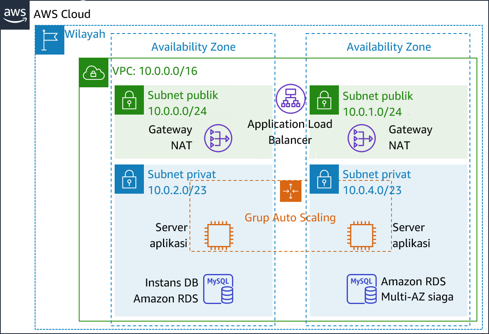
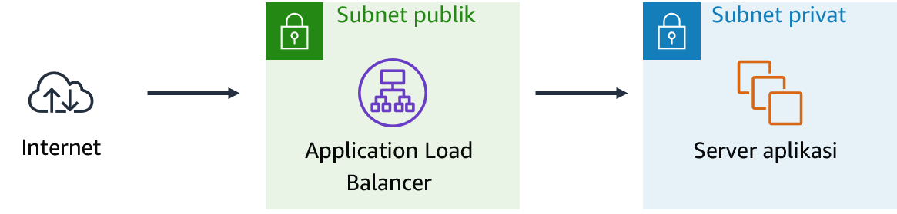
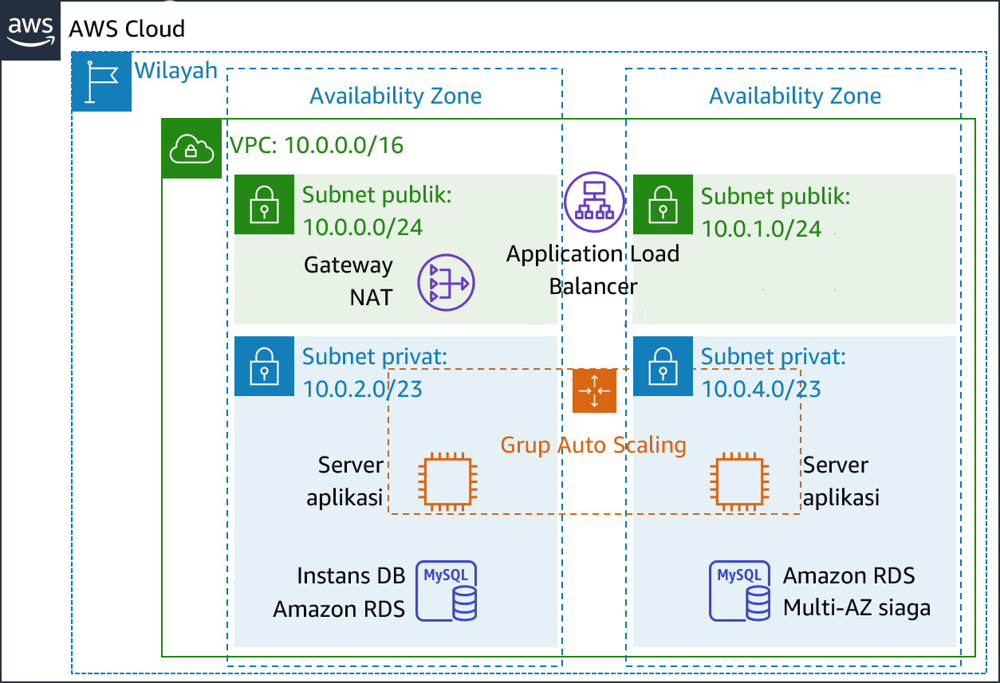

# Modul 9 – Lab Terpandu: Membuat Lingkungan dengan Ketersediaan Tinggi
[//]: # "SKU: ILT-TF-200-ACACAD-2    Source Course: ILT-TF-100-ARCHIT-6 branch dev_65"

## Gambaran umum dan tujuan lab

Sistem bisnis kritis harus di-deploy sebagai *aplikasi dengan ketersediaan tinggi*—yang berarti, aplikasi dapat tetap beroperasi walaupun beberapa komponennya gagal. Untuk mencapai ketersediaan tinggi di Amazon Web Services (AWS), kami merekomendasikan Anda *menjalankan layanan di beberapa Availability Zone*.

Banyak layanan AWS yang secara inheren memiliki ketersediaan yang tinggi, seperti penyeimbang beban. Banyak layanan AWS juga dapat dikonfigurasikan agar memiliki ketersediaan tinggi, seperti dengan men-deploy instans Amazon Elastic Compute Cloud (Amazon EC2) di beberapa Availability Zone.

Di lab ini, Anda akan mulai dengan aplikasi yang berjalan pada instans EC2 tunggal. Anda kemudian akan membuat aplikasi tersebut memiliki ketersediaan tinggi.

Setelah menyelesaikan lab ini, Anda akan mampu:

- Memeriksa virtual private cloud (VPC) yang disediakan
- Membuat Application Load Balancer
- Membuat Grup Auto Scaling
- Menguji aplikasi apakah memiliki _ketersediaan tinggi_


Pada **akhir** lab ini, arsitektur Anda akan terlihat seperti contoh berikut:



<br/>
## Durasi

Perlu sekitar **40 menit** untuk menyelesaikan lab ini.


<br/>

## Pembatasan layanan AWS

Dalam lingkungan lab ini, akses ke layanan AWS dan tindakan layanan mungkin dibatasi untuk orang-orang yang diperlukan untuk menyelesaikan instruksi lab. Anda mungkin akan mengalami error jika mencoba mengakses layanan lain atau melakukan tindakan di luar yang dijelaskan di lab ini.

<br/>

## Mengakses Konsol Manajemen AWS

1. Di bagian atas instruksi ini, pilih <span id="ssb_voc_grey">Start Lab</span> (Mulai Lab) untuk meluncurkan lab Anda.

   Panel **Start Lab** (Mulai Lab) terbuka dan menampilkan status lab.

   <i class="fas fa-info-circle"></i> **Tip**: Jika Anda memerlukan lebih banyak waktu untuk menyelesaikan lab, mulai ulang pengatur waktu untuk lingkungan dengan memilih tombol <span id="ssb_voc_grey">Start Lab</span> (Mulai Lab) lagi.

2. Tunggu hingga panel **Start Lab** (Mulai Lab) menampilkan pesan *Lab status: ready* (Status lab: siap), lalu tutup panel dengan memilih **X**.

3. Di bagian atas instruksi ini, pilih <span id="ssb_voc_grey">AWS</span>.

   Tindakan ini akan membuka Konsol Manajemen AWS di tab browser baru. Anda akan masuk ke sistem secara otomatis.

   <i class="fas fa-exclamation-triangle"></i> **Tip**: Jika tab browser baru tidak terbuka, banner atau ikon biasanya berada di bagian atas browser Anda dengan pesan bahwa browser Anda mencegah situs membuka jendela sembulan. Pilih banner atau ikon, lalu pilih **Allow pop-ups** (Izinkan sembulan).

4. Atur tab **AWS Management Console**(Konsol Manajemen AWS) agar ditampilkan bersama instruksi ini. Idealnya, Anda perlu membuka kedua tab browser secara bersamaan, sehingga Anda dapat mengikuti langkah-langkah lab dengan lebih mudah.

   <i class="fas fa-exclamation-triangle"></i> **Jangan mengubah Wilayah kecuali secara khusus diperintahkan untuk melakukannya**.

<br/>

## Tugas 1: Memeriksa VPC Anda

Lab ini dimulai dengan lingkungan yang sudah di-deploy melalui AWS CloudFormation. Termasuk di dalamnya:

- VPC
- Subnet publik dan privat di dua Availability Zone
- Gateway internet (tidak ditunjukkan) yang terkait dengan subnet publik
- Gateway Network Address Translation (NAT) di salah satu subnet publik
- Instans Amazon Relational Database Service (Amazon RDS) di salah satu subnet privat


Dalam tugas ini, Anda akan meninjau konfigurasi VPC yang telah dibuat untuk lab ini.

5. Di **AWS Management Console** (Konsol Manajemen AWS), pada menu <span id="ssb_services">Services<i class="fas fa-angle-down"></i></span> (Layanan), pilih **VPC**.

6. Di panel navigasi kiri, di bawah **Filter by VPC** (Filter menurut VPC), klik <i class="fas fa-search"></i> kotak **Select a VPC** (Pilih VPC), dan pilih **Lab VPC**.

   Pengaturan ini akan membatasi konsol untuk hanya menunjukkan sumber daya yang terkait dengan _Lab VPC_.

7. Di panel navigasi kiri, pilih **Your VPCs** (VPC Anda).

   Di sini, Anda dapat mengakses informasi tentang **Lab VPC** yang dibuat untuk Anda.

   Kolom **CIDR** tersebut memiliki nilai *10.0.0.0/16*, yang artinya VPC ini berisi semua alamat IP yang dimulai dengan *10.0.x.x*.

8. Di panel navigasi kiri, pilih **Subnets** (Subnet).

   Di sini, Anda dapat mengakses informasi tentang **Subnet** Publik 1:****

   - Kolom **VPC** menunjukkan bahwa subnet ini berada di dalam *Lab VPC*
   - Kolom **IPv4 CIDR** memiliki nilai *10.0.0.0/24*, yang berarti bahwa subnet ini mencakup 256 alamat IP antara _10.0.0.0_ dan _10.0.0.255_. Lima dari alamat ini dicadangkan dan tidak dapat digunakan.
   - Kolom **Availability Zone** mencantumkan Availability Zone tempat subnet ini berada.

9. Untuk menampakkan lebih banyak detail di bagian bawah halaman, pilih<i class="far fa-check-square"></i> **Public Subnet 1** (Subnet Publik 1).

   **Tip:** Untuk menyesuaikan ukuran panel jendela bawah, Anda dapat menarik sekatnya.

10. Pada paruh bawah halaman, pilih tab **Route Table** (Tabel Rute).

Tab ini berisi detail tentang rute subnet ini:

    - Entri pertama menentukan bahwa lalu lintas yang diperuntukkan berada di dalam jangkauan Classless Inter-Domain Routing (CIDR) untuk VPC (*10.0.0.0/16*) akan dirutekan di dalam VPC (* lokal*).
    - Entri kedua menentukan bahwa lalu lintas apa pun yang diperuntukkan bagi Internet (**0.0.0.0/0**) dirutekan ke gateway internet (*igw-*). Pengaturan ini menjadikan subnet tersebut *subnet publik*.

11. Pilih tab **Network ACL** (ACL Jaringan).

   Tab ini memiliki informasi tentang access control list jaringan (ACL jaringan) yang terkait dengan subnet tersebut. Saat ini pengaturan tersebut mengizinkan *semua lalu lintas* masuk dan keluar dari subnet, tetapi dapat lebih jauh dibatasi dengan menggunakan grup keamanan.

12. Di panel navigasi kiri, pilih **Internet Gateways** (Gateway Internet).

Perhatikan bahwa gateway internet telah dihubungkan dengan **Lab VPC**.

13. Di panel navigasi kiri, pilih **Security Groups** (Grup Keamanan).

14. Pilih <i class="far fa-check-square"></i> **Inventory DB**.

Grup keamanan ini mengontrol lalu lintas yang masuk ke basis data.

15. Pada paruh bawah halaman, pilih tab **Inbound Rules** (Aturan Masuk).

   Aturan ini mengizinkan lalu lintas masuk MySQL atau Aurora (port 3306) dari mana saja di VPC (_10.0.0.0/16_). Anda nantinya dapat memodifikasi pengaturan ini agar hanya menerima lalu lintas dari server aplikasi.

16. Pilih tab **Outbound Rules** (Aturan Keluar).

   Secara default, grup keamanan mengizinkan semua lalu lintas keluar. Namun, pengaturan ini dapat dimodifikasi sesuai kebutuhan.

<br/>
## Tugas 2: Membuat Application Load Balancer

Untuk membuat aplikasi dengan ketersediaan tinggi, praktik terbaiknya adalah meluncurkan sumber daya di *beberapa Availability Zone*. Availability Zone adalah pusat data (atau grup pusat data) yang terpisah secara fisik di Wilayah yang sama. Jika Anda menjalankan aplikasi di beberapa Availability Zone, Anda dapat menyediakan *ketersediaan* yang lebih besar jika pusat data mengalami kegagalan.

Karena aplikasi berjalan di beberapa server aplikasi, Anda akan memerlukan cara untuk mendistribusikan lalu lintas di antara server tersebut. Anda dapat mencapai tujuan ini dengan menggunakan *penyeimbang beban*. Penyeimbang beban juga melakukan pemeriksaan kesehatan pada instans dan hanya mengirimkan permintaan ke instans yang sehat.


17. Pada menu <span id="ssb_services">Services<i class="fas fa-angle-down"></i></span> (Layanan), pilih **EC2**.

18. Pada panel navigasi kiri, pilih **Load Balancers** (Penyeimbang Beban) (Anda mungkin perlu menggulir ke bawah untuk menemukannya).

19. Pilih <span id="ssb_blue">Create Load Balancer</span> (Buat Penyeimbang Beban)

Beberapa tipe penyeimbang beban akan ditampilkan. Baca deskripsi setiap tipe untuk memahami kemampuannya.

20. Di bawah **Application Load Balancer**, pilih <span id="ssb_blue">Create</span> (Buat)

21. Untuk **Name** (Nama), masukkan: `Inventory-LB`

22. Gulir ke bawah ke bagian **Availability Zones**, lalu untuk **VPC**, pilih **Lab VPC**.

   Kini Anda akan menentukan _subnet_ mana yang harus digunakan oleh penyeimbang beban. Penyeimbang beban tersebut adalah penyeimbang beban publik, jadi Anda akan memilih kedua subnet publik tersebut.

23. Pilih Availability Zone**pertama**, lalu pilih **Subnet** Publik**** yang ditampilkan.

24. Pilih Availability Zone **kedua**, lalu pilih **Subnet** Publik**** yang ditampilkan.

   Kini Anda memiliki dua subnet yang dipilih: **Subnet** Publik 1**** dan **Subnet** Publik 2****. (Jika tidak, kembali dan coba konfigurasi lagi.)

25. Pilih <span id="ssb_grey">Next: Configure Security Settings</span> (Berikutnya: Konfigurasi Pengaturan Keamanan)

   Peringatan akan muncul, yang menyarankan agar Anda menggunakan HTTP yang Aman (HTTPS) untuk meningkatkan keamanan. Ini adalah saran yang baik, tetapi tidak diperlukan untuk lab ini.

26. Pilih <span id="ssb_grey">Next: Configure Security Groups</span> (Berikutnya: Konfigurasi Grup Keamanan)

   Kini Anda akan membuat grup keamanan yang menerima semua lalu lintas _HTTP_ dan _HTTPS_ yang masuk.

27. Pilih <i class="far fa-dot-circle"></i> **Create a _new_ security group** (Buat grup keamanan baru), lalu konfigurasikan:

   - **Security group name** (Nama grup keamanan): `Inventory-LB`
   - **Description**(Deskripsi): `Enable web access to load balancer` (Mengaktifkan akses web ke penyeimbang beban)

28. Konfigurasi aturan yang ada (yang sudah ada di halaman ini) dengan:

   - **Type** (Tipe): _HTTP_
   - **Source** (Sumber): _Anywhere_ (Mana saja)

29. Pilih <span id="ssb_grey">Add Rule</span> (Tambahkan Aturan) dan konfigurasikan:

   - **Tipe:** _HTTPS_
   - **Source** (Sumber): _Anywhere_ (Mana saja)

   Pengaturan ini akan menerima semua permintaan HTTP dan HTTPS yang masuk.

30. Pilih <span id="ssb_grey">Next: Configure Routing</span> (Berikutnya: Konfigurasikan Perutean)

   _Grup target_ menentukan ke mana akan *mengirimkan* lalu lintas yang masuk ke penyeimbang beban. Application Load Balancer dapat mengirimkan lalu lintas ke beberapa grup target berdasarkan URL permintaan yang masuk. Contohnya bisa mengirim permintaan dari aplikasi seluler ke satu set server yang berbeda dari jenis permintaan lainnya. Aplikasi web Anda hanya akan menggunakan satu grup target.

31. Untuk **Name** (Nama), masukkan: `Inventory-App`

32. Perluas <i class="fas fa-caret-right"></i> **Pengaturan pemeriksaan kesehatan lanjutan**.

   Application Load Balancer secara otomatis melakukan _pemeriksaan kesehatan_ di semua instans untuk memastikan bahwa instans merespons permintaan. Pengaturan default disarankan, tetapi Anda harus membuatnya sedikit lebih cepat untuk digunakan di lab ini.

33. Konfigurasikan nilai-nilai berikut:

   - **Healthy threshold** (Ambang batas sehat): `2`
   - **Interval:** `10`

   Pengaturan ini berarti bahwa pemeriksaan kesehatan akan dilakukan setiap 10 detik. Jika instans merespons dengan tepat dua kali berturut-turut, instans tersebut akan dianggap sehat.

34. Pilih <span id="ssb_grey">Next: Register Targets</span> (Berikutnya: Daftarkan Target)

   _Target_ adalah instans individual yang merespons permintaan dari penyeimbang beban. Anda belum memiliki instans aplikasi web apa pun, jadi Anda bisa melewatkan langkah ini.

35. Pilih <span id="ssb_grey">Next: Review</span> (Berikutnya: Tinjauan)

36. Tinjau pengaturan, pilih <span id="ssb_blue">Create</span> (Buat) lalu pilih <span id="ssb_blue">Close</span> (Tutup)

   Penyeimbang beban Anda kini akan disediakan di latar belakang. Anda tidak perlu menunggu.

<br/>
## Tugas 3: Membuat grup Auto Scaling

*Amazon EC2 Auto Scaling* adalah layanan yang dirancang untuk _meluncurkan_ atau _menghentikan_ instans Amazon EC2 secara otomatis berdasarkan kebijakan yang ditentukan pengguna, jadwal, dan pemeriksaan kesehatan. Layanan ini juga *mendistribusikan instans secara otomatis ke beberapa Availability Zone* untuk membuat aplikasi memiliki *ketersediaan tinggi*.

Dalam tugas ini, Anda akan membuat grup Auto Scaling yang men-deploy instans EC2 di *subnet* privat**Anda, yang merupakan praktik keamanan terbaik untuk deployment aplikasi. Instans di subnet privat tidak dapat diakses dari internet. Sebaliknya, pengguna akan mengirimkan permintaan ke penyeimbang beban, yang akan meneruskan permintaan tersebut ke instans Amazon EC2 di subnet privat.


<br/>
### Membuat AMI untuk Auto Scaling

Anda akan membuat AMI dari _Web Server 1_ yang sudah ada. Hal ini akan menyimpan konten disk boot sehingga instans yang baru dapat diluncurkan dengan konten yang identik.

37. Dalam **AWS Management Console**, di menu <span id="ssb_services">Services <i class="fas fa-angle-down"></i></span> (Layanan), klik **EC2**.

38. Di panel navigasi kiri, klik **Instances** (Instans).

   Pertama-tama, Anda akan memastikan bahwa instans sedang berjalan.

39. Tunggu hingga **Status Check** (Pemeriksaan Status) untuk **Web Server 1** (Server Web 1) menampilkan *2/2 checks passed* (2/2 pemeriksaan lulus). Klik refresh (segarkan) <i class="fas fa-sync"></i> untuk memperbarui.

   Sekarang Anda akan membuat AMI berdasarkan instans ini.

40. Pilih <i class="far fa-check-square"></i> **Web Server 1** (Server Web 1).

41. Di menu <span id="ssb_grey">Actions <i class="fas fa-angle-down"></i></span>(Tindakan), klik **Image** (Gambar) &gt; **Create Image** (Buat Gambar), lalu konfigurasikan:

   - **Image name:**(Nama gambar:) `Web Server AMI` (Server Web AMI)
   - **Deskripsi gambar:** `Lab AMI untuk Server Web`

42. Klik <span id="ssb_orange">Create image</span> (Buat gambar).

   Layar konfirmasi menampilkan **AMI ID** (ID AMI) untuk AMI baru Anda.

43. Klik <span id="ssb_blue">Close</span> (Tutup)

   Anda akan menggunakan AMI ini saat meluncurkan grup Auto Scaling nantinya di lab.

<br/>

### Membuat Konfigurasi Peluncuran dan grup Auto Scaling.

Anda terlebih dahulu akan membuat *konfigurasi peluncuran*, yang menentukan tipe instans yang harus diluncurkan oleh Amazon EC2 Auto Scaling. Antarmukanya akan terlihat mirip dengan ketika Anda meluncurkan instans EC2. Namun, alih-alih meluncurkan sebuah instans, antarmuka ini _menyimpan_ konfigurasi tersebut untuk digunakan nanti.

44. Di panel navigasi kiri, pilih **Launch Configuration** (Konfigurasi Peluncuran).

45. Pilih <span id="ssb_orange">Create launch configuration</span> (Buat konfigurasi peluncuran)

46. Konfigurasikan pengaturan berikut:

   - **Launch configuration name** (Nama konfigurasi peluncuran): `Inventory-LC`

   - **Amazon machine image (AMI)** Pilih *Web Server AMI*

   - **Instance type** (Tipe instans):

      - Pilih <span id="ssb_white">Choose instance type</span> (Pilih tipe instans)
      - Pilih *t3.micro*
      - Pilih <span id="ssb_orange">Choose</span> (Pilih)

      **Catatan:** Jika Anda telah meluncurkan lab di Region (Wilayah) us-east-1, pilih tipe instans **t2.micro**. Untuk menemukan Region (Wilayah), lihat di sudut kanan atas konsol Amazon EC2.

      **Catatan:** Jika Anda menerima pesan kesalahan "Something went wrong. Please refresh and coba lagi." (Terjadi kesalahan. Refresh dan coba lagi), Anda dapat mengabaikannya dan melanjutkan latihan.

   - **Konfigurasi tambahan**

      - **IAM instance profile** (Profil instans IAM): Pilih _Inventory-App-Role_
   - **Monitoring**(Pemantauan): </i> Pilih <i class="far fa-check-square"></i> *Aktifkan pemantauan detail EC2 instance dalam CloudWatch*

      Fitur ini memungkinkan Auto Scaling bereaksi cepat terhadap perubahan penggunaan.

47. Perluas <i class="fas fa-caret-right"></i> **Advanced Details** (Detail Lanjutan). Di bawah **User data** (Data pengguna), salin dan tempel skrip ini:

```bash
#!/bin/bash
# Install Apache Web Server and PHP
yum install -y httpd mysql
amazon-linux-extras install -y php7.2
# Download Lab files
wget https://aws-tc-largeobjects.s3-us-west-2.amazonaws.com/ILT-TF-200-ACACAD-20-EN/mod9-guided/scripts/inventory-app.zip
unzip inventory-app.zip -d /var/www/html/
# Download and install the AWS SDK for PHP
wget https://github.com/aws/aws-sdk-php/releases/download/3.62.3/aws.zip
unzip aws -d /var/www/html
# Turn on web server
chkconfig httpd on
service httpd start
```

48. Di bawah **Security groups** (Grup keamanan)

- **Select an existing security group** (Pilih grup keamanan yang ada): _Inventory-App_

<i class="fas fa-comment"></i>Anda akan menerima peringatan bahwa _You will not able to connect to the instance_ (Anda tidak akan dapat terhubung ke instans). Anda dapat mengabaikan peringatan ini karena Anda tidak akan terhubung ke instans. Semua konfigurasi dilakukan melalui skrip data pengguna.

49. Di bawah **pasangan kunci (login)**:

* Pilih **Proceed without a key pair** (Lanjutkan tanpa pasangan kunci)
* Pilih <i class="far fa-check-square"></i> *I acknowledge that...* (Saya menyatakan bahwa...)

50. Pilih <span id="ssb_orange">Create launch configuration</span> (Buat konfigurasi peluncuran)

_Launch configuration_ (Konfigurasi peluncuran) menentukan *apa yang akan diluncurkan*, tetapi _Auto Scaling group_ (grup Auto Scaling) menentukan *di mana akan meluncurkan* sumber daya.


51. Di tabel **Launch configurations** (Konfigurasi peluncuran), pilih <i class="far fa-check-square"></i> *Inventory-LC*.

52. Dari tombol <span id="ssb_white">Actions<i class="fas fa-caret-down"></i></span> (Tindakan), pilih *Create Auto Scaling group* (Buat grup Auto Scaling)

53. Masukkan nama grup Auto Scaling:

   - **Name** (Nama): `Inventory-ASG` (*ASG* singkatan dari _Auto Scaling group_)

54. Pilih <span id="ssb_orange">Next</span> (Berikutnya)

55. Di halaman **Network** (Jaringan), konfigurasikan

   - **VPC:** _Lab VPC_

   - **Subnet:** Pilih _Private Subnet 1_ (Subnet Privat 1) **dan** _Private Subnet 2_ (Subnet Privat 2)

   <i class="fas fa-comment"></i> Anda dapat mengabaikan peringatan yang menyebutkan _No public IP addresses will be assigned_ (Tidak ada alamat IP publik yang akan ditugaskan). Instans Amazon EC2 akan diluncurkan pada _subnet_ privat__, jadi instans tersebut tidak memerlukan alamat IP publik.

   Hal ini akan meluncurkan instans EC2 di subnet privat di kedua Availability Zone tersebut.

56. Pilih <span id="ssb_orange">Next</span> (Berikutnya)

57. Di bawah **Load balancing** (Penyeimbangan beban):

   - Pilih <i class="far fa-check-square"></i> **Enable load balancing**
   - Pilih **Application Load Balancer or Network Load Balancer** (Application Load Balancer atau Network Load Balancer)
   - **Choose a target group for your load balancer:** (Pilih grup target untuk penyeimbang beban Anda:) *Inventory-App*

   Pengaturan ini memerintahkan grup Auto Scaling untuk mendaftarkan instans EC2 baru sebagai bagian dari grup target _Inventory-App_ yang telah Anda buat sebelumnya. Penyeimbang beban akan mengirimkan lalu lintas ke instans yang berada di grup target ini.

58. Di bawah **Pemeriksaan kesehatan**:

- Pilih <i class="far fa-check-square"></i> **ELB**
- **Health check grace period:** (Masa tenggang pemeriksaan kesehatan:) 90

59. Di bawah **Additional settings** (Pengaturan tambahan):

- pilih <i class="far fa-check-square"></i> **Enable group metrics collection within CloudWatch** (Aktifkan pengumpulan metrik grup di dalam CloudWatch)

60. Pilih <span id="ssb_orange">Next</span> (Berikutnya)

61. Di **Group size** (Ukuran grup), konfigurasikan:

   - **Desired capacity:** 2 (Kapasitas yang dikehendaki: 2)
   - **Minimum capacity** (Kapasitas minimum): 2
   - **Maximum capacity:** (Kapasitas maksimum): 2

62. Di bawah **Scaling policies** (Kebijakan penskalaan), pilih *None* (Tidak ada).

   Untuk lab ini, Anda akan *terus mempertahankan dua instans* untuk memastikan adanya _ketersediaan tinggi_. Jika aplikasi tersebut diharapkan akan menerima berbagai muatan lalu lintas, Anda juga dapat membuat _kebijakan penskalaan_ yang menentukan kapan meluncurkan atau menghentikan instans. Namun, Anda tidak perlu membuat kebijakan penskalaan untuk aplikasi Inventory di lab ini.

63. Pilih <span id="ssb_orange">Next</span> (Berikutnya)

64. Pada halaman **Add notifications** (Tambahkan notifikasi), pilih <span id="ssb_orange">Next</span> (Berikutnya). Anda tidak perlu mengonfigurasi salah satu pengaturan ini.

65. Pada halaman **Add tags** (Tambahkan tanda), pilih <span id="ssb_white">Add tag</span> (Tambahkan tanda)
   - **Key** (Kunci): `Name` (Nama)
   - **Value** (Nilai): `Inventory-App`
   - Pilih <i class="far fa-check-square"></i> <span id="ssb_orange">Berikutnya</span>

   Pengaturan ini akan memberi _tanda_ grup Auto Scaling dengan sebuah *Name* (Nama), yang juga akan muncul di instans EC2 yang diluncurkan oleh grup Auto Scaling. Anda akan menggunakan tanda untuk mengidentifikasi instans Amazon EC2 mana yang terkait dengan aplikasi tertentu. Anda juga dapat menambahkan tanda seperti *Cost Center* (Pusat Biaya) untuk mempermudah menetapkan biaya aplikasi pada file penagihan.

66. Pada **Review page** (Halaman tinjauan):

   - Pilih <span id="ssb_orange">Create Auto Scaling group</span> (Buat grup Auto Scaling)

   _Inventory-ASG_ akan muncul di konsol:

    (Konsol grup Auto Scaling)

   Tinjauan tersebut menunjukkan bahwa:

   - Grup saat ini *tidak memiliki instans*, tetapi ikon informasinya<i class="fas fa-info-circle"></i> mengindikasikan bahwa instans sedang diluncurkan. (Arahkan kursor ke atas ikon untuk lebih jelasnya.)
   - Kuantitas **yang diinginkan** adalah *2 instans*. Amazon EC2 Auto Scaling akan mencoba meluncurkan dua instans untuk mencapai kuantitas yang diinginkan
   - **Min** dan **Max** juga diatur ke *2 instans*. Amazon EC2 Auto Scaling akan mencoba untuk selalu menyediakan dua instans, sekalipun terjadi kegagalan.

   Aplikasi Anda akan segera berjalan di dua Availability Zone. Amazon EC2 Auto Scaling akan mempertahankan konfigurasi itu meskipun instans atau Availability Zone gagal.

   Setelah satu menit, pilih <i class="fas fa-sync"></i> **Refresh** (segarkan) untuk memperbarui tampilan. Hal ini akan menunjukkan bahwa *2 instans* sedang berjalan.

<br/>
## Tugas 4: Memperbarui grup keamanan

Aplikasi yang telah Anda deploy memiliki *arsitektur tiga tingkat*. Sekarang Anda akan mengonfigurasi Grup Keamanan untuk memberlakukan tingkat ini:


<br/>
### Grup keamanan penyeimbang beban

Anda telah mengonfigurasi _grup keamanan penyeimbang beban_ saat Anda membuat penyeimbang beban. Penyeimbang beban menerima semua lalu lintas_HTTP_ dan _HTTPS_

Penyeimbang beban telah dikonfigurasi untuk meneruskan permintaan yang masuk ke _Grup Target_. Saat Auto Scaling meluncurkan instans baru, penyeimbang beban akan menambahkan instans tersebut secara otomatis ke Grup Target.

<br/>
### Grup keamanan aplikasi

_Grup keamanan aplikasi_ disediakan sebagai bagian dari pengaturan lab. Anda sekarang akan mengonfigurasinya menjadi hanya menerima lalu lintas masuk dari penyeimbang beban.

67. Di panel navigasi kiri, pilih **Security Groups** (Grup Keamanan).
68. Pilih <i class="far fa-check-square"></i> **Inventory-App**.

69. Pada paruh bawah halaman, pilih tab **Inbound rules** (Aturan masuk).

Grup keamanan saat ini kosong. Sekarang Anda akan menambahkan aturan untuk menerima lalu lintas _HTTP_ yang masuk dari penyeimbang beban. Anda tidak perlu mengonfigurasi lalu lintas _HTTPS_ karena penyeimbang beban telah dikonfigurasi untuk meneruskan permintaan HTTPS melalui HTTP. Praktik ini memindahkan keamanan ke penyeimbang beban, sehingga mengurangi jumlah kerja yang diperlukan oleh server aplikasi individual.

70. Pilih <span id="ssb_grey">Edit inbound rules</span> (Edit aturan masuk).

71. Pada halaman **Edit inbound rules** (Edit aturan masuk), pilih <span id="ssb_grey">Add rule</span> (Tambahkan aturan) dan konfigurasikan pengaturan ini.

- **Type** (Tipe): _HTTP_
- **Source** (Sumber):
   - Klik di kotak pencarian di sebelah **Custom** (Kustom)
   - Hapus konten saat ini
   - Masukkan `sg`
   - Dari daftar yang muncul, pilih **Inventory-LB**
- **Description** (Deskripsi): `Traffic from load balancer` (Lalu lintas dari penyeimbang beban)
- Pilih <span id="ssb_orange">Save rules</span> (Simpan aturan)

Server aplikasi sekarang dapat menerima lalu lintas dari penyeimbang beban. Termasuk di antaranya _pemeriksaan kesehatan_ yang dilakukan secara otomatis oleh penyeimbang beban.

<br/>
### Grup keamanan basis data

Sekarang Anda akan mengonfigurasi _Grup keamanan basis data_ menjadi hanya menerima lalu lintas yang masuk dari server aplikasi.

72. Pilih <i class="far fa-check-square"></i> **Inventory-DB** (dan pastikan tidak ada grup keamanan lain yang dipilih).

Aturan yang ada mengizinkan lalu lintas pada port 3306 (yang digunakan oleh MySQL) dari alamat IP mana pun di dalam VPC. Ini adalah aturan yang bagus, tetapi keamanan dapat dibatasi lebih lanjut.

73. Di tab **Inbound rules** (Aturan masuk), pilih <span id="ssb_grey">Edit Inbound rules</span> (Edit aturan masuk) dan konfigurasikan pengaturan berikut:

- Klik di kotak pencarian di sebelah **Custom** (Kustom)
- Hapus konten saat ini
- Tipe `sg`
- Pilih **Inventory-App** dari daftar yang muncul
- **Deskripsi:** `Lalu lintas dari server aplikasi`
- Pilih <span id="ssb_orange">Save rules</span> (Simpan aturan)

Anda sekarang telah mengonfigurasi _keamanan tiga tingkat_. Setiap elemen di tingkat tersebut hanya menerima lalu lintas dari tingkat di atasnya.

Selain itu, penggunaan subnet privat berarti bahwa Anda memiliki dua pembatas keamanan antara internet dan sumber daya aplikasi Anda. Arsitektur ini sesuai dengan praktik terbaik dalam menerapkan beberapa lapisan keamanan.

<br/>
## Tugas 5: Menguji aplikasi

Aplikasi Anda sekarang siap diuji.

Dalam tugas ini, Anda akan mengonfirmasi bahwa aplikasi web Anda berjalan. Anda juga akan menguji bahwa aplikasi tersebut memiliki ketersediaan tinggi.

74. Di panel navigasi kiri, klik **Target Groups** (Grup Target).

Grup instans *Inventory-App* akan ditampilkan.

75. Pada paruh bawah halaman, pilih tab **Targets** (Target).

Tab ini akan menunjukkan dua *target terdaftar*. Kolom **Status** (Status) menunjukkan hasil pemeriksaan kesehatan penyeimbang beban yang dilakukan terhadap instans.

76. Di area kanan atas, sesekali pilih <i class="fas fa-sync"></i> **Refresh** (Segarkan) sampai **Status** untuk kedua instans muncul menjadi *healthy* (sehat).

Jika statusnya tidak berubah menjadi *healthy* (sehat), mintalah panduan kepada instruktur untuk mendiagnosis konfigurasi tersebut. Arahkan kursor ke <i class="fas fa-info-circle"></i> ikon di kolom **Status** untuk mengakses informasi lebih lanjut tentang status.

Anda akan menguji aplikasi tersebut dengan menghubungkan ke penyeimbang beban, yang kemudian akan mengirimkan permintaan Anda ke salah satu instans Amazon EC2. Pertama-tama Anda harus mengambil nama Domain Name System (DNS) dari penyeimbang beban.

77. Di panel navigasi kiri, pilih **Load Balancers** (Penyeimbang Beban).

78. Pada tab **Description** (Deskripsi) di paruh bawah jendela, salin **DNS Name** (Nama DNS) ke clipboard Anda.

Seharusnya akan terlihat seperti ini: *inventory-LB-xxxx.elb.amazonaws.com*

79. Buka tab browser web baru, tempelkan nama DNS dari clipboard Anda, dan tekan ENTER.

Penyeimbang beban meneruskan permintaan Anda ke salah satu instans Amazon EC2. ID instans dan Availability Zone ditampilkan pada bagian bawah halaman web.

80. Muat ulang <i class="fas fa-sync"></i> halaman di browser web Anda. Anda akan melihat bahwa ID instans dan Availability Zone terkadang berubah antara kedua instans tersebut.

Ketika aplikasi web ini muncul, arus informasinya adalah:



    - Anda mengirimkan permintaan ke *penyeimbang beban*, yang berada di *subnet publik* yang terhubung ke internet.
    
    - Penyeimbang beban memilih salah satu *instans Amazon EC2* yang berada di *subnet privat* dan meneruskan permintaan tersebut ke sana.
    
    - Instans Amazon EC2 kemudian mengembalikan halaman web tersebut ke penyeimbang beban, yang mengembalikannya ke browser web Anda.

<br/>
## Tugas 6: Menguji ketersediaan tinggi

Aplikasi Anda sekarang telah dikonfigurasi agar memiliki ketersediaan tinggi. Anda dapat membuktikan ketersediaan tinggi pada aplikasi tersebut dengan mengakhiri salah satu instans EC2.

81. Kembali ke tab **Amazon EC2 console** (Konsol Amazon EC2) di browser web Anda (tetapi jangan tutup tab aplikasi web—Anda akan segera kembali ke sana).

82. Di panel navigasi kiri, pilih **Instances** (Instans).

Sekarang Anda akan menghentikan salah satu instans aplikasi web untuk melakukan simulasi kegagalan.

83. Pilih <i class="far fa-check-square"></i> salah satu instans **Inventory-App** (tidak masalah mana yang Anda pilih).

84. Pilih <span id="ssb_grey">Actions<i class="fas fa-angle-down"></i></span> (Tindakan) lalu **Instance State > Terminate** (Status Instans > Hentikan).

85. Pilih **Yes, Terminate** (Ya, Hentikan)

Dalam waktu singkat, pemeriksaan kesehatan penyeimbang beban akan mengetahui bahwa instans tersebut tidak merespons. Penyeimbang beban akan secara otomatis mengarahkan semua permintaan ke instans yang tersisa.

86. Kembali ke tab aplikasi web di browser web Anda dan muat ulang <i class="fas fa-sync"></i>halaman beberapa kali.

Anda akan mendapati bahwa *Availability Zone* yang ditampilkan pada bagian bawah halaman tetap sama. Walaupun sebuah instans telah gagal, aplikasi Anda tetap tersedia.

Setelah beberapa menit, Amazon EC2 Auto Scaling juga akan mengetahui kegagalan instans ini. Karena telah dikonfigurasi untuk menjaga dua instans tetap berjalan, jadi Amazon EC2 Auto Scaling akan *meluncurkan instans pengganti secara otomatis*.

87. Kembali ke tab **Amazon EC2 Auto Scaling** (konsol Amazon EC2) di browser web Anda. Di area kanan atas, pilih refresh (segarkan) <i class="fas fa-sync"></i> setiap 30 detik hingga instans EC2 baru muncul.

Setelah beberapa menit, pemeriksaan kesehatan untuk instans baru seharusnya menunjukkan sehat. Penyeimbang beban akan terus mengirim lalu lintas di antara dua Availability Zone. Anda dapat memuat ulang tab aplikasi web untuk melihat terjadinya hal ini.

Hal ini menunjukkan bahwa aplikasi Anda sekarang memiliki _ketersediaan tinggi_.

<br/>
## Tugas opsional 1: Membuat basis data dengan ketersediaan tinggi.

<i class="fas fa-comment"></i> _Tugas ini bersifat **opsional**. Anda dapat mengerjakan tugas ini jika Anda memiliki waktu lab yang tersisa._

Arsitektur aplikasi tersebut sekarang memiliki ketersediaan tinggi. Namun, basis data Amazon RDS masih beroperasi dari hanya satu instans basis data.

Pada tugas opsional ini, Anda akan membuat basis data tersebut memiliki ketersediaan tinggi dengan mengonfigurasikannya untuk beroperasi di beberapa Availability Zone (yakni, pada *deployment Multi-AZ*).



88. Pada menu <span id="ssb_services">Services<i class="fas fa-angle-down"></i></span> (Layanan), pilih **RDS**.

89. Di panel navigasi kiri, pilih **Databases** (Basis Data).

90. Pilih <span style="color:blue;">inventory-db</span>

Jangan ragu untuk mengeksplorasi informasi tentang basis data.

91. Pilih <span id="ssb_rds_white">Modify</span> (Ubah)

92. Untuk **Multi-AZ deployment** (deployment Multi-AZ), pilih <i class="far fa-dot-circle"></i> **Yes** (Ya).

Anda hanya perlu melakukan satu langkah ini untuk mengubah basis data agar beroperasi di beberapa pusat data (Availability Zone).

Opsi ini bukan berarti bahwa basis data tersebut _didistribusikan_ di beberapa instans. Sebaliknya, satu instans adalah instans _primer_, yang menangani semua permintaan. Instans lainnya akan diluncurkan sebagai instans _standby_, yang akan mengambil alih jika instans primer gagal. Aplikasi Anda terus menggunakan nama DNS yang sama untuk basis data tersebut. Namun, koneksi akan secara otomatis mengarahkan ke server basis data yang aktif saat ini.

Anda dapat menskalakan instans EC2 dengan mengubah atribut, dan Anda juga dapat menskalakan basis data RDS dengan cara ini. Sekarang Anda akan menaikkan skala basis data.

93. Untuk **DB instance class** (kelas instans DB), pilih **db.t3.small**.

Tindakan ini menggandakan ukuran instans.

94. Untuk **Allocated storage** (Penyimpanan teralokasi), masukkan: `10`

Tindakan ini akan menggandakan jumlah ruang yang dialokasikan untuk basis data.

Jangan ragu untuk mengeksplorasi opsi lainnya di halaman tersebut, tetapi jangan mengubah nilai apa pun.

95. Di bagian bawah halaman, pilih <span id="ssb_orange">Continue</span> (Lanjutkan)

Performa basis data akan terkena dampak dari perubahan ini. Oleh karena itu, perubahan dapat dijadwalkan pada saat jendela pemeliharaan yang ditentukan, atau dapat dijalankan segera.

96. Di bawah **Scheduling of Modifications** (Jadwal Modifikasi), pilih <i class="far fa-dot-circle"></i> **Apply immediately** (Terapkan segera).

97. Pilih <span id="ssb_orange">Modify DB instance</span> (Modifikasi instans DB)

Basis data memasuki status _memodifikasi_ selagi perubahan diterapkan. Anda tidak perlu menunggu hingga selesai.

<br/>
## Tugas opsional 2: Mengonfigurasi gateway NAT dengan ketersediaan tinggi

<i class="fas fa-comment"></i> _Tugas ini bersifat **opsional**. Anda dapat mengerjakan tugas ini jika Anda memiliki waktu lab yang tersisa._

Server aplikasi berjalan di subnet privat. Jika server tersebut harus mengakses internet (misalnya, untuk mengunduh data), permintaan harus diarahkan melalui _gateway _Network Address Translation (NAT)__. (Gateway NAT harus terletak di subnet publik).

Arsitektur saat ini hanya memiliki satu gateway NAT di _Subnet_ Publik 1__. Oleh karena itu, jika Availability Zone 1 gagal, server aplikasi tidak akan dapat berkomunikasi dengan internet.

Pada tugas opsional ini, Anda akan membuat gateway NAT memiliki ketersediaan tinggi dengan meluncurkan gateway NAT lain di Availability Zone lainnya. Arsitektur yang dihasilkan akan memiliki ketersediaan tinggi:


98. Pada menu<span id="ssb_services">Services<i class="fas fa-angle-down"></i></span> (Layanan), pilih**VPC**.

99. Di panel navigasi kiri, pilih **NAT Gateways** (Gateway NAT).

Gateway NAT yang ada akan ditampilkan. Sekarang Anda akan membuat gateway NAT untuk Availability Zone lainnya.

100. Pilih <span id="ssb_orange">Create NAT gateway</span> (Buat gateway NAT), lalu konfigurasikan pengaturan berikut:

- **Subnet:** *PublicSubnet2* (Pilih opsi ini dari daftar)

   Detail <i class="fas fa-comment"></i>*subnet* ada di awal instruksi ini. Pilih **Details** (Detail), dan di sebelah kanan **AWS**, pilih **Show** (Tampilkan). Catat nama **PublicSubnet2** dan **NATGateway1**.

- Pilih <span id="ssb_grey">Allocate Elastic IP</span> (Alokasikan IP Elastis)
- Pilih <span id="ssb_orange">Create NAT gateway</span> (Buat gateway NAT)
- Pilih <span id="ssb_blue">Edit route tables</span> (Edit tabel rute)

    Anda sekarang akan membuat tabel rute baru untuk _Privat Subnet 2_. Tabel rute ini akan mengarahkan lalu lintas ke gateway NAT yang baru.

101. Pilih <span id="ssb_blue">Create route table</span> (Buat tabel rute) dan konfigurasikan pengaturan berikut:

- **Name tag** (Tanda nama): `Private Route Table 2` (Tabel Rute Privat 2)
- **VPC:** _Lab VPC_
- Pilih <span id="ssb_blue">Create</span> (Buat), kemudian pilih <span id="ssb_blue">Close</span> (Tutup)

102. Pilih <i class="far fa-check-square"></i> **Private Route Tabel 2** (Tabel Rute Privat 2), dan konfirmasi bahwa rute itu adalah satu-satunya rute tabel yang dipilih.

103. Pilih tab **Routes** (Rute).

    Saat ini, satu rute mengarahkan semua lalu lintas _locally_.
    
    Sekarang Anda akan menambahkan rute untuk mengirimkan lalu lintas yang terikat dengan internet melalui gateway NAT yang baru.

104. Pilih <span id="ssb_grey">Edit routes </span> (Edit rute) lalu konfigurasikan pengaturan ini:

- Pilih <span id="ssb_grey">Add route</span>(Tambah rute)
- **Destination** (Tujuan): `0.0.0.0/0`
* **Target:** Pilih _NAT Gateway_ (Gateway NAT), lalu pilih entri _nat-_ yang *bukan merupakan * entri untuk _NATGateway1_ (yang berada di bawah tombol **Details** (Detail) di atas instruksi ini)
- Pilih <span id="ssb_blue">Save routes</span> (Simpan rute), lalu pilih <span id="ssb_blue">Close</span> (Tutup)

    <i class="fas fa-comment"></i> Gateway NAT yang tercantum di bawah tombol **Details** (yang ada di atas instruksi ini) adalah untuk _Public Subnet 1_. Anda mengonfigurasikan tabel rute untuk menggunakan gateway NAT _other_.

105. Pilih tab **Subnet Associations** (Kaitan Subnet).

106. Pilih <span id="ssb_grey">Edit subnet associations</span> (Edit kaitan subnet)

107. Pilih <i class="far fa-check-square"></i> **Private Subnet 2** (Subnet Privat 2).

108. Pilih <span id="ssb_blue">Save</span> (Simpan)

   Tindakan ini kini akan mengirimkan lalu lintas terikat internet dari Subnet Privat 2 ke gateway NAT yang berada di Availability Zone yang sama.

   Gateway NAT Anda sekarang memiliki ketersediaan tinggi. Kegagalan pada satu Availability Zone tidak akan berdampak pada lalu lintas di Availability Zone lainnya.

<br/>
## Mengirimkan pekerjaan Anda

109. Di bagian atas instruksi ini, pilih <span id="ssb_blue">Submit</span> (Kirim) untuk merekam kemajuan Anda dan saat diminta, pilih **Yes** (Ya).

110. Jika hasilnya tidak muncul setelah beberapa menit, kembali ke bagian atas instruksi ini dan pilih <span id="ssb_voc_grey">Grades</span> (Nilai)

    **Tip**: Anda dapat mengirimkan pekerjaan Anda beberapa kali. Setelah Anda mengubah pekerjaan Anda, pilih **Submit** (Kirim) lagi. Apa yang akan direkam untuk lab ini adalah pengiriman terakhir Anda.

111. Untuk menemukan detail umpan balik tentang pekerjaan Anda, pilih <span id="ssb_voc_grey">Details</span> (Detail) diikuti oleh <i class="fas fa-caret-right"></i> **View Submission Report** (Lihat Laporan Pengiriman).

<br/>

## Lab selesai <i class="fas fa-graduation-cap"></i>

<i class="fas fa-flag-checkered"></i> Selamat! Anda telah menyelesaikan lab.

112. Pilih <span id="ssb_voc_grey">End Lab</span> (Akhiri Lab) di bagian atas halaman ini, lalu pilih <span id="ssb_blue">Yes</span> (Ya) untuk mengonfirmasi bahwa Anda ingin mengakhiri lab.

    Sebuah panel menunjukan bahwa *DELETE has been initiated... (*PENGHAPUSAN telah dimulai...) You may close this message box now.* (Anda dapat menutup kotak pesan ini sekarang.*)

113. Pilih **X** di sudut kanan atas untuk menutup panel.


*©2020 Amazon Web Services, Inc. dan afiliasinya. Hak cipta dilindungi undang-undang. Karya ini tidak boleh direproduksi atau didistribusikan ulang, seluruhnya atau sebagian, tanpa izin tertulis sebelumnya dari Amazon Web Services, Inc. Dilarang menyalin, meminjamkan, atau menjual secara komersial.*
