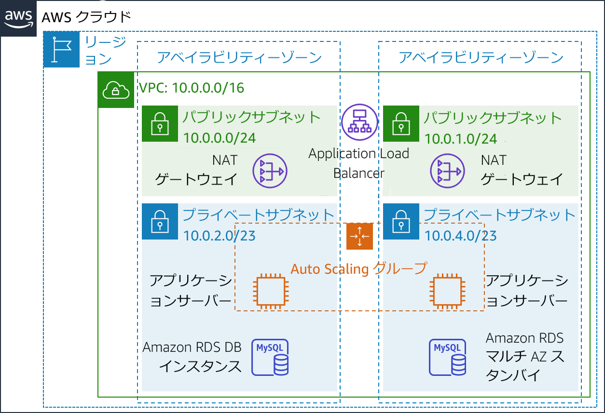
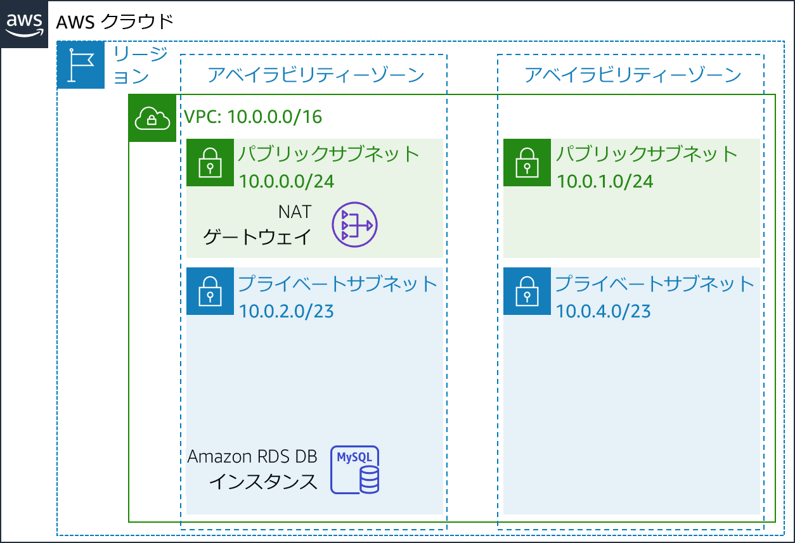
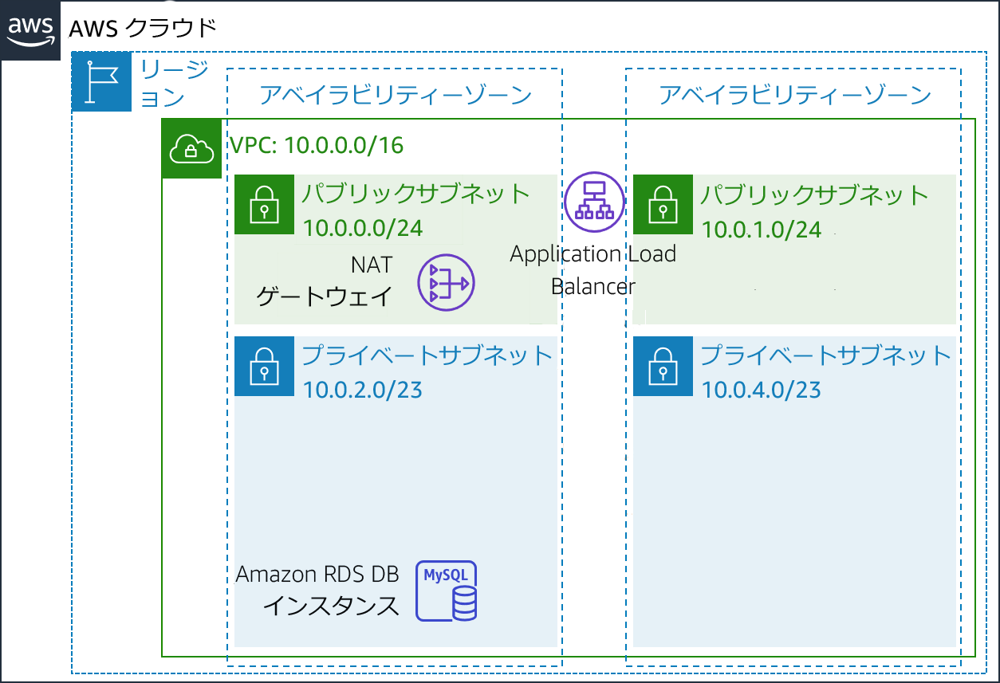
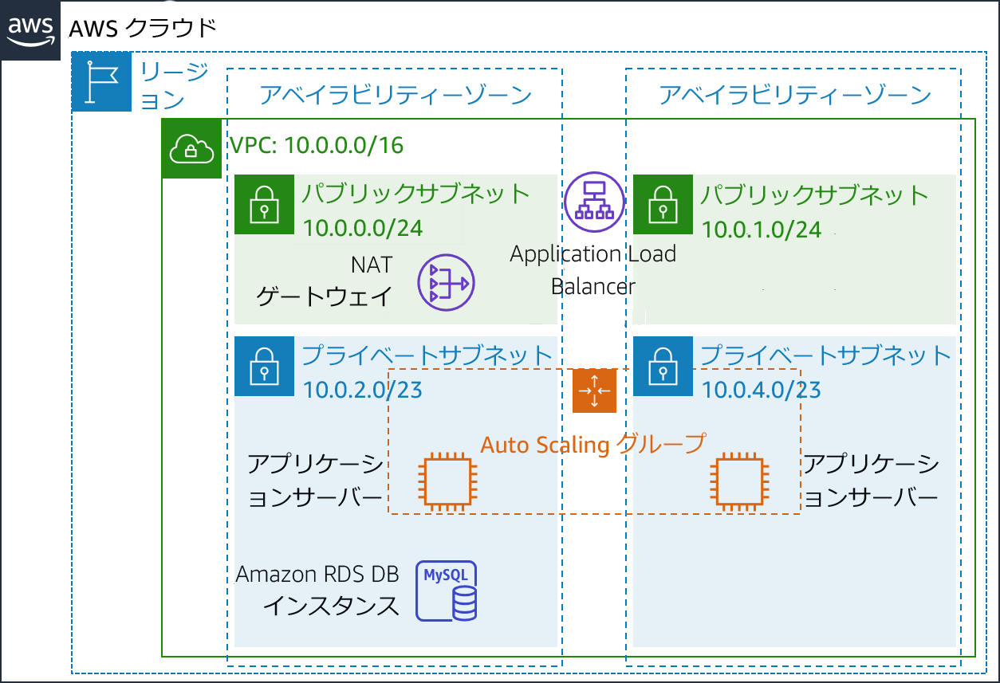
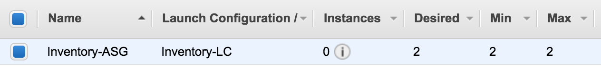
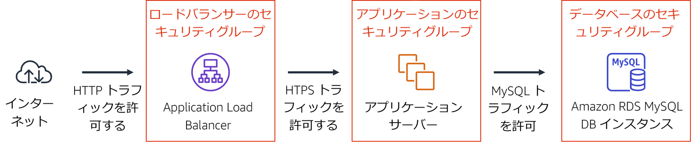
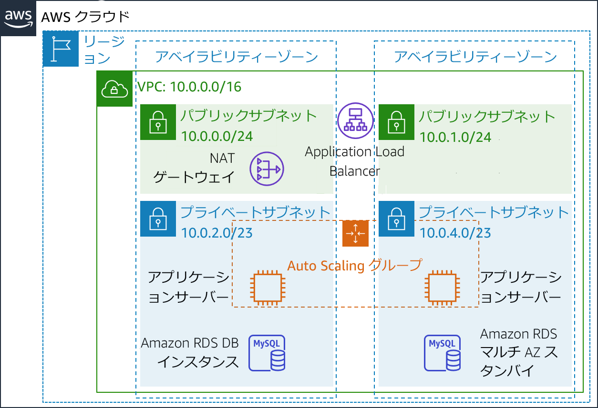

# モジュール 9 - ガイド付きラボ: 可用性の高い環境の作成
[//]: # "SKU: ILT-TF-200-ACACAD-2    Source Course: ILT-TF-100-ARCHIT-6 branch dev_65"

## ラボの概要と目標

ビジネスの基幹システムは**可用性の高いアプリケーション**としてデプロイするのが理想的です。つまり、一部のコンポーネントに障害が発生しても、アプリケーションの稼働を維持できる環境です。アマゾン ウェブ サービス（AWS）で高い可用性を実現するには、**複数のアベイラビリティーゾーンにまたがってサービスを実行する**ことをお勧めします。

AWS の多くのサービスは、ロードバランサーのように初めから高可用性を有しています。また、Amazon Elastic Compute Cloud (Amazon EC2) インスタンスを複数のアベイラビリティゾーンにデプロイするなど、構成によって高い可用性を持たせることも可能です。

このラボでは、まず単一の Amazon EC2 インスタンスで実行されるアプリケーションから始めて、その可用性を高めていきます。

このラボを完了すると、次のことができるようになります。

- 提示された Virtual Private Cloud (VPC) を調査する
- Application Load Balancer を作成する
- Auto Scaling グループを作成する
- アプリケーションの高可用性をテストする


ラボの**終了時**のアーキテクチャは次の例のようになります。



<br/>

## 所要時間

このラボの所要時間は約 **40 分**です。


<br/>

## AWS サービスの制限事項

このラボ環境では、AWS のサービスとサービスアクションへのアクセスが、ラボの手順を完了するために必要なものに制限されています。他のサービスへのアクセスや、このラボで説明されているサービス以外のアクションを実行しようとすると、エラーが発生することがあります。

<br/>

## AWS マネジメントコンソールにアクセスする

1. この手順の上部にある <span id="ssb_voc_grey">Start Lab</span> をクリックし、ラボを起動します。

   [**Start Lab**] パネルが開き、ラボのステータスが表示されます。

   <i class="fas fa-info-circle"></i> **ヒント**: ラボの完了までにさらに時間が必要な場合は、<span id="ssb_voc_grey">Start Lab</span> ボタンをもう一度選択して、この環境のタイマーを再開します。

2. \[**Start Lab**] パネルに **Lab status: ready** というメッセージが表示されたら [**X**] をクリックしてパネルを閉じます。

3. この手順の上部にある <span id="ssb_voc_grey">AWS</span> をクリックします。

   このアクションにより、新しいブラウザタブで AWS マネジメントコンソールが開き、ユーザーは自動的にログインします。

   <i class="fas fa-exclamation-triangle"></i> **ヒント**: 新しいブラウザタブが開かない場合、通常、ブラウザによってサイトのポップアップウィンドウの表示がブロックされたというメッセージが表示されたバナーまたはアイコンがブラウザの上部に表示されます。バナーまたはアイコンを選択して [**ポップアップを許可**] を選択してください。

4. **AWS マネジメントコンソール**タブがこの手順と並べて表示されるようにします。両方のブラウザタブを同時に開いておくと、ラボのステップを実行しやすくなります。

   <i class="fas fa-exclamation-triangle"></i> **特に指示がない限り、リージョンを変更しないでください**。

<br/>

## タスク 1: VPC を確認する

このラボでは、AWS CloudFormation 経由で既にデプロイされた環境を最初に取り上げます。この環境には、以下が含まれています。

- VPC
- 2 つのアベイラビリティーゾーンにパブリックサブネットとプライベートサブネットが 1 つずつ
- パブリックサブネットに関連付けられたインターネットゲートウェイ（非表示）が 1 つ
- いずれかのパブリックサブネットにネットワークアドレス変換（NAT）ゲートウェイが 1 つ
- いずれかのプライベートサブネットに Amazon Relational Database Service (Amazon RDS) インスタンスが 1 つ



このタスクでは、このラボ用に作成された VPC の設定を確認します。

5. **AWS マネジメントコンソール**の <span id="ssb_services">サービス <i class="fas fa-angle-down"></i></span> で [**VPC**] をクリックします。

6. 左側のナビゲーションペインで [**VPC でフィルタリング**] の <i class="fas fa-search"></i> **VPCの選択** ボックス内をクリックし、[**Lab VPC**] を選択します。

   これで、**Lab VPC** に関連付けられたリソースのみを表示するように、コンソールが制限されます。（なお各コンソールを表示後、右上の更新ボタン（丸い矢印のアイコン）を押さないとフィルターが働かないことがあります）

7. 左側のナビゲーションペインで [**VPC**] をクリックします。

   ここで、自分用に作成された **Lab VPC** に関する情報にアクセスできます。

   [**CIDR**] 列の値は **10.0.0.0/16** です。したがって、この VPC には **10.0.x.x** で始まるすべての IP アドレスが含まれます。

8. 左側のナビゲーションペインで [**サブネット**] をクリックします。

   ここでは、**Public Subnet 1** に関する情報にアクセスできます。

   - [**VPC**] 列は、このサブネットが **Lab VPC** 内にあることを示します。
   - [**IPv4 CIDR**] 列の値は **10.0.0.0/24** です。したがって、このサブネットには **10.0.0.0** ～ **10.0.0.255** 間の 256 個のIP アドレスが含まれます。そのうち 5 個はリザーブされているため使用できません。
   - [**アベイラビリティーゾーン**] 列には、このサブネットが配置されているアベイラビリティーゾーンが表示されます。

9. ページ下部に詳細を表示するには、<i class="far fa-check-square"></i> **Public Subnet 1** を選択します。

   **ヒント:** ウィンドウ下部のペインサイズを調整するには、仕切りをドラッグします。

10. ページ下部の [**ルートテーブル**] タブをクリックします。

    このタブには、このサブネットのルーティングに関する詳細が表示されます。

    - 最初のエントリは、VPC (**10.0.0.0/16**) のクラスレスドメイン間ルーティング（CIDR）の範囲内を宛先とするトラフィックが、VPC (**local**) 内でルーティングされることを示します。
    - 2 番目のエントリは、インターネット宛てのトラフィック (**0.0.0.0/0**) がインターネットゲートウェイ（**igw-**）にルーティングされることを示します。この設定でサブネットは**パブリックサブネット**になります。

11. \[**ネットワーク ACL**] タブをクリックします。

   このタブには、サブネットに関連付けられたネットワークアクセスコントロールリスト（ネットワーク ACL）に関する情報が表示されます。このルールでは現在、サブネットに出入りする**すべてのトラフィック**を許可していますが、セキュリティグループを使用して、さらに厳しく制限することもできます。

12. 左側のナビゲーションペインで [**インターネットゲートウェイ**] をクリックします。

インターネットゲートウェイが既に **Lab VPC** に関連付けられていることがわかります。

13. 左側のナビゲーションペインで [**セキュリティグループ**] をクリックします。

14. <i class="far fa-check-square"></i> **Inventory DB** を選択します。

このセキュリティグループは、データベースへの受信トラフィックを制御します。

15. ページ下部の [**インバウンドルール**] タブをクリックします。

   これらのルールは、VPC (**10.0.0.0/16**) からのあらゆるインバウンド MySQL または Aurora トラフィック（ポート 3306）を許可します。この設定は、アプリケーションサーバーからのトラフィックのみを受け付けるよう後から変更できます。

16. \[**アウトバウンドルール**] タブをクリックします。

   セキュリティグループは、すべてのアウトバウンドトラフィックをデフォルトで許可します。ただし、この設定は必要に応じて変更できます。

<br/>

## タスク 2: Application Load Balancer を作成する

可用性の高いアプリケーションを構築する上でのベストプラクティスは、**複数のアベイラビリティゾーン**でリソースを起動できるようにすることです。アベイラビリティーゾーンとは、同じリージョン内にある物理的に分離されたデータセンター（またはデータセンターのグループ）のことです。複数のアベイラビリティーゾーン間でアプリケーションを実行すると、データセンターで障害が発生した場合の**可用性**が向上します。

アプリケーションは複数のアプリケーションサーバー上で実行されるため、各サーバー間でトラフィックを分散させる手段を考える必要があります。この目的を達成するために**ロードバランサー**を使用します。このロードバランサーは、インスタンスのヘルスチェックを実行し、正常なインスタンスにのみリクエストを送信するのに使用することもできます。



17. <span id="ssb_services">サービス <i class="fas fa-angle-down"></i></span> で [**EC2**] をクリックします。

18. 左側のナビゲーションペインで [**ロードバランサー**] をクリックします（下にスクロールしないとこの項目が表示されない場合もあります）。

19. <span id="ssb_blue">ロードバランサーの作成</span> をクリックします。

複数のタイプのロードバランサーが表示されます。各タイプの説明を読み、機能を理解してください。

20. \[**Application Load Balancer**] で <span id="ssb_blue">作成</span> をクリックします

21. \[**名前**] に `Inventory-LB` と入力します

22. \[**アベイラビリティゾーン**] セクションまで下にスクロールして [**VPC**] で [**Lab VPC**] を選択します。

   次に、ロードバランサーで使用する**サブネット**を指定します。ここではパブリックロードバランサーを使用するため、両方のパブリックサブネットをクリックします。

23. **最初**のアベイラビリティーゾーンを選択し、表示される**パブリックサブネット**をクリックします。

24. **2 番目**のアベイラビリティーゾーンを選択し、表示される**パブリックサブネット**をクリックします。

   選択中のサブネットは**Public Subnet 1** と**Public Subnet 2** の 2 つです（選択されていない場合は戻って設定し直します）。

25. <span id="ssb_grey">次の手順: セキュリティ設定の構成</span> をクリックします。

   セキュリティを強化するため、Secure HTTP (HTTPS) の使用を推奨する警告が表示されます。適切なアドバイスですが、このラボでは必要ありません。

26. <span id="ssb_grey">次の手順: セキュリティグループの設定</span> をクリックします。

   ここで、**HTTP** と **HTTPS** の着信トラフィックをすべて許可するセキュリティグループを作成します。

27. <i class="far fa-dot-circle"></i> **新しいセキュリティグループを作成する** をクリックして以下のように設定します。

    - **セキュリティグループ名:** `Inventory-LB`
    - **説明:** `Enable web access to load balancer`

28. ページに表示されている既存ルールを以下のように設定します。

    - **タイプ:** **HTTP**
    - **ソース:** **任意の場所**

29. <span id="ssb_grey">ルールの追加</span> をクリックして、以下のように設定します。

    - **タイプ:** **HTTPS**
    - **ソース:** **任意の場所**

    これらの設定により、HTTP と HTTPS のすべての受信リクエストが許可されます。

30. <span id="ssb_grey">次の手順: ルーティングの設定</span> をクリックします。

    **ターゲットグループ**は、ロードバランサーで受信するトラフィックの**送信**先を定義します。Application Load Balancer は、受信リクエストの URL に基づいて複数のターゲットグループにトラフィックを送信できます。例えばモバイルアプリから、別の種類のリクエストとは異なるサーバーセットにリクエストを送信する場合などです。このウェブアプリケーションでは、1 つのターゲットグループのみを使用します。

31. \[**名前**] に `Inventory-App` と入力します。

32. <i class="fas fa-caret-right"></i> **ヘルスチェックの詳細設定** を展開します。

    Application Load Balancer はすべてのインスタンスで**ヘルスチェック**を自動的に実行し、インスタンスがリクエストに応答することを確認します。デフォルトの設定をお勧めしますが、このラボで使用する場合はやや高速にします。

33. 以下の値を設定します。

    - **正常のしきい値:** `2`
    - **間隔:** `10`

    この設定は、インスタンスが 10 秒ごとに実行されるヘルスチェックで 2 回連続で正常に応答した場合に、そのインスタンスが正常であると見なされることを意味します。

34. <span id="ssb_grey">次の手順: ターゲットの登録</span> をクリックします。

    **ターゲット**は、ロードバランサーからのリクエストに応答する個々のインスタンスです。まだウェブアプリケーションインスタンスがないため、このステップはスキップしても問題ありません。

35. <span id="ssb_grey">次の手順: 確認</span> をクリックします。

36. 設定を確認し、<span id="ssb_blue">作成</span>、<span id="ssb_blue">閉じる</span> の順にクリックします。

    ロードバランサーはバックグラウンドでプロビジョニングされるため、待つ必要はありません。

<br/>

## タスク 3: Auto Scaling グループを作成する

**Amazon EC2 Auto Scaling**は、ユーザーが定義したポリシー、スケジュール、ヘルスチェックに基づいて、Amazon EC2 インスタンスを自動的に**起動**または**終了**できるようにするためのサービスです。また、アプリケーションの**可用性を高める**ために、**複数のアベイラビリティーゾーン間でインスタンスを自動的に分散**します。

このタスクでは、**プライベートサブネット**間で Amazon EC2 インスタンスをデプロイする Auto Scaling グループを作成します。これはアプリケーションデプロイに対するセキュリティのベストプラクティスです。インターネットからはプライベートサブネットのインスタンスにアクセスできません。その代わりにユーザーはロードバランサーにリクエストを送信し、ロードバランサーはそのリクエストをプライベートサブネットの EC2 インスタンスに転送します。




<br/>

### Auto Scaling 用の AMI を作成する

既存の**Web Server 1** から AMI を作成します。これにより、起動ディスクの内容が保存されるため、同じ内容で新しいインスタンスを作成できるようになります。

37. **AWS マネジメントコンソール**の <span id="ssb_services">サービス <i class="fas fa-angle-down"></i></span>で [**EC2**] をクリックします。

38. 左側のナビゲーションペインで [**インスタンス**] をクリックします。

    まず、インスタンスが実行中であることを確認します。

39. **Web Server 1** の [**ステータスチェック**] に [**2/2 のチェックに合格しました**] と表示されるまで待ちます。更新するには <i class="fas fa-sync"></i> **更新** をクリックします。

    続いて、このインスタンスに基づいて AMI を作成します。

40. <i class="far fa-check-square"></i> **Web Server 1** を選択します。

41. <span id="ssb_grey">アクション <i class="fas fa-angle-down"></i></span> ドロップダウンメニューで、[**イメージとテンプレート**] > [**イメージを作成**] の順に選択し、以下のように設定します。

    - **イメージ名:** `Web Server AMI`
    - **イメージの説明:** `Lab AMI for Web Server`

42. <span id="ssb_orange">イメージを作成</span> をクリックします。

    確認画面に新しい AMI の [**AMI ID**] が表示されます。

43. <span id="ssb_blue">閉じる</span> が表示されたらクリックします。（[イメージを作成]ボタンを押した直後に、AMI IDがインスタンスの一覧画面の上部に表示されているかもしれません）

    この AMI は、ラボの後半で Auto Scaling グループを起動するときに使用します。

<br/>

### 起動設定と Auto Scaling グループを作成する

まず、Amazon EC2 Auto Scaling で起動するインスタンスの種類を定義する**起動設定**を作成します。インターフェイスの外観は、EC2 インスタンスを起動する場合と似ています。ただしインスタンスは起動せず、代わりに後で使用するための設定が_保存_されます。

44. 左側のナビゲーションペインで [**起動設定**] をクリックします。

45. <span id="ssb_orange">起動設定の作成</span> をクリックします。

46. 以下のように設定します。

    - **名前:** `Inventory-LC`

    - **AMI:** **Web Server AMI**

    - **インスタンスタイプ:**

       - <span id="ssb_white">インスタンスタイプの選択</span> をクリックする
       - **t3.micro** を選択する
       - <span id="ssb_orange">選択</span> をクリックする

       **注:** us-east-1 リージョンでラボを起動した場合は、**t2.micro** インスタンスタイプをクリックします。リージョンは Amazon EC2 コンソールの右上隅で確認できます。

       **注:**「エラーが発生しました。更新してもう一度試してください」というメッセージが表示されても、無視して演習を続行して構いません。

    - **追加設定**

       - **IAM インスタンスプロファイル**: **Inventory-App-Role**
    - **モニタリング:**  </i><i class="far fa-check-square"></i> **CloudWatch 内で EC2 インスタンスの詳細モニタリングを有効にする** チェックボックスをオンにします。

       これにより、Auto Scaling で使用率の変化にすばやく対応できます。

47. <i class="fas fa-caret-right"></i> **高度な詳細** を展開します。以下のスクリプトをコピーして [**ユーザーデータ**] に貼り付けます。

```bash
#!/bin/bash
# Install Apache Web Server and PHP
yum install -y httpd mysql
amazon-linux-extras install -y php7.2
# Download Lab files
wget https://aws-tc-largeobjects.s3-us-west-2.amazonaws.com/ILT-TF-200-ACACAD-20-EN/mod9-guided/scripts/inventory-app.zip
unzip inventory-app.zip -d /var/www/html/
# Download and install the AWS SDK for PHP
wget https://github.com/aws/aws-sdk-php/releases/download/3.62.3/aws.zip
unzip aws -d /var/www/html
# Turn on web server
chkconfig httpd on
service httpd start
```

48. **セキュリティグループ**

    - **既存のセキュリティグループを選択する:** **Inventory-App**

    <i class="fas fa-comment"></i>「インスタンスに接続できません」という警告が表示されますが、インスタンスには接続しないため、この警告は無視しても問題ありません。設定はすべてユーザデータスクリプトを介して行われます。

49. \[**キーペア (ログイン)**] で以下のように設定します。

    ** [**キーペアなしで続行**] を選択する
    ** <i class="far fa-check-square"></i> **この AMI に組み込まれたパスワードがわからないと、このインスタンスに接続できないことを認識しています。** チェックボックスをオンにする

50. <span id="ssb_orange">起動設定の作成</span> をクリックします。

    **起動設定**では**何を起動するか**を定義しましたが、**Auto Scaling グループ**では**どこでリソースを起動するか**を定義します。


51. \[**起動設定**] テーブルで <i class="far fa-check-square"></i> **Inventory-LC** を選択します。

52. <span id="ssb_white">アクション <i class="fas fa-caret-down"></i></span> ドロップダウンメニューから [**Auto Scaling グループの作成**] を選択します。

53. Auto Scaling グループ名を以下のように入力します。

    - **Auto Scaling グループ名:** `Inventory-ASG`（**ASG** は **Auto Scaling group** の略称）

54. <span id="ssb_orange">次へ</span> をクリックします。

55. \[**ネットワーク**] ページで以下を設定します。

    - **VPC:** **Lab VPC**

    - **サブネット:** **Private Subnet 1** と **Private Subnet 2** を選択する

    <i class="fas fa-comment"></i>「パブリック IP アドレスは割り当てられません」という警告は無視してもかまいません。EC2 インスタンスは**プライベートサブネット**内で起動されるため、パブリック IP アドレスは不要です。

    これにより、両方のアベイラビリティーゾーンでプライベートサブネットに EC2 インスタンスが作成されます。

56. <span id="ssb_orange">次へ</span> をクリックします。

57. \[**ロードバランシング**] で以下を設定します。

    - <i class="far fa-check-square"></i> **既存のロードバランサーにアタッチ** をクリックする
    - [**Application Load Balancer**] をクリックする
    - [**ロードバランサーのターゲットグループから選択**] を クリックする
    - **既存のロードバランサーターゲットグループ** で [**Inventory-App**] を選択する

   これは、先に作成した **Inventory-App**  ターゲットグループの一部として新しい EC2 インスタンスを登録するよう、Auto Scaling グループに指示する設定です。ロードバランサーにより、このターゲットグループ内のインスタンスにトラフィックが送信されます。

58. \[**ヘルスチェック**] で以下のように設定します。

    - <i class="far fa-check-square"></i> **ELB** チェックボックスをオンにする
    - **ヘルスチェックの猶予期間:** 90

59. \[**その他の設定**] で以下を設定します。

    - <i class="far fa-check-square"></i> **CloudWatch 内でグループメトリクスの収集を有効にする** チェックボックスをオンにします

60. <span id="ssb_orange">次へ</span> をクリックします。

61. \[**グループサイズ**] で、以下のように設定します。

    - **必要なキャパシティー:** 2
    - **最小キャパシティー:** 2
    - **最大キャパシティー:** 2

62. \[**スケーリングポリシー**] で [**なし**] をクリックします。

    このラボでは、**2 つのインスタンスを常に維持**して**高可用性**を確保します。アプリケーションでさまざまな負荷のトラフィックを受信することが予想される場合、インスタンスを作成または削除するタイミングを定義する**スケーリングポリシー**を作成することも可能です。なお、このラボでインベントリアプリケーションのスケーリングポリシーを作成する必要はありません。

63. <span id="ssb_orange">次へ</span> をクリックします。

64. \[**通知の追加**] ページで <span id="ssb_orange">次へ</span> をクリックします。いずれの設定も行う必要はありません。

65. \[**タグの追加**] ページで、<span id="ssb_white">タグの追加</span> をクリックします。
    - **キー:** `Name`
    - **値:** `Inventory-App`
    - <i class="far fa-check-square"></i> <span id="ssb_orange">次へ</span> をクリックします

    この設定で Auto Scaling グループに**名前**が**タグ付け**されます。このタグは Auto Scaling グループが起動する EC2 インスタンスにも表示されます。タグを使用すると、どの Amazon EC2 インスタンスがどのアプリケーションに関連付けられているかを確認できます。また、**コストセンター**などのタグを追加して、請求ファイルにアプリケーションのコストを割り当てることもできます。

66. \[**確認**] ページで、以下のように操作します。

    - <span id="ssb_orange">Auto Scaling グループの作成</span> をクリックします。

    **Inventory-ASG** がコンソールに表示されます。

    

    レビューで次の内容を確認します。

    - このグループには現在**インスタンスがありません**が、[**Inventory-ASG**] をクリックし、[**インスタンス管理**] タブをクリックするとインスタンスが起動中であることがわかります。
    - **希望**数量は **2 つのインスタンス**なので、Amazon EC2 Auto Scaling は希望数量に達するように 2 つのインスタンスを起動します。
    - **最小数**と**最大数**も 2 に設定されるため、失敗した場合でも Amazon EC2 Auto Scaling は常に **2 つのインスタンス**を提供しようとします。

    アプリケーションはすぐに 2 つのアベイラビリティーゾーンで実行され、インスタンスまたはアベイラビリティーゾーンに障害が発生しても、Amazon EC2 Auto Scaling によりこの設定が維持されます。

    1 分待って <i class="fas fa-sync"></i> **更新** をクリックし、表示を更新すると、**2 つのインスタンス**が実行されていることを確認できます。

<br/>

## タスク 4: セキュリティグループの更新

デプロイしたアプリケーションは **3 層アーキテクチャ**です。次はセキュリティグループを設定して、それぞれの階層を適用します。



<br/>

### ロードバランサーのセキュリティグループ

**ロードバランサーのセキュリティグループ**は、既にロードバランサーの作成時に設定されています。これにより、**HTTP** と **HTTPS** の受信トラフィックがすべて許可されます。

ロードバランサーは、受信リクエストを**ターゲットグループ**に転送するよう設定されています。Auto Scaling によって新しいインスタンスが起動すると、それらのインスタンスが自動的にターゲットグループに追加されます。

<br/>

### アプリケーションのセキュリティグループ

**アプリケーションセキュリティグループ**はラボのセットアップの一環として提供されています。次はロードバランサーからの受信トラフィックのみを許可するように設定します。

67. 左側のナビゲーションペインで**セキュリティグループ**をクリックします。
68. <i class="far fa-check-square"></i> **Inventory-App** を選択します。

69. ページ下部の [**インバウンドルール**] タブをクリックします。

現在、このセキュリティグループは空です。そこで、ロードバランサーからの受信 **HTTP** トラフィックを許可するルールを追加します。ロードバランサーは HTTP 経由で HTTPS リクエストを転送するように設定されているため、**HTTPS** トラフィックを設定する必要はありません。この方法により、セキュリティがロードバランサーにオフロードされ、個々のアプリケーションサーバーで行う必要のある処理が削減されます。

70. <span id="ssb_grey">インバウンドのルールを編集</span> をクリックします。

71. \[**インバウンドのルールを編集**] ページで <span id="ssb_grey">ルールを追加</span> を選択して、以下のように設定を行います。

    - **タイプ:** **HTTP**
    - **ソース:**
       - [**カスタム**] の横にある検索欄をクリックします。
       - 現在の内容を削除します。
       - `sg` と入力します。
       - 表示されたリストから[**Inventory-LB**] を選択します。
    - **説明:** `Traffic from load balancer`
    - <span id="ssb_orange">ルールを保存</span> をクリックします。

    これで、アプリケーションサーバーがロードバランサーからのトラフィックを受信できるようになりました。これには、ロードバランサーによって自動的に実行される**ヘルスチェック**が含まれます。

<br/>

### データベースセキュリティグループ

ここで、アプリケーションサーバーからの着信トラフィックのみを許可するように、**データベースのセキュリティグループ**を設定します。

72. <i class="far fa-check-square"></i> **Inventory-DB** を選択します（他のセキュリティグループが選択されていないことを確認します）。

既存のルールでは、VPC 内の 任意の IP アドレスからのポート 3306（MySQLが使用）のトラフィックを許可しています。これは適切なルールですが、さらにセキュリティを強化できます。

73. \[**インバウンドルール**] タブで <span id="ssb_grey">インバウンドルールを編集</span> をクリックして、以下のように設定します。

    - [**カスタム**] の横にある検索欄をクリックします。
    - 現在の内容を削除します。
    - `sg` と入力します。
    - 表示されたリストから [**Inventory-App**] を選択します。
    - **説明:** `Traffic from application server`
    - <span id="ssb_orange">ルールを保存</span> をクリックします。

    **3 層セキュリティ**が設定されました。層の各要素では、上位の層からのトラフィックのみを許可します。

    さらに、プライベートサブネットを使用することで、インターネットとアプリケーションリソースの間に 2 つのセキュリティバリアがあることになります。このアーキテクチャは、複数のセキュリティレイヤーを適用するというベストプラクティスに基づいています。

<br/>

## タスク 5: アプリケーションのテスト

アプリケーションをテストする準備ができました。

このタスクでは、ウェブアプリケーションが実行されていることを確認します。また、可用性の高さもテストの対象です。

74. 左側のナビゲーションペインで [**ターゲットグループ**] をクリックします。

インスタンスの **Inventory-App** グループをクリックします。

75. ページ下部の [**ターゲット**] タブをクリックします。

このタブには 2 つの**登録済みターゲット**が表示されます。[**ステータス**] 列には、インスタンスに対して実行されたロードバランサーのヘルスチェックの結果が表示されます。

76. 右上の領域で定期的に <i class="fas fa-sync"></i> **更新** をクリックして、インスタンスの [**ステータス**] が両方とも**正常**と表示されるか確認します。

ステータスが**正常**に変わらない場合は、設定の診断について担当の講師にサポートを依頼してください。[**ステータス**] 列の <i class="fas fa-info-circle"></i> アイコンにカーソルを合わせると、ステータスの詳細情報が表示されます。

ロードバランサーに接続してアプリケーションをテストします。このテストでは、ロードバランサーでいずれかの EC2 インスタンスにリクエストを送信します。最初にロードバランサーのドメインネームシステム（DNS）名を取得する必要があります。

77. 左側のナビゲーションペインで [**ロードバランサー**] をクリックします。

78. ページ下部にある [**説明**] タブで、[**DNS 名**] をクリップボードにコピーします。

コピーする DNS 名は **Inventory-LB-xxxx.elb.amazonaws.com** のような文字列です。

79. 新しいウェブブラウザタブを開き、クリップボードにコピーした DNS 名を貼り付けて **Enter** キーを押します。

ロードバランサーによっていずれかの EC2 インスタンスにリクエストが転送されました。インスタンス ID とアベイラビリティーゾーンは、ウェブページの下部に表示されます。

80. ウェブブラウザのページ <i class="fas fa-sync"></i> を再ロードします。インスタンス ID とアベイラビリティーゾーンが、2 つのインスタンス間でときどき変化することがわかります。

    このウェブアプリケーションが表示されるときの情報の流れは以下のとおりです。

    

    - インターネットに接続されている**パブリックサブネット内に存在する**ロードバランサー**にリクエストを送信しました。

    - このロードバランサーが**プライベートサブネット**内に存在する Amazon EC2 インスタンスの 1 つを選び、それに対してリクエストを送信しました。

    - Amazon EC2 インスタンスがロードバランサーにウェブページを返し、そのロードバランサーがウェブページをウェブブラウザに返しました。

<br/>

## タスク 6: 高可用性をテストする

設定によってアプリケーションの可用性が高まりました。いずれかの EC2 インスタンスを終了することで、アプリケーションの高可用性を証明できます。

81. ウェブブラウザの [**Amazon EC2 Console**]タブに戻ります（ただし、ウェブアプリケーションタブにはすぐに戻るため、閉じないでください）。

82. 左側のナビゲーションペインで [**インスタンス**] をクリックします。

ここで、障害をシミュレートするためにウェブアプリケーションインスタンスを 1 つ終了します。

83. <i class="far fa-check-square"></i> いずれかの **Inventory-App** インスタンスを選択します（どれを選んでも問題ありません）。

84. \[**インスタンスの状態**] ドロップダウンメニューから [**インスタンスを終了**] を選択します。

85. \[**終了**] をクリックします。

しばらくすると、ロードバランサーのヘルスチェックではインスタンスが応答していないことを検知し、すべてのリクエストをもう一方のインスタンスに自動的にルーティングします。

86. ウェブブラウザのウェブアプリケーションのタブに戻り、ページを数回 <i class="fas fa-sync"></i> 再ロードします。

ページ下部に表示されている**アベイラビリティーゾーン**が変化しないことがわかります。インスタンスで障害が発生しても、アプリケーションの可用性は維持されます。

数分後、Amazon EC2 Auto Scaling でもインスタンスの障害が検知されます。2 つのインスタンスが実行されている状態を維持するように設定したため、Amazon EC2 Auto Scaling によって**代替のインスタンスが自動的に起動されます**。

87. ウェブブラウザの **Amazon EC2 コンソール**タブに戻ります。新しい EC2 インスタンスが表示されるまで、右上の <i class="fas fa-sync"></i> **更新** を 30 秒ごとにクリックします。

数分後、新しいインスタンスのヘルスチェックが正常となり、ロードバランサーでは引き続き 2 つのアベイラビリティーゾーンにトラフィックを送信します。この状況を確認するには、ウェブアプリケーションのタブを再ロードします。

このタスクは、アプリケーションの**可用性が高くなった**ことを示しています。

<br/>

## オプションタスク 1: データベースの可用性を高める

<i class="fas fa-comment"></i> このタスクの実行は**任意**です。ラボの時間がまだ残っている方は取り組んでみてください。

アプリケーションのアーキテクチャは可用性が高まりました。ただし、Amazon RDS データベースはまだ 1 つのデータベースインスタンスのみで稼働しています。

このオプションタスクでは、データベースが複数のアベイラビリティーゾーン（つまり**マルチ AZ 配置**）で実行されるように設定して、データベースの可用性を高めます。



88. <span id="ssb_services">サービス <i class="fas fa-angle-down"></i></span> で [**RDS**] をクリックします。

89. 左側のナビゲーションペインで [**データベース**] をクリックします。

90. <span style="color:blue;">inventory-db</span> を選択します。

データベースに関する情報を自由に活用してください。

91. <span id="ssb_rds_white">変更</span> をクリックします。

92. \[**DB インスタンスクラス**] で [**db.t3.small**] を選択します。

このアクションで、インスタンスのサイズが 2 倍になります。

93. \[**ストレージ割り当て**] に `10` と入力します。

このアクションで、データベースに割り当てられた容量が 2 倍になります。

94. \[**マルチ AZ 配置**] で <i class="far fa-dot-circle"></i> **スタンバイインスタンスを作成する** をクリックします。

データベースを変換し、複数のデータセンター（アベイラビリティーゾーン）にまたがって実行するには、この手順を行うだけで済みます。

このオプションは、データベースを複数のインスタンス間に**分散**させるということではありません。むしろ、1 つのインスタンスが**プライマリ**として機能し、すべてのリクエストを処理します。もう 1 つのインスタンスは**スタンバイ**として起動し、障害が発生した場合にプライマリインスタンスの機能を引き継ぎます。アプリケーションでは引き続き、データベースに対して同じ DNS 名を使用しますが、接続は現在アクティブなデータベースサーバーに自動的にリダイレクトされます。

属性を変更することで EC2 インスタンスをスケールアップできますが、同じ方法で RDS データベースをスケーリングすることも可能です。ここでは、データベースをスケールアップします。

ページ内の他のオプションは自由に見て回ることができますが、値は変更しないでください。

95. ページ下部にある <span id="ssb_orange">続行</span> をクリックします。

データベースのパフォーマンスは、このような変更による影響を受けます。したがって、変更は予定されたメンテナンスの時間帯に行うか、短時間で実行できるようにしてください。

96. \[**変更のスケジュール**] で、<i class="far fa-dot-circle"></i> **すぐに適用** をクリックします。

97. <span id="ssb_orange">DB インスタンスを変更</span> をクリックします。

変更が適用されている間、データベースは**変更中**の状態になります。完了するまで待つ必要はありません。

<br/>

## オプションタスク 2: NAT ゲートウェイの可用性を高める設定

<i class="fas fa-comment"></i> このタスクの実行は**任意**です。ラボの時間がまだ残っている方は取り組んでみてください。

アプリケーションサーバーはプライベートサブネットで実行されます。サーバーがインターネットにアクセスする必要がある場合（データのダウンロードなど）、リクエストは必ずパブリックサブネット内の**ネットワークアドレス変換（NAT）ゲートウェイ**を経由してリダイレクトされます。NAT ゲートウェイはパブリックサブネット内に配置する必要があります。

現在のアーキテクチャでは、**Public Subnet 1** にある NAT ゲートウェイは 1 つだけです。つまり、アベイラビリティーゾーン 1 で障害が発生すると、アプリケーションサーバーとインターネットとの通信が不可能になります。

このオプションタスクでは、他のアベイラビリティーゾーンに別の NAT ゲートウェイを作成することで、NAT ゲートウェイの可用性を高めます。その結果、アーキテクチャの可用性が高まります。


98. <span id="ssb_services">サービス <i class="fas fa-angle-down"></i></span> で [**VPC**] をクリックします。

99. 左側のナビゲーションペインで [**NAT ゲートウェイ**] をクリックします。

既存の NAT ゲートウェイが表示されます。次に、他のアベイラビリティーゾーン用に NAT ゲートウェイを作成します。

100. <span id="ssb_orange">NAT ゲートウェイを作成</span> をクリックして以下のように設定します。

     - **サブネット:** **Public Subnet2**（リストからこのオプションを選択します）

     <i class="fas fa-comment"></i>**サブネット**の詳細は、この手順の冒頭に記載されています。[**Details**] ドロップダウンメニューから [**AWS**] の右にある [**Show**] を選択します。**PublicSubnet2** と **NATGateway1** の名前に注意してください。

     - <span id="ssb_grey">Elastic IP の割り当て</span> をクリックします。
     - <span id="ssb_orange">NAT ゲートウェイを作成</span> をクリックします。
     - ナビゲーションペインの [**ルートテーブル**] をクリックします。

     次に、**Private Subnet 2** のルートテーブルを新しく作成します。このルートテーブルはトラフィックを新しい NAT ゲートウェイにリダイレクトします。

101. <span id="ssb_blue">ルートテーブルの作成</span> を選択し、以下のように設定します。

     - **名前タグ:** `Private Route Table 2`
     - **VPC:** **Lab VPC**
     - <span id="ssb_blue">作成</span>、<span id="ssb_blue">閉じる</span> の順にクリックします。

102. <i class="far fa-check-square"></i> **Private Route Table 2** を選択し、そのルートテーブルのみが選択されていることを確認します。

103. \[**ルート**] タブをクリックします。

     現在、1 つのルートがすべてのトラフィックを**ローカルに**ルーティングしています。

     ここで、新しい NAT ゲートウェイを経由してインターネット宛てのトラフィックを送信するルートを追加します。

104. <span id="ssb_grey">ルートの編集</span> をクリックし、以下のように設定します。

     - <span id="ssb_grey">ルートの追加</span> をクリックします。
     - **送信先:** `0.0.0.0/0`
     ** **ターゲット:** [**NAT Gateway**] を選択し、**NATGateway1**（上記手順の冒頭で説明した [**Details**] ドロップダウンメニューを参照）の**エントリではない nat- エントリ**をクリックします。
     - <span id="ssb_blue">ルートの保存</span>、<span id="ssb_blue">閉じる</span> の順にクリックします。

     <i class="fas fa-comment"></i>[**Details**] ドロップダウンメニュー（上記手順の冒頭）以降に表示される NAT ゲートウェイは **Public Subnet 1** 用です。**他の** NAT ゲートウェイを使用するようにルートテーブルを設定します。

105. \[**サブネットの関連付け**] タブをクリックします。

106. <span id="ssb_grey">サブネットの関連付けの編集</span> をクリックします。

107. <i class="far fa-check-square"></i> [**Private Subnet 2**] を選択します。

108. <span id="ssb_blue">保存</span> をクリックします。

     このアクションにより、Private Subnet 2 から、同じアベイラビリティーゾーンにある NAT ゲートウェイへのインターネット向けのトラフィックが送信されるようになります。

     これで、NAT ゲートウェイの可用性が高まりました。1 つのアベイラビリティーゾーンで障害が発生しても、他のアベイラビリティーゾーンのトラフィックには影響しません。

<br/>

## 作業内容を送信する

109. この手順の上部にある <span id="ssb_blue">Submit</span> をクリックして進捗情報を記録し、プロンプトが表示されたら [**Yes**] をクリックします。


110. 数分経っても結果が表示されない場合は、この手順の上部に戻り、<span id="ssb_voc_grey">Grades</span> をクリックします。

     **ヒント**: 作業内容は何度も送信できます。作業内容を変更したら、再度 [**Submit**] をクリックします。最終送信分がこのラボの作業内容として記録されます。


111. 作業に関する詳細なフィードバックを参照するには、<span id="ssb_voc_grey">Details</span> ドロップダウンメニューから <i class="fas fa-caret-right"></i> [**View Submission Report**] をクリックします。

<br/>

## ラボの終了<i class="fas fa-graduation-cap"></i>

<i class="fas fa-flag-checkered"></i>お疲れ様でした。以上でラボは終了です。

112. ラボを終了するには、このページの上部にある <span id="ssb_voc_grey">End Lab</span> をクリックし、<span id="ssb_blue">Yes</span> をクリックします。

     パネルに **DELETE has been initiated... You may close this message box now** というメッセージが表示されます。

113. 右上隅の [**X**] をクリックしてパネルを閉じます。


**©2020 Amazon Web Services, Inc. and its affiliates. All rights reserved. このトレーニング内容の全体または一部を複製または再配布することは、Amazon Web Services, Inc. の書面による事前の許可がある場合を除き、禁じられています。商業目的のコピー、貸与、または販売を禁止します。**
