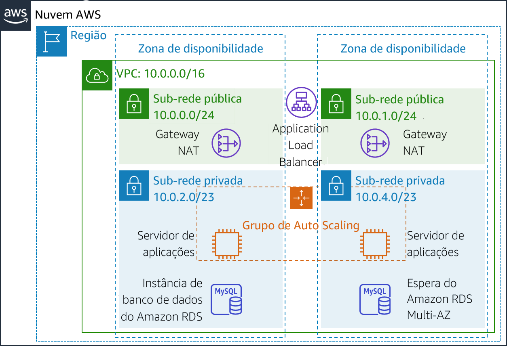
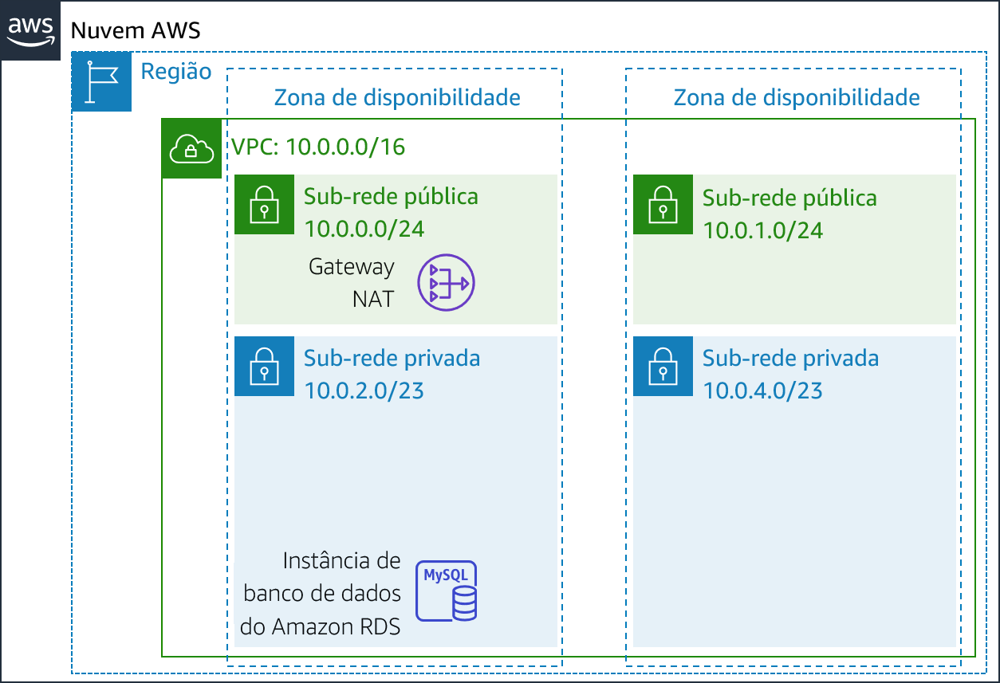
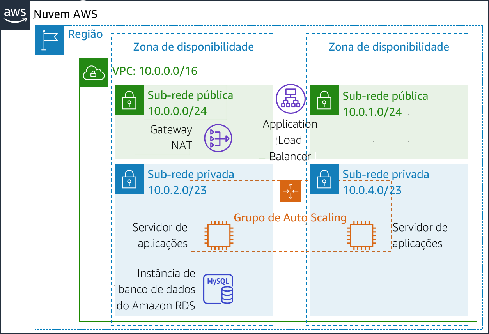
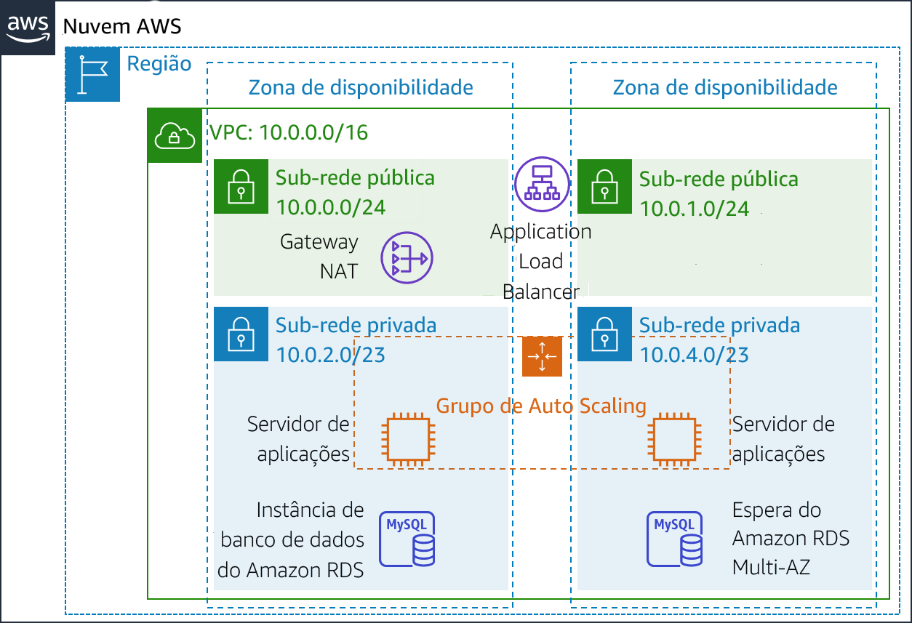

# Módulo 9 – Laboratório guiado: Criar um ambiente altamente disponível
[//]: # "SKU: ILT-TF-200-ACACAD-2    Source Course: ILT-TF-100-ARCHIT-6 branch dev_65"

## Visão geral e objetivos do laboratório

Sistemas essenciais para os negócios devem ser implantados como *aplicações altamente disponíveis*, ou seja, as aplicações permanecem operacionais mesmo quando alguns componentes falham. Para obter alta disponibilidade na Amazon Web Services (AWS), recomendamos que você *execute serviços em várias zonas de disponibilidade*.

Muitos serviços da AWS são inerentemente altamente disponíveis, como os load balancers, ou podem ser configurados para atingir alta disponibilidade, como a implantação de instâncias do Amazon Elastic Compute Cloud (Amazon EC2) em várias zonas de disponibilidade.

Neste laboratório, você começará com uma aplicação que é executada em uma única instância do EC2. Depois, você tornará a aplicação altamente disponível.

Depois de concluir este laboratório, você deverá ser capaz de:

- Inspecionar uma Virtual Private Cloud (VPC)
- Criar um Application Load Balancer
- Criar um grupo de Auto Scaling
- Testar a _alta disponibilidade_ da aplicação


No **final** deste laboratório, sua arquitetura será semelhante ao seguinte exemplo:



<br/>
##Duração

O laboratório levará aproximadamente **40 minutos** para ser concluído.


<br/>

## Restrições de serviço da AWS

Neste ambiente de laboratório, o acesso aos serviços e ações de serviço da AWS pode estar restrito àqueles necessários para concluir as instruções do laboratório. Você poderá encontrar erros se tentar acessar outros serviços ou executar ações além do que está descrito neste laboratório.

<br/>

## Acessar o Console de Gerenciamento da AWS

1. Na parte superior destas instruções, escolha <span id="ssb_voc_grey">Start Lab</span> (Iniciar laboratório) para iniciar o laboratório.

   Um painel **Start Lab** (Iniciar laboratório) é aberto com o status do laboratório.

   <i class="fas fa-info-circle"></i> **Dica**: se você precisar de mais tempo para concluir o laboratório, escolha novamente o botão <span id="ssb_voc_grey">Start Lab</span> (Iniciar laboratório) para reiniciar o cronômetro do ambiente.

2. Aguarde até que o painel **Start Lab** (Iniciar laboratório) exiba a mensagem *Lab status: ready (Status do laboratório: pronto)* e, em seguida, escolha **X** para fechar o painel.

3. Na parte superior destas instruções, escolha <span id="ssb_voc_grey">AWS</span>.

   Essa ação abrirá o Console de Gerenciamento da AWS em uma nova guia do navegador. O sistema fará seu login automaticamente.

   <i class="fas fa-exclamation-triangle"></i> **Dica**: se uma nova guia do navegador não for aberta, normalmente você verá uma faixa ou um ícone na parte superior do navegador com uma mensagem informando que o navegador está impedindo que o site abra janelas pop-up. Escolha a faixa ou o ícone e depois **Allow pop ups** (Permitir pop-ups).

4. Organize a guia do **Console de Gerenciamento da AWS** para que ela seja exibida com essas instruções. O ideal é ver as duas guias do navegador abertas ao mesmo tempo, para facilitar o acompanhamento das etapas do laboratório.

   <i class="fas fa-exclamation-triangle"></i> **Não altere a região, a menos que seja especificamente instruído a fazer isso**.

<br/>

## Tarefa 1: inspecionar sua VPC

O laboratório começa com um ambiente já implantado pelo AWS CloudFormation, incluindo:

- Uma VPC
- Sub-redes públicas e privadas em duas zonas de disponibilidade
- Um gateway da Internet (não mostrado no diagrama) associado às sub-redes públicas
- Um gateway NAT em uma das sub-redes públicas
- Uma instância do Amazon Relational Database Service (Amazon RDS) em uma das sub-redes privadas



Nesta tarefa, você analisará a configuração da VPC que já foi criada para este laboratório.

5. No **Console de Gerenciamento da AWS**, no menu <span id="ssb_services">Services<i class="fas fa-angle-down"></i></span> (Serviços), escolha **VPC**.

6. No painel de navegação à esquerda, em **Filter by VPC** (Filtrar por VPC), clique em <i class="fas fa-search"></i> a caixa **Select a VPC** (Selecionar uma VPC) e depois **Lab VPC**.

   Essa configuração limitará o console para mostrar apenas os recursos associados à _Lab VPC_.

7. No painel de navegação à esquerda, escolha **Your VPCs** (Suas VPCs).

   Aqui, você pode acessar informações sobre a **Lab VPC** criada para você.

   A coluna **CIDR** tem um valor de *10.0.0.0/16*, o que significa que essa VPC inclui todos os endereços IP que começam com *10.0.x.x*.

8. No painel de navegação à esquerda, escolha **Subnets** (Sub-redes).

   Aqui, você pode acessar informações sobre a **Sub-rede pública 1:**

   - A coluna **VPC** mostra que essa sub-rede existe dentro da *Lab VPC*.
   - A coluna **CIDR IPv4** tem um valor de *10.0.0.0/24*, o que significa que essa sub-rede inclui os 256 endereços IP entre _10.0.0.0_ e _10.0.0.255_. Cinco desses endereços são reservados e inutilizáveis.
   - A coluna **Zona de disponibilidade** lista a zona de disponibilidade em que esta sub-rede reside.

9. Para revelar mais detalhes na parte inferior da página, selecione <i class="far fa-check-square"></i> **Sub-rede pública 1**.

   **Dica:** para ajustar o tamanho do painel inferior da janela, você pode arrastar o divisor.

10. Na metade inferior da página, escolha a guia **Route Table** (Tabela de rotas).

    Esta guia inclui detalhes sobre o roteamento para esta sub-rede:

    - A primeira entrada especifica que o tráfego destinado ao intervalo de roteamento interdomínio sem classe (CIDR) para a VPC (*10.0.0.0/16*) será roteado dentro da VPC (*local*).
    - A segunda entrada especifica que qualquer tráfego destinado à Internet (*0.0.0.0/0*) é encaminhado para o gateway da Internet (*igw-*). Essa configuração torna a sub-rede *pública*.

11. Escolha a guia **Network ACL**.

    Essa guia tem informações sobre a lista de controle de acesso à rede (Network ACL) associada à sub-rede. As regras atualmente permitem que *todo o tráfego* flua para dentro e para fora da sub-rede, mas é possível restringir ainda mais as regras usando grupos de segurança.

12. No painel de navegação à esquerda, escolha **Internet Gateways** (Gateways da Internet).

Observe que um gateway da Internet já está associado à **Lab VPC**.

13. No painel de navegação à esquerda, escolha **Security Groups (Grupos de segurança)**.

14. Selecione <i class="far fa-check-square"></i> **Banco de dados do inventário**.

Esse grupo de segurança controla o tráfego de entrada para o banco de dados.

15. Na parte inferior da página, escolha a guia **Inbound rules** (Regras de entrada).

    Essas regras permitem tráfego de entrada para o MySQL ou do Aurora (porta 3306) de qualquer lugar na VPC (_10.0.0.0/16_). Mais tarde, você modificará essa configuração para que ela aceite apenas o tráfego dos servidores de aplicações.

16. Escolha a guia **Outbound Rules** (Regras de saída).

    Por padrão, os grupos de segurança permitem todo o tráfego de saída. No entanto, essa configuração pode ser modificada conforme necessário.

<br/>
## Tarefa 2: criar um Application Load Balancer

Para criar uma aplicação altamente disponível, uma das melhores práticas é iniciar recursos em *várias zonas de disponibilidade*. Zonas de disponibilidade são datacenters (ou grupos de datacenters) fisicamente separados na mesma região. Se você executar suas aplicações em várias zonas de disponibilidade, poderá fornecer maior *disponibilidade* caso um datacenter sofra uma falha.

Como a aplicação é executada em vários servidores, você precisará de uma maneira de distribuir tráfego entre eles. Isso pode ser feito usando um *balanceador de carga*. Esse balanceador de carga também realizará verificações de integridade em instâncias e enviará solicitações somente para instâncias íntegras.


17. No menu <span id="ssb_services">Services<i class="fas fa-angle-down"></i></span> (Serviços), escolha **EC2**.

18. No painel de navegação à esquerda, escolha **Load Balancers** (Balanceadores de carga) (pode ser necessário rolar para encontrar essa opção).

19. Escolha <span id="ssb_blue">Create Load Balancer</span> (Criar Load Balancer)

    Vários tipos de balanceadores de carga são exibidos. Leia as descrições de cada tipo para entender suas capacidades.

20. Em **Application Load Balancer**, escolha <span id="ssb_blue">Create</span> (Criar)

21. Em **Nome**, insira: `Inventory-LB`

22. Role até a seção **Availability Zones** (Zonas de disponibilidade) e, para **VPC**, selecione **Lab VPC**.

    Agora você especificará quais _sub-redes_ o balanceador de carga deve usar. Ele será um balanceador de carga voltado para a Internet, portanto você selecionará as duas sub-redes públicas.

23. Escolha a **primeira** zona de disponibilidade e a **Public Subnet** (Sub-rede pública) exibida.

24. Escolha a **segunda** zona de disponibilidade e a **Public Subnet** (Sub-rede pública) exibida.

    Agora você deve ter duas sub-redes selecionadas: **Sub-rede pública 1** e **Sub-rede pública 2**. (Caso contrário, volte e tente a configuração novamente.)

25. Escolha <span id="ssb_grey">Next: Configure Security Settings</span> (Próximo: Definir as configurações de segurança)

    É exibido um aviso recomendando que você use HTTP Seguro (HTTPS) para melhorar a segurança. Esse é um bom conselho, mas não é necessário para este laboratório.

26. Escolha <span id="ssb_grey">Next: Configure Security Groups</span> (Próximo: Configurar grupos de segurança)

    Agora, você criará um grupo de segurança que aceite todo o tráfego _HTTP_ e _HTTPS_ de entrada.

27. Selecione <i class="far fa-dot-circle"></i> **Crie um _novo_ grupo de segurança** e, depois, configure:

    - **Nome do grupo de segurança:** `Inventory-LB`
    - **Descrição:** `Habilitar acesso do balanceador de carga à Web`

28. Configure a regra existente (que já está na página) como:

    - **Tipo**: _HTTP_
    - **Origem**: _qualquer lugar_

29. Escolha <span id="ssb_grey">Add Rule</span> (Adicionar regra) e configure:

    - **Tipo:** _HTTPS_
    - **Origem**: _qualquer lugar_

    Essas configurações aceitarão todas as solicitações HTTP e HTTPS recebidas.

30. Escolha <span id="ssb_grey">Next: Configure Routing</span> (Próximo: Configurar roteamento)

    _Grupos de destino_ definem para onde *enviar* o tráfego que entra no balanceador de carga. O Application Load Balancer pode enviar tráfego para vários grupos de destino com base no URL da solicitação recebida. Um exemplo seria enviar solicitações de aplicativos móveis a um conjunto diferente de servidores. Sua aplicação Web usará apenas um grupo de destino.

31. Em **Nome**, insira: `Inventory-App`

32. Expanda <i class="fas fa-caret-right"></i> **Configurações avançadas de verificação de integridade**.

    O Application Load Balancer executa automaticamente _verificações de integridade_ em todas as instâncias para garantir que elas estejam respondendo às solicitações. As configurações padrão são recomendadas, mas isso fará com que elas sejam um pouco mais rápidas neste laboratório.

33. Configure estes valores:

    - **Limite de integridade:** `2`
    - **Intervalo:** `10`

    Isso significa que a verificação de integridade será executada a cada 10 segundos. Se a instância responder corretamente duas vezes seguidas, ela será considerada íntegra.

34. Escolha <span id="ssb_grey">Next: Register Targets</span> (Próximo: Registrar destinos)

    _Destinos_ são as instâncias individuais que responderão às solicitações do balanceador de carga. Você ainda não tem nenhuma instância de aplicação Web, portanto pode ignorar esta etapa.

35. Escolha <span id="ssb_grey">Next: Review</span> (Próximo: Revisar)

36. Revise as configurações. Escolha <span id="ssb_blue">Create</span> (Criar) e <span id="ssb_blue">Close</span> (Fechar)

    Agora, seu balanceador de carga será provisionado em segundo plano. Você não precisa esperar.

<br/>
## Tarefa 3: criar um grupo de Auto Scaling

O *Amazon EC2 Auto Scaling* é um serviço feito para _executar_ ou _encerrar_ instâncias do Amazon EC2 automaticamente com base em políticas, programações e verificações de integridade definidas pelo usuário. Ele também *distribui automaticamente instâncias em várias zonas de disponibilidade* para tornar as aplicações *altamente disponíveis*.

Nesta tarefa, você criará um grupo de Auto Scaling que implanta instâncias do EC2 em *sub-redes privadas*, o que é uma das melhores práticas de segurança para a implantação de aplicações. As instâncias de uma sub-rede privada não podem ser acessadas pela Internet. Em vez disso, os usuários enviam solicitações para o balanceador de carga, que encaminha as solicitações para instâncias do EC2 nas sub-redes privadas.




<br/>
### Criar uma AMI para o Auto Scaling

Nesta tarefa, você criará uma AMI a partir do _Servidor da Web 1_ existente. Isso salvará o conteúdo do disco de execução para que novas instâncias possam ser executadas com conteúdo idêntico.

37. No **Console de Gerenciamento da AWS**, no menu <span id="ssb_services">Services<i class="fas fa-angle-down"></i></span> (Serviços), clique em **EC2**.

38. No painel de navegação esquerdo, clique em **Instances** (Instâncias).

    Primeiro, você confirmará que a instância está em execução.

39. Aguarde até que as **Status Checks** (Verificações de status) para o **Web Server 1** (Servidor da Web 1) exiba *2/2 checks passed (2/2 verificações aprovadas)*. Clique em Refresh (Atualizar) <i class="fas fa-sync"></i> para atualizar.

    Agora, você criará uma AMI com base nessa instância.

40. Selecione <i class="far fa-check-square"></i> **Web Server 1** (Servidor da Web 1).

41. No menu <span id="ssb_grey">Actions<i class="fas fa-angle-down"></i></span> (Ações), clique em **Image** (Imagem) > **Create Image** (Criar imagem) e configure:

    - **Image name** (Nome da imagem): `Web Server AMI (AMI do servidor da Web)`
    - **Descrição da imagem**: `AMI do laboratório para o servidor da Web`

42. Clique em <span id="ssb_orange">Create image</span> (Criar imagem)

    A tela de confirmação exibe o **ID da AMI** para a nova AMI.

43. Clique em <span id="ssb_blue">Close</span> (Fechar)

    Você usará essa AMI ao iniciar o grupo de Auto Scaling posteriormente no laboratório.

<br/>

### Criar uma configuração de execução e um grupo de Auto Scaling

Primeiro, você criará uma *configuração de execução* que define o tipo de instâncias que o Amazon EC2 Auto Scaling deve executar. A interface é semelhante a quando você executa uma instância do EC2. No entanto, em vez de executar uma instância, ela _armazena_ a configuração para uso posterior.

44. No painel de navegação à esquerda, escolha **Launch Configurations (Configurações de execução)**.

45. Escolha <span id="ssb_orange">Create launch configuration</span> (Criar configuração de execução)

46. Defina estas configurações:

    - **Nome da configuração de execução:** `Inventory-LC`

    - **Imagem de máquina da Amazon (AMI):** escolha *Web Server AMI (AMI do servidor da Web)*

    - **Tipo de instância:**

       - Selecione <span id="ssb_white">Choose instance type</span> (Escolher tipo de instância)
       - Selecione *t3.micro*
       - Escolha <span id="ssb_orange">Choose</span> (Escolher)

       **Observação:** se você executou o laboratório na região us-east-1, selecione o tipo de instância **t2.micro**. Para localizar a região, olhe no canto superior direito do console do Amazon EC2.

       **Observação:** se você receber a mensagem de erro "Algo deu errado. Atualize e tente novamente.", ignore-a e prossiga com o exercício.

    - **Configuração adicional**

       - **IAM instance profile** (Perfil de instância do IAM): selecione _Inventory-App-Role_
    - **Monitoring** (Monitoramento): </i>selecione <i class="far fa-check-square"></i> *Enable EC2 instance detailed monitoring within CloudWatch (Habilitar monitoramento detalhado de instância do EC2 no CloudWatch)*

       Isso permite que o Auto Scaling reaja rapidamente a alterações na utilização.

47. Expanda <i class="fas fa-caret-right"></i> **Detalhes avançados**. Em **Dados do usuário**, copie e cole este script:

```bash
#!/bin/bash
# Install Apache Web Server and PHP
yum install -y httpd mysql
amazon-linux-extras install -y php7.2
# Download Lab files
wget https://aws-tc-largeobjects.s3-us-west-2.amazonaws.com/ILT-TF-200-ACACAD-20-EN/mod9-guided/scripts/inventory-app.zip
unzip inventory-app.zip -d /var/www/html/
# Download and install the AWS SDK for PHP
wget https://github.com/aws/aws-sdk-php/releases/download/3.62.3/aws.zip
unzip aws -d /var/www/html
# Turn on web server
chkconfig httpd on
service httpd start
```

48. Em **Grupos de segurança**

- **Select an existing security group** (Selecione um grupo de segurança existente): _Inventory-App_

<i class="fas fa-comment"></i> Será exibido um aviso de que _Você não será capaz de se conectar à instância_. Ignore esse aviso, porque você não se conectará à instância. Toda a configuração é feita pelo script de dados do usuário.

49. Em **Par de chaves** (login):

* Selecione **Proceed without a key pair** (Prosseguir sem um par de chaves)
* Selecione <i class="far fa-check-square"></i> *Reconheço que...*

50. Escolha <span id="ssb_orange">Create launch configuration</span> (Criar configuração de execução)

A _configuração de execução_ definiu *o que executar*, mas o _grupo de Auto Scaling_ define *onde executar* os recursos.


51. Na tabela **Launch configurations** (Configurações de execução), selecione <i class="far fa-check-square"></i> *Inventory-LC*.

52. No menu <span id="ssb_white">Actions<i class="fas fa-caret-down"></i></span> (Ações), escolha *Create Auto Scaling group (Criar grupo de Auto Scaling)*

53. Insira o nome do grupo de Auto Scaling:

    - **Nome:**  `Inventory-ASG` (*ASG* significa _grupo de Auto Scaling, na sigla em inglês_)

54. Escolha <span id="ssb_orange">Next</span> (Próximo)

55. Na página **Network** (Rede), configure

    - **VPC:** _Lab VPC_

    - **Subnet** (Sub-rede): selecione _Sub-rede privada 1_ **e** _Sub-rede privada 2_

    <i class="fas fa-comment"></i> Você pode ignorar o aviso que diz _Nenhum endereço IP público será atribuído_. As instâncias do EC2 serão executadas em uma _sub-rede privada_, então não necessitam de endereços IP públicos.

    Isso executará instâncias do EC2 em sub-redes privadas em ambas as zonas de disponibilidade.

56. Escolha <span id="ssb_orange">Next</span> (Próximo)

57. Em **Balanceamento de carga**:

    - Selecione <i class="far fa-check-square"></i> **Enable load balancing** (Habilitar balanceamento de carga)
    - Escolha **Application Load Balancer or Network Load Balancer** (Application Load Balancer ou Network Load Balancer)
    - **Escolha um grupo de destino para o balanceador de carga:**  *Inventory-App*

    Essas configurações dizem ao grupo de Auto Scaling para registrar novas instâncias do EC2 como parte do grupo-alvo do _Application-App_ criado anteriormente. O balanceador de carga enviará tráfego para instâncias que estão nesse grupo de destino.

58. Em **Verificações de integridade**:

- Selecione <i class="far fa-check-square"></i> **ELB**
- **Período de carência da verificação de integridade:** 90

59. Em **Configurações adicionais:**

- selecione <i class="far fa-check-square"></i> **Habilitar coleta de métricas de grupo no CloudWatch**

60. Escolha <span id="ssb_orange">Next</span> (Próximo)

61. Em **Group Size** (Tamanho do grupo), configure:

    - **Desired capacity** (Capacidade desejada): 2
    - **Capacidade mínima:** 2
    - **Capacidade máxima:** 2

62. Em **Scaling policies** (Políticas de escalabilidade), escolha *None (Nenhuma)*.

    Para este laboratório, você *manterá duas instâncias em todos os momentos* para garantir _alta disponibilidade_. Caso espere-se que a aplicação receberá cargas variadas de tráfego, você também pode criar _políticas de dimensionamento_, que definem quando executar ou encerrar instâncias. No entanto, você não precisa criar políticas de disponibilidade para a aplicação de inventário deste laboratório.

63. Escolha <span id="ssb_orange">Next</span> (Próximo)

64. Na página **Add notifications** (Adicionar notificações), escolha <span id="ssb_orange">Next</span> (Avançar). Não é necessário alterar essas configurações.

65. Na página **Add tags** (Adicionar tags), escolha <span id="ssb_white">Add tag</span> (Adicionar tag)
    - **Key** (Chave): `Name (Nome)`
    - **Valor:** `Inventory-App`
    - Selecione <i class="far fa-check-square"></i> <span id="ssb_orange">Próximo</span>

    Essas configurações atribuirão uma _tag_ ao grupo de Auto Scaling com um *nome*, que também aparecerá nas instâncias do EC2 que são executadas pelo grupo de Auto Scaling. Você pode usar tags para identificar quais instâncias do Amazon EC2 estão associadas a quais aplicações. Você também pode adicionar tags como *Centro de custo* para atribuir custos de aplicações nos arquivos de faturamento.

66. Na página **Review (Revisão):

    - Escolha <span id="ssb_orange">Create Auto Scaling group</span> (Criar grupo de Auto Scaling)

    _Inventory-ASG_ aparecerá no console:

    

    A revisão mostra que:

    - No momento, o grupo *não tem instâncias*, mas o ícone de informações <i class="fas fa-info-circle"></i> indica que as instâncias estão sendo executadas. (Passe sobre o ícone para obter mais detalhes.)
    - A quantidade **desejada** é *2 instâncias*. O Amazon EC2 Auto Scaling tentará executar duas instâncias para alcançar a quantidade desejada
    - O **mínimo** e o **máximo** também serão definidos como *2 instâncias*. O Amazon EC2 Auto Scaling tentará sempre fornecer duas instâncias, mesmo que haja falhas.

    A aplicação logo será executada em duas zonas de disponibilidade. O Amazon EC2 Auto Scaling manterá essa configuração mesmo que alguma instância ou zona de disponibilidade falhe.

    Depois de um minuto, escolha <i class="fas fa-sync"></i> **Atualize** para ver a nova exibição. Ela deve mostrar que *2 instâncias* estão em execução.

<br/>
## Tarefa 4: atualizar grupos de segurança

A aplicação que você implantou é uma *arquitetura de três camadas*. Agora você configurará os grupos de segurança para reforçar estas camadas:


<br/>
### Grupo de segurança do balanceador de carga

Você já configurou o _grupo de segurança do balanceador de carga_ quando criou o balanceador de carga. Ele aceita todo o tráfego _HTTP_ e _HTTPS_ de entrada.

O balanceador de carga foi configurado para encaminhar as solicitações recebidas para um _grupo de destino_. Quando o Auto Scaling executar novas instâncias, ele automaticamente adicionará essas instâncias ao grupo de destino.

<br/>
### Grupo de segurança da aplicação Web

O _grupo de segurança de aplicações_ foi fornecido como parte da configuração do laboratório. Agora você o configurará para aceitar apenas o tráfego de entrada do balanceador de carga.

67. No painel de navegação à esquerda, escolha **Security Groups (Grupos de segurança)**.
68. Selecione <i class="far fa-check-square"></i> **Inventory-App**.

69. Na parte inferior da página, escolha a guia **Inbound rules** (Regras de entrada).

O grupo de segurança está vazio no momento. Agora você adicionará uma regra para aceitar o tráfego _HTTP_ de entrada do balanceador de carga. Você não precisa configurar o tráfego _HTTPS_ porque o balanceador de carga foi configurado para encaminhar solicitações HTTPS via HTTP. Essa prática passa a segurança para o balanceador de carga, reduzindo a quantidade de trabalho exigida pelos servidores de aplicações individuais.

70. Escolha <span id="ssb_grey">Edit inbound rules</span> (Editar regras de entrada).

71. Na página **Edit inbound rules** (Editar regras de entrada), escolha <span id="ssb_grey">Add rule</span> (Adicionar regra) e defina estas configurações:

- **Tipo**: _HTTP_
- **Origem:**
   - Clique na caixa de pesquisa ao lado de **Custom** (Personalizado)
   - Exclua o conteúdo atual
   - Digite `sg`
   - Selecione **Inventory-LB** na lista que será exibida
- **Descrição:** `tráfego do balanceador de carga`
- Escolha <span id="ssb_orange">Save rules</span> (Salvar regras)

Os servidores de aplicações agora podem receber tráfego do balanceador de carga. Isso inclui _verificações de integridade_ que o balanceador de carga executa automaticamente.

<br/>
### Grupo de segurança de banco de dados

Agora, você configurará o _grupo de segurança do banco de dados_ para aceitar apenas o tráfego de entrada dos servidores de aplicações.

72. Selecione <i class="far fa-check-square"></i> **Inventory-DB** (e garanta que nenhum outro grupo de segurança esteja selecionado).

A regra existente permite tráfego na porta 3306 (usada pelo MySQL) de qualquer endereço IP dentro da VPC. Essa é uma boa regra, mas a segurança pode ser restringida ainda mais.

73. Na guia **Inbound rules** (Regras de entrada), escolha <span id="ssb_grey">Edit inbound rules</span> (Editar regras de entrada) e defina estas configurações:

- Clique na caixa de pesquisa ao lado de **Custom** (Personalizado)
- Exclua o conteúdo atual
- Digite `sg`
- Selecione **Inventory-App** na lista exibida
- **Descrição:** `tráfego de servidores de aplicações`
- Escolha <span id="ssb_orange">Save rules</span> (Salvar regras)

Você acaba de configurar a _segurança de três camadas_. Cada elemento da camada aceita somente tráfego da camada superior.

Além disso, o uso de sub-redes privadas significa que você tem duas barreiras de segurança entre a Internet e os recursos da aplicação. Essa arquitetura segue as melhores práticas para aplicar várias camadas de segurança.

<br/>
## Tarefa 5: testar a aplicação

Sua aplicação agora está pronta para testes.

Nesta tarefa, você poderá confirmar se a aplicação Web está em execução e testar se ela é altamente disponível.

74. No painel de navegação, escolha **Target Groups** (Grupos de destino).

O grupo de instâncias *Inventory-App* será exibido.

75. Na parte inferior da página, escolha a guia **Targets** (Destinos).

Essa guia deve mostrar dois *destinos registrados*. A coluna **Status** mostra os resultados da verificação de integridade do balanceador de carga executada nas instâncias.

76. Na área superior direita, escolha <i class="fas fa-sync"></i> ocasionalmente **Atualize** até que o **Status** de ambas as instâncias apareça como *íntegro*.

Se o status não mudar para *saudável*, peça ajuda ao educador para diagnosticar a configuração. Passe sobre o ícone <i class="fas fa-info-circle"></i> na coluna **Status** para acessar mais informações.

Você testará a aplicação conectando-se ao balanceador de carga, que enviará sua solicitação para uma das instâncias do EC2. Primeiro, você precisará recuperar o nome do Domain Name System (DNS) do balanceador de carga.

77. No painel de navegação à esquerda, escolha **Load Balancers**.

78. Na guia **Description (Descrição)** na parte inferior da página, copie o **DNS Name** (Nome da DNS) para a área de transferência.

Ele deve ser semelhante a: *inventory-LB-xxxx.elb.amazonaws.com*

79. Abra uma nova guia do navegador Web, cole o nome do DNS da sua área de transferência e selecione ENTER.

O balanceador de carga encaminhou sua solicitação para uma das instâncias do EC2. O ID da instância e a zona de disponibilidade são mostrados na parte inferior da página da Web.

80. Recarregue a página <i class="fas fa-sync"></i> no seu navegador da Web. Você deve notar que pode haver diferenças no ID e na zona de disponibilidade das duas instâncias.

    Quando esta aplicação Web é exibida, o fluxo de informações é:

    

    - Você enviou a solicitação para o *balanceador de carga*, que fica nas *sub-redes públicas* conectadas à internet.
    
    - O balanceador de carga escolheu uma das *instâncias do EC2* que residem nas *sub-redes privada* e encaminhou a solicitação para ela.
    
    - A instância do EC2 retornou a página da Web para o balanceador de carga, que a retornou ao seu navegador da Web.

<br/>
##Tarefa 6: testar a alta disponibilidade

Sua aplicação foi configurada para estar altamente disponível. Você pode comprovar a alta disponibilidade dela encerrando uma das instâncias do EC2.

81. Volte para a guia do **Console do Amazon EC2** no navegador da Web (mas não feche a guia da aplicação Web, você retornará a ela em breve).

82. No painel de navegação à esquerda, escolha **Instances** (Instâncias).

    Agora, você encerrará uma das instâncias da aplicação Web para simular uma falha.

83. Selecione <i class="far fa-check-square"></i> uma das instâncias do **Inventory-App** (não importa qual).

84. Escolha <span id="ssb_grey">Actions<i class="fas fa-angle-down"></i></span> (Ações) e depois **Instance State** (Estado da instância) > **Terminate **(Encerrar).

85. Escolha **Yes, Terminate** (Sim, encerrar)

    Em um curto período, as verificações de integridade do balanceador de carga perceberão que a instância não está respondendo e automaticamente roteará todas as solicitações para a instância restante.

86. Volte para a guia da aplicação Web no navegador e recarregue <i class="fas fa-sync"></i> a página várias vezes.

    Você deve notar que a *zona de disponibilidade* que é mostrada na parte inferior da página permanece a mesma. Embora uma instância tenha falhado, a aplicação permanece disponível.

    Após alguns minutos, o Amazon EC2 Auto Scaling também notará a falha da instância. Ele foi configurado para manter duas instâncias em execução, portanto *executará automaticamente uma instância de substituição*.

87. Retorne à guia do **Console do Amazon EC2** em seu navegador da Web. Na área superior direita, atualize a cada 30 segundos <i class="fas fa-sync"></i> até que uma nova instância do EC2 seja exibida.

    Após alguns minutos, a verificação de integridade da nova instância deve se tornar íntegra. O balanceador de carga continuará enviando tráfego entre duas zonas de disponibilidade. Você pode recarregar a guia da aplicação da Web para ver isso acontecer.

    Essa tarefa mostra que a aplicação agora está _altamente disponível_.

<br/>
## Tarefa opcional 1: Tornar o banco de dados altamente disponível

<i class="fas fa-comment"></i> _Esta tarefa é **opcional**. Você pode trabalhar nela se tiver tempo sobrando no laboratório._

A arquitetura da aplicação agora está altamente disponível. No entanto, o banco de dados do Amazon RDS opera a partir de apenas uma instância de banco de dados.

Nesta tarefa opcional, você tornará o banco de dados altamente disponível. Para isso, ele será configurado para ser executado em várias zonas de disponibilidade (ou seja, em uma *implantação Multi-AZ*).



88. No menu <span id="ssb_services">Services<i class="fas fa-angle-down"></i></span> (Serviços), escolha **RDS**.

89. No painel de navegação à esquerda, escolha **Databases** (Bancos de dados).

90. Escolha <span style="color:blue;">inventory-db</span>

Fique à vontade para explorar as informações sobre o banco de dados.

91. Escolha <span id="ssb_rds_white">Modify</span> (Modificar).

92. Para **Multi-AZ deployment** (Implantação Multi-AZ), selecione <i class="far fa-dot-circle"></i> **Sim**.

Você só precisa fazer isso para converter o banco de dados para ser executado em vários datacenters (zonas de disponibilidade).

Essa opção não significa que o banco de dados seja _distribuído_ em várias instâncias. Em vez disso, uma instância é a instância _primária_, que lida com todas as solicitações. Outra instância será executada como a instância _standby_, que assume se a instância primária falhar. Sua aplicação continua usando o mesmo nome DNS para o banco de dados. No entanto, as conexões serão redirecionadas automaticamente para o servidor de banco de dados ativo no momento.

Você pode dimensionar uma instância do EC2 e um banco de dados do RDS alterando atributos. Agora, você vai dimensionar o banco de dados.

93. Para **DB instance class** (Classe da instância de banco de dados), selecione **db.t3.small**.

Essa ação dobra o tamanho da instância.

94. Para **Armazenamento alocado**, insira: `10`

Essa ação duplica a quantidade de espaço alocada ao banco de dados.

Sinta-se livre para explorar as outras opções da página, mas não altere nenhum valor.

95. Na parte inferior da página, escolha <span id="ssb_orange">Continue</span> (Continuar).

A performance do banco de dados será afetada por essas mudanças. Portanto, essas alterações podem ser programadas durante uma janela de manutenção definida ou podem ser executadas imediatamente.

96. Em **Scheduling of Modifications** (Programação de modificações), selecione <i class="far fa-dot-circle"></i> **Aplicar imediatamente**.

97. Escolha <span id="ssb_orange">Modify DB instance</span> (Modificar instância de banco de dados)

    O banco de dados insere um estado de _modificação_ enquanto aplica as alterações. Você não precisa esperar que ele seja concluído.

<br/>
## Tarefa opcional 2: Configurar um gateway NAT altamente disponível

<i class="fas fa-comment"></i> _Esta tarefa é **opcional**. Você pode trabalhar nela se tiver tempo sobrando no laboratório._

Os servidores de aplicações são executados em uma sub-rede privada. Se os servidores precisarem acessar a Internet (por exemplo, para transferir dados), as solicitações devem ser redirecionadas por um _gateway NAT_. (O gateway NAT deve estar em uma sub-rede pública).

A arquitetura atual tem apenas um gateway NAT na _Sub-rede pública 1_. Assim, se a zona de disponibilidade 1 falhar, os servidores de aplicações não poderão se comunicar com a Internet.

Nesta tarefa opcional, você tornará o gateway NAT altamente disponível executando outro gateway NAT na outra zona de disponibilidade. A arquitetura resultante será altamente disponível:


98. No menu <span id="ssb_services">Services (Serviços)<i class="fas fa-angle-down"></i></span>, escolha **VPC**.

99. No painel de navegação à esquerda, escolha **NAT Gateways** (Gateways NAT).

    O gateway NAT existente será exibido. Agora, você criará um gateway NAT para a outra zona de disponibilidade.

100. Escolha <span id="ssb_orange">Create NAT gateway</span> (Criar gateway NAT) e defina estas configurações:

     - **Subnet** (Sub-rede): *PublicSubnet2* (selecione esta opção na lista)

     <i class="fas fa-comment"></i>Os detalhes da *sub-rede* estão no início dessas instruções. Escolha **Details** (Detalhes) e, à direita da **AWS**, escolha **Show** (Mostrar). Observe os nomes **PublicSubnet2** e **NATGateway1**.

     - Escolha <span id="ssb_grey">Allocate Elastic IP</span> (Alocar IP elástico)
     - Escolha <span id="ssb_orange">Create NAT gateway</span> (Criar gateway NAT)
     - Escolha <span id="ssb_blue">Edit route tables</span> (Editar tabelas de rotas)

     Agora você criará uma nova tabela de rotas para _Private Subnet 2_. Essa tabela de rotas reorientará o tráfego para o novo gateway NAT.

101. Escolha <span id="ssb_blue">Create route table</span> (Criar tabela de rotas) e defina estas configurações:

     - **Name tag** (Tag de nome): `Tabela de rotas privada 2`
     - **VPC:** _Lab VPC_
     - Escolha <span id="ssb_blue">Create</span> (Criar) e <span id="ssb_blue">Close</span> (Fechar).

102. Selecione <i class="far fa-check-square"></i> **Tabela de rotas privada 2** e confirme que essa é a única tabela de rotas selecionada.

103. Escolha a guia **Routes** (Rotas).

     Atualmente, uma rota direciona todo o tráfego _locally_.
    
     Você adicionará uma rota para enviar o tráfego voltado à Internet através do novo gateway NAT.

104. Escolha <span id="ssb_grey">Edit routes</span> (Editar rotas) e defina estas configurações:

     - Escolha <span id="ssb_grey">Add route</span> (Adicionar rota)
     - **Destination** (Destino): `0.0.0.0/0`
     * **Target** (Alvo): selecione _Gateway NAT_, depois a entrada _nat-_, que *não* é a entrada para _NATGateway1_ (que está no botão **Details** (Detalhes) acima destas instruções)
     - Escolha <span id="ssb_blue">Save routes</span> (Salvar rotas) e <span id="ssb_blue">Close</span> (Fechar)

     <i class="fas fa-comment"></i> O gateway NAT listado sob o botão **Details** (Detalhes) (que está acima destas instruções) é para a _Sub-rede pública 1_. Você está configurando a tabela de rotas para usar o _outro_ gateway NAT.

105. Abra a guia **Subnet Associations** (Associações de sub-rede).

106. Escolha <span id="ssb_grey">Edit subnet associations (Editar associações de sub-rede)</span>.

107. Selecione <i class="far fa-check-square"></i> **Sub-rede privada 2**.

108. Escolha <span id="ssb_blue">Save</span> (Salvar)

     Essa ação agora envia o tráfego vinculado à Internet da sub-rede privada 2 para o gateway NAT que está na mesma zona de disponibilidade.

     Seus gateways NAT agora estão altamente disponíveis. Uma falha em uma zona de disponibilidade não afetará o tráfego na outra zona de disponibilidade.

<br/>
## Enviar o trabalho

109. Na parte superior destas instruções, escolha <span id="ssb_blue">Submit</span> (Enviar) para gravar seu progresso e, quando solicitado, escolha **Yes** (Sim).

110. Se os resultados não forem exibidos após alguns minutos, volte ao topo destas instruções e escolha <span id="ssb_voc_grey">Grades</span> (Notas).

     **Dica**: você pode enviar seu trabalho várias vezes. Depois de alterar o trabalho, escolha **Submit** (Enviar) novamente. Seu último envio é o que será gravado para este laboratório.

111. Para ver o feedback detalhado do seu trabalho, escolha <span id="ssb_voc_grey">Details</span> (Detalhes) e depois <i class="fas fa-caret-right"></i> **View Submission Report** (Visualizar relatório de envio).

<br/>

## Laboratório concluído <i class="fas fa-graduation-cap"></i>

<i class="fas fa-flag-checkered"></i> Parabéns! Você concluiu o laboratório.

112. Escolha <span id="ssb_voc_grey">End Lab</span> (Encerrar laboratório) na parte superior desta página e, em seguida, selecione <span id="ssb_blue">Yes</span> (Sim) para confirmar que você deseja encerrar o laboratório.

     Um painel indica que *A EXCLUSÃO foi iniciada... Você pode fechar esta caixa de mensagem agora.*

113. Escolha o **X** no canto superior direito para fechar o painel.


*©2020, Amazon Web Services, Inc. e suas afiliadas. Todos os direitos reservados. Este trabalho não pode ser reproduzido ou redistribuído, no todo ou em parte, sem permissão prévia por escrito da Amazon Web Services, Inc. É proibido copiar, emprestar ou vender para fins comerciais.*
