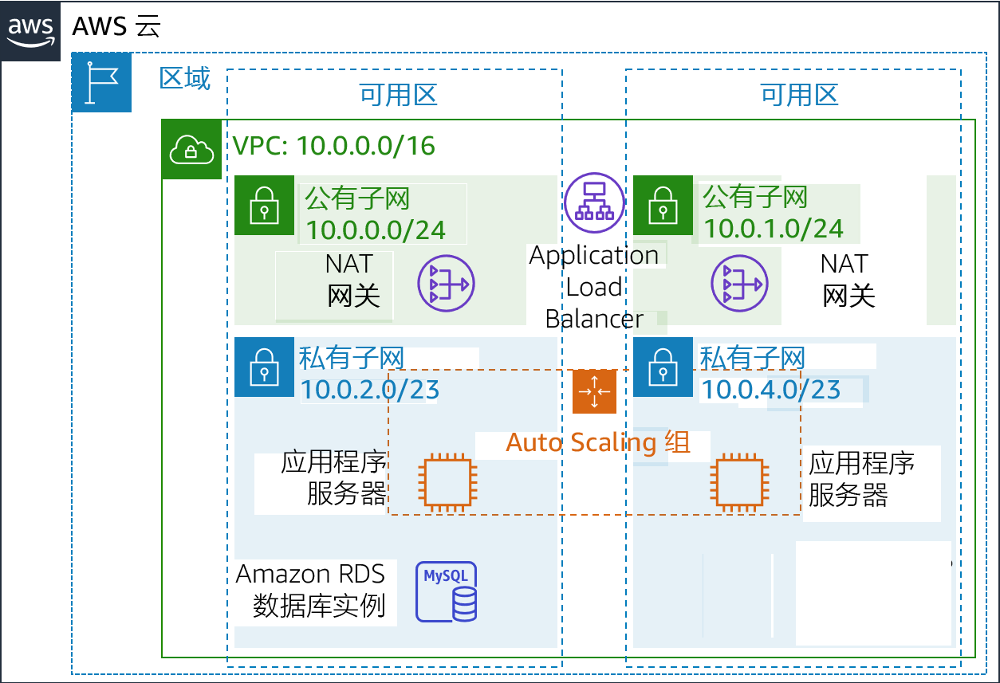
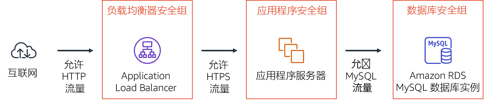
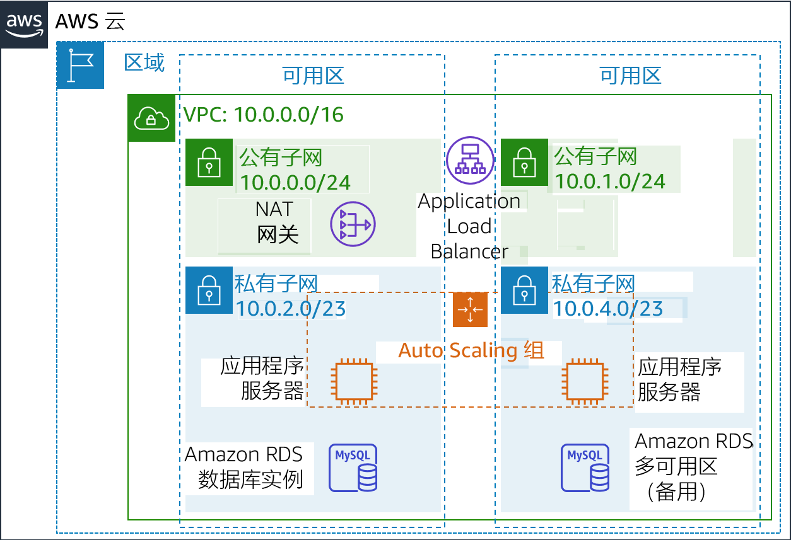

# 模块 9 – 指导实验：创建高度可用的环境
[//]: # "SKU: ILT-TF-200-ACACAD-2    Source Course: ILT-TF-100-ARCHIT-6 branch dev_65"

## 实验概览和目标

关键业务系统应部署为*高度可用的应用程序*，这意味着即使在某些组件发生故障的情况下，应用程序也可以保持运行。为了在 Amazon Web Services (AWS) 中实现高可用性，我们建议您*跨多个可用区运行服务*。

许多 AWS 服务本身就具有高可用性（例如负载均衡器）。还可以通过配置很多 AWS 服务来实现高可用性，例如在多个可用区中部署 Amazon Elastic Compute Cloud (Amazon EC2) 实例。

在本实验中，您将从在单个 EC2 实例上运行的应用程序开始入手，然后将其转变为高度可用的应用程序。

完成本实验后，您应能够：

- 检查提供的 Virtual Private Cloud (VPC)
- 创建 Application Load Balancer
- 创建 Auto Scaling 组
- 测试应用程序是否实现了_高可用性_


在本实验**结束**时，您的架构将如下例所示：


<br/>
## 持续时间

完成本实验大约需要 **40 分钟**。


<br/>

## AWS 服务限制

在本实验环境中，对 AWS 服务和服务操作的访问可能仅限于完成实验说明所需的服务和服务操作。如果您尝试访问其他服务或执行本实验中所述之外的操作，可能会遇到错误。

<br/>

## 访问 AWS 管理控制台

1. 在这些说明的顶部，选择 <span id="ssb_voc_grey">Start Lab</span>（启动实验）即可启动您的实验。

   **Start Lab**（启动实验）面板随即会打开，其中显示了实验状态。

   <i class="fas fa-info-circle"></i> **提示**：如果您需要更多时间来完成实验，请再次选择 <span id="ssb_voc_grey">Start Lab</span>（启动实验）按钮，重新启动环境计时器。

2. 请耐心等待，直到 **Start Lab**（启动实验）面板显示消息 *Lab status: ready*（实验状态：就绪），然后选择 **X** 关闭此面板。

3. 在这些说明的顶部，选择 <span id="ssb_voc_grey">AWS</span>。

   此操作将在一个新的浏览器选项卡中打开 AWS 管理控制台。您将自动登录系统。

   <i class="fas fa-exclamation-triangle"></i> **提示**：如果未打开新的浏览器选项卡，您的浏览器顶部通常会出现一个横幅或图标，并显示一条消息，指明您的浏览器阻止该了网站打开弹出窗口。请选择横幅或图标，然后选择 **Allow pop-ups**（允许弹出窗口）。

4. 排列 **AWS 管理控制台**选项卡，使其与这些说明一起显示。理想情况下，您将同时打开两个浏览器选项卡，以便能够更轻松地执行实验步骤。

   <i class="fas fa-exclamation-triangle"></i> **除非特别要求，否则请勿更改区域**。

<br/>

## 任务 1：检查您的 VPC

本实验从一个已通过 AWS CloudFormation 部署的环境开始，其中包含：

- 一个 VPC
- 位于两个可用区内的公有子网和私有子网
- 与公有子网关联的一个互联网网关（未显示）
- 其中一个公有子网中的网络地址转换 (NAT) 网关
- 位于其中一个私有子网内的 Amazon Relational Database Service (Amazon RDS) 实例


在此任务中，您将查看已为此实验创建的 VPC 的配置。

5. 在 **AWS 管理控制台**中的 <span id="ssb_services">Services <i class="fas fa-angle-down"></i></span>（服务）菜单中，选择 **VPC**。

6. 在左侧导航窗格中的 **Filter by VPC**（用 VPC 筛选）下，单击 <i class="fas fa-search"></i> **Select a VPC**（选择 VPC）框，然后选择 **Lab VPC**。

   此设置将使控制台仅显示与 _Lab VPC_ 关联的资源。

7. 从左侧导航窗格中，选择 **Your VPCs**（您的 VPC）。

   在这里，您可以访问为您创建的 **Lab VPC** 的相关信息。

   **CIDR** 列的值为 *10.0.0.0/16*，这意味着此 VPC 包括以 *10.0.x.x* 开头的所有 IP 地址。

8. 在左侧导航窗格中，选择 **Subnets**（子网）。

   在这里，您可以访问有关 **Public Subnet 1**（公有子网 1）的信息：

   - **VPC** 列显示此子网存在于 *Lab VPC* 内。
   - **IPv4 CIDR** 列的值为 *10.0.0.0/24*，这意味着该子网包括介于 _10.0.0.0_ 和 _10.0.0.255_ 之间的 256 个 IP 地址。其中有五个保留地址，无法使用。
   - **Availability Zone**（可用区）列列出了此子网所在的可用区。

9. 要在页面底部显示更多详细信息，请选择 <i class="far fa-check-square"></i> **Public Subnet 1**（公有子网 1）。

   **提示：**要调整下方窗格的大小，可以拖动分隔线。

10. 选择页面下半部分中的 **Route Table**（路由表）选项卡。

此选项卡包含有关此子网的详细路由信息：

    – 第一个条目指定目标在 VPC (10.0.0.0/16) 无类域间路由 (CIDR) 范围内的流量将在该 VPC (本地) 内路由。
    – 第二个条目指定任何流向互联网 (0.0.0.0/0) 的流量都将路由到互联网网关 (igw-)。此设置使该子网成为公有子网。

11. 选择 **Network ACL**（网络 ACL）选项卡。

    此选项卡包含与子网关联的网络访问控制列表（网络 ACL）的信息。这些规则目前允许*所有流量*进出子网，但可以通过使用安全组进一步限制这些规则。

12. 在左侧导航窗格中，选择 **Internet Gateways**（互联网网关）。

    请注意，一个互联网网关已经与 **Lab VPC** 关联。

13. 在左侧导航窗格中，选择 **Security Groups**（安全组）。

14. 选择 <i class="far fa-check-square"></i> **Inventory DB**（库存数据库）。

    此安全组控制数据库的入站流量。

15. 选择页面下半部分中的 **Inbound Rules**（入站规则）选项卡。

    这些规则允许来自 VPC（_10.0.0.0/16_）中任何位置的入站 MySQL 或 Aurora 流量（端口 3306）。稍后您将修改此设置，使其只接受来自应用程序服务器的流量。

16. 选择 **Outbound Rules**（出站规则）选项卡。

    默认情况下，安全组允许所有出站流量。但是，可以根据需要修改此设置。

<br/>
## 任务 2：创建 Application Load Balancer

要构建高度可用的应用程序，最佳实践是在*多个可用区*中启动资源。可用区是同一区域中物理上分离的数据中心（或数据中心组）。如果跨多个可用区运行应用程序，则可以在数据中心遇到故障时提供更高的*可用性*。

由于应用程序在多个应用程序服务器上运行，因此您需要在这些服务器之间分配流量的方法。您可以使用*负载均衡器*来实现此目标。此负载均衡器还将对实例执行运行状况检查，并仅向运行良好的实例发送请求。


17. 在 <span id="ssb_services">Services <i class="fas fa-angle-down"></i></span>（服务）菜单上，选择 **EC2**。

18. 在左侧导航窗格中，选择 **Load Balancers**（负载均衡器）（您可能需要向下滚动才能找到）。

19. 选择 <span id="ssb_blue">Create Load Balancer</span>（创建负载均衡器）。

    此时将显示几种类型的负载均衡器。请阅读每种类型的描述，了解它们的功能。

20. 在 **Application Load Balancer** 下，选择 <span id="ssb_blue">Create</span>（创建）。

21. 在 **Name**（名称）中输入 `Inventory-LB`

22. 向下滚动到 **Availability Zones**（可用区）部分，然后在 **VPC** 中选择 **Lab VPC**。

    您现在将指定负载均衡器应使用的_子网_。它将是一个公有负载均衡器，因此您需要同时选择两个公有子网。

23. 选择**第一个**可用区，然后选择显示的 **Public Subnet**（公有子网）。

24. 选择**第二个**可用区，然后选择显示的 **Public Subnet**（公有子网）。

    现在，您应该选择了两个子网：**Public Subnet 1**（公有子网 1）和 **Public Subnet 2**（公有子网 2）。（如果不是，请返回并尝试再次配置。）

25. 选择 <span id="ssb_grey">Next: Configure Security Settings</span>（步骤 2: 配置安全设置）

    此时将显示一条警告，建议您使用 Secure HTTP (HTTPS) 来提高安全性。这是很好的建议，但是在本实验中没有必要。

26. 选择 <span id="ssb_grey">Next: Configure Security Groups</span>（下一步：配置安全组）

    现在，您将创建一个接受所有入站 _HTTP_ 和 _HTTPS_ 流量的安全组。

27. 选择 <i class="far fa-dot-circle"></i> **Create a _new_ security group**（创建新安全组），然后进行以下配置：

    - **Security group name:**（安全组名称）：`Inventory-LB`
    - **Description**（描述）：`Enable web access to load balancer`

28. 将现有规则（已在该页面上）配置为：

    - **Type**（类型）：_HTTP_
    - **Source**（来源）：_任何位置_

29. 选择 <span id="ssb_grey">Add Rule</span>（添加规则），然后进行以下配置：

    - **Type**（类型）：_HTTPS_
    - **Source**（来源）：_任何位置_

    这些设置将会接受所有 HTTP 和 HTTPS 入站请求。

30. 选择 <span id="ssb_grey">Next: Configure Routing</span>（下一步：配置路由）

    _目标组_定义要将进入负载均衡器的流量*发送*到哪里。Application Load Balancer 可以根据传入请求的 URL 向多个目标组发送流量。例如，将来自移动应用程序的请求发送到与其它类型请求不同的另一组服务器。您的 Web 应用程序将只会使用一个目标组。

31. 在 **Name**（名称）中输入 `Inventory-App`

32. 展开 <i class="fas fa-caret-right"></i> **Advanced health check settings**（高级运行状况检查设置）。

    Application Load Balancer 会自动在全部实例上执行_运行状况检查_，以确保它们对请求做出响应。建议使用默认设置，但您需要稍微加快其速度以便在本实验中使用。

33. 配置以下值：

    - **Healthy threshold**（正常阈值）：`2`
    - **Interval**（间隔）：`10`

    这些设置表示每 10 秒执行一次运行状况检查，如果实例连续两次正确响应，则视为其运行状况良好。

34. 选择 <span id="ssb_grey">Next: Register Targets</span>（下一步：注册目标）

    _目标_是响应来自负载均衡器的请求的各个实例。您目前没有任何 Web 应用程序实例，因此可以跳过此步骤。

35. 选择 <span id="ssb_grey">Next: Review</span>（下一步：审核）

36. 查看设置，选择 <span id="ssb_blue">Create</span>（创建），然后选择 <span id="ssb_blue">Close</span>（关闭）

    现在，系统将在后台预置您的负载均衡器。您不需要等待。

<br/>
## 任务 3：创建 Auto Scaling 组

*Amazon EC2 Auto Scaling* 是一项旨在根据用户定义的策略、计划和运行状况检查来自动_启动_或_终止_ Amazon EC2 实例的服务。它还*会自动跨多个可用区分配实例*，以*提高应用程序的可用性*。

在此任务中，您将创建一个 Auto Scaling 组，该组跨*私有子网*部署 EC2 实例，这是应用程序安全部署的一项最佳实践。用户无法通过互联网访问私有子网中的实例，而是将请求发送到负载均衡器，负载均衡器将请求转发到私有子网中的 EC2 实例。

。


<br/>
### 为 Auto Scaling 创建 AMI

您将从现有的 _Web 服务器 1_ 创建 AMI。这将保存启动盘的内容，以便可以使用相同的内容启动新实例。

37. 在 **AWS 管理控制台**的 <span id="ssb_services">Services <i class="fas fa-angle-down"></i></span>（服务）菜单上，单击 **EC2**。

38. 在左侧导航窗格中，单击 **Instances**（实例）。

    首先，您将确认该实例正在运行。

39. 请耐心等待，直到 **Web Server 1** 的 **Status Checks**（状态检查）显示 *2/2 checks passed*（2/2 检查已通过）。单击刷新 <i class="fas fa-sync"></i> 进行更新。

    接下来，您将根据此实例创建 AMI。

40. 选择 <i class="far fa-check-square"></i> **Web Server 1**（Web 服务器 1）。

41. 在 <span id="ssb_grey">Actions <i class="fas fa-angle-down"></i></span>（操作）菜单中，单击 **Image**（映像和模板）&gt; **Create Image**（创建映像），然后进行以下配置：

    - **Image name**（映像名称）：`Web Server AMI`
    - **Image description**（映像描述）：`Lab AMI for Web Server`

42. 单击 <span id="ssb_orange">Create Image</span>（创建映像）

    确认屏幕将显示新 AMI 的 **AMI ID**。

43. 单击 <span id="ssb_blue">Close</span>（关闭）

    您稍后在实验中启动 Auto Scaling 组时将使用此 AMI。

<br/>

### 创建启动配置和 Auto Scaling 组。

您将首先创建*启动配置*，该配置定义 Amazon EC2 Auto Scaling 应启动的实例类型。界面看起来类似于启动 EC2 实例时的界面。但是，它不是启动实例，而是_存储_启动配置供以后使用。

44. 在左侧导航窗格中，选择 **Launch Configurations**（启动配置）。

45. 选择 <span id="ssb_orange">Create launch configuration</span>（创建启动配置）。

46. 配置以下设置：

    - **Launch configuration name**（启动配置名称）：`Inventory-LC`

    - **Amazon Machine Image** (AMI)（Amazon 系统映像 (AMI)）：选择 *Web Server AMI*（Web 服务器 AMI）

    - **Instance type**（实例类型）：

       - 选择 <span id="ssb_white">Choose instance type</span>（选择实例类型）
       - 选择 *t3.micro*
       - 选择 <span id="ssb_orange">Choose</span>（选择）

       **注意**：如果您在 us-east-1 区域启动了实验，请选择 **t2.micro** 实例类型。要查找区域，请查看 Amazon EC2 控制台的右上角。

       **注意**：如果您收到错误消息 Something went wrong. Please refresh and try again.（出错了。请刷新后重试。），您可以忽略它并继续练习。

    - **其他配置**

       - **IAM instance profile**（IAM 实例配置文件）：选择 _Inventory-App-Role_
       - **Monitoring**（监控）：选择 <i class="far fa-check-square"></i> *Enable EC2 instance detailed monitoring within CloudWatch（启动 CloudWatch 中的 EC2 实例详细监控）*

       这让 Auto Scaling 能够快速响应不断变化的利用率。

47. 展开 <i class="fas fa-caret-right"></i> **Advanced details**（高级详细信息）。在 **User data**（用户数据）下，复制并粘贴以下脚本：

```bash
#!/bin/bash
# Install Apache Web Server and PHP
yum install -y httpd mysql
amazon-linux-extras install -y php7.2
# Download Lab files
wget https://aws-tc-largeobjects.s3-us-west-2.amazonaws.com/ILT-TF-200-ACACAD-20-EN/mod9-guided/scripts/inventory-app.zip
unzip inventory-app.zip -d /var/www/html/
# Download and install the AWS SDK for PHP
wget https://github.com/aws/aws-sdk-php/releases/download/3.62.3/aws.zip
unzip aws -d /var/www/html
# Turn on web server
chkconfig httpd on
service httpd start
```

48. 在 **Security groups**（安全组）下

    - **Select an existing security group:**（选择一个现有安全组）：_Inventory-App_

    <i class="fas fa-comment"></i> 您将收到一条警告，告知 _You will not able to connect to the instance_（您将无法连接到实例 ）。您可以忽略此警告，因为您不会连接到实例。所有配置都通过用户数据脚本完成。

49. 在 **Key pair** (login)（密钥对（登录））下：

    * 选择 **Proceed without a key pair**（在没有密钥对的情况下继续）
    * 选择 <i class="far fa-check-square"></i> *I acknowledge that...*（我确认...）

50. 选择 <span id="ssb_orange">Create launch configuration</span>（创建启动配置）。

    _启动配置_定义了*要启动什么资源*，而 _Auto Scaling 组_定义了*在哪里启动*资源。


51. 在 **Launch configurations**（启动配置）表中，选择 <i class="far fa-check-square"></i> *Inventory-LC*。

52. 从 <span id="ssb_white">Actions <i class="fas fa-caret-down"></i></span>（操作）菜单中，选择 *Create Auto Scaling group*（创建 Auto Scaling 组）

53. 输入 Auto Scaling 组名称：

    - **Name**（名称）：`Inventory-ASG`（*ASG* 代表 _Auto Scaling 组_）

54. 选择 <span id="ssb_orange">Next</span>（下一步）

55. 在 **Network**（网络）页面上配置

    - **VPC**：_Lab VPC_

    - **Subnet**（子网）：选择 _Private Subnet 1_（私有子网 1）**和** _Private Subnet 2_（私有子网 2）

    <i class="fas fa-comment"></i> 您可以忽略警告 _No public IP addresses will be assigned_（不分配任何公有 IP 地址）。EC2 实例将在_私有子网_中启动，因此它们不需要公有 IP 地址。

    此操作将在两个可用区的私有子网中都启动 EC2 实例。

56. 选择 <span id="ssb_orange">Next</span>（下一步）

57. 在 **Load balancing**（负载均衡）下：

    - 选择 <i class="far fa-check-square"></i> **Attach to an existing load balancer**（附加到现有负载均衡器）
    - 选择 **Choose from your load balancer target groups**（从您的负载均衡器目标组中进行选择）
    - **Existing load balancer target groups**（现有的负载均衡器目标组）：*Inventory-App*

    这些设置会告诉 Auto Scaling 组将新的 EC2 实例注册为您之前创建的 _Inventory-App_ 目标组的一部分。负载均衡器将向此目标组中的实例发送流量。

58. 在 **Health checks**（运行状况检查）下：

    - 选择 <i class="far fa-check-square"></i> **ELB**
    - **Health check grace period**（运行状况检查宽限期）：90

59. 在 **Additional settings**（其他设置）下：

    - 选择 <i class="far fa-check-square"></i> **Enable group metrics collection within CloudWatch（在 CloudWatch 中启用组指标收集）**

60. 选择 <span id="ssb_orange">Next</span>（下一步）

61. 在 **Group Size**（组大小）下配置：

    - **Desired capacity**（所需容量）：2
    - **Minimum capacity**（最小容量）：2
    - **Maximum capacity**（最大容量）：2

62. 在 **Scaling policies**（扩展策略）下，选择 *None*（无）。

    对于本实验，您将*始终维护两个实例*，以确保_高可用性_。如果应用程序预计接收不同的流量负载，您还可以创建_扩展策略_来定义何时启动或终止实例。但是，您无需在本实验中为库存应用程序创建扩展策略。

63. 选择 <span id="ssb_orange">Next</span>（下一步）

64. 在 **Add notifications**（添加通知）页面上，选择 <span id="ssb_orange">Next</span>（下一步）。您无需配置任何这些设置。

65. 在 **Add Tags**（添加标签）页面上，选择 <span id="ssb_white">Add Tag</span>（添加标签）。
    - **Key**（键）：`Name`
    - **Value**（值）：`Inventory-App`
    - 选择 <i class="far fa-check-square"></i><span id="ssb_orange">Next</span>（下一步）

    这些设置将使用 *Name* 来_标记_ Auto Scaling 组，该 Name 也将显示在由 Auto Scaling 组启动的 EC2 实例上。您可以使用标签来确定哪些 Amazon EC2 实例与哪个应用程序相关联。您还可以添加 *Cost Center*（成本中心）等标签，以在账单文件中分配应用程序成本。

66. 在 **Review**（审核）页面上：

    - 选择 <span id="ssb_orange">Create Auto Scaling group</span>（创建 Auto Scaling 组）。

    _Inventory-ASG_ 将显示在控制台中：

    

    审核结果显示：

    - 该组目前*没有实例*，但 <i class="fas fa-info-circle"></i> 信息图标表明实例正在启动。（将鼠标悬停在该图标上查看更多详细信息。）
    - **Desired**（所需）数量为 *2 个实例*。Amazon EC2 Auto Scaling 将尝试启动两个实例，以便实现所需数量。
    - **Min**（最少）和 **Max**（最多）也设置为 *2 个实例*。Amazon EC2 Auto Scaling 会尝试始终提供两个实例，即使发生故障也一样。

    您的应用程序很快就会在两个可用区中运行。Amazon EC2 Auto Scaling 会保持该配置，即使一个实例或可用区发生故障也一样。

    一分钟后，选择 <i class="fas fa-sync"></i> **Refresh**（刷新）以更新显示。它应该显示 *2 个实例*正在运行。

<br/>
## 任务 4：更新安全组

您部署的应用程序是一个*三层架构*。现在，您将配置安全组来强制执行以下层：



<br/>
### 负载均衡器安全组

您已经在创建负载均衡器时配置了_负载均衡器安全组_。它接受所有传入 _HTTP_ 和 _HTTPS_ 流量。

负载均衡器已配置为将传入请求转发到_目标组_。Auto Scaling 在启动新实例时，会自动将这些实例添加到目标组。

<br/>
### 应用程序安全组

_应用程序安全组_作为实验设置的一部分提供。现在，您会将其配置为仅接受来自负载均衡器的传入流量。

67. 在左侧导航窗格中，选择 **Security Groups**（安全组）。
68. 选择 <i class="far fa-check-square"></i> **Inventory-App**。

69. 选择页面下半部分中的 **Inbound Rules**（入站规则）选项卡。

安全组当前为空。现在，您将添加规则以接受从负载均衡器传入的 _HTTP_ 流量。您无需配置 _HTTPS_ 流量，因为负载均衡器已配置为通过 HTTP 转发 HTTPS 请求。这种做法将安全性负担分流到负载均衡器，从而减少了各个应用程序服务器所需的工作量。

70. 选择 <span id="ssb_grey">Edit inbound rules</span>（编辑入站规则）

71. 在 **Edit inbound rules**（编辑入站规则）页面上，选择 <span id="ssb_grey">Add rule</span>（添加规则）并配置这些设置：

- **Type**（类型）：_HTTP_
- **Source**（来源）：
   - 点击 **Custom**（自定义）旁边的搜索框
   - 删除当前的内容
   - 输入 `sg`
   - 从显示的列表中选择 **Inventory-LB**
- **Description:**（描述）：`Traffic from load balancer`
- 选择 <span id="ssb_orange">Save rules</span>（保存规则）

应用程序服务器现在可以接收从负载均衡器传入的流量。这包括负载均衡器自动执行的_运行状况检查_。

<br/>
### 数据库安全组

现在，您要将_数据库安全组_配置为仅接受从应用程序服务器传入的流量。

72. 选择 <i class="far fa-check-square"></i> **Inventory-DB**（同时确保未选中其他安全组）。

现有规则允许来自 VPC 内任何 IP 地址的流量通过端口 3306（由 MySQL 使用）。这是一条很好的规则，但可以进一步限制安全性。

73. 在 **Inbound rules**（入站规则）选项卡中，选择 <span id="ssb_grey">Edit inbound rules</span>（编辑入站规则）并配置以下设置：

    - 点击 **Custom**（自定义）旁边的搜索框
    - 删除当前的内容
    - 键入 `sg`
    - 从显示的列表中选择 **Inventory-App**
    - **描述：**`Traffic from application servers`
    - 选择 <span id="ssb_orange">Save rules</span>（保存规则）

    您已经配置了 _3 层安全性_。各层中的每个元素只接受来自上层的流量。

    此外，使用私有子网意味着互联网和您的应用程序资源之间存在两个安全屏障。此架构遵循应用多层安全的最佳实践。

<br/>
## 任务 5：测试应用程序

您的应用程序现已准备就绪，可以进行测试。

在此任务中，您将确认您的 Web 应用程序正在运行，并测试它是否高度可用。

74. 在左侧导航窗格中，选择 **Target Groups**（目标群组）。

    此时将显示 *Inventory-App* 实例组。

75. 选择页面下半部分中的 **Targets**（目标）选项卡。

    此选项卡应显示两个*已注册的目标*。**Status**（状态）列显示针对实例执行的负载均衡器运行状况检查的结果。

76. 在右上角区域，偶尔选择 <i class="fas fa-sync"></i> **Refresh**（刷新），直到两个实例的 **Status**（状态）显示为 *healthy*（正常）。

    如果状态最终没有变为 *healthy*（正常），请向讲师寻求帮助诊断配置。将鼠标悬停在 **Status**（状态）列中的 <i class="fas fa-info-circle"></i> 图标上，查看更多状态信息。

    您将通过连接到负载均衡器来测试应用程序，然后负载均衡器将您的请求发送到其中一个 EC2 实例。您首先需要检索负载均衡器的域名系统 (DNS) 名称。

77. 在左侧导航窗格中，选择 **Load Balancers**（负载均衡器）。

78. 在窗口下半部分的 **Description**（描述）选项卡中，将 **DNS Name**（DNS 名称）复制到您的剪贴板。

    该名称应类似于：*inventory-LB-xxxx.elb.amazonaws.com*

79. 打开新的 Web 浏览器选项卡，粘贴复制到剪贴板的 DNS 名称，然后按 Enter 键。

    负载均衡器将您的请求转发到了其中一个 EC2 实例。实例 ID 和可用区显示在网页底部。

80. 在 Web 浏览器中重新加载 <i class="fas fa-sync"></i> 页面。您应该注意到，实例 ID 和可用区有时会在两个实例之间发生变化。

    显示此 Web 应用程序时，信息流为：

    

    – 您将请求发送到*负载平衡器*，它位于连接到互联网的*公有子网*中。
    
    – 负载均衡器选择了一个位于*私有子网*中的 *EC2 实例*，并将请求转发给它。
    
    – 然后 EC2 实例将网页返回给负载均衡器，负载均衡器再将其返回给您的 Web 浏览器。

<br/>
## 任务 6：测试高可用性

您的应用程序已配置为高度可用。您可以通过终止其中一个 EC2 实例来证明应用程序的高可用性。

81. 返回 Web 浏览器中的 **Amazon EC2 console**（Amazon EC2 控制台）选项卡（但不要关闭 Web 应用程序选项卡，您很快还要返回）。

82. 在左侧导航窗格中，选择 **Instances**（实例）。

    现在，您将终止其中一个 Web 应用程序实例来模拟故障。

83. 选中 <i class="far fa-check-square"></i> 其中一个 **Inventory-App** 实例（选中哪个都可以）。

84. 选择 <span id="ssb_grey">Actions <i class="fas fa-angle-down"></i></span>（操作），然后选择 **Instance State > Terminate**（实例状态 > 终止实例）。

85. 选择 **Yes, Terminate**（是，请终止）

    负载均衡器运行状况检查很快就会发现实例没有响应。然后负载均衡器会自动将所有请求路由到其余的实例。

86. 返回 Web 浏览器中的 Web 应用程序选项卡，然后多次重新加载 <i class="fas fa-sync"></i> 页面。

    您应该注意到，页面底部显示的 *Availability Zone*（可用区）保持不变。尽管实例除了故障，但您的应用程序仍然可用。

    几分钟后，Amazon EC2 Auto Scaling 也会注意到实例故障。它被配置保持两个实例运行，因此 Amazon EC2 Auto Scaling 将*自动启动替代实例*。

87. 返回 Web 浏览器中的 **Amazon EC2 console**（Amazon EC2 控制台）选项卡。在右上角区域，每 30 秒选择刷新 <i class="fas fa-sync"></i>，直到出现新的 EC2 实例。

    几分钟后，新实例的运行状况检查结果应变为正常。负载均衡器将继续在两个可用区之间发送流量。您可以重新加载 Web 应用程序选项卡以查看这种情况是否发生。

    此任务证明您的应用程序现在具有_高可用性_。

<br/>
## 可选任务 1：使数据库高度可用

<i class="fas fa-comment"></i> _此任务是**可选**任务。如果您有剩余的实验时间，可以继续执行此任务。_

应用程序架构现在具有高可用性。但是，Amazon RDS 数据库仅从一个数据库实例运行。

在此可选任务中，您会通过将数据库配置为跨多个可用区（即在*多可用区部署*）中运行来使数据库高度可用。



88. 在 <span id="ssb_services">Services <i class="fas fa-angle-down"></i></span>（服务）菜单上，选择 **RDS**。

89. 在左侧导航窗格中，选择 **Databases**（数据库）。

90. 单击 <span style="color:blue;">inventory-db</span>

    您可以随意浏览有关数据库的信息。

91. 选择 <span id="ssb_rds_white">Modify</span>（修改）

92. 对于 **Availability & durability**（可用性与持久性），选中 <i class="far fa-dot-circle"></i> **Create a standby instance** (recommended for production usage)（创建备用实例（建议用于生产用途））。

    您只需执行这一个步骤，即可将数据库转换为跨多个数据中心（可用区）运行。

    此选项并不意味着数据库_分布_在多个实例之间。相反，一个实例是_主_实例，它处理所有请求。另一个实例将作为_备用_实例启动，如果主实例出故障，该实例将接管主实例的工作。您的应用程序继续对数据库使用相同的 DNS 名称。但是，连接将自动重定向到当前活动的数据库服务器。

    您可以通过更改属性来扩展 EC2 实例，也可以通过这种方式扩展 RDS 数据库。接下来，您要扩展数据库。

93. 对于 **DB instance class**（数据库实例类），选择 **db.t3.small**。

    此操作将实例的大小增加一倍。

94. 对于 **Allocated storage**（分配的存储空间），输入：`10`

    此操作将分配给数据库的空间大小增加一倍。

    您可以随意浏览页面上的其他选项，但请勿更改任何值。

95. 在页面底部，选择 <span id="ssb_orange">Continue</span>（继续）

    这些更改将影响数据库性能。因此，可以将这些更改安排为在定义的维护时段内运行，也可以立即运行。

96. 在 **Scheduling of Modifications**（修改计划）下，选中 <i class="far fa-dot-circle"></i> **Apply immediately**（立即应用）。

97. 选择 <span id="ssb_orange">Modify DB instance</span>（修改数据库实例）。

    数据库在应用更改时进入 _modifying_（修改中）状态。您不需要等待它完成。

<br/>
## 可选任务 2：配置高度可用的 NAT 网关

<i class="fas fa-comment"></i> _此任务是**可选**任务。如果您有剩余的实验时间，可以继续执行此任务。_

应用程序服务器在私有子网中运行。如果服务器必须访问互联网（例如，要下载数据），则必须通过_网络地址转换 (NAT) 网关_重定向请求。（NAT 网关必须位于公有子网中）。

当前架构在_Public Subnet 1_（公有子网 1）中只有一个 NAT 网关。因此，如果可用区 1 出现故障，则应用程序服务器将无法与互联网通信。

在此可选任务中，您将通过在另一个可用区中启动另一个 NAT 网关来使 NAT 网关高度可用。由此产生的架构将高度可用：


98. 在 <span id="ssb_services">Services <i class="fas fa-angle-down"></i></span>（服务）菜单中，选择 **VPC**。

99. 在左侧导航窗格中，选择 **NAT Gateways**（NAT 网关）。

    此时将显示现有的 NAT 网关。现在，您将为其他可用区创建 NAT 网关。

100. 选择 <span id="ssb_orange">Create NAT gateway</span>（创建 NAT 网关）并配置以下设置：

     - **Subnet**（子网）：*PublicSubnet2*（从列表中选择此选项）

     <i class="fas fa-comment"></i>*Subnet*（子网）详细信息位于这些说明的开头。选择 **Details**（详细信息），然后在 **AWS** 右侧选择 **Show**（显示）。记下 **PublicSubnet2** 和 **NATGateway1** 的名称。

     - 选择 <span id="ssb_grey">Allocate Elastic IP</span>（分配弹性 IP）
     - 选择 <span id="ssb_orange">Create NAT gateway</span>（创建 NAT 网关）
     - 选择 <span id="ssb_blue">Edit route tables</span>（编辑路由表）

     现在，您将为 _Private Subnet 2_ 创建一个新的路由表。此路由表将流量重定向到新的 NAT 网关。

101. 选择 <span id="ssb_blue">Create route table</span>（创建路由表）并配置以下设置：

     - **Name tag**（名称标签）：`Private Route Table 2`
     - **VPC**：_Lab VPC_
     - 选择 <span id="ssb_blue">Create</span>（创建安全组），然后选择 <span id="ssb_blue">Close</span>（关闭）

102. 选择 <i class="far fa-check-square"></i> **Private Route Table 2**（私有路由表 2），并确认它是选择的唯一路由表。

103. 选择 **Routes**（路由）选项卡。

     目前，一个路由在本地定向所有流量。
    
     现在，您将添加一个路由，通过新的 NAT 网关发送流向互联网的流量。

104. 选择 <span id="ssb_grey">Edit routes</span>（编辑路由），然后配置以下设置：

     - 选择 <span id="ssb_grey">Add route</span>（添加路由）
     - **Destination**（目标网段）：`0.0.0.0/0`
     * **Target**（目标）：选择 _NAT Gateway_（NAT 网关），然后选择*不是*用于 _NATGateway1_ 条目的 _nat-_ 条目（位于这些说明上方的 **Details**（详细信息）按钮下)
     - 选择 <span id="ssb_blue">Save routes</span>（保存路由），然后选择 <span id="ssb_blue">Close</span>（关闭）

     <i class="fas fa-comment"></i> 在 **Details**（详细信息）按钮下列出的 NAT 网关（位于这些说明上方）适用于 _Public Subnet 1_（公有子网 1）。您正在配置路由表以使用_另一个_ NAT 网关。

105. 选择 **Subnet Associations**（子网关联）选项卡。

106. 选择 <span id="ssb_grey">Edit subnet associations</span>（编辑子网关联）

107. 选择 <i class="far fa-check-square"></i> **Private Subnet 2**（私有子网 2）

108. 选择 <span id="ssb_blue">Save</span>（保存）

     现在，此操作将从私有子网 2 向位于同一可用区中的 NAT 网关发送流向互联网的流量。

     您的 NAT 网关现在具有高度可用性。一个可用区的故障不会影响另一个可用区中的流量。

<br/>
## 提交作业

109. 在这些说明的顶部，选择 <span id="ssb_blue">Submit</span>（提交）记录您的进度，在出现提示时，选择 **Yes**（是）。

110. 如果在几分钟后仍未显示结果，请返回到这些说明的顶部，并选择 <span id="ssb_voc_grey">Grades</span>（成绩）

     **提示**：您可以多次提交作业。更改作业后，再次选择 **Submit**（提交）。您最后一次提交的作业将作为本次实验的记录。

111. 要查找有关您作业的详细反馈，请选择 <span id="ssb_voc_grey">Details</span>（详细信息），然后选择 <i class="fas fa-caret-right"></i> **View Submission Report**（查看提交报告）。

<br/>

## 实验完成 <i class="fas fa-graduation-cap"></i>

<i class="fas fa-flag-checkered"></i> 恭喜！您已完成实验。

112. 选择此页面顶部的 <span id="ssb_voc_grey">End Lab</span>（结束实验），然后选择 <span id="ssb_blue">Yes</span>（是）确认您要结束实验。

     此时将显示一个面板，表明 *DELETE has been initiated... You may close this message box now.*（删除操作已启动...您现在可以关闭此消息框。）

113. 选择右上角的 **X** 以关闭面板。


*©2020 Amazon Web Services, Inc. 及其附属公司。保留所有权利。未经 Amazon Web Services, Inc. 事先书面许可，不得复制或转载本文的部分或全部内容。禁止商业性复制、出租或出售。*
