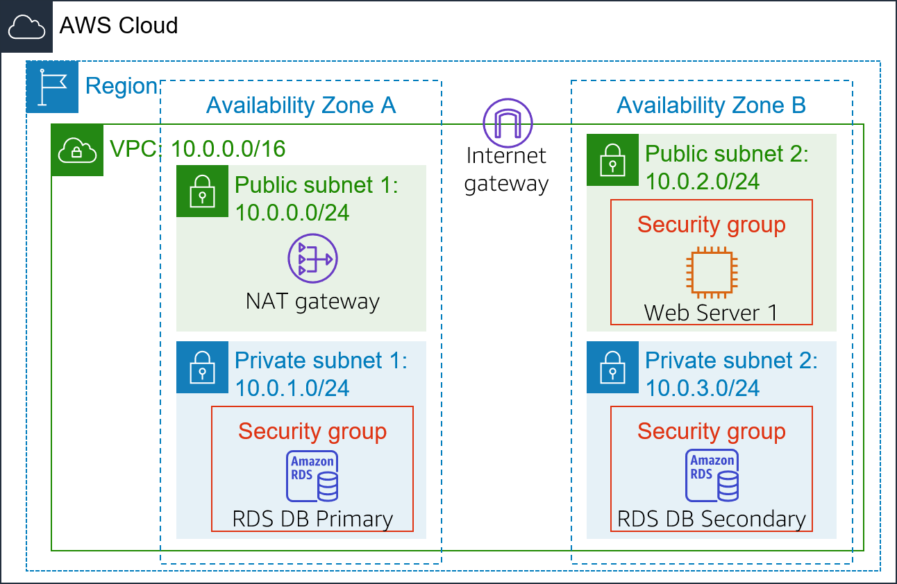

# Lab 6: Scaling and Load Balancing Your Architecture

<!-- Note to translators: This is based on Technical Essentials Lab 3. Copy the translation from there. Do not re-translate the whole document. -->

**Version 4.6.6 (TESS3) + custom change**

This lab walks you through using Elastic Load Balancing and Amazon EC2 Auto Scaling to load balance and automatically scale your infrastructure. This lab is based on the AWS Command Line Interface (AWS CLI). Feel free to explore the [AWS CLI documentation](https://awscli.amazonaws.com/v2/documentation/api/latest/reference/index.html) as you work through the lab.

*Elastic Load Balancing* automatically distributes incoming application traffic across multiple Amazon Elastic Compute Cloud (Amazon EC2) instances. It enables you to achieve fault tolerance in your applications by providing the required amount of load balancing capacity that is needed to route application traffic.

*Amazon EC2 Auto Scaling* helps your application maintain availability. It enables you to scale your Amazon EC2 capacity out or in automatically, according to conditions you define. You can use Amazon EC2 Auto Scaling to help ensure that you are running your desired number of EC2 instances. Amazon EC2 Auto Scaling can automatically increase the number of EC2 instances during demand spikes to maintain performance. It can also decrease capacity during lulls to reduce costs. Amazon EC2 Auto Scaling works well for applications that have stable demand patterns, or that experience hourly, daily, or weekly variability in usage.  


**Objectives**

After completing this lab, you should be able to:

- Create an Amazon Machine Image (AMI) from a running instance.
- Create a load balancer.
- Create a launch configuration and an Auto Scaling group.
- Automatically scale new instances in a private subnet
- Create Amazon CloudWatch alarms and monitor the performance of your infrastructure.


**Duration**

This lab takes approximately **45 minutes**.


**Scenario**

You start with the following infrastructure:
* A virtual private cloud (VPC) that's named *Lab VPC*. It consists of two public subnets and two private subnets that were created across two Availability Zones. 
* A Network Address Translation (NAT) gateway in a public subnet enables internet access for instances that are in the private subnet. 
* A sample web application that's named *Web Server 1*. It is hosted in a public subnet. 
* A highly available Amazon Relational Database Service (Amazon RDS) database instance is created in the two private subnets.




At the end of the lab, the infrastructure will consist of an Auto Scaling group of web servers that are distributed across the private subnets. The instances receive web traffic from an Application Load Balancer that is hosted in the public subnets.


## Launching your lab environment

1. At the top of these instructions, launch this lab by choosing <span id="ssb_voc_grey">Start Lab</span> 

   A **Start Lab** panel opens, and it displays the lab status.

2. Wait until you see the message *Lab status: ready*, then close the **Start Lab** panel by selecting the **X**.

   This lab launches an EC2 instance that's named *Bastion Host*. You will use this server to run AWS CLI commands to create lab resources.

3. Above these instructions, select the <span id="ssb_voc_grey">Details</span> dropdown menu, and then select <span id="ssb_voc_grey">Show</span>
  
    Copy all the lab details—such as *BastionHost*, *UserAccessSecretKey*, *Region*, and others—to a text file and save it as `Lab Details.txt`. 

    

**Note**: Make sure that you use a *text editor* (a program for editing text files) to save the file. Examples of text editors include [Atom](https://atom.io/), [Sublime Text](https://www.sublimetext.com/), or [Microsoft Visual Studio Code](https://code.visualstudio.com/).
    
In the lab, the information that you saved will be referred to as <u>*Lab Details*</u>.


## Using SSH to connect to the Bastion Host

### Microsoft Windows users

<i class="fas fa-comment"></i> These instructions are specifically for Microsoft Windows users. If you are using macOS or Linux, <a href="#ssh-MACLinux">skip to the next section</a>.
​

4. Above these instructions that you are currently reading, choose the <span id="ssb_voc_grey">Details</span> dropdown menu and then choose <span id="ssb_voc_grey">Show</span>
  
   A **Credentials** window opens.
   
5. Choose the **Download PPK** button and save the **labsuser.ppk** file.

    Typically, your browser will save the file to the **Downloads** directory.

6. Close the **Credentials** window by choosing the **X**.

7. From the Lab Details text file, note the IP address for the **Bastion Host**. 

8. Download **PuTTY** so that you can use SSH to connect to the EC2 instance. If you don't have PuTTY installed on your computer, <a href="https://the.earth.li/~sgtatham/putty/latest/w64/putty.exe">download it here</a>.

9.  Open **putty.exe**

10. Configure PuTTY timeout to keep the PuTTY session open for a longer period of time.
    * Choose **Connection**
    * Set **Seconds between keepalives** to `30`

11. Configure your PuTTY session:
    * Choose **Session**
    * **Host Name (or IP address):** Paste the *Public DNS or IPv4 address* of the *Bastion Host* instance that you noted earlier. 
    * Back in PuTTY, in the **Connection** list, expand <i class="far fa-plus-square"></i> **SSH**
    * Choose **Auth** *(don't expand it)*
    * Choose **Browse**
    * Browse to and select the **labsuser.ppk** file that you downloaded
    * Choose **Open** to select it
    * Choose **Open** again

12. To trust and connect to the host, choose **Yes**.

13. When prompted to **login as**, enter: `ec2-user`
  
    This action will connect you to the EC2 instance.

14. Windows users: <a href="#ssh-after"> Skip ahead to the next task.</a>

<a id='ssh-MACLinux'></a>


### macOS and Linux users

These instructions are specifically for macOS or Linux users. If you are a Windows user, <a href="#ssh-after">skip ahead to the next task.</a>

15. Above these instructions (that you are currently reading), choose the <span id="ssb_voc_grey">Details</span> dropdown menu and then choose <span id="ssb_voc_grey">Show</span> 

A **Credentials** window opens.

16. Choose the **Download PEM** button and save the **labsuser.pem** file.

17. Exit the **Credentials** window by choosing the **X**.

18. From the Lab Details text file, note the IP address for the **Bastion Host**. 

19. Open a terminal window, and change directory (by using `cd`) to the directory where the *labsuser.pem* file was downloaded.
  
    For example, if the *labsuser.pem* file was saved to your **Downloads** directory, run this command:

    ```bash
    cd ~/Downloads
    ```

20. Change the permissions on the key to be read-only by running this command:

    ```bash
    chmod 400 labsuser.pem
    ```

21. Run the following command (replace &lt;*bastion-ip-address*&gt; with the *BastionHost* address that you copied earlier). 

    ```bash
    ssh -i labsuser.pem ec2-user@<bastion-host-ip-address>
    ```

22. When you are prompted to allow the first connection to this remote SSH server, enter: `yes` 
  

Because you are using a key pair for authentication, you will not be prompted for a password.
​
<a id='ssh-after'></a>

&nbsp;

### Configuring the AWS CLI

You will use the information from the Lab Details text file that you created in the *Launch Your Lab Environment* task.

The *Bastion Host* instance has an instance profile that's called *EC2InstanceProfile* associated with it. This instance profile gives it the required permissions. 


23. In the terminal window, configure the AWS CLI.

    ```bash
    aws configure
    ```

24. At the prompts, enter the following information. For the access key, secret access key, and Region settings, use the values from the Lab Details text file.

  **Note**: Ensure that you copy and paste the correct user values from the Lab Details text file to these fields. 

  -  **AWS Access Key ID**: *AccessKey* value
  -  **AWS Secret Access Key**: *SecretKey* value
  -  **Default region name**:  Name of the Region (for example, `us-east-1` or `eu-west-2`)
  -  **Default output format**: `json`


## Task 1: Creating an AMI for Amazon EC2 Auto Scaling

In this task, you will create an AMI from the existing _Web Server 1_ instance. Doing so will save the contents of the boot disk so that new instances can be launched with identical content. You will start by setting up environment variables by querying the IDs of certain resources in the *Lab VPC*.

25. Query the *Web Server 1* instance ID in the terminal by running the following lines of code: 

    **Note:** You will not see output after you run these commands.

    ```bash
    # Query the instance ID for Web Server 1
    WebServer_ID=$(aws ec2 describe-instances \
    --filter 'Name=tag:Name,Values=Web Server 1' \
    --query "Reservations[0].Instances[*].[InstanceId]" --output text)
    ```

26. Next, query the *Lab VPC* ID:

    ```bash
    # Query the Lab VPC ID
    LabVPC_ID=$(aws ec2 describe-vpcs \
    --filters Name=tag:Name,Values='Lab VPC' \
    --query Vpcs[0].VpcId --output text)
    ```

27. Based on the *Lab VPC* ID, query the IDs of the public subnets and private subnets. 

    ```bash
    # Query the subnet IDs 
    PublicSubnet1_ID=$(aws ec2 describe-subnets \
    --filters Name=tag:Name,Values='Public Subnet 1' \
    --query Subnets[0].SubnetId --output text)
    PublicSubnet2_ID=$(aws ec2 describe-subnets --filters Name=tag:Name,Values='Public Subnet 2' --query Subnets[0].SubnetId --output text)
    PrivateSubnet1_ID=$(aws ec2 describe-subnets --filters Name=tag:Name,Values='Private Subnet 1' --query Subnets[0].SubnetId --output text)
    PrivateSubnet2_ID=$(aws ec2 describe-subnets --filters Name=tag:Name,Values='Private Subnet 2' --query Subnets[0].SubnetId --output text)
    ```

28. Query the *Web Security Group* ID:

    ```bash
    # Query the security group ID
    WebSecurityGroup_ID=$(aws ec2 describe-security-groups \
    --filters Name=tag:Name,Values='Web Security Group' \
    --query SecurityGroups[0].GroupId --output text)
    ```

29. You can view the values that you previously queried by running the following commands:

    ```bash
    # PRINTING QUERIED VALUES 
    echo && \
    echo && \
    echo **************************************** && \
    echo ************LAB RESOURCES*************** && \
    echo **************************************** && \
    echo Lab VPC ID: $LabVPC_ID && \
    echo Public Subnet 1 ID: $PublicSubnet1_ID && \
    echo Public Subnet 2 ID: $PublicSubnet2_ID && \
    echo Private Subnet 1 ID: $PrivateSubnet1_ID && \
    echo Private Subnet 2 ID: $PrivateSubnet2_ID && \
    echo Web Server 1 ID: $WebServer_ID && \
    echo Web security group ID: $WebSecurityGroup_ID
    ```

    Example output:

    > Lab VPC ID:                    vpc-08xxxxxxxxxxxxxxxb
    > Public Subnet 1 ID:       subnet-0cxxxxxxxxxxxxxxx11
    > Public Subnet 2 ID:       subnet-08xxxxxxxxxxxxxxx77
    > Private Subnet 1 ID:      subnet-02xxxxxxxxxxxxxxx31
    > Private Subnet 2 ID:      subnet-0dxxxxxxxxxxxxxxxdf
    > Web server ID:                i-0dXXXXXxxxxxxx50
    > Web security group ID: sg-05xxxxxxxxxxxxxxx8
    
    Note the queried values and save them to the Lab Details.txt file.

    Before you create an AMI, you must ensure that *Web Server 1* and the sample application that was deployed in the lab environment have successfully completed. 

30. Run the following commands in your terminal. 
  
    **Note:** The first command can take some time to complete. It waits for the instance status to be *ok* before it proceeds.

    ```bash
    # Wait for the instance status to be ok
    aws ec2 wait instance-status-ok --instance-ids $WebServer_ID
    
    # Describe the properties of the instance 
    aws ec2 describe-instance-status --instance-ids $WebServer_ID
    ```

    Example output:

    > {
    >  "InstanceStatuses": [
    >      {
    >          "AvailabilityZone": "ap-southeast-2a",
    >          "InstanceId": " i-0dXXXXXxxxxxxx50",
    >          "InstanceState": {
    >              "Code": 16,
    >              "Name": "running"
    >          },
    >          "InstanceStatus": {
    >              "Details": [
    >                  {
    >                      "Name": "reachability",
    >                      "Status": "passed"
    >                  }
    >              ],
    >              **"Status": "ok"**
    >          },
    >          "SystemStatus": {
    >              "Details": [
    >                  {
    >                      "Name": "reachability",
    >                      "Status": "passed"
    >                  }
    >              ],
    >              **"Status": "ok"**
    >          }
    >      }
    >  ]
    > }
    
    **Note**: Before you proceed to the next step, ensure that the **Status** value for both **InstanceStatus** and **SystemStatus** values is *ok*.
    
31. Create an AMI by referring to the **InstanceID** value for *Web Server 1*:

      ```bash
      # Create the AMI
      WebServer_AMI=$(aws ec2 create-image \
      --instance-id $WebServer_ID \
      --name 'Web Server AMI' \
      --description 'Lab AMI for Web Server' \
      --query "ImageId" --output text)
      
      # Print the AMI ID
      echo $WebServer_AMI
      ```

      The confirmation screen outputs the **AMI ID** for your new AMI. Note the queried value and save them to the Lab Details text file.


## Task 2: Creating a load balancer

In this task, you will create an Application Load Balancer that can balance traffic across multiple EC2 instances and Availability Zones.

You will use an _Application Load Balancer_ that operates at the request level (layer 7). It routes traffic to targets (EC2 instances, containers, IP addresses, and Lambda functions) based on the content of the request. For more information, refer to <a href="https://aws.amazon.com/elasticloadbalancing/features/#compare" target="_blank">Comparison of Load Balancers</a>.

You will use both of the public subnets to scale the Application Load Balancer, which configures the load balancer to operate across multiple Availability Zones. It will also enable internet access so that web traffic can be served over the internet. 

32. In the terminal, create the Application Load Balancer and query its Amazon Resource Name (ARN) by running the following command:
	
	```bash
	# Create an Application Load Balancer and query its ARN
	LabELB_ARN=$(aws elbv2 create-load-balancer \
	--name LabELB \
	--subnets $PublicSubnet1_ID $PublicSubnet2_ID \
	--security-groups $WebSecurityGroup_ID \
	--tags Key=Name,Value=LabELB \
	--query LoadBalancers[0].LoadBalancerArn --output text)
	```

The load balancer will now start _provisioning_, and it has a *Name* tag with a value of *LabELB*. You don't need to wait until it is ready. You can continue with the next task.
    
33. Query the Domain Name System (DNS) Canonical Name (CNAME) record for the Application Load Balancer. This value is represented in the command as *LabELB DNS(CNAME)*, and you will use it to browse the web application later in the lab. 

    ```bash
    # Query the DNS CNAME record for the Application Load Balancer 
    LabELB_DNS=$(aws elbv2 describe-load-balancers \
    --load-balancer-arns $LabELB_ARN \
    --query LoadBalancers[0].DNSName --output text)
    ```

34. Configure routing by creating a _target group_ that will be used by Amazon EC2 Auto Scaling.

    Routing configures where to send requests that are sent to the load balancer. 

    ```bash
    # Create a target group for the Application Load Balancer
    LabELB_TG=$(aws elbv2 create-target-group \
    --name LabGroup \
    --protocol HTTP --port 80 \
    --vpc-id $LabVPC_ID \
    --query TargetGroups[0].TargetGroupArn --output text)
    ```

    Amazon EC2 Auto Scaling will automatically register instances as targets later in the lab.
    
    Before you start using the Application Load Balancer, you must add one or more *listeners*. A listener is a process that checks for connection requests, and it uses the protocol and port that you configure. The rules that you define for a listener determine how the load balancer routes requests to its registered targets.

35. Create listeners by running the following command:

    ```bash
    # Create listeners for the Application Load Balancer
    LabELB_Listener=$(aws elbv2 create-listener \
    --load-balancer-arn $LabELB_ARN \
    --protocol HTTP --port 80  \
    --default-actions Type=forward,TargetGroupArn=$LabELB_TG \
    --query Listeners[0].ListenerArn --output text)
    ```

36. Display the details of the Application Load Balancer by running the following commands:

    ```bash
    # Print the details of the Application Load Balancer
    echo && \
    echo && \
    echo **************************************** && \
    echo ******* LOAD BALANCER RESOURCES ******** && \
    echo **************************************** && \
    echo LabELB ARN is: $LabELB_ARN && \
    echo LabELB DNS is: $LabELB_DNS && \
    echo LabELB Target Group is: $LabELB_TG && \
    echo LabELB Listener is: $LabELB_Listener
	```

    Example output:
    
    > ************************************************************************************************
    >
    > ************************************************************************************************ALB RESOURCES***************************************************************************************
    >
    > ****************************************
    >
    > LabELB ARN is: arn:aws:elasticloadbalancing:ap-southeast-2:012345678910:loadbalancer/app/LabELB/6exxxxxxxxxxxx3f85
    >
    > LabELB DNS is: LabELB-8xxxxxxxx9.ap-southeast-2.elb.amazonaws.com
    >
    > LabELB Target Group is: arn:aws:elasticloadbalancing:ap-southeast-2:012345678910:targetgroup/LabGroup/5dxxxxxxxxxxxxxxxa6
    >
    > LabELB Listener is: arn:aws:elasticloadbalancing:ap-southeast-2:012345678910:listener/app/LabELB/exxxxxxxxxxxx3f85/44xxxxxxxxxxxxxxxx77

37. Note the queried values and save them to the Lab Details text file.


## Task 3: Creating a launch configuration and an Auto Scaling group

In this task, you will create a _launch configuration_ for your Auto Scaling group. A launch configuration is a template that an Auto Scaling group uses to launch EC2 instances. When you create a launch configuration, you specify information for the instances such as the AMI, the instance type, a key pair, security group, and disks.


The launch configuration uses the *Web Server 1 AMI* that you created in Task 1. You will also configure the launch configuration to use the _Web security group_ that was created for you. The *Web security group* enables web access.


38. In the terminal, create a launch configuration that's named *Lab Config* by entering the following command:

    **Note:** If you launched the lab environment in the *us-east-1 Region*, select the **t2.micro** instance type. To find the Region that you are using, refer to your Lab Details text file. 

    ```bash
    # Create a launch configuration
    aws autoscaling create-launch-configuration \
    --launch-configuration-name LabConfig \
    --image-id $WebServer_AMI \
    --instance-type t3.micro \
    --instance-monitoring Enabled=true \
    --key-name vockey \
    --security-groups $WebSecurityGroup_ID
    ```

39. Create an Auto Scaling group that uses the *Lab Config* launch configuration by entering the following command: 

    ```bash
    # Create an Auto Scaling group
    aws autoscaling create-auto-scaling-group \
    --auto-scaling-group-name 'Lab Auto Scaling Group' \
    --launch-configuration-name LabConfig \
    --min-size 2 --max-size 6 \
    --vpc-zone-identifier $PrivateSubnet1_ID,$PrivateSubnet2_ID \
    --target-group-arns $LabELB_TG \
    --tags "Key=Name,Value='Lab Instance'"
    ```

    The Auto Scaling group starts with two instances. It can scale up to six instances, if required. The Auto Scaling group will use _Private Subnet 1 (10.0.1.0/24)_ and _Private Subnet 2 (10.0.3.0/24)_. It will also receive traffic from the *LabGroup* target group that is linked to the *LabELB* Application Load Balancer. Additionally, all instances in the Auto Scaling group will be tagged as *Lab Instance*. 
  
    When you create a launch configuration through the AWS CLI, detailed monitoring is enabled by default. This feature captures metrics at 1-minute intervals, and it enables Amazon EC2 Auto Scaling to react quickly to changing usage patterns.

    Next, you will create an Auto Scaling policy that can scale the *Lab Auto Scaling Group*.

40. Create a configuration file, which is required for the policy. To create the configuration file in the GNU Nano text editor, enter the following command and press ENTER:

    ```bash
    # Create a configuration for the Auto Scaling policy
    nano labASG.json
    ```

41. Copy the following code and in your terminal window, paste the code. 

    ```json
    {
      "TargetValue": 60.0,
      "PredefinedMetricSpecification": {
        "PredefinedMetricType": "ASGAverageCPUUtilization"
      }
    }
    ```

    This configuration indicates that the *TargetValue* of 60 percent applies to the *ASGAverageCPUUtilization* Amazon CloudWatch metric. It tells Amazon EC2 Auto Scaling to maintain an _average_ CPU utilization _across all instances_ at 60 percent. Amazon EC2 Auto Scaling will add or remove capacity automatically to keep the metric at (or close to) the specified target value. It adjusts to changes in the metric because of fluctuating load patterns. This file will make more sense when you create an Auto Scaling policy.

42. Press CTRL+X. To save and exit the file, enter `Y` and press ENTER.

43. You will now create an Auto Scaling policy. It is linked to the *Lab Auto Scaling Group*, and it is based on the labASG.json file. Enter the following command:

    ```bash
    # Create the Auto Scaling policy
    aws autoscaling put-scaling-policy \
    --policy-name 'Lab Scaling 60' \
    --auto-scaling-group-name 'Lab Auto Scaling Group' \
    --policy-type TargetTrackingScaling \
    --target-tracking-configuration file://labASG.json
    ```

    With *target tracking scaling policies*, you select a scaling metric and set a target value. Amazon EC2 Auto Scaling creates and manages the CloudWatch alarms. The alarms trigger the scaling policy and calculate the scaling adjustment based on the metric and the target value. The scaling policy adds or removes capacity as required to keep the metric at (or close to) the specified target value. 

    In addition to keeping the metric close to the target value, a target tracking scaling policy also adjusts to changes in the metric that result from changing load patterns.

    Your Auto Scaling group will slowly reach the **Desired** count of *two instances*.

    


## Task 4: Verifying that the load balancer works

In this task, you will verify that the load balancer works correctly.

44. Verify that the new instances were launched as part of your Auto Scaling group by entering the following command:

    ```bash
    # Describe the instances created by the Auto Scaling group
    aws ec2 describe-instances \
    --filter "Name=tag:Name,Values='Lab Instance'" \
    --query "Reservations[*].Instances[*].[InstanceId, Tags]"
    ```

    Example output: 

    > [
    >
    > ​            "i-013xxxxxxxxxxxxxxxce",
    > ​                {
    > ​                    "Key": "aws:autoscaling:groupName",
    > ​                    "Value": "Lab Auto Scaling Group"
    > ​                },
    > ​                {
    > ​                    "Key": "Name",
    > ​                    "Value": "Lab Instance"
    > ​                }
    > ​    ],
    > ​    [
    >
    > ​            "i-04cxxxxxxxxxxxxxxxe",
    >
    > ​                {
    > ​                    "Key": "Name",
    > ​                    "Value": "Lab Instance"
    > ​                },
    > ​                {
    > ​                    "Key": "aws:autoscaling:groupName",
    > ​                    "Value": "Lab Auto Scaling Group"
    > ​                }
    > ​    ]

    

    You should see two new instances that are named *Lab Instance*. These instances were launched by Amazon EC2 Auto Scaling. If the instances or names are not listed, wait 30 seconds and try running the previous command again.

45. You can similarly check if the newly created *Lab Instance* instances are registered under the *LabGroup* Application Load Balancer target group. Enter the following command:

    ```bash
    # List the instances in the target group
    aws elbv2 describe-target-health \
    --target-group-arn $LabELB_TG
    ```

    Example output: 

    > {
    >  "TargetHealthDescriptions": [
    >      {
    >          "Target": {
    >              "Id": "i-013xxxxxxxxxxxxxxxce",
    >              "Port": 80
    >          },
    >          "HealthCheckPort": "80",
    >          "TargetHealth": {
    >              **"State": "healthy"**
    >          }
    >      },
    >      {
    >          "Target": {
    >              "Id": "i-04cxxxxxxxxxxxxxxxe",
    >              "Port": 80
    >          },
    >          "HealthCheckPort": "80",
    >          "TargetHealth": {
    >              **"State": "healthy"**
    >          }
    >      }
    >  ]
    > }
    
    *Healthy* indicates that an instance passed the load balancer's health check. This status means that the load balancer will send traffic to the instance. If the state is not *Healthy*, wait for a minute and try running the previous command again. 
    

**Note:** If the state remains not-healthy after 5 minutes, contact your educator to check if the web application was deployed successfully.
    
    You can now access the Auto Scaling group through the Application Load Balancer.

46. Verify that the Application Load Balancer can redirect web requests to the Amazon EC2 Auto Scaling *Lab Instances*. To complete the verification, you can either use a web browser or the AWS CLI.
  
    <u>Option 1:</u>
    
    If you can browse the internet, use a web browser to access the *LabELB DNS* address that you saved in the Lab Details text file. You can also use the `echo $LabELB_DNS` command to retrieve the DNS value for the Application Load Balancer.
    
    The application should open in your browser. If the application loads, the load balancer received the request, sent it to one of the EC2 instances, and then passed back the result.    
    
    <u>Option 2:</u>
    
    Alternatively, you can check the HTTP status code in through the AWS CLI by running the following command:
    
    ```bash
    # Verify that the Application Load Balancer is working
    curl -I $LabELB_DNS
    ```
    
    Example output:
    > **HTTP/1.1 200 OK**
    > Date: Sat, 13 Jun 2020 11:12:18 GMT
    > Content-Type: text/html; charset=UTF-8
    > Connection: keep-alive
    > Server: Apache/2.2.34 (Amazon)
    > X-Powered-By: PHP/5.3.29
    > Cache-Control: no-cache, must-revalidate
    > Expires: Sat, 26 Jul 1997 05:00:00 GMT
    
    The following table describes the status of common HTTP status codes. Source: [MDN Web Docs](https://developer.mozilla.org/en-US/docs/Web/HTTP/Status).
    
| HTTP Code | Status                                                       |
| --------- | ------------------------------------------------------------ |
| 100       | An interim response that indicates that everything is ok, and the client should continue the request.                |
| 200       | The request has succeeded.          |
| 300       | The request has more than one possible response, and the user should choose a response. |
| 400       | The server couldn't understand the request because of invalid syntax.      |
| 404       | The server cannot find the requested resource. |
| 500       | The server encountered a situation that it doesn't know how to handle.     |


    The example output (*200 OK*) indicates that the load balancer received the request. It sent the request to one of the EC2 instances, and then passed back the result.    


## Task 5: Testing Amazon EC2 Auto Scaling

You created an Auto Scaling group with a minimum of two instances and a maximum of six instances. Currently, two instances are running because the minimum size is two and the group is currently not under any load. You will now increase the load, which will cause Amazon EC2 Auto Scaling to add more instances.

47. The *Lab Scaling 60* Auto Scaling policy created two Amazon CloudWatch alarms to scale the Auto Scaling group. You can list the alarms by running these commands:

    ```bash
    # Query the Auto Scaling policy high alarm
    aws autoscaling describe-policies \
    --auto-scaling-group-name 'Lab Auto Scaling Group' \
    --query "ScalingPolicies[*].Alarms[0].AlarmName"
    
    # Query the Auto Scaling policy low alarm
    aws autoscaling describe-policies \
    --auto-scaling-group-name 'Lab Auto Scaling Group' \
    --query "ScalingPolicies[*].Alarms[1].AlarmName"
    ```
    
    Example output:

    > [
    >  "TargetTracking-Lab Auto Scaling Group-**AlarmHigh**-5xxxxxxxxxxxc"
    > ]
    > [
    >  "TargetTracking-Lab Auto Scaling Group-**AlarmLow**-4xxxxxxxxxxxx6"
    > ]

48. Describe the status of the Amazon CloudWatch alarms that were created by Amazon EC2 Auto Scaling.
  
    ```bash
    # Query the alarm status
    aws cloudwatch describe-alarms \
    --alarm-name-prefix "TargetTracking" \
    --query "MetricAlarms[*].[AlarmName,StateValue]" \
    --output table
    ```

    Example output:</u>

    > +-------------------------------------------------------------------------------------------------+
    > |                                         DescribeAlarms                                                                               |
    > +--------------------------------------------------------------------------------+----------------+
    > |  TargetTracking-Lab Auto Scaling Group-AlarmHigh-5xxxxxxxxxxxc    |  OK                  |
    > |  TargetTracking-Lab Auto Scaling Group-AlarmLow-4xxxxxxxxxxxx6   |  ALARM          |
    > +--------------------------------------------------------------------------------+----------------+
    
    Two alarms will display. These alarms were created automatically by the Auto Scaling group. They will keep the average CPU load close to 60 percent automatically, while also staying within the limit of two to six instances.

    <i class="fas fa-comment"></i> If the alarm that contains _AlarmHigh_ does not show *OK*, wait a minute and then retry the `describe-alarms` command.

    The *OK* status indicates that the alarm has _not_ been triggered. It is the alarm for **CPU Utilization > 60**, which will add instances when the average CPU is high. 

    You will now tell the application to perform calculations that should raise the CPU level.

49. To add CPU load to the web application, you can either use a web browser or use the terminal.

    <u>Option 1:</u>

    If you can browse the internet, use a web browser to access the *LabELB DNS* address. (You saved this information in the Lab Details text file.) You can also retrieve the DNS value of the Application Load Balancer by using the `echo $LabELB_DNS` command.

    Next to the AWS logo, choose **Load Test**. This action will cause the application to generate high loads. The browser page will refresh automatically so that all instances in the Auto Scaling group will generate load. Do not close this tab. 

    **Note**: You may need to run the **Load Test** in two browser windows to trigger the alarm.

    <u>Option 2:</u>
    
    Alternatively, you can check the HTTP status code using the terminal window by running the below command.

    ```bash
    # Add CPU stress to the web application
    curl -I $LabELB_DNS/load.php
    wget $LabELB_DNS/load.php
    ```
    
    Example output:
    
    > **HTTP/1.1 200 OK**
    > Date: Sun, 14 Jun 2020 01:24:58 GMT
    > Content-Type: text/html; charset=UTF-8
    > Connection: keep-alive
    > Server: Apache/2.2.34 (Amazon)
    > X-Powered-By: PHP/5.3.29
    > Set-Cookie: PHPSESSID=rkh5xxxxxxxxxxxxxul1; path=/
    > Expires: Thu, 19 Nov 1981 08:52:00 GMT
    > Cache-Control: no-store, no-cache, must-revalidate, post-check=0, pre-check=0
    > Pragma: no-cache
    >
    > --2020-06-14 04:12:23--  http://labelb-47xxxxx5.ap-southeast-2.elb.amazonaws.com/load.php
    > Resolving labelb-47xxxxx5.ap-southeast-2.elb.amazonaws.com (labelb-47xxxxx5.ap-southeast-2.elb.amazonaws.com)... 1.2.3.4, 5.6.7.8
    > Connecting to labelb-47xxxxx5.ap-southeast-2.elb.amazonaws.com (labelb-47xxxxx5.ap-southeast-2.elb.amazonaws.com)|1.2.3.4|:80... connected.
    > **HTTP request sent, awaiting response... 200 OK**
    > Length: 1141 (1.1K) [text/html]
    > Saving to: ‘load.php’
    >
    > 100%[=========================================================================>] 1,141       --.-K/s   in 0s
    >
    > 2020-06-14 04:12:25 (120 MB/s) - ‘load.php’ saved [1141/1141]
    
    **Note**: Run the previous command a few times to add stress to your web application.


50. Check the status of the alarms again. Enter the following command every minute or so. 

    ```bash
    # Query the alarm status
    aws cloudwatch describe-alarms \
    --alarm-name-prefix "TargetTracking" \
    --query "MetricAlarms[*].[AlarmName,StateValue]" \
    --output table
    ```

    Example output:

    > +-------------------------------------------------------------------------------------------------+
    > |                                         DescribeAlarms                                                                               |
    > +--------------------------------------------------------------------------------+----------------+
    > |  TargetTracking-Lab Auto Scaling Group-AlarmHigh-5xxxxxxxxxxxc    |  ALARM           |
    > |  TargetTracking-Lab Auto Scaling Group-AlarmLow-4xxxxxxxxxxxx6   |  OK                  |
    > +--------------------------------------------------------------------------------+----------------+
    
    At first, the status of *AlarmLow* will change to *OK*, while the status of *AlarmHigh* will remain at *OK*. 
    
    Subsequently, after a few retries, the status of *AlarmHigh* should change to *ALARM*, and the status of *AlarmLow* should remain at *OK*. This situation indicates an increasing CPU percentage. After it crosses the 60 percent threshold for more than 3 minutes, it will trigger Amazon EC2 Auto Scaling to add additional instances.
    
    [//]: # "I also got INSUFFICIENT DATA as a status for the low alarm!"


​    

51. Verify that a new instance was created by running the following command:

    ```bash
    # List the instances in the target group
    aws elbv2 describe-target-health \
    --target-group-arn $LabELB_TG
    ```

    Example output:

    > {
    >  "TargetHealthDescriptions": [
    >      {
    >          "Target": {
    >              "Id": "i-013xxxxxxxxxxxxxxxce",
    >              "Port": 80
    >          },
    >          "HealthCheckPort": "80",
    >          "TargetHealth": {
    >              "State": "healthy"
    >          }
    >      },
    >      {
    >          "Target": {
    >              "Id": "i-04cxxxxxxxxxxxxxxxe",
    >              "Port": 80
    >          },
    >          "HealthCheckPort": "80",
    >          "TargetHealth": {
    >              "State": "healthy"
    >          }
    >      },
    >      {
    >          "Target": {
    >              "Id": "i-08cxxxxxxxxxxxxxxxe",
    >              "Port": 80
    >          },
    >          "HealthCheckPort": "80",
    >          "TargetHealth": {
    >              "State": "healthy"
    >          }
    >      }
    >  ]
    > }

    More than two instances that are labeled **Lab Instance** should be running. The new instances were created by Amazon EC2 Auto Scaling in response to the alarm.


## Task 6: Terminating the Web Server 1 instance

In this task, you will terminate the _Web Server 1_ instance. You used this instance to create the AMI that was used by your Auto Scaling group. However, it is no longer needed.

52. In the terminal, terminate *Web Server 1* by running the following command:

    ```bash
    # Terminate Web Server 1
    aws ec2 terminate-instances \
    --instance-ids $WebServer_ID
    ```

    

## Lab complete

<i class="icon-flag-checkered"></i> Congratulations! You have completed the lab.

53. To confirm that you want to end the lab, at the top of this page, choose <span id="ssb_voc_grey">End Lab</span> and then choose <span id="ssb_blue">Yes</span>

   A panel should appear with this message: *DELETE has been initiated... You may close this message box now.*
   ​
54. To close the panel, choose the **X** in the top-right corner.
    ​
    ​
*©2021 Amazon Web Services, Inc. and its affiliates. All rights reserved. This work may not be reproduced or redistributed, in whole or in part, without prior written permission from Amazon Web Services, Inc. Commercial copying, lending, or selling is prohibited.*