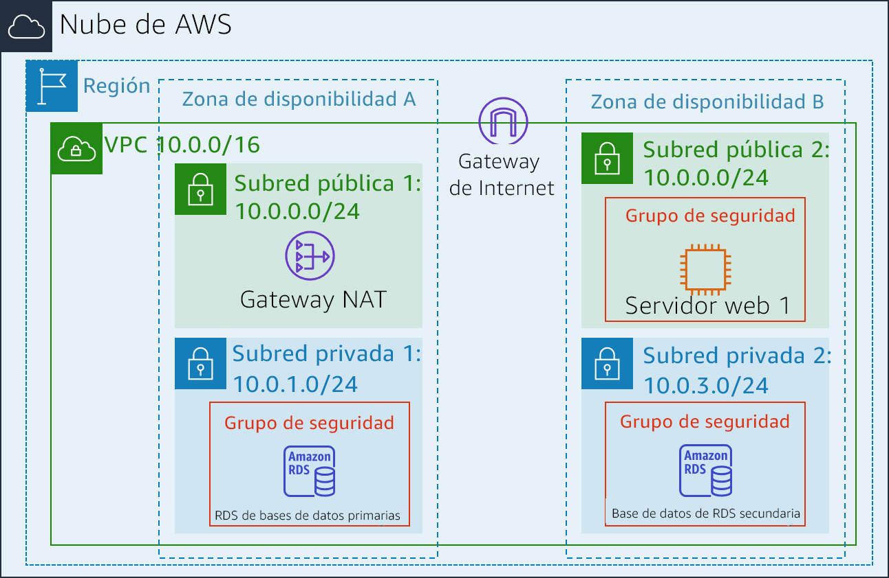
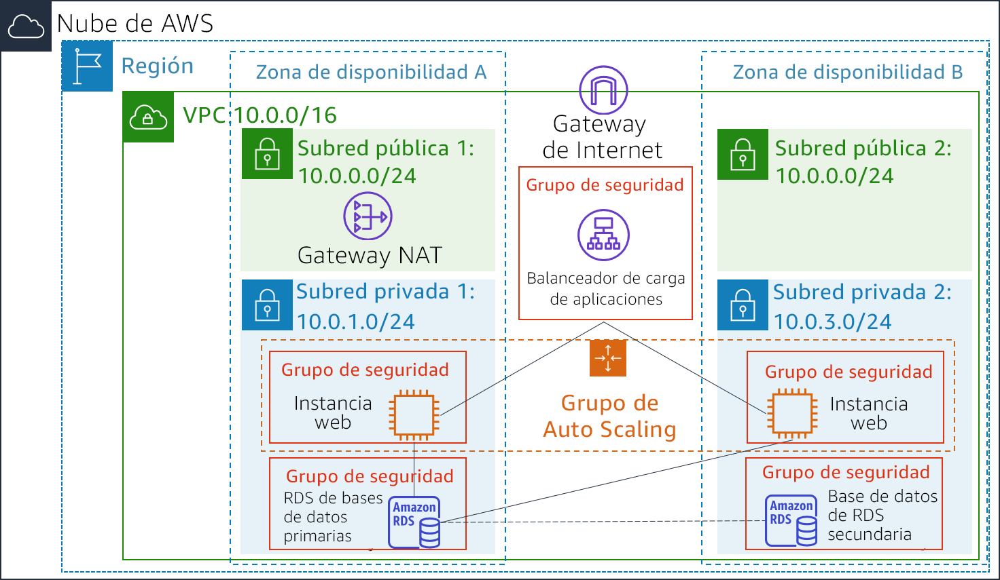

<header>
    <link rel="stylesheet" href="https://use.fontawesome.com/releases/v5.5.0/css/all.css" integrity="sha384-B4dIYHKNBt8Bc12p+WXckhzcICo0wtJAoU8YZTY5qE0Id1GSseTk6S+L3BlXeVIU" crossorigin="anonymous">
    <!-- Latest compiled and minified CSS -->
    <link rel="stylesheet" href="https://maxcdn.bootstrapcdn.com/bootstrap/3.3.7/css/bootstrap.min.css" integrity="sha384-BVYiiSIFeK1dGmJRAkycuHAHRg32OmUcww7on3RYdg4Va+PmSTsz/K68vbdEjh4u" crossorigin="anonymous">
    <!-- Optional theme -->
    <link rel="stylesheet" href="https://maxcdn.bootstrapcdn.com/bootstrap/3.3.7/css/bootstrap-theme.min.css" integrity="sha384-rHyoN1iRsVXV4nD0JutlnGaslCJuC7uwjduW9SVrLvRYooPp2bWYgmgJQIXwl/Sp" crossorigin="anonymous">
    <!-- Latest compiled and minified JavaScript -->
    
 </header>
 <!--include:Logo-->
 

# Laboratorio 6: Escalado y balanceo de carga para la arquitectura

<!-- Note to translators: This is based on Technical Essentials Lab 3. Copy the translation from there. Do not re-translate the whole document. -->

&nbsp;&nbsp;

**Versión 4.6.6 (TESS3) + cambio personalizado**

Este laboratorio le explica cómo usar los servicios de Elastic Load Balancing (ELB) y Auto Scaling para balancear la carga y escalar la infraestructura automáticamente.

**Elastic Load Balancing** distribuye automáticamente el tráfico entrante de las aplicaciones entre varias instancias de Amazon EC2 Además, le permite obtener tolerancia a errores en las aplicaciones, ya que proporciona de forma constante la capacidad de balanceo de carga necesaria para dirigir el tráfico de estas.

**Auto Scaling** permite mantener la disponibilidad de las aplicaciones y aumentar o reducir automáticamente la capacidad de Amazon EC2 según las condiciones que se definan. Puede utilizar Auto Scaling para asegurarse de que se ejecuta la cantidad deseada de instancias de Amazon EC2. Con Auto Scaling, también se puede aumentar automáticamente la cantidad de instancias de Amazon EC2 durante los picos de demanda para mantener el rendimiento y reducir la capacidad durante los períodos de baja demanda con el objeto de minimizar los costos. Auto Scaling es adecuado para aplicaciones con patrones de demanda estables o para aquellas cuyo uso varía cada hora, día o semana.

&nbsp;

**Objetivos**

Después de completar este laboratorio, podrá hacer lo siguiente:

- Crear una imagen de Amazon Machine (AMI) a partir de una instancia en ejecución
- Crear un balanceador de carga
- Crear una configuración de lanzamiento y un grupo de Auto Scaling
- Escalar automáticamente instancias nuevas dentro de una subred privada
- Crear alarmas de Amazon CloudWatch y monitorear el rendimiento de su infraestructura

&nbsp;

**Duración**

La duración estimada de este laboratorio es de **30 minutos** aproximadamente.

&nbsp;

**Situación**

Comenzará con la siguiente infraestructura:

&nbsp;

El estado final de la infraestructura es el siguiente:

&nbsp;

&nbsp;

&nbsp;
___
## Acceso a la consola de administración de AWS

1. En la parte superior de estas instrucciones, haga clic en Start Lab (Iniciar laboratorio) para lanzar su laboratorio.

   Se abrirá el panel “Start Lab” (Iniciar laboratorio), donde se muestra el estado del laboratorio.

2. Espere hasta que aparezca el mensaje “**Lab status: in creation**” (Estado del laboratorio: en creación) y, a continuación, haga clic en la **X** para cerrar el panel “Start Lab (Iniciar laboratorio)”.

   **Nota**: Es posible que el cambio del estado del laboratorio a “Listo” tarde 10 minutos o más.

3. En la parte superior de estas instrucciones, haga clic en AWS.

   La consola de administración de AWS se abrirá en una nueva pestaña del navegador. El sistema iniciará su sesión automáticamente.

   **Sugerencia**: Si no se abre una pestaña nueva del navegador, debería aparecer un banner o un icono en la parte superior de este, el cual indique que el navegador no permite que se abran ventanas emergentes en el sitio. Haga clic en el banner o en el icono, y elija “Allow pop ups” (Permitir ventanas emergentes).

4. Ubique la pestaña de la consola de administración de AWS en un lugar donde aparezca al lado de estas instrucciones. Idealmente, debería poder ver ambas pestañas del navegador al mismo tiempo para que sea más sencillo seguir los pasos del laboratorio.

&nbsp;
___
## Tarea 1: crear una AMI para Auto Scaling

En esta tarea, creará una AMI a partir del _Servidor web 1_ existente. Esto le permitirá guardar el contenido del disco de arranque para que se puedan lanzar instancias nuevas con contenido idéntico.

5. En la **consola de administración de AWS**, en el menú Services<i class="fas fa-angle-down"></i> (Servicios), haga clic en **EC2**.

6. En el panel de navegación de la izquierda, haga clic en **Instances** (Instancias).

   Primero, confirmará que la instancia esté en ejecución.

7. Espere hasta que en **Status Checks** (Comprobaciones de estado) del **Servidor web 1** se muestre el mensaje *2/2 checks passed* (2/2 comprobaciones aprobadas). Haga clic en “Refresh” (Actualizar) <i class="fas fa-sync"></i> para la actualización.

   Ahora, creará una AMI basada en esta instancia.

8. Seleccione <i class="far fa-check-square"></i> **Servidor web 1**.

9. En el menú Actions<i class="fas fa-angle-down"></i> (Acciones), haga clic en **Image** (Imagen) y en **Create Image** (Crear imagen) y, a continuación, configure lo siguiente:

   - **Image name** (Nombre de la imagen): `Web Server AMI (AMI del servidor web)`
   - **Image description** (Descripción de la imagen): `Lab AMI for Web Server (AMI de laboratorio para servidor web)`

10. Haga clic en Create Image (Crear imagen).

   En la pantalla de confirmación, se muestra **AMI ID** (ID de la AMI) de la AMI nueva.

11. Haga clic en Close (Cerrar).

   Utilizará esta AMI cuando lance el grupo de Auto Scaling más adelante en el laboratorio.

&nbsp;
___
## Tarea 2: crear un balanceador de carga

En esta tarea, creará un balanceador de carga para balancear el tráfico en varias instancias EC2 y zonas de disponibilidad.

12. En el panel de navegación izquierdo, haga clic en **Load Balancers** (Balanceadores de carga).

13. Haga clic en Create Load Balancer (Crear balanceador de carga).

   A continuación, se muestran diferentes tipos de balanceadores de carga. Utilizará un _balanceador de carga de aplicaciones_ que funciona a nivel de solicitud (capa 7). Este dirige el tráfico a los objetivos (instancias EC2, contenedores, direcciones IP y funciones de Lambda) según el contenido de la solicitud. Para obtener más información, consulte: <a href="https://aws.amazon.com/elasticloadbalancing/features/#compare" target="_blank">Comparación de balanceadores de carga</a>

14. En **Application Load Balancer** (Balanceador de carga de aplicaciones), haga clic en Create (Crear) y configure lo siguiente:

   - **Name** (Nombre): `LabELB`
   - **VPC:** _Lab VPC_ (en la sección **Availability Zones** [Zonas de disponibilidad])
   - **Availability Zones:** (Zonas de disponibilidad): seleccione <i class="far fa-check-square"></i> ambas para ver las subredes disponibles.
   - Seleccione **Public Subnet 1** (Subred pública 1) y **Public Subnet 2** (Subred pública 2).

   Esto configura el balanceador de carga para que funcione en varias zonas de disponibilidad.

15. Haga clic en Next: Configure Security Settings (Siguiente: definir la configuración de seguridad).

   <i class="fas fa-comment"></i> Puede ignorar la advertencia _“Improve your load balancer's security”_ (Mejore la seguridad del balanceador de carga).

16. Haga clic en Next: Configure Security Groups (Siguiente: configurar grupos de seguridad).

   Ya se creó un _Grupo de seguridad web_ que permite acceder mediante HTTP.

17. Seleccione <i class="far fa-check-square"></i> **Web Security Group** (Grupo de seguridad web) y anule la selección de <i class="far fa-square"></i> **predeterminada**.

18. Haga clic en Next: Configure Routing (Siguiente: configurar el direccionamiento).

   El direccionamiento configura el destino de las solicitudes enviadas al balanceador de carga. Creará un _grupo de destino_ que Auto Scaling utilizará.

19. En **Name** (Nombre), escriba: `LabGroup`.

20. Haga clic en Next: Register Targets (Siguiente: registrar objetivos).

   Más adelante en este laboratorio, Auto Scaling registrará automáticamente las instancias como objetivos.

21. Haga clic en Next: Review (Siguiente: revisar).

22. Haga clic en Create (Crear) y, posteriormente, en Close (Cerrar).

   En el balanceador de carga, se mostrará el estado de _aprovisionamiento_. No es necesario esperar hasta que esté listo. Continúe con la siguiente tarea.

&nbsp;
___
## Tarea 3: crear una configuración de lanzamiento y un grupo de Auto Scaling

En esta tarea, creará una _configuración de lanzamiento_ para el grupo de Auto Scaling. Una configuración de lanzamiento es una plantilla utilizada por un grupo de Auto Scaling para lanzar instancias EC2. Cuando se crea una configuración de lanzamiento, se especifica la información de las instancias, como la AMI, el tipo de instancia, un par de claves, un grupo de seguridad y los discos.

23. En el panel de navegación de la izquierda, haga clic en **Launch Configurations** (Configuraciones de lanzamiento).

24. Haga clic en Create launch configuration (Crear configuración de lanzamiento).

25. Configure los siguientes ajustes:

   - **Launch configuration name**  (Nombre de configuración de lanzamiento): `LabConfig`

   - **Imagen de Amazon Machine (AMI)** Elija *Web Server AMI*

   - **Instance type** (Tipo de instancia):

      - Elija Choose instance type (Elegir un tipo de instancia)
      - Seleccione *t3.micro*
      - Elija Choose (Elegir)

      **Nota:** Si ha iniciado el laboratorio en la región us-este--1, seleccione el tipo de instancia **t2.micro** . Para encontrar la región, busque en la esquina superior derecha de la consola de Amazon EC2.

      **Nota:** Si recibe el mensaje de error “Something went wrong. Please refresh and try again” (Algo salió mal. Actualice e inténtelo de nuevo), puede ignorarlo y continuar con el ejercicio.

   - **Configuración adicional**

      - **Monitoring** (Monitoreo): </i> seleccione <i class="far fa-check-square"></i> *Enable EC2 instance detailed monitoring within CloudWatch (Habilitar monitoreo detallado de instancia EC2 dentro de CloudWatch)*

      Esto permite que Auto Scaling reaccione rápidamente a los cambios en la utilización.

26. En **Security groups** (Grupos de seguridad), establecerá la configuración de lanzamiento para utilizar el _Grupo de seguridad web_ que ya se creó para usted.

   - Elija **Select an existing security group** (seleccione un grupo de seguridad existente)
   - Seleccione <i class="far fa-check-square"></i> **Grupo de seguridad web**

27. En **Key pair** (Par de claves) configure:

   - **Opciones de par de claves:** *Choose an existing key pair (Elegir un par de claves existente)*
   - **Par de claves existente:** vockey
   - Seleccione <i class="far fa-check-square"></i> **I acknowledge...** (Acepto...)
   - Haga clic en Create launch configuration (Crear configuración de lanzamiento).

   Ahora, creará un grupo de Auto Scaling que utilice esta configuración de lanzamiento.

28. Seleccione la casilla de verificación para *LabConfig* Launch Configuration.

29. En el menú Actions<i class="fas fa-caret-down"></i> (Acciones), elija el *Create Auto Scaling group* (Crear grupo de Auto Scaling)

30. Escriba el nombre del grupo de Auto Scaling:

   - **Name** (Nombre): `Lab Auto Scaling Group (Grupo de Auto Scaling del laboratorio)`

31. Elija Next (Siguiente)

32. En la página **Network** (Red), configure

   - **Network** (Red): _Lab VPC_

      <i class="fas fa-comment"></i> Puede ignorar el mensaje “No public IP address” (No hay una dirección IP pública).

   - **Subnet** (Subred): seleccione _Private Subnet 1 (10.0.1.0/24)_ **(Subred privada 1 [10.0.1.0/24]) y** _Private Subnet 2 (10.0.3.0/24) (Subred privada 2 [10.0.3.0/24])_

   Esto lanzará las instancias EC2 en subredes privadas en ambas zonas de disponibilidad.

33. Elija Next (Siguiente)

34. En **Load balancing** (Equilibrio de cargas):

   - Seleccione <i class="far fa-check-square"></i> **Enable load balancing** (Habilitar el equilibrio de carga)
   - Elija el **Application Load Balancer** (Equilibrador de carga de aplicaciones) o **Network Load Balancer** (Equilibrador de carga de red)
   - **Elija un grupo de destino para su equilibrador de carga:** LabGroup

35. En **Additional settings** (Configuración adicional), seleccione <i class="far fa-check-square"></i> **Activar la recopilación de métricas de grupo en CloudWatch**

   De este modo, se capturarán métricas en intervalos de 1 minuto, lo que permite que Auto Scaling reaccione rápidamente a los patrones cambiantes de uso.

36. Elija Next (Siguiente)

37. En **Group Size** (Tamaño de grupo), configure lo siguiente:

   - **Desired capacity** (Capacidad deseada): 2
   - **Minimum capacity** (Capacidad mínima): 2
   - **Maximum capacity** (Capacidad máxima): 6

   Esto permite que Auto Scaling agregue o elimine instancias automáticamente, y siempre mantenga entre 2 y 6 instancias en ejecución.

38. En **Scaling policies** (Políticas de escalado), elija *Target tracking scaling policy (Políticas de escalado de seguimiento de destino)* y configure:

   - **Lab policy name** (Nombre de directiva de laboratorio): `LabScalingPolicy`
   - **Metric type** (Tipo de métrica): _Average CPU Utilization_ (Uso promedio de CPU)
   - **Target value** (Valor objetivo): `60`

   De este modo, se le indica a Auto Scaling que se debe mantener un uso _promedio_ de la CPU del 60 % _en todas las instancias_. Auto Scaling aumenta o reduce automáticamente la capacidad según sea necesario para mantener la métrica en el valor objetivo especificado o en un valor próximo. Se ajusta a las fluctuaciones de la métrica debido a un patrón de carga fluctuante.

39. Elija Next (Siguiente)

   Auto Scaling puede enviar una notificación cuando se produce un evento de escalado. Deberá utilizar los valores predeterminados.

40. Elija Next (Siguiente)

   Las etiquetas que se apliquen al grupo de Auto Scaling se propagarán automáticamente a las instancias que se lancen.

41. Elija Add tag (Agregar etiqueta) y configure lo siguiente:

   - **Key** (Clave): `Name (Nombre)`
   - **Value** (Valor): `Lab Instance` (Instancia de laboratorio)

42. Haga clic en Next (Siguiente).

43. Revise los detalles del grupo de Auto Scaling y, a continuación, haga clic en Create Auto Scaling group (Crear grupo de Auto Scaling). Si aparece el mensaje de error **Failed to create Auto Scaling group** (No se pudo crear el grupo de Auto Scaling), haga clic en Retry Failed Tasks (Reintentar tareas con errores).

   En el grupo de Auto Scaling, al principio, se mostrará un recuento de instancias de cero, pero se lanzarán instancias nuevas para alcanzar el recuento **esperado** de 2 instancias.

&nbsp;
___
## Tarea 4: verificar el funcionamiento del balanceo de carga

En esta tarea, comprobará el funcionamiento correcto del balanceo de carga.

44. En el panel de navegación de la izquierda, haga clic en **Instances** (Instancias).

   Debería ver dos instancias nuevas denominadas **Lab Instance** (Instancia de laboratorio). Estas fueron lanzadas por Auto Scaling.

   <i class="fas fa-comment"></i> Si no se muestran las instancias o los nombres, espere 30 segundos y haga clic en “Refresh” (Actualizar) <i class="fas fa-sync"></i> en la esquina superior derecha.

   Primero, asegúrese de que las nuevas instancias hayan superado la comprobación de estado.

45. En el panel de navegación izquierdo, haga clic en **Target Groups** (Grupos de destino) de la sección _Load Balancing_ (Balanceo de carga).

46. Elegir *LabGroup*

47. Haga clic en la pestaña **Targets** (Destinos).

   A continuación, se mostrarán dos objetivos de instancias **Lab Instance** (Instancia de laboratorio) para este grupo de destino.

48. Espere a que el **Estado** de ambas instancias cambie a *healthy* (buen estado). Haga clic en “Refresh” <i class="fas fa-sync"></i> (Actualizar), en la esquina superior derecha para verificar si hay actualizaciones.

   Si el estado de una instancia es _Healthy_ (buen estado), significa que ha superado la comprobación de estado del balanceador de carga. Esto quiere decir que el balanceador de carga enviará tráfico a la instancia.

   Ahora, puede acceder al grupo de Auto Scaling mediante el balanceador de carga.

49. En el panel de navegación izquierdo, haga clic en **Load Balancers** (Balanceadores de carga).

50. En el panel inferior, copie el valor de **DNS name** (nombre DNS) del balanceador de carga y asegúrese de omitir “(A Record)” (Registro A).

   Debería ser similar a _LabELB-1998580470.us-west-2.elb.amazonaws.com_.

51. Abra una nueva pestaña en el navegador web, pegue el nombre DNS que acaba de copiar y presione “Enter” (Intro).

   La aplicación debe aparecer en el navegador. Esto indica que el balanceador de carga recibió la solicitud, la envió a una de las instancias EC2 y arrojó el resultado.

&nbsp;
___
## Tarea 5: realizar pruebas de Auto Scaling

Ha creado un grupo de Auto Scaling con un mínimo de dos instancias y un máximo de seis. Actualmente, hay dos instancias en ejecución porque ese es el tamaño mínimo, y el grupo no está sujeto a una carga. Ahora, aumentará la carga para que Auto Scaling agregue instancias adicionales.

52. Regrese a la consola de administración de AWS, pero no cierre la pestaña de la aplicación, ya que pronto tendrá que volver a ella.

53. En el menú Services <i class="fas fa-angle-down"></i> (Servicios), haga clic en **CloudWatch**.

54. En el panel de navegación izquierdo, haga clic en **Alarms** (Alarmas) (*no* en **ALARMA**).

   Se mostrarán dos alarmas. El grupo de Auto Scaling creó estas alarmas automáticamente. De la misma manera, dichas alarmas mantendrán la carga promedio de la CPU cerca del 60 % y, al mismo tiempo, respetarán la limitación de tener entre dos y seis instancias.

   ​    <i class="fas fa-exclamation-triangle" style="color:red"></i> **Nota**: Siga estos pasos solo si no ve las alarmas en 60 segundos.

   - En el menú Services (Servicios), <i class="fas fa-angle-down"></i> haga clic en **EC2**.
   - En el panel de navegación izquierdo, haga clic en **Auto Scaling Groups** (Grupos de Auto Scaling) y, a continuación, en **Scaling Policies** (Políticas de escalado).
   - Haga clic en Actions (Acciones) y en **Edit** (Editar).
   - Cambie el **valor objetivo** a `50`.
   - Haga clic en Save (Guardar).
   - En el menú Services<i class="fas fa-angle-down"></i> (Servicios), haga clic en **CloudWatch**.
   - En el panel de navegación izquierdo, haga clic en **Alarms** (Alarmas) (*no* en **ALARMA**) y verifique que ve dos alarmas.

55. Haga clic en la alarma **OK**, que en su nombre contiene _AlarmHigh_ (Alarma Alta).

   <i class="fas fa-comment"></i> Si en ninguna alarma aparece **OK**, espere un minuto y haga clic en “Refresh” <i class="fas fa-sync"></i> (Actualizar), en la esquina superior derecha, hasta que cambie el estado de la alarma.

   **OK** indica que la alarma _no_ se ha activado. Se trata de la alarma para **CPU Utilization > 60** (Uso de CPU > 60), que agrega instancias cuando el uso promedio de CPU es alto. En este momento, el gráfico debería mostrar niveles muy bajos de uso de CPU.

   Ahora, le indicará a la aplicación que realice cálculos que deberían aumentar el nivel de uso de CPU.

56. Regrese a la pestaña del navegador donde está la aplicación web.

57. Haga clic en **Load Test** (Prueba de carga) junto al logotipo de AWS.

   Esto hará que la aplicación genere cargas elevadas. La página del navegador se actualizará automáticamente y todas las instancias del grupo de Auto Scaling producirán carga. No cierre esta pestaña.

58. Regrese a la pestaña del navegador con la consola de **CloudWatch**.

   En menos de 5 minutos, la alarma **AlarmLow** (Alarma baja) debería cambiar a **OK** y el estado de la alarma **AlarmHigh** (Alarma alta) debería cambiar a *ALARM* (ALARMA).

   <i class="fas fa-comment"></i> Puede hacer clic en “Refresh” (Actualizar) <i class="fas fa-sync"></i> en la parte superior derecha cada 60 segundos para actualizar la pantalla.

   En el gráfico **AlarmHigh** (Alarma alta), debería indicarse un aumento del porcentaje de utilización de la CPU. Cuando se atraviese la línea de 60 % por más de 3 minutos, Auto Scaling agregará más instancias.

59. Espere hasta que la alarma **AlarmHigh** (Alarma alta) se encuentre en estado _ALARM_ (ALARMA).

   Ahora puede ver las instancias adicionales que se lanzaron.

60. En el menú Services<i class="fas fa-angle-down"></i> (Servicios),  haga clic en **EC2**.

61. En el panel de navegación de la izquierda, haga clic en **Instances** (Instancias).

   Debería haber más de dos instancias etiquetadas como **Lab Instance** (Instancia de laboratorio) en ejecución en este momento. Las nuevas instancias se crearon con Auto Scaling como respuesta a la alarma.

&nbsp;
___
## Tarea 6: terminar el servidor web 1

En esta tarea, terminará el _Web Server 1_ (Servidor web 1). Esta instancia se utilizó para crear la AMI que usó el grupo de Auto Scaling, pero ya no se la necesita.

62. Seleccione <i class="far fa-check-square"></i> **Web Server 1** (Servidor web 1) (y asegúrese de que sea la única instancia seleccionada).

63. En el menú Actions <i class="fas fa-angle-down"></i> (Acciones), haga clic en **Instance State** (Estado de la instancia) > **Terminate** (Terminar).

64. Elija Yes, Terminate (Sí, terminar).

&nbsp;
___
## Fin del laboratorio

<i class="icon-flag-checkered"></i> ¡Felicitaciones! Ha completado el laboratorio.

65. Haga clic en End Lab (Finalizar laboratorio) en la parte superior de esta página y, a continuación, en Yes (Sí) para confirmar que desea finalizar el laboratorio.

   Aparecerá un panel en el que se indica: “DELETE has been initiated… You may close this message box now”. (Se ha iniciado la ELIMINACIÓN… Ya puede cerrar este cuadro de mensajes).

66. Haga clic en la **X** de la esquina superior derecha para cerrar el panel.

   Envíenos sus comentarios, sugerencias o correcciones por email a *aws-course-feedback@amazon.com*
