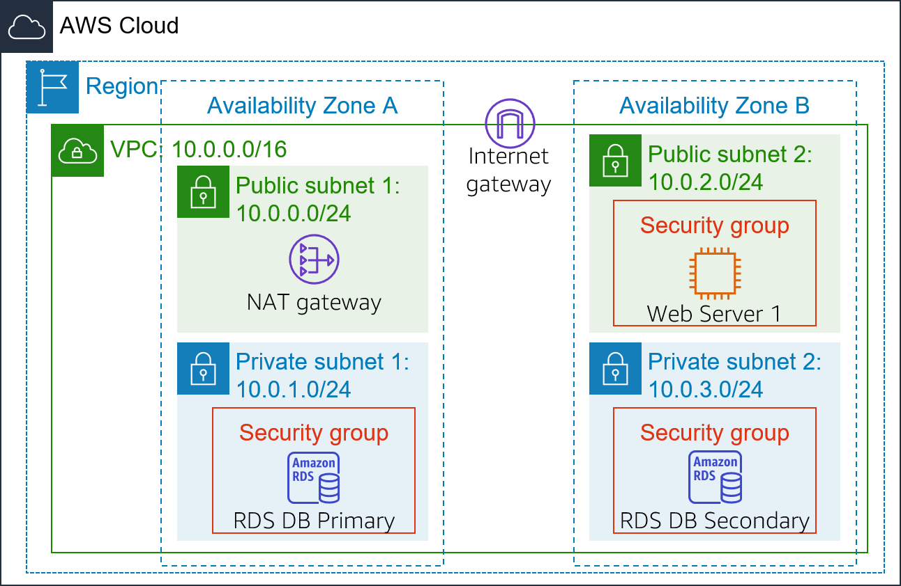
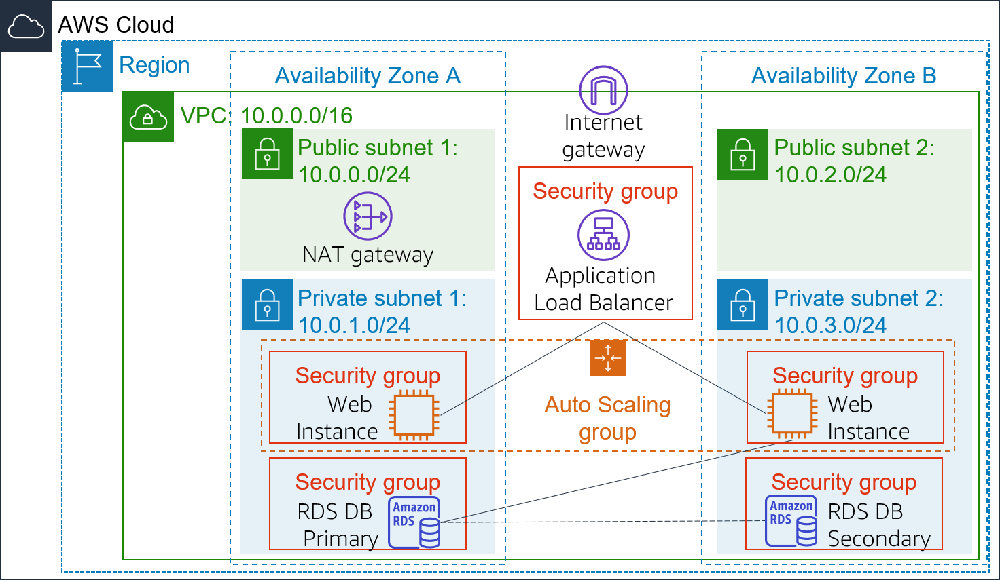

<header>
    <link rel="stylesheet" href="https://use.fontawesome.com/releases/v5.5.0/css/all.css" integrity="sha384-B4dIYHKNBt8Bc12p+WXckhzcICo0wtJAoU8YZTY5qE0Id1GSseTk6S+L3BlXeVIU" crossorigin="anonymous">
    <!-- Latest compiled and minified CSS -->
    <link rel="stylesheet" href="https://maxcdn.bootstrapcdn.com/bootstrap/3.3.7/css/bootstrap.min.css" integrity="sha384-BVYiiSIFeK1dGmJRAkycuHAHRg32OmUcww7on3RYdg4Va+PmSTsz/K68vbdEjh4u" crossorigin="anonymous">
    <!-- Optional theme -->
    <link rel="stylesheet" href="https://maxcdn.bootstrapcdn.com/bootstrap/3.3.7/css/bootstrap-theme.min.css" integrity="sha384-rHyoN1iRsVXV4nD0JutlnGaslCJuC7uwjduW9SVrLvRYooPp2bWYgmgJQIXwl/Sp" crossorigin="anonymous">
    <!-- Latest compiled and minified JavaScript -->
    
 </header>
 <!--include:Logo-->
 

# Lab 6: Menjalankan Load Balance dan Menskalakan Arsitektur Anda

<!-- Note to translators: This is based on Technical Essentials Lab 3. Copy the translation from there. Do not re-translate the whole document. -->

&nbsp;&nbsp;

**Versi 4.6.6 (TESS3) + perubahan khusus**

Lab ini memandu Anda menggunakan layanan Elastic Load Balancing (ELB) dan Auto Scaling untuk menjalankan load balance dan menskalakan infrastruktur Anda secara otomatis.

**Elastic Load Balancing** mendistribusikan lalu lintas aplikasi yang masuk di beberapa Amazon EC2 instance secara otomatis. Layanan ini memungkinkan Anda mencapai toleransi kesalahan pada aplikasi dengan menyediakan jumlah kapasitas load balancing yang dibutuhkan untuk merutekan lalu lintas aplikasi tanpa hambatan.

**Auto Scaling** membantu Anda menjaga ketersediaan aplikasi dan memungkinkan Anda untuk secara otomatis menskalakan kapasitas Amazon EC2 Anda keluar atau masuk sesuai dengan persyaratan yang Anda tetapkan. Anda dapat menggunakan Auto Scaling untuk membantu memastikan bahwa Amazon EC2 instance sedang dijalankan dalam jumlah yang Anda inginkan. Auto Scaling juga dapat meningkatkan jumlah Amazon EC2 instance secara otomatis selama peningkatan permintaan untuk menjaga kinerja dan menurunkan kapasitas selama jeda koneksi untuk mengurangi biaya. Auto Scaling sangat cocok untuk aplikasi yang memiliki pola permintaan stabil atau mengalami perubahan penggunaan per jam, hari, atau minggu.

&nbsp;

**Tujuan**

Setelah menyelesaikan lab ini, Anda dapat:

- Membuat Amazon Machine Image (AMI) dari instans yang berjalan.
- Membuat load balancer.
- Membuat konfigurasi peluncuran dan grup Auto Scaling.
- Menskalakan instans baru secara otomatis dalam subnet privat
- Membuat alarm Amazon CloudWatch dan memantau kinerja infrastruktur Anda.

&nbsp;

**Durasi**

Lab ini memerlukan waktu sekitar **30 menit**.

&nbsp;

**Skenario**

Anda mulai dengan infrastruktur berikut:

&nbsp;

Status akhir infrastruktur adalah:

&nbsp;

&nbsp;

&nbsp;
___
## Mengakses AWS Management Console

1. Di bagian atas instruksi ini, klik Start Lab (Mulai Lab) untuk meluncurkan lab Anda.

   Panel Start Lab (Mulai Lab) terbuka dan menampilkan status lab.

2. Tunggu hingga Anda melihat pesan "**Lab status: in creation**" (Status lab: sedang dibuat), kemudian klik **X** untuk menutup panel Start Lab (Mulai Lab).

   **Catatan**: Mungkin diperlukan waktu sekitar 10 menit atau lebih untuk mengubah status lab menjadi siap.

3. Di bagian atas instruksi ini, klik AWS

   Tindakan ini akan membuka AWS Management Console di tab browser baru. Anda akan login ke sistem secara otomatis.

   **Tips**: Jika tab browser baru tidak terbuka, biasanya akan ada spanduk atau ikon di bagian atas browser Anda yang menunjukkan bahwa browser Anda mencegah situs membuka jendela pop-up. Klik spanduk atau ikon lalu pilih "Allow pop ups" (Izinkan pop-up).

4. Mengatur tab AWS Management Console agar ditampilkan bersama instruksi ini. Idealnya, Anda akan dapat melihat kedua tab browser ini sekaligus, untuk mempermudah mengikuti langkah-langkah lab.

&nbsp;
___
## Tugas 1: Membuat AMI untuk Auto Scaling

Di tugas ini, Anda akan membuat AMI dari _Web Server 1_ (Server Web 1) yang sudah ada. Ini akan menyimpan konten disk boot sehingga instans yang baru dapat diluncurkan dengan konten yang identik.

5. Dalam **AWS Management Console**, di menu Services <i class="fas fa-angle-down"></i> (Layanan), klik **EC2**.

6. Di panel navigasi kiri, klik **Instances** (Instans).

   Pertama-tama, Anda akan memastikan bahwa instans sedang berjalan.

7. Tunggu hingga **Status Check** (Pemeriksaan Status) untuk **Web Server 1** (Server Web 1) menampilkan *2/2 checks passed* (2/2 pemeriksaan lulus). Klik refresh (segarkan) <i class="fas fa-sync"></i> untuk memperbarui.

   Sekarang Anda akan membuat AMI berdasarkan instans ini.

8. Pilih <i class="far fa-check-square"></i> **Web Server 1** (Server Web 1).

9. Di menu Actions <i class="fas fa-angle-down"></i>(Tindakan), klik **Image** (Gambar) &gt **Create Image** (Buat Gambar), lalu konfigurasikan:

   - **Nama gambar:** `WebServerAMI`
   - **Deskripsi gambar:** `Lab AMI untuk Server Web`

10. Klik Create Image (Buat Gambar)

   Layar konfirmasi menampilkan **AMI ID** (ID AMI) untuk AMI baru Anda.

11. Klik Close (Tutup)

   Anda akan menggunakan AMI ini saat meluncurkan grup Auto Scaling nantinya di lab.

&nbsp;
___
## Tugas 2: Membuat Load Balancer

Dalam tugas ini, Anda akan membuat load balancer yang dapat menyeimbangkan lalu lintas di beberapa EC2 instance dan Availability Zone.

12. Di panel navigasi kiri, klik **Load Balancers**.

13. Klik Create Load Balancer

   Beberapa jenis load balancer yang berbeda ditampilkan. Anda akan menggunakan _Application Load Balancer_ yang beroperasi pada tingkat permintaan (lapisan 7), yang merutekan lalu lintas ke target — EC2 instance, kontainer, alamat IP, dan fungsi Lambda — berdasarkan konten permintaan. Untuk informasi lebih lanjut, lihat: <a href="https://aws.amazon.com/elasticloadbalancing/features/#compare" target="_blank">Perbandingan Load Balancer</a>

14. Di **Application Load Balancer** klik Create (Buat) dan konfigurasikan:

   - **Nama:** `LabELB`
   - **VPC:** _Lab VPC_ (Di bagian **Availability Zone**)
   - **Availability Zone:** Pilih <i class="far fa-check-square"></i> keduanya untuk melihat subnet yang tersedia.
   - Pilih **Public Subnet 1** (Subnet Publik 1) dan **Public Subnet 2** (Subnet Publik 2)

   Pilihan ini mengonfigurasi load balancer agar beroperasi di beberapa Availability Zone.

15. Klik Next: Configure Security Settings (Berikutnya: Konfigurasikan Pengaturan Keamanan)

   <i class="fas fa-comment"></i> Anda dapat mengabaikan peringatan _"Improve your load balancer’s security."_.

16. Klik Next: Configure Security Group (Berikutnya: Konfigurasikan Grup Keamanan)

   _Grup Keamanan Web_ telah dibuat untuk Anda, yang mengizinkan akses HTTP.

17. Pilih <i class="far fa-check-square"></i> **Web Security Group** (Grup Keamanan Web) dan batalkan pilihan <i class="far fa-square"></i> **default** (bawaan).

18. Klik Next: Configure Routing (Berikutnya: Konfigurasikan Perutean)

   Perutean mengonfigurasi tempat untuk mengirim permintaan yang telah dikirimkan ke load balancer. Anda akan membuat _Target Group_ (Grup Target) yang akan digunakan oleh Auto Scaling.

19. Untuk **Name** (Nama), masukkan: `LabGroup`

20. Klik Next: Register Targets (Berikutnya: Daftarkan Target)

   Auto Scaling nantinya akan secara otomatis mendaftarkan instans sebagai target di lab.

21. Klik Next: Review (Berikutnya: Tinjau)

22. Klik Create (Buat), lalu klik Close (Tutup)

   Load balancer akan menunjukkan status _provisioning_ (penyediaan). Tidak perlu menunggu hingga statusnya siap. Lanjutkan dengan tugas berikutnya.

&nbsp;
___
## Tugas 3: Membuat Konfigurasi Peluncuran dan Grup Auto Scaling

Dalam tugas ini, Anda akan membuat _konfigurasi peluncuran_ untuk grup Auto Scaling Anda. Konfigurasi peluncuran adalah templat yang digunakan grup Auto Scaling untuk meluncurkan EC2 instance. Ketika Anda membuat konfigurasi peluncuran, Anda menentukan informasi untuk instans seperti AMI, tipe instans, pasangan kunci, disk, dan grup keamanan.

23. Di panel navigasi sebelah kiri, klik **Launch Configuration** (Konfigurasi Peluncuran).

24. Klik Create launch configuration (Buat konfigurasi peluncuran)

25. Konfigurasikan pengaturan berikut:

   - **Nama konfigurasi peluncuran:** `LabConfig`

   - **Amazon Machine Image (AMI)** Pilih *Web Server AMI*

   - **Tipe instans:**

      - Pilih Choose instance type (Pilih tipe instans)
      - Pilih *t3.micro*
      - Pilih Choose (Pilih)

      **Catatan:** Jika Anda telah meluncurkan lab di Region (Wilayah) us-east-1, pilih tipe instans **t2.micro**. Untuk menemukan Region (Wilayah), lihat di sudut kanan atas konsol Amazon EC2.

      **Catatan:** Jika Anda menerima pesan kesalahan "Something went wrong. Please refresh and coba lagi." (Terjadi kesalahan. Refresh dan coba lagi), Anda dapat mengabaikannya dan melanjutkan latihan.

   - **Konfigurasi tambahan**

      - **Pemantauan:**  </i> Pilih <i class="far fa-check-square"></i> *Aktifkan pemantauan detail EC2 instance dalam CloudWatch*

      Fitur ini memungkinkan Auto Scaling bereaksi cepat terhadap perubahan pemanfaatan.

26. Di **Security groups** (Grup keamanan), Anda akan mengonfigurasi konfigurasi peluncuran untuk menggunakan _Grup Keamanan Web_ yang telah dibuat untuk Anda.

   - Pilih **Select an existing security group** (Pilih grup keamanan yang ada)
   - Pilih <i class="far fa-check-square"></i> **Web Security Group**

27. Di **Pasangan kunci**, konfigurasikan:

   - **Opsi pasangan kunci:** *Pilih pasangan kunci yang ada*
   - **Pasangan kunci yang ada:** vockey
   - Pilih <i class="far fa-check-square"></i> **I acknowledge...**
   - Klik Create launch configuration (Buat konfigurasi peluncuran)

   Sekarang, Anda akan membuat grup Auto Scaling yang menggunakan Konfigurasi Peluncuran ini.

28. Pilih kotak centang untuk Konfigurasi Peluncuran *LabConfig*.

29. Dari menu Actions <i class="fas fa-caret-down"></i> (Tindakan), pilih *Create Auto Scaling group* (Buat grup Auto Scaling)

30. Masukkan nama grup Auto Scaling:

   - **Name:** (Nama) `Lab Grup Auto Scaling`

31. Pilih Next (Berikutnya).

32. Di halaman **Network** (Jaringan), konfigurasikan

   - **Network:** (Jaringan:) _Lab VPC_

      <i class="fas fa-comment"></i> Anda dapat mengabaikan pesan terkait "No public IP address" (Tidak ada alamat IP publik)

   - **Subnet:** Pilih _Private Subnet 1 (Subnet Privat 1) (10.0.1.0/24)_ **dan** _Private Subnet (Subnet Privat 2) (10.0.3.0/24)_

   Ini akan meluncurkan EC2 instance di subnet privat di kedua Availability Zone tersebut.

33. Pilih Next (Berikutnya).

34. Di **Load balancing** (Penyeimbangan beban):

   - Pilih <i class="far fa-check-square"></i> **Enable load balancing**
   - Pilih **Application Load Balancer or Network Load Balancer**
   - **Pilih grup target untuk load balancer Anda:**  LabGroup

35. Di **Additional settings** (Pengaturan tambahan), pilih <i class="far fa-check-square"></i> **Mengaktifkan pengumpulan metrik grup di dalam CloudWatch**

   Tindakan ini akan menangkap metrik dalam interval 1 menit, yang memungkinkan Auto Scaling bereaksi cepat terhadap pola penggunaan yang berubah.

36. Pilih Next (Berikutnya).

37. Di **Group size** (Ukuran grup), konfigurasikan:

   - **Desired capacity:** 2 (Kapasitas yang dikehendaki: 2)
   - **Minimum capacity:** 2 (Kapasitas minimum: 2)
   - **Maximum capacity:** 6 (Kapasitas maksimum: 6)

   Pengaturan ini akan memungkinkan Auto Scaling menambah/menghapus instans secara otomatis, selalu menjaga antara 2 dan 6 instans berjalan.

38. Di **Scaling policies** (Kebijakan penskalaan), pilih *Target tracking scaling policy* (Kebijakan penskalaan pelacakan target) dan konfigurasikan:

   - **Lab policy name:** (Nama kebijakan lab) `LabScalingPolicy`
   - **Metric type:** (Jenis metrik) _Average CPU Utilization_ (Pemanfaatan CPU Rata-rata)
   - **Target value:** `60` (Nilai target: 60)

   Konfigurasi ini meminta Auto Scaling untuk menjaga pemanfaatan CPU _rata-rata_ _di semua instans_ pada angka 60%. Auto Scaling akan secara otomatis menambah atau menghapus kapasitas sebagaimana diperlukan agar metrik tetap bernilai sesuai, atau mendekati nilai target yang ditentukan. Ini menyesuaikan dengan fluktuasi dalam metrik yang disebabkan oleh pola beban yang berfluktuasi.

39. Pilih Next (Berikutnya).

   Auto Scaling dapat mengirim pemberitahuan ketika peristiwa penskalaan berlangsung. Anda akan menggunakan pengaturan default.

40. Pilih Next (Berikutnya).

   Label yang diterapkan ke grup Auto Scaling akan secara otomatis disebarkan ke instans yang diluncurkan.

41. Pilih Add tag (Tambah label) dan Configure (Konfigurasi) hal-hal berikut:

   - **Key:** (Kunci:) `Name` (Nama)
   - **Value:** (Nilai:) `Lab Instance` (Instans Lab)

42. Klik Next (Berikutnya)

43. Tinjau detail grup Auto Scaling, lalu klik Create Auto Scaling group (Buat grup Auto Scaling). Jika terjadi kesalahan **Failed to create Auto Scaling group** (Gagal membuat grup Auto Scaling), kemudian klik Retry Failed Tasks (Coba lagi Tugas yang Gagal).

   Grup Auto Scaling Anda awalnya akan menampilkan nol untuk jumlah instans, tetapi instans baru akan diluncurkan untuk mencapai jumlah **Desired** (Yang Diinginkan) dari 2 instans.

&nbsp;
___
## Tugas 4: Memverifikasi bahwa Load Balancing Berfungsi

Dalam tugas ini, Anda akan memastikan bahwa Load Balancing berfungsi dengan benar.

44. Di panel navigasi kiri, klik **Instances** (Instans).

   Anda akan melihat dua instans baru bernama **Lab Instance** (Instans Lab). Keduanya diluncurkan oleh Auto Scaling.

   <i class="fas fa-comment"></i> Jika instans atau nama tidak ditampilkan, tunggu 30 detik dan klik refresh (segarkan) <i class="fas fa-sync"></i> di kanan atas.

   Pertama-tama, Anda akan mengonfirmasi bahwa instans baru telah melewati Pemeriksaan Kesehatan.

45. Di panel navigasi sebelah kiri, klik **Target Group** (Grup Target) (di bagian _Load Balancing_ (Penyeimbangan Beban)).

46. Pilih *LabGroup*

47. Klik tab **Target**.

   Dua target **Lab Instance** (Instans Lab) harus terdaftar untuk grup target ini.

48. Tunggu hingga **Status** kedua transisi instans menjadi *healthy* (sehat). Klik Refresh (Segarkan) <i class="fas fa-sync"></i> di kanan atas untuk memeriksa pembaruan.

   _Healthy_ (Sehat) menunjukkan bahwa instans telah melewati pemeriksaan kesehatan oleh Load Balancer. Ini berarti bahwa Load Balancer akan mengirimkan lalu lintas ke instans.

   Sekarang, Anda dapat mengakses grup Auto Scaling melalui Load Balancer.

49. Di panel navigasi kiri, klik **Load Balancers**.

50. Di panel bawah, salin **nama DNS** load balancer, pastikan untuk menghilangkan bagian "(A Record)".

   Ini harus terlihat mirip: _LabELB-1998580470.us-West-2.elb.Amazonaws.com_

51. Buka tab browser web baru, rekatkan Nama DNS yang baru saja disalin, dan tekan Enter.

   Aplikasi akan muncul di browser Anda. Hal ini menunjukkan bahwa Load Balancer telah menerima permintaan tersebut, mengirimkannya ke salah satu EC2 instance, lalu mengembalikan hasilnya.

&nbsp;
___
## Tugas 5: Menguji Auto Scaling

Anda membuat grup Auto Scaling dengan minimal dua instans dan maksimum enam instans. Saat ini dua instans sedang beroperasi karena ukuran minimum adalah dua dan grup ini sedang tidak memiliki beban apa pun. Sekarang, Anda akan meningkatkan beban untuk memungkinkan Auto Scaling menambahkan instans tambahan.

52. Kembali ke AWS Management Console, namun jangan tutup tab aplikasi — Anda akan segera kembali ke tab ini.

53. Di menu Services <i class="fas fa-angle-down"></i>(Layanan), klik **CloudWatch**.

54. Di panel navigasi sebelah kiri, klik **Alarms ** (*bukan* **ALARM**).

   Dua alarm akan ditampilkan. Alarm ini dibuat secara otomatis oleh grup Auto Scaling. Alarm tersebut secara otomatis akan menjaga beban CPU rata-rata mendekati 60%, dengan tetap berada dalam batasan memiliki dua hingga enam instans.

   ​    <i class="fas fa-exclamation-triangle" style="color:red"></i> **Catatan**: Harap ikuti langkah-langkah ini hanya jika Anda tidak melihat alarm dalam 60 detik.

   - Di menu Services <i class="fas fa-angle-down"></i>(Layanan), klik **EC2**.
   - Di panel navigasi sebelah kiri, klik **Auto Scaling Groups** (Grup Auto Scaling), kemudian klik **Scaling Policies** (Kebijakan Penskalaan).
   - Klik Actions⌄(Tindakan) dan **Edit**.
   - Ubah **Target Value** (Nilai Target) ke `50`.
   - Klik Save (Simpan).
   - Di menu Services <i class="fas fa-angle-down"></i>(Layanan), klik **CloudWatch**.
   - Di panel navigasi kiri, klik **Alarm** (*bukan* **ALARM** ) dan pastikan Anda melihat dua alarm.

55. Klik alarm **OK** yang memiliki keterangan _AlarmHigh_ di namanya.

   <i class="fas fa-comment"></i> Jika tidak ada alarm yang menampilkan **OK** (Oke), tunggu satu menit lalu klik refresh (segarkan) <i class="fas fa-sync"></i> di kanan atas hingga status alarm berubah.

   Jika ditampilkan **OK**, menunjukkan bahwa alarm _belum_ dipicu. Ini adalah alarm untuk **CPU Utilization > 60** (Pemanfaatan CPU > 60), yang akan menambah instans ketika CPU rata-rata bernilai tinggi. Grafik seharusnya menunjukkan tingkat CPU yang sangat rendah saat ini.

   Anda sekarang akan meminta aplikasi melakukan kalkulasi yang harus menaikkan tingkat CPU.

56. Kembali ke tab browser dengan aplikasi web.

57. Klik **Load Test** (Muat Pengujian) di sebelah logo AWS.

   Hal ini akan menyebabkan aplikasi menghasilkan beban tinggi. Halaman browser akan secara otomatis diperbarui sehingga semua instans dalam grup Auto Scaling akan menghasilkan beban. Jangan tutup tab ini.

58. Kembali ke tab browser dengan konsol **CloudWatch**.

   Dalam waktu kurang dari 5 menit, alarm **AlarmLow** (AlarmRendah) harus berubah menjadi **OK** (Oke) dan status alarm **AlarmHigh** (AlarmTinggi) harus berubah menjadi *ALARM* (ALARM).

   <i class="fas fa-comment"></i> Anda dapat mengeklik Refresh (Segarkan) <i class="fas fa-sync"></i> di kanan atas setiap 60 detik untuk memperbarui tampilan.

   Anda akan melihat grafik **AlarmHigh** (AlarmTinggi) yang menunjukkan peningkatan persentase CPU. Setelah melintasi batas 60% selama lebih dari 3 menit, sistem akan memicu Auto Scaling untuk menambahkan instans tambahan.

59. Tunggu hingga alarm **AlarmHigh** (AlarmTinggi) memasuki status _ALARM_ (ALARM).

   Anda sekarang dapat melihat instans tambahan yang diluncurkan.

60. Di menu Services <i class="fas fa-angle-down"></i>(Layanan), klik **EC2**.

61. Di panel navigasi kiri, klik **Instances** (Instans).

   Lebih dari dua instans yang berlabel **Lab Instance** (Instans Lab) akan mulai dijalankan. Instans baru dibuat oleh Auto Scaling sebagai respons terhadap Alarm.

&nbsp;
___
## Tugas 6: Menghentikan Server Web 1

Dalam tugas ini, Anda akan menghentikan fungsi _Web Server 1_ (Server Web 1). Instans ini digunakan untuk membuat AMI yang digunakan oleh grup Auto Scaling Anda, namun tidak lagi diperlukan.

62. Pilih <i class="far fa-check-square"></i> **Web Server 1** (Server Web 1) (dan pastikan itu merupakan satu-satunya instans yang dipilih).

63. Dalam menu Actions <i class="fas fa-angle-down"></i> (Tindakan), klik **Instance State** (Status Instans) > **Terminate** (Hentikan).

64. Pilih Yes, Terminate (Ya, Hentikan)

&nbsp;
___
## Lab Selesai

<i class="icon-flag-checkered"></i> Selamat! Anda telah menyelesaikan lab.

65. Klik End Lab (Akhiri Lab) di bagian atas halaman ini, kemudian klik Yes (Ya) untuk mengonfirmasi bahwa Anda ingin mengakhiri lab.

   Panel akan muncul dan menampilkan pesan "DELETE has been initiated... Anda dapat menutup kotak pesan ini sekarang."

66. Klik **X** di sudut kanan atas untuk menutup panel.

   Untuk umpan balik, saran-saran, atau koreksi, silakan kirim email kepada kami di: *aws-course-feedback@amazon.com*
