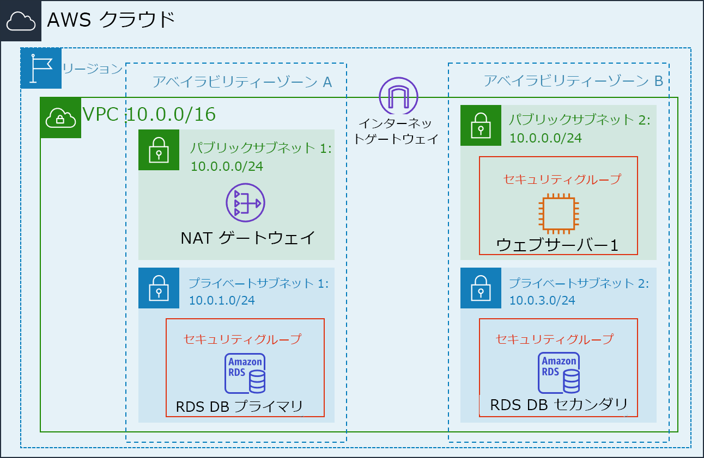
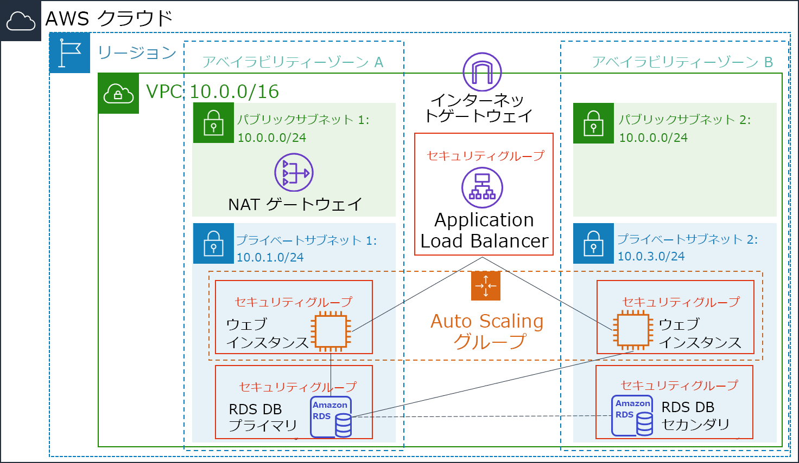

<header>
    <link rel="stylesheet" href="https://use.fontawesome.com/releases/v5.5.0/css/all.css" integrity="sha384-B4dIYHKNBt8Bc12p+WXckhzcICo0wtJAoU8YZTY5qE0Id1GSseTk6S+L3BlXeVIU" crossorigin="anonymous">
    <!-- Latest compiled and minified CSS -->
    <link rel="stylesheet" href="https://maxcdn.bootstrapcdn.com/bootstrap/3.3.7/css/bootstrap.min.css" integrity="sha384-BVYiiSIFeK1dGmJRAkycuHAHRg32OmUcww7on3RYdg4Va+PmSTsz/K68vbdEjh4u" crossorigin="anonymous">
    <!-- Optional theme -->
    <link rel="stylesheet" href="https://maxcdn.bootstrapcdn.com/bootstrap/3.3.7/css/bootstrap-theme.min.css" integrity="sha384-rHyoN1iRsVXV4nD0JutlnGaslCJuC7uwjduW9SVrLvRYooPp2bWYgmgJQIXwl/Sp" crossorigin="anonymous">
    <!-- Latest compiled and minified JavaScript -->
    
 </header>
 <!--include:Logo-->
 

# ラボ 6:アーキテクチャのスケールと負荷分散を行う

<!-- Note to translators: This is based on Technical Essentials Lab 3. Copy the translation from there. Do not re-translate the whole document. -->

&nbsp;&nbsp;

**バージョン 4.6.6 (TESS3) + カスタム変更**

このラボでは、Elastic Load Balancing (ELB) と Auto Scaling の各サービスを使用してインフラストラクチャの負荷分散と自動スケーリングを行う方法について説明します。

**Elastic Load Balancing** では、アプリケーションへの受信トラフィックを複数の Amazon EC2 インスタンスに自動的に分散します。これにより、アプリケーショントラフィックをルーティングするために必要な負荷分散性能がシームレスに発揮され、アプリケーションの耐障害性を実現できます。

**Auto Scaling** により、アプリケーションの可用性を維持し、ユーザーが定義した条件に沿って Amazon EC2 のキャパシティーを自動的にスケールインまたはスケールアウトできます。Auto Scaling を使用すると、常に必要な数の Amazon EC2 インスタンスを実行できるようになります。また、Auto Scaling によって、需要が急激に上昇したときには Amazon EC2 インスタンスの数を自動的に増やしてパフォーマンスを維持し、需要が落ち着いた状態にあるときには能力を縮小してコストを削減することもできます。Auto Scaling は、需要のパターンが一定のアプリケーション、または時間、日、週によって使用量が変動するアプリケーションに適しています。

&nbsp;

**目標**

このラボを完了すると、以下のことができるようになります。

- 実行中のインスタンスから Amazon Machine Image (AMI) を作成する
- ロードバランサーを作成する
- 起動設定と Auto Scaling グループを作成する
- プライベートサブネット内で新しいインスタンスを自動的にスケールする
- Amazon CloudWatch アラームを作成して、インフラストラクチャのパフォーマンスをモニタリングする

&nbsp;

**所要時間**

このラボは、完了までにおよそ **30 分**かかります。

&nbsp;

**シナリオ**

ラボの開始時点では、インフラストラクチャが以下の状態になっています。

&nbsp;

最終的にインフラストラクチャの状態は以下の図のようになります。

&nbsp;

&nbsp;

&nbsp;
___
## AWS マネジメントコンソールにアクセスする

1. この手順の上部にある Start Lab をクリックして、ラボを起動します。

   [**Start Lab**] パネルが開き、ラボのステータスが表示されます。

2. **Lab status: in creation** というメッセージが表示されるまで待ち、[**X**] をクリックして [**Start Lab**] パネルを閉じます。

   **注意**: ラボのステータスが **ready** に変わるまで、約 10 分またはそれ以上かかる場合があります。

3. この手順の上部にある AWS をクリックします。

   新しいブラウザタブで AWS マネジメントコンソールが開きます。システムによって自動的にログインします。

   **ヒント**: 新しいブラウザタブが開かない場合、通常、ブラウザによってサイトのポップアップウィンドウの表示がブロックされたことを示すバナーまたはアイコンがブラウザの上部に表示されます。バナーまたはアイコンをクリックし、[**ポップアップを許可**] をクリックします。

4. AWS マネジメントコンソールのタブをこの手順の横に配置します。ラボのステップを簡単に参照できるように、両方のブラウザタブを同時に表示することをお勧めします。

&nbsp;
___
## タスク 1: Auto Scaling 用の AMI を作成する

このタスクでは、既存の **Web Server 1** から AMI を作成します。これにより、起動ディスクの内容が保存されるため、同じ内容で新しいインスタンスを作成できるようになります。

5. **AWS マネジメントコンソール**の サービス <i class="fas fa-angle-down"></i> で [**EC2**] をクリックします。

6. 左側のナビゲーションペインで [**インスタンス**] をクリックします。

   まず、インスタンスが実行中であることを確認します。

7. **Web Server 1** の [**ステータスチェック**] に [**2/2 のチェックに合格しました**] と表示されるまで待ちます。<i class="fas fa-sync"></i> をクリックしてステータスを更新します。

   続いて、このインスタンスに基づいて AMI を作成します。

8. <i class="far fa-check-square"></i> **Web Server 1** を選択します。

9. アクション <i class="fas fa-angle-down"></i> ドロップダウンメニューから [**イメージとテンプレート**] > [**イメージを作成**] の順にクリックし、以下のように設定します。

   - **イメージ名:** `Web Server AMI`
   - **イメージの説明:** `Lab AMI for Web Server`

10. イメージを作成 をクリックします。

   確認画面に新しい AMI の **AMI ID** が表示されます。

   この AMI は、ラボの後半で Auto Scaling グループを起動するときに使用します。

&nbsp;
___
## タスク 2: ロードバランサーを作成する

このタスクでは、複数の EC2 インスタンスとアベイラビリティーゾーン間でトラフィックを分散できるロードバランサーを作成します。

11. ナビゲーションペインで [**ロードバランサー**] をクリックします。

12. ロードバランサーの作成 をクリックします。

   複数の異なるタイプのロードバランサーが表示されます。リクエストレベル（レイヤー 7）で動作し、トラフィックをリクエストの内容に基づいて EC2 インスタンス、コンテナ、IP アドレス、Lambda 関数といったターゲットにルーティングする **Application Load Balancer** を使用します。詳細については、以下を参照してください。 <a href="https://aws.amazon.com/elasticloadbalancing/features/#compare" target="_blank">ロードバランサーの比較</a>

13. \[**Application Load Balancer**] で 作成 をクリックし、以下のように設定します。

   - **名前:** `LabELB`
   - **VPC: **Lab VPC** ([**アベイラビリティーゾーン**] セクション内)
   - **アベイラビリティーゾーン**: 利用可能なサブネットを表示するには両方の <i class="far fa-check-square"></i> チェックボックスをオン
   - [**Public Subnet 1**] と [**Public Subnet 2**] を選択

   これにより、ロードバランサーが複数のアベイラビリティーゾーンで動作するよう設定されます。

14. 次の手順: セキュリティ設定の構成 をクリックします。

   <i class="fas fa-comment"></i> **ロードバランサーのセキュリティを向上させましょう。** という警告は無視して構いません。

15. 次の手順: セキュリティグループの設定 をクリックします。

   HTTP アクセスを許可する **Web Security Group** が既に作成されています。

16. <i class="far fa-check-square"></i> **Web Security Group** を選択し、<i class="far fa-square"></i> **default** の選択を解除します。

17. 次の手順: ルーティングの設定 をクリックします。

   ルーティングでは、ロードバランサーに送信されたリクエストの送信先を設定します。Auto Scaling で使用される**ターゲットグループ**を作成します。

18. \[**名前**] に `LabGroup` と入力します。

19. 次の手順: ターゲットの登録 をクリックします。

   ラボの後半で Auto Scaling によってインスタンスが自動的にターゲットとして登録されます。

20. 次の手順: 確認 をクリックします。

21. 作成 をクリックし、次に 閉じる をクリックします。

   ロードバランサーは **provisioning** 状態となります。準備が完了するまで待つ必要はありません。次のタスクに進んでください。

&nbsp;
___
## タスク 3: 起動設定と Auto Scaling グループを作成する

このタスクでは、Auto Scaling グループの**起動設定**を作成します。起動設定は Auto Scaling グループで EC2 インスタンスを作成するために使用されるテンプレートです。起動設定を作成する際に、AMI、インスタンスタイプ、キーペア、セキュリティグループ、ディスクなど、インスタンスに関する情報を指定します。

22. ナビゲーションペインで [**起動設定**] をクリックします。

23. 起動設定の作成 をクリックします

24. 以下のように設定します。

   - **起動設定名:** `LabConfig`
   - **Amazon マシンイメージ (AMI)**:  **Web Server AMI**
   - **インスタンスタイプ:**

      - インスタンスタイプの選択 をクリック
      - **t3.micro** を選択
      - 選択 をクリック

      **注意:** us-east-1 リージョンでラボを起動した場合は、**t2.micro** インスタンスタイプを選択します。リージョンを調べるには、Amazon EC2 コンソールの右上隅を確認します。

      **注意:** 「問題が発生しました。更新してもう一度試してください。」というエラーメッセージが表示された場合は、無視して演習を続行して構いません。

   - **追加設定**

      - **モニタリング:** </i> <i class="far fa-check-square"></i> **CloudWatch 内で EC2 インスタンスの詳細モニタリングを有効にする** チェックボックスをオン

      これにより、Auto Scaling によって使用率の変化にすばやく対応できます。

25. \[**セキュリティグループ**] で、起動設定で作成済みの ***Web Security Group** を使用するよう設定します。

   - [**既存のセキュリティグループを選択する**] をクリック
   - <i class="far fa-check-square"></i> **Web Security Group** チェックボックスをオン

26. \[**キーペア**] で以下のように設定します。

   - **キーペアのオプション:** **既存のキーペアの選択**
   - **既存のキーペア:** vockey
   - <i class="far fa-check-square"></i> **選択したプライベートキーファイル (vockey.pem) へのアクセス権があり、このファイルなしではインスタンスにログインできないことを了承します。** チェックボックスをオン
   - 起動設定の作成 をクリック

   次に、この起動設定を使用する Auto Scaling グループを作成します。

27. **LabConfig** を選択します。

28. アクション <i class="fas fa-caret-down"></i> ドロップダウンメニューから [**Auto Scaling グループの作成**] を選択します。

29. Auto Scaling グループ名を入力します

   - **名前:** `Lab Auto Scaling Group`

30. 次へ をクリックします。

31. \[**ネットワーク**] ページで以下を設定します

   - **VPC:** **Lab VPC**

      <i class="fas fa-comment"></i> **パブリック IP アドレスがありません** というメッセージは無視して構いません。

   - **サブネット:** [**Private Subnet 1 (10.0.1.0/24)**] と [**Private Subnet 2 (10.0.3.0/24)**] を選択

   これにより、両方のアベイラビリティーゾーンでプライベートサブネットに EC2 インスタンスが作成されます。

32. 次へ をクリックします。

33. \[**ロードバランシング - 省略可能**] で [**Attach to an existing load balancer**] を選択します。

34. \[Attach to an existing load balancer] の [**既存のロードバランサーターゲットグループ**] ドロップダウンの一覧から [**LabGroup**] を選択します。

35. \[**その他の設定 - 省略可能**] で、<i class="far fa-check-square"></i> **CloudWatch 内でグループメトリクスの収集を有効にする)** チェックボックスをオンにします。

   これにより、1 分間隔でメトリクスが取り込まれるため、Auto Scaling で使用パターンの変化にすばやく対応できます。

36. 次へ をクリックします。

37. \[**グループサイズ**] で、以下のように設定します。

   - **希望する容量:** 2
   - **最小キャパシティ:** 2
   - **最大キャパシティ:** 6

   これにより、Auto Scaling によってインスタンスが自動的に追加または削除され、常に 2～6 個のインスタンスが実行中になるようにできます。

38. \[**スケーリングポリシー**] で、[**ターゲット追跡スケーリングポリシー**] をクリックし、以下のように設定します。

   - **スケーリングポリシー名:** `LabScalingPolicy`
   - **メトリクスタイプ:** **平均 CPU 使用率**
   - **ターゲット値:** `60`

   これにより、Auto Scaling によって**すべてのインスタンス**の CPU **平均**使用率が 60% で維持されます。Auto Scaling は必要に応じてキャパシティーを自動的に追加または削除し、指定されたターゲット値、またはそれに近い値でメトリクスを維持します。負荷パターンが変動するため、Auto Scaling ではメトリクスの変動に合わせます。

39. 次へ をクリックします。

   Auto Scaling では、スケーリングイベントが発生したときに通知を送信できます。今回では、デフォルト設定を使用します。

40. 次へ をクリックします。

   Auto Scaling グループに適用されたタグは、起動されるインスタンスに自動的に反映されます。

41. タグを追加 をクリックして、以下のように指定します。

   - **キー:** `Name`
   - **値:** `Lab Instance`

42. 次へ をクリックします。

43. Auto Scaling グループの詳細を確認してから、Auto Scaling グループを作成 をクリックします。**Auto Scaling グループを作成できませんでした** というエラーが表示された場合、失敗したタスクを再試行 をクリックします。

   Auto Scaling グループでは、最初はインスタンス数が 0 と表示されますが、**希望**数 (この場合、2 つのインスタンス) になるまで、新しいインスタンスが作成されます。

&nbsp;
___
## タスク 4: 負荷分散が機能していることを確認する

このタスクでは、負荷分散が正常に動作していることを確認します。

44. 左側のナビゲーションペインで [**Instances**] をクリックします。

   **Lab Instance** という名前の 2 個の新しいインスタンスが確認できます。このインスタンスは Auto Scaling によって作成されました。

   <i class="fas fa-comment"></i>インスタンスまたは名前が表示されない場合、30 秒待ってから右上の <i class="fas fa-sync"></i> をクリックします。

   まず、新しいインスタンスがヘルスチェックに合格していることを確認します。

45. ナビゲーションペインで [**ロードバランシング**] の下の [**ターゲットグループ**] をクリックします。

46. **LabGroup** をクリックします

47. \[**ターゲット**] タブをクリックします。

   2 つの **Lab Instance** ターゲットが、このターゲットグループに表示されるはずです。

48. 両方のインスタンスの [**ステータス**] が **healthy** に変わるまで待ちます。更新を確認するには、右上の <i class="fas fa-sync"></i> をクリックします。

   **healthy** は、インスタンスがロードバランサーのヘルスチェックに合格したことを示します。つまり、ロードバランサーからインスタンスにトラフィックが送信されます。

   これで、ロードバランサーを介して Auto Scaling グループにアクセスできるようになりました。

49. ナビゲーションペインで [**ロードバランサー**] をクリックします。

50. 下のペインで、ロードバランサーの **DNS 名**をコピーします。ただし、「(A レコード)」は省略します。

   **LabELB-1998580470.us-west-2.elb.amazonaws.com** のような表記になります。

51. ウェブブラウザで新しいタブを開き、コピーした DNS 名を貼り付けて、**Enter** キーを押します。

   ブラウザにアプリケーションが表示されます。これは、ロードバランサーでリクエストを受け取り、EC2 インスタンスの 1 つに送信し、結果を返したことを示します。

&nbsp;
___
## タスク 5: Auto Scaling をテストする

これまでの手順で、最小インスタンス数が 2 個、最大インスタンス数が 6 個の Auto Scaling グループを作成しました。最小サイズが 2 個であり、グループに負荷がかかっていないため、現在、2 つのインスタンスが実行されています。次に、Auto Scaling でインスタンスが追加されるよう、負荷を増やします。

52. AWS マネジメントコンソールのタブに戻ります。ただし、アプリケーションタブはすぐに使用するため閉じないでください。

53. サービス <i class="fas fa-angle-down"></i> で [**CloudWatch**] をクリックします。

54. ナビゲーションペインで [**アラーム**]（その下の [**アラーム**] **ではない**）をクリックします。

   2 つのアラームが表示されます。これらは Auto Scaling グループによって自動的に作成されました。この 2 つのアラームによって、2～6 個のインスタンス数の制限内で、自動的に CPU の平均負荷をほぼ 60% に維持します。

   ​    <i class="fas fa-exclamation-triangle" style="color:red"></i> **注意**: 60 秒以内にアラームが表示されない場合のみ、以下のステップに従ってください。

   - サービス <i class="fas fa-angle-down"></i> で [**EC2**] をクリック
   - ナビゲーションペインで [**Auto Scaling グループ**] をクリック
   - **Lab Auto Scaling** をクリック
   - [**自動スケーリング**] タブをクリック
   - [**LabScalingPollicy**] のチェックボックスをオン
   - アクション ドロップダウンメニューから [**編集**] を選択
   - [**ターゲット値**] を `50` に変更
   - 更新 をクリック
   - サービス <i class="fas fa-angle-down"></i> で [**CloudWatch**] をクリック
   - ナビゲーションペインで [**アラーム**]（その下の [**アラーム**] **ではない**）をクリックし、2 つのアラームが表示されることを確認

55. 名前に **AlarmHigh** が含まれていて [**状態**] が [**OK**] のアラームをクリックします。

   <i class="fas fa-comment"></i>[**OK**] と表示されているアラームがない場合、1 分待ってから右上の <i class="fas fa-sync"></i> をアラームの状態が変更されるまでクリックします。

   [**OK**] は、アラームがトリガーされて**いない**ことを示します。これは **CPU 使用率 > 60** のアラームで、CPU の平均使用率が高くなったときにインスタンスが追加されます。今のところ、グラフの CPU 使用率は非常に低い数値になっています。

   今から、アプリケーションで計算を実行し、CPU 使用率を上げます。

56. ウェブアプリケーションを表示しているブラウザタブに戻ります。

57. AWS のロゴの横にある [**Load Test**] をクリックします。

   この操作で、アプリケーションによる高い負荷が発生します。ブラウザページが自動的に更新され、Auto Scaling グループ内のすべてのインスタンスで負荷が発生します。このタブは閉じないでください。

58. **CloudWatch** コンソールが表示されているブラウザタブに戻ります。

   5 分以内に **AlarmLow** アラームが [**OK**] に変わり、**AlarmHigh** アラームの状態が [**アラーム状態**] に変わります。

   <i class="fas fa-comment"></i>左上の <i class="fas fa-sync"></i> を 60 秒ごとにクリックし、ステータスを更新します。

   **AlarmHigh** のグラフでは、CPU の割合が増加していることが確認できます。60% の線を超えた状態が 3 分間超継続すると、Auto Scaling がトリガーされ、インスタンスが追加されます。

59. **AlarmHigh** アラームが [**アラーム状態**] になるまで待ちます。

   この時点で起動されたインスタンスが確認できます。

60. サービス <i class="fas fa-angle-down"></i> で [**EC2**] をクリックします。

61. 左側のナビゲーションペインで [**インスタンス**] をクリックします。

   **Lab Instance** と表示されている 3 つ以上のインスタンスが現在実行されています。アラームに応答して、Auto Scaling によって新しいインスタンスが作成されました。

&nbsp;
___
## タスク 6: Web Server 1 を終了する

このタスクでは、**Web Server 1** を終了します。このインスタンスは、Auto Scaling グループによって使用される AMI 作成のために使用されていましたが、不要になりました。

62. <i class="far fa-check-square"></i> **Web Server 1** を選択します（このインスタンスだけが選択されていることを確認します）。

63. インスタンスの状態 <i class="fas fa-angle-down"></i> ドロップダウンメニューから [**インスタンスを終了**] を選択します。

64. 終了 をクリックします

&nbsp;
___
## ラボの終了

<i class="icon-flag-checkered"></i>お疲れ様でした。これでラボが完了しました。

65. ラボの終了を確認するには、このページの上部にある End Lab をクリックし、Yes をクリックします。

   パネルが表示され、**DELETE has initiated...You may close this message box now.** というメッセージが表示されます。

66. 右上隅の [**X**] をクリックしてパネルを閉じます。

   フィードバック、ご提案、修正については、*aws-course-feedback@amazon.com* まで E メールにてご連絡ください。
