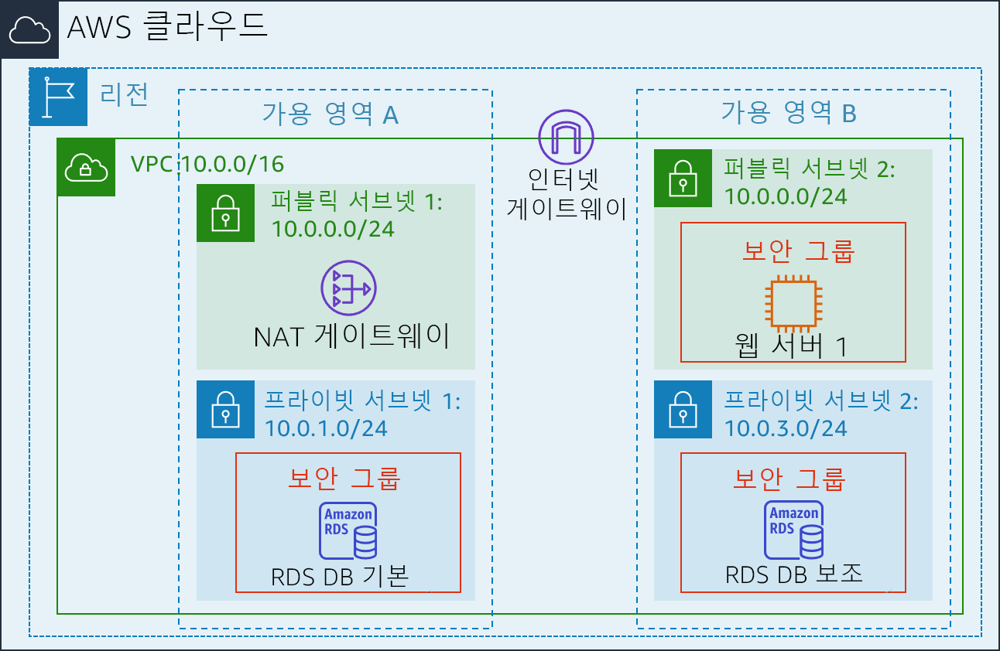
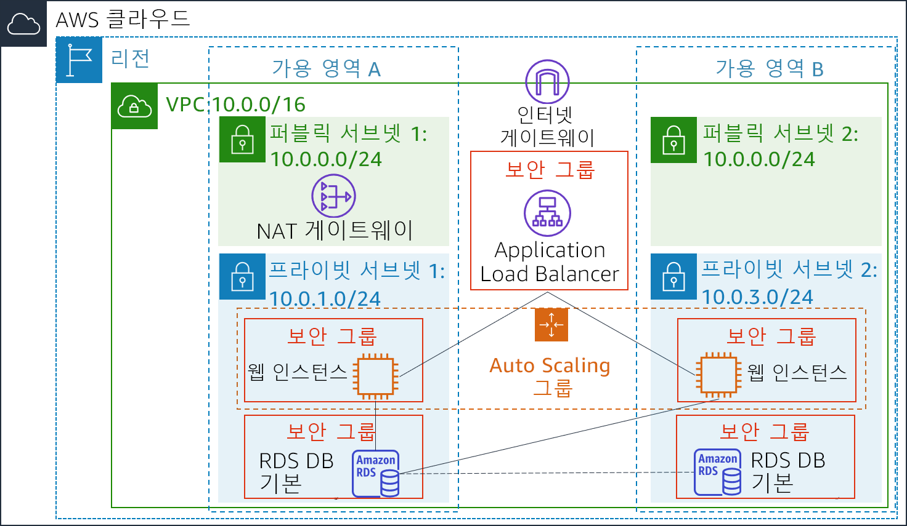

<header>
    <link rel="stylesheet" href="https://use.fontawesome.com/releases/v5.5.0/css/all.css" integrity="sha384-B4dIYHKNBt8Bc12p+WXckhzcICo0wtJAoU8YZTY5qE0Id1GSseTk6S+L3BlXeVIU" crossorigin="anonymous">
    <!-- Latest compiled and minified CSS -->
    <link rel="stylesheet" href="https://maxcdn.bootstrapcdn.com/bootstrap/3.3.7/css/bootstrap.min.css" integrity="sha384-BVYiiSIFeK1dGmJRAkycuHAHRg32OmUcww7on3RYdg4Va+PmSTsz/K68vbdEjh4u" crossorigin="anonymous">
    <!-- Optional theme -->
    <link rel="stylesheet" href="https://maxcdn.bootstrapcdn.com/bootstrap/3.3.7/css/bootstrap-theme.min.css" integrity="sha384-rHyoN1iRsVXV4nD0JutlnGaslCJuC7uwjduW9SVrLvRYooPp2bWYgmgJQIXwl/Sp" crossorigin="anonymous">
    <!-- Latest compiled and minified JavaScript -->
    
 </header>
 <!--include:Logo-->
 

# 실습 6: 아키텍처 확장 및 로드 밸런싱

<!-- Note to translators: This is based on Technical Essentials Lab 3. Copy the translation from there. Do not re-translate the whole document. -->

&nbsp;&nbsp;

**버전 4.6.6(TESS3) + 사용자 지정 변경**

이 실습에서는 Elastic Load Balancing(ELB)과 Auto Scaling 서비스를 사용하여 인프라를 부하 분산하고 자동 조정하는 과정을 살펴봅니다.

**Elastic Load Balancing**은 수신되는 애플리케이션 트래픽을 여러 Amazon EC2 인스턴스에 자동으로 분산합니다. ELB를 사용하면 애플리케이션 트래픽을 라우팅하는 데 필요한 로드 밸런싱 용량을 원활하게 제공함으로써 애플리케이션의 내결함성을 달성할 수 있습니다.

**Auto Scaling**은 애플리케이션 가용성을 유지하는 데 도움이 되며, 정의한 조건에 따라 Amazon EC2 용량을 자동으로 확장 또는 축소할 수 있습니다. Auto Scaling을 활용하면 실행 중인 Amazon EC2 인스턴스의 수를 원하는 수준으로 유지할 수 있습니다. 또한 Auto Scaling은 수요가 급증할 경우 Amazon EC2 인스턴스의 수를 자동으로 증가시키기 때문에 성능을 그대로 유지할 수 있으며, 수요가 적을 경우 자동으로 용량을 감소시켜 비용 낭비를 막아줍니다. Auto Scaling은 수요 패턴이 안정적이거나 사용량이 시간, 일 또는 주 단위로 변경되는 애플리케이션에 적합합니다.

&nbsp;

**목표**

본 실습을 완료하면 다음을 할 수 있습니다.

- 실행 중인 인스턴스에서 Amazon Machine Image(AMI) 생성
- 로드 밸런서 생성
- 시작 구성 및 Auto Scaling 그룹 생성
- 프라이빗 서브넷 내에서 새 인스턴스 자동 조정
- Amazon CloudWatch 경보 생성 및 인프라 성능 모니터링

&nbsp;

**소요 시간**

이 실습은 완료까지 약 **30분**이 소요됩니다.

&nbsp;

**시나리오**

다음 인프라로 시작합니다.

&nbsp;

최종 인프라 상태는 다음과 같습니다.

&nbsp;

&nbsp;

&nbsp;
___
## AWS Management Console 액세스

1. 지침의 맨 위에서 Start Lab을 클릭하여 실습을 시작합니다.

   Start Lab 패널이 열리고 실습 상태가 표시됩니다.

2. “**Lab status: in creation**” 메시지가 표시되면 **X**를 클릭하여 Start Lab 패널을 닫습니다.

   **참고**: 실습 상태가 준비 상태로 변경되는 데 약 10분 이상 소요될 수 있습니다.

3. 지침의 맨 위에서 AWS를 클릭합니다.

   그러면 새 브라우저 탭에서 AWS Management Console이 열립니다. 시스템에서 자동으로 로그인합니다.

   **팁**: 새 브라우저 탭이 열리지 않는 경우 일반적으로 브라우저에서 팝업 창을 열 수 없음을 나타내는 배너 또는 아이콘이 브라우저 상단에 표시됩니다. 배너 또는 아이콘을 클릭하고 Allow pop ups를 선택합니다.

4. 이러한 지침이 나란히 표시되도록 AWS Management Console 탭을 정렬합니다. 두 브라우저 탭이 동시에 표시되어 실습 단계를 보다 쉽게 수행할 수 있게 됩니다.

&nbsp;
___
## 과제 1: Auto Scaling용 AMI 생성

이 과제에서는 기존의 _Web Server 1_에서 AMI를 생성합니다. 이렇게 하면 부팅 디스크의 콘텐츠가 저장되므로 동일한 콘텐츠를 사용하여 새 인스턴스를 시작할 수 있습니다.

5. **AWS Management Console**의 Services<i class="fas fa-angle-down"></i> 메뉴에서 **EC2**를 클릭합니다.

6. 왼쪽 탐색 창에서 **Instances**를 클릭합니다.

   먼저 인스턴스가 실행 중인지 확인합니다.

7. **Web Server 1**의 **Status Checks**에 *2/2 checks passed*가 표시될 때까지 기다립니다. 새로 고침 아이콘 <i class="fas fa-sync"></i>을 클릭하여 업데이트합니다.

   이제 이 인스턴스를 기반으로 AMI를 생성합니다.

8. <i class="far fa-check-square"></i> **Web Server 1**를 선택합니다.

9. Actions <i class="fas fa-angle-down"></i> 메뉴에서 **Image** &gt; **Create Image**를 클릭하고 다음을 구성합니다.

 - **Image name:** `Web Server AMI`
   - **Image description:** `Lab AMI for Web Server`

10. Create Image를 클릭합니다.

   확인 화면에 새 AMI의 **AMI ID**가 표시됩니다.

11. Close를 클릭합니다.

   이 AMI는 실습 후반부에서 Auto Scaling 그룹을 시작할 때 사용합니다.

&nbsp;
___
## 과제 2: 로드 밸런서 생성

이 과제에서는 여러 EC2 인스턴스 및 가용 영역에 걸쳐 트래픽 균형을 조정할 수 있는 로드 밸런서를 생성합니다.

12. 왼쪽 탐색 창에서 **Load Balancers**를 클릭합니다.

13. Create Load Balancer를 클릭합니다.

   여러 유형의 로드 밸런서가 표시됩니다. 이 과제에서는 요청 수준(계층 7)에서 작동하는 _Application Load Balancer_를 사용하여 요청 내용에 따라 트래픽을 대상(EC2 인스턴스, 컨테이너, IP 주소 및 Lambda 함수)으로 라우팅합니다. 자세한 내용은 다음을 참조하십시오. <a href="https://aws.amazon.com/elasticloadbalancing/features/#compare" target="_blank">로드 밸런서 비교</a>

14. **Application Load Balancer** 아래에서 Create를 클릭하고 다음을 구성합니다.

   - **Name**: `LabELB`
   - **VPC**: _Lab VPC_(**Availability Zones** 섹션)
   - **Availability Zones**: 둘 다를 선택하여 <i class="far fa-check-square"></i> 사용 가능한 서브넷을 표시합니다.
   - **Public Subnet 1**과 **Public Subnet 2**를 선택합니다.

   이렇게 하면 로드 밸런서가 여러 가용 영역에서 작동하도록 구성됩니다.

15. Next: Configure Security Settings를 클릭합니다.

   <i class="fas fa-comment"></i> _"Improve your load balancer's security."_라는 경고는 무시해도 됩니다.

16. Next: Configure Security Groups를 클릭합니다.

   HTTP 액세스를 허용하는 _Web Security Group_이 이미 생성되어 있습니다.

17. <i class="far fa-check-square"></i> **Web Security Group**을 선택하고 <i class="far fa-square"></i> **default**를 선택해제합니다.

18. Next: Configure Routing을 클릭합니다.

   라우팅은 로드 밸런서로 전송되는 요청을 보낼 위치를 구성합니다. Auto Scaling에 사용할 _Target Group_을 생성해야 합니다.

19. **Name**에 `LabGroup`을 입력합니다.

20. Next: Register Targets를 클릭합니다.

   실습 후반부에서 Auto Scaling이 자동으로 인스턴스를 대상으로 등록합니다.

21. Next: Review를 클릭합니다.

22. Create를 클릭한 다음 Close를 클릭합니다.

   로드 밸런서의 상태가 _provisioning_으로 표시됩니다. 준비가 될 때까지 기다리지 않아도 됩니다. 다음 과제를 진행하십시오.

&nbsp;
___
## 과제 3: 시작 구성 및 Auto Scaling 그룹 생성

이 태스크에서는 Auto Scaling 그룹에 대한 _시작 구성_을 생성합니다. 시작 구성은 Auto Scaling 그룹에서 EC2 인스턴스를 시작할 때 사용하는 템플릿입니다. 시작 구성을 생성할 때 AMI, 인스턴스 유형, 키 페어, 보안 그룹, 및 디스크와 같은 인스턴스 정보를 지정합니다.

23. 왼쪽 탐색 창에서 **Launch Configurations**를 클릭합니다.

24. Create launch configuration을 클릭합니다.

25. 다음 설정을 구성합니다.

   - **Launch configuration name:** `LabConfig`

   - **Amazon Machine Image(AMI)** *Web Server AMI*선택합니다.

   - **Instance type:**

      - Choose instance type을 선택합니다.
      - *t3.micro*를 선택합니다.
      - Choose를 선택합니다.

      **참고:** us-east-1 리전에서 실습을 시작한 경우 **t2.micro** 인스턴스 유형을 선택합니다. 리전을 찾으려면 Amazon EC2 콘솔의 오른쪽 상단 모서리를 살펴보십시오.

      **참고:** "Something went wrong. Please refresh and try again."라는 메시지를 받으면 메시지를 무시하고 계속 진행합니다.

   - **추가 구성**

      - **Monitoring**: </i>Select<i class="far fa-check-square"></i> *CloudWatch 내에서 EC2 인스턴스 세부 모니터링 활성화*

      이렇게 하면 Auto Scaling이 사용률 변화에 신속하게 대응할 수 있습니다.

26. **Security groups** 아래에서 이미 생성되어 있는 _Web Security Group_을 사용하도록 시작 구성을 구성합니다.

   - **Select an existing security group**을 선택합니다.
   - <i class="far fa-check-square"></i> **Web Security Group**을 선택합니다.

27. **Key pair** configure:

   - **Key pair options**: *Choose an existing key pair*
   - **Existing key pair**: vockey
   - <i class="far fa-check-square"></i> **I acknowledge...**를 선택합니다.
   - Create launch configuration을 클릭합니다.

   이제 이 시작 구성을 사용하는 Auto Scaling 그룹을 생성합니다.

28. *LabConfig* 시작 구성의 확인란을 선택합니다.

29. Actions<i class="fas fa-caret-down"></i> 메뉴에서 *Create Auto Scaling group*을 선택합니다.

30. Auto Scaling 그룹 이름 입력:

   - **Name:** `Lab Auto Scaling Group`

31. Next를 선택합니다.

32. **Network** 페이지 구성에서

   - **Network:** _Lab VPC_

      <i class="fas fa-comment"></i> "No public IP address" 관련 메시지는 무시해도 됩니다.

   - **Subnet**: _Private Subnet 1 (10.0.1.0/24)_ **및** _Private Subnet 2 (10.0.3.0/24)_를 선택합니다.

   이렇게 하면 두 가용 영역의 프라이빗 서브넷에서 EC2 인스턴스가 시작됩니다.

33. Next를 선택합니다.

34. **Load balancing**:

   - <i class="far fa-check-square"></i> **Enable load balancing**을 선택합니다.
   - **Application Load Balancer 또는 Network Load Balancer**를 선택합니다.
   - **Choose a target group for your load balancer:** LabGroup

35. **Additional settings**에서 <i class="far fa-check-square"></i> **Enable group metrics collection within CloudWatch**를 선택합니다.

   이렇게 하면 1분 간격으로 지표가 캡처되므로 Auto Scaling이 변화하는 사용 패턴에 신속하게 대응할 수 있습니다.

36. Next를 선택합니다.

37. **Group Size**에서 다음을 구성합니다.

   - **Desired capacity:** 2
   - **Minimum capacity:** 2
   - **Maximum capacity:** 6

   이렇게 하면 Auto Scaling에서 인스턴스를 자동으로 추가/제거하여 항상 2~6개의 인스턴스를 계속해서 실행할 수 있습니다.

38. **Scaling policies**에서 *Target tracking scaling policy*를 선택하고 다음을 구성합니다.

   - **Lab policy name:** `LabScalingPolicy`
   - **Metric type**: _Average CPU Utilization_
   - **Target value**: `60`

   이렇게 하면 Auto Scaling에서 _모든 인스턴스_에서 _평균_ CPU 사용률을 60%로 유지할 수 있습니다. Auto Scaling은 필요에 따라 용량을 자동으로 추가 또는 제거하여 지표를 지정된 대상 값으로 유지하거나 이 값에 가까운 값으로 유지합니다. 로드 패턴 변동으로 인한 지표의 변동에 맞춰 조정합니다.

39. Next를 선택합니다.

   Auto Scaling에서 조정 이벤트가 발생할 때 알림을 보낼 수 있습니다. 기본 설정을 사용합니다.

40. Next를 선택합니다.

   Auto Scaling 그룹에 적용된 태그는 시작된 인스턴스에 자동으로 전파됩니다.

41. Add tag를 선택하고 다음 옵션을 구성합니다.

   - **Key:** `Name`
   - **Value:** `Lab Instance`

42. Next를 클릭합니다.

43. Auto Scaling 그룹의 세부 정보를 확인한 다음 Create Auto Scaling group을 클릭합니다. **Failed to create Auto Scaling group** 오류가 발생하면 Retry Failed Tasks를 클릭합니다.

   Auto Scaling 그룹의 인스턴스 개수는 처음에 0으로 표시되지만, 새 인스턴스가 시작되면 **Desired** count인 2에 도달합니다.

&nbsp;
___
## 과제 4: 로드 밸런싱 작동 확인

이 과제에서는 로드 밸런싱이 올바르게 작동하는지 확인합니다.

44. 왼쪽 탐색 창에서 **Instances**를 클릭합니다.

   이름이 **Lab Instance**인 새 인스턴스 2개가 표시됩니다. 이 두 인스턴스는 Auto Scaling에 의해 시작되었습니다.

   <i class="fas fa-comment"></i> 인스턴스 또는 이름이 표시되지 않으면 30초간 기다린 후 오른쪽 위에서 새로 고침 <i class="fas fa-sync"></i>을 클릭합니다.

   먼저 새 인스턴스가 상태 확인을 통과했는지 확인합니다.

45. 왼쪽 탐색 창에서 **Target Groups**(_Load Balancing_ 섹션)를 클릭합니다.

46. *LabGroup*선택

47. **Targets** 탭을 클릭합니다.

   이 대상 그룹에는 두 개의 **Lab Instance**가 대상으로 나열되어야 합니다.

48. 두 개의 인스턴스 **Status**가 모두 *healthy*로 전환될 때까지 기다립니다. 오른쪽 위에서 새로 고침 아이콘 <i class="fas fa-sync"></i>을 클릭하여 업데이트를 확인합니다.

   _Healthy_는 인스턴스가 로드 밸런서의 상태 확인을 통과했음을 나타냅니다. 즉, 로드 밸런서가 인스턴스로 트래픽을 전송합니다.

   이제 로드 밸런서를 통해 Auto Scaling 그룹에 액세스할 수 있습니다.

49. 왼쪽 탐색 창에서 **Load Balancers**를 클릭합니다.

50. 하단 창에서 로드 밸런서의 **DNS 이름**을 복사합니다. "(A Record)"를 생략해야 합니다.

   이름은 _LabELB-1998580470.us-west-2.elb.amazonaws.com_과 유사해야 합니다.

51. 새 웹 브라우저 탭을 열고 방금 복사한 DNS 이름을 붙여 넣은 다음 Enter 키를 누릅니다.

   애플리케이션이 브라우저에 나타납니다. 이는 로드 밸런서가 요청을 수신하여 EC2 인스턴스 중 하나로 전송한 후 결과를 되돌려 준 것을 말합니다.

&nbsp;
___
## 과제 5: Auto Scaling 테스트

인스턴스가 최소 2개, 최대 6개인 Auto Scaling 그룹을 생성했습니다. 최소 크기는 2이고 로드가 전혀 없으므로 현재 2개의 인스턴스가 실행 중입니다. 이제 로드를 늘려 Auto Scaling이 인스턴스를 추가하도록 합니다.

52. 곧 다시 돌아올 것이므로 애플리케이션 탭을 닫지 않은 상태에서 AWS Management Console로 돌아갑니다.

53. Services <i class="fas fa-angle-down"></i> 메뉴에서 **CloudWatch**를 클릭합니다.

54. 왼쪽 탐색 창에서 **Alarms**(**ALARM** *아님*)를 클릭합니다.

   두 경보가 표시됩니다. 이러한 경보는 Auto Scaling 그룹에 의해 자동으로 생성되었습니다. 이 두 경보는 2~6개의 인스턴스를 보유해야 하는 제한 범위를 벗어나지 않으면서 자동으로 평균 CPU 부하를 60%에 가깝게 유지합니다.

   ​    <i class="fas fa-exclamation-triangle" style="color:red"></i> **참고**: 60초 이내에 경보가 표시되지 않는 경우에만 다음 단계를 따르십시오.

   - Services <i class="fas fa-angle-down"></i> 메뉴에서 **EC2**를 클릭합니다
   - 왼쪽 탐색 창에서 **Auto Scaling Groups**를 클릭하고 **Scaling Policies**를 클릭합니다.
   - Actions를 클릭하고 **Edit**를 클릭합니다.
   - **Target Value**를 `50`으로 변경합니다.
   - Save를 클릭합니다.
   - Services <i class="fas fa-angle-down"></i> 메뉴에서 **CloudWatch**를 클릭합니다.
   - 왼쪽 탐색 창에서 **Alarms**(**ALARM** *아님*)를 클릭하고 경보 2개가 표시되는지 확인합니다.

55. 이름에 _AlarmHigh_가 포함된 **OK** 경보를 클릭합니다.

   <i class="fas fa-comment"></i> **OK**가 표시된 경보가 없으면 1분 정도 기다린 다음 경보 상태가 변경될 때까지 오른쪽 상단의 새로 고침 <i class="fas fa-sync"></i>을 클릭합니다.

   **OK**는 경보가 트리거되지 _않았음_을 나타냅니다. 이 경보는 평균 CPU가 높을 경우 인스턴스를 추가하는 **CPU Utilization > 60**에 대한 경보입니다. 현재 차트에 표시된 CPU 사용률은 매우 낮아야 합니다.

   이제 CPU 사용률을 높이는 계산을 수행하도록 애플리케이션에 지시합니다.

56. 웹 애플리케이션이 있는 브라우저 탭으로 돌아갑니다.

57. AWS 로고 옆의 **Load Test**를 클릭합니다.

   그러면 애플리케이션에서 높은 로드가 생성됩니다. 브라우저 페이지가 자동으로 새로 고쳐지고 Auto Scaling 그룹의 모든 인스턴스에서 로드가 생성됩니다. 이 탭을 닫지 마십시오.

58. **CloudWatch** 콘솔이 있는 브라우저 탭으로 돌아갑니다.

   5분 안에 **AlarmLow** 경보가 **OK**로 변경되고 **AlarmHigh** 경보 상태가 *ALARM*으로 변경됩니다.

   <i class="fas fa-comment"></i> 오른쪽 위에서 60초 간격으로 새로 고침 <i class="fas fa-sync"></i>을 클릭하여 디스플레이를 업데이트할 수 있습니다.

   CPU 비율 증가를 나타내는 **AlarmHigh** 차트가 표시됩니다. 인스턴스가 3분 이상 60% 선을 넘으면 Auto Scaling이 트리거되어 추가 인스턴스가 추가됩니다.

59. **AlarmHigh** 경보의 상태가 _ALARM_ 상태가 될 때까지 기다립니다.

   이제 시작된 추가 인스턴스를 볼 수 있습니다.

60. Services <i class="fas fa-angle-down"></i> 메뉴에서 **EC2**를 클릭합니다

61. 왼쪽 탐색 창에서 **Instances**를 클릭합니다.

   **Lab Instance** 레이블이 지정된 3개 이상의 인스턴스가 실행 중인 것으로 표시됩니다. 새 인스턴스는 경보에 대한 응답으로 Auto Scaling에 의해 생성되었습니다.

&nbsp;
___
## 과제 6: Web Server 1 종료

이 과제에서는 _Web Server 1_을 종료합니다. 이 인스턴스는 Auto Scaling 그룹에서 사용할 AMI를 생성하는 데 사용되었지만 더 이상 필요하지 않습니다.

62. <i class="far fa-check-square"></i> **Web Server 1**을 선택하고 이 인스턴스만 선택되었는지 확인합니다.

63. Actions <i class="fas fa-angle-down"></i> 메뉴에서 **Instance State** > **Terminate**를 클릭합니다.

64. Yes, Terminate를 선택합니다.

&nbsp;
___
## 실습 완료

<i class="icon-flag-checkered"></i> 축하합니다! 실습을 마쳤습니다.

65. 이 페이지의 상단에서 End Lab을 클릭하고 Yes를 클릭하여 실습 종료를 확인합니다.

   "DELETE has been initiated... You may close this message box now"라는 내용의 패널이 표시됩니다.

66. 오른쪽 상단 모서리에 있는 **X**를 클릭하여 패널을 닫습니다.

   피드백 또는 제안 사항이 있거나 수정이 필요한 내용이 있는 경우 *aws-course-feedback@amazon.com*으로 이메일을 보내 주십시오.
