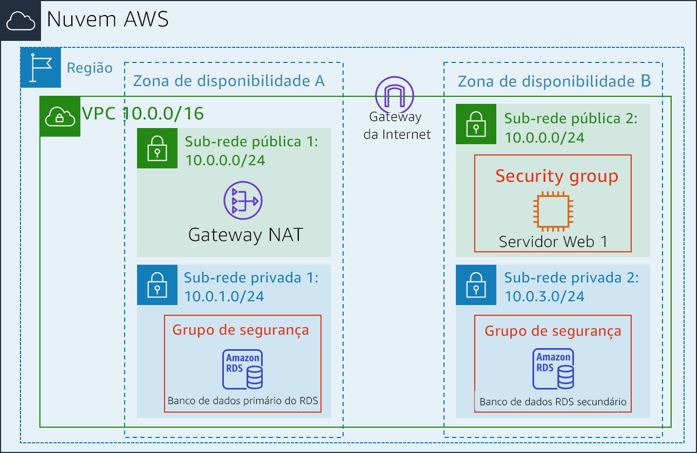
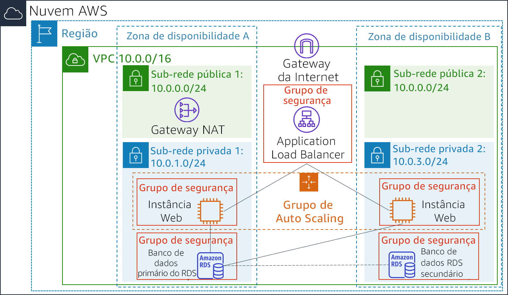

<header>
    <link rel="stylesheet" href="https://use.fontawesome.com/releases/v5.5.0/css/all.css" integrity="sha384-B4dIYHKNBt8Bc12p+WXckhzcICo0wtJAoU8YZTY5qE0Id1GSseTk6S+L3BlXeVIU" crossorigin="anonymous">
    <!-- Latest compiled and minified CSS -->
    <link rel="stylesheet" href="https://maxcdn.bootstrapcdn.com/bootstrap/3.3.7/css/bootstrap.min.css" integrity="sha384-BVYiiSIFeK1dGmJRAkycuHAHRg32OmUcww7on3RYdg4Va+PmSTsz/K68vbdEjh4u" crossorigin="anonymous">
    <!-- Optional theme -->
    <link rel="stylesheet" href="https://maxcdn.bootstrapcdn.com/bootstrap/3.3.7/css/bootstrap-theme.min.css" integrity="sha384-rHyoN1iRsVXV4nD0JutlnGaslCJuC7uwjduW9SVrLvRYooPp2bWYgmgJQIXwl/Sp" crossorigin="anonymous">
    <!-- Latest compiled and minified JavaScript -->
    
 </header>
 <!--include:Logo-->
 

# Laboratório 6: Ajuste a escala e o balanceamento de carga da arquitetura

<!-- Note to translators: This is based on Technical Essentials Lab 3. Copy the translation from there. Do not re-translate the whole document. -->

&nbsp;&nbsp;

**Versão 4.6.6 (TESS3) + alteração personalizada**

Este laboratório orienta você a usar os serviços Elastic Load Balancing (ELB) e Auto Scaling para balancear cargas e dimensionar automaticamente a infraestrutura.

O **Elastic Load Balancing** distribui automaticamente o tráfego de entrada das aplicações entre várias instâncias do Amazon EC2. Ele permite obter tolerância a falhas nas aplicações ao disponibilizar de forma transparente a capacidade necessária de balanceamento de carga para rotear o tráfego das aplicações.

O **Auto Scaling** ajuda a manter a disponibilidade da aplicação e permite aumentar ou reduzir a capacidade do Amazon EC2 de forma automática, de acordo com condições definidas por você. Você pode usar o Auto Scaling para ajudar a garantir que está executando o número desejado de instâncias do Amazon EC2. O Auto Scaling também pode aumentar automaticamente o número de instâncias do Amazon EC2 durante picos de demanda para manter a performance, e diminuir a capacidade durante períodos ociosos para reduzir os custos. O Auto Scaling é ideal para aplicações com padrões de demanda estáveis ou que passam por variações de utilização horárias, diárias ou semanais.

&nbsp;

**Objetivos**

Depois de concluir este laboratório, você será capaz de:

- Criar uma nova imagem de máquina da Amazon (AMI) por meio de uma instância em execução;
- Criar um balanceador de carga;
- Criar uma configuração de execução e um grupo de Auto Scaling;
- Ajustar a escala automaticamente de novas instâncias em uma sub-rede privada;
- Criar alarmes do Amazon CloudWatch e monitorar a performance da sua infraestrutura.

&nbsp;

**Duração**

Este laboratório tem duração aproximada de **30 minutos**.

&nbsp;

**Cenário**

Você começa com a seguinte infraestrutura:

&nbsp;

O estado final da infraestrutura é:

&nbsp;

&nbsp;

&nbsp;
___
## Acessar o Console de Gerenciamento da AWS

1. Na parte superior destas instruções, clique em Start Lab (Iniciar laboratório) para iniciar o laboratório.

   Um painel Start Lab (Iniciar laboratório) é aberto exibindo o status do laboratório.

2. Aguarde até ver a mensagem “**Lab status: in creation** (Status do laboratório: em criação)” e clique no **X** para fechar o painel Start Lab (Iniciar laboratório).

   **Observação**: pode levar aproximadamente 10 minutos ou mais para que o status do laboratório mude para “ready” (pronto).

3. Na parte superior destas instruções, clique em AWS

   Isso abrirá o Console de Gerenciamento da AWS em uma nova guia do navegador. O sistema fará o seu login automaticamente.

   **Dica**: se uma nova guia do navegador não for aberta normalmente, um banner ou um ícone na parte superior do navegador indicará que o navegador está impedindo que o site abra janelas pop-up. Clique no banner ou ícone e escolha "Allow pop ups" (Permitir pop-ups).

4. Organize a guia do Console de Gerenciamento da AWS para que ela seja exibida com estas instruções. Em um cenário ideal, você poderá ver as duas guias do navegador ao mesmo tempo, para facilitar o acompanhamento das etapas do laboratório.

&nbsp;
___
## Tarefa 1: Criar uma AMI para o Auto Scaling

Nesta tarefa, você criará uma AMI pelo _Servidor da Web 1_ existente. Isso salvará o conteúdo do disco de inicialização para que novas instâncias possam ser executadas com conteúdo idêntico.

5. No **Console de Gerenciamento da AWS**, no menu Services<i class="fas fa-angle-down"></i> (Serviços), clique em **EC2**.

6. No painel de navegação esquerdo, clique em **Instances** (Instâncias).

   Primeiro, você confirmará que a instância está em execução.

7. Aguarde até que as **Status Checks** (Verificações de status) do **Servidor da Web 1** exiba *2/2 checks passed* (2/2 verificações aprovadas). Clique em Refresh (Atualizar) <i class="fas fa-sync"></i> para atualizar.

   Agora, você criará uma AMI com base nessa instância.

8. Selecione <i class="far fa-check-square"></i> **Web Server 1** (Servidor da Web 1).

9. No menu Actions<i class="fas fa-angle-down"></i> (Ações), clique em **Image** (Imagem) > **Create Image** (Criar imagem) e configure:

   - **Image name** (Nome da imagem): `Web Server AMI (AMI do servidor da Web)`
   - **Image description** (Descrição da imagem): `Lab AMI for Web Server (AMI do laboratório para servidor da Web)`

10. Clique em Create Image (Criar imagem)

   A tela de confirmação exibe o **AMI ID** (ID da AMI) para a nova AMI.

11. Clique em Close (Fechar)

   Você usará essa AMI ao iniciar o grupo de Auto Scaling posteriormente no laboratório.

&nbsp;
___
## Tarefa 2: Criar um balanceador de carga

Nesta tarefa, você criará um balanceador de carga que pode balancear o tráfego entre várias instâncias EC2 e zonas de disponibilidade.

12. No painel de navegação à esquerda, clique em **Load Balancers (Balanceadores de carga)**.

13. Clique em Create Load Balancer (Criar balanceador de carga)

   Vários tipos diferentes de balanceador de carga são exibidos. Você usará um _Application Load Balancer_ que opera no nível de solicitação (camada 7), roteando o tráfego para os destinos (instâncias EC2, contêineres, endereços IP e funções do Lambda) com base no conteúdo da solicitação. Para obter mais informações, consulte: <a href="https://aws.amazon.com/elasticloadbalancing/features/#compare" target="_blank">Comparação de balanceadores de carga</a>

14. Em **Application Load Balancer**, clique em Create (Criar) e configure:

   - **Name** (Nome): `LabELB`
   - **VPC:** _Lab VPC_ (na seção **Availability Zones** (Zonas de disponibilidade))
   - **Availability Zones** (Zonas de disponibilidade): selecione <i class="far fa-check-square"></i> ambas para ver as sub-redes disponíveis.
   - Selecione **Public Subnet 1** (Sub-rede pública 1) e **Public Subnet 2** (Sub-rede pública 2)

   Isso configura o balanceador de carga para operar em várias zonas de disponibilidade.

15. Clique em Next: Configure Security Settings (Próximo: definir configurações de segurança).

   <i class="fas fa-comment"></i> Você pode ignorar o aviso _"Improve your load balancer's security." (Melhore a segurança do seu balanceador de carga)_.

16. Clique em Next: Configure Security Groups (Próximo: configurar grupos de segurança).

   Um _Web Security Group (Grupo de segurança da Web)_ já foi criado para você, o que permite o acesso HTTP.

17. Selecione <i class="far fa-check-square"></i> **Web Security Group** (Grupo de segurança da Web) e desmarque <i class="far fa-square"></i> **default** (padrão).

18. Clique em Next: Configure Routing (Próximo: configurar roteamento).

   O roteamento configura para onde enviar as solicitações que chegam no balanceador de carga. Você criará um _Grupo de destino_ que será usado pelo Auto Scaling.

19. Em **Name** (Nome), insira: `LabGroup`

20. Clique em Next: Register Targets (Próximo: registrar destinos).

   O Auto Scaling registrará automaticamente instâncias como destinos posteriormente no laboratório.

21. Clique em Next: Review (Próximo: revisão).

22. Clique em Create (Criar) e em Close (Fechar)

   O balanceador de carga mostrará um estado de _provisioning (provisionamento)_. Não há necessidade de esperar até que ele esteja pronto. Siga para a próxima etapa.

&nbsp;
___
## Tarefa 3: Criar uma configuração de execução e um grupo de Auto Scaling

Nesta tarefa, você criará uma _configuração de execução_ para seu grupo de Auto Scaling. Uma configuração de execução é um modelo que um grupo de Auto Scaling usa para iniciar instâncias do EC2. Ao criar uma configuração de execução, você especifica informações para as instâncias, como a AMI, o tipo de instância, um par de chaves, grupo de segurança e discos.

23. No painel de navegação à esquerda, clique em **Launch Configurations** (Configurações de execução).

24. Clique em Create launch configuration (Criar configuração de execução)

25. Defina estas configurações:

   - **Launch configuration name**  (Nome da configuração de execução): `LabConfig`

   - **Amazon Machine Image (AMI)** (Imagem de máquina da Amazon (AMI)): escolha *Web Server AMI (AMI do servidor da Web)*

   - **Instance type** (Tipo de instância):

      - Selecione Choose instance type (Escolher tipo de instância)
      - Selecione *t3.micro*
      - Selecione Choose (Escolher)

      **Observação:** se você tiver executado o laboratório na região us-east-1, selecione o tipo de instância **t2.micro**. Para localizar a região, procure no canto superior direito do console do Amazon EC2.

      **Observação:** se receber a mensagem de erro “Something went wrong. Please refresh and try again (Algo deu errado. Atualize e tente novamente)”, você poderá ignorá-la e continuar com o exercício.

   - **Configuração adicional**

      - **Monitoring** (Monitoramento): </i>Selecione <i class="far fa-check-square"></i> *Enable EC2 instance detailed monitoring within CloudWatch (Habilitar monitoramento detalhado de instância do EC2 no CloudWatch)*

      Isso permite que o Auto Scaling reaja rapidamente a alterações na utilização.

26. Em **Security groups** (Grupos de segurança), você definirá a configuração de execução para usar o _Web Security Group (Grupo de segurança da Web)_ que criou anteriormente.

   - Escolha **Select an existing security group** (Selecionar um grupo de segurança existente)
   - Selecione <i class="far fa-check-square"></i> **Web Security Group** (Grupo de segurança da Web)

27. Em **Key pair** (par de chaves), configure:

   - **Key pair options** (Opções de par de chaves): *Choose an existing key pair (Escolher um par de chaves existente)*
   - **Existing key pair** (par de chaves existente): vockey
   - Selecione <i class="far fa-check-square"></i> **I acknowledge...** (Eu reconheço...)
   - Clique em Create launch configuration (Criar configuração de execução)

   Agora, você criará um grupo de Auto Scaling que usa essa configuração de execução.

28. Marque a caixa de seleção para a configuração de execução *LabConfig*.

29. No menu Actions<i class="fas fa-caret-down"></i> (Ações), escolha *Create Auto Scaling group* (Criar grupo de Auto Scaling)

30. Insira o nome do grupo de Auto Scaling:

   - **Name** (Nome): `Lab Auto Scaling Group (Grupo de Auto Scaling do laboratório)`

31. Escolha Next (Próximo).

32. Na página **Network** (Rede), configure

   - **Network** (Rede): _Lab VPC (VPC de laboratório)_

      <i class="fas fa-comment"></i> Você pode ignorar a mensagem "No public IP address" (Sem endereço IP público)

   - **Subnet** (Sub-rede): selecione _Private Subnet 1 (10.0.1.0/24) (Sub-rede privada 1 [10.0.1.0/24])_**e** _Private Subnet 2 (10.0.3.0/24) (Sub-rede privada 2 [10.0.3.0/24])_

   Isso executará instâncias do EC2 em sub-redes privadas em ambas as zonas de disponibilidade.

33. Escolha Next (Próximo).

34. Em **Load balancing** (Balanceamento de carga):

   - Selecione <i class="far fa-check-square"></i> **Enable load balancing** (Habilitar balanceamento de carga)
   - Escolha **Application Load Balancer or Network Load Balancer** (Application Load Balancer ou Network Load Balancer)
   - **Escolha um grupo de destino para o balanceador de carga**: LabGroup

35. Em **Additional settings** (Configurações adicionais), selecione <i class="far fa-check-square"></i> **Habilitar coleta de métricas de grupo no CloudWatch**

   Essa ação captura métricas em intervalos de 1 minuto, o que permite que o Auto Scaling reaja rapidamente a mudanças nos padrões de uso.

36. Escolha Next (Próximo).

37. Em **Group Size** (Tamanho do grupo), configure:

   - **Desired capacity** (Capacidade desejada): 2
   - **Minimum capacity** (Capacidade mínima): 2
   - **Maximum capacity** (Capacidade máxima): 6

   Isso permitirá que o Auto Scaling adicione/remova instâncias automaticamente, mantendo sempre de 2 a 6 instâncias em execução.

38. Em **Scaling policies** (Políticas de escalabilidade), escolha *Target tracking scaling policy (política de escalabilidade de rastreamento de destino)* e configure:

   - **Lab policy name** (Nome da política do laboratório): `LabScalingPolicy`
   - **Metric type** (Tipo de métrica): _Average CPU Utilization (Utilização média de CPU)_
   - **Target value** (Valor de destino): `60`

   Isso informa ao Auto Scaling para manter uma utilização de CPU _média_ em _todas as instâncias_ de 60%. O Auto Scaling adicionará ou removerá automaticamente a capacidade conforme necessário para manter a métrica no valor de destino especificado ou próximo a ele. Ele se ajusta às flutuações na métrica devido a um padrão de carga flutuante.

39. Escolha Next (Próximo).

   O Auto Scaling pode enviar uma notificação quando ocorre um evento de escalabilidade. Você usará as configurações padrão.

40. Escolha Next (Próximo).

   As tags aplicadas ao grupo de Auto Scaling serão propagadas automaticamente para as instâncias executadas.

41. Escolha Add tag (Adicionar tag ) e configure o seguinte:

   - **Key** (Chave): `Name (Nome)`
   - **Value** (Valor): `Lab Instance (Instância de laboratório)`

42. Clique em Next (Próximo)

43. Revise os detalhes de seu grupo de Auto Scaling e clique em Create Auto Scaling group (Criar grupo de Auto Scaling). Se receber a mensagem de erro **Failed to create Auto Scaling group** (Falha ao criar o grupo de Auto Scaling), clique em Retry Failed Tasks (Tentar tarefas com falha novamente).

   O grupo de Auto Scaling mostrará inicialmente uma contagem de instâncias igual a zero, mas novas instâncias serão executadas para atingir a contagem **Desired** (Desejada) de 2 instâncias.

&nbsp;
___
## Tarefa 4: Verificar se o balanceamento de carga está funcionando

Nesta tarefa, você verificará se o balanceamento de carga está funcionando corretamente.

44. No painel de navegação esquerdo, clique em **Instances** (Instâncias).

   Você deve ver duas novas instâncias chamadas de **Lab Instance** (Instância do laboratório). Elas foram iniciadas pelo Auto Scaling.

   <i class="fas fa-comment"></i> Se as instâncias ou nomes não forem exibidos, aguarde 30 segundos e clique em atualizar <i class="fas fa-sync"></i>no canto superior direito.

   Primeiro, você confirmará que as novas instâncias foram aprovadas na verificação de integridade.

45. No painel de navegação à esquerda, clique em **Target Groups** (Grupos de destino), na seção _Load Balancing (Balanceamento de carga)_.

46. Escolha *LabGroup*

47. Clique na guia **Targets** (Destinos).

   Dois destinos **Lab Instance** (Instância do laboratório) devem ser listados para esse grupo de destino.

48. Aguarde até que o **Status** de ambas as instâncias mude para *healthy (íntegro)*. Clique em atualizar <i class="fas fa-sync"></i> no canto superior direito para verificar se há atualizações.

   O status _Healthy (íntegro)_ indica que a instância passou na verificação de integridade do balanceador de carga. Isso significa que o balanceador de carga enviará tráfego para a instância.

   Agora você pode acessar o grupo de Auto Scaling por meio do balanceador de carga.

49. No painel de navegação à esquerda, clique em **Load Balancers** (Balanceadores de carga).

50. No painel inferior, copie o **DNS name** (Nome do DNS) do balanceador de carga, omitindo “(A Record)” (Registro A).

   Ele deve ser semelhante a: _LabELB-1998580470.us-west-2.elb.amazonaws.com_

51. Abra uma nova guia do navegador da Web, cole o nome DNS que você acabou de copiar e pressione Enter.

   O aplicativo deve aparecer em seu navegador. Isso indica que o load balancer recebeu a solicitação, a enviou para uma das instâncias do EC2 e, em seguida, repassou o resultado.

&nbsp;
___
## Tarefa 5: testar o Auto Scaling

Você criou um grupo de Auto Scaling com um mínimo de duas instâncias e um máximo de seis instâncias. Atualmente, duas instâncias estão em execução porque o tamanho mínimo é duas e o grupo não está atualmente sob nenhuma carga. Agora, você aumentará a carga para fazer com que o Auto Scaling acrescente instâncias adicionais.

52. Volte para o Console de Gerenciamento da AWS, mas não feche a guia da aplicação. Você retornará a ele em breve.

53. No menu Services<i class="fas fa-angle-down"></i> (Serviços), clique em **CloudWatch**.

54. No painel de navegação à esquerda, clique em **Alarms** (Alarmes) (*não em* **ALARM** (ALARME)).

   Dois alarmes serão exibidos. Eles foram criados automaticamente pelo grupo de Auto Scaling. Eles manterão automaticamente a carga média da CPU próxima a 60%, permanecendo também dentro da limitação de ter duas a seis instâncias.

   ​    <i class="fas fa-exclamation-triangle" style="color:red"></i> **Observação**: siga estas etapas somente se você não vir os alarmes em 60 segundos.

   - No menu Services<i class="fas fa-angle-down"></i> (Serviços), clique em **EC2**.
   - No painel de navegação à esquerda, clique em **Auto Scaling Groups** (Grupos de Auto Scaling) e, em seguida, clique em **Scaling Policies** (Políticas de escalabilidade).
   - Clique em Actions (Ações) e em **Edit** (Editar).
   - Altere o **Target Value** (Valor de destino) para `50`.
   - Clique em Save (Salvar).
   - No menu Services<i class="fas fa-angle-down"></i> (Serviços), clique em **CloudWatch**.
   - No painel de navegação à esquerda, clique em **Alarms** (Alarmes) (*não em* **ALARM** (ALARME)) e confirme se vê dois alarmes.

55. Clique no alarme **OK**, que tem _AlarmHigh (Alarme alto)_ no nome.

   <i class="fas fa-comment"></i> Se nenhum alarme estiver mostrando **OK**, aguarde um minuto e clique em Refresh (Atualizar) <i class="fas fa-sync"></i> no canto superior direito até que o status do alarme mude.

   O **OK** indica que o alarme _não_ foi acionado. É o alarme para **CPU Utilization > 60** (Utilização de CPU > 60), que adicionará instâncias quando a CPU média estiver alta. O gráfico deve mostrar níveis muito baixos de CPU no momento.

   Agora, você informará ao aplicativo para executar cálculos que devem aumentar o nível de CPU.

56. Volte para a guia do navegador com a aplicação Web.

57. Clique em **Load Test** (Carregar teste) ao lado do logotipo da AWS.

   Isso fará com que a aplicação gere cargas elevadas. A página do navegador será atualizada automaticamente para que todas as instâncias no grupo de Auto Scaling gerem carga. Não feche esta guia.

58. Volte para a guia do navegador com o console do **CloudWatch**.

   Em menos de 5 minutos, o alarme **AlarmLow** (Alarme baixo) deverá mudar para **OK** e o status do alarme **AlarmHigh** (Alarme alto) deverá mudar para *ALARM* (ALARME).

   <i class="fas fa-comment"></i> Você pode clicar em Refresh (Atualizar) <i class="fas fa-sync"></i> no canto superior direito a cada 60 segundos para atualizar a exibição.

   Você deve ver o gráfico **AlarmHigh**(Alarme alto) indicando uma porcentagem crescente de CPU. Depois de passar da linha de 60% por mais de 3 minutos, o Auto Scaling acionará a adição de novas instâncias.

59. Aguarde até que o alarme **AlarmHigh** (Alarme alto) entre no estado _ALARM (ALARME)_.

   Agora você pode visualizar as instâncias adicionais que foram executadas.

60. No menu Services<i class="fas fa-angle-down"></i> (Serviços), clique em **EC2**.

61. No painel de navegação esquerdo, clique em **Instances** (Instâncias).

   Agora deve haver mais de duas instâncias rotuladas **Lab Instance** (Instância do laboratório) em execução. As novas instâncias foram criadas pelo Auto Scaling em resposta ao alarme.

&nbsp;
___
## Tarefa 6: Encerrar o servidor da Web 1

Nesta tarefa, você encerrará o _Servidor da Web 1_. Essa instância foi usada para criar a AMI usada por seu grupo de Auto Scaling, mas ela não é mais necessária.

62. Selecione <i class="far fa-check-square"></i> **Web Server 1** (Servidor da Web 1) (e verifique se é a única instância selecionada).

63. No menu Actions<i class="fas fa-angle-down"></i> (Ações), clique em **Instance State** (Estado da instância) > **Terminate** (Encerrar).

64. Escolha Yes, Terminate (Sim, encerrar).

&nbsp;
___
## Laboratório concluído

<i class="icon-flag-checkered"></i> Parabéns! Você concluiu o laboratório.

65. Clique em End Lab (Encerrar laboratório) na parte superior desta página e, em seguida, clique em Yes (Sim) para confirmar que você deseja encerrar o laboratório.

   Um painel será exibido com a mensagem: "DELETE has be initiated... You may close this message box now." (a EXCLUSÃO foi iniciada... Você pode fechar esta caixa de mensagem agora).

66. Clique no **X** no canto superior direito para fechar o painel.

   Envie um e-mail com feedback, sugestões ou correções para: *aws-course-feedback@amazon.com*
