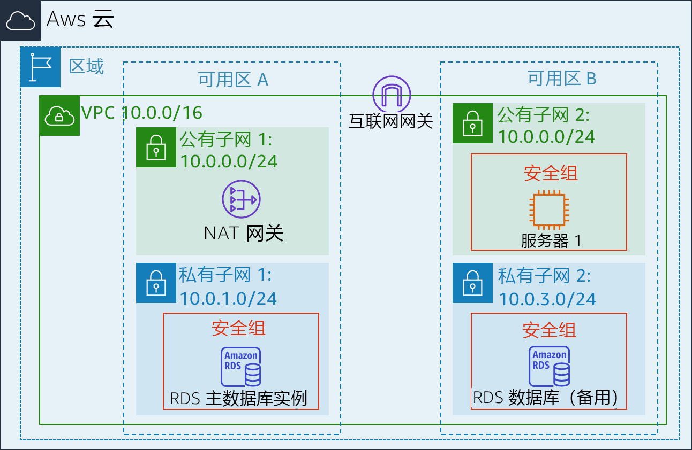
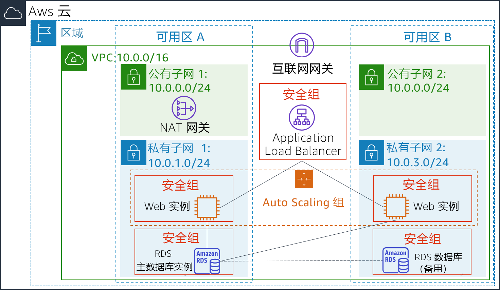

<header>
    <link rel="stylesheet" href="https://use.fontawesome.com/releases/v5.5.0/css/all.css" integrity="sha384-B4dIYHKNBt8Bc12p+WXckhzcICo0wtJAoU8YZTY5qE0Id1GSseTk6S+L3BlXeVIU" crossorigin="anonymous">
    <!-- Latest compiled and minified CSS -->
    <link rel="stylesheet" href="https://maxcdn.bootstrapcdn.com/bootstrap/3.3.7/css/bootstrap.min.css" integrity="sha384-BVYiiSIFeK1dGmJRAkycuHAHRg32OmUcww7on3RYdg4Va+PmSTsz/K68vbdEjh4u" crossorigin="anonymous">
    <!-- Optional theme -->
    <link rel="stylesheet" href="https://maxcdn.bootstrapcdn.com/bootstrap/3.3.7/css/bootstrap-theme.min.css" integrity="sha384-rHyoN1iRsVXV4nD0JutlnGaslCJuC7uwjduW9SVrLvRYooPp2bWYgmgJQIXwl/Sp" crossorigin="anonymous">
    <!-- Latest compiled and minified JavaScript -->
    
 </header>
 <!--include:Logo-->
 

# 实验 6：对架构进行扩展和负载均衡

<!-- Note to translators: This is based on Technical Essentials Lab 3. Copy the translation from there. Do not re-translate the whole document. -->

&nbsp;&nbsp;

**版本 4.6.6 (TESS3) + 自定义更改**

本实验将指导您使用 Elastic Load Balancing (ELB) 和 Auto Scaling 服务对基础设施进行负载均衡和自动扩展。

**Elastic Load Balancing** 可以在多个 Amazon EC2 实例间自动分配传入的应用程序流量。它可以让您实现应用程序容错能力，从而无缝提供路由应用程序流量所需的负载均衡容量。

使用 **Auto Scaling**，您可以维持应用程序的可用性，并且根据您定义的条件自动扩展或缩减 Amazon EC2 的容量。您可以使用 Auto Scaling 来帮助确保您运行的 Amazon EC2 实例数量满足需求。此外，Auto Scaling 还可以在需求峰值期间自动增加 Amazon EC2 实例数量以便保持性能，并在需求较低时自动减少容量以便降低成本。Auto Scaling 不仅非常适合需求模式稳定的应用程序，也适合使用模式每小时、每天或每周都不同的应用程序。

&nbsp;

**目标**

完成本实验后，您可以：

- 从正在运行的实例创建 Amazon 系统映像 (AMI)。
- 创建负载均衡器。
- 创建启动配置和 Auto Scaling 组。
- 自动在私有子网中扩展新实例
- 创建 Amazon CloudWatch 警报并监控基础设施性能。

&nbsp;

**持续时间**

本实验大约需要 **30 分钟**。

&nbsp;

**场景**

您将从以下基础设施开始：

&nbsp;

基础设施的最终状态为：

&nbsp;

&nbsp;

&nbsp;
___
## 访问 AWS 管理控制台

1. 在这些说明的顶部，单击 Start Lab（启动实验）启动您的实验。

   “Start Lab”（启动实验）面板随即会打开，其中显示了实验状态。

2. 请耐心等待，直到您看到“**Lab status: in creation**”（实验状态：正在创建）消息，然后单击 **X**，关闭“Start Lab”（启动实验）面板。

   **注意**：实验状态更改为就绪可能需要大约 10 分钟或更长时间。

3. 在这些说明的顶部，单击 AWS

   在您执行此操作后，AWS 管理控制台将会在一个新的浏览器标签页中打开。您将自动登录系统。

   **提示：**如果未打开新的浏览器选项卡，则您的浏览器顶部通常会出现一个横幅或图标，表明您的浏览器阻止该网站打开弹出窗口。单击横幅或图标，然后选择“Allow pop ups”（允许弹出窗口）。

4. 排列 AWS 管理控制台选项卡，使其与这些说明一起显示。理想情况下，您将能够同时看到这两个浏览器选项卡，以便更轻松地执行实验步骤。

&nbsp;
___
## 任务 1：为 Auto Scaling 创建 AMI

在此任务中，您将从现有 _Web 服务器 1_ 创建 AMI。这将节省启动磁盘的空间，以便新实例启动时拥有相同的容量。

5. 在 **AWS 管理控制台**的 Services<i class="fas fa-angle-down"></i>（服务）菜单上，单击 **EC2**。

6. 在左侧导航窗格中，单击 **Instances**（实例）。

   首先，您将确认该实例正在运行。

7. 请耐心等待，直到 **Web Server 1** 的 **Status Checks**（状态检查）显示 *2/2 checks passed*（2/2 检查已通过）。单击刷新 <i class="fas fa-sync"></i> 进行更新。

   接下来，您将根据此实例创建 AMI。

8. 选择 <i class="far fa-check-square"></i> **Web Server 1**。

9. 在 Actions<i class="fas fa-angle-down"></i>（操作）菜单中，单击 **Image**（映像）&gt; **Create Image**（创建映像），然后进行以下配置：

   - **Image name**（映像名称）：`Web Server AMI`（Web 服务器 AMI）
   - **Image description**（映像描述）：`Lab AMI for Web Server`（Web 服务器的实验 AMI）

10. 单击 Create Image（创建映像）

   确认屏幕将显示新 AMI 的**AMI ID**。

11. 单击 Close（关闭）

   您稍后在实验中启动 Auto Scaling 组时将使用此 AMI。

&nbsp;
___
## 任务 2：创建负载均衡器

在此任务中，您将创建一个负载均衡器，用于平衡多个 EC2 实例和多个可用区之间的流量。

12. 在左侧导航窗格中，单击 **Load Balancers**（负载均衡器）。

13. 单击 Create Load Balancer（创建负载均衡器）

   系统会显示多个不同类型的负载均衡器。您将使用运行于请求级别（第 7 层）的 _Application Load Balancer_（应用程序负载均衡器），根据请求的内容将流量路由至 EC2 实例、容器、IP 地址和 Lambda 函数等目标。有关更多信息，请访问： <a href="https://aws.amazon.com/elasticloadbalancing/features/#compare" target="_blank">负载均衡器对比</a>

14. 在 **Application Load Balancer**（应用程序负载均衡器）下，单击 Create（创建）并进行以下配置：

   - **Name**（名称）：`LabELB`
   - **VPC：**_Lab VPC_（在 **Availability Zones**（可用区）部分）
   - **Availability Zone（可用区）**：将<i class="far fa-check-square"></i>两个都选中以查看可用子网。
   - 选择 **Public Subnet 1**（公有子网 1）和 **Public Subnet 2**（公有子网 2）

   此操作将配置负载均衡器以跨多个可用区运行。

15. 单击 Next: Configure Security Settings（下一步：配置安全设置）

   <i class="fas fa-comment"></i>您可以忽略_“Improve your load balancer's security.”_（请加强您的负载均衡器安全）警告。

16. 单击 Next: Configure Security Groups（下一步：配置安全组）

   系统已为您创建了一个 _Web 安全组_，该安全组允许 HTTP 访问。

17. 选择 <i class="far fa-check-square"></i> **Web Security Group**（Web 安全组）并取消选择 <i class="far fa-square"></i> **默认**。

18. 单击 Next: Configure Routing（下一步：配置路由）

   路由配置了向哪里发送负载均衡器接收的请求。您将创建一个_目标组_，供 Auto Scaling 使用。

19. 对于 **Name**（名称），请输入 `LabGroup`

20. 单击 Next: Register Targets（下一步：注册目标）

   Auto Scaling 稍后会在实验中自动将实例注册为目标。

21. 单击 Next: Review（下一步：审核）

22. 单击 Create（创建），然后单击 Close（关闭）

   负载均衡器将显示状态 _provisioning_（正在预置）。无需等到就绪状态。请继续执行下一任务。

&nbsp;
___
## 任务 3：创建启动配置和 Auto Scaling 组

在此任务中，您将为 Auto Scaling 组创建_启动配置_。启动配置是指 Auto Scaling 组用于启动 EC2 实例的模板。创建启动配置时，您需指定实例的信息，例如 AMI、实例类型、一个密钥对、安全组和磁盘。

23. 在左侧导航窗格中，单击 **Launch Configurations**（启动配置）。

24. 单击 Create launch configuration（创建启动配置）

25. 配置以下设置：

   - **Launch configuration name**（启动配置名称）：`LabConfig`

   - **Amazon Machine Image (AMI)**（Amazon 机器映像 (AMI)）选择 *Web Server AMI*（Web 服务器 AMI ）

   - **Instance type**（实例类型）：

      - 选择 Choose instance type（选择实例类型）
      - 选择 *t3.micro *
      - 选择 Choose（选择）。

      **注意：**如果已在 us-east-1 区域中启动了实验，请选择 **t2.micro** 实例类型。要查找区域，请查看 Amazon EC2 控制台的右上角。

      **注意：**如果收到错误消息“Something went wrong.Please refresh and try again.”（遇到错误。请刷新，然后重试），您可以忽略它，继续进行练习。

   - **其他配置**

      - **Monitoring**（监控）：</i>选择 <i class="far fa-check-square"></i> *Enable EC2 instance detailed monitoring within CloudWatch*（在 CloudWatch 中启用 EC2 实例详细监控）。

      这让 Auto Scaling 能够快速响应不断变化的利用率。

26. 在 _Security groups_（安全组）下，您将配置启动配置，以便使用已为您创建的 **Web 安全组**。

   - 选择 **Select an existing security group**（选择现有安全组）
   - 选择 <i class="far fa-check-square"></i> **Web Security Group**（Web 安全组）

27. 在 **Key pair**（密钥对）下配置：

   - **Key pair options**（密钥对选项）：*Choose an existing key pair*（选择现有的密钥对）
   - **Existing key pair**（现有密钥对）：vockey
   - 选择 <i class="far fa-check-square"></i> **I acknowledge...**（我确认...）
   - 单击 Create launch configuration（创建启动配置）

   现在，您将创建一个使用此启动配置的 Auto Scaling 组。

28. 选中 *LabConfig* 启动配置的复选框。

29. 从操作<i class="fas fa-caret-down"></i>菜单中，选择 *Create Auto Scaling group*（创建 Auto Scaling 组）

30. 输入 Auto Scaling 组名称：

   - **Name**（名称）：`Lab Auto Scaling Group`（实验 Auto Scaling 组）

31. 选择 Next（下一步）

32. 在 **Network**（网络）页面上配置

   - **Network**（网络）：_Lab VPC_

      <i class="fas fa-comment"></i>您可以忽略有关“No public IP address”（无公有 IP 地址）的消息

   - **Subnet**（子网）：选择_Private Subnet 1 (10.0.1.0/24)_（私有子网 1 (10.0.1.0/24)）**和 **_Private Subnet 2 (10.0.3.0/24)_（私有子网 2 (10.0.3.0/24)）

   此操作将在两个可用区的私有子网中启动 EC2 实例。

33. 选择 Next（下一步）

34. 在 **Load balancing**（负载均衡）下：

   - 选择 <i class="far fa-check-square"></i> **Enable load balancing**（启用负载均衡）
   - 选择 **Application Load Balancer 或 Network Load Balancer**
   - **Choose a target group for your load balancer**（选择您的负载均衡器的目标组）：LabGroup

35. 在 **Additional settings**（附加设置）下，选择 <i class="far fa-check-square"></i> **Enable group metrics collection within CloudWatch**（在 CloudWatch 中启用组指标收集）

   此操作将每隔 1 分钟捕获一次指标，让 Auto Scaling 能够快速响应不断变化的使用模式。

36. 选择 Next（下一步）

37. 在 **Group Size**（组大小）下，进行以下配置：

   - **Desired capacity**（所需容量）：2
   - **Minimum capacity**（最小容量）：2
   - **Maximum capacity**（最大容量）：6

   此操作将允许 Auto Scaling 自动添加/删除实例，始终保持 2 到 6 个实例在运行。

38. 在 **Scaling policies**（扩展策略）下，选择 *Target tracking scaling policy*（目标跟踪扩展策略）并配置：

   - **Lab policy name**（实验室策略名称）：`LabScalingPolicy`
   - **Metric type**（指标类型）：_Average CPU Utilization_（平均 CPU 使用率）
   - **Target value**（目标值）：`60`

   此值告诉 Auto Scaling 将_所有实例_的_平均_ CPU 使用率保持在 60%。Auto Scaling 会根据需要自动添加或删除容量，以将指标保持在指定的目标值或接近指定的目标值。它会调整以适应因不断变化的负载模式而造成的指标波动。

39. 选择 Next（下一步）

   Auto Scaling 可以在发生扩展事件时发送通知。您将使用默认设置。

40. 选择 Next（下一步）

   系统会将应用于 Auto Scaling 组的标签自动传播到已启动的实例。

41. 选择 Add Tag（添加标签）并进行以下配置：

   - **Key**（键）：`Name`
   - **Value**（值）：`Lab Instance`（实验实例）

42. 单击 Next（下一步）

43. 查看 Auto Scaling 组的详细信息，然后单击 Create Auto Scaling group（创建 Auto Scaling 组）。如果您遇到 Failed to create Auto Scaling group（无法创建 Auto Scaling 组）错误，请单击 **Retry Failed Tasks**（重试失败的任务）。

   您的 Auto Scaling 组最初显示的实例计数为零，但系统将启动新实例以到达**理想**计数 2。

&nbsp;
___
## 任务 4：验证负载均衡是否正常运行

在此任务中，您将验证负载均衡是否正常运行。

44. 在左侧导航窗格中，单击 **Instances**（实例）。

   您应该看到两个名为**实验实例**的新实例。这些实例由 Auto Scaling 启动。

   <i class="fas fa-comment"></i>如果您未看到实例或名称，请等待 30 秒，然后单击右上角的刷新 <i class="fas fa-sync"></i>。

   首先，您需要确认新的实例已通过其运行状况检查。

45. 在左侧导航窗格中，单击 _Load Balancing_（负载均衡）部分中的 **Target Groups**（目标组）。

46. 选择 *LabGroup*

47. 单击 **Targets**（目标）选项卡。

   此目标组应该列有两个 **Lab Instance**（实验实例）目标。

48. 等到这两个实例的 **Status**（状态）均转变为 *healthy*（运行正常）。单击右上角的刷新 <i class="fas fa-sync"></i> 来检查更新。

   _Healthy_（运行正常）表示实例已通过负载均衡器的运行状况检查。这意味着，负载均衡器会将流量发送到实例。

   现在，您可以通过负载均衡器访问 Auto Scaling 组。

49. 在左侧导航窗格中，单击 **Load Balancers**（负载均衡器）。

50. 在下方窗格中，复制负载均衡器的 **DNS 名称**，确保忽略“（A 记录）”。

   它应类似于：_LabELB-1998580470.us-west-2.elb.amazonaws.com_

51. 打开新的 Web 浏览器选项卡、粘贴您刚刚复制的 DNS 名称，然后按 Enter 键。

   应用程序应显示在您的浏览器中。这表示负载均衡器收到了请求、将请求发送到其中一个 EC2 实例，然后返回结果。

&nbsp;
___
## 任务 5：测试 Auto Scaling

您已经创建了一个 Auto Scaling 组，该组包含至少两个实例，最多六个实例。目前有两个实例正在运行，因为最小大小为 2，且该组当前没有任何负载。现在，您将增加负载以引发 Auto Scaling 添加更多实例。

52. 返回 AWS 管理控制台，但不要关闭应用程序选项卡，因为您很快还要返回。

53. 在 Services<i class="fas fa-angle-down"></i>（服务）菜单上，单击 **CloudWatch**。

54. 在左侧导航窗格中，单击 **Alarms**（警报）（*不是* **ALARM**）。

   此时将显示两个警报。这些警报由 Auto Scaling 组自动创建。它们将自动保持平均 CPU 负载接近 60%，同时保持不超过两个到六个实例的限制。

   ​    <i class="fas fa-exclamation-triangle" style="color:red"></i> **注意**：请仅在 60 秒内未看到警报时按照以下步骤操作。

   - 在 Services<i class="fas fa-angle-down"></i>（服务）菜单上，单击 **EC2**。
   - 在左侧导航窗格中，单击 **Auto Scaling Groups**（Auto Scaling 组），然后单击 **Scaling Policies**（扩展策略）。
   - 单击 Actions（操作）和 **Edit**（编辑）。
   - 将 **Target Value**（目标值）更改为 `50`。
   - 单击 Save（保存）。
   - 在 Services<i class="fas fa-angle-down"></i>（服务）菜单上，单击 **CloudWatch**。
   - 在左侧导航窗格中，单击 **Alarms**（警报）（*不是* **ALARM**），确认您是否看到了两个警报。

55. 单击 **OK**（确定）警报，其名称中包含 _AlarmHigh_。

   <i class="fas fa-comment"></i>如果警报未显示 **OK**（确定），请等待一分钟，然后单击右上角的刷新 <i class="fas fa-sync"></i>，直到警报状态改变。

   **OK**（确定）表示警报_尚未_被触发。它是针对 **CPU 使用率超过 60%** 的警报，当平均 CPU 高时，系统会添加实例。此图表应显示目前 CPU 很低。

   现在，您可以通知应用程序执行计算，用于提高 CPU 水平。

56. 返回显示 Web 应用程序的浏览器选项卡。

57. 单击 AWS 徽标旁边的 **Load Test**（负载测试）。

   这将导致应用程序生成高负载。浏览器页面将自动刷新，以便 Auto Scaling 组中的所有实例均将生成负载。请勿关闭此标签页。

58. 返回显示 **CloudWatch** 控制台的浏览器选项卡。

   在 5 分钟内，**AlarmLow** 警报应更改为 **OK**（确定），**AlarmHigh** 警报状态应更改为 *ALARM*（警报）。

   <i class="fas fa-comment"></i>您可以每 60 秒单击一次右上角的“Refresh”（刷新）<i class="fas fa-sync"></i> 以更新显示内容。

   您应该可以看到，**AlarmHigh** 图表显示 CPU 使用率正在提高。一旦超过 60% 的限制的时间超过 3 分钟，便将触发 Auto Scaling 添加更多实例。

59. 等到 **AlarmHigh** 警报进入 _ALARM_（警报）状态。

   现在，您可以查看已启动的其他实例。

60. 在 Services<i class="fas fa-angle-down"></i>（服务）菜单上，单击 **EC2**。

61. 在左侧导航窗格中，单击 **Instances**（实例）。

   现在，应该有两个以上标记为 **Lab Instance**（实验实例）的实例正在运行。Auto Scaling 为响应警报创建了新实例。

&nbsp;
___
## 任务 6：终止 Web 服务器 1

在此任务中，您将终止 _Web 服务器 1_。此实例用于创建供 Auto Scaling 组使用的 AMI，但现在不需要了。

62. 选择 <i class="far fa-check-square"></i> **Web Server 1**（Web 服务器 1），并确保它是唯一选中的实例。

63. 在 Actions<i class="fas fa-angle-down"></i>（操作）菜单中，依次单击 **Instance State**（实例状态）> **Terminate**（终止）。

64. 选择 Yes, Terminate（是，请终止）

&nbsp;
___
## 实验完成

<i class="icon-flag-checkered"></i>恭喜！您已完成本实验。

65. 单击此页面顶部的 End Lab（结束实验），然后单击 Yes（是）确认您要结束实验。

   此时将显示一个面板，指示“DELETE has been initiated...You may close this message box now.”（删除操作已启动...您现在可以关闭此消息框。）

66. 单击右上角的 **X** 关闭面板。

   如有反馈、建议或更正，请发送电子邮件至：*aws-course-feedback@amazon.com*
