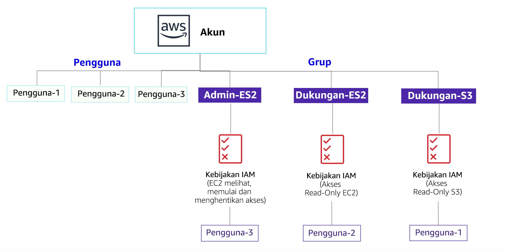
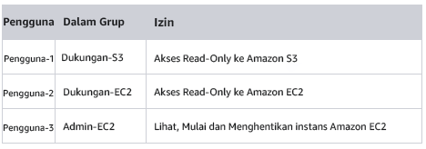

# Lab 1: Pengantar AWS IAM

<!-- Note to translators: This is based on SPL-66. Copy the translation from there. Do not re-translate the whole document. -->

<!-- Copied from Version 3.1.2 (spl66) -->

**AWS Identity and Access Management (IAM)** adalah layanan web yang memungkinkan pelanggan Amazon Web Services (AWS) mengelola pengguna dan izin pengguna di AWS. Dengan IAM, Anda dapat secara terpusat mengelola **pengguna**, **kredensial keamanan** seperti kunci akses, dan **izin** yang mengontrol sumber daya AWS mana yang dapat diakses oleh pengguna.

## Topik yang dibahas

Lab ini akan mendemonstrasikan:

* Menjelajahi **Pengguna dan Grup IAM**yang telah dibuat sebelumnya
* Memeriksa **kebijakan IAM** sebagaimana diterapkan ke grup yang telah dibuat sebelumnya
* Mengikuti **skenario dunia nyata**, menambahkan pengguna ke grup dengan kemampuan tertentu diaktifkan
* Menemukan dan menggunakan **URL masuk IAM**
* **Bereksperimen** dengan efek kebijakan pada akses layanan

&nbsp;
**Layanan AWS lainnya**

Selama lab ini, Anda mungkin menerima pesan kesalahan saat melakukan tindakan di luar langkah-langkah dalam panduan lab ini. Pesan ini tidak akan memengaruhi kemampuan Anda untuk menyelesaikan lab.

&nbsp;
**AWS Identity and Access Management**

AWS Identity and Access Management (IAM) dapat digunakan untuk:

* **Mengelola Pengguna IAM dan akses mereka:** Anda dapat membuat pengguna dan menetapkan kredensial keamanan individu (kunci akses, kata sandi, dan perangkat autentikasi multifaktor) untuk mereka. Anda dapat mengelola izin untuk mengontrol operasi yang dapat dijalankan Pengguna.

* **Mengelola Peran IAM dan izin mereka:** Peran IAM mirip dengan Pengguna, dalam hal ini AWS Identity dengan kebijakan izin yang menentukan apa yang dapat dan tidak dapat dilakukan oleh identifikasi di AWS. Namun, sebagai ganti dikaitkan dengan unik dengan satu orang, Peran ditujukan untuk *dapat diambil* oleh siapa pun yang membutuhkannya.

* **Mengelola pengguna gabungan dan izin mereka:** Anda dapat mengaktifkan *federasi identitas* untuk mengizinkan pengguna yang ada dalam perusahaan Anda mengakses AWS Management Console, memanggil API AWS, dan mengakses sumber daya, tanpa perlu membuat Pengguna IAM untuk setiap identitas.

**Durasi**

Diperlukan sekitar **40 menit ** untuk menyelesaikan lab ini.

&nbsp;
&nbsp;
## Mengakses AWS Management Console

1. Di bagian atas instruksi ini, klik Start Lab (Mulai Lab) untuk meluncurkan lab Anda.

   Panel Start Lab (Mulai Lab) terbuka dan menampilkan status lab. Dalam kotak dialog **Start Lab** (Mulai Lab) yang terbuka, perhatikan Region AWS, karena Anda akan perlu untuk merujuk ke sini nanti di lab ini.

2. Tunggu hingga Anda melihat pesan "**Lab status: ready**" (Status lab: siap), kemudian klik **X** untuk menutup panel Start Lab (Mulai Lab).

3. Di bagian atas instruksi ini, klik AWS

   Tindakan ini akan membuka AWS Management Console di tab browser baru. Secara otomatis, sistem ini akan memasukkan Anda.

   **Kiat**: Jika tab browser baru tidak terbuka, biasanya akan ada spanduk atau ikon di bagian atas browser Anda yang menunjukkan bahwa browser Anda mencegah situs membuka jendela pop-up. Klik spanduk atau ikon lalu pilih "Allow pop ups" (Izinkan pop-up).

4. Mengatur tab AWS Management Console agar ditampilkan bersama instruksi ini. Idealnya, Anda akan dapat melihat kedua tab browser ini sekaligus, untuk mempermudah mengikuti langkah-langkah lab.

&nbsp;
&nbsp;
## Tugas 1: Jelajahi Pengguna dan Grup.

Dalam tugas ini, Anda akan menjelajahi Pengguna dan Grup yang telah dibuat untuk Anda di IAM.

5. Di **AWS Management Console**, pada menu **Services** (Layanan), klik **IAM**.

6. Di panel navigasi di sebelah kiri, klik **Users** (Pengguna).

   Pengguna IAM berikut telah dibuat untuk Anda:

   * pengguna-1
   * pengguna-2
   * pengguna-3

7. Klik **pengguna-1**.

   Ini akan membawa Anda ke halaman ringkasan untuk pengguna-1. Tab **Permissions** (Izin) akan ditampilkan.

8. Perhatikan bahwa pengguna-1 tidak memiliki izin apa pun.

9. Klik tab **Group** (Grup) .

   pengguna-1 juga bukan anggota dari kelompok mana pun.

10. Klik tab **Security credentials** (Kredensial keamanan).

   pengguna-1 diberikan **Console password** (kata sandi Console)

11. Di panel navigasi di sebelah kiri, klik **Groups** (Grup).

   Grup berikut telah dibuat untuk Anda:

   * EC2-Admin

   * EC2-Dukungan

   * S3-Dukungan

12. Klik grup **EC2-Support** (EC2-Dukungan).

   Ini akan membawa Anda ke halaman ringkasan untuk grup **EC2-Support** (EC2-Dukungan).

13. Klik tab **Permissions** (Izin).

   Grup ini memiliki Kebijakan yang Dikelola terkait dengan itu, yang disebut **AmazonEC2ReadOnlyAccess**. Kebijakan yang Dikelola adalah kebijakan yang dibangun sebelumnya (yang dibangun oleh AWS atau oleh administrator) yang dapat dipasangkan ke IAM Pengguna dan Grup. Saat kebijakan tersebut diperbarui, perubahan kebijakan akan segera berlaku terhadap semua Pengguna dan Grup yang dipasangkan pada kebijakan.

14. Di bawah **Actions** (Tindakan), klik tautan **Show Policy** (Tampilkan Kebijakan).

   Sebuah kebijakan mendefinisikan tindakan apa yang diperbolehkan atau ditolak untuk sumber daya AWS tertentu. Kebijakan ini memberikan izin untuk Mencantumkan dan Menguraikan informasi mengenai EC2, Elastic Load Balancing, CloudWatch, dan Auto Scaling. Kemampuan untuk melihat sumber daya, tetapi tidak memodifikasinya, sangat ideal untuk menetapkan peran Dukungan.

   Struktur dasar pernyataan dalam Kebijakan IAM adalah:

   * **Efek** mengatakan apakah akan *Izinkan* atau *Tolak* izin.

   * **Tindakan** menentukan panggilan API yang dapat dilakukan terhadap Layanan AWS (misalnya, *cloudwatch:ListMetrics*).

   * **Sumber daya** mendefinisikan ruang lingkup entitas yang dicakup oleh aturan kebijakan (misalnya, bucket Amazon S3 tertentu atau instans Amazon EC2, atau * yang berarti *sumber daya apa pun*).

15. Tutup <i class="fa fa-times"></i> jendela **Show Policy** (Tampilkan Kebijakan).

16. Di panel navigasi di sebelah kiri, klik **Groups** (Grup).

17. Klik kelompok **S3-Support** (S3-Dukungan).

   Grup S3-Dukungan memiliki kebijakan **AmazonS3ReadOnlyAccess** yang terpasang.

18. Di bawah menu **Actions** (Tindakan), klik tautan **Show Policy** (Tampilkan Kebijakan).

   Kebijakan ini memiliki izin Mendapatkan dan Mencantumkan sumber daya di Amazon S3.

19. Tutup <i class="fa fa-times"></i> jendela **Show Policy** (Tampilkan Kebijakan).

20. Di panel navigasi di sebelah kiri, klik **Groups** (Grup).

21. Klik grup **EC2-Admin**.

   Grup ini sedikit berbeda dari dua lainnya. Sebagai ganti *Kebijakan yang Dikelola*, grup ini memiliki **Kebijakan Inline**, yang merupakan kebijakan yang ditetapkan ke satu Pengguna atau Grup saja. Kebijakan Inline biasanya digunakan untuk menerapkan izin untuk situasi yang hanya akan terjadi sekali.

22. Di bawah **Actions** (Tindakan), klik **Show Policy** (Tampilkan Kebijakan) untuk melihat kebijakan.

   Kebijakan ini memberikan izin untuk melihat (Menguraikan) informasi tentang Amazon EC2 serta kemampuan untuk memulai dan menghentikan instans.

23. Di bagian bawah layar, klik **Cancel** (Batal) untuk menutup kebijakan.

&nbsp;
&nbsp;
## Skenario Bisnis

Untuk sisa lab ini, Anda akan bekerja sama dengan Pengguna dan Grup ini untuk mengaktifkan izin yang mendukung skenario bisnis berikut:

Perusahaan Anda sedang mengembangkan penggunaan Amazon Web Services-nya, serta menggunakan banyak instans Amazon EC2 dan penyimpanan Amazon S3 dalam jumlah besar. Anda ingin memberikan akses ke staf baru, tergantung fungsi pekerjaan mereka:

<!-- This table not displaying correctly in Vocarium
|User|In Group|Permissions|
|----|--------|-----------|
|user-1|S3-Support|Read-Only access to Amazon S3|
|user-2|EC2-Support|Read-Only access to Amazon EC2|
|user-3|EC2-Admin|View, Start and Stop Amazon EC2 instances|
-->

&nbsp;
&nbsp;
## Tugas 2: Tambahkan Pengguna ke Grup.

Anda baru-baru ini merekrut **user-1** (pengguna-1) menjadi peran dengan mereka akan memberikan dukungan untuk Amazon S3. Anda akan menambahkan mereka ke grup **S3-Support** (S3-Dukungan) sehingga mereka mewarisi izin yang diperlukan melalui kebijakan *Amazons3ReadOnlyAccess* yang terpasang.

<i class="fa fa-comment"></i> Anda dapat mengabaikan kesalahan “tidak diotorisasi” yang muncul selama tugas ini. Hal ini disebabkan oleh akun lab Anda yang memiliki izin terbatas dan tidak akan memengaruhi kemampuan Anda untuk menyelesaikan lab.

&nbsp;
&nbsp;
### Menambahkan pengguna-1 ke Grup S3-Dukungan

24. Di panel navigasi kiri, klik **Groups** (Grup).

25. Klik kelompok **S3-Support** (S3-Dukungan).

26. Klik tab **Users** (Pengguna).

27. Di tab **Users** (Pengguna), klik **Add Users to Group** (Tambahkan Pengguna ke Grup).

28. Di jendela **Add Users to Group** (Tambahkan Pengguna ke Grup), konfigurasikan hal berikut:

   * Pilih <i class="fa fa-check-square-o"></i> **pengguna-1**.

   * Di bagian bawah layar, klik **Add Users** (Tambahkan Pengguna).

   Pada tab **Users** (Pengguna), Anda akan melihat bahwa pengguna-1 telah ditambahkan ke grup.

&nbsp;
&nbsp;
### Menambahkan pengguna-2 ke Grup EC2-Dukungan

Anda merekrut **user-2** (pengguna-2) ke peran dengan mereka akan memberikan dukungan untuk Amazon EC2.

29. Menggunakan langkah-langkah yang sama dengan yang di atas, tambahkan **user-2** (pengguna-2) ke grup **EC2-Support** (EC2-Dukungan).

   pengguna-2 seharusnya kini menjadi bagian dari grup **EC2-Support** (EC2-Dukungan).

&nbsp;
&nbsp;
### Tambahkan pengguna-3 ke Grup EC2-Admin

Anda merekrut **user-3** (pengguna-3) sebagai administrator Amazon EC2 Anda, yang mengelola instans EC2 Anda.

30. Menggunakan langkah-langkah yang sama dengan yang di atas, tambahkan **user-3** (pengguna-3) ke grup **EC2-Admin**.

   pengguna-3 seharusnya kini menjadi bagian dari grup **EC2-Admin**.

31. Di panel navigasi di sebelah kiri, klik **Groups** (Grup).

   Setiap Grup seharusnya memiliki **1** di kolom Users (Pengguna) untuk jumlah Pengguna di setiap Grup.

   Jika Anda tidak memiliki **1** di samping masing-masing grup, lihat lagi instruksi di atas untuk memastikan bahwa setiap pengguna ditetapkan ke Grup, seperti yang ditunjukkan dalam tabel di bagian Skenario Bisnis.

&nbsp;
&nbsp;
## Tugas 3: Masukkan dan Uji pengguna

Dalam tugas ini, Anda akan menguji izin dari setiap Pengguna IAM.

32. Di panel navigasi di sebelah kiri, klik **Dashboard** (Dasbor).

   Sebuah **tautan masuk pengguna IAM**yang ditampilkan akan terlihat seperti: *https&#58;//123456789012.signin.aws.amazon.com/console*

   Tautan ini dapat digunakan untuk masuk ke Akun AWS yang saat ini Anda gunakan.

33. Salin **tautan masuk pengguna IAM** ke editor teks.

34. Buka jendela pribadi.

   **Mozilla Firefox**

   * Klik bilah menu <i class="fa fa-bars"></i> di bagian kanan atas layar
   * Pilih **New Private Window** (Jendela Pribadi Baru)

   **Google Chrome**

   * Klik titik tiga <i class="fa fa-ellipsis-v"></i> di kanan atas layar
   * Klik **New incognito window** (Jendela penyamaran baru)

   **Microsoft Edge**

   * Klik titik tiga <i class="fa fa-ellipsis-h"></i> di kanan atas layar
   * Klik **New InPrivate Window** (Jendela InPrivate Baru)

   **Microsoft Internet Explorer**

   * Klik opsi menu **Alat**
   * Klik **InPrivate Browsing** (Penjelajahan InPrivate)

35. Tempelkan tautan **masuk pengguna IAM** ke jendela pribadi Anda dan tekan **Enter**.

   Sekarang Anda akan masuk sebagai **user-1** (pengguna-1), yang telah direkrut sebagai staf dukungan penyimpanan Amazon S3 Anda.

36. Masuk dengan:

   * **IAM user name (Nama pengguna IAM):** `user-1` (pengguna-1)

   * **Password (Kata sandi):** `lab-password`

37. Di menu **Services** (Layanan), klik **S3**.

38. Klik nama salah satu bucket Anda dan jelajahi kontennya.

   Karena pengguna Anda adalah bagian dari Grup **S3-Support** (S3-Dukungan) di IAM, mereka memiliki izin untuk melihat daftar bucket Amazon S3 dan kontennya.

   Sekarang, uji apakah mereka memiliki akses ke Amazon EC2.

39. Di menu **Services** (Layanan), klik **EC2**.

40. Di panel navigasi kiri, klik **Instances** (Instans).

   Anda tidak dapat melihat instans apa pun! Sebaliknya, ini menampilkan *You do not have any instances in this region* (Anda tidak memiliki instans apa pun di wilayah ini). Hal ini karena pengguna Anda belum ditetapkan izin untuk menggunakan Amazon EC2.

   Sekarang Anda akan masuk sebagai **user-2** (pengguna-2), yang telah direkrut sebagai staf dukungan Amazon EC2 Anda.

41. Keluarkan user-1 (pengguna-1) dari **AWS Console Management** dengan mengonfigurasi hal berikut:

   * Di bagian atas layar, klik **user-1** (pengguna-1)

   * Klik **Sign Out** (Keluar)

42. Tempelkan tautan **masuk pengguna IAM** ke jendela pribadi Anda dan tekan **Enter**.

   Tautan ini seharusnya ada di editor teks Anda.

43. Masuk dengan:

   * **IAM user name (Nama pengguna IAM):** `user-2` (pengguna-2)

   * **Password (Kata sandi):** `lab-password`

44. Di menu **Services** (Layanan), klik **EC2**.

45. Di panel navigasi di sebelah kiri, klik **Instances** (Instans).

   Anda sekarang dapat melihat instans Amazon EC2 karena Anda memiliki izin Hanya Baca. Namun, Anda tidak akan dapat membuat perubahan ke sumber daya Amazon EC2.

   <i class="fa fa-exclamation-triangle"></i> Jika Anda tidak dapat melihat instans Amazon EC2, Wilayah Anda mungkin salah. Di kanan atas layar, tarik ke bawah menu Region dan pilih region yang Anda perhatikan di bagian atas lab (misalnya, **Virginia U.**).

   Instans EC2 Anda seharusnya dipilih <i class="fa fa-check-square-o"></i>. Jika tidak dipilih, pilih <i class="fa fa-check-square-o"></i> instans tersebut.

46. Dalam menu **Actions** (Tindakan), klik **Instance State** (Status Instans) > **Stop** (Hentikan).

47. Di jendela **Stop Instances** (Hentikan Instans), klik **Yes, Stop** (Ya, Hentikan).

   Anda akan menerima pesan kesalahan yang menyatakan *You are not authorized to perform this operation* (Anda tidak diotorisasi untuk melakukan operasi ini). Ini menunjukkan bahwa kebijakan hanya memungkinkan Anda untuk melihat informasi, tanpa membuat perubahan.

48. Di jendela **Stop Instances** (Hentikan Instans), klik **Cancel** (Batal).

   Selanjutnya, periksa apakah user-2 dapat mengakses Amazon S3.

49. Di **Services** (Layanan), klik **S3**.

   Anda akan menerima <i class="fa fa-exclamation-circle"></i> **Error Access Denied** (Kesalahan Akses Ditolak) karena pengguna-2 tidak mengizinkan menggunakan Amazon S3.

   Sekarang Anda akan masuk sebagai **user-3** (pengguna-3), yang telah direkrut sebagai administrator Amazon EC2 Anda.

50. Keluarkan pengguna-2 dari **AWS Console Management** dengan mengonfigurasi hal berikut:

   * Di bagian atas layar, klik **user-2** (pengguna-2)

   * Klik **Sign Out** (Keluar)

51. Tempelkan tautan **masuk pengguna IAM** ke jendela pribadi Anda dan tekan **Enter**.

52. Tempelkan tautan masuk ke bilah alamat browser web Anda lagi. Jika tidak ada di clipboard Anda, ambil dari editor teks tempat Anda menyimpannya sebelumnya.

53. Masuk dengan:

   * **IAM user name (Nama pengguna IAM):** `user-3` (pengguna-3)
   * **Password (Kata sandi):** `lab-password`

54. Di menu **Services** (Layanan), klik **EC2**.

55. Di panel navigasi di sebelah kiri, klik **Instances** (Instans).

   Sebagai Administrator EC2, Anda sekarang seharusnya memiliki izin untuk menghentikan instans Amazon EC2.

   Instans EC2 Anda seharusnya dipilih <i class="fa fa-check-square-o"></i>. Jika tidak, pilih <i class="fa fa-check-square-o"></i>.

   <i class="fa fa-exclamation-triangle"></i> Jika Anda tidak dapat melihat instans Amazon EC2, Region Anda mungkin salah. Di kanan atas layar, tarik ke bawah menu Region dan pilih region yang Anda perhatikan di bagian atas lab (misalnya, **Oregon**).

56. Dalam menu **Actions** (Tindakan), klik **Instance State** (Status Instans) > **Stop** (Hentikan).

57. Di jendela **Stop Instances** (Hentikan Instans), klik **Yes, Stop** (Ya, Hentikan).

   Instans akan memasuki keadaan *berhenti* dan akan mati.

58. Tutup jendela pribadi Anda.

&nbsp;
&nbsp;
## Lab Selesai

<i class="icon-flag-checkered"></i> Selamat! Anda telah menyelesaikan lab.

59. Klik End Lab (Akhiri Lab) di bagian atas halaman ini, kemudian klik Yes (Ya) untuk mengonfirmasi bahwa Anda ingin mengakhiri lab.

   Panel akan muncul dan menampilkan pesan "DELETE has been initiated... You may close this message box now." (PENGHAPUSAN telah dimulai ... Anda dapat menutup kotak pesan ini sekarang.")

60. Klik **X** di sudut kanan atas untuk menutup panel.

&nbsp;
&nbsp;
## Kesimpulan

<i class="far fa-thumbs-up" style="color:blue"></i> Selamat! Anda sekarang telah berhasil:

* Menjelajahi pengguna dan grup IAM yang telah dibuat sebelumnya

* Memeriksa kebijakan IAM sebagaimana diterapkan pada grup yang telah dibuat sebelumnya

* Mengikuti skenario dunia nyata, menambahkan pengguna ke grup dengan kemampuan tertentu diaktifkan

* Menemukan dan menggunakan URL masuk IAM

* Bereksperimen dengan efek kebijakan pada akses layanan

&nbsp;
&nbsp;
## Sumber Daya Tambahan

* <a href="http://aws.amazon.com/training/" target="_blank">AWS Training and Certification</a>
* <a href="http://aws.amazon.com/iam/" target="_blank">Untuk informasi selengkapnya tentang AWS IAM.</a>

Untuk umpan balik, saran, atau koreksi, silakan kirimi kami email di: <aws-course-feedback@amazon.com>

