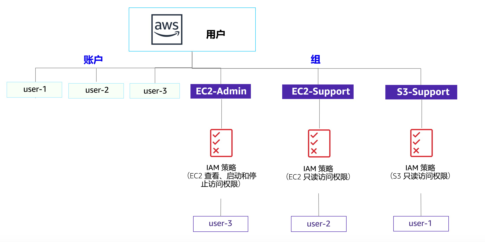

# 实验 1：AWS IAM 简介

<!-- Note to translators: This is based on SPL-66. Copy the translation from there. Do not re-translate the whole document. -->

<!-- Copied from Version 3.1.2 (spl66) -->

**AWS Identity and Access Management (IAM)** 是一项 Web 服务，可让 Amazon Web Services (AWS) 客户在 AWS 中管理用户和用户权限。借助 IAM，您可以集中管理**用户**、访问密钥等**安全凭证**，以及用于控制用户可以访问哪些 AWS 资源的**权限**。

## 涵盖的主题

本实验将演示以下操作：

* 探索预先创建的 **IAM 用户和组**
* 检查应用于预先创建的组的 **IAM 策略**
* 在**真实场景**中将用户添加到启用了特定功能的组中
* 查找并使用 **IAM 登录 URL**
* **试验**各项策略对服务访问的影响

&nbsp;
**其他 AWS 服务**

在完成本实验期间，执行本实验指南中未涵盖的步骤时，您可能会收到错误消息。这些消息不会妨碍您完成本实验。

&nbsp;
**AWS Identity and Access Management**

AWS Identity and Access Management (IAM) 可用于：

* **管理 IAM 用户及其访问权限**：您可以创建用户并为其分配单独的安全凭证（访问密钥、密码和多重验证设备）。您可以管理权限，限制用户可执行的操作。

* **管理 IAM 角色及其权限**：IAM 角色类似于用户，因为它是一个 AWS 身份，具有确定该身份在 AWS 中可执行和不可执行的操作的权限策略。但是，角色旨在由需要它的任何人*承担*，而不是唯一地与某个人员关联。

* **管理联合身份用户及其权限**：您可以启用*联合身份*功能来允许企业中的现有用户访问 AWS 管理控制台、调用 AWS API 和访问资源，而不必为各个身份创建 IAM 用户。

**持续时间**

完成本实验大约需要 **40 分钟**。

&nbsp;
&nbsp;
## 访问 AWS 管理控制台

1. 在这些说明的顶部，单击 Start Lab（启动实验）启动您的实验。

   “Start Lab”（启动实验）面板随即会打开，其中显示了实验状态。在打开的 **Start Lab**（启动实验）对话框中，记下 AWS 区域，因为在本实验的后面您将需要引用它。

2. 请耐心等待，直到您看到 **Lab status: ready**（实验状态：就绪）消息，然后单击 **X** 关闭“Start Lab”（启动实验）面板。

3. 在这些说明的顶部，单击 AWS

   在您执行此操作后，AWS 管理控制台将会在一个新的浏览器标签页中打开。您将自动登录系统。

   **提示：**如果未打开新的浏览器选项卡，则您的浏览器顶部通常会出现一个横幅或图标，表明您的浏览器阻止该网站打开弹出窗口。单击横幅或图标，然后选择“Allow pop ups”（允许弹出窗口）。

4. 排列 AWS 管理控制台选项卡，使其与这些说明一起显示。理想情况下，您将能够同时看到这两个浏览器选项卡，以便更轻松地执行实验步骤。

&nbsp;
&nbsp;
## 任务 1：探索用户和组

在此任务中，您将探索 IAM 中已经为您创建的用户和组。

5. 在 **AWS 管理控制台**的 **Services**（服务）菜单中，单击 **IAM**。

6. 在左侧导航窗格中，单击 **Users**（用户）。

   已为您创建以下 IAM 用户：

   * user-1
   * user-2
   * user-3

7. 单击 **user-1**。

   执行此操作后，您将转至 user-1 的一览页面。其中将显示 **Permissions**（权限）选项卡。

8. 请注意，user-1 没有任何权限。

9. 单击 **Groups**（组）选项卡。

   user-1 还不是任何组的成员。

10. 单击 **Security credentials**（安全凭证）选项卡。

   user-1 分配有一个**控制台密码**

11. 在左侧导航窗格中，单击 **Groups**（组）。

   已为您创建以下组：

   * EC2-Admin

   * EC2-Support

   * S3-Support

12. 单击 **EC2-Support** 组。

   执行此操作后，您将转至 **EC2-Support** 组的一览页面。

13. 单击 **Permissions**（权限）选项卡。

   此组有一个与之关联的托管策略，称为 **AmazonEC2ReadOnlyAccess**。托管策略是可以附加到 IAM 用户和组的预构建策略（由 AWS 或您的管理员构建）。如果您更新了该策略，对该策略的更改将立即应用于其附加到的所有用户和组。

14. 在 **Actions**（操作）部分，单击 **Show Policy**（显示策略）链接。

   策略可用于定义特定 AWS 资源所允许的操作或拒绝的操作。此策略授予了“列出和描述有关 EC2、Elastic Load Balancing、CloudWatch 和 Auto Scaling 的信息”的权限。具有该权限的角色可以查看资源，但不能修改它们，因此该权限适合分配给支持角色。

   IAM 策略中语句的基本结构为：

   * **Effect**（效果）表明是 *Allow*（允许）还是 *Deny*（拒绝）权限。

   * **Action**（操作）指定了可针对 AWS 服务执行的 API 调用（例如，*cloudwatch:ListMetrics*）。

   * **Resource**（资源）定义了策略规则涵盖的实体范围（例如，特定的 Amazon S3 存储桶或 Amazon EC2 实例，或者 * 意味着*任何资源*）。

15. 关闭 <i class="fa fa-times"></i>**Show Policy**（显示策略）窗口。

16. 在左侧导航窗格中，单击 **Groups**（组）。

17. 单击 **S3-Support** 组。

   **AmazonS3ReadOnlyAccess** 策略附加在 S3-Support 组上。

18. 在 **Actions**（操作）菜单下方，单击 **Show Policy**（显示策略）链接。

   该策略具有获取和列出 Amazon S3 中资源的权限。

19. 关闭 <i class="fa fa-times"></i>**Show Policy**（显示策略）窗口。

20. 在左侧导航窗格中，单击 **Groups**（组）。

21. 单击 **EC2-Admin** 组。

   该组与其他两个组略有不同。它具有**内联策略**（而不是*托管策略*），这种策略仅可分配给一个用户或组。内联策略通常用于为一次性情况应用权限。

22. 在 **Actions**（操作）部分，单击 **Show Policy**（显示策略），以查看策略。

   此策略可授予查看（描述）有关 Amazon EC2 信息的权限，以及启动和停止实例的权限。

23. 在屏幕底部，单击 **Cancel**（取消），以关闭策略。

&nbsp;
&nbsp;
## 业务场景

在本实验的剩余部分，您将使用这些用户和组来启用支持以下业务场景的权限：

贵公司正在越来越多地使用 Amazon Web Services，并且正在使用许多 Amazon EC2 实例和大量 Amazon S3 存储。您希望根据新员工的工作职能授予他们访问权限：

| 用户 | 组中 | 权限 |
|----|--------|-----------|
| user-1 | S3-Support | Amazon S3 的只读访问权限 |
| user-2 | EC2-Support | Amazon EC2 的只读访问权限 |
| user-3 | EC2-Admin | 查看、启动和停止 Amazon EC2 实例 |

&nbsp;
&nbsp;
## 任务 2：向组添加多个用户

您最近雇用了 **user-1** 来担任为 Amazon S3 提供支持的角色。您要将它们添加到 **S3-Support** 组，以便它们通过附加的 *AmazonS3ReadOnlyAccess* 策略沿用必要的权限。

<i class="fa fa-comment"></i>您可以忽略完成此任务期间出现的任何“未授权”错误。之所以出现此类错误是因为您的实验账户的权限有限，但它们不会妨碍您完成本实验。

&nbsp;
&nbsp;
### 将 user-1 添加到 S3-Support 组

24. 在左侧导航窗格中，单击 **Groups**（组）。

25. 单击 **S3-Support** 组。

26. 单击 **Users**（用户）选项卡。

27. 在 **Users**（用户）选项卡中，单击 **Add Users to Group**（向组添加多个用户）。

28. 在 **Add Users to Group**（向组添加多个用户）窗口中，进行以下配置：

   * 选择 <i class="fa fa-check-square-o"></i> **user-1**。

   * 在屏幕底部，单击 **Add Users**（添加用户）。

   在 **Users**（用户）选项卡中，您将看到 user-1 已添加到该组。

&nbsp;
&nbsp;
### 将 user-2 添加到 EC2-Support 组

您雇用了 **user-2** 来担任为 Amazon EC2 提供支持的角色。

29. 按照与上述步骤相似的步骤将 **user-2** 添加到 **EC2-Support** 组。

   user-2 现在应该是 **EC2-Support** 组的一部分。

&nbsp;
&nbsp;
### 将 user-3 添加到 EC2-Admin 组

您雇用了 **user-3** 作为您的 Amazon EC2 管理员，让其管理您的 EC2 实例。

30. 按照与上述步骤相似的步骤将 **user-3** 添加到 **EC2-Admin** 组。

   user-3 现在应该是 **EC2-Admin** 组的一部分。

31. 在左侧导航窗格中，单击 **Groups**（组）。

   每个组的“Users”（用户数量）列中应该都会显示 **1**，这表明每个组中的用户数量。

   如果您发现每个组的旁边并未显示 **1**，请重新按照上述说明操作，确保每个用户都被分配到了相应组，就如“业务场景”部分的表中显示的那样。

&nbsp;
&nbsp;
## 任务 3：登录并测试用户

在此任务中，您将测试每个 IAM 用户的权限。

32. 在左侧导航窗格中，单击 **Dashboard**（控制面板）。

   此时将显示 **IAM 用户登录链接**，它与以下网址类似：*https&#58;//123456789012.signin.aws.amazon.com/console*

   该链接可用于登录您当前正在使用的 AWS 账户。

33. 将 **IAM 用户登录链接**复制到文本编辑器。

34. 打开隐私窗口。

   **Mozilla Firefox**

   * 单击屏幕右上方的菜单栏 <i class="fa fa-bars"></i>
   * 选择 **New Private Window**（新建隐私窗口）

   **Google Chrome**

   * 单击屏幕右上方的省略号 <i class="fa fa-ellipsis-v"></i>
   * 单击 **New incognito window**（打开新的无痕窗口）

   **Microsoft Edge**

   * 单击屏幕右上方的省略号 <i class="fa fa-ellipsis-h"></i>
   * 单击 **New InPrivate window**（新建 InPrivate 窗口）

   **Microsoft Internet Explorer**

   * 单击 **Tools**（工具）菜单选项
   * 单击 **InPrivate Browsing**（InPrivate 浏览）

35. 将 **IAM users sign-in**（IAM 用户登录）链接粘贴到您的隐私窗口，然后按 **Enter** 键。

   现在，您将以 **user-1** 的身份登录，您雇用该用户作为您的 Amazon S3 存储支持人员。

36. 使用以下信息登录：

   * **IAM user name**（IAM 用户名）：`user-1`

   * **Password**（密码）：`Lab-Password1`

37. 在 **Services**（服务）菜单中，单击 **S3**。

38. 单击其中一个存储桶的名称，然后浏览内容。

   您的用户属于 IAM 中的 **S3-Support** 组，因此他们有权查看 Amazon S3 存储桶及其内容的列表。

   现在来测试他们是否有权访问 Amazon EC2。

39. 在 **Services**（服务）菜单中，单击 **EC2**。

40. 在左侧导航窗格中，单击 **Instances**（实例）。

   您无法看到任何实例！反而会看到消息：*You do not have any instances in this region*（您在此区域中没有任何实例）。这是因为尚未为您的用户分配使用 Amazon EC2 的权限。

   现在，您将以 **user-2** 的身份登录，您雇用该用户作为您的 Amazon EC2 支持人员。

41. 配置以下设置，将 user-1 退出 **AWS 管理控制台**：

   * 在屏幕顶部，单击 **user-1**

   * 单击 **Sign Out**（退出）

42. 将 **IAM users sign-in**（IAM 用户登录）链接粘贴到您的隐私窗口，然后按 **Enter** 键。

   此链接应该会出现在您的文本编辑器中。

43. 使用以下信息登录：

   * **IAM user name**（IAM 用户名）：`user-2`

   * **Password**（密码）：`Lab-Password2`

44. 在 **Services**（服务）菜单中，单击 **EC2**。

45. 在左侧导航窗格中，单击 **Instances**（实例）。

   现在，您可以查看 Amazon EC2 实例，因为您具有只读权限。但是，您无法对 Amazon EC2 资源进行任何更改。

   <i class="fa fa-exclamation-triangle"></i>如果您没有看到 Amazon EC2 实例，则您的区域可能不正确。在屏幕右上方，展开“Region”（区域）菜单，然后选择您在本实验启动时记下的区域（例如，**弗吉尼亚北部**）。

   您的 EC2 实例应处于选中状态 <i class="fa fa-check-square-o"></i>。如果未选中，则将其选中 <i class="fa fa-check-square-o"></i>。

46. 在 **Actions**（操作）菜单中，依次单击 **Instance State**（实例状态）> **Stop**（停止）。

47. 在 **Stop Instances**（停止实例）窗口中，单击 **Yes, Stop**（是，请停止）。

   您将收到以下错误：*You are not authorized to perform this operation*（您无权执行此操作）。这表明该策略仅允许您查看信息，而不允许您进行更改。

48. 在 **Stop Instances**（停止实例）窗口中，单击 **Cancel**（取消）。

   接下来，检查 user-2 是否可以访问 Amazon S3。

49. 在 **Services**（服务）中，单击 **S3**。

   您将收到以下<i class="fa fa-exclamation-circle"></i> **错误“Access Denied”（访问被拒绝）**，因为 user-2 无权使用 Amazon S3。

   现在，您将以 **user-3** 的身份登录，您雇用该用户作为您的 Amazon EC2 管理员。

50. 配置以下设置，将 user-2 退出 **AWS 管理控制台**：

   * 在屏幕顶部，单击 **user-2**

   * 单击 **Sign Out**（退出）

51. 将 **IAM users sign-in**（IAM 用户登录）链接粘贴到您的隐私窗口，然后按 **Enter** 键。

52. 再次将登录链接粘贴到您的 Web 浏览器地址栏中。如果它不在剪贴板中，请在您之前将其存储在其中的文本编辑器中进行检索。

53. 使用以下信息登录：

   * **IAM user name**（IAM 用户名）：`user-3`
   * **Password**（密码）：`Lab-Password3`

54. 在 **Services**（服务）菜单中，单击 **EC2**。

55. 在左侧导航窗格中，单击 **Instances**（实例）。

   作为 EC2 管理员，您现在应该有权停止 Amazon EC2 实例。

   您的 EC2 实例应处于选中状态 <i class="fa fa-check-square-o"></i>。如果未选中，则将其选中 <i class="fa fa-check-square-o"></i>。

   <i class="fa fa-exclamation-triangle"></i>如果您没有看到 Amazon EC2 实例，则您的区域可能不正确。在屏幕右上方，展开 Region（区域）菜单，然后选择您在本实验启动时记下的区域（例如，**俄勒冈**）。

56. 在 **Actions**（操作）菜单中，依次单击 **Instance State**（实例状态）> **Stop**（停止）。

57. 在 **Stop Instances**（停止实例）窗口中，单击 **Yes, Stop**（是，请停止）。

   该实例将进入*停止*状态并将关闭。

58. 关闭您的隐私窗口。

&nbsp;
&nbsp;
## 实验完成

<i class="icon-flag-checkered"></i>恭喜！您已完成本实验。

59. 单击此页面顶部的 End Lab（结束实验），然后单击 Yes（是）确认您要结束实验。

   此时将显示一个面板，指示“DELETE has been initiated...You may close this message box now.”（删除操作已启动...您现在可以关闭此消息框。）

60. 单击右上角的 **X** 关闭面板。

&nbsp;
&nbsp;
## 结论

<i class="far fa-thumbs-up" style="color:blue"></i>恭喜！现在，您已成功完成以下任务：

* 探索预先创建的 IAM 用户和组

* 检查应用于预创建组的 IAM 策略

* 在真实场景中将用户添加到启用了特定功能的组中

* 查找并使用 IAM 登录 URL

* 试验各项策略对服务访问的影响

&nbsp;
&nbsp;
## 其他资源

* <a href="http://aws.amazon.com/training/" target="_blank">AWS Training and Certification</a>
* <a href="http://aws.amazon.com/iam/" target="_blank">了解有关 AWS IAM 的更多信息</a>

如有反馈、建议或更正意见，请发送电子邮件至：<aws-course-feedback@amazon.com>

