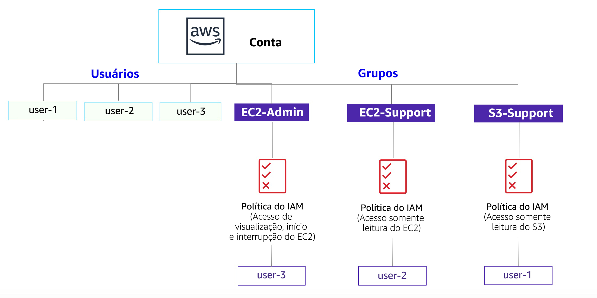

# Laboratorio 1: Introducción a AWS IAM

<!-- Note to translators: This is based on SPL-66. Copy the translation from there. Do not re-translate the whole document. -->

<!-- Copied from Version 3.1.2 (spl66) -->

**AWS Identity and Access Management (IAM)** es un servicio web que permite a los clientes de Amazon Web Services (AWS) administrar los usuarios y los permisos de usuario en AWS. Con IAM, puede administrar de forma centralizada los **usuarios**, **las credenciales de seguridad**, como las claves de acceso y los **permisos**, que controlan a qué recursos de AWS pueden acceder los usuarios.

## Temas

En este laboratorio, aprenderá a completar las siguientes tareas:

* Analizar **los usuarios y los grupos de IAM** creados previamente
* Inspeccionar las **políticas de IAM**, según se apliquen a los grupos creados previamente
* Según una **situación real**, agregar usuarios a los grupos con capacidades específicas habilitadas
* Ubicar y usar la dirección **URL de inicio de sesión de IAM**
* **Probar** los efectos de las políticas en el acceso a los servicios

&nbsp;
**Otros servicios de AWS**

Durante el laboratorio, es posible que aparezcan mensajes de error cuando intente realizar acciones que no se ajusten a los pasos incluidos en esta guía de laboratorio. Estos mensajes no afectarán su capacidad para completar el laboratorio.

&nbsp;
**AWS Identity and Access Management**

AWS Identity and Access Management (IAM) se puede utilizar para lo siguiente:

* **Administrar usuarios de IAM y su acceso:** puede crear usuarios y asignarles credenciales de seguridad individuales (claves de acceso, contraseñas y dispositivos de autenticación multifactor). Puede administrar los permisos para controlar qué operaciones puede realizar cada usuario.

* **Administrar roles de IAM y sus permisos:** un rol de IAM es similar a un usuario, ya que es una identidad de AWS con políticas de permisos que establecen qué puede hacer o no la identidad en AWS. Sin embargo, en lugar de estar asociada únicamente a una persona, el objetivo es que *pueda asignarse* un rol a cualquier persona que lo necesite.

* **Administrar usuarios federados y sus permisos:** puede habilitar la *identidad federada* a fin de permitir que los usuarios existentes de su empresa puedan acceder a la consola de administración de AWS, llamar a las API de AWS y acceder a los recursos, sin necesidad de crear un usuario de IAM para cada identidad.

**Duración**

La duración estimada de este laboratorio es de **40 minutos** aproximadamente.

&nbsp;
&nbsp;
## Acceso a la consola de administración de AWS

1. En la parte superior de estas instrucciones, haga clic en Start Lab (Iniciar laboratorio) para lanzar su laboratorio.

   Se abrirá el panel “Start Lab” (Iniciar laboratorio), donde se muestra el estado del laboratorio. En el cuadro de diálogo **Start Lab** (Iniciar laboratorio) que se abre, tenga en cuenta la región de AWS, ya que deberá consultarla más adelante en este laboratorio.

2. Espere hasta que aparezca el mensaje “**Lab status: ready**” (Estado del laboratorio: listo) y, luego, haga clic en la **X** para cerrar el panel “Start Lab (Iniciar laboratorio)”.

3. En la parte superior de estas instrucciones, haga clic en AWS.

   La consola de administración de AWS se abrirá en una nueva pestaña del navegador. El sistema iniciará su sesión automáticamente.

   **Sugerencia**: Si no se abre una pestaña nueva del navegador, debería aparecer un banner o un icono en la parte superior de este, el cual indique que el navegador no permite que se abran ventanas emergentes en el sitio. Haga clic en el banner o en el icono, y elija “Allow pop ups” (Permitir ventanas emergentes).

4. Ubique la pestaña de la consola de administración de AWS en un lugar donde aparezca al lado de estas instrucciones. Idealmente, debería poder ver ambas pestañas del navegador al mismo tiempo para que sea más sencillo seguir los pasos del laboratorio.

&nbsp;
&nbsp;
## Tarea 1: analizar los usuarios y los grupos

En esta tarea, analizará los usuarios y los grupos que ya se crearon para usted en IAM.

5. En la **consola de administración de AWS**, encontrará el menú **Services** (Servicios), donde debe hacer clic en **IAM**.

6. En el panel de navegación izquierdo, haga clic en **Users** (Usuarios).

   Ya se crearon los siguientes usuarios de IAM para usted:

   * user-1
   * user-2
   * user-3

7. Haga clic en **user-1** (usuario-1).

   Esto le mostrará la página de resumen de usuario-1. Se visualizará la pestaña **Permissions** (Permisos).

8. Observe que usuario-1 no tiene permisos.

9. Haga clic en la pestaña **Groups** (Grupos).

   Usuario-1 tampoco es miembro de ningún grupo.

10. Haga clic en la pestaña **Security credentials** (Credenciales de seguridad).

   Usuario-1 tiene asignada una **contraseña de consola**

11. En el panel de navegación izquierdo, haga clic en **Groups** (Grupos).

   Ya se crearon los siguientes grupos para usted:

   * EC2-Admin

   * EC2-Support

   * S3-Support

12. Haga clic en el grupo **EC2-Support**.

   Esto le mostrará la página de resumen del grupo **EC2-Support**.

13. Haga clic en la pestaña **Permissions** (Permisos).

   Este grupo está asociado a una política administrada que se llama **AmazonEC2ReadOnlyAccess**. Las políticas administradas son aquellas diseñadas con anterioridad (creadas por sus administradores o por AWS) que se pueden asociar a grupos y a usuarios de IAM. Cuando la política se actualiza, los cambios se implementan inmediatamente en todos los usuarios y los grupos que tiene asociados.

14. En **Actions** (Acciones), haga clic en el enlace **Show Policy** (Mostrar política).

   Una política define qué acciones se permiten o rechazan para determinados recursos de AWS. Esta política concede permiso para describir e incluir en listas información acerca de EC2, Elastic Load Balancing, CloudWatch y Auto Scaling. Esta capacidad que permite ver recursos, pero no modificarlos, es ideal como rol de soporte.

   La estructura básica de las declaraciones de una política de IAM es la siguiente:

   * **Effect** (Efecto) determina si los permisos se conceden (*Allow*) o rechazan (*Deny*).

   * **Action** (Acción) especifica las llamadas a la API que se pueden efectuar respecto de un servicio de AWS (p. ej., *cloudwatch:ListMetrics*).

   * **Resource** (Recurso) define el alcance de las entidades cubiertas por la regla de la política (p. ej., un bucket de Amazon S3 o una instancia de Amazon EC2 específicos, o bien, * que significa *cualquier recurso*).

15. Cierre <i class="fa fa-times"></i> la ventana **Show Policy** (Mostrar política).

16. En el panel de navegación izquierdo, haga clic en **Groups** (Grupos).

17. Haga clic en el grupo **S3-Support**.

   El grupo S3-Support está asociado a la política **AmazonS3ReadOnlyAccess**.

18. En el menú **Actions** (Acciones), haga clic en el enlace **Show Policy** (Mostrar política).

   La política tiene permisos GET y LIST sobre los recursos en Amazon S3.

19. Cierre <i class="fa fa-times"></i> la ventana **Show Policy** (Mostrar política).

20. En el panel de navegación izquierdo, haga clic en **Groups** (Grupos).

21. Haga clic en el grupo **EC2-Admin**.

   Este grupo difiere levemente de los otros dos. En vez de una *política administrada*, tiene una **política insertada**, la cual es una política asignada a un único usuario o grupo. Las políticas insertadas, en general, se usan para asignar permisos en caso de situaciones aisladas.

22. Para ver la política, vaya a **Actions** (Acciones) y haga clic en **Show Policy** (Mostrar política).

   La política concede permiso para ver información descriptiva de Amazon EC2 y también de la capacidad de iniciar o detener instancias.

23. Para cerrar la política, vaya a la parte inferior de la pantalla y haga clic en **Cancel** (Cancelar).

&nbsp;
&nbsp;
## Situación empresarial

Durante el resto del laboratorio, trabajaremos con estos usuarios y grupos para habilitar los permisos que admiten la siguiente situación empresarial:

Su compañía aprovecha Amazon Web Services cada vez más, y utiliza muchas instancias de Amazon EC2 y un gran volumen de almacenamiento de Amazon S3. Usted desea otorgar acceso a personal nuevo según su función laboral:

| Usuario | En grupo | Permisos |
|----|--------|-----------|
| user-1 | S3-Support | Acceso de solo lectura a Amazon S3 |
| user-2 | EC2-Support | Acceso de solo lectura a Amazon EC2 |
| user-3 | EC2-Admin | Visualizar, iniciar y detener instancias de Amazon EC2 |

&nbsp;
&nbsp;
## Tarea 2: agregar usuarios a los grupos

Recientemente contrató a **user-1** (usuario-1) para un rol que brindará soporte a Amazon S3. Lo agregará al grupo **S3-Support** para que pueda heredar los permisos necesarios mediante la política *AmazonS3ReadOnlyAccess* asociada.

<i class="fa fa-comment"></i> Durante esta tarea, puede ignorar cualquier error que incluya el texto “not authorized” (no autorizado). Se provocan porque su cuenta de laboratorio tiene permisos limitados, pero esto no afectará su capacidad para completar el laboratorio.

&nbsp;
&nbsp;
### Agregue a “user-1” (usuario-1) al grupo S3-Support.

24. En el panel de navegación izquierdo, haga clic en **Groups** (Grupos).

25. Haga clic en el grupo **S3-Support**.

26. Haga clic en la pestaña **Users** (Usuarios).

27. En la pestaña **Users** (Usuarios), haga clic en **Add Users to Group** (Agregar usuarios al grupo).

28. En la ventana **Add Users to Group** (Agregar usuarios al grupo), configure los siguientes parámetros:

   * Seleccione <i class="fa fa-check-square-o"></i> **user-1**.

   * En la parte inferior de la pantalla, haga clic en **Add Users** (Agregar usuarios).

   En la pestaña **Users** (Usuarios), verá que “user-1” (usuario-1) se agregó al grupo.

&nbsp;
&nbsp;
### Agregue a “user-2” (usuario-2) al grupo EC2-Support.

Contrató a **user-2** (usuario-2) para un rol que brindará soporte a Amazon EC2.

29. Mediante pasos similares a los anteriores, agregue a **user-2** (usuario-2) al grupo **EC2-Support**.

   Ahora, “user-2” (usuario-2) debería formar parte del grupo **EC2-Support**.

&nbsp;
&nbsp;
### Agregue a “user-3” (usuario-3) al grupo EC2-Admin.

Contrató a **user-3** (usuario-3) como administrador de Amazon EC2 para que se encargue de administrar sus instancias EC2.

30. Mediante pasos similares a los anteriores, agregue a **user-3** (usuario-3) al grupo **EC2-Admin**.

   Ahora, “user-3” (usuario-3) debería formar parte del grupo **EC2-Admin**.

31. En el panel de navegación izquierdo, haga clic en **Groups** (Grupos).

   Cada grupo debería tener un **1** en la columna “Users” (Usuarios) como representación de la cantidad de usuarios en cada grupo.

   Si no se muestra un **1** junto a cada grupo, revise las instrucciones anteriores para asegurarse de que cada usuario esté asignado a un grupo, como se muestra en la tabla de la sección “Situación empresarial”.

&nbsp;
&nbsp;
## Tarea 3: iniciar sesión y probar usuarios

En esta tarea, probará los permisos de cada usuario de IAM.

32. En el panel de navegación izquierdo, haga clic en **Dashboard** (Panel).

   Se muestra un **enlace de inicio de sesión para usuarios de IAM**. Será similar a *https&#58;//123456789012.signin.aws.amazon.com/console*

   El enlace se puede usar para iniciar sesión en la cuenta de AWS que está usando en este momento.

33. Copie el **enlace de inicio de sesión para usuarios de IAM** en un editor de texto.

34. Abra una ventana privada.

   **Mozilla Firefox**

   * Haga clic en las barras de menú <i class="fa fa-bars"></i> de la parte superior derecha de la pantalla.
   * Seleccione **New Private Window** (Nueva ventana privada).

   **Google Chrome**

   * Haga clic en los puntos suspensivos <i class="fa fa-ellipsis-v"></i> de la parte superior derecha de la pantalla.
   * Haga clic en **New incognito window** (Nueva ventana de incógnito).

   **Microsoft Edge**

   * Haga clic en los puntos suspensivos <i class="fa fa-ellipsis-h"></i> de la parte superior derecha de la pantalla.
   * Haga clic en **New InPrivate window** (Ventana InPrivate nueva).

   **Microsoft Internet Explorer**

   * Haga clic en la opción de menú **Tools** (Herramientas).
   * Haga clic en **InPrivate Browsing** (Navegación InPrivate).

35. Pegue el enlace de **inicio de sesión para usuarios de IAM** en la ventana privada y presione **Enter** (Intro).

   Ahora iniciará sesión como **user-1** (usuario-1), a quien se contrató como personal de soporte para el almacenamiento de Amazon S3.

36. Inicie sesión con los siguientes datos:

   * **IAM user name** (Nombre de usuario de IAM): `user-1`

   * **Contraseña:** `Lab-Password1`

37. En el menú **Services** (Servicios), haga clic en **S3**.

38. Haga clic en el nombre de uno de los buckets y examine el contenido.

   Dado que el usuario forma parte del grupo **S3-Support** en IAM, tiene permiso para ver una lista de buckets de Amazon S3 y su contenido.

   Ahora, pruebe si tienen acceso a Amazon EC2.

39. En el menú **Services** (Servicios), haga clic en **EC2**.

40. En el panel de navegación de la izquierda, haga clic en **Instances** (Instancias).

   No puede ver ninguna instancia. En su lugar, dice *que no tiene ninguna instancia en esta región*. Esto se debe a que al usuario no se le otorgó ningún permiso para usar Amazon EC2.

   Ahora iniciará sesión como **user-2** (usuario-2), a quien se contrató como personal de soporte para Amazon EC2.

41. Cierre la sesión de “user-1” (usuario-1) en la **consola de administración de AWS** mediante la configuración de los siguientes parámetros:

   * En la parte superior de la pantalla, haga clic en **user-1** (usuario-1).

   * Haga clic en **Sign Out** (Cerrar sesión).

42. Pegue el enlace de **inicio de sesión para usuarios de IAM** en la ventana privada y presione **Enter** (Intro).

   Se debe visualizar este enlace en su editor de texto.

43. Inicie sesión con los siguientes datos:

   * **IAM user name (Nombre de usuario de IAM):** `user-2`

   * **Contraseña:** `Lab-Password2`

44. En el menú **Services** (Servicios), haga clic en **EC2**.

45. En el panel de navegación izquierdo, haga clic en **Instances** (Instancias).

   Ahora puede ver una instancia de Amazon EC2 porque tiene permisos de solo lectura. Sin embargo, no podrá realizar ninguna modificación en los recursos de Amazon EC2.

   <i class="fa fa-exclamation-triangle"></i> Si no puede ver una instancia de Amazon EC2, es posible que la región sea incorrecta. En la parte superior derecha de la pantalla, despliegue el menú “Region” (Región) y seleccione la región que anotó al principio del laboratorio (p. ej., **N. Virginia** [Virginia del Norte]).

   Su instancia EC2 debería estar seleccionada <i class="fa fa-check-square-o"></i>. Si no lo está, <i class="fa fa-check-square-o"></i> selecciónela.

46. En el menú **Actions** (Acciones), haga clic en **Instance State** (Estado de la instancia) > **Stop** (Detener).

47. En la ventana **Stop Instances** (Detener instancias), haga clic en **Yes, Stop** (Sí, detener).

   Verá un mensaje de error con el texto *You are not authorized to perform this operation* (No tiene autorización para realizar esta operación). Esto demuestra que la política solo le permite ver la información, pero no lo autoriza a realizar cambios.

48. En la ventana **Stop Instances** (Detener instancias), haga clic en **Cancel** (Cancelar).

   Luego, verifique si “user-2” (usuario-2) puede acceder a Amazon S3.

49. En **Services** (Servicios), haga clic en **S3**.

   Recibirá el mensaje <i class="fa fa-exclamation-circle"></i> **Error Access Denied** (Error de acceso denegado) porque el usuario-2 no tiene permiso para utilizar Amazon S3.

   Ahora iniciará sesión como **user-3** (usuario-3), a quien se contrató como administrador de Amazon EC2.

50. Cierre la sesión de “user-2” (usuario-2) en la **consola de administración de AWS** mediante la configuración de los siguientes parámetros:

   * En la parte superior de la pantalla, haga clic en **user-2** (usuario-2).

   * Haga clic en **Sign Out** (Cerrar sesión).

51. Pegue el enlace de **inicio de sesión para usuarios de IAM** en la ventana privada y presione **Enter** (Intro).

52. Vuelva a pegar el enlace de inicio de sesión en la barra de direcciones del navegador web. Si no está en el portapapeles, recupérelo del editor de texto en el que lo guardó anteriormente.

53. Inicie sesión con los siguientes datos:

   * **IAM user name** (Nombre de usuario de IAM): `user-3`
   * **Contraseña:** `Lab-Password3`

54. En el menú **Services** (Servicios), haga clic en **EC2**.

55. En el panel de navegación izquierdo, haga clic en **Instances** (Instancias).

   Como administrador de EC2, debería tener permisos para detener la instancia de Amazon EC2.

   Su instancia EC2 debería estar seleccionada <i class="fa fa-check-square-o"></i>. Si no es así, <i class="fa fa-check-square-o"></i> selecciónela.

   <i class="fa fa-exclamation-triangle"></i> Si no puede ver una instancia de Amazon EC2, es posible que la región sea incorrecta. En la parte superior derecha de la pantalla, despliegue el menú “Region” (Región) y seleccione la región que anotó al principio del laboratorio (p. ej., **Oregon** [Oregón]).

56. En el menú **Actions** (Acciones), haga clic en **Instance State** (Estado de la instancia) > **Stop** (Detener).

57. En la ventana **Stop Instances** (Detener instancias), haga clic en **Yes, Stop** (Sí, detener).

   La instancia ingresará al estado *stopping* (en proceso de detención) y se cerrará.

58. Cierre la ventana privada.

&nbsp;
&nbsp;
## Fin del laboratorio

<i class="icon-flag-checkered"></i> ¡Felicitaciones! Ha completado el laboratorio.

59. Haga clic en End Lab (Finalizar laboratorio) en la parte superior de esta página y, a continuación, en Yes (Sí) para confirmar que desea finalizar el laboratorio.

   Aparecerá un panel en el que se indica: “DELETE has been initiated… You may close this message box now”. (Se ha iniciado la ELIMINACIÓN… Ya puede cerrar este cuadro de mensajes).

60. Haga clic en la **X** de la esquina superior derecha para cerrar el panel.

&nbsp;
&nbsp;
## Conclusión

<i class="far fa-thumbs-up" style="color:blue"></i> ¡Felicitaciones! Aprendió a realizar correctamente las siguientes tareas:

* Analizar usuarios y grupos de IAM creados previamente

* Inspeccionar políticas de IAM según se apliquen a los grupos creados previamente

* Según una situación real, agregar usuarios a los grupos con capacidades específicas habilitadas

* Ubicar y usar la dirección URL de inicio de sesión de IAM

* Probar los efectos de las políticas en el acceso a los servicios

&nbsp;
&nbsp;
## Recursos adicionales

* <a href="http://aws.amazon.com/training/" target=_blank>AWS Training and Certification</a>
* <a href="http://aws.amazon.com/iam/" target="_blank">Para obtener más información acerca de AWS IAM</a>

Para hacer comentarios, sugerencias o correcciones, envíe un email a <aws-course-feedback@amazon.com>

