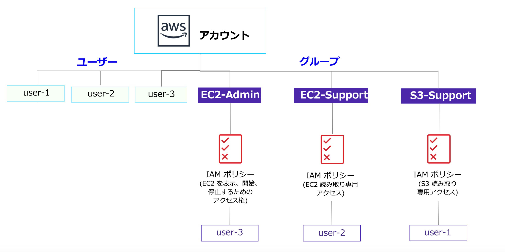

# ラボ 1: AWS IAM の紹介

<!-- Note to translators: This is based on SPL-66. Copy the translation from there. Do not re-translate the whole document. -->

<!-- Copied from Version 3.1.2 (spl66) -->

**AWS Identity and Access Management (IAM)** は、アマゾン ウェブ サービス (AWS) のお客様が AWS でユーザーとユーザー権限を管理できるようにするウェブサービスです。IAM を使うと、**ユーザー**やアクセスキーといった**セキュリティ認証情報**、ならびにユーザーがアクセスできる AWS リソースを制御する**アクセス許可**を一元管理できます。

## 取り上げるトピック

このラボでは、以下のことを行います。

* 事前に作成された **IAM ユーザーと IAM グループ**を確認する
* 事前に作成されたグループに適用された **IAM ポリシー**を確認する
* **実際のシナリオ**に従い、特定の機能が有効なグループにユーザーを追加する
* **IAM サインイン URL** を特定して使用する
* サービスへのアクセスに対するポリシーの効果を**確認**する

&nbsp;
**AWS のその他のサービス**

このラボでは、このラボガイドに記載されているステップ以外のアクションを実行すると、エラーメッセージが表示される場合があります。このようなメッセージが表示されても、ラボの完了に影響はありません。

&nbsp;
**AWS Identity and Access Management**

AWS Identity and Access Management (IAM) を使用して以下のことが実行できます。

* **IAM ユーザーとそのアクセスの管理**: ユーザーを作成し、そのユーザーに個別のセキュリティ認証情報 (アクセスキー、パスワード、多要素認証デバイス) を割り当てることができます。アクセス許可を管理して、ユーザーが実行できるオペレーションを制御できます。

* **IAM ロールとそのアクセス許可の管理**: IAM ロールは、AWS で許可および禁止する操作を決めるアクセス許可ポリシーが関連付けられている AWS Identity であるという点で、IAM ユーザーと似ています。ただし、ユーザーは 1 人の人のみに関連付けられますが、ロールはそれを必要とする任意の人が**引き受ける**ことができます。

* **フェデレーティッドユーザーとそのアクセス許可の管理**: *ID フェデレーション*を有効にすると、社内の既存のユーザーによる AWS マネジメントコンソールへのアクセス、AWS API の呼び出し、リソースへのアクセスを許可できます。アイデンティティごとに IAM ユーザーを作成する必要はありません。

**所要時間**

このラボは、完了までにおよそ **40 分**かかります。

&nbsp;
&nbsp;
## AWS マネジメントコンソールにアクセスする

1. この手順の上部にある Start Lab をクリックして、ラボを起動します。

   [**Start Lab**] パネルが開き、ラボのステータスが表示されます。開いた [**Start Lab**] パネルで、AWS リージョンをメモします。これは、このラボの後半で参照する必要があるためです。

2. **Lab status: ready** というメッセージが表示されるまで待ち、[**X**] をクリックして [**Start Lab**] パネルを閉じます。

3. この手順の上部にある AWS をクリックします。

   新しいブラウザタブで AWS マネジメントコンソールが開きます。システムによって自動的にログインします。

   **ヒント**: 新しいブラウザタブが開かない場合、通常、ブラウザによってサイトのポップアップウィンドウの表示がブロックされたことを示すバナーまたはアイコンがブラウザの上部に表示されます。バナーまたはアイコンをクリックし、[**ポップアップを許可**] をクリックします。

4. AWS マネジメントコンソールのタブをこの手順の横に配置します。ラボのステップを簡単に参照できるように、両方のブラウザタブを同時に表示することをお勧めします。

&nbsp;
&nbsp;
## タスク 1: ユーザーとグループを確認する

このタスクでは、IAM で既に作成されているユーザーとグループを確認します。

5. **AWS マネジメントコンソール**の [**サービス**] で [**IAM**] をクリックします。

6. ナビゲーションペインで [**ユーザー**] をクリックします。

   以下の IAM ユーザーが作成されています。

   * user-1
   * user-2
   * user-3

7. **user-1** をクリックします。

   これにより、user-1 の概要ページに移動します。[**アクセス権限**] タブが開きます。

8. user-1 にはアクセス権限がないことを確認してください。

9. \[**グループ**] タブをクリックします。

   user-1 はどのグループにも属していません。

10. \[**認証情報**] タブをクリックします。

   user-1 に**コンソールのパスワード**が割り当てられています

11. 左側のナビゲーションペインで [**グループ**] をクリックします。

   以下のグループが既に作成されています。

   * EC2-Admin

   * EC2-Support

   * S3-Support

12. **EC2-Support** グループをクリックします。

   これにより、**EC2-Support** グループの概要ページに移動します。

13. \[**アクセス許可**] タブをクリックします。

   このグループには、**AmazonEC2ReadOnlyAccess** という管理ポリシーが関連付けられています。管理ポリシーは、(AWS または管理者によって) 事前に作成されたポリシーで、IAM ユーザーまたは IAM グループにアタッチできます。ポリシーが更新されると、そのポリシーにアタッチされているすべてのユーザーとグループに対し、変更が即座に適用されます。

14. \[**アクション**] 列で [**ポリシーの表示**] をクリックします。

   ポリシーでは、特定の AWS リソースに対し許可または拒否されるアクションが定義されます。このポリシーでは、EC2、Elastic Load Balancing、CloudWatch、Auto Scaling に関する情報を一覧表示および取得するためのアクセス許可が付与されます。リソースの表示を許可しつつ変更は許可しないポリシーは、サポート担当者に最適です。

   IAM ポリシーのステートメントの基本構造は次のとおりです。

   * **Effect** では、アクセスを**許可**するか**拒否**するかを指定します。

   * **Action** では、AWS のサービスに対して実行できる API コール (**cloudwatch:ListMetrics** など) を指定します。

   * **Resource** では、ポリシールールの対象となるエンティティの範囲を定義します (特定の Amazon S3 バケットや Amazon EC2 インスタンスなど。また、* は**すべてのリソース**を意味します)。

15. \[**ポリシーの表示**] ウィンドウを <i class="fa fa-times"></i> 閉じます。

16. 左側のナビゲーションペインで [**グループ**] をクリックします。

17. **S3-Support** グループをクリックします。

   S3-Support グループには、**AmazonS3ReadOnlyAccess** ポリシーがアタッチされています。

18. \[**アクション**] 列で [**ポリシーの表示**] をクリックします。

   このポリシーには、Amazon S3 のリソースを取得および一覧表示するアクセス許可が記載されています。

19. \[**ポリシーの表示**] ウィンドウを <i class="fa fa-times"></i> 閉じます。

20. 左側のナビゲーションペインで [**グループ**] をクリックします。

21. **EC2-Admin** グループをクリックします。

   このグループは、他の 2 つとは若干異なります。**管理ポリシー**ではなく、**インラインポリシー**が割り当てられています。このポリシーは、1 つのユーザーまたはグループのみに割り当てられるポリシーです。インラインポリシーは通常、1 回限りのアクセス許可を適用する際に使用されます。

22. \[**アクション**] 列で [**ポリシーの表示**] をクリックし、ポリシーを表示します。

   このポリシーでは、Amazon EC2 に関する情報を表示 (取得) するためのアクセス許可と、インスタンスを開始および停止するためのアクセス許可が付与されます。

23. 画面の下部で [**Cancel (キャンセル)**] をクリックしてポリシーを閉じます。

&nbsp;
&nbsp;
## ビジネスシナリオ

ラボの残りの部分では、上記のユーザーとグループを使って、以下のビジネスシナリオに対応するアクセス許可を有効にします。

社内でアマゾン ウェブ サービスの使用が増えており、Amazon EC2 インスタンスと Amazon S3 ストレージを大量に使用しています。新しいスタッフには、職務機能に応じてアクセス権を付与しようと考えています。

| ユーザー | グループ | 権限 |
|----|--------|-----------|
| user-1 | S3-Support | Amazon S3 への読み取り専用アクセス |
| user-2 | EC2-Support | Amazon EC2 への読み取り専用アクセス |
| user-3 | EC2-Admin | Amazon EC2 インスタンスの表示、開始、停止 |

&nbsp;
&nbsp;
## タスク 2: グループにユーザーを追加する

最近、**user-1** を雇用し、Amazon S3 に関するサポートを行う職務を担当してもらうことにしました。このユーザーを **S3-Support** グループに追加し、アタッチされている **AmazonS3ReadOnlyAccess** ポリシーによって必要なアクセス許可を継承させます。

<i class="fa fa-comment"></i>このタスクの実行中に表示される「権限がありません」というエラーは無視して構いません。このエラーは、ラボのアカウントのアクセス許可が制限されていることが原因で発生しますが、このラボの完了には影響しません。

&nbsp;
&nbsp;
### user-1 を S3-Support グループに追加する

24. 左側のナビゲーションペインで [**グループ**] をクリックします。

25. **S3-Support** グループをクリックします。

26. \[**ユーザー**] タブをクリックします。

27. \[**ユーザー**] タブで [**グループにユーザーを追加**] をクリックします。

28. \[**グループにユーザーを追加**] ウィンドウで、以下の設定を行います。

   * <i class="fa fa-check-square-o"></i> **user-1** を選択します。

   * 画面の下部にある [**ユーザーの追加**] をクリックします。

   [**ユーザー**] タブで、user-1 がグループに追加されたことが確認できます。

&nbsp;
&nbsp;
### user-2 を EC2-Support グループに追加する

**user-2** を雇用し、Amazon EC2 に関するサポートを行う職務を担当してもらうことにしました。

29. 上記と同様の手順で、**user-2** を **EC2-Support** グループに追加します。

   user-2 が **EC2-Support** グループに追加されました。

&nbsp;
&nbsp;
### user-3 を EC2-Admin グループに追加する

**user-3** を雇用し、Amazon EC2 管理者として EC2 インスタンスを管理してもらうことにしました。

30. 上記と同様の手順で、**user-3** を **EC2-Admin** グループに追加します。

   user-3 が **EC2-Admin** グループに追加されました。

31. 左側のナビゲーションペインで [**グループ**] をクリックします。

   各グループの [**ユーザー**] 列には、各グループのユーザー数として [**1**] が表示されています。

   各グループの横に **1** と表示されていない場合は、上記の手順に戻り、「ビジネスシナリオ」セクションの表に記載されているとおりに、各ユーザーがグループに割り当てられていることを確認してください。

&nbsp;
&nbsp;
## タスク 3: サインインしてユーザーをテストする

このタスクでは、各 IAM ユーザーのアクセス許可をテストします。

32. ナビゲーションペインで [**ダッシュボード**] をクリックします。

   **IAM ユーザーのサインインリンク**が **https&#58;//123456789012.signin.aws.amazon.com/console** のような形式で表示されます。

   このリンクを使用して、現在使用している AWS アカウントにサインインできます。

33. **IAM ユーザーのサインインリンク**をテキストエディタにコピーします。

34. プライベートウィンドウを開きます。

   **Mozilla Firefox**

   * 画面の右上にある <i class="fa fa-bars"></i> メニューバーをクリックします
   * [**新しいプライベートウィンドウ**] をクリックします

   **Google Chrome**

   * 画面の右上にある <i class="fa fa-ellipsis-v"></i> 省略記号をクリックします
   * [**シークレットウィンドウを開く**] をクリックします

   **Microsoft Edge**

   * 画面の右上にある <i class="fa fa-ellipsis-h"></i> 省略記号をクリックします
   * [**新しい InPrivate ウィンドウ**] をクリックします

   **Microsoft Internet Explorer**

   * [**ツール**] メニューオプションをクリックします
   * [**InPrivate ブラウズ**] をクリックします

35. プライベートウィンドウに **IAM ユーザーのサインイン**リンクを貼り付け、**Enter** キーを押します。

   まず、Amazon S3 のストレージサポートスタッフとして雇用した **user-1** としてサインインします。

36. 以下の認証情報を使ってサインインします。

   * **ユーザー名:** `user-1`

   * **パスワード:** `Lab-Password1`

37. \[**サービス**] で [**S3**] をクリックします。

38. いずれかのバケットの名前をクリックし、内容を参照します。

   このユーザーには IAM の **S3-Support** グループのメンバーであるため、Amazon S3 バケットのリストとコンテンツを表示するためのアクセス許可があります。

   次に、Amazon EC2 にアクセスできるかどうかをテストします。

39. \[**サービス**] で [**EC2**] をクリックします。

40. 左側のナビゲーションペインで [**インスタンス**] をクリックします。

   しかし、インスタンスが表示されません。代わりに、**このリージョンにはインスタンスがありません。**と表示されます。これは、このユーザーに Amazon EC2 を使用するためのアクセス許可が割り当てられていないためです。

   次に、Amazon EC2 のサポートスタッフとして雇用した **user-2** としてサインインします。

41. **AWS マネジメントコンソール**で以下のように操作して、user-1 からサインアウトします。

   * 画面の上部にある [**user-1**] をクリックします

   * [**サインアウト**] をクリックします

42. プライベートウィンドウに **IAM ユーザーのサインイン**リンクを貼り付け、**Enter** キーを押します。

   リンクは先ほどテキストエディタにコピーしたものを使用します。

43. 以下の認証情報を使ってサインインします。

   * **ユーザー名:** `user-2`

   * **パスワード:** `Lab-Password2`

44. \[**サービス**] で [**EC2**] をクリックします。

45. ナビゲーションペインで [**インスタンス**] をクリックします。

   このユーザーには読み取り専用のアクセス許可があるため、Amazon EC2 インスタンスを表示できます。ただし、Amazon EC2 リソースに変更を加えることはできません。

   <i class="fa fa-exclamation-triangle"></i> Amazon EC2 インスタンスを表示できない場合、リージョンが間違っている可能性があります。画面の右上にあるリージョンのプルダウンメニューをクリックし、ラボの開始時にメモをしたリージョン ([**米国東部 (バージニア北部)**] など) を選択します。

   EC2 インスタンスのチェックボックスが選択されているはずです。<i class="fa fa-check-square-o"></i> 選択されていない場合は、手動で <i class="fa fa-check-square-o"></i> 選択します。

46. \[**インスタンスの状態**] ドロップダウンメニューから [**インスタンスを停止**] を選択します。

47. \[**停止 インスタンス？**] ウィンドウで [**停止**] をクリックします。

   **インスタンスの停止に失敗しました**というエラーメッセージが表示されます。これは、このポリシーでは情報の表示のみが許可され、変更は許可されていないためです。

48. メッセージを閉じます。

   次に、user-2 が Amazon S3 へアクセスできるかどうかを確認します。

49. \[**サービス**] で [**S3**] をクリックします。

   <i class="fa fa-exclamation-circle"></i> **バケットを一覧表示するアクセス許可がありません**と表示されます。user-2 には Amazon S3 を使用するためのアクセス許可はありません。

   次に、Amazon EC2 管理者として雇用した **user-3** としてサインインします。

50. **AWS マネジメントコンソール**で以下のように操作して、user-2 からサインアウトします。

   * 画面の上部にある **user-2** をクリック

   * [**サインアウト**] をクリックします

51. プライベートウィンドウに **IAM ユーザーのサインイン**リンクを貼り付け、**Enter** キーを押します。

52. サインインリンクをウェブブラウザのアドレスバーに再度貼り付けます。リンクがクリップボードにコピーされていない場合は、先ほど保存したテキストエディタから取得します。

53. 以下の認証情報を使ってサインインします。

   * **ユーザー名:** `user-3`
   * **パスワード:** `Lab-Password3`

54. \[**サービス**] で [**EC2**] をクリックします。

55. ナビゲーションペインで [**インスタンス**] をクリックします。

   EC2 管理者であるため、Amazon EC2 インスタンスを停止するアクセス許可があります。

   EC2 インスタンスのチェックボックスが <i class="fa fa-check-square-o"></i> 選択されているはずです。選択されていない場合は、手動で <i class="fa fa-check-square-o"></i> 選択します。

   <i class="fa fa-exclamation-triangle"></i>Amazon EC2 インスタンスを表示できない場合、リージョンが間違っている可能性があります。画面の右上にある**リージョン**プルダウンメニューをクリックし、ラボの開始時にメモしたリージョン ([**米国西部 (オレゴン)**] など) を選択してください。

56. \[**インスタンスの状態**] ドロップダウンメニューで [**インスタンスを停止**] を選択します。

57. \[**停止 インスタンス？**] ウィンドウで [**停止**] をクリックします。

   インスタンスは**停止中**状態になり、シャットダウンされます。

58. プライベートウィンドウを閉じます。

&nbsp;
&nbsp;
## ラボの終了

<i class="icon-flag-checkered"></i>お疲れ様でした。これでラボが完了しました。

59. ラボの終了を確認するには、このページの上部にある End Lab をクリックし、Yes をクリックします。

   パネルが表示され、DELETE has initiated...You may close this message box now. というメッセージが表示されます。

60. 右上隅の [**X**] をクリックしてパネルを閉じます。

&nbsp;
&nbsp;
## まとめ

<i class="far fa-thumbs-up" style="color:blue"></i>お疲れ様でした。以下の作業が完了しました。

* 事前に作成された IAM ユーザーと IAM グループを確認する

* 事前に作成されたグループに適用された IAM ポリシーを確認する

* 実際のシナリオに従い、特定の機能が有効なグループにユーザーを追加する

* IAM サインイン URL を特定して使用する

* サービスへのアクセスに対するポリシーの効果を確認する

&nbsp;
&nbsp;
## その他のリソース

* <a href="http://aws.amazon.com/training/" target="_blank">AWS トレーニングと認定</a>
* <a href="http://aws.amazon.com/iam/" target="_blank">AWS IAM の詳細</a>

フィードバック、ご提案、修正については、<aws-course-feedback@amazon.com> まで E メールにてご連絡ください。

