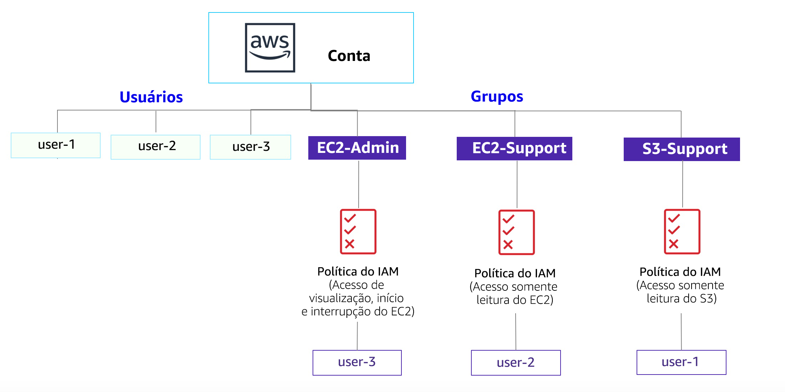

# Laboratório 1: Introdução ao AWS IAM

<!-- Note to translators: This is based on SPL-66. Copy the translation from there. Do not re-translate the whole document. -->

<!-- Copied from Version 3.1.2 (spl66) -->

O **AWS Identity and Access Management (IAM)** é um serviço da Web que possibilita a clientes da Amazon Web Services (AWS) gerenciar usuários e permissões de usuário na AWS. Com o IAM, você pode gerenciar de forma centralizada os **usuários**, as **credenciais de segurança** (como as chaves de acesso) e as **permissões** que controlam quais recursos da AWS os usuários podem acessar.

## Tópicos abordados

Este laboratório demonstrará:

* Como explorar **usuários e grupos do IAM** pré-criados
* Como inspecionar **políticas do IAM**, conforme aplicadas aos grupos pré-criados
* Como adotar um **cenário real** para adicionar usuários a grupos com recursos específicos habilitados
* Como localizar e usar a **URL de login do IAM**
* **Teste** dos efeitos das políticas no acesso ao serviço

&nbsp;
**Outros serviços da AWS**

Durante este laboratório, talvez você receba mensagens de erro ao executar ações que vão além das etapas deste guia. Essas mensagens não afetarão sua capacidade de concluir o laboratório.

&nbsp;
**AWS Identity and Access Management**

O AWS Identity and Access Management (IAM) pode ser usado para:

* **Gerenciar usuários do IAM e seu acesso:** você pode criar usuários e atribuir a eles credenciais de segurança individuais (chaves de acesso, senhas e dispositivos de autenticação multifator). É possível gerenciar permissões para controlar quais operações um usuário pode executar.

* **Gerenciar funções do IAM e suas permissões:** uma função do IAM é semelhante a um usuário, já que é uma identidade da AWS com políticas de permissão que determinam o que a identidade pode e não pode fazer na AWS. Porém, a finalidade de uma função é poder ser *assumida* por qualquer pessoa que necessite dela, e não associada exclusivamente a um único indivíduo.

* **Gerenciar usuários federados e suas permissões:** você pode habilitar a *federação de identidades* para permitir que os usuários existentes na sua empresa acessem o Console de Gerenciamento da AWS, chamem as APIs da AWS e acessem recursos, sem necessidade de criar um usuário do IAM para cada identidade.

**Duração**

O laboratório levará aproximadamente **40 minutos** para ser concluído.

&nbsp;
&nbsp;
## Acessar o Console de Gerenciamento da AWS

1. Na parte superior destas instruções, clique em Start Lab (Iniciar laboratório) para iniciar o laboratório.

   Um painel Start Lab (Iniciar laboratório) é aberto exibindo o status do laboratório. Na caixa de diálogo **Start Lab** (Iniciar laboratório) aberta, observe a região da AWS, pois você precisará se referir a ela mais adiante neste laboratório.

2. Aguarde até que a mensagem “**Lab status: ready**” (Status do laboratório: pronto) seja exibida e clique no **X** para fechar o painel Start Lab (Iniciar laboratório).

3. Na parte superior destas instruções, clique em AWS

   Isso abrirá o Console de Gerenciamento da AWS em uma nova guia do navegador. O sistema fará o seu login automaticamente.

   **Dica**: se uma nova guia do navegador não for aberta normalmente, um banner ou um ícone na parte superior do navegador indicará que o navegador está impedindo que o site abra janelas pop-up. Clique no banner ou ícone e escolha "Allow pop ups" (Permitir pop-ups).

4. Organize a guia do Console de Gerenciamento da AWS para que ela seja exibida com estas instruções. Em um cenário ideal, você poderá ver as duas guias do navegador ao mesmo tempo, para facilitar o acompanhamento das etapas do laboratório.

&nbsp;
&nbsp;
## Tarefa 1: Explorar os usuários e grupos

Nesta tarefa, você poderá explorar os usuários e grupos que foram criados para você no IAM.

5. No **Console de Gerenciamento da AWS**, no menu **Services** (Serviços), clique em **IAM**.

6. No painel de navegação à esquerda, clique em **Users** (Usuários).

   Os seguintes usuários do IAM foram criados para você:

   * user-1
   * user-2
   * user-3

7. Clique em **user-1**.

   Isso levará para uma página de resumo do user-1. A guia **Permissions** (Permissões) será exibida.

8. Observe que user-1 não tem permissões.

9. Clique na guia **Groups** (Grupos).

   O user-1 também não é membro de nenhum grupo.

10. Clique na guia **Security credentials** (Credenciais de segurança).

   O user-1 recebe uma **Senha do console**

11. No painel de navegação à esquerda, clique em **Groups** (Grupos).

   Os seguintes grupos já foram criados para você:

   * EC2-Admin

   * EC2-Support

   * S3-Support

12. Clique no grupo **EC2-Support**.

   Isso o levará à página de resumo do grupo **EC2-Support**.

13. Clique na guia **Permissions** (Permissões).

   Este grupo tem uma política gerenciada associada a ele, chamada **AmazonEC2ReadOnlyAccess**. As políticas gerenciadas são políticas criadas previamente (pela AWS ou por seus administradores) que podem ser associadas a usuários e grupos do IAM. Quando a política é atualizada, as alterações à política são imediatamente aplicadas a todos os usuários e grupos associados a ela.

14. Em **Actions** (Ações), clique no link **Show Policy** (Exibir política).

   Uma política define quais ações são permitidas ou negadas para recursos específicos da AWS. Esta política concede permissão para listar e descrever informações sobre EC2, Elastic Load Balancing, CloudWatch e Auto Scaling. Essa capacidade de visualizar recursos, mas não os modificar, é ideal para atribuir a uma função de suporte.

   A estrutura básica das instruções em uma política do IAM é:

   * **Effect** (Efeito) indica se deseja *Permitir* ou *Negar* as permissões.

   * **Action** (Ação) especifica as chamadas de API que podem ser feitas em um serviço da AWS (por exemplo, *cloudwatch:ListMetrics*).

   * **Resource** (Recurso) define o escopo das entidades cobertas pela regra de política (por exemplo, um bucket específico do Amazon S3 ou uma instância do Amazon EC2; ou *, que indica *qualquer recurso*).

15. Feche <i class="fa fa-times"></i> a janela **Show Policy** (Exibir política).

16. No painel de navegação à esquerda, clique em **Groups** (Grupos).

17. Clique no grupo **S3-Support**.

   O grupo S3-Support tem a política **AmazonS3ReadOnlyAccess** associada.

18. Abaixo do menu **Actions** (Ações), clique no link **Show Policy** (Exibir política).

   Essa política tem permissões para obter e listar recursos no Amazon S3.

19. Feche <i class="fa fa-times"></i> a janela **Show Policy** (Exibir política).

20. No painel de navegação à esquerda, clique em **Groups** (Grupos).

21. Clique no grupo **EC2-Admin**.

   Esse grupo é um pouco diferente dos outros dois. Em vez de uma *Managed Policy (Política gerenciada)*, ele tem uma **Inline Policy** (Política em linha), que é uma política atribuída a apenas um usuário ou grupo. Normalmente, as políticas em linha são usadas para aplicar permissões em situações pontuais.

22. Em **Actions** (Ações), clique em **Show Policy** (Exibir política) para visualizar a política.

   Essa política concede permissão para visualizar (Descrever) informações sobre o Amazon EC2 e permite também iniciar e interromper instâncias.

23. Na parte inferior da tela, clique em **Cancel** Cancelar para fechar a política.

&nbsp;
&nbsp;
## Cenário de negócios

Para o restante deste laboratório, você trabalhará com esses usuários e grupos para habilitar permissões que oferecem suporte ao seguinte cenário de negócios:

Sua empresa está aumentando o uso da Amazon Web Services e está usando muitas instâncias do Amazon EC2 e uma grande quantidade de armazenamento do Amazon S3. Você deseja conceder acesso a novos membros da equipe de acordo com suas funções de trabalho:

| Usuário | No grupo | Permissões |
|----|--------|-----------|
| user-1 | S3-Support | Acesso somente leitura ao Amazon S3 |
| user-2 | EC2-Support | Acesso somente leitura ao Amazon EC2 |
| user-3 | EC2-Admin | Visualizar, iniciar e interromper instâncias do Amazon EC2 |

&nbsp;
&nbsp;
## Tarefa 2: Adicionar usuários aos grupos

Recentemente, você contratou o **user-1** para uma função de suporte ao Amazon S3. Você o adicionará ao grupo **S3-Support** para que ele herde as permissões necessárias por meio da política *AmazonS3ReadOnlyAccess* associada.

<i class="fa fa-comment"></i> Você pode ignorar todos os erros indicando “not authorized (não autorizado)” que aparecem durante essa tarefa. Eles ocorrem porque a conta do laboratório tem permissões limitadas, mas não afetarão sua capacidade de concluir o laboratório.

&nbsp;
&nbsp;
### Adicionar user-1 ao grupo S3-Support

24. No painel de navegação esquerdo, clique em **Groups** (Grupos).

25. Clique no grupo **S3-Support**.

26. Clique na guia **Users** (Usuários).

27. Na guia **Users** (Usuários), clique em **Add Users to Group** (Adicionar usuários ao grupo).

28. Na janela **Add Users to Group** (Adicionar usuários ao grupo), configure o seguinte:

   * Selecione <i class="fa fa-check-square-o"></i> **user-1**.

   * Na parte inferior da tela, clique em **Add Users** (Adicionar usuários).

   Na guia **Users** (Usuários), você verá que user-1 foi adicionado ao grupo.

&nbsp;
&nbsp;
### Adicionar user-2 ao grupo EC2-Support

Você contratou o **user-2** para uma função de suporte ao Amazon EC2.

29. Seguindo etapas semelhantes às anteriores, adicione **user-2** ao grupo **EC2-Support**.

   O user-2 agora fará parte do grupo **EC2-Support**.

&nbsp;
&nbsp;
### Adicionar user-3 ao grupo EC2-Admin

Você contratou o **user-3** como administrador do Amazon EC2, para gerenciar suas instâncias do EC2.

30. Seguindo etapas semelhantes às anteriores, adicione **user-3** ao grupo **EC2-Admin**.

   O user-3 agora fará parte do grupo **EC2-Admin**.

31. No painel de navegação à esquerda, clique em **Groups** (Grupos).

   Cada grupo deve exibir o número **1** na coluna Users (Usuários) referente ao número de usuários em cada grupo.

   Se o número **1** não aparecer ao lado de cada grupo, releia as instruções acima e verifique se cada usuário está atribuído a um grupo, conforme mostrado na tabela na seção Cenário de negócios.

&nbsp;
&nbsp;
## Tarefa 3: Fazer login e testar usuários

Nesta tarefa, você testará as permissões de cada usuário do IAM.

32. No painel de navegação à esquerda, clique em **Dashboard** (Painel).

   Um **Link de login de usuários do IAM** será exibido. Ele será semelhante a este link: *https&#58;//123456789012.signin.aws.amazon.com/console*

   Esse link pode ser usado para fazer login na conta da AWS que você está usando no momento.

33. Copie o **link de login de usuários do IAM** em um editor de texto.

34. Abra uma janela privada.

   **Mozilla Firefox**

   * Clique nas barras de menu <i class="fa fa-bars"></i> no canto superior direito da tela
   * Selecione **New Private Window** (Nova janela privativa)

   **Google Chrome**

   * Clique nos três pontos <i class="fa fa-ellipsis-v"></i> no canto superior direito da tela
   * Clique em **New incognito window** (Nova janela anônima)

   **Microsoft Edge**

   * Clique nos três pontos <i class="fa fa-ellipsis-h"></i> no canto superior direito da tela
   * Clique em **New InPrivate window** (Nova janela InPrivate)

   **Microsoft Internet Explorer**

   * Clique na opção de menu **Tools** (Ferramentas)
   * Clique em **InPrivate Browsing** (Navegação InPrivate)

35. Cole o link do **login de usuários do IAM** em sua janela privada e pressione **Enter**.

   Agora, você fará login como **user-1**, que foi contratado como membro da equipe de suporte ao armazenamento do Amazon S3.

36. Faça login usando as seguintes credenciais:

   * **Nome do usuário do IAM:** `user-1`

   * **Senha:** `Lab-Password1`

37. No menu **Services** (Serviços), clique em **S3**.

38. Clique no nome de um de seus buckets e navegue pelo conteúdo.

   Como faz parte do grupo **S3-Support** no IAM, o usuário tem permissão para visualizar uma lista de buckets do Amazon S3 e todo o conteúdo deles.

   Agora, faça o teste para verificar se eles têm acesso ao Amazon EC2.

39. No menu **Services** (Serviços), clique em **EC2**.

40. No painel de navegação esquerdo, clique em **Instances** (Instâncias).

   Você não pode ver nenhuma instância. Em vez disso, verá a mensagem: *You do not have any instances in this region (Você não tem nenhuma instância nessa região)*. Isso ocorre porque o usuário não recebeu permissões para usar o Amazon EC2.

   Agora, você fará login como **user-2**, que foi contratado como funcionário de suporte ao Amazon EC2.

41. Faça as configurações a seguir para desconectar o user-1 do **Console de Gerenciamento da AWS**:

   * Na parte superior da tela, clique em **user-1**

   * Clique em **Sign Out** (Sair)

42. Cole o link do **login de usuários do IAM** em sua janela privada e pressione **Enter**.

   Esses links devem estar no seu editor de texto.

43. Faça login usando as seguintes credenciais:

   * **Nome do usuário do IAM: ** `user-2`

   * **Senha:** `Lab-Password2`

44. No menu **Services** (Serviços), clique em **EC2**.

45. No painel de navegação à esquerda, clique em **Instances** (Instâncias).

   Agora você pode ver uma instância do Amazon EC2 porque tem permissões Somente leitura. No entanto, você não poderá fazer nenhuma alteração nos recursos do Amazon EC2.

   <i class="fa fa-exclamation-triangle"></i> Se você não conseguir ver uma instância do Amazon EC2, sua região poderá estar incorreta. No canto superior direito da tela, expanda o menu Region (Região) e selecione a região que anotou no início do laboratório (por exemplo, **Norte da Virgínia**).

   Sua instância EC2 deve estar selecionada <i class="fa fa-check-square-o"></i>. Caso contrário, selecione-a <i class="fa fa-check-square-o"></i>.

46. No menu **Actions** (Ações), clique em **Instance State** (Estado da instância) > **Stop** (Interromper).

47. Na janela **Stop Instances** (Interromper instâncias), clique em **Yes, Stop** (Sim, interromper).

   Você receberá a seguinte mensagem de erro: *You are not authorized to perform this operation (Você não está autorizado a realizar esta operação)*. Isso demonstra que a política permite apenas que você veja as informações, sem fazer alterações.

48. Na janela **Stop Instances** (Interromper instâncias), clique em **Cancel** (Cancelar).

   Em seguida, verifique se o user-2 pode acessar o Amazon S3.

49. Em **Services** (Serviços), clique em **S3**.

   Você receberá uma mensagem de erro: <i class="fa fa-exclamation-circle"></i> **Error Access Denied** (Erro de acesso negado) porque o user-2 não tem permissão para usar o Amazon S3.

   Agora, você fará login como **user-3**, que foi contratado como administrador do Amazon EC2.

50. Faça as configurações a seguir para desconectar o user-2 do **Console de Gerenciamento da AWS**:

   * Na parte superior da tela, clique em **user-2**

   * Clique em **Sign Out** (Sair)

51. Cole o link do **login de usuários do IAM** em sua janela privada e pressione **Enter**.

52. Cole o link de login na barra de endereços do navegador da Web novamente. Se ele não estiver na área de transferência, recupere-o do editor de texto no qual você o armazenou anteriormente.

53. Faça login usando as seguintes credenciais:

   * **Nome do usuário do IAM:** `user-3`
   * **Senha:** `Lab-Password3`

54. No menu **Services** (Serviços), clique em **EC2**.

55. No painel de navegação à esquerda, clique em **Instances** (Instâncias).

   Como administrador do EC2, agora você deve ter permissões para interromper a instância do Amazon EC2.

   Sua instância EC2 deve estar selecionada <i class="fa fa-check-square-o"></i>. Caso contrário, selecione-a <i class="fa fa-check-square-o"></i>.

   <i class="fa fa-exclamation-triangle"></i> Se você não conseguir ver uma instância do Amazon EC2, sua região poderá estar incorreta. No canto superior direito da tela, expanda o menu Region (Região) e selecione a região que anotou no início do laboratório (por exemplo, **Oregon**).

56. No menu **Actions** (Ações), clique em **Instance State** (Estado da instância) > **Stop** (Interromper).

57. Na janela **Stop Instances** (Interromper instâncias), clique em **Yes, Stop** (Sim, interromper).

   A instância entrará no estado de *encerramento* e será desligada.

58. Feche a janela privada.

&nbsp;
&nbsp;
## Laboratório concluído

<i class="icon-flag-checkered"></i> Parabéns! Você concluiu o laboratório.

59. Clique em End Lab (Encerrar laboratório) na parte superior desta página e, em seguida, clique em Yes (Sim) para confirmar que você deseja encerrar o laboratório.

   Um painel será exibido com a mensagem: "DELETE has be initiated... You may close this message box now." (a EXCLUSÃO foi iniciada... Você pode fechar esta caixa de mensagem agora).

60. Clique no **X** no canto superior direito para fechar o painel.

&nbsp;
&nbsp;
## Conclusão

<i class="far fa-thumbs-up" style="color:blue"></i> Parabéns! Agora você:

* Explorou os usuários e grupos do IAM pré-criados

* Inspecionou as políticas do IAM conforme aplicadas aos grupos pré-criados

* Seguiu um cenário real para adicionar usuários a grupos com recursos específicos habilitados

* Localizou e usou a URL de login do IAM

* Testou os efeitos das políticas no acesso ao serviço

&nbsp;
&nbsp;
## Recursos adicionais

* <a href="http://aws.amazon.com/training/" target="_blank">AWS Training and Certification</a>
* <a href="http://aws.amazon.com/iam/" target="_blank">Para obter mais informações sobre o AWS IAM</a>

Envie feedback, sugestões ou correções por e-mail para: <aws-course-feedback@amazon.com>

