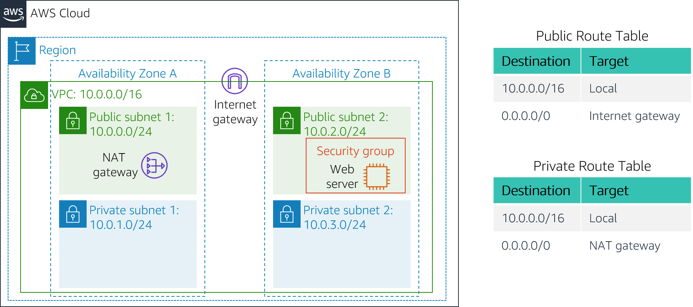

# Lab 2: Building Your VPC and Launching a Web Server

&nbsp;

In this lab, you will use Amazon Virtual Private Cloud (Amazon VPC) to create your own VPC and add additional components to produce a customized network. You will also create security groups for your Amazon Elastic Compute Cloud (Amazon EC2) instance. You will then configure and customize an EC2 instance to run a web server and launch it in the VPC. This lab is based on the AWS Command Line Interface (AWS CLI). Feel free to explore the [AWS CLI documentation for Amazon EC2](https://awscli.amazonaws.com/v2/documentation/api/latest/reference/ec2/index.html) as you work through the lab.

*Amazon Virtual Private Cloud (Amazon VPC)* enables you to launch Amazon Web Services (AWS) resources into a virtual network that you define. This virtual network closely resembles a traditional network that you would operate in your own data center, with the benefits of using the scalable infrastructure of AWS. You can create a VPC that spans multiple Availability Zones.

&nbsp;

**Scenario**

In this lab, you will build the following infrastructure:



&nbsp;&nbsp;

**Objectives**

After completing this lab, you should be able to:

- Create a VPC
- Create subnets
- Configure a security group
- Launch an EC2 instance in a VPC

&nbsp;

**Duration**

This lab takes approximately **60 minutes** to complete.


&nbsp;&nbsp;

**Other AWS services**

During this lab, you might receive error messages when you perform actions beyond the steps in this lab guide. These messages will not impact your ability to complete the lab.


## Launching your lab environment

1. At the top of these instructions, launch this lab by choosing <span id="ssb_voc_grey">Start Lab</span> 

   A **Start Lab** panel opens, and it displays the lab status.

2. Wait until you see the message *Lab status: ready*, then close the **Start Lab** panel by selecting the **X**.

   This lab launches an EC2 instance that's named *Bastion Host*. You will use this server to create lab resources by running the AWS CLI commands.

3. Above these instructions, select the <span id="ssb_voc_grey">Details</span> dropdown menu, and then select <span id="ssb_voc_grey">Show</span>
  
    Copy all the lab details—such as *BastionHost*, *UserAccessSecretKey*, *Region*, and others—to a text file and save it as `Lab Details.txt`. 

**Note**: Make sure that you use a *text editor* (a program for editing text files) to save the file. Examples of text editors include [Atom](https://atom.io/), [Sublime Text](https://www.sublimetext.com/), or [Microsoft Visual Studio Code](https://code.visualstudio.com/).
    
In the lab, the information that you saved will be referred to as <u>*Lab Details*</u>.


## Using SSH to connect to the Bastion Host

### Microsoft Windows users

<i class="fas fa-comment"></i> These instructions are specifically for Microsoft Windows users. If you are using macOS or Linux, <a href="#ssh-MACLinux">skip to the next section</a>.
​
4. Above these instructions that you are currently reading, choose the <span id="ssb_voc_grey">Details</span> dropdown menu and then choose <span id="ssb_voc_grey">Show</span>
  
   A **Credentials** window opens.
   
5. Choose the **Download PPK** button and save the **labsuser.ppk** file.

    Typically, your browser will save the file to the **Downloads** directory.

6. Close the **Credentials** window by choosing the **X**.

7. From the Lab Details text file, note the **Bastion Host** address. 

8. Download **PuTTY** so that you can use SSH to connect to the EC2 instance. If you don't have PuTTY installed on your computer, <a href="https://the.earth.li/~sgtatham/putty/latest/w64/putty.exe">download it here</a>.

9. Open **putty.exe**

10. Configure PuTTY timeout to keep the PuTTY session open for a longer period of time.
    * Choose **Connection**
    * Set **Seconds between keepalives** to `30`

11. Configure your PuTTY session:
    * Choose **Session**
    * **Host Name (or IP address):** Paste the *Public DNS or IPv4 address* of the Bastion Host instance that you noted earlier. 
    * Back in PuTTY, in the **Connection** list, expand <i class="far fa-plus-square"></i> **SSH**
    * Choose **Auth** *(don't expand it)*
    * Choose **Browse**
    * Browse to and select the **labsuser.ppk** file that you downloaded
    * Choose **Open** to select it
    * Choose **Open** again

12. To trust and connect to the host, choose **Yes**.

13. When prompted to **login as**, enter: `ec2-user`
  
    This action will connect you to the EC2 instance.

14. Windows users: <a href="#ssh-after"> Skip ahead to the next task.</a>

<a id='ssh-MACLinux'></a>


### macOS and Linux users

These instructions are specifically for macOS or Linux users. If you are a Windows user, <a href="#ssh-after">skip ahead to the next task.</a>

15. Above these instructions (that you are currently reading), choose the <span id="ssb_voc_grey">Details</span> dropdown menu and then choose <span id="ssb_voc_grey">Show</span> 

A **Credentials** window opens.

16. Choose the **Download PEM** button and save the **labsuser.pem** file.

17. Exit the **Credentials** window by choosing the **X**.

18. From the Lab Details text file, note the **Bastion Host** address. 

19. Open a terminal window, and change directory (by using `cd`) to the directory where the *labsuser.pem* file was downloaded.
  
    For example, if the *labsuser.pem* file was saved to your **Downloads** directory, run this command:

    ```bash
    cd ~/Downloads
    ```

20. Change the permissions on the key to be read-only by running this command:

    ```bash
    chmod 400 labsuser.pem
    ```

21. Run the following command *(replace **&lt;public-ip-address&gt;** with the **Bastion Host** address that you copied previously)*. 

    ```bash
    ssh -i labsuser.pem ec2-user@<public-ip-address>
    ```
22. When you are prompted to allow the first connection to this remote SSH server, enter: `yes` 

Because you are using a key pair for authentication, you will not be prompted for a password.

<a id='ssh-after'></a>


### Configuring the AWS CLI

You will use the information from the Lab Details text file that you created in the *Launch Your Lab Environment* task.

The *Bastion Host* instance has an instance profile that's called *EC2InstanceProfile* associated with it. This instance profile gives it the required permissions. 


23. In the terminal window, configure the AWS CLI.​

   ```bash
aws configure
   ```

24. At the prompts, enter the following information. For the access key, secret access key, and Region settings, use the values from the Lab Details text file.

  **Note**: Ensure that you copy and paste the correct user values from the Lab Details text file to these fields. 

  -  **AWS Access Key ID**: *AccessKey* value
  -  **AWS Secret Access Key**: *SecretKey* value
  -  **Default region name**:  Name of the Region (for example, `us-east-1` or `eu-west-2`)
  -  **Default output format**: `json`


&nbsp;

## Task 1: Creating your VPC

In this task, you will use the AWS CLI to create a VPC and an internet gateway in a single Availability Zone. An *internet gateway* is a VPC component that allows communication between instances in your VPC and the internet.

After you create a VPC, you can add *subnets*. Each subnet resides entirely in one Availability Zone and can't span Availability Zones. If a subnet's traffic is routed to an internet gateway, the subnet is known as a *public subnet*. If a subnet doesn't have a route to an internet gateway, the subnet is known as a *private subnet*.

<i class="fas fa-comment"></i> Unless otherwise noted, all steps are completed by using the *Work Server* command line.


25. Create a VPC.

   Run the following command, and set these options. 

   - **cidr-block:** `10.0.0.0/16`

     The VPN has a Classless Inter-Domain Routing (CIDR) block of *10.0.0.0/16*. This CIDR block contains all IP addresses that start with *10.0.x.x*. 

   - **region:** `us-east-1`

    ```bash
   aws ec2 create-vpc --cidr-block 10.0.0.0/16 --region us-east-1
    ```

   To run commands, press the ENTER key.

   Example output:

    >{
    >
    >"Vpc": {
    >
    >    **"VpcId": "vpc-002e01aXXXXXXXXX"**,
    >    
    >    "InstanceTenancy": "default", 
    >    
    >    "Tags": [], 
    >    
    >    "CidrBlockAssociationSet": [
    >    
    >      {
    >     
    >        "AssociationId": "vpc-cidr-assoc-04169db9XXXXXXXXX", 
    >            
    >        "CidrBlock": "10.0.0.0/16", 
    >             
    >        "CidrBlockState": {
    >             
    >        "State": "associated"
    >     
    >        }
    >             
    >       }
    >     
    >     ], 
    >     
    >     "Ipv6CidrBlockAssociationSet": [], 
    >     
    >     "State": "pending", 
    >     
    >     "DhcpOptionsId": "dopt-09e8dfcXXXXXXXXX", 
    >     
    >     "OwnerId": "484652755256", 
    >     
    >     "CidrBlock": "10.0.0.0/16", 
    >     
    >     "IsDefault": false
    >     
    > }
    > 
    >}

26. Make a note of the *VpcId* value (for example, copy it from the output and paste it in the Lab Details text file). The VPC ID will look similar to *vpc-0187eedeaxxxxxx3*.

27. To make your VPC easier to manage in the future, assign a tag to it. Run the following command with the *VpcId* value. 

   ```bash
   aws ec2 create-tags --resources <VpcId> --tags 'Key=Name,Value="Lab VPC"'
   ```

   The following example shows this command updated with a *VpcId* value:

   ```
   aws ec2 create-tags --resources vpc-0187eedeaa5xxxxx3 --tags 'Key=Name,Value="Lab VPC"'
   ```

   <i class="fas fa-comment"></i> If you must look up details about your VPC later in the lab, you can use the following command.

   ```bash
   aws ec2 describe-vpcs --filters Name=tag:Name,Values="Lab VPC"
   ```

   Example output:

     >{
     >
     >"Vpcs": [
     >
     >{
     >
     > "VpcId": "vpc-09ad15ed2578fd07c", 
     >
     > "InstanceTenancy": "default", 
     >
     > "Tags": [
     >
     > {
     >
     >   "Value": "Lab VPC", 
     >     
     >   "Key": "Name"
     >
     > }
     >
     > ], 
     >
     > "CidrBlockAssociationSet": [
     >
     >  {
     >
     >   "AssociationId": "vpc-cidr-assoc-0abc37b35e6b7e4d3", 
     >     
     >   "CidrBlock": "10.0.0.0/16", 
     >     
     >    "CidrBlockState": {
     >     
     >    "State": "associated"
     >     
     >    }
     >
     >  }
     >
     > ], 
     >
     > "State": "available", 
     >
     > "DhcpOptionsId": "dopt-04541c0cef2906622", 
     >
     > "OwnerId": "523831018285", 
     >
     > "CidrBlock": "10.0.0.0/16", 
     >
     > "IsDefault": false
     >
     >  }
     >
     > ]
     >
     >}

28. Create a new internet gateway.

  ```bash
  aws ec2 create-internet-gateway
  ```

  Example output:

    >{
    >  "InternetGateway": {
    >         
    >    "Tags": [], 
    >         
    >    "Attachments": [], 
    >         
    >    **"InternetGatewayId": "igw-0e58324325xxxxx5"**
    >     
    >  }
    >     
    >}

29. Save the *InternetGatewayId* value to the Lab Details text file. It should look similar to *igw-0b8ba89b3xxxxxx3*.

30. Assign a tag to your internet gateway.

  Run the following command with the ID of the internet gateway that you just created.

  ```bash
  aws ec2 create-tags --resources <InternetGatewayId> --tags 'Key=Name,Value="Lab IGW"'
  ```

31. Attach the internet gateway to your VPC. This action allows your VPC to access the public internet. Without it, your VPC is like a house without doors that open to the outside. 

   Run the following command with your internet gateway ID and VPC ID.

   ```bash
   aws ec2 attach-internet-gateway --internet-gateway-id <InternetGatewayId> --vpc-id <VpcId>
   ```


## Task 2: Creating a public subnet

In this task, you will create a public subnet. You can use these same steps to create additional subnets in a second Availability Zone. Creating resources in multiple Availability Zones provides _high availability (HA)_.

A subnet must be associated with one (and only one) Availability Zone. For this task, uou will create your public subnet in the first Availability Zone.

32. Find the *ZoneId* value of the first Availability Zone.

    ```bash
    aws ec2 describe-availability-zones --filters Name=zone-name,Values=us-east-1a
    ```

    In the output, locate the *ZoneId* value and save it in the Lab Details file.

    Example output: In this example, the *ZoneId* value is *use1-az6*.

    >{
    >
    >    "AvailabilityZones": [
    >    
    >    {
    >    
    >      "OptInStatus": "opt-in-not-required", 
    >     
    >      "Messages": [], 
    >     
    >      **"ZoneId": "use1-az6",**
    >     
    >      "GroupName": "us-east-1", 
    >     
    >      "State": "available", 
    >     
    >      "NetworkBorderGroup": "us-east-1", 
    >     
    >      "ZoneName": "us-east-1a", 
    >     
    >      "RegionName": "us-east-1"
    >     
    >    }
    >    
    >    ]
    >    
    >}

33. Create a public subnet.

    Run the following command by setting these options.

    * **availability-zone-id:**  *ZoneId* value from the previous step 

    * **cider-block:** `10.0.0.0/24`

    * **vpc-id:** *VpcId* value that you saved previously

    ```bash
    aws ec2 create-subnet --availability-zone-id <ZoneId> --cidr-block 10.0.0.0/24 --vpc-id <VpcId>
    ```

    The public subnet has a CIDR block of *10.0.0.0/24*. It contains all the IP addresses that start with *10.0.0.x*.

    Example output:

    >{
    >
    >      "Subnet": {
    >     
    >        "MapPublicIpOnLaunch": false, 
    >     
    >        "AvailabilityZoneId": "use1-az6", 
    >     
    >        "AvailableIpAddressCount": 251, 
    >     
    >        "DefaultForAz": false, 
    >     
    >        "SubnetArn": "arn:aws:ec2:us-east-1:523831018285:subnet/subnet-0ebe1d4bd2deeae16", 
    >     
    >        "Ipv6CidrBlockAssociationSet": [], 
    >     
    >        "VpcId": "vpc-09ad15edxxxxxxxxc", 
    >     
    >        "State": "pending", 
    >     
    >        "AvailabilityZone": "us-east-1a", 
    >     
    >        **"SubnetId": "subnet-0ebe1d4bdxxxxxxx6"**,
    >     
    >        "OwnerId": "523831018285", 
    >     
    >        "CidrBlock": "10.0.0.0/24", 
    >     
    >        "AssignIpv6AddressOnCreation": false
    >     
    >      }
    >     
    >}

34. Save the *SubnetId* value of the public subnet. It should look similar to *subnet-0234acc518f2e1835.*

35. Add a tag to the public subnet.

    Run the following command with the *SubnetId* value of the public subnet.

    ```bash
    aws ec2 create-tags --resources <public-subnet-SubnetId> --tags 'Key=Name,Value="Lab Public Subnet"'
    ```

    
## Task 3: Creating a NAT gateway

A _NAT gateway_ provides internet connectivity to EC2 instances in private subnets. NAT gateways must reside in a public subnet so that they can forward requests outside the VPC. 

You will use the *Lab Public Subnet* to host the NAT gateway.

36. Create an Elastic IP reservation. This resource assigns a public IP address to the NAT gateway.

    Run the following command:

    ```bash
    aws ec2 allocate-address
    ```

    Example output:

    >{
    >
    >  "Domain": "vpc", 
    >  
    >  "PublicIpv4Pool": "amazon", 
    >  
    >  "PublicIp": "184.73.52.246", 
    >  
    >  **"AllocationId": "eipalloc-0c68d3321xxxxxxe"**,
    >  
    >  "NetworkBorderGroup": "us-east-1"
    >  
    >}

37. Save the *AllocationId* value. It will look similar to *eipalloc-0f009b89xxxxxx8*. 

38. Create the NAT gateway.

    Run the following command with the values of both the public *SubnetId* and the *AllocationId*:

    ```bash
    aws ec2 create-nat-gateway --subnet-id <SubnetId> --allocation-id <AllocationId>
    ```
    
    Example output:

    >{
    >
    >  "NatGateway": {
    >  
    >    "NatGatewayAddresses": [
    >    
    >      {
    >     
    >        "AllocationId": "eipalloc-0c68d3321xxxxxxe"
    >     
    >      }
    >     
    >    ], 
    >    
    >    "VpcId": "vpc-09ad15ed25xxxxxxxc", 
    >    
    >    "State": "pending", 
    >    
    >    **"NatGatewayId": "nat-0c6837629xxxxxxd"**,
    >    
    >    "SubnetId": "subnet-0ebe1d4bdxxxxxx6", 
    >    
    >    "CreateTime": "2020-05-12T13:54:25.000Z"
    >    
    >  }
    >  
    >}

39. Save the *NatGatewayId* value. It will look similar to *nat-0db71ddbdxxxxx2*.


## Task 4: Creating a route table for the public subnet

You will now configure the *Lab Public Subnet* to route internet-bound traffic to the _internet gateway_ so that resources in the public subnet can connect to the internet. You do this by configuring a _route table_.

A *route table* contains a set of rules, called *routes*, that determine where network traffic is directed. The route table controls routing for the subnet.

First, you will create a _route table_ in a VPC. Then, you will associate each subnet in a VPC with the route table. 

40. Create a new route table for the public subnet.

    Run the following command with the *VpcId* value that you saved previously:

    ```bash
    aws ec2 create-route-table --vpc-id <VpcId>
    ```

    Example output:

    >{
    >
    >  "RouteTable": {
    >  
    >    "Associations": [], 
    >    
    >    **"RouteTableId": "rtb-074b34310xxxxxxx4"**,
    >    
    >    "VpcId": "vpc-09ad15ed2xxxxxxc",
    >     
    >    "PropagatingVgws": [], 
    >    
    >    "Tags": [], 
    >    
    >    "Routes": [
    >    
    >      {
    >     
    >        "GatewayId": "local", 
    >     
    >        "DestinationCidrBlock": "10.0.0.0/16", 
    >     
    >        "State": "active", 
    >     
    >        "Origin": "CreateRouteTable"
    >     
    >      }
    >     
    >    ], 
    >    
    >    "OwnerId": "523831018285"
    >    
    >  }
    >  
    >}

41. Save the *RouteTableId* value of the public subnet. It will look similar to *rtb-05cf777cxxxxxxe*.

42. Add a tag to the public route table.

    Run the following command with the *RouteTableId* value of the public subnet:

    ```bash
    aws ec2 create-tags --resources <public-subnet-RouteTableId> --tags 'Key=Name,Value="Public Subnet Route Table"'
    ```

43. Add a route to the public route table.

    The route table must be told where to send requests. Routing is based on CIDR block ranges. For this rule, if a request is made to any address outside the VPC CIDR block, the route will send the request to the internet gateway. The CIDR range *0.0.0.0/0* means that requests can be sent to *all* IP addresses, or anywhere on the internet. 

    Run the following command by setting these options.

    - **destination-cidr-block:** `0.0.0.0/0`
    - **gateway-id:** *InternetGatewayId* value that you saved previously
    - **route-table-id:** Public subnet *RouteTableId* value

    ```bash
    aws ec2 create-route --destination-cidr-block 0.0.0.0/0 --gateway-id <InternetGatewayId> --route-table-id <public-subnet-RouteTableId>
    ```

    Example output:

    >{
    >
    >  "Return": true
    >
    >}

44. Next, associate the *Public Subnet Route Table* with the *Lab Public Subnet*.

    Run the following command by setting these options.

    - **route-table-id:** Public subnet *RouteTableId* value
    - **subnet-id:** Public subnet *SubnetId* value 

    ```bash
    aws ec2 associate-route-table --route-table-id <public-subnet-RouteTableId> --subnet-id <public-subnet-SubnetId>    
    ```

    Example output:

    >{
    >
    >  "AssociationState": {
    >
    >      "State": "associated"
    >
    >  }, 
    >
    >  **"AssociationId": "rtbassoc-0c1a558699xxxxxx6"**
    >
    >}


&nbsp;

## Task 5: Creating a private subnet

In this task, you will create a *private subnet* in the same Availability Zone. However, you could reuse these basic steps that you used to create the public subnet to create additional subnets in a second Availability Zone. Recall that creating resources in multiple Availability Zones provides HA.


45. Create a private subnet.

    Edit the following command by setting these options.

    * **availability-zone-id:** *ZoneId* value that you used for the public subnet 

    * **cider-block:** `10.0.1.0/24`

    * **vpc-id:** *VpcId* value that you used previously

    ```bash
    aws ec2 create-subnet --availability-zone-id <ZoneId> --cidr-block 10.0.1.0/24 --vpc-id <VpcId>
    ```

    The private subnet has a CIDR block of *10.0.1.0/24*. It contains all IP addresses that start with *10.0.1.x*.

    Example output:

    >{
    >
    >    "Subnet": {
    >    
    >        "MapPublicIpOnLaunch": false, 
    >     
    >        "AvailabilityZoneId": "use1-az6", 
    >     
    >        "AvailableIpAddressCount": 251, 
    >     
    >        "DefaultForAz": false, 
    >     
    >        "SubnetArn": "arn:aws:ec2:us-east-1:523831018285:subnet/subnet-0ed85b0982eaa802c", 
    >     
    >        "Ipv6CidrBlockAssociationSet": [], 
    >     
    >        "VpcId": "vpc-09ad15ed2xxxxxxc", 
    >     
    >        "State": "pending", 
    >     
    >        "AvailabilityZone": "us-east-1a", 
    >     
    >        **"SubnetId": "subnet-0ed85b098xxxxxxc"**,
    >     
    >        "OwnerId": "523831018285", 
    >     
    >        "CidrBlock": "10.0.1.0/24", 
    >     
    >        "AssignIpv6AddressOnCreation": false
    >     
    >    }
    >    
    >}

46. Save the *SubnetId* value of the private subnet. 

47. Add a tag to the private subnet.

    Run the following command with *SubnetId* value of the private subnet.

    ```bash
    aws ec2 create-tags --resources <private-subnet-SubnetId> --tags 'Key=Name,Value="Lab Private Subnet"'
    ```


## Task 6: Creating a route table for the private subnet

You will now configure the *Lab Private Subnet* to route internet-bound traffic to the _NAT gateway_. By doing so, resources in the private subnet can connect to the internet, while still keeping the resources private. 

You will create another *route table*, add a route to the table, and associate the table with the *Lab Private Subnet*.

48. Create a new route table for the private subnet.

    Run the following command with the *VpcId* value that you saved previously:

    ```bash
    aws ec2 create-route-table --vpc-id <VpcId>
    ```

    Example output:

    >{
    >
    >  "RouteTable": {
    >  
    >    "Associations": [], 
    >    
    >    **"RouteTableId": "rtb-0302d7607xxxxxx8",** 
    >    
    >    "VpcId": "vpc-09ad15edxxxxxxc", 
    >    
    >    "PropagatingVgws": [], 
    >    
    >    "Tags": [], 
    >    
    >    "Routes": [
    >    
    >      {
    >     
    >        "GatewayId": "local", 
    >     
    >        "DestinationCidrBlock": "10.0.0.0/16", 
    >     
    >        "State": "active", 
    >     
    >        "Origin": "CreateRouteTable"
    >     
    >      }
    >     
    >    ], 
    >    
    >    "OwnerId": "523831018285"
    >    
    >  }
    >  
    >}

49. Save the *RouteTableId* value of the private subnet.

50. Tag the route table for the private subnet.

    Run the following command with the *RouteTableId* value of the private subnet:

    ```bash
    aws ec2 create-tags --resources <private-subnet-RouteTableId> --tags 'Key=Name,Value="Private Subnet Route Table"'
    ```

51. Add a route to the route table for the private subnet.

    Recall that route tables are configured to send requests, and that routing is based on CIDR block ranges. For this rule, the route will send a request that's made to any address outside the VPC CIDR block to the NAT gateway. The CIDR range *0.0.0.0/0* means *all* IP addresses, or any IP address from anywhere. 

    Run the following command by setting these optionss:

    - **destination-cidr-block:** `0.0.0.0/0`
    - **gateway-id:** *NatGatewayId* value that you saved previously
    - **route-table-id:** Private subnet *RouteTableId* value

    ```bash
    aws ec2 create-route --destination-cidr-block 0.0.0.0/0 --nat-gateway-id <NatGatewayId> --route-table-id <private-subnet-RouteTableId>
    ```

    Example output:

    >{
    >
    >  "Return": true
    >
    >}

52. Next, associate the *Private Subnet Route Table* with the *Lab Private Subnet*.

    Run the following command by setting these options.

    - **route-table-id:** Private subnet *RouteTableId* value
    - **subnet-id:** Private subnet *SubnetId* value 

    ```bash
    aws ec2 associate-route-table --route-table-id <private-subnet-RouteTableId> --subnet-id <private-subnet-SubnetId>
    ```

    Example output:

    >{
    >
    >  "AssociationState": {
    >  
    >    "State": "associated"
    >    
    >  }, 
    >  
    >  **"AssociationId": "rtbassoc-00812e516xxxxxx5"**
    >  
    >}


## Task 7: Creating a VPC security group

In this task, you will create a VPC security group, which acts as a virtual firewall. When you launch an EC2 instance, you associate one or more security groups with the instance. You can add rules to each security group that allow traffic to or from its associated instances.

53. Create a new security group.

    Run the following command with the *VpcId* value that you used previously:

    ```bash
    aws ec2 create-security-group --description "Enable HTTP access" --group-name "Web Security Group" --vpc-id <VpcId>
    ```
    
    Example output:

    >{
    >
    >  "GroupId": "sg-0a0879f902xxxxxx7"
    >  
    >}

54. Save the *GroupId* value of the security group. It will look similar to *sg-08e8e4f61xxxxxxf*.

55. Add an _ingress rule_ to the security group.

    _Ingress rules_ control traffic that enters a VPC. They allow requests to access designated ports by using the specified protocols. The requests are also filtered by the source IP address by using the *CIDR* option.

    Run the following command by setting these options.

    - **group-id:** Security group *GroupId* value
    - **protocol:** `tcp`
    - **port:** `80`
    - **cidr:** `0.0.0.0/0`

    ```bash
    aws ec2 authorize-security-group-ingress --group-id <security-group-GroupId> --protocol tcp --port 80 --cidr 0.0.0.0/0
    ```
    
    You will use this security group in the next task when you launch an EC2 instance.


## Task 8: Launching a web server instance

In this task, you will launch an EC2 instance into the new VPC. You will configure the instance to act as a web server.

56. Find the Amazon Machine Image (AMI) ID of the Amazon Linux 2 image.

    Because Amazon periodically updates machine images, you must identify the most recent AMI ID that is available.

    ```bash
    aws ec2 describe-images --owners amazon --filters 'Name=name,Values=amzn2-ami-hvm-2.0.????????.?-x86_64-gp2' 'Name=state,Values=available' --query 'reverse(sort_by(Images, &CreationDate))[:1].ImageId' --output text
    ```
    
    Example output:

    > 
    > ami-0323c3dd2da7fb37d
    
57. Save the *ImageId* value. It will look similar to *ami-0fc61db85xxxxxed*.

58. Retrieve the user_data.txt file by running the following command.

    ```bash
    wget https://aws-tc-largeobjects.s3-us-west-2.amazonaws.com/CUR-TF-100-ACCLFO-2/lab2-cli-vpc/user_data.txt
    ```
    
    The user_data.txt file will be passed as a parameter in the *ec2 run-instances* command. This file contains commands that will run on the new Amazon EC2 host after it starts.
    
    Review the contents of the user_data.txt file:

    ```bash
    #!/bin/bash
    # Install Apache Web Server and PHP
    yum install -y httpd mysql php
    # Download Lab files
    wget %% S3_HTTP_PATH_PREFIX %%/lab-app.zip
    unzip lab-app.zip -d /var/www/html/
    # Turn on web server
    chkconfig httpd on
    service httpd start
    ```


59. Create an EC2 instance in the *Lab Public Subnet*.

    Run the following command by setting these options.

    - **image-id:** AMI *ImageId* value
    - **instance-type:** `t2.micro`
    - **key-name:** `vockey`
    - **security-group-ids:** Security group *GroupId* value
    - **subnet-id:** Public subnet *SubnetId* value

    <i class="fas fa-comment"></i> This command is split across multiple lines for legibility. The back slash (\\) at the end of a line indicates that the command continues to the next line. You could also enter this entire command on a single line, but you would need to remove the back slashes.

    ```bash
    aws ec2 run-instances --image-id <ami-ImageId> --count 1 --instance-type t2.micro \
    --key-name vockey --security-group-ids <security-group-GroupId> --subnet-id <public-subnet-SubnetId> \
    --associate-public-ip-address --user-data file://user_data.txt \
    --tag-specifications 'ResourceType=instance,Tags=[{Key=Name,Value="Web Server 1"}]'
    ```
    
    
    Example output: The following output is an excerpt. You can find the EC2 instance ID in the top-half of the output.
        
    >{
    >
    >  "Instances": [
    >  
    >    {
    >    
    >      "Monitoring": {
    >     
    >        "State": "disabled"
    >     
    >      }, 
    >     
    >      "PublicDnsName": "", 
    >     
    >      "StateReason": {
    >     
    >        "Message": "pending", 
    >     
    >        "Code": "pending"
    >     
    >      }, 
    >     
    >      "State": {
    >     
    >        "Code": 0, 
    >     
    >        "Name": "pending"
    >     
    >      }, 
    >     
    >      "EbsOptimized": false, 
    >     
    >      "LaunchTime": "2020-05-12T14:26:34.000Z", 
    >     
    >      "PrivateIpAddress": "10.0.0.213", 
    >     
    >      "ProductCodes": [], 
    >     
    >      "VpcId": "vpc-09ad15ed25xxxxxxc", 
    >     
    >      "CpuOptions": {
    >     
    >        "CoreCount": 1, 
    >     
    >        "ThreadsPerCore": 1
    >     
    >      }, 
    >     
    >      "StateTransitionReason": "", 
    >     
    >      **"InstanceId": "i-0109b9c4d9xxxxxxb"**,
    >     
    >      "ImageId": "ami-0323c3dd2da7fb37d", 
    >     
    >      "PrivateDnsName": "ip-10-0-0-213.ec2.internal", 
    >     
    >      "KeyName": "vockey", 
    >     
    >      "SecurityGroups": [
    >     
    >       {
    >     
    >        "GroupName": "Web Security Group", 
    >          
    >        "GroupId": "sg-0a0879f902xxxxx7"
    >     
    >       }
    >     
    >      ], 


60. Save the *InstanceId* value of the EC2 instance. It will look similar to *i-05e986d21xxxxx2*.

61. Retrieve the public IP address of the EC2 instance by running the following command.

    Update this command with the *InstanceID* value:

    ```bash
      aws ec2 describe-instances --filter Name=instance-id,Values=<ec2-instance-InstanceId>
    ```

    Example output: This output is an excerpt. You can find the *PublicIP* value in the **NetworkInterfaces** section of the output.

    >"NetworkInterfaces": [
    >
    >{
    >
    >"Status": "in-use", 
    >
    >"MacAddress": "0e:24:21:4c:03:bf", 
    >
    >"SourceDestCheck": true, 
    >
    >"VpcId": "vpc-09ad15ed25xxxxxxc", 
    >
    > "Description": "", 
    >
    > "NetworkInterfaceId": "eni-049d461cc2xxxxxx5", 
    >
    > "PrivateIpAddresses": [
    >
    >   {
    >
    >   "PrivateIpAddress": "10.0.0.213", 
    >     
    >   "Primary": true, 
    >     
    >   "Association": {
    >     
    >     **"PublicIp": "54.166.255.25"**,
    >         
    >     "PublicDnsName": "", 
    >     
    >     "IpOwnerId": "amazon"    
    >    }
    >
    >   }
    >
    > ], 
    
    
    
    Wait a few minutes for the instance to start before you continue to the next step.
    
62. Open a new web browser tab, paste the public IP address into the browser, and press ENTER.

    A webpage that displays the AWS logo and instance metadata values should open.

    The complete architecture that you deployed is:

    

&nbsp;


## Lab complete

<i class="icon-flag-checkered"></i> Congratulations! You have completed the lab.

63. To confirm that you want to end the lab, at the top of this page, choose <span id="ssb_voc_grey">End Lab</span> and then choose <span id="ssb_blue">Yes</span>

   A panel should appear with this message: *DELETE has been initiated... You may close this message box now.*
   ​
64. To close the panel, choose the **X** in the top-right corner.


### Contact us

[Report an error or correction.](mailto:aws-course-feedback@amazon.com)

For other questions, contact us through the [Contact AWS Training and Certification page.](https://aws.amazon.com/contact-us/aws-training)

*©2021 Amazon Web Services, Inc. and its affiliates. All rights reserved. This work may not be reproduced or redistributed, in whole or in part, without prior written permission from Amazon Web Services, Inc. Commercial copying, lending, or selling is prohibited.*
