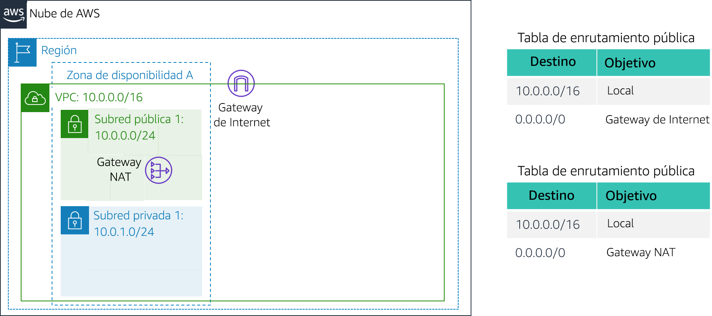

# Laboratorio 2: Creación de una VPC y lanzamiento de un servidor web

<!-- Note to translators: This is based on Technical Essentials Lab 1. Copy the translation from there. Do not re-translate the whole document.-->

&nbsp;

**Versión 4.6.6 (TESS1)**

En este laboratorio, deberá utilizar Amazon Virtual Private Cloud (VPC) para crear su propia VPC y agregarle componentes adicionales con el fin de generar una red personalizada. Además, creará grupos de seguridad para su instancia EC2. Luego, tendrá que configurar y personalizar una instancia EC2 para ejecutar un servidor web y lanzarlo en la VPC.

**Amazon Virtual Private Cloud (Amazon VPC)** le permite lanzar recursos de Amazon Web Services (AWS) en la red virtual que usted defina. Esta red virtual se asemeja en gran medida a una red tradicional que ejecutaría en su propio centro de datos, con los beneficios de utilizar la infraestructura escalable de AWS. Puede crear una VPC que abarque varias zonas de disponibilidad.

&nbsp;

**Situación**

En este laboratorio, creará la siguiente infraestructura:


&nbsp;&nbsp;

**Objetivos**

Después de completar este laboratorio, podrá hacer lo siguiente:

- Crear una VPC
- Crear subredes
- Configurar un grupo de seguridad
- Lanzar una instancia EC2 en una VPC

&nbsp;

**Duración**

La duración estimada de este laboratorio es de **30 minutos** aproximadamente.

&nbsp;&nbsp;
## Acceso a la consola de administración de AWS

1. En la parte superior de estas instrucciones, haga clic en <span id="ssb_voc_grey">Start Lab</span> (Iniciar laboratorio) para lanzar su laboratorio.

   Se abrirá el panel “Start Lab” (Iniciar laboratorio), donde se muestra el estado del laboratorio.

2. Espere hasta que aparezca el mensaje “**Lab status: ready**” (Estado del laboratorio: listo) y, luego, haga clic en la **X** para cerrar el panel “Start Lab (Iniciar laboratorio)”.

3. En la parte superior de estas instrucciones, haga clic en <span id="ssb_voc_grey">AWS</span>.

   La consola de administración de AWS se abrirá en una nueva pestaña del navegador. El sistema iniciará su sesión automáticamente.

   **Sugerencia**: Si no se abre una pestaña nueva del navegador, debería aparecer un banner o un icono en la parte superior de este, el cual indique que el navegador no permite que se abran ventanas emergentes en el sitio. Haga clic en el banner o en el icono, y elija “Allow pop ups” (Permitir ventanas emergentes).

4. Ubique la pestaña de la consola de administración de AWS en un lugar donde aparezca al lado de estas instrucciones. Idealmente, debería poder ver ambas pestañas del navegador al mismo tiempo para que sea más sencillo seguir los pasos del laboratorio.

&nbsp;
___
## Tarea 1: crear una VPC

En esta tarea, utilizará el asistente de VPC para crear una VPC, una gateway de Internet y dos subredes en una única zona de disponibilidad. Una **gateway de Internet (IGW)** es un componente de la VPC que permite la comunicación entre instancias de la VPC e Internet.

Después de crear una VPC, puede agregar **subredes**. Cada subred está ubicada por completo dentro de una zona de disponibilidad y no puede abarcar otras zonas. Si el tráfico de una subred se direcciona a una gateway de Internet, la subred recibe el nombre de *subred pública*. Si una subred no dispone de una ruta a la gateway de Internet, recibe el nombre de *subred privada*.

El asistente también creará una _Gateway NAT_, que se utiliza para proporcionar conectividad a Internet a instancias EC2 en las subredes privadas.

5. En la **consola de administración de AWS**, encontrará el menú <span id="ssb_services">Services<i class="fas fa-angle-down"></i></span> (Servicios), donde debe hacer clic en **VPC**.

6. Haga clic en <span id="ssb_orange">Launch VPC Wizard</span> (Lanzar asistente de VPC).

7. En el panel de navegación izquierdo, haga clic en **VPC with Public and Private Subnets** (VPC con subredes públicas y privadas), la segunda opción.

8. Haga clic en <span id="ssb_blue">Select</span> (Seleccionar) y, luego, configure lo siguiente:

   - **VPC name (Nombre de la VPC):** `Lab VPC`
   - **Availability Zone (Zona de disponibilidad):** seleccione la *primera* zona de disponibilidad
   - **Public subnet name (Nombre de la subred pública):** `Public Subnet 1 (Subred pública 1)`
   - **Availability Zone (Zona de disponibilidad):** seleccione la *primera* zona de disponibilidad (la misma que utilizó anteriormente).
   - **Private subnet name (Nombre de la subred privada):** `Private Subnet 1 (Subred privada 1)`
   - **Elastic IP Allocation ID (ID de asignación de IP elástica):** haga clic en el cuadro y seleccione la dirección IP que se muestra.

9. Haga clic en <span id="ssb_blue">Create VPC</span> (Crear VPC)

   El asistente creará la VPC.

10. Una vez que la configuración esté completa, haga clic en <span id="ssb_blue">OK</span> (Aceptar).

   El asistente ha aprovisionado una VPC con una subred pública y una subred privada en la misma zona de disponibilidad, junto con tablas de enrutamiento para cada subred:



   &nbsp;

   La subred pública tiene un CIDR de **10.0.0.0/24**, lo que significa que contiene todas las direcciones IP que comienzan con **10.0.0.x**.

   La subred privada tiene un CIDR de **10.0.1.0/24**, lo que significa que contiene todas las direcciones IP que comienzan con **10.0.1.x**.

&nbsp;
___
## Tarea 2: crear subredes adicionales

En esta tarea, creará dos subredes adicionales en una segunda zona de disponibilidad. Esto resulta útil a la hora de crear recursos en varias zonas de disponibilidad para ofrecer una _alta disponibilidad_.

11. En el panel de navegación de la izquierda, haga clic en **Subnets** (Subredes).

   Primero, creará una segunda subred pública.

12. Haga clic en <span id="ssb_blue">Create subnet</span> (Crear subred) y, luego, configure lo siguiente:

   - **Name tag** (Etiqueta de nombre): `Public Subnet 2 (Subred pública 2)`
   - **VPC:** _VPC de laboratorio_
   - **Availability Zone** (Zona de disponibilidad): seleccione la *segunda* zona de disponibilidad
   - **IPv4 CIDR block** (Bloque de CIDR IPv4): `10.0.2.0/24`

   La subred tendrá todas las direcciones IP que comiencen con **10.0.2.x**.

13. Haga clic en <span id="ssb_blue">Create</span> (Crear) y, posteriormente, en <span id="ssb_blue">Close</span> (Cerrar).

   Ahora creará una segunda subred privada.

14. Haga clic en <span id="ssb_blue">Create subnet</span> (Crear subred) y, luego, configure lo siguiente:

   - **Name tag** (Etiqueta de nombre): `Private Subnet 2 (Subred privada 2)`
   - **VPC:** _VPC de laboratorio_
   - **Availability Zone** (Zona de disponibilidad): seleccione la *segunda* zona de disponibilidad
   - **CIDR block** (Bloque de CIDR): `10.0.3.0/24`

   La subred tendrá todas las direcciones IP que comiencen con **10.0.3.x**.

15. Haga clic en <span id="ssb_blue">Create</span> (Crear) y, posteriormente, en <span id="ssb_blue">Close</span> (Cerrar).

   Ahora, configurará las subredes privadas para dirigir el tráfico orientado hacia Internet a la gateway NAT a fin de que los recursos de la subred privada puedan conectarse a Internet, a la vez que mantienen los recursos privados. Esto se realiza mediante la configuración de una _tabla de enrutamiento_.

   Una *tabla de enrutamiento* contiene un conjunto de reglas llamadas *rutas* que se utilizan para determinar el destino del tráfico de red. Cada subred de una VPC debe estar asociada a una tabla de enrutamiento, que es la que controla el direccionamiento de la subred.

16. En el panel de navegación de la izquierda, haga clic en **Route Tables** (Tablas de enrutamiento).

17. Seleccione <i class="far fa-check-square"></i> la tabla de enrutamiento con **Main = Yes** (Principal = Sí) y **VPC = Lab VPC**. (Si fuera necesario, expanda la columna _VPC ID [ID de VPC] _ para ver el nombre de la VPC).

18. En el panel inferior, haga clic en la pestaña **Routes** (Rutas).

   Tenga en cuenta que **Destination 0.0.0.0/0** (Destino 0.0.0.0/0) está establecido en **Target nat-xxxxxxxx** (Objetivo nat-xxxxxxxx). Esto significa que el tráfico destinado a Internet (0.0.0.0/0) se enviará a la gateway NAT. Luego, la Gateway NAT reenviará el tráfico a Internet.

   Por lo tanto, esta tabla de enrutamiento se utiliza para direccionar el tráfico desde subredes privadas. Ahora, agregará un nombre a la tabla de enrutamiento para que sea más fácil de reconocer en el futuro.

19. En la columna **Name** (Nombre) de esta tabla de enrutamiento, haga clic en el lápiz <i class="fas fa-pencil-alt"></i> y, a continuación, escriba `Private Route Table (Tabla de enrutamiento privada)` y haga clic en <i class="fas fa-check-circle"></i>

20. En el panel inferior, haga clic en la pestaña **Subnet Associations** (Asociaciones de subredes).

   Ahora, asociará esta tabla de enrutamiento a las subredes privadas.

21. Haga clic en <span id="ssb_grey">Edit subnet associations</span> (Editar asociaciones de subredes).

22. Seleccione <i class="far fa-check-square"></i> ambas subredes: **Private Subnet 1** (Subred privada 1) y **Private Subnet 2** (Subred privada 2).

   <i class="fas fa-comment"></i> Puede ampliar la columna _Subnet ID (ID de subred)_ para visualizar los nombres de las subredes.

23. Haga clic en <span id="ssb_blue">Save</span> (Guardar).

   Ahora, configurará la tabla de enrutamiento que utilizan las subredes públicas.

24. Seleccione <i class="far fa-check-square"></i> la tabla de enrutamiento con **Main = No** (Principal = No) y **VPC = Lab VPC**, y anule la selección de cualquier otra subred.

25. En la columna **Name** (Nombre) de esta tabla de enrutamiento, haga clic en el lápiz <i class="fas fa-pencil-alt"></i> y, a continuación, escriba `Public Route Table (Tabla de enrutamiento pública)` y haga clic en <i class="fas fa-check-circle"></i>

26. En el panel inferior, haga clic en la pestaña **Routes** (Rutas).

   Tenga en cuenta que **Destination 0.0.0.0/0** (Destino 0.0.0.0/0) está establecido en **Target igw-xxxxxxxx** (Objetivo igw-xxxxxxxx), que es la gateway de Internet. Esto significa que el tráfico orientado hacia Internet se enviará directamente a Internet mediante la gateway de Internet.

   Ahora, asociará esta tabla de enrutamiento a las subredes públicas.

27. Haga clic en la pestaña **Subnet Associations** (Asociaciones de subredes).

28. Haga clic en <span id="ssb_grey">Edit subnet associations (Editar asociaciones de subredes)</span>.

29. Seleccione <i class="far fa-check-square"></i> ambas subredes: **Public Subnet 1** (Subred pública 1) y **Public Subnet 2** (Subred pública 2).

30. Haga clic en <span id="ssb_blue">Save</span> (Guardar).

   La VPC ahora tiene subredes públicas y privadas configuradas en dos zonas de disponibilidad:


&nbsp;
___
## Tarea 3: crear un grupo de seguridad de VPC

En esta tarea, creará un grupo de seguridad de VPC, que actúa como un firewall virtual. Cuando se lanza una instancia, se asocia uno o varios grupos de seguridad a ella. Puede agregar reglas a cada grupo de seguridad que permitan el tráfico hacia las instancias asociadas o desde ellas.

31. En el panel de navegación izquierdo, haga clic en **Security Groups** (Grupos de seguridad).

32. Haga clic en <span id="ssb_orange">Create security group</span> (Crear grupo de seguridad) y, a continuación, configure lo siguiente:

   - **Security group name** (Nombre del grupo de seguridad): `Web Security Group (Grupo de seguridad web)`
   - **Description** (Descripción): `Enable HTTP access (Habilitar acceso HTTP)`
   - **VPC**: _VPC de laboratorio_

35. En el panel **Inbound rules** (Reglas de entrada), seleccione <span id="ssb_white">Add rule</span> (Agregar regla)

34. Configure los siguientes ajustes:

   - **Type** (Tipo): _HTTP_
   - **Source** (Origen): _Anywhere (Cualquiera)_
   - **Description** (Descripción): `Permit web requests (Permitir solicitudes web)`

38. Desplácese hasta la parte inferior de la página y seleccione <span id="ssb_orange">Create security group</span> (Crear grupo de seguridad)

   Utilizará este grupo de seguridad en la siguiente tarea a la hora de lanzar una instancia de Amazon EC2.

&nbsp;
___
## Tarea 4: lanzar una instancia de servidor web

En esta tarea, lanzará una instancia de Amazon EC2 en la nueva VPC. Configurará la instancia para que actúe como un servidor web.

39. En el menú <span id="ssb_services">Services (Servicios), <i class="fas fa-angle-down"></i></span> haga clic en **EC2**.

40. Haga clic en <span id="ssb_orange">Launch Instance<i class="fas fa-angle-down"></i></span> (Lanzar instancia) y, a continuación, seleccione <span id="ssb_white">Launch Instance</span> (Lanzar instancia)

   Primero, seleccionará una _Imagen de Amazon Machine (AMI)_, la cual contiene el sistema operativo deseado.

41. En la fila de **Amazon Linux 2** (en la parte superior), haga clic en <span id="ssb_blue">Select</span> (Seleccionar)

   El _tipo de instancia_ define los recursos de hardware asignados a la instancia.

42. Seleccione **t2.micro**, que se muestra en la columna _Type (Tipo)_.

43. Haga clic en <span id="ssb_grey">Next: Configure Instance Details</span> (Siguiente: Configurar detalles de instancia).

   Ahora, configurará la instancia para lanzarla en una subred pública de la nueva VPC.

44. Configure los siguientes ajustes:

   - **Network** (Red): _Lab VPC_
   - **Subnet** (Subred): _Public Subnet 2 (Subred pública 2)_ (_no_ privada)
   - **Auto-assign Public IP** (Asignar automáticamente IP pública): _Enable (Habilitar)_

45. Expanda la <i class="fas fa-caret-right"></i> sección **Advanced Details** (Detalles avanzados), en la parte inferior de la página.

46. Copie y pegue este código en el cuadro **User data** (Datos de usuario):

    ```bash
    #!/bin/bash
    # Install Apache Web Server and PHP
    yum install -y httpd mysql php
    # Download Lab files
    wget %% S3_HTTP_PATH_PREFIX %%/lab-app.zip
    unzip lab-app.zip -d /var/www/html/
    # Turn on web server
    chkconfig httpd on
    service httpd start
    ```

    Este script se ejecutará automáticamente al lanzar la instancia por primera vez. El script carga y configura una aplicación web PHP.

47. Haga clic en <span id="ssb_grey">Next: Add Storage</span> (Siguiente: agregar almacenamiento).

   Utilizará los ajustes de almacenamiento predeterminados.

48. Haga clic en <span id="ssb_grey">Next: Add Tags</span> (Siguiente: agregar etiquetas).

   Las etiquetas se pueden utilizar para identificar recursos. Utilizará una etiqueta para asignar un nombre a la instancia.

49. Haga clic en <span id="ssb_grey">Add Tag</span> (Agregar etiqueta) y, luego, configure lo siguiente:

   - **Key** (Clave): `Name (Nombre)`
   - **Value** (Valor): `Web Server 1 (Servidor web 1)`

50. Haga clic en <span id="ssb_grey">Next: Configure Security Group</span> (Siguiente: Configurar grupo de seguridad).

   Configurará la instancia para que utilice el _Grupo de seguridad web_ que creó anteriormente.

51. Seleccione <i class="far fa-dot-circle"></i> **Select an existing security group** (Seleccionar un grupo de seguridad existente)

52. Seleccione <i class="far fa-check-square"></i> **Web Security Group** (Grupo de seguridad web).

   Este es el grupo de seguridad que creó en la tarea anterior. Le dará acceso HTTP a la instancia.

53. Haga clic en <span id="ssb_blue">Review and Launch</span> (Revisar y lanzar).

54. Cuando se muestre un *mensaje de advertencia* en el que se indica que no podrá conectarse a la instancia a través del puerto 22, haga clic en <span id="ssb_blue">Continue</span> (Continuar)

55. Revise la información de la instancia y haga clic en <span id="ssb_blue">Launch</span> (Lanzar).

56. En el cuadro de diálogo **Select an existing keypair** (Seleccionar un par de claves existente), seleccione <i class="far fa-check-square"></i> **I acknowledge...** (Acepto...).

57. Haga clic en <span id="ssb_blue">Launch Instances</span> (Lanzar instancias) y, a continuación, en <span id="ssb_blue">View Instances</span> (Visualizar instancias).

58. Espere a que **Web Server 1** (Servidor web 1) muestre el mensaje *2/2 checks passed* (2/2 comprobaciones aprobadas) en la columna **Status Checks** (Comprobaciones de estado).

   <i class="fas fa-comment"></i> Es posible que esto tarde unos minutos. Haga clic en “Refresh” (Actualizar) <i class="fas fa-sync"></i> en la parte superior derecha cada 30 segundos para obtener actualizaciones.

   Ahora se conectará al servidor web que se ejecuta en la instancia EC2.

59. Copie el valor **Public DNS (IPv4)** (DNS público [IPv4]) que aparece en la pestaña **Description** (Descripción), en la parte inferior de la página.

60. Abra una nueva pestaña en el navegador web, pegue el valor **Public DNS** (DNS público) y presione “Enter (Intro)”.

   Verá una página web que muestra el logotipo de AWS y los valores de metadatos de instancias.

   La arquitectura completa que ha implementado es la siguiente:


&nbsp;
___
## Fin del laboratorio

<i class="icon-flag-checkered"></i> ¡Felicitaciones! Ha completado el laboratorio.

61. Haga clic en <span id="ssb_voc_grey">End Lab</span> (Finalizar laboratorio) en la parte superior de esta página y, a continuación, en <span id="ssb_blue">Yes</span> (Sí) para confirmar que desea finalizar el laboratorio.

   Aparecerá un panel en el que se indica: “DELETE has been initiated… You may close this message box now”. (Se ha iniciado la ELIMINACIÓN… Ya puede cerrar este cuadro de mensajes).

62. Haga clic en la **X** de la esquina superior derecha para cerrar el panel.

Envíenos sus comentarios, sugerencias o correcciones por email a *aws-course-feedback@amazon.com*
