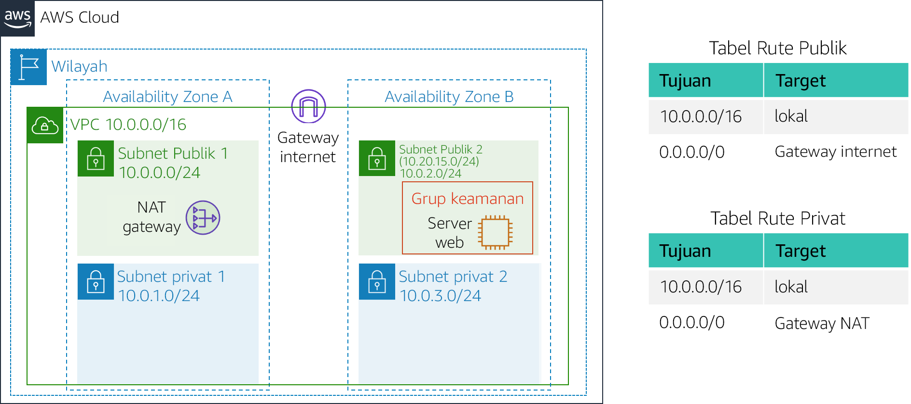
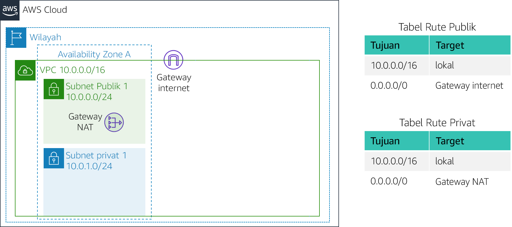
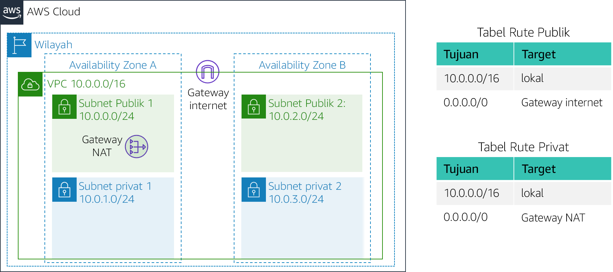

# Lab 2: Membangun VPC Anda dan Meluncurkan Web Server

<!-- Note to translators: This is based on Technical Essentials Lab 1. Copy the translation from there. Do not re-translate the whole document.-->

&nbsp;

**Versi 4.6.6 (TESS1)**

Di lab ini, Anda akan menggunakan Amazon Virtual Private Cloud (VPC) untuk membuat VPC Anda sendiri dan menambahkan komponen tambahan untuk menghasilkan jaringan yang disesuaikan. Anda juga akan membuat grup keamanan untuk instans EC2 Anda. Anda kemudian akan mengonfigurasi dan menyesuaikan instans EC2 untuk menjalankan server web dan meluncurkannya ke VPC.

**Amazon Virtual Private Cloud (Amazon VPC)** memungkinkan Anda meluncurkan sumber daya Amazon Web Services (AWS) ke jaringan virtual yang Anda tetapkan. Jaringan virtual ini mirip dengan jaringan tradisional yang akan Anda operasikan di pusat data Anda sendiri, dengan manfaat penggunaan infrastruktur AWS yang dapat diskalakan. Anda dapat membuat VPC yang mencakup beberapa Availability Zone.

&nbsp;

**Skenario**

Di lab ini, Anda akan membangun infrastruktur berikut:



&nbsp;&nbsp;

**Tujuan**

Setelah menyelesaikan lab ini, Anda dapat:

- Membuat VPC.
- Membuat subnet.
- Mengonfigurasi grup keamanan.
- Meluncurkan instans EC2 ke VPC

&nbsp;

**Durasi**

Diperlukan sekitar **30 menit** untuk menyelesaikan lab ini.

&nbsp;&nbsp;
## Mengakses AWS Management Console

1. Di bagian atas instruksi ini, klik <span id="ssb_voc_grey">Start Lab</span> (Mulai Lab) untuk meluncurkan lab Anda.

   Panel Start Lab (Mulai Lab) terbuka dan menampilkan status lab.

2. Tunggu hingga Anda melihat pesan "**Lab status: ready**" (Status lab: siap), kemudian klik **X** untuk menutup panel Start Lab (Mulai Lab).

3. Di bagian atas instruksi ini, klik <span id="ssb_voc_grey">AWS</span>

   Tindakan ini akan membuka AWS Management Console di tab browser baru. Anda akan masuk ke sistem ini secara otomatis.

   **Tips**: Jika tab browser baru tidak terbuka, biasanya akan ada banner atau ikon di bagian atas browser Anda yang menunjukkan bahwa browser Anda mencegah situs membuka jendela pop-up. Klik banner atau ikon tersebut dan pilih "Izinkan pop ups". 

4. Atur tab AWS Management Console agar tampil di samping petunjuk ini. Idealnya, Anda akan dapat melihat kedua tab browser pada saat bersamaan, agar lebih mudah mengikuti langkah-langkah lab.

&nbsp;
___
## Tugas 1: Membuat VPC Anda

Dalam tugas ini, Anda akan menggunakan VPC Wizard untuk membuat VPC Internet Gateway dan dua subnet di satu Availability Zone. **Internet gateway (IGW)** adalah komponen VPC yang mengizinkan komunikasi di antara instans di VPC Anda dan Internet.

Setelah membuat VPC, Anda bisa menambahkan **subnet**. Setiap subnet sepenuhnya berada dalam satu Availability Zone dan tidak dapat memperluas zona. Jika lalu lintas subnet dirutekan ke Internet Gateway, subnet dikenal sebagai *subnet publik*. Jika subnet tidak memiliki rute ke Internet gateway, subnet dikenal sebagai *subnet privat*.

Wizard juga akan membuat _NAT Gateway_, yang digunakan untuk menyediakan konektivitas internet ke instans EC2 di subnet privat.

5. Di **AWS Management Console**, pada menu <span id="ssb_services">Services<i class="fas fa-angle-down"></i></span> (Layanan), klik **VPC**.

6. Klik <span id="ssb_orange">Launch VPC Wizard</span> (Luncurkan VPC Wizard)

7. Di panel navigasi kiri, klik **VPC with Public and Private Subnets** (VPC dengan Subnet Publik dan Privat) (opsi kedua).

8. Klik <span id="ssb_blue">Select</span> (Pilih), lalu konfigurasikan:

   - **VPC Name:** (Nama VPC:) `Lab VPC`
   - **Availability Zone:** Pilih Availability Zone *pertama*
   - **Public subnet name:** (Nama subnet publik) `Public Subnet 1` (Subnet Publik 1)
   - **Availability Zone:** Pilih Availability Zone *pertama* (sama seperti yang digunakan di atas)
   - **Private subnet name:** (Nama subnet privat:) `Private Subnet 1` (Subnet Privat 1)
   - **Elastic IP Allocation ID:** (ID Alokasi IP Elastis:) Klik di kotak dan pilih alamat IP yang ditampilkan

9. Klik <span id="ssb_blue">Creat VPC</span> (Buat VPC)

   Wizard akan membuat VPC Anda.

10. Setelah selesai, klik <span id="ssb_blue">OK</span>

   Wizard menyediakan VPC dengan subnet publik dan subnet privat di Availability Zone yang sama, bersama-sama dengan tabel rute untuk setiap subnet:



   &nbsp;

   Subnet Publik memiliki CIDR **10.0.0.0/24**, yang berarti berisi semua alamat IP yang dimulai dengan **10.0.0.x**.

   Subnet Privat memiliki CIDR **10.0.1.0/24**, yang berarti berisi semua alamat IP yang dimulai dengan **10.0.1.x**.

&nbsp;
___
## Tugas 2: Membuat Subnet Tambahan

Dalam tugas ini, Anda akan membuat dua subnet tambahan di Availability Zone kedua. Hal ini berguna untuk menciptakan sumber daya di beberapa Availability Zone untuk memberikan _Ketersediaan Tinggi_.

11. Di panel navigasi kiri, klik **Subnets** (Subnet).

   Pertama, Anda akan membuat Subnet Publik kedua.

12. Klik <span id="ssb_blue">Create subnet</span> (Buat subnet), lalu konfigurasikan:

   - **Name tag:** (Tag nama:) `Public Subnet 2` (Subnet Publik 2)
   - **VPC:** _Lab VPC_
   - **Availability Zone:** Pilih Availability Zone *kedua*
   - **IPv4 CIDR block:** (Blok CIDR IPv4:) `10.0.2.0/24`

   Subnet akan berisi semua alamat IP yang dimulai dengan **10.0.2.x**.

13. Klik <span id="ssb_blue">Creat</span> (Buat), lalu klik <span id="ssb_blue">Close</span> (Tutup)

   Sekarang Anda akan membuat Subnet Privat kedua.

14. Klik <span id="ssb_blue">Create subnet</span> (Buat subnet), lalu konfigurasikan:

   - **Name tag:** (Nama tag:) `Private Subnet 2` (Subnet Privat 2)
   - **VPC:** _Lab VPC_
   - **Availability Zone:** Pilih Availability Zone *kedua*
   - **CIDR block:** (Blok CIDR:) `10.0.3.0/24`

   Subnet akan memiliki semua alamat IP yang dimulai dengan **10.0.3.x**.

15. Klik <span id="ssb_blue">Creat</span> (Buat), lalu klik <span id="ssb_blue">Close</span> (Tutup)

   Anda sekarang akan mengonfigurasi Subnet Privat untuk merutekan lalu lintas yang terikat internet ke NAT Gateway agar sumber daya di Subnet Privat bisa terhubung ke Internet, sementara sumber daya tetap privat. Hal ini dilakukan dengan mengonfigurasi _Tabel Rute_.

   *Route table* (Tabel rute) berisi serangkaian aturan, yang disebut *routes* (rute), yang digunakan untuk menentukan arah lalu lintas jaringan. Setiap subnet dalam VPC harus dikaitkan dengan tabel rute; tabel rute mengontrol perutean untuk subnet.

16. Di panel navigasi kiri, klik **Route Tables** (Tabel Rute).

17. Pilih <i class="far fa-check-square"></i> tabel rute dengan **Main = Yes** dan **VPC = Lab VPC**. (Perluas kolom _ID VPC_ jika perlu untuk melihat nama VPC.)

18. Di panel bawah, klik tab **Route** (Rute).

   Perhatikan bahwa **Destination 0.0.0.0/0** diatur ke **Target nat-xxxxxx**. Artinya lalu lintas yang ditujukan untuk internet (0.0.0.0/0) akan dikirim ke NAT Gateway. NAT Gateway kemudian akan meneruskan lalu lintas ke internet.

   Oleh karena itu, tabel rute ini sedang digunakan untuk merutekan lalu lintas dari Subnet Privat. Sekarang Anda akan menambahkan nama ke Tabel Rute agar mudah dikenali lain waktu.

19. Di kolom **Name** (Nama) untuk tabel rute ini, klik pensil <i class="fas fa-pencil-alt"></i> kemudian ketikkan `Private Route Table` (Tabel Rute Privat) dan klik <i class="fas fa-check-circle"></i>

20. Di panel bawah, klik tab **Subnet Associations** (Asosiasi Subnet).

   Sekarang Anda akan mengaitkan tabel rute ini ke Subnet Privat.

21. Klik <span id="ssb_grey">Edit subnet associations</span> (Edit asosiasi subnet)

22. Pilih <i class="far fa-check-square"></i> **Private Subnet 1** (Subnet Privat 1) dan **Private Subnet 2** (Subnet Privat 2).

   <i class="fas fa-comment"></i> Anda dapat meluaskan kolom _Subnet ID_ (ID Subnet) untuk melihat nama Subnet.

23. Klik <span id="ssb_blue">Save</span> (Simpan)

   Sekarang Anda akan mengonfigurasi Tabel Route yang digunakan oleh Subnet Publik.

24. Pilih <i class="far fa-check-square"></i> tabel rute dengan **Main = Np** dan **VPC = Lab VPC** (dan hapus pilihan subnet lainnya).

25. Di kolom **Name** (Nama) untuk tabel rute ini, klik pensil <i class="fas fa-pencil-alt"></i> kemudian ketikkan `Public Route Table` (Tabel Rute Publik), dan klik <i class="fas fa-check-circle"></i>

26. Di panel bawah, klik tab **Route** (Rute).

   Perhatikan bahwa **Destination 0.0.0.0/0** diatur ke **Target igw-xxxxxx**, yang merupakan Internet Gateway. Ini berarti bahwa lalu lintas yang terikat internet akan dikirim langsung ke internet melalui Internet Gateway.

   Sekarang Anda akan mengaitkan tabel rute ini ke Subnet Publik.

27. Klik tab **Subnet Associations** (Asosiasi Subnet).

28. Click <span id="ssb_grey">Edit subnet associations</span>

29. Pilih <i class="far fa-check-square"></i> **Public Subnet 1** (Subnet Publik 1) dan **Public Subnet 2** (Subnet Publik 2).

30. Klik <span id="ssb_blue">Save</span> (Simpan)

   VPC Anda sekarang memiliki subnet publik dan privat yang dikonfigurasi di dua Availability Zone:



&nbsp;
___
## Tugas 3: Membuat Grup Keamanan VPC

Dalam tugas ini, Anda akan membuat grup keamanan VPC, yang bertindak sebagai firewall virtual. Ketika Anda meluncurkan instans, Anda mengaitkan satu atau beberapa grup keamanan dengan instans. Anda dapat menambahkan aturan untuk setiap grup keamanan yang mengizinkan lalu lintas ke atau dari instans terkaitnya.

31. Di panel navigasi kiri, klik **Security Group** (Grup Keamanan).

32. Klik <span id="ssb_orange">Create security group</span> (Buat grup keamanan), lalu konfigurasikan:

   - **Security group name:** (Nama grup keamanan) `Web Security Group` (Grup Keamanan Web)
   - **Description:** (Deskripsi:) `Enable HTTP access` (Aktifkan akses HTTP)
   - **VPC:** _Lab VPC_

35. Di panel **Inbound rules** (Aturan masuk), pilih <span id="ssb_white">Add rule</span> (Tambah aturan)

34. Konfigurasikan pengaturan berikut ini:

   - **Type:** (Jenis) _HTTP_
   - **Source:** (Sumber:) _Anywhere_ (Mana Saja)
   - **Description:** (Deskripsi:) `Permit web requests` (Izinkan permintaan web)

38. Gulir ke bagian bawah halaman dan pilih <span id="ssb_orange">Creat security group</span> (Buat grup keamanan)

   Anda akan menggunakan grup keamanan ini dalam tugas selanjutnya ketika meluncurkan instans Amazon EC2.

&nbsp;
___
## Tugas 4: Meluncurkan Instans Server Web

Dalam tugas ini, Anda akan meluncurkan instans Amazon EC2 ke VPC baru. Anda akan mengonfigurasi instans agar bertindak sebagai server web.

39. Di menu <span id="ssb_services">Services <i class="fas fa-angle-down"></i></span>(Layanan), klik **EC2**.

40. Klik <span id="ssb_orange">Launch Instance<i class="fas fa-angle-down"></i></span> (Luncurkan Instans), lalu pilih <span id="ssb_white">Launch Instance</span> (Luncurkan Instans)

   Pertama, Anda akan memilih _Amazon Machine Image (AMI)_, yang berisi Sistem Operasi yang diinginkan.

41. Di baris untuk **Amazon Linux 2** (di bagian atas), klik <span id="ssb_blue">Select</span> (Pilih)

   _Instance Type_ (Jenis Instans) menjelaskan sumber daya perangkat keras yang ditetapkan ke instans.

42. Select **t2.micro** (ditampilkan dalam kolom _Type_ (Jenis)).

43. Klik <span id="ssb_grey">Next: Configure Instance Details</span> (Selanjutnya: Konfigurasikan Detail Instans)

   Sekarang Anda akan mengonfigurasi instans yang akan diluncurkan di Subnet Publik VPC baru.

44. Konfigurasikan pengaturan berikut:

   - **Network:** (Jaringan:) _Lab VPC_
   - **Subnet:** _Public Subnet 2_ (Subnet Publik 2) (_bukan_ Privat!)
   - **Auto-assign Public IP:** (Tetapkan otomatis IP Publik) _Enable_ (Aktif)

45. Luaskan <i class="fas fa-caret-right"></i> Bagian **Advanced Details** (Detail Lanjutan) (di bagian bawah halaman).

46. Salin dan tempel kode ini ke kotak **User data** (Data pengguna):

    ```bash
       #!/bin/bash
       # Install Apache Web Server and PHP
       yum install -y httpd mysql php
       # Download Lab files
       wget %% S3_HTTP_PATH_PREFIX %%/lab-app.zip
       unzip lab-app.zip -d /var/www/html/
       # Turn on web server
       chkconfig httpd on
       service httpd start
       ```

   Skrip ini akan dijalankan secara otomatis ketika instans meluncur untuk pertama kalinya. Skrip memuat dan mengonfigurasi aplikasi web PHP.

47. Klik <span id="ssb_grey">Next: Add Storage</span> (Next: Add Storage)

   Anda akan menggunakan pengaturan default untuk penyimpanan.

48. Klik <span id="ssb_grey">Next: Add Tags</span> (Next: Add Tags)

   Tag dapat digunakan untuk mengidentifikasi sumber daya. Anda akan menggunakan tag untuk menetapkan Nama untuk Instans.

49. Klik <span id="ssb_grey">Add Tag</span> (Tambahkan Tag), lalu konfigurasikan:

   - **Key:** (Kunci:) `Name` (Nama)
   - **Value:** (Nilai:)`Web Server 1`

50. Klik <span id="ssb_grey">Next: Configure Security Group</span> (Next: Configure Security Group)

   Anda akan mengonfigurasi instans untuk menggunakan _Grup Keamanan Web_ yang Anda buat sebelumnya.

51. Pilih <i class="far fa-dot-circle"></i> **Pilih grup keamanan yang ada**

52. Pilih <i class="far fa-check-square"></i> **Web Security Group** (Grup Keamanan Web).

   Ini adalah grup keamanan yang Anda buat dalam tugas sebelumnya. Ini akan mengizinkan akses HTTP ke instans.

53. Klik <span id="ssb_blue">Review and Launch</span> (Review and Launch)

54. Ketika *peringatan* menyarankan bahwa Anda tidak akan dapat menyambung ke instans melalui port 22, klik <span id="ssb_blue">Continue</span> (Lanjutkan)

55. Tinjau informasi instans dan klik <span id="ssb_blue">Launch</span> (Luncurkan)

56. Dalam dialog **Select an existing keypair** (Pilih keypair yang ada), pilih <i class="far fa-check-square"></i> **I acknowledge...** (Saya mengakui...)

57. Klik <span id="ssb_blue">Launch Instances</span> (Luncurkan Instans), lalu klik <span id="ssb_blue">View Instances</span> (Tampilkan Instans)

58. Tunggu hingga **Web Server 1** menampilkan *2/2 checks passed* (Pemeriksaan 2/2 lolos) di kolom **Status Checks** (Pemeriksaan Status).

   <i class="fas fa-comment"></i> Ini mungkin memerlukan waktu beberapa menit. Klik segarkan <i class="fas fa-sync"></i> di kanan atas setiap 30 detik untuk pembaruan.

   Sekarang Anda akan terhubung ke server web yang berjalan pada instans EC2.

59. Salin nilai **Public DNS (IPv4)** (DNS Public (IPv4)) yang ditampilkan di tab **Description** (Deskripsi) di bagian bawah halaman.

60. Buka tab browser baru, tempel nilai **DNS Publik** dan tekan Enter.

   Anda akan melihat halaman web yang menampilkan logo AWS dan nilai metadata instans.

   Arsitektur lengkap yang Anda terapkan adalah:


&nbsp;
___
## Lab Selesai

<i class="icon-flag-checkered"></i> Selamat! Anda sudah menyelesaikan lab.

61. Klik <span id="ssb_voc_grey">End Lab</span> (Akhiri Lab) di bagian atas halaman ini, kemudian klik <span id="ssb_blue">Yes</span> (Ya) untuk mengonfirmasi bahwa Anda ingin mengakhiri lab.

   Panel akan muncul, menunjukkan bahwa "DELETE has been initiated... You may close this message box now"("HAPUS sudah dimulai... Anda dapat menutup kotak pesan ini sekarang".)

62. Klik **X** di sudut kanan atas untuk menutup panel.

Untuk umpan balik, saran, atau koreksi, silakan kirim email kepada kami di: *aws-course-feedback@amazon.com*
