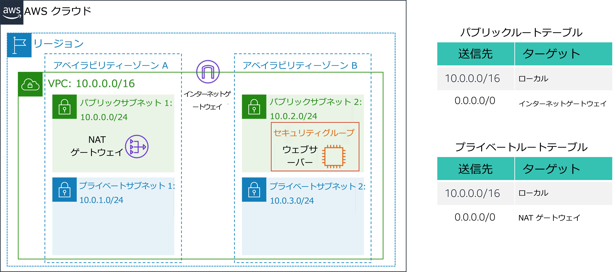
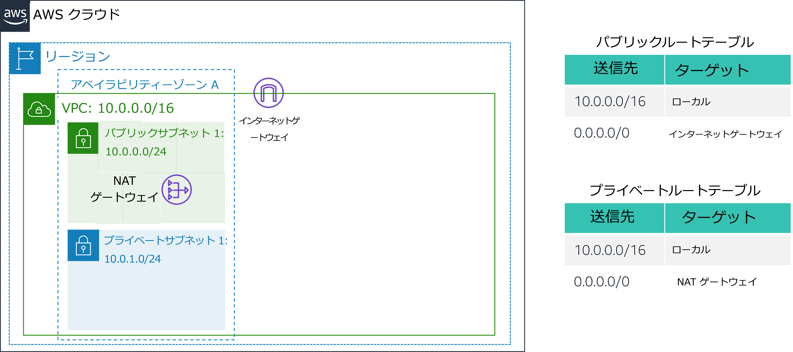
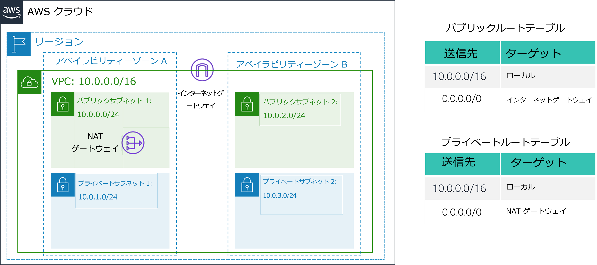

# ラボ 2: VPC を構築し、ウェブサーバーを起動する

<!-- Note to translators: This is based on Technical Essentials Lab 1. Copy the translation from there. Do not re-translate the whole document.-->

&nbsp;

**バージョン 4.6.6 (TESS1)**

このラボでは、Amazon Virtual Private Cloud (VPC) を使用して自分の VPC を作成し、カスタマイズしたネットワークを実現できるようにコンポーネントを追加します。また、EC2 インスタンス用のセキュリティグループを作成します。ウェブサーバーを実行する EC2 インスタンスの設定とカスタマイズを行い、これを VPC に作成します。

**Amazon Virtual Private Cloud (Amazon VPC)** を使用すると、ユーザーが定義した仮想ネットワークの中でアマゾン ウェブ サービス (AWS) のリソースを起動できます。この仮想ネットワークは従来データセンターで運営されていた旧式ネットワークによく似ていますが、AWS のスケーラブルなインフラストラクチャを使用できる利点もあります。複数のアベイラビリティーゾーンにまたがる VPC を作成できます。

&nbsp;

**シナリオ**

このラボでは、以下のインフラストラクチャを構築します。



&nbsp;&nbsp;

**目標**

このラボを完了すると、以下のことができるようになります。

- VPC を作成する
- サブネットを作成する
- セキュリティグループを設定する
- VPC に EC2 インスタンスを作成する

&nbsp;

**所要時間**

このラボは、完了までにおよそ **30 分**かかります。

&nbsp;&nbsp;
## AWS マネジメントコンソールにアクセスする

1. この手順の上部にある <span id="ssb_voc_grey">Start Lab</span> をクリックして、ラボを起動します。

   [**Start Lab**] パネルが開き、ラボのステータスが表示されます。

2. **Lab status: ready** というメッセージが表示されるまで待ち、[**X**] をクリックして [**Start Lab**] パネルを閉じます。

3. この手順の上部にある <span id="ssb_voc_grey">AWS</span> をクリックします。

   新しいブラウザタブで AWS マネジメントコンソールが開きます。システムによって自動的にログインします。

   **ヒント**: 新しいブラウザタブが開かない場合、通常、ブラウザによってサイトのポップアップウィンドウの表示がブロックされたことを示すバナーまたはアイコンがブラウザの上部に表示されます。バナーまたはアイコンをクリックし、[**ポップアップを許可**] をクリックします。

4. AWS マネジメントコンソールのタブをこの手順の横に配置します。ラボのステップを簡単に参照できるように、両方のブラウザタブを同時に表示することをお勧めします。

&nbsp;
___
## タスク 1: VPC を作成する

このタスクでは、VPC ウィザードを使用して、1 つのアベイラビリティーゾーンに 1 つの VPC、1 つのインターネットゲートウェイ、2 つのサブネットを作成します。**インターネットゲートウェイ (IGW)** は、VPC 内のインスタンスとインターネットの間の通信を可能にする VPC コンポーネントです。

VPC を作成したら、**サブネット**を追加できます。サブネットはすべて同じアベイラビリティーゾーン内にあり、複数のゾーンに併存することはできません。サブネットのトラフィックがインターネットゲートウェイにルーティングされる場合、そのサブネットは**パブリックサブネット**と呼ばれます。サブネットにインターネットゲートウェイへのルートがない場合、そのサブネットは**プライベートサブネット**と呼ばれます。

VPC ウィザードでは、**NAT ゲートウェイ**も作成されます。NAT ゲートウェイは、プライベートサブネット内の EC2 インスタンスにインターネット接続を提供するために使用されます。

5. **AWS マネジメントコンソール**の <span id="ssb_services">サービス <i class="fas fa-angle-down"></i></span> で [**VPC**] をクリックします。

6. <span id="ssb_orange">VPC ウィザードの起動</span> をクリックします

7. 左側のナビゲーションペインで [**パブリックとプライベートサブネットを持つ VPC**] (2 番目のオプション) をクリックします。

8. <span id="ssb_blue">選択</span> をクリックして以下のように設定します。

   - **VPC 名:** `Lab VPC`
   - **アベイラビリティーゾーン:** **最初のアベイラビリティーゾーンを選択**
   - **パブリックサブネット名:** `Public Subnet 1`
   - **アベイラビリティーゾーン:** **最初**のアベイラビリティーゾーンを選択 (上記で使用したものと同じ)
   - **プライベートサブネット名:** `Private Subnet 1`
   - **Elastic IP 割り当て ID:** ボックスをクリックし、表示された IP アドレスを選択

9. <span id="ssb_blue">VPC の作成</span> をクリックします

   ウィザードによって VPC が作成されます。

10. 完了したら <span id="ssb_blue">OK</span> をクリックします

   ウィザードによって、同じアベイラビリティーゾーンに 1 つのパブリックサブネットと 1 つのプライベートサブネットで構成される VPC がプロビジョニングされ、各サブネットにルートテーブルが設定されました。



   &nbsp;

   パブリックサブネットの CIDR は **10.0.0.0/24** です。これは、**10.0.0.x** で始まるすべての IP アドレスが含まれていることを意味します。

   プライベートサブネットの CIDR は **10.0.1.0/24** です。これは、**10.0.1.x** で始まるすべての IP アドレスが含まれていることを意味します。

&nbsp;
___
## タスク 2: 追加のサブネットを作成する

このタスクでは、2 番目のアベイラビリティーゾーンに 2 つのサブネットを作成します。これは、複数のアベイラビリティーゾーンにリソースを作成し、**高可用性**を提供する場合に役立ちます。

11. 左側のナビゲーションペインで [**サブネット**] をクリックします。

   まず、2 番目のパブリックサブネットを作成します。

12. <span id="ssb_orange">サブネットを作成</span> をクリックし、以下のように設定します。

   - **VPC ID:** **Lab VPC**
   - **サブネット名:** `Public Subnet 2`
   - **アベイラビリティーゾーン:** **2 番目**のアベイラビリティーゾーンを選択
   - **IPv4 CIDR ブロック:** `10.0.2.0/24`

   サブネットでは、**10.0.2.x** で始まるすべての IP アドレスを使用できます。

13. <span id="ssb_orange">サブネットを作成</span> をクリックします。

   次に、2 番目のプライベートサブネットを作成します。

14. <span id="ssb_orange">サブネットの作成</span> をクリックし、以下のように設定します。

   - **VPC ID:** **Lab VPC**
   - **サブネット名:** `Private Subnet 2`
   - **アベイラビリティーゾーン: **2 番目** のアベイラビリティーゾーンを選択
   - **CIDR ブロック:** `10.0.3.0/24`

   サブネットでは、**10.0.3.x** で始まるすべての IP アドレスを使用できます。

15. <span id="ssb_orange">サブネットを作成</span> をクリックします。

   次に、インターネット宛てのトラフィックを NAT ゲートウェイにルーティングするようにプライベートサブネットを設定します。これによって、プライベートサブネット内のリソースからインターネットに接続できると同時に、リソースをプライベートのままにすることができます。これを行うには、**ルートテーブル**を設定します。

   **ルートテーブル**には、**ルート**と呼ばれるルールセットが含まれています。ルートによって、ネットワークトラフィックの送信先が決まります。ルートテーブルがサブネットのルーティングを制御するため、VPC の各サブネットはルートテーブルに関連付けられている必要があります。

16. 左側のナビゲーションペインで [**ルートテーブル**] をクリックします。

17. \[**メイン**] が [**はい**]、[**VPC ID**] が [**Lab VPC**] のルートテーブルを <i class="far fa-check-square"></i> 選択します（必要に応じて [**VPC ID**] 列を広げて VPC 名を表示します）。

18. 下のペインで [**ルート**] タブをクリックします。

   [**送信先**] が [**0.0.0.0/0**] の [**ターゲット**] が [**nat-xxxxxxxx**] に設定されていることを確認します。これはインターネット (0.0.0.0/0) に向かうトラフィックが NAT ゲートウェイに送信されることを意味します。その後、NAT ゲートウェイによってトラフィックがインターネットに転送されます。

   このルートテーブルはプライベートサブネットからのトラフィックをルーティングするために使用されます。ルートテーブルに名前を付けて、後で簡単に識別できるようにします。

19. このルートテーブルの [**Name**] 列にある <i class="fas fa-pencil-alt"></i> 鉛筆アイコンをクリックし、`Private Route Table`と入力して <i class="fas fa-check-circle"></i>をクリックします

20. 下のペインで [**サブネットの関連付け**] タブをクリックします。

   ここで、このルートテーブルをプライベートサブネットに関連付けます。

21. <span id="ssb_grey">サブネットの関連付けの編集</span> をクリックします

22. <i class="far fa-check-square"></i> **Private Subnet 1** と **Private Subnet 2** の両方を選択します。

   <i class="fas fa-comment"></i> [**サブネット ID**] 列を展開すると、サブネット名が表示されます。

23. <span id="ssb_blue">保存</span> をクリックします

   次に、パブリックサブネットによって使用されるルートテーブルを設定します。

24. \[**メイン**] が [**いいえ**] で [**VPC ID**] が [**lab VPC**] のルートテーブルを <i class="far fa-check-square"></i> 選択します（他のサブネットは選択解除）。

25. このルートテーブルの [**Name**] 列にある <i class="fas fa-pencil-alt"></i> 鉛筆アイコン をクリックし、`Public Route Table` と入力して <i class="fas fa-check-circle"></i> をクリックします

26. 下のペインで [**ルート**] タブをクリックします。

   [**送信先**] が [**0.0.0.0/0**] の [**ターゲット**] が [**igw-xxxxxxxx**] に設定されていることを確認します。これは、インターネット宛てのトラフィックはインターネットゲートウェイを経由して直接インターネットに送信されることを意味します。

   次に、このルートテーブルをパブリックサブネットに関連付けます。

27. \[**サブネットの関連付け**] タブをクリックします。

28. <span id="ssb_grey">サブネットの関連付けの編集</span> をクリックします

29. <i class="far fa-check-square"></i> **Public Subnet 1** と **Public Subnet 2** の両方を選択します。

30. <span id="ssb_blue">保存</span> をクリックします

   これで、2 つのアベイラビリティーゾーンにパブリックサブネットとプライベートサブネットが設定された VPC ができました。



&nbsp;
___
## タスク 3: VPC セキュリティグループを作成する

このタスクでは、仮想ファイアウォールとして機能する VPC セキュリティグループを作成します。インスタンスを作成する際、1 つ以上のセキュリティグループをインスタンスに関連付け、各セキュリティグループに対してルールを追加し、関連付けられたインスタンスに対するトラフィックを許可できます。

31. 左側のナビゲーションペインで [**セキュリティグループ**] をクリックします。

32. <span id="ssb_orange">セキュリティグループを作成</span> をクリックし、以下のように設定します。

   - **セキュリティグループ名:** `Web Security Group`
   - **説明:** `Enable HTTP access`
   - **VPC:** **Lab VPC**

35. \[**インバウンドルール**] ペインで <span id="ssb_white">ルールを追加</span> をクリックします

34. 以下のように設定します。

   - **タイプ**: **HTTP
   - **リソースタイプ**: **任意の場所**
   - **説明:** `Permit web requests`

38. ページの下部までスクロールし、<span id="ssb_orange">セキュリティグループを作成</span> をクリックします

   このセキュリティグループは、次のタスクで Amazon EC2 インスタンスを作成するときに使用します。

&nbsp;
___
## タスク 4: ウェブサーバーインスタンスを作成する

このタスクでは、Amazon EC2 インスタンスを新しい VPC に作成します。インスタンスは、ウェブサーバーとして機能するように設定します。

39. <span id="ssb_services">サービス <i class="fas fa-angle-down"></i></span> で [**EC2**] をクリックします。

40. <span id="ssb_orange">インスタンスを起動<i class="fas fa-angle-down"> </i></span>ドロップダウンメニューから <span id="ssb_white">インスタンスを作成</span> を選択します

   まず、必要なオペレーティングシステムを含んでいる **Amazon マシンイメージ (AMI)** を選択します。

41. **Amazon Linux 2** の行 (最上部) で <span id="ssb_blue">選択</span> をクリックします

   **インスタンスタイプ**によって、インスタンスに割り当てるハードウェアリソースが定義されます。

42. **t2.micro**（[**タイプ**] 列に表示）を選択します。

43. <span id="ssb_grey">次のステップ: インスタンスの詳細の設定</span> をクリックします

   次に、新しい VPC のパブリックサブネットに作成されるようにインスタンスを設定します。

44. 以下のように設定します。

   - **ネットワーク:** **Lab VPC**
   - **サブネット:** **Public Subnet 2**（Private **ではありません**）
   - **自動割り当てパブリック IP:** **有効**

45. <i class="fas fa-caret-right"></i> **高度な詳細** を展開します（ページの下部）。

46. 以下のコードをコピーし、[**ユーザーデータ*] ボックスに貼り付けます。

    ```bash
    #!/bin/bash
    # Install Apache Web Server and PHP
    yum install -y httpd mysql php
    # Download Lab files
    wget %% S3_HTTP_PATH_PREFIX %%/lab-app.zip
    unzip lab-app.zip -d /var/www/html/
    # Turn on web server
    chkconfig httpd on
    service httpd start
    ```

    このスクリプトは、インスタンスの初回作成時に自動的に実行されます。スクリプトがロードされ、PHP ウェブアプリケーションが設定されます。

47. <span id="ssb_grey">次のステップ: ストレージの追加</span> をクリックします。

   ストレージにはデフォルト設定を使用します。

48. <span id="ssb_grey">次のステップ: タグの追加</span> をクリックします。

   タグは、リソースを識別するために使用できます。タグを使用して、インスタンスに Name を割り当てます。

49. <span id="ssb_grey">タグの追加</span> をクリックし、次の内容を設定します。

   - **キー:** `Name`
   - **値:** `Web Server 1`

50. <span id="ssb_grey">次のステップ: セキュリティグループの設定</span> をクリックします

   先ほど作成した **Web Security Group** を使用するようにインスタンスを設定します。

51. <i class="far fa-dot-circle"></i> **既存のセキュリティグループを選択する** をクリックします。

52. <i class="far fa-check-square"></i> **Web Security Group** を選択します。

   これは、前のタスクで作成したセキュリティグループです。これにより、インスタンスへの HTTP アクセスが許可されます。

53. <span id="ssb_blue">確認と作成</span> をクリックします

54. ポート 22 を経由してインスタンスに接続できないという**警告**が表示されたら、<span id="ssb_blue">次へ</span> をクリックします。

55. インスタンス情報を確認して <span id="ssb_blue">起動</span> をクリックします

56. \[**既存のキーペアを選択するか、新しいキーペアを作成します**] ダイアログで <i class="far fa-check-square"></i> チェックボックスをオンにします。

57. <span id="ssb_blue">インスタンスの作成</span> をクリックし、次に <span id="ssb_blue">インスタンスの表示</span> をクリックします

58. **Web Server 1** の [**ステータスチェック**] 列に [**2/2 のチェックに合格しました**] と表示されるまで待ちます。

   <i class="fas fa-comment"></i>このプロセスには数分かかることがあります。右上の <i class="fas fa-sync"></i> **更新** アイコンを 30 秒ごとにクリックし、更新します。

   次に、EC2 インスタンスで実行しているウェブサーバーに接続します。

59. ページの下部にある [**詳細**] タブに表示されている [**パブリック IPv4 DNS**] の値をコピーします。

60. ウェブブラウザの新しいタブを開き、**パブリック DNS** の値を貼り付け、**Enter** キーを押します。

   AWS ロゴとインスタンスメタデータの値が記載されたウェブページが表示されるはずです。

   デプロイしたアーキテクチャ全体は以下のようになります。


&nbsp;
___
## ラボの終了

<i class="icon-flag-checkered"></i>お疲れ様でした。これでラボが完了しました。

61. ラボの終了を確認するには、このページの上部にある <span id="ssb_voc_grey">End Lab</span> をクリックし、<span id="ssb_blue">Yes</span> をクリックします。

   パネルが表示され、「DELETE has initiated...You may close this message box now.」というメッセージが表示されます。

62. 右上隅の [**X**] をクリックしてパネルを閉じます。

フィードバック、ご提案、修正については、*aws-course-feedback@amazon.com* まで E メールにてご連絡ください。
