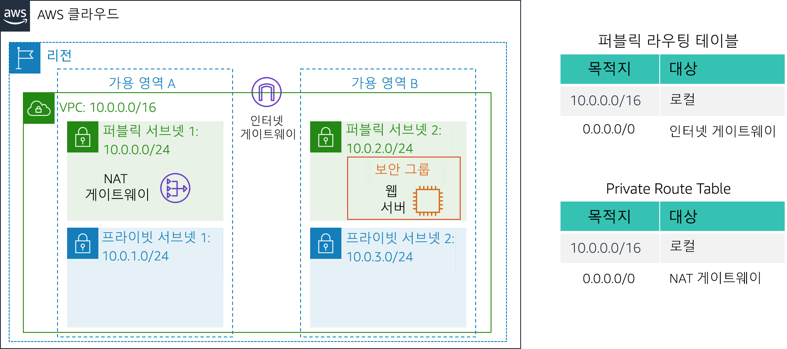

# 실습 2: VPC 구축 및 웹 서버 시작

<!-- Note to translators: This is based on Technical Essentials Lab 1. Copy the translation from there. Do not re-translate the whole document.-->

&nbsp;

**버전 4.6.6(TESS1)**

이 실습에서는 Amazon Virtual Private Cloud(VPC)를 사용하여 자체 VPC를 생성하고 구성 요소를 추가하여 사용자 지정된 네트워크를 생성합니다. 또한 EC2 인스턴스에 대한 보안 그룹을 생성합니다. 그런 다음 웹 서버를 실행하고 VPC에서 시작하도록 EC2 인스턴스를 구성하고 사용자 지정합니다.

**Amazon Virtual Private Cloud(Amazon VPC)**를 사용하면 사용자가 정의한 가상 네트워크에서 AWS(Amazon Web Services) 리소스를 시작할 수 있습니다. 이 가상 네트워크는 고객의 자체 데이터 센터에서 운영하는 기존 네트워크와 매우 유사하며, AWS의 확장 가능한 인프라를 사용한다는 이점이 있습니다. 여러 가용 영역에 걸쳐 있는 VPC를 생성할 수 있습니다.

&nbsp;

**시나리오**

이 실습에서는 다음과 같은 인프라를 구축합니다.



&nbsp;&nbsp;

**목표**

본 실습을 완료하면 다음을 할 수 있습니다.

- VPC 생성.
- 서브넷 생성.
- 보안 그룹 구성.
- VPC에서 EC2 인스턴스 시작.

&nbsp;

**소요 시간**

이 실습은 완료까지 약 **30분**이 소요됩니다.

&nbsp;&nbsp;
## AWS Management Console 액세스

1. 지침의 맨 위에서 <span id="ssb_voc_grey">Start Lab</span>을 클릭하여 실습을 시작합니다.

   Start Lab 패널이 열리고 실습 상태가 표시됩니다.

2. “**Lab status: ready**” 메시지가 표시되면 **X**를 클릭하여 Start Lab 패널을 닫습니다.

3. 지침의 맨 위에서 <span id="ssb_voc_grey">AWS</span>를 클릭합니다.

   그러면 새 브라우저 탭에서 AWS Management Console이 열립니다. 시스템에서 자동으로 로그인합니다.

   **팁**: 새 브라우저 탭이 열리지 않는 경우 일반적으로 브라우저에서 팝업 창을 열 수 없음을 나타내는 배너 또는 아이콘이 브라우저 상단에 표시됩니다. 배너 또는 아이콘을 클릭하고 Allow pop ups를 선택합니다.

4. 이러한 지침이 나란히 표시되도록 AWS Management Console 탭을 정렬합니다. 두 브라우저 탭이 동시에 표시되어 실습 단계를 보다 쉽게 수행할 수 있게 됩니다.

&nbsp;
___
## 과제 1: VPC 생성

이 과제에서는 VPC 마법사를 사용하여 단일 가용 영역에 인터넷 게이트웨이 1개와 서브넷 2개가 있는 VPC를 생성합니다. **IGW(인터넷 게이트웨이)**는 VPC의 인스턴스와 인터넷 간의 통신을 허용하는 VPC 구성 요소입니다.

VPC를 생성했다면 **서브넷**을 추가할 수 있습니다. 각 서브넷은 하나의 가용 영역 내에 모두 상주하며, 여러 영역에 분산할 수 없습니다. 서브넷의 트래픽이 인터넷 게이트웨이로 라우팅되는 경우 해당 서브넷을 *퍼블릭 서브넷*이라고 합니다. 서브넷에 인터넷 게이트웨이에 대한 경로가 없는 경우 해당 서브넷을 *프라이빗 서브넷*이라고 합니다.

또한 이 마법사에서는 프라이빗 서브넷의 EC2 인스턴스에 대한 인터넷 연결을 제공하는 데 사용되는 _NAT 게이트웨이_를 생성합니다.

5. **AWS Management Console**의 <span id="ssb_services">Services <i class="fas fa-angle-down"></i></span> 메뉴에서 **VPC**를 클릭합니다.

6. <span id="ssb_orange">Launch VPC Wizard</span>을 클릭합니다.

7. 왼쪽 탐색 창에서 두 번째 옵션인 **VPC with Public and Private Subnets**를 클릭합니다.

8. <span id="ssb_blue">선택(Select)</span>을 클릭하고 다음을 구성합니다.

   - **VPC name**: `Lab VPC`
   - **Availability zone**: *첫 번째* 가용 영역 선택
   - **Public subnet name**: `Public Subnet 1`
   - **Availability Zone**: *첫 번째* 가용 영역 선택(위에서 사용한 것과 동일한 가용 영역)
   - **Private subnet name**: `Private Subnet 1`
   - **Elastic IP Allocation ID**: 확인란을 클릭하고 표시되는 IP 주소 선택

9. <span id="ssb_blue">Create VPC</span>을 클릭합니다.

   마법사가 VPC를 생성합니다.

10. 완료되면 <span id="ssb_blue">OK</span>을 클릭합니다.

   동일한 가용 영역에 퍼블릭 서브넷 및 프라이빗 서브넷이 있고 각 서브넷에 대한 라우팅 테이블이 있는 VPC가 프로비저닝되었습니다.


   &nbsp;

   퍼블릭 서브넷의 CIDR은 **10.0.0.0/24**입니다. 이는 **10.0.0.x**로 시작되는 모든 IP 주소가 퍼블릭 서브넷에 포함된다는 것을 의미합니다.

   프라이빗 서브넷의 CIDR은 **10.0.1.0/24**입니다. 이는 **10.0.1.x**로 시작되는 모든 IP 주소가 프라이빗 서브넷에 포함된다는 것을 의미합니다.

&nbsp;
___
## 과제 2: 추가 서브넷 생성

이 과제에서는 두 번째 가용 영역에 추가 서브넷 2개를 생성합니다. 이 실습은 여러 가용 영역에 리소스를 생성하여 _고가용성_을 제공하는 데 유용합니다.

11. 왼쪽 탐색 창에서 **Subnets**을 클릭합니다.

   먼저 두 번째 퍼블릭 서브넷을 생성합니다.

12. <span id="ssb_blue">Create subnet</span>을 클릭하고 다음을 구성합니다.

   - **Name tag**: `Public Subnet 2`
   - **VPC**: _Lab VPC_
   - **Availability zone**: *두 번째* 가용 영역 선택
   - **IPv4 CIDR block**: `10.0.2.0/24`

   이 서브넷에는 **10.0.2.x**로 시작되는 모든 IP 주소가 포함됩니다.

13. <span id="ssb_blue">Create</span>을 클릭한 다음 <span id="ssb_blue">Close</span>를 클릭합니다.

   이제 두 번째 프라이빗 서브넷을 생성합니다.

14. <span id="ssb_blue">Create subnet</span>을 클릭하고 다음을 구성합니다.

   - **Name tag**: `Private Subnet 2`
   - **VPC**: _Lab VPC_
   - **Availability zone**: *두 번째* 가용 영역 선택
   - **CIDR block**: `10.0.3.0/24`

   이 서브넷에는 **10.0.3.x**로 시작되는 모든 IP 주소가 포함됩니다.

15. <span id="ssb_blue">Create</span>을 클릭한 다음 <span id="ssb_blue">Close</span>를 클릭합니다.

   이제 프라이빗 서브넷의 리소스를 여전히 비공개로 유지하면서 해당 리소스에서 인터넷에 연결할 수 있도록 인터넷 바인딩 트래픽을 NAT 게이트웨이로 라우팅할 프라이빗 서브넷을 구성합니다. 이렇게 하려면 _라우팅 테이블_을 구성합니다.

   *라우팅 테이블*은 네트워크 트래픽이 전달되는 위치를 결정하는 데 사용되는 *경로*라는 규칙 세트를 포함합니다. VPC에 있는 각 서브넷을 라우팅 테이블에 연결해야 합니다. 라우팅 테이블은 서브넷에 대한 라우팅을 제어합니다.

16. 왼쪽 탐색 창에서 **Route Tables**을 클릭합니다.

17. **Main = Yes**이고 **VPC = Lab VPC**인 라우팅 테이블을 <i class="far fa-check-square"></i>선택합니다. (필요한 경우 _VPC ID_ 열을 확장하여 VPC 이름을 표시합니다.)

18. 하단 창에서 **Routes** 탭을 클릭합니다.

   **Destination 0.0.0.0/0**은 **Target nat-xxxxxxxx**로 설정되어 있습니다. 이는 인터넷(0.0.0.0/0)으로 향하는 트래픽이 NAT 게이트웨이로 전송됨을 의미합니다. NAT 게이트웨이는 이 트래픽을 인터넷으로 전달합니다.

   따라서 프라이빗 서브넷의 트래픽은 이 라우팅 테이블을 사용하여 라우팅됩니다. 이제 나중에 라우팅 테이블을 쉽게 인식할 수 있도록 라우팅 테이블에 이름을 추가합니다.

19. 이 라우팅 테이블의 **Name** 열에서 연필(<i class="fas fa-pencil-alt"></i>) 아이콘을 클릭한 다음 `Private Route Table`을 입력하고 <i class="fas fa-check-circle"></i> 아이콘을 클릭합니다.

20. 하단 창에서 **Subnet Associations** 탭을 클릭합니다.

   이제 이 라우팅 테이블을 프라이빗 서브넷에 연결합니다.

21. <span id="ssb_grey">Edit subnet associations</span>을 클릭합니다.

22. **Private Subnet 1**과 **Private Subnet 2**를 모두 <i class="far fa-check-square"></i> 선택합니다.

   <i class="fas fa-comment"></i>_Subnet ID_ 열을 확장하여 서브넷 이름을 확인할 수 있습니다.

23. <span id="ssb_blue">Save</span>을 클릭합니다.

   이제 퍼블릭 서브넷에서 사용할 라우팅 테이블을 구성합니다.

24. **Main = No**이고 **VPC = Lab VPC**인 라우팅 테이블을 <i class="far fa-check-square"></i> 선택합니다(다른 모든 서브넷은 선택 취소).

25. 이 라우팅 테이블의 **Name** 열에서 연필(<i class="fas fa-pencil-alt"></i>) 아이콘을 클릭한 다음 `Public Route Table`을 입력하고 <i class="fas fa-check-circle"></i> 아이콘을 클릭합니다.

26. 하단 창에서 **Routes** 탭을 클릭합니다.

   **Destination 0.0.0.0/0**은 인터넷 게이트웨이인 **Target igw-xxxxxxxx**로 설정되어 있습니다. 즉 인터넷 바운드 트래픽은 인터넷 게이트웨이를 통해 인터넷으로 바로 전송됩니다.

   이제 이 라우팅 테이블을 퍼블릭 서브넷에 연결합니다.

27. **Subnet Associations** 탭을 클릭합니다.

28. <span id="ssb_grey">Edit subnet associations</span>을 클릭합니다.

29. **Public Subnet 1**과 **Public Subnet 2**를 모두 <i class="far fa-check-square"></i> 선택합니다.

30. <span id="ssb_blue">Save</span>을 클릭합니다.

   이제 VPC의 가용 영역 2개에 퍼블릭 서브넷과 프라이빗 서브넷이 구성되었습니다.


&nbsp;
___
## 과제 3: VPC 보안 그룹 생성

이 과제에서는 가상 방화벽 역할을 할 VPC 보안 그룹을 생성합니다. 인스턴스를 시작할 때 하나 이상의 보안 그룹을 인스턴스와 연결합니다. 각 보안 그룹에 연결된 인스턴스의 수신 및 발신 트래픽을 허용하는 규칙을 추가할 수 있습니다.

31. 왼쪽 탐색 창에서 **Security Groups**을 클릭합니다.

32. <span id="ssb_orange">Create security group</span>을 클릭하고 다음을 구성합니다.

   - **Security group name**: `Web Security Group`
   - **Description**: `HTTP 액세스 활성화`
   - **VPC**: _Lab VPC_

35. **Inbound rules** 창에서 <span id="ssb_white">Add rule</span>을 선택합니다.

34. 다음 설정을 구성합니다.

   - **Type**: _HTTP_
   - **Source**: _Anywhere_
   - **Description: `웹 요청 허용`

38. 페이지 하단으로 스크롤하고 <span id="ssb_orange">Create security group</span>을 선택합니다.

   이 보안 그룹은 다음 과제에서 Amazon EC2 인스턴스를 시작할 때 사용됩니다.

&nbsp;
___
## 과제 4: 웹 서버 인스턴스 시작

이 과제에서는 Amazon EC2 인스턴스를 새 VPC에서 시작합니다. 웹 서버 역할을 할 인스턴스를 구성합니다.

39. <span id="ssb_services">Services <i class="fas fa-angle-down"></i></span> 메뉴에서 **EC2**를 클릭합니다

40. <span id="ssb_orange">Launch Instance<i class="fas fa-angle-down"></i></span>을 클릭한 다음 <span id="ssb_white">Launch Instance</span>을 선택합니다.

   먼저 원하는 운영 체제가 포함된 _Amazon Machine Image(AMI)_를 선택합니다.

41. **Amazon Linux 2**에 대한 행(맨 위)에서 <span id="ssb_blue">Select</span>을 클릭합니다.

   _Instance Type_은 인스턴스에 할당된 하드웨어 리소스를 정의합니다.

42. _Type_ 열에서 **t2.micro**를 선택합니다.

43. <span id="ssb_grey">Next: Configure Instance Details</span>을 클릭합니다.

   이제 새 VPC의 퍼블릭 서브넷에서 인스턴스를 시작하도록 구성합니다.

44. 다음 설정을 구성합니다.

   - **Network**: _Lab VPC_
   - **Subnet)**: _Public Subnet 2_(프라이빗이 _아님_!)
   - **Auto-assign Public IP**: _Enable_

45. 이제 <i class="fas fa-caret-right"></i> **Advanced Details** 섹션(페이지 맨 아래)을 확장합니다.

46. 다음 코드를 복사하여 **User data** 상자에 붙여 넣습니다.

    ```bash
    #!/bin/bash
    # Install Apache Web Server and PHP
    yum install -y httpd mysql php
    # Download Lab files
    wget %% S3_HTTP_PATH_PREFIX %%/lab-app.zip
    unzip lab-app.zip -d /var/www/html/
    # Turn on web server
    chkconfig httpd on
    service httpd start
    ```

    이 스크립트는 인스턴스를 처음 시작할 때 자동으로 실행됩니다. 이 스크립트는 PHP 웹 애플리케이션을 로드하고 구성합니다.

47. <span id="ssb_grey">Next: Add Storage</span>를 클릭합니다.

   스토리지에는 기본 설정을 사용합니다.

48. <span id="ssb_grey">Next: Add Tags</span>를 클릭합니다.

   태그를 사용하여 리소스를 식별할 수 있습니다. 태그를 사용하여 인스턴스에 이름을 할당합니다.

49. <span id="ssb_grey">Add Tag</span>를 클릭하고 다음을 구성합니다.

   - **Key:** `Name`
   - **값(Value):** `Web Server 1`

50. <span id="ssb_grey">Next: Configure Security Group</span>을 클릭합니다.

   이전에 생성한 _Web Security Group_을 사용하도록 인스턴스를 구성합니다.

51. Select an existing security group을 <i class="far fa-dot-circle"></i> 선택합니다. ****

52. Select an existing security group을 <i class="far fa-check-square"></i> 선택합니다. **Web Security Group**을 선택합니다.

   이 보안 그룹은 이전 과제에서 생성한 보안 그룹입니다. 이 보안 그룹은 인스턴스에 대한 HTTP 액세스를 허용합니다.

53. <span id="ssb_blue">Review and Launch</span>를 클릭합니다.

54. 포트 22를 통해 인스턴스에 연결할 수 없다는 *경고* 메시지가 표시되면 <span id="ssb_blue">계속(Continue)</span>을 클릭합니다.

55. 인스턴스 정보를 검토하고 <span id="ssb_blue">Launch</span>을 클릭합니다.

56. **Select an existing keypair** 대화 상자에서 <i class="far fa-check-square"></i> **I acknowledge...**를 선택합니다.

57. <span id="ssb_blue">Launch Instances</span>을 클릭한 다음 <span id="ssb_blue">View Instances</span>를 클릭합니다.

58. **Web Server 1**의 **Status Checks** 열에 *2/2 checks passed*가 표시될 때까지 기다립니다.

   <i class="fas fa-comment"></i> 몇 분 정도 걸릴 수 있습니다. 30초 간격으로 오른쪽 상단에서 새로 고침(<i class="fas fa-sync"></i>)을 클릭하여 업데이트합니다.

   이제 EC2 인스턴스에서 실행 중인 웹 서버에 연결합니다.

59. 페이지 하단의 **Description** 탭에 표시된 **Public DNS (IPv4)** 값을 복사합니다.

60. 새 웹 브라우저 탭을 열고 **Public DNS** 값을 붙여 넣은 다음 Enter 키를 누릅니다.

   AWS 로고와 인스턴스 메타데이터 값이 표시된 웹 페이지가 나타납니다.

   이 실습에서 배포한 전체 아키텍처는 다음과 같습니다.


&nbsp;
___
## 실습 완료

<i class="icon-flag-checkered"></i> 축하합니다! 실습을 마쳤습니다.

61. 이 페이지의 상단에서 <span id="ssb_voc_grey">End Lab</span>을 클릭하고 <span id="ssb_blue">Yes</span>를 클릭하여 실습 종료를 확인합니다.

   "DELETE has been initiated... You may close this message box now"라는 내용의 패널이 표시됩니다.

62. 오른쪽 상단 모서리에 있는 **X**를 클릭하여 패널을 닫습니다.

피드백 또는 제안 사항이 있거나 수정이 필요한 내용이 있는 경우 *aws-course-feedback@amazon.com*으로 이메일을 보내 주십시오.
