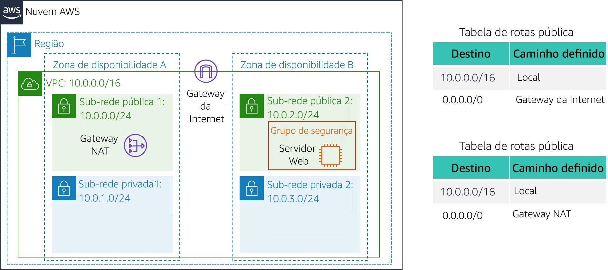
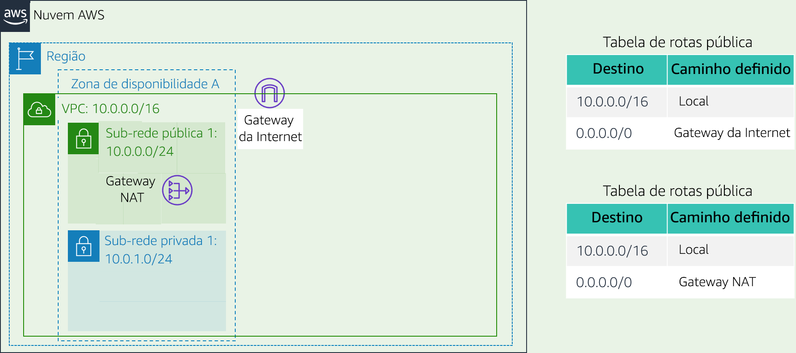
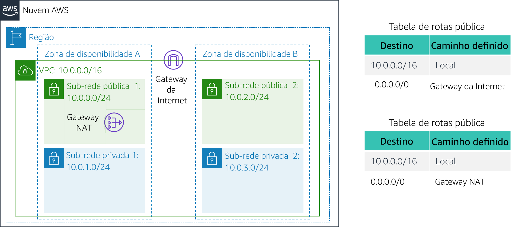

# Laboratório 2: Criar sua VPC e executar um servidor web

<!-- Note to translators: This is based on Technical Essentials Lab 1. Copy the translation from there. Do not re-translate the whole document.-->

&nbsp;

**Versão 4.6.6 (TESS1)**

Neste laboratório, você usará a Amazon Virtual Private Cloud (VPC) para criar sua própria VPC e adicionará outros componentes a ela para produzir uma rede personalizada. Você também criará grupos de segurança para sua instância do EC2. Em seguida, você configurará e personalizará uma instância do EC2 para executar um servidor da Web e executá-lo na VPC.

A **Amazon Virtual Private Cloud (Amazon VPC)** permite executar recursos da Amazon Web Services (AWS) em uma rede virtual definida por você. Essa rede virtual é semelhante a uma rede tradicional operando no datacenter, com os benefícios do uso da infraestrutura escalável da AWS. Você pode criar uma VPC que abranja várias zonas de disponibilidade.

&nbsp;

**Cenário**

Neste laboratório, você criará a seguinte infraestrutura:



&nbsp;&nbsp;

**Objetivos**

Depois de concluir este laboratório, você será capaz de:

- Criar uma VPC.
- Criar sub-redes.
- Configurar um grupo de segurança.
- Executar uma instância EC2 em uma VPC.

&nbsp;

**Duração**

O laboratório levará aproximadamente **30 minutos** para ser concluído.

&nbsp;&nbsp;
## Acessar o Console de Gerenciamento da AWS

1. Na parte superior destas instruções, clique em <span id="ssb_voc_grey">Start Lab</span> (Iniciar laboratório) para iniciar o laboratório.

   Um painel Start Lab (Iniciar laboratório) é aberto exibindo o status do laboratório.

2. Aguarde até que a mensagem “**Lab status: ready** (Status do laboratório: pronto)” seja exibida e clique no **X** para fechar o painel Start Lab (Iniciar laboratório).

3. Na parte superior destas instruções, clique em <span id="ssb_voc_grey">AWS</span>

   Isso abrirá o Console de Gerenciamento da AWS em uma nova guia do navegador. O sistema fará o seu login automaticamente.

   **Dica**: se uma nova guia do navegador não for aberta normalmente, um banner ou um ícone na parte superior do navegador indicará que o navegador está impedindo que o site abra janelas pop-up. Clique no banner ou ícone e escolha "Allow pop ups" (Permitir pop-ups).

4. Organize a guia do Console de Gerenciamento da AWS para que ela seja exibida com estas instruções. Em um cenário ideal, você poderá ver as duas guias do navegador ao mesmo tempo, para facilitar o acompanhamento das etapas do laboratório.

&nbsp;
___
## Tarefa 1: Criar sua VPC

Nesta tarefa, você usará o assistente de VPC para criar uma VPC, um gateway da Internet e duas sub-redes em uma única zona de disponibilidade. Um **gateway da Internet (IGW)** é um componente da VPC que permite a comunicação entre instâncias na VPC e a Internet.

Depois de criar uma VPC, você poderá adicionar **sub-redes**. Cada sub-rede reside inteiramente dentro de uma zona de disponibilidade e não pode incluir outras zonas. Se o tráfego de uma sub-rede for roteado para um gateway da Internet, a sub-rede será chamada de *sub-rede pública*. Se a sub-rede não tiver uma rota para o gateway da Internet, ela será chamada de *sub-rede privada*.

O assistente também criará um _gateway NAT_, que é usado para fornecer conectividade com a Internet para instâncias do EC2 nas sub-redes privadas.

5. No **Console de Gerenciamento da AWS**, no menu <span id="ssb_services">Services<i class="fas fa-angle-down"></i></span> (Serviços), clique em **VPC**.

6. Clique em <span id="ssb_orange">Launch VPC Wizard</span> (Iniciar o assistente de VPC)

7. No painel de navegação esquerdo, clique em **VPC with Public and Private Subnets** (VPC com sub-redes públicas e privadas) (a segunda opção).

8. Clique em <span id="ssb_blue">Select</span> (Selecionar) e configure:

   - **VPC name** (Nome da VPC): `Lab VPC (Laboratório VPC)`
   - **Availability zone** (Zona de disponibilidade): selecione a *primeira* zona de disponibilidade
   - **Public subnet name** (Nome da sub-rede pública):` Public Subnet 1 (Sub-rede pública 1)`
   - **Availability Zone** (Zona de disponibilidade): selecione a* primeira* zona de disponibilidade (a mesma usada acima)
   - **Private subnet name** (Nome da sub-rede privada): `Private Subnet 1`
   - **Elastic IP Allocation ID** (ID de alocação de IP elástico): clique na caixa e selecione o endereço IP exibido

9. Clique em <span id="ssb_blue">Create VPC</span> (Criar VPC)

   O assistente criará a VPC.

10. Após a conclusão, clique em <span id="ssb_blue">OK</span>

   O assistente provisionou uma VPC com uma sub-rede pública e uma sub-rede privada na mesma zona de disponibilidade, com tabelas de rotas para cada sub-rede:



   &nbsp;

   A sub-rede pública tem o CIDR **10.0.0.0/24**, o que significa que contém todos os endereços IP que começam com **10.0.0.x**.

   A sub-rede privada tem o CIDR **10.0.1.0/24**, o que significa que contém todos os endereços IP que começam com **10.0.1.x**.

&nbsp;
___
## Tarefa 2: Criar sub-redes adicionais

Nesta tarefa, você criará duas sub-redes adicionais em uma segunda zona de disponibilidade. Isso é útil para a criação de recursos em várias zonas de disponibilidade, a fim de fornecer _alta disponibilidade_.

11. No painel de navegação esquerdo, clique em **Subnets** (Sub-redes).

   Primeiramente, você criará uma segunda sub-rede pública.

12. Clique em <span id="ssb_blue">Create subnet</span> (Criar sub-rede) e configure:

   - **Name tag** (Tag de nome): `Public Subnet 2 (Sub-rede pública 2)`
   - **VPC**: _Lab VPC (VPC de laboratório)_
   - **Availability zone** (Zona de disponibilidade): selecione a *segunda* zona de disponibilidade
   - **IPv4 CIDR block** (Bloco CIDR IPv4):` 10.0.2.0/24`

   A sub-rede terá todos os endereços IP que começam com **10.0.2.x**.

13. Clique em <span id="ssb_blue">Create</span> (Criar) e em <span id="ssb_blue">Close</span> (Fechar)

   Agora, você criará uma segunda sub-rede privada.

14. Clique em <span id="ssb_blue">Create subnet</span> (Criar sub-rede) e configure:

   - **Name tag** (Tag de nome): `Private Subnet 2`
   - **VPC**: _Lab VPC (VPC de laboratório)_
   - **Availability zone** (Zona de disponibilidade): selecione a *segunda* zona de disponibilidade
   - **CIDR block** (Bloco CIDR): `10.0.3.0/24`

   A sub-rede terá todos os endereços IP que começam com **10.0.3.x**.

15. Clique em <span id="ssb_blue">Create</span> (Criar) e em <span id="ssb_blue">Close</span> (Fechar)

   Agora, você configurará as sub-redes privadas para rotear o tráfego destinado à Internet para o gateway NAT de modo que os recursos na sub-rede privada possam se conectar à Internet e se manter privados ao mesmo tempo. Para fazer isso, configure uma _tabela de rotas_.

   Uma *tabela de rotas* contém um conjunto de regras, chamadas de *rotas*, usadas para determinar para onde o tráfego de rede é direcionado. Toda sub-rede em uma VPC deve ser associada a uma tabela de rotas, que controla o roteamento para a sub-rede.

16. No painel de navegação esquerdo, clique em **Route Tables** (Tabelas de rotas).

17. Selecione <i class="far fa-check-square"></i> a tabela de rotas com **Main = Yes (Principal = Sim)** e **VPC = Lab VPC** (VPC de laboratório). (Expanda a coluna _VPC ID (ID da VPC)_, se necessário, para visualizar o nome da VPC.)

18. No painel inferior, clique na guia **Routes** (Rotas).

   Observe que **Destination 0.0.0.0/0 (Destino 0.0.0.0/0)** está definido como **Target nat-xxxxxxxx (nat-xxxxxxxx de destino)**. Isso significa que o tráfego destinado à Internet (0.0.0.0/0) será enviado ao gateway NAT. Em seguida, o gateway NAT encaminhará o tráfego para a Internet.

   Essa tabela de rotas está sendo usada para rotear o tráfego de sub-redes privadas. Agora, você adicionará um nome à tabela de rotas para facilitar seu reconhecimento no futuro.

19. Na coluna **Name (Nome)** dessa tabela de rotas, clique no lápis, <i class="fas fa-pencil-alt"></i> digite `Tabela de rotas privadas` e clique em <i class="fas fa-check-circle"></i>

20. No painel inferior, clique na guia **Subnet Associations (Associações de sub-rede)**.

   Agora você associará essa tabela de rotas às sub-redes privadas.

21. Clique em <span id="ssb_grey">Edit subnet associations</span> (Editar associações da sub-rede)

22. Selecione <i class="far fa-check-square"></i> as duas **Private Subnet 1** e **Private Subnet 2**.

   <i class="fas fa-comment"></i> Você pode expandir a coluna _Subnet ID (ID de sub-rede)_ para visualizar os nomes das sub-redes.

23. Clique em <span id="ssb_blue">Save</span> (Salvar)

   Agora, você configurará a tabela de rotas usada pelas sub-redes públicas.

24. Selecione <i class="far fa-check-square"></i> a tabela de rotas com ** Main = No (Principal = Não)** e **VPC = Lab VPC** (e desmarque todas as outras sub-redes).

25. Na coluna **Name** (Nome) dessa tabela de rotas, clique no lápis <i class="fas fa-pencil-alt"></i>, digite `Public Route Table (Tabela de rotas pública)` e clique em <i class="fas fa-check-circle"></i>

26. No painel inferior, clique na guia **Routes** (Rotas).

   Observe que **Destination 0.0.0.0/0 (Destino 0.0.0.0/0)** está definido como **Target igw-xxxxxxxx (igw-xxxxxxxx de destino)**, que é o gateway da Internet. Isso significa que o tráfego destinado à Internet será enviado diretamente para ela pelo gateway da Internet.

   Agora, você associará essa tabela de rotas às sub-redes públicas.

27. Clique na guia **Subnet Associations** (Associações de sub-rede).

28. Clique em <span id="ssb_grey">Edit subnet associations</span> (Editar associações da sub-rede)

29. Selecione <i class="far fa-check-square"></i> as duas **Public Subnet 1** (Sub-rede pública 1) e **Public Subnet 2** (Sub-rede pública 2).

30. Clique em <span id="ssb_blue">Save</span> (Salvar)

   Sua VPC agora tem sub-redes públicas e privadas configuradas em duas zonas de disponibilidade:



&nbsp;
___
## Tarefa 3: Criar um grupo de segurança da VPC

Nesta tarefa, você criará um grupo de segurança da VPC, que atua como um firewall virtual. Ao executar uma instância, você pode associar um ou mais grupos de segurança a ela. Você pode adicionar regras a cada grupo de segurança para permitir tráfego de entrada ou de saída nas instâncias associadas.

31. No painel de navegação esquerdo, clique em **Security Groups** (Grupos de segurança).

32. Clique em <span id="ssb_orange">Create security group</span> (Criar grupo de segurança) e configure:

   - **Security group name** (Nome do grupo de segurança): `Web Security Group`
   - **Description** (Descrição): `Enable HTTP access (Habilitar acesso HTTP)`
   - **VPC**: _Lab VPC (VPC de laboratório)_

35. No painel **Inbound rules** (Regras de entrada), selecione <span id="ssb_white">Add rule</span> (Adicionar regra).

34. Defina as seguintes configurações:

   - **Type** (Tipo): _HTTP_
   - **Source** (Fonte): _Anywhere (Qualquer lugar)_
   - **Description** (Descrição): `Permit web requests (Solicitações de permissão da Web)`

38. Role até a parte inferior da página e clique em <span id="ssb_orange">Create security group</span> (Criar grupo de segurança).

   Você usará esse grupo de segurança na próxima tarefa, ao executar uma instância do Amazon EC2.

&nbsp;
___
## Tarefa 4: Iniciar uma instância de servidor web

Nesta tarefa, você executará uma instância Amazon EC2 na nova VPC. Você configurará a instância para atuar como um servidor da Web.

39. No menu <span id="ssb_services">Services<i class="fas fa-angle-down"></i></span> (Serviços), clique em **EC2**.

40. Clique em <span id="ssb_orange">Launch Instance<i class="fas fa-angle-down"></i></span> (Executar instância) e selecione <span id="ssb_white">Launch instance</span> (Executar instância)

   Primeiro, você selecionará uma _imagem de máquina da Amazon (AMI)_, que contém o sistema operacional desejado.

41. Na linha do **Amazon Linux 2** (na parte superior), clique em <span id="ssb_blue">Select</span> (Selecionar)

   O _Instance Type (Tipo de instância)_ define os recursos de hardware atribuídos à instância.

42. Selecione **t2.micro**, mostrado na coluna _Type (Tipo)_.

43. Clique em <span id="ssb_grey">Next: Configure Instance Details</span> (Próximo: Configurar detalhes da instância)

   Agora, você configurará a instância para ser executada em uma sub-rede pública da nova VPC.

44. Defina estas configurações:

   - **Network** (Rede): _Lab VPC (VPC de laboratório)_
   - **Subnet** (Sub-rede): _Public Subnet 2 (Sub-rede pública 2)_ (_não_ privada)
   - **Auto-assign Public IP** (Atribuir IP público automaticamente): _Enable (Habilitar)_

45. Expanda a <i class="fas fa-caret-right"></i> seção **Advanced Details (Detalhes avançados)** (na parte inferior da página).

46. Copie e cole este código na caixa **User data** (Dados do usuário):

    ```bash
    #!/bin/bash
    # Install Apache Web Server and PHP
    yum install -y httpd mysql php
    # Download Lab files
    wget %% S3_HTTP_PATH_PREFIX %%/lab-app.zip
    unzip lab-app.zip -d /var/www/html/
    # Turn on web server
    chkconfig httpd on
    service httpd start
    ```

    Esse script será executado automaticamente quando a instância for iniciada pela primeira vez. O script carrega e configura um aplicativo web PHP.

47. Clique em <span id="ssb_grey">Next: Add Storage</span> (Próximo: Adicionar armazenamento)

   Você usará as configurações padrão para armazenamento.

48. Clique em <span id="ssb_grey">Next: Add Tags</span> (Próximo: Adicionar tags).

   As tags podem ser usadas para identificar recursos. Você usará uma tag para atribuir um nome à instância.

49. Clique em <span id="ssb_grey">Add Tag</span> (Adicionar tag) e configure:

   - **Key** (Chave): `Name (Nome)`
   - **Value** (Valor): `Web Server 1 (Servidor Web 1)`

50. Clique em <span id="ssb_grey">Next: Configure Security Group</span> (Próximo: Configurar grupo de segurança)

   Você configurará a instância para usar o _grupo de segurança da Web_ criado anteriormente.

51. Selecione <i class="far fa-dot-circle"></i> **Selecionar um grupo de segurança existente**

52. Selecione <i class="far fa-check-square"></i> **Grupo de segurança da Web**.

   Esse é o grupo de segurança que você criou na tarefa anterior. Ele permitirá acesso HTTP à instância.

53. Clique em <span id="ssb_blue">Review and Launch</span> (Verificar e iniciar)

54. Quando você receber um *aviso* de que não poderá se conectar à instância pela porta 22, clique em <span id="ssb_blue">Continue</span> (Continuar)

55. Examine as informações da instância e clique em <span id="ssb_blue">Launch</span> (Executar)

56. Na caixa de diálogo **Select an existing keypair** (Selecionar um par de chaves existente), selecione <i class="far fa-check-square"></i> **I acknowledge...** (Eu reconheço...)

57. Clique em <span id="ssb_blue">Launch Instances</span> (Executar instâncias) e, em seguida, clique em <span id="ssb_blue">View Instances</span> (Visualizar instâncias)

58. Aguarde até que **Web Server 1** (Servidor da Web 1) indique *2/2 checks passed* (2/2 verificações aprovadas) na coluna **Status Checks** (Verificações de status).

   <i class="fas fa-comment"></i> Isso pode levar alguns minutos. Clique em atualizar <i class="fas fa-sync"></i> na parte superior direita a cada 30 segundos para executar atualizações.

   Agora, você se conectará ao servidor da Web em execução na instância do EC2.

59. Copie o valor **Public DNS (IPv4)** (DNS Público - IPv4) mostrado na guia **Description** (Descrição) na parte inferior da página.

60. Abra uma nova guia do navegador da Web, cole o valor **Public DNS** (DNS Público) e pressione Enter.

   Você verá uma página da Web com o logotipo da AWS e os valores de metadados da instância.

   A arquitetura completa que você implantou é:


&nbsp;
___
## Laboratório concluído

<i class="icon-flag-checkered"></i> Parabéns! Você concluiu o laboratório.

61. Clique em <span id="ssb_voc_grey">End Lab</span> (Encerrar laboratório) na parte superior desta página e, em seguida, clique em <span id="ssb_blue">Yes</span> (Sim) para confirmar que você deseja encerrar o laboratório.

   Um painel será exibido com a mensagem: "DELETE has be initiated... You may close this message box now." (a EXCLUSÃO foi iniciada... Você pode fechar esta caixa de mensagem agora).

62. Clique no **X** no canto superior direito para fechar o painel.

Envie um e-mail com feedback, sugestões ou correções para: *aws-course-feedback@amazon.com*
