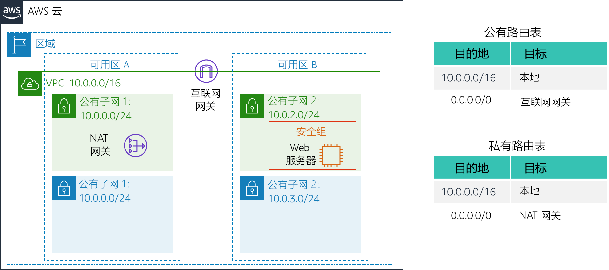
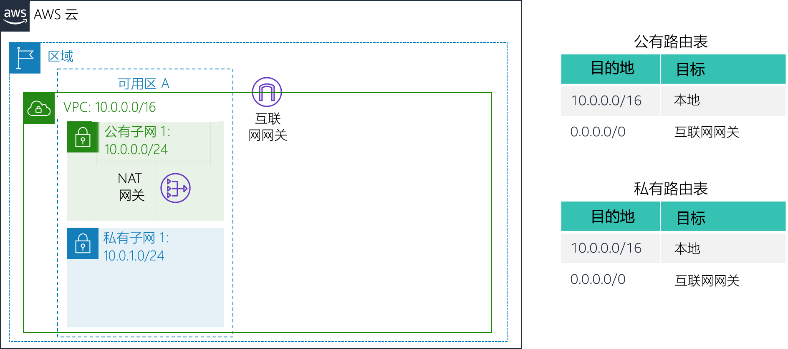
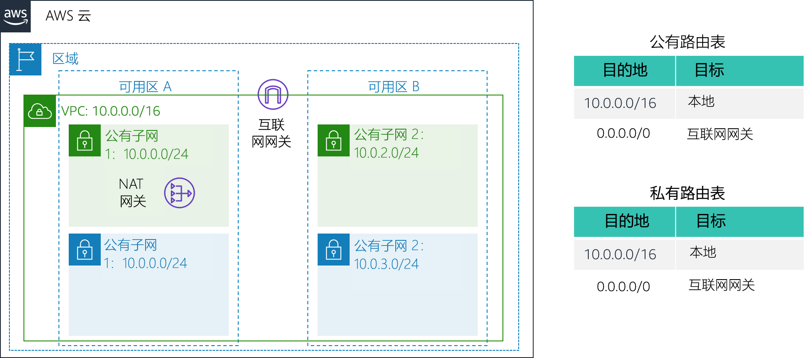

# 实验 2：构建 VPC 并启动 Web 服务器

<!-- Note to translators: This is based on Technical Essentials Lab 1. Copy the translation from there. Do not re-translate the whole document.-->

&nbsp;

**版本 4.6.6 (TESS1)**

在本实验中，您将使用 Amazon Virtual Private Cloud (VPC) 创建自己的 VPC，并向其添加其他组件以生成自定义网络。您还将为 EC2 实例创建安全组。然后，您将配置并自定义 EC2 实例以运行 Web 服务器，并在 VPC 中启动该实例。

**Amazon Virtual Private Cloud (Amazon VPC)** 允许您在已经定义的虚拟网络中启动 Amazon Web Services (AWS) 资源。这个虚拟网络与您在自己的数据中心中运行的传统网络极其相似，并会为您提供使用 AWS 的可扩展基础设施的优势。您可以创建跨多个可用区的 VPC。

&nbsp;

**场景**

在本实验中，您将构建以下基础设施：



&nbsp;&nbsp;

**目标**

完成本实验后，您可以：

- 创建 VPC。
- 创建子网。
- 配置安全组。
- 在 VPC 中启动 EC2 实例。

&nbsp;

**持续时间**

完成本实验大约需要 **30 分钟**。

&nbsp;&nbsp;
## 访问 AWS 管理控制台

1. 在这些说明的顶部，单击 <span id="ssb_voc_grey">Start Lab</span>（启动实验）启动您的实验。

   “Start Lab”（启动实验）面板随即会打开，其中显示了实验状态。

2. 请耐心等待，直到您看到“**Lab status: ready**”（实验状态：就绪）消息，然后单击 **X** 关闭“Start Lab”（启动实验）面板。

3. 在这些说明的顶部，单击 <span id="ssb_voc_grey">AWS</span>

   在您执行此操作后，AWS 管理控制台将会在一个新的浏览器标签页中打开。您将自动登录系统。

   **提示：**如果未打开新的浏览器选项卡，则您的浏览器顶部通常会出现一个横幅或图标，表明您的浏览器阻止该网站打开弹出窗口。单击横幅或图标，然后选择“Allow pop ups”（允许弹出窗口）。

4. 排列 AWS 管理控制台选项卡，使其与这些说明一起显示。理想情况下，您将能够同时看到这两个浏览器选项卡，以便更轻松地执行实验步骤。

&nbsp;
___
## 任务 1：创建 VPC

在本任务中，您将使用 VPC 向导在单个可用区中创建一个 VPC、一个互联网网关和两个子网。**互联网网关 (IGW)** 是一种 VPC 组件，借助此网关可在您的 VPC 与互联网之间进行通信。

创建 VPC 之后，您可以添加**子网**。每个子网都完全位于一个可用区内，不能跨可用区。如果一个子网的流量被路由到互联网网关，则这个子网便是*公有子网*。如果一个子网没有指向互联网网关的路由，则该子网称为*私有子网*。

向导还将创建一个 _NAT 网关_，用于向私有子网中的 EC2 实例提供互联网连接。

5. 在 **AWS 管理控制台**的 <span id="ssb_services">Services<i class="fas fa-angle-down"></i></span>（服务）菜单上，单击 **VPC**。

6. 单击 <span id="ssb_orange">Launch VPC Wizard</span>（启动 VPC 向导）

7. 在左侧导航窗格中，单击 **VPC with Public and Private Subnets**（带有公有子网和私有子网的 VPC），即第二个选项。

8. 单击 <span id="ssb_blue">Select</span>（选择），然后进行以下配置：

   - **VPC name**（VPC 名称）：`Lab VPC`
   - **Availability Zone**（可用区）：选择*第一个*可用区
   - **Public subnet name**（公有子网名称）：`Public Subnet 1`
   - **Availability Zone**（可用区）：选择*第一个*可用区（与上面使用的可用区相同）
   - **Private subnet name**（私有子网名称）：`Private Subnet 1`
   - **Elastic IP Allocation ID**（弹性 IP 地址分配 ID）：在框中单击并选择显示的 IP 地址

9. 单击 <span id="ssb_blue">Create VPC</span>（创建 VPC）

   向导将创建 VPC。

10. 完成后，单击 <span id="ssb_blue">OK</span>（确定）

   向导已在同一可用区预置带有公有子网和私有子网的 VPC，以及每个子网的路由表：



   &nbsp;

   公有子网的 CIDR 为 **10.0.0.0/24**，这意味着它包含所有以 **10.0.0.x** 开头的 IP 地址。

   私有子网的 CIDR 为 **10.0.1.0/24**，这意味着它包含所有以 **10.0.1.x** 开头的 IP 地址。

&nbsp;
___
## 任务 2：创建额外子网

在本任务中，您将在第二个可用区创建两个额外的子网。这对于在多个可用区中创建资源以实现_高可用性_非常有用。

11. 在左侧导航窗格中，单击 **Subnets**（子网）。

   首先，您将创建第二个公有子网。

12. 单击 <span id="ssb_blue">Create subnet</span>（创建子网），然后进行以下配置：

   - **Name tag**（名称标签）：`Public Subnet 2`
   - **VPC**：_Lab VPC_
   - **Availability Zone**（可用区）：选择*第二个*可用区
   - **IPv4 CIDR block**（IPv4 CIDR 块）：`10.0.2.0/24`

   该子网将具有所有以 **10.0.2.x** 开头的 IP 地址。

13. 单击 <span id="ssb_blue">Create</span>（创建），然后单击 <span id="ssb_blue">Close</span>（关闭）

   现在，您将创建第二个私有子网。

14. 单击 <span id="ssb_blue">Create subnet</span>（创建子网），然后进行以下配置：

   - **Name tag**（名称标签）：`Private Subnet 2`
   - **VPC**：_Lab VPC_
   - **Availability Zone**（可用区）：选择*第二个*可用区
   - **CIDR block**（CIDR 块）：`10.0.3.0/24`

   该子网将具有所有以 **10.0.3.x** 开头的 IP 地址。

15. 单击 <span id="ssb_blue">Create</span>（创建），然后单击 <span id="ssb_blue">Close</span>（关闭）

   现在，您将配置私有子网，以将流向互联网的流量路由到 NAT 网关，使得私有子网中的资源能够连接到互联网，同时仍然保持私有。这将通过配置一个_路由表_来完成。

   *路由表*包含一组规则，称为*路由*，用于确定网络流量的目的地。VPC 中的每个子网必须与一个路由表相关联；而路由表会控制此子网的路由。

16. 在左侧导航窗格中，单击 **Route Tables**（路由表）。

17. 选择<i class="far fa-check-square"></i>设置为 **Main = Yes**（主路由表 = 是）且 **VPC = Lab VPC** 的路由表。（如果需要查看 VPC 的名称，请展开 _VPC ID_ 列。）

18. 在下部窗格中，单击 **Routes**（路由）选项卡。

   请注意，**Destination 0.0.0.0/0**（目的地 0.0.0.0/0）设置为 **Target nat-xxxxxxxx**（目标 nat-xxxxxxxx）。这意味着指向互联网 (0.0.0.0/0) 的流量将首先发送到 NAT 网关，NAT 网关随后会将流量转发到互联网。

   因此，这个路由表将被用于路由来自私有子网的流量。现在，您可以为路由表添加名称，以便将来更易识别。

19. 在此路由表的 **Name**（名称）列中，单击铅笔图标 <i class="fas fa-pencil-alt"></i>，然后键入 `Private Route Table`，并单击 <i class="fas fa-check-circle"></i>

20. 在下部窗格中，单击 **Subnet Associations**（子网关联）选项卡。

   现在，您可以将此路由表关联到私有子网。

21. 单击 <span id="ssb_grey">Edit subnet associations</span>（编辑子网关联）

22. 选择 <i class="far fa-check-square"></i>**Private Subnet 1**（私有子网 1）和 **Private Subnet 2**（私有子网 2）。

   <i class="fas fa-comment"></i>您可以展开 _Subnet ID_（子网 ID）列来查看子网名称。

23. 单击 <span id="ssb_blue">Save</span>（保存）

   现在，您将配置公有子网使用的路由表。

24. 选择<i class="far fa-check-square"></i>设置为 **Main = No**（主路由表 = 否）且 **VPC = Lab VPC** 的路由表（并取消选择所有其他子网）。

25. 在此路由表的 **Name**（名称）列中，单击铅笔图标 <i class="fas fa-pencil-alt"></i>，然后键入 `Public Route Table`，并单击 <i class="fas fa-check-circle"></i>

26. 在下部窗格中，单击 **Routes**（路由）选项卡。

   请注意，**Destination 0.0.0.0/0**（目的地 0.0.0.0/0）设置为 **Target igw-xxxxxxxx**（目标 igw-xxxxxxxx），即互联网网关。这意味着，流向互联网的流量将通过互联网网关直接发送到互联网。

   现在，您需要将此路由表关联到公有子网。

27. 单击 **Subnet Associations**（子网关联）选项卡。

28. 单击 <span id="ssb_grey">Edit subnet associations</span>（编辑子网关联）

29. 选择 <i class="far fa-check-square"></i>**Public Subnet 1**（公有子网 1）和 **Public Subnet 2**（公有子网 2）。

30. 单击 <span id="ssb_blue">Save</span>（保存）

   VPC 现在配置有跨两个可用区的公有子网和私有子网：



&nbsp;
___
## 任务 3：创建 VPC 安全组

在本任务中，您将创建一个 VPC 安全组作为虚拟防火墙。在您启动某个实例时，会将一个或多个安全组与该实例相关联。您可以为每个安全组添加规则，以允许流经其关联实例的流量。

31. 在左侧导航窗格中，单击 **Security Groups**（安全组）。

32. 单击 <span id="ssb_orange">Create security group</span>（创建安全组），然后进行以下配置：

   - **Security group name**（安全组名称）：`Web Security Group`
   - **Description**（描述）：`Enable HTTP access`
   - **VPC**：_Lab VPC_

33. 在 **Inbound rules**（入站规则）窗格中，选择 <span id="ssb_white">Add rule</span>（添加规则）

34. 配置以下设置：

   - **Type**（类型）：_HTTP_
   - **Source**（源）：_Anywhere_（任何位置）
   - **Description**（描述）：`Permit web requests`

38. 滚动到页面底部，然后选择 <span id="ssb_orange">Create security group</span>（创建安全组）

   您将在下一个任务中启动 Amazon EC2 实例时使用此安全组。

&nbsp;
___
## 任务 4：启动 Web 服务器实例

在本任务中，您将在新的 VPC 中启动 Amazon EC2 实例。您可以将该实例配置为充当 Web 服务器。

39. 在 <span id="ssb_services">Services<i class="fas fa-angle-down"></i></span>（服务）菜单上，单击 **EC2**。

40. 单击 <span id="ssb_orange">Launch Instance<i class="fas fa-angle-down"></i></span>（启动实例），然后选择 <span id="ssb_white">Launch Instance</span>（启动实例）

   首先，您将选择一个 _Amazon 系统映像 (AMI)_，其中包含所需的操作系统。

41. 在 **Amazon Linux 2** 对应的行（位于顶部）中，单击 <span id="ssb_blue">Select</span>（选择）

   _Instance Type_（实例类型）定义了分配给实例的硬件资源。

42. 选择 _Type_（类型）列中显示的 **t2.micro**。

43. 单击 <span id="ssb_grey">Next: Configure Instance Details</span>（下一步：配置实例详细信息）

   现在，您将配置实例以在新 VPC 的公有子网中启动。

44. 配置以下设置：

   - **Network**（网络）：_Lab VPC_
   - **Subnet**（子网）：_Public Subnet 2_（公有子网 2）（_不是_私有子网！）
   - **Auto-assign Public IP**（自动分配公有 IP）：_Enable_（启用）

45. 展开 <i class="fas fa-caret-right"></i> **Advanced Details**（高级详细信息）部分（位于页面底部）。

46. 将以下代码复制并粘贴到 **User data**（用户数据）框中：

    ```bash
    #!/bin/bash
    # Install Apache Web Server and PHP
    yum install -y httpd mysql php
    # Download Lab files
    wget %% S3_HTTP_PATH_PREFIX %%/lab-app.zip
    unzip lab-app.zip -d /var/www/html/
    # Turn on web server
    chkconfig httpd on
    service httpd start
    ```

    此脚本将在实例首次启动时自动运行，并会加载和配置 PHP Web 应用程序。

47. 单击 <span id="ssb_grey">Next: Add Storage</span>（下一步：添加存储）

   您将使用默认的存储设置。

48. 单击 <span id="ssb_grey">Next: Add Tags</span>（下一步：添加标签）

   标签可用于识别资源。您将使用标签为实例分配名称。

49. 单击 <span id="ssb_grey">Add Tag</span>（添加标签），然后进行以下配置：

   - **Key**（键）：`Name`
   - **Value**（值）：`Web Server 1`

50. 单击 <span id="ssb_grey">Next: Configure Security Group</span>（下一步：配置安全组）

   您将配置实例以使用您之前创建的 _Web Security Group_。

51. 选择 <i class="far fa-dot-circle"></i> **Select an existing security group**（选择一个现有的安全组）

52. 选择 <i class="far fa-check-square"></i> **Web Security Group**。

   这是您在上一个任务中创建的安全组，允许通过 HTTP 访问实例。

53. 单击 <span id="ssb_blue">Review and Launch</span>（审核和启动）

54. 当出现*警告*，提示您无法通过端口 22 连接到实例时，请单击 <span id="ssb_blue">Continue</span>（继续）

55. 查看实例信息，然后单击 <span id="ssb_blue">Launch</span>（启动）

56. 在 **Select an existing keypair**（选择现有密钥对）对话框中，选择 <i class="far fa-check-square"></i> **I acknowledge...**（我确认...）。

57. 单击 <span id="ssb_blue">Launch Instances</span>（启动实例），然后单击 <span id="ssb_blue">View Instances</span>（查看实例）

58. 请耐心等待，直到 **Web Server 1** 的 **Status Checks**（状态检查）列显示 *2/2 checks passed*（2/2 已通过检查）。

   <i class="fas fa-comment"></i>该过程可能需要几分钟。每 30 秒单击一次右上角的刷新按钮 <i class="fas fa-sync"></i> 以查看最新动态。

   现在，您将连接到在 EC2 实例上运行的 Web 服务器。

59. 复制页面底部 **Description**（描述）选项卡中显示的 **Public DNS (IPv4)**（公有 DNS (IPv4)）值。

60. 打开一个新的 Web 浏览器选项卡，粘贴 **Public DNS**（公有 DNS）值，然后按 Enter 键。

   您应该会看到一个显示 AWS 徽标和实例元数据值的网页。

   您部署的完整架构是：


&nbsp;
___
## 实验完成

<i class="icon-flag-checkered"></i>恭喜！您已完成本实验。

61. 单击此页面顶部的 <span id="ssb_voc_grey">End Lab</span>（结束实验），然后单击 <span id="ssb_blue">Yes</span>（是）确认您要结束实验。

   此时将显示一个面板，指示“DELETE has been initiated...You may close this message box now.”（删除操作已启动...您现在可以关闭此消息框。）

62. 单击右上角的 **X** 关闭面板。

如有反馈、建议或更正，请发送电子邮件至：*aws-course-feedback@amazon.com*
