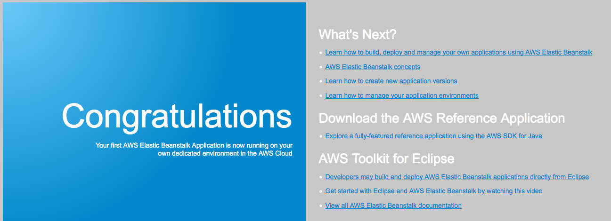

<header>

<link rel="stylesheet" href="https://use.fontawesome.com/releases/v5.5.0/css/all.css" integrity="sha384-B4dIYHKNBt8Bc12p+WXckhzcICo0wtJAoU8YZTY5qE0Id1GSseTk6S+L3BlXeVIU" crossorigin="anonymous">

<!-- Latest compiled and minified CSS -->
<link rel="stylesheet" href="https://maxcdn.bootstrapcdn.com/bootstrap/3.3.7/css/bootstrap.min.css" integrity="sha384-BVYiiSIFeK1dGmJRAkycuHAHRg32OmUcww7on3RYdg4Va+PmSTsz/K68vbdEjh4u" crossorigin="anonymous">

<!-- Optional theme -->
<link rel="stylesheet" href="https://maxcdn.bootstrapcdn.com/bootstrap/3.3.7/css/bootstrap-theme.min.css" integrity="sha384-rHyoN1iRsVXV4nD0JutlnGaslCJuC7uwjduW9SVrLvRYooPp2bWYgmgJQIXwl/Sp" crossorigin="anonymous">

<!-- Latest compiled and minified JavaScript -->

</header>

<!--include:Logo-->

# Aktivitas: AWS Elastic Beanstalk

<!-- Note to translators: This activity is unique to this course. -->

&nbsp;
&nbsp;
## Gambaran Umum

Kegiatan ini menyediakan akun Amazon Web Services (AWS) untuk Anda tempat lingkungan AWS Elastic Beanstalk telah dibuat sebelumnya untuk Anda. Anda akan menerapkan kode tersebut ke sana dan mengamati sumber daya AWS yang membentuk lingkungan Elastic Beanstalk.

&nbsp;

### Durasi

Diperlukan sekitar **30 menit** untuk menyelesaikan aktivitas ini.

&nbsp;
&nbsp;
## Mengakses AWS Management Console

1. Di bagian atas instruksi ini, klik Start Lab (Mulai Lab) untuk meluncurkan lab Anda.

   Panel **Start Lab** (Mulai Lab) terbuka, dan menampilkan status laboratorium.

2. Tunggu hingga Anda melihat pesan *Lab status: in creation* (Status lab: dalam pembuatan). Untuk menutup panel **Start Lab** (Mulai Lab), klik **X** .

3. Di bagian atas petunjuk ini, klik AWS

   AWS Management Console terbuka di tab browser baru. Secara otomatis, sistem ini akan memasukkan Anda.

   **Tips**: Jika tab browser baru tidak terbuka, spanduk atau ikon biasanya berada di bagian atas browser Anda, yang menunjukkan bahwa browser Anda mencegah situs web membuka jendela pop-up. Klik spanduk atau ikon lalu pilih **Allow pop ups.** (Izinkan pop-up).

4. Mengatur tab **AWS Management Console** agar ditampilkan bersama petunjuk ini. Idealnya, Anda akan dapat melihat kedua tab browser pada saat bersamaan, yang membuatnya lebih mudah untuk mengikuti langkah-langkah aktivitas.

&nbsp;
&nbsp;
## Tugas 1: Mengakses lingkungan Elastic Beanstalk

5. Di **AWS Management Console**, dari menu **Services** (Layanan) pilih **Elastic Beanstalk**.

   Halaman berjudul **All environments** (Semua lingkungan) akan terbuka, dan menunjukkan tabel yang berisi daftar rincian untuk aplikasi Elastic Beanstalk yang ada.

   **Catatan**: Jika status di kolom **Health** (Kondisi) tidak Hijau, status belum selesai memulai. Tunggu beberapa saat, dan status akan berubah menjadi Hijau.

6. Di bagian kolom **Environment name** (Nama lingkungan), klik pada nama lingkungan.

   Halaman **Dashboard** (Dasbor) untuk lingkungan Elastic Beanstalk Anda terbuka.

7. Perhatikan bahwa halaman menunjukkan bahwa kondisi aplikasi Anda Hijau (baik).

   Lingkungan Elastic Beanstalk siap meng-hosting aplikasi. Namun, kondisi ini belum menjalankan kode.

8. Di dekat bagian atas halaman, klik URL (URL berakhir di *elasticbeanstalk.com*).

   Saat Anda mengeklik tab URL, tab browser baru akan terbuka. Namun, Anda akan melihat bahwa tab menampilkan pesan *"HTTP Status 404 - Not Found"* . *Perilaku ini diharapkan* karena server aplikasi ini belum memiliki aplikasi yang berjalan di atasnya. Kembali ke konsol Elastic Beanstalk.

   Pada langkah berikutnya, Anda akan menerapkan kode di lingkungan Elastic Beanstalk Anda.

&nbsp;
&nbsp;
## Tugas 2: Menerapkan aplikasi sampel ke Elastic Beanstalk

9. Untuk mengunduh contoh aplikasi, klik tautan ini:
   https://docs.aws.amazon.com/elasticbeanstalk/latest/dg/samples/tomcat.zip

<!--the zip file is linked in this documentation page: https://docs.aws.amazon.com/elasticbeanstalk/latest/dg/java-getstarted.html-->

10. Kembali ke Dasbor Elastic Beanstalk, klik **Upload and Deploy** (Unggah dan Terapkan).

11. Klik **Browse or Choose File** (Jelajahi atau Pilih File), lalu arahkan dan buka file **java-tomcat-v3.zip** yang baru saja Anda unduh.

12. Klik **Deploy** (Terapkan).

   Ini akan memakan waktu satu atau dua menit untuk bagi Elastic Beanstalk untuk memperbarui lingkungan Anda dan menerapkan aplikasi.

   **Catatan**: Jika Anda melihat peringatan di halaman dasbor Elastic Beanstalk bahwa profil instans diperlukan untuk diintegrasikan dengan layanan AWS X-Ray, Anda dapat mengabaikan peringatan tersebut.

13. Setelah penerapan selesai, klik nilai URL di dekat bagian atas layar (atau, jika Anda masih memiliki tab browser yang menampilkan status 404, refresh halaman tersebut).

   Aplikasi web yang Anda gunakan akan tampil.

   Selamat, Anda telah berhasil menerapkan aplikasi pada Elastic Beanstalk!

14. Kembali di konsol Elastic Beanstalk, klik **Configuration** (Konfigurasi) di sebelah kiri.

   Perhatikan rincian di sini.

   Misalnya, di baris **Instance** (Instans) detail ini menunjukkan interval Pemantauan, grup keamanan EC2, dan detail jenis volume akar dari instans Amazon Elastic Compute Cloud (Amazon EC2) yang meng-hosting aplikasi web Anda.

15. Gulir ke bagian bawah halaman ke baris **Database**.

   Baris **Database** tidak memiliki detail apa pun apa pun karena lingkungan tidak termasuk database.

16. Dalam baris **Database**, klik **Edit**.

   Perhatikan bahwa Anda dapat dengan mudah menambahkan database ke lingkungan ini jika Anda ingin: Anda hanya perlu mengatur beberapa konfigurasi dasar dan klik **Apply** (Apply). (Namun, untuk tujuan kegiatan ini, Anda tidak perlu menambahkan database.)

17. Di panel sebelah kiri, klik **Monitoring** (Pemantauan).

   Jelajahi diagram untuk melihat jenis informasi yang tersedia untuk Anda.

&nbsp;
&nbsp;
## Tugas 3: Jelajahi sumber daya AWS yang mendukung aplikasi Anda

18. Dari menu **Services** (Layanan), pilih **EC2**

19. Klik **Instances** (Instans).

   Perhatikan bahwa dua instans berjalan (keduanya mengandung *samp* dalam nama mereka). Kedua instans mendukung aplikasi web Anda.

20. Jika Anda ingin terus menjelajahi sumber daya layanan Amazon EC2 yang diciptakan oleh Elastic Beanstalk, jangan ragu untuk mengeksplorasi mereka. Anda akan menemukan:

   - Sebuah *grup keamanan* dengan port 80 terbuka
   -  *Load balancer* yang menjadi tempat kedua instans tersebut
   - *Grup Auto Scaling* yang menjalankan dari dua hingga enam instans, tergantung beban jaringan

   Meskipun Elastic Beanstalk menciptakan sumber daya ini untuk Anda, Anda masih memiliki akses ke sana.

&nbsp;
&nbsp;
## Aktivitas selesai

<i class="icon-flag-checkered"></i> Selamat! Anda telah menyelesaikan aktivitas.

21. Di bagian atas halaman ini, klik End Lab (Akhiri Lab) di bagian atas halaman ini, kemudian untuk mengonfirmasi bahwa Anda ingin mengakhiri aktivitas, klik Yes (Ya).

   Panel akan muncul dengan pesan yang menunjukkan: *DELETE has been initiated...* (PENGHAPUSAN telah dimulai) *Anda dapat menutup kotak pesan ini sekarang.*

22. Untuk menutup panel, buka sudut kanan atas, lalu klik **X**.

Untuk tanggapan, saran, atau koreksi, silakan kirim email kepada kami di: *aws-course-feedback@amazon.com*

&nbsp;
&nbsp;
